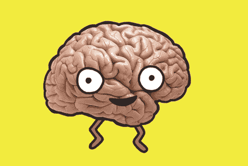
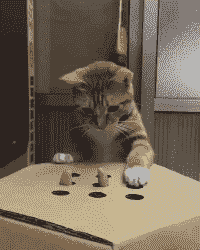
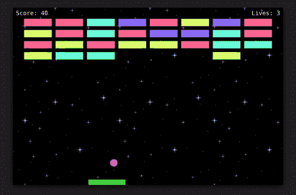
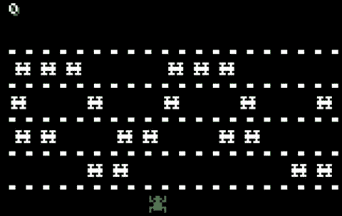
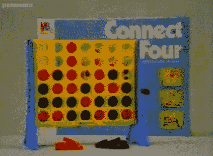
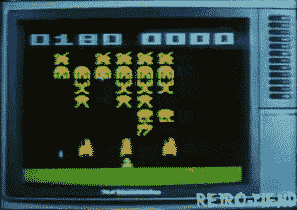

# 通过编写 7 个游戏来学习 JavaScript

> 原文：<https://www.freecodecamp.org/news/learn-javascript-by-coding-7-games/>

学习 JavaScript 的最好方法之一是创建项目。最好也是最有趣的方法之一就是创建游戏。

我们刚刚在 freeCodeCamp.org YouTube 频道上发布了一门课程，通过构建 7 个不同的复古游戏来帮助你学习 JavaScript。

ania ku bow 创建了这个课程。她在自己的频道和免费代码营 YouTube 频道上创建了许多受欢迎的课程。

您将学习如何创建以下游戏的克隆版本:

### 石头剪刀布

Scissors-scissors-scissors.

### 
记忆游戏

Dancing brain.

打地鼠

Kitten plays whack-a-mole.

### 
突围

Breakout game.

### 
青蛙

Original Frogger game.

### 
连接四个

Falling pieces.

### 
太空入侵者

Retro space invaders.

观看以下全部课程或在 freeCodeCamp.org YouTube 频道观看[(5 小时观看)。](https://youtu.be/ec8vSKJuZTk)

[https://www.youtube.com/embed/ec8vSKJuZTk?feature=oembed](https://www.youtube.com/embed/ec8vSKJuZTk?feature=oembed)