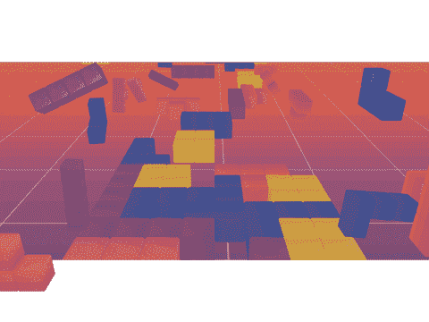

# 通过创建俄罗斯方块游戏学习 JavaScript

> 原文：<https://www.freecodecamp.org/news/learn-javascript-by-creating-a-tetris-game/>

构建真实世界的项目是学习编码的最好方法之一。如果你要建立一个项目，你最好让它成为有史以来最受欢迎和最有趣的游戏之一:俄罗斯方块。

[//commons.wikimedia.org/wiki/File:Tetris_theme.ogg?embedplayer=yes](//commons.wikimedia.org/wiki/File:Tetris_theme.ogg?embedplayer=yes)

*Some reading music. ?*

Ania Kubow 的这个视频课程将帮助你通过从头开始编写一个俄罗斯方块游戏来学习 JavaScript 的基础知识。对于以前从未接触过代码的人或者想复习基础知识的人来说，这是一个很棒的课程。

本课程没有涵盖 JavaScript 的每一个细节，但这是重点。它帮助你直接构建一个你能够玩的真正的游戏。

首先，您将学习如何使用 Atom 代码编辑器和命令提示工具从头开始建立一个项目。然后你将通过构建你自己的俄罗斯方块版本来获得对 JavaScript 的基本理解。在此过程中，您还将获得如何使用 HTML 和 CSS 的简要概述。在整个课程中，有讲解部分教授基本的 JavaScript 概念，如变量、函数、数组等等。这些讲解器部分从俄罗斯方块项目中抽出时间来深入研究一个特定的概念。它们包括图像和图表，以帮助您更好地理解概念。

此外，在某些部分的末尾，有多项选择题可以帮助您测试您的知识。

以下是您将在本课程中学到的一些 JavaScript 方法:

*   addEventListener()
*   查询选择器()
*   querySelectorAll()
*   键码()
*   Math.floor()
*   Math.random()
*   长度
*   forEach()
*   拼接()
*   clearInterval()
*   setInterval()
*   一些()
*   innerHTML()
*   每隔()
*   添加()
*   移除()
*   包含()

一旦你完成了这个课程，你就已经创建了你自己的可以玩的俄罗斯方块游戏。只是在玩游戏时要小心，因为玩电子游戏最长刑期的吉尼斯世界纪录涉及俄罗斯方块游戏。

你可以在下面或者 freeCodeCamp.org YouTube 频道 (1.5 小时观看)的[上观看课程。](https://www.youtube.com/watch?v=rAUn1Lom6dw)

[https://www.youtube.com/embed/rAUn1Lom6dw?feature=oembed](https://www.youtube.com/embed/rAUn1Lom6dw?feature=oembed)