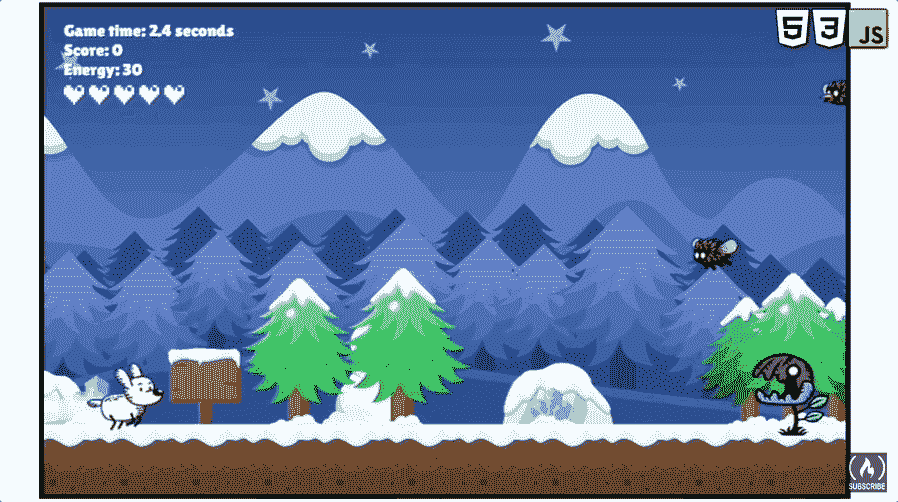

# 用 JavaScript 学习游戏开发

> 原文：<https://www.freecodecamp.org/news/learn-javascript-game-development-full-course/>

JavaScript 可以用来开发许多不同类型的游戏。用 JavaScript 创建的游戏几乎可以在任何装有网络浏览器的设备上运行。

我们刚刚在 freeCodeCamp.org YouTube 频道上发布了一个 10 小时的 JavaScript 游戏开发课程。你将学会用 HTML、CSS 和普通 JavaScript 制作 2D 游戏，不使用任何框架和库！

弗兰克·德沃夏克开发了这个课程。他在各种平台上创建了许多流行的 JavaScript 课程。Frank 擅长用普通的 JavaScript 和 HTML 画布进行创造性编码。

Frank 会在一个小的独立代码库上一步一步地教你解释每一项技术，然后他会教你使用你所学的一切来制作一个单一的最终游戏。

You will create this game in the course.

本课程由 9 个独立的项目组成。在这一系列的项目中，你将学到制作你自己的 2D 动画游戏所需的一切，从精灵动画到国家管理。

以下是本课程中的专题和部分:

*   项目 1:香草 JavaScript 精灵动画技术
*   项目 2:视差背景
*   项目 3:敌人的移动模式
*   矩形之间的碰撞检测
*   圆之间的碰撞检测
*   项目 4:来自精灵表的碰撞动画
*   项目 5:瞄准射击游戏
*   项目 6:敌人的多样性
*   项目 7:带移动支持的侧滚游戏
*   项目 8:国家管理
*   项目 9:最终无休止的跑步者游戏的所有功能

观看下面的完整课程或在 freeCodeCamp.org YouTube 频道观看[(10 小时观看)。](https://youtu.be/GFO_txvwK_c)

[https://www.youtube.com/embed/GFO_txvwK_c?feature=oembed](https://www.youtube.com/embed/GFO_txvwK_c?feature=oembed)