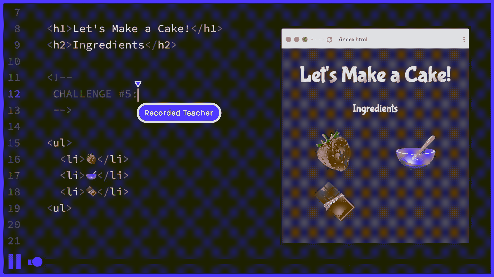
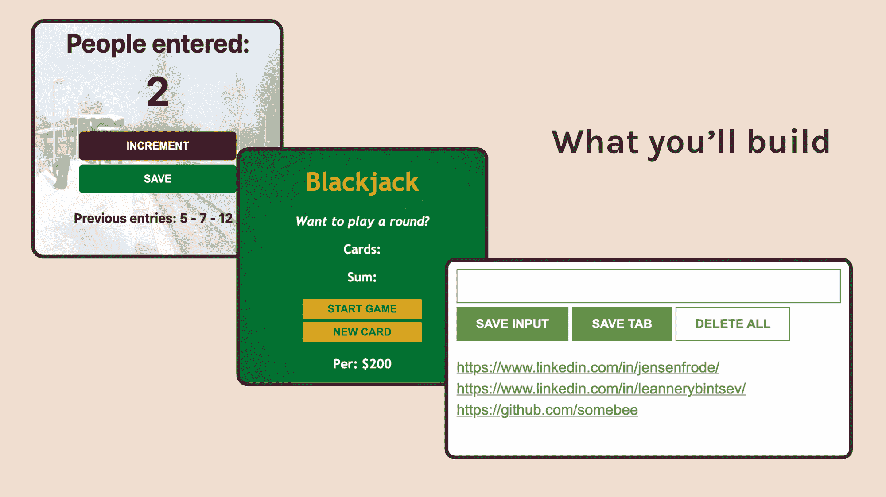

# 学习 JavaScript——7 小时免费互动教程

> 原文：<https://www.freecodecamp.org/news/learn-javascript-interactive-course/>

在过去的四个月里，我记录了可能是有史以来最具互动性的 JavaScript 课程。

我这样做的原因是因为我经常看到新的程序员在尝试学习 JavaScript 时一次又一次地陷入同样的陷阱，其中最危险的是这三个👇

*   无法从*观看* JS 教程到*构建* JS 项目🛠
*   因为厌倦而失去动力🥱
*   因为学习曲线太陡而无法前进🧗

然而，似乎很少有课程足够重视这些陷阱。因此，这门课程是为任何在学习 JavaScript 时遇到过上述问题的人开设的。

在这篇文章中，我将解释[课程](https://scrimba.com/learn/learnjavascript?utm_source=freecodecamp.org&utm_medium=referral&utm_campaign=learn_javascript_fcc_article)是如何运作的，这样你就可以决定它是否适合你。

或者，你可以从这篇文章开始观看整个课程。只需点击下方嵌入截屏中的播放按钮👇

[https://scrimba.com/learn/learnjavascript/welcome-to-the-course-c87pv3hK](https://scrimba.com/learn/learnjavascript/welcome-to-the-course-c87pv3hK)

## 为什么超交互性很重要

该课程围绕 140 多个互动挑战展开。这意味着狂看它毫无意义。它的全部目的是*让你编码，*建立你的 JavaScript 肌肉记忆。为了实现这一目标，你必须解决这些挑战。

不过不要担心——每个挑战都是字节大小的，解决起来很快，所以你会觉得自己进步很快。

使用常规视频很难实现这种程度的交互性，因为在整个课程中，您需要在视频播放器和代码编辑器之间切换 140 多次。更不用说为许多挑战打开新的启动文件了。

为了解决这个问题，我用 Scrimba 创建了这个课程，让体验更加流畅。

当你在一个*稀松布里的时候，*你可以在*观看*老师的解释和*编写*自己的解决方案之间快速切换。

想象一下，如果 VS 代码和视频格式有一个孩子。那是斯克林巴。你可以看到教程*和*在同一个框架内编辑代码。

人们在看到之前往往很难理解什么是*稀松布*，所以我建议[观看这段 1 分钟的*稀松布*来了解它。](https://scrimba.com/scrim/c8gp4WfE)

## “即时”学习

本课程与大多数其他 JavaScript 课程不同的另一点是，它将理论课程均匀地分布在整个课程中。在你需要学习的时候，不要提前一秒钟。

这意味着在你开始构建项目之前，你不会得到冗长而无聊的关于抽象概念的讲座。

相反，我们将一头扎进建设项目。当我们遇到障碍时，我会向你们介绍我们需要的理论来克服它。这样你会直观的明白为什么需要学习理论。

但是，不要被忽悠的以为我们会跳过任何理论。我的课程和其他优秀的 JavaScript 课程一样，都经历了同样重要的理论。但是，它不是完全挤压在前面，而是从头到尾均匀地展开。只是在你需要学习的时候。

## 做中学

理论和实践的紧密结合意味着你的大部分时间将会花在构建产品上。下面是您将构建的三个项目:

### 项目 1:乘客柜台

您将从构建一个乘客计数器应用程序开始。这可能看起来像是一个有点做作的例子，但是在我 19 岁的时候，在地铁里数乘客是我真正的全职工作。

这是这款应用的简单介绍:

[https://scrimba.com/scrim/co2614d6890ec26cd3fdafdbc](https://scrimba.com/scrim/co2614d6890ec26cd3fdafdbc)

这里重要的是你从第一天开始就在构建一个实际的产品。您正在将 JavaScript 与 HTML 和 CSS 结合起来，这样您就可以在浏览器中的真实用户界面环境中学习 JavaScript。

这比简单地在控制台上看到你的输出有趣多了。虽然这增加了一点复杂性，但这是值得的。

### 项目 2:21 点

接下来，您将构建您的第一个 JavaScript 游戏——21 点！

[https://scrimba.com/scrim/coa954d1fb213d2a9d5a1c8ab](https://scrimba.com/scrim/coa954d1fb213d2a9d5a1c8ab)

这是你第一次会编码一些同样可以娱乐你的东西，我认为这很重要。

21 点是有史以来最具标志性的赌场游戏之一，这标志着你进入游戏开发世界的第一步。

### 项目 2: Chrome 扩展

最后，您将构建一个 Chrome 扩展，我们将把它部署到您的 Chrome 浏览器中，这样您就可以在野外使用它了。这是令人兴奋的，因为你会真正理解你在这一点上获得的超能力。

这个扩展叫做“线索追踪”，是销售代表的一个工具。它允许他们浏览网页，收集有希望的线索。

请查看它的介绍，了解更多信息:

[https://scrimba.com/scrim/co85441e3b6bd2c9eeee218bf](https://scrimba.com/scrim/co85441e3b6bd2c9eeee218bf)

### 练习部分

在每个项目部分之后，我会用专门的挑战部分对你的知识进行压力测试。这也会给你必要的重复，你需要为了进展到下一个项目。我试图让所有的挑战尽可能真实，这样解决起来才有趣。

如果你很难解决这些挑战，那么我建议你也重新看看项目部分的 scrims。所以这些部分是课程进展的入口。

### 您现在就可以免费注册

我希望这给了你所需要的背景知识，以便决定你是否愿意尝试这个课程。它是 100%免费的，并且将永远免费。有兴趣的话，只要点击[这个链接](https://scrimba.com/learn/learnjavascript?utm_source=freecodecamp.org&utm_medium=referral&utm_campaign=learn_javascript_fcc_article)就可以马上上手。

最后，如果您愿意帮助我们推广课程，您可以转发我的发布推文。这也将让你有机会获得全年所有 Scrimba 课程。

> 🔥我的免费 7 小时初级 JavaScript 课程终于出来了！这是 IMHO 有史以来最具互动性的 JS 课程，有 140+个挑战。
> 
> 为了庆祝，我会给转发这条推文的随机一个人一年的 [@scrimba](https://twitter.com/scrimba?ref_src=twsrc%5Etfw) 订阅(价值 150 美元)🎁[https://t.co/F5vmNwmCxQ](https://t.co/F5vmNwmCxQ)
> 
> — Per Harald Borgen (@perborgen) [May 20, 2021](https://twitter.com/perborgen/status/1395359456335106048?ref_src=twsrc%5Etfw)