# 在 3 小时内学会 Kubernetes:编排容器的详细指南

> 原文：<https://www.freecodecamp.org/news/learn-kubernetes-in-under-3-hours-a-detailed-guide-to-orchestrating-containers-114ff420e882/>

为什么银行要花大价钱给我买像 Kubernetes 这样简单的东西？任何人——任何人都可以在三个小时内学会？

如果你怀疑我，我挑战你给它一个尝试！到本文结束时，您将能够在 Kubernetes 集群上运行基于微服务的应用程序。我保证这一点，因为这是我向我们的客户介绍 Kubernetes 的方式。

Rinor，本指南与其他资源有什么不同？

挺多的！大多数指南都从简单的东西开始:Kubernetes 概念和 kubectl 命令。这些指南假设读者了解应用程序开发、微服务和 Docker 容器。

在本文中，我们将从:

1.  在计算机上运行基于微服务的应用程序。
2.  为微服务应用程序的每个服务构建容器映像。
3.  Kubernetes 简介。将基于微服务的应用部署到 Kubernetes 托管集群中。

这种逐渐的积累提供了一个凡人理解库伯内特斯的简单性所需要的深度。是的，Kubernetes 很简单，只要你知道它的使用环境。事不宜迟，让我们看看我们将建立什么。

### 应用程序演示

该应用程序有一个功能。它以一个句子作为输入。使用文本分析，计算句子的情感。

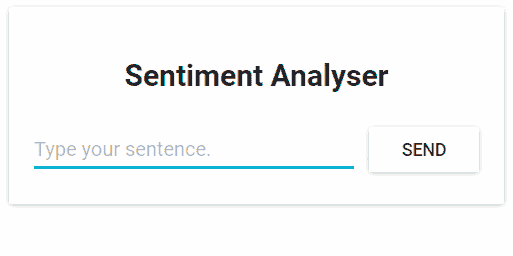

Fig. 1\. Sentiment Analysis Web App

从技术角度来看，该应用程序由三个微服务组成。每个都有一个特定的功能:

*   **SA-Frontend:****为我们的 ReactJS** 静态**文件服务的 Nginx web 服务器。**
*   **SA-WebApp:** 一个 Java Web 应用，**处理来自前端的请求**。
*   **SA-Logic:****执行情感分析的 python 应用**。

重要的是要知道微服务不是孤立存在的，它们支持“关注点分离”,但是它们仍然需要相互交互。


Fig. 2\. Data flow in the Sentiment Analysis WebApp

这种交互最好通过显示数据在它们之间的流动来说明:

1.  客户端应用程序请求 index.html(它反过来请求 ReactJS 应用程序的捆绑脚本)
2.  与应用程序交互的用户触发对 Spring WebApp 的请求。
3.  Spring WebApp 将情感分析请求转发给 Python 应用程序。
4.  Python 应用程序计算情感并将结果作为响应返回。
5.  Spring WebApp 将响应返回给 React app。(然后将信息呈现给用户。)

所有这些应用程序的代码都可以在这个存储库中找到。我建议立即克隆它，因为我们将一起创造惊人的东西。

### 1.在您的计算机上运行基于微服务的应用

我们需要启动所有三个服务。先说最吸引人的一个，前端应用。

#### 建立 React 促进地方发展

要启动 React 应用程序，您需要在计算机上安装 NodeJS 和 NPM。安装后，用你的终端导航到目录 **sa-frontend。**键入以下命令:

```
npm install
```

这会下载 React 应用程序的所有 Javascript 依赖项，并将它们放在文件夹 **node_modules 中。**(依赖关系在 package.json 文件中定义)。解决所有依赖关系后，执行下一个命令:

```
npm start
```

就是这样！我们启动了 react 应用程序，默认情况下，您可以在 **localhost:3000 上访问它。**您可以随意修改代码，并立即在浏览器上看到效果。这是通过使用**热模块更换实现的。**这使得前端开发变得轻而易举！

#### 让我们的 React 应用产品做好准备

对于生产，我们需要将应用程序构建到静态文件中，并使用 web 服务器为它们提供服务。

要构建 React 应用程序，在您的终端中导航到 **sa-frontend** 目录。然后执行以下命令:

```
npm run build
```

这将在项目树中生成一个名为 **build** 的文件夹。该文件夹包含 ReactJS 应用程序所需的所有静态文件。

#### 用 Nginx 服务静态文件

安装并启动 Nginx WebServer ( [how to](https://www.nginx.com/resources/wiki/start/topics/tutorials/install/) )。然后将 sa-frontend/build 文件夹的内容移动到[*your _ nginx _ installation _ dir*/**html。**

这样，生成的 index.html 文件将可以在[*your _ nginx _ installation _ dir*]/html/index . html 中访问。T **这是 Nginx 提供的默认文件**。

默认情况下，Nginx 服务器监听端口 80。您可以通过更新文件[*your _ nginx _ installation _ dir*]/conf/nginx . conf 中的 server.listen 属性来指定不同的端口。

打开浏览器并点击端点 localhost:80，看到 ReactJS 应用程序出现。

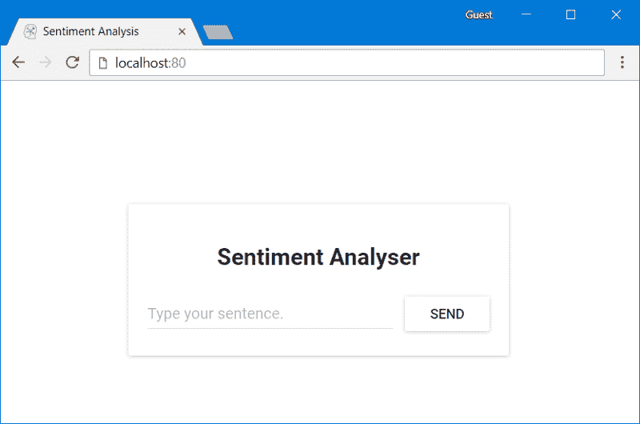

Fig. 3\. React app served from Nginx

在字段中键入:“键入您的句子。”按下发送按钮将会失败，并显示 404 错误(您可以在浏览器控制台中查看)。但是为什么呢？让我们检查代码。

#### 检查代码

在文件 **App.js** 中，我们可以看到按下 Send 按钮触发了 analyzeSentence 方法。这个方法的代码如下所示。(用#Number 注释的每一行将在脚本下面解释):

```
analyzeSentence() {
    fetch('http://localhost:8080/sentiment', {  // #1
        method: 'POST',
        headers: {
            'Content-Type': 'application/json'
        },
        body: JSON.stringify({
                       sentence: this.textField.getValue()})// #2
    })
        .then(response => response.json())
        .then(data => this.setState(data));  // #3
}
```

#1:进行 POST 调用的 URL。(应用程序应该监听该 URL 上的调用)。

#2:发送到该应用程序的请求正文如下所示:

```
{
    sentence: “I like yogobella!”
}
```

#3:响应更新组件状态。这将触发组件的重新渲染。如果我们收到数据(即包含键入的句子和极性的 JSON 对象)，我们将显示组件 polarityComponent，因为条件将被满足，我们将定义组件:

```
const polarityComponent = this.state.polarity !== undefined ?
    <Polarity sentence={this.state.sentence} 
              polarity={this.state.polarity}/> :
    null;
```

一切似乎都是正确的。但是我们遗漏了什么？如果您猜测我们没有在 localhost:8080 上设置任何监听内容，那么您是正确的！我们必须启动我们的 Spring Web 应用程序来监听那个端口！

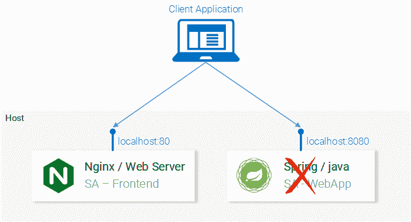

Fig. 4\. Microservice Spring WebApp missing

#### 设置 Spring Web 应用程序

要启动 Spring 应用程序，您需要安装 JDK8 和 Maven。(还需要设置它们的环境变量)。安装完这些之后，您可以继续下一部分。

#### 将应用程序打包到一个罐子中

在您的终端中导航到目录 **sa-webapp** 并键入以下命令:

```
mvn install
```

这将在目录 **sa-webapp 中生成一个名为 **target、**的文件夹。**在文件夹**目标**中，我们将 Java 应用程序打包成一个 jar: ' **情感分析-web-0.0.1-SNAPSHOT.jar**

#### 启动我们的 Java 应用程序

导航到目标目录，使用命令启动应用程序:

```
java -jar sentiment-analysis-web-0.0.1-SNAPSHOT.jar
```

织补..我们出错了。我们的应用程序在启动时失败，我们唯一的线索是堆栈跟踪中的异常:

```
Error creating bean with name 'sentimentController': Injection of autowired dependencies failed; nested exception is java.lang.IllegalArgumentException: Could not resolve placeholder 'sa.logic.api.url' in value "${sa.logic.api.url}"
```

这里的重要信息是**sensitive controller**中的占位符 sa.logic.api.url。我们去看看！

### 检查代码

```
@CrossOrigin(origins = "*")
@RestController
public class SentimentController {

    @Value("${sa.logic.api.url}")    // #1
    private String saLogicApiUrl;

    @PostMapping("/sentiment")
    public SentimentDto sentimentAnalysis(
        @RequestBody SentenceDto sentenceDto) 
    {
        RestTemplate restTemplate = new RestTemplate();

        return restTemplate.postForEntity(
                saLogicApiUrl + "/analyse/sentiment",    // #2
                sentenceDto, SentimentDto.class)
                .getBody();
    }
}
```

1.  **感知控制器**有一个名为 saLogicApiUrl 的字段。字段 get 由属性`sa.logic.api.url`定义。
2.  字符串 saLogicApiUrl 与值“/分析/情绪”连接在一起。它们一起构成了请求情感分析的 URL。

**定义属性**

在 Spring 中默认的属性源是 **application.properties.** (位于*sa-web app/src/main/resources*)。但这不是定义属性的唯一方法，也可以使用前面的命令来完成:

```
java -jar sentiment-analysis-web-0.0.1-SNAPSHOT.jar 
     --sa.logic.api.url=WHAT.IS.THE.SA.LOGIC.API.URL
```

该属性应该用定义 Python 应用程序运行位置的值进行初始化，这样我们就可以让 Spring Web 应用程序知道在运行时将消息转发到哪里。

为了使事情更简单，让我们决定我们将在`localhost:5000.`上运行 python 应用程序，不要忘记这一点！

运行下面的命令，我们准备好移动到最后一个服务 python 应用程序。

```
java -jar sentiment-analysis-web-0.0.1-SNAPSHOT.jar 
     --sa.logic.api.url=http://localhost:5000
```

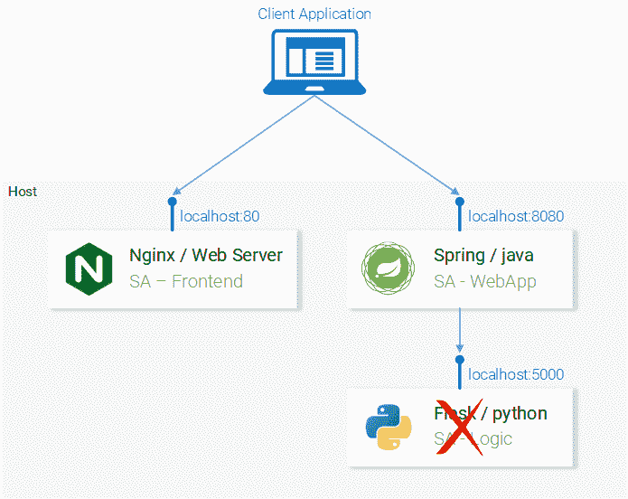

#### 设置 Python 应用程序

要启动 Python 应用程序，我们需要安装 Python3 和 Pip。(还需要设置它们的环境变量)。

#### 安装依赖项

在终端中导航到目录**sa-logic/sa**([repo](https://github.com/rinormaloku/k8s-mastery))**，并键入以下命令:**

```
`python -m pip install -r requirements.txt
python -m textblob.download_corpora`
```

#### **启动应用程序**

**使用 Pip 安装完依赖项后，我们就可以通过执行以下命令来启动应用程序了:**

```
`python sentiment_analysis.py
* Running on http://0.0.0.0:5000/ (Press CTRL+C to quit)`
```

**这意味着我们的应用程序正在本地主机的端口 5000 上运行并侦听 HTTP 请求。**

#### **检查代码**

**让我们研究一下代码，以了解在 **SA 逻辑** python 应用程序中发生了什么。**

```
`from textblob import TextBlob
from flask import Flask, request, jsonify

app = Flask(__name__)                                   #1

@app.route("/analyse/sentiment", methods=['POST'])      #2
def analyse_sentiment():
    sentence = request.get_json()['sentence']           #3
    polarity = TextBlob(sentence).sentences[0].polarity #4
    return jsonify(                                     #5
        sentence=sentence,
        polarity=polarity
    )

if __name__ == '__main__':
    app.run(host='0.0.0.0', port=5000)                #6`
```

1.  **实例化 Flask 对象。**
2.  **定义可以发出 POST 请求的路径。**
3.  **从请求体中提取“句子”属性。**
4.  **实例化一个匿名 TextBlob 对象，从第一句话中获取极性。(我们只有一个)。**
5.  **将包含句子和极性的响应返回给调用者。**
6.  **运行 flask 对象 **app** 来监听 0.0.0.0:5000 上的请求(对 localhost:5000 的调用也会到达这个 app)。**

**服务被设置为相互通信。在 localhost:80 中重新打开前端，让他们在继续之前尝试一下！**

**

Fig. 6\. Microservice architecture completed** 

**在下一节中，我们将讨论如何在 Docker 容器中启动服务，因为这是能够在 Kubernetes 集群中运行它们的先决条件。**

### **2.为每个服务构建容器映像**

**Kubernetes 是一个容器管弦乐队。可以理解，我们需要容器来编排它们。但是什么是容器呢？这可以从 docker 的文档中得到最好的回答。**

> **容器映像是一个轻量级的、独立的、可执行的软件包，包含了运行它所需的一切:代码、运行时、系统工具、系统库、设置。基于 Linux 和 Windows 的应用程序都可以使用容器化软件，无论环境如何，容器化软件都可以运行。**

**这意味着容器可以在任何计算机上运行——甚至是在生产服务器上— **,没有任何差异**。**

**为了便于说明，让我们比较一下使用虚拟机和容器如何服务 React 应用程序。**

#### **从虚拟机提供 React 静态文件**

**使用虚拟机的缺点:**

1.  **资源效率低下，每个虚拟机都有成熟操作系统的开销。**
2.  **它依赖于平台。在您的计算机上工作的可能在生产服务器上不工作。**
3.  **与容器相比，重量大且缩放速度慢。**

**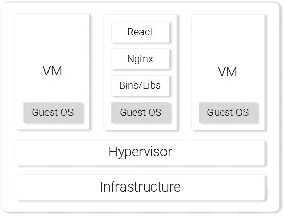

Fig. 7\. Nginx web server with static files on a VM** 

#### **从容器中提供 React 静态文件**

**使用容器的好处。**

1.  **资源高效，在 Docker 的帮助下使用主机操作系统。**
2.  **独立于平台。您在计算机上运行的容器可以在任何地方工作。**
3.  **使用图像层的轻量级。**

**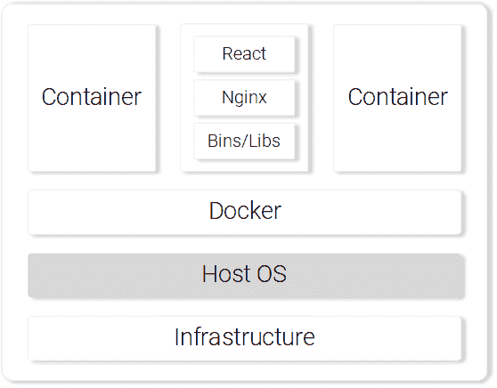

Fig. 8\. Nginx web server serving static files in a Container** 

**这些是使用容器最突出的特点和好处。更多信息请继续阅读 [Docker 文档](https://www.docker.com/what-container)。**

#### **为 React 应用程序构建容器映像(Docker 简介)**

**Docker 容器的基本构建块是. Docker 文件。**Docker 文件**从一个基本容器映像开始，然后是一系列关于如何构建一个满足应用程序需求的新容器映像的指令。**

**在我们开始定义 Dockerfile 之前，让我们记住使用 nginx 服务 react 静态文件的步骤:**

1.  **构建静态文件(npm 运行构建)**
2.  **启动 nginx 服务器**
3.  **将 sa-frontend 项目中的 **build** 文件夹的内容复制到 nginx **/** html 中。**

**在下一节中，您将注意到创建容器与我们在本地 React 设置中所做的相似之处。**

#### **定义 SA 前端的 docker 文件**

**SA 前端 docker 文件中的说明只是一个两步任务。这是因为 Nginx 团队为我们提供了一个 Nginx 的基础映像，我们将用它来构建。这两个步骤是:**

1.  **从基础开始 **Nginx 图像****
2.  **将 **sa-frontend/build** 目录复制到容器 nginx **/** html 目录。**

**转换成 docker 文件，它看起来像:**

```
`FROM nginx
COPY build /usr/share/nginx/html`
```

**是不是很神奇，它甚至是人类可读的，让我们概括一下:**

**从 nginx 映像开始。(不管那边的家伙做了什么)。将 **build** 目录复制到镜像中的 **nginx/html** 目录。就是这样！**

**您可能想知道，我是如何知道将构建文件复制到哪里的？即`/usr/share/nginx/html`。很简单:它被记录在 Docker Hub 的 nginx [图像](https://hub.docker.com/_/nginx/)中。**

#### **构建和推动容器**

**在推送图像之前，我们需要一个容器注册中心来托管图像。Docker Hub 是一个免费的云容器服务，我们将在本次演示中使用它。在继续之前，您有三项任务:**

1.  **安装坞站 CE**
2.  **注册到 Docker Hub。**
3.  **通过在终端中执行以下命令登录:**

```
`docker login -u="$DOCKER_USERNAME" -p="$DOCKER_PASSWORD"`
```

**完成上述任务后，导航至目录 **sa-frontend。**然后执行以下命令(用您的 docker hub 用户名替换$DOCKER_USER_ID。例如用于 rinormaloku/情感分析前端)**

```
`docker build -f Dockerfile -t $DOCKER_USER_ID/sentiment-analysis-frontend .`
```

**我们可以删除`-f Dockerfile`,因为我们已经在包含 Dockerfile 的目录中。**

**要推送图像，请使用 docker push 命令:**

```
`docker push $DOCKER_USER_ID/sentiment-analysis-frontend`
```

**在 docker hub 存储库中验证映像是否已成功推送。**

#### **运行容器**

**现在`$DOCKER_USER_ID/sentiment-analysis-frontend`中的图像可以由任何人提取和运行:**

```
`docker pull $DOCKER_USER_ID/sentiment-analysis-frontend
docker run -d -p 80:80 $DOCKER_USER_ID/sentiment-analysis-frontend`
```

**我们的 Docker 容器正在运行！**

**在我们继续之前，让我们详细说明一下我感到困惑的 80:80:**

*   **第一个 80 是主机(即我的电脑)的端口**
*   **第二个 80 代表呼叫应该转发到的集装箱端口。**

**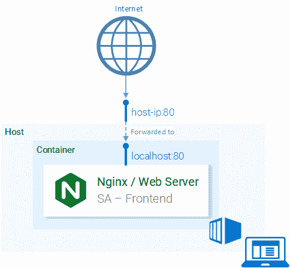

Fig. 9\. Port Mapping of Host to Container** 

**它从<hostport>映射到<containerport>。这意味着对主机端口 80 的调用应该映射到容器的端口 80，如图 9 所示。</containerport></hostport>**

**因为端口是在主机(您的计算机)的端口 80 上运行的，所以应该可以在 localhost:80 上访问它。如果没有原生 docker 支持，可以在 <docker-machine ip="">:80 打开应用。找到您的对接机 ip ex `ecute docker-mach` ine ip</docker-machine>**

**试试看！您应该能够访问该端点中的 react 应用程序。**

#### **码头区**

**我们之前看到为 SA-Frontend 构建映像很慢，对不起，**非常慢**。这是因为**构建上下文**必须发送到 Docker 守护进程。更详细地说，**构建上下文**目录是由 docker 构建命令中的最后一个参数(尾部的点)定义的，它指定了构建上下文。在我们的例子中，它包括以下文件夹:**

```
`sa-frontend:
|   .dockerignore
|   Dockerfile
|   package.json
|   README.md
+---build
+---node_modules
+---public
\---src`
```

**但是我们需要的唯一数据在**构建**文件夹中。上传其他任何东西都是浪费时间。我们可以通过删除其他目录来缩短构建时间。这就是`.dockerignore`发挥作用的地方。对你来说这很熟悉，因为它就像`.gitignore`，即在`.dockerignore`文件中添加所有你想忽略的目录，如下所示:**

```
`node_modules
src
public`
```

**`.dockerignore`文件应该与 docker 文件在同一个文件夹中。现在构建图像只需几秒钟。**

**让我们继续 Java 应用程序。**

#### **为 Java 应用程序构建容器映像**

**你猜怎么着！您几乎学到了创建容器图像的所有知识！这就是为什么这部分特别短的原因。**

**打开 **sa-webapp** 中的 Dockerfile，你会发现只有两个新的关键词:**

```
`ENV SA_LOGIC_API_URL http://localhost:5000
…
EXPOSE 8080`
```

**关键字 **ENV** 在 docker 容器中声明了一个环境变量。这将使我们能够在启动容器时为情感分析 API 提供 URL。**

**此外，关键字 **EXPOSE** 公开了我们稍后想要访问的端口。**但是嘿！！！**我们在 SA-Frontend 的 docker 文件中没有这样做，接得好！这仅用于文档目的，换句话说，它将作为阅读 other 文件的人的信息。**

**您应该熟悉构建和推送容器映像。如果出现任何困难，请阅读 **sa-webapp** 目录中的 README.md 文件。**

#### **为 Python 应用程序构建容器映像**

**在 **sa-logic** 的 Dockerfile 中没有新的关键字。现在你可以称自己为码头工人了？。**

**要构建和推送容器映像，请阅读 **sa-logic** 目录中的 README.md。**

#### **测试容器化的应用程序**

**你能相信你没有测试过的东西吗？我也不能。让我们测试一下这些容器。**

1.  **运行 **sa-logic** 容器并配置监听端口 5050:**

```
`docker run -d -p 5050:5000 $DOCKER_USER_ID/sentiment-analysis-logic`
```

**2.运行 **sa-webapp 容器**并配置监听端口 8080，另外我们需要通过覆盖环境变量 SA_LOGIC_API_URL 来更改 python 应用监听的端口。**

```
`$ docker run -d -p 8080:8080 -e SA_LOGIC_API_URL='http://<container_ip or docker machine ip>:5000' $DOCKER_USER_ID/sentiment-analysis-web-app`
```

**查看[自述文件](https://github.com/rinormaloku/k8s-mastery/blob/master/sa-webapp/README.md)了解如何获取集装箱 ip 或码头机器 ip。**

**3.运行**sa-前端**容器:**

```
`docker run -d -p 80:80 $DOCKER_USER_ID/sentiment-analysis-frontend`
```

**我们完了。在 **localhost:80 上打开浏览器。****

****注意:**如果您更改了 sa-webapp 的端口，或者如果您正在使用 docker-machine ip，您需要在方法 analyzeSentence 中更新 **sa-frontend** 中的 App.js 文件，以便从新的 ip 或端口获取。之后，您需要构建并使用更新后的映像。**

**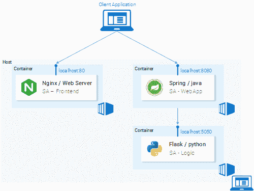

Fig. 10\. Microservices running in Containers** 

#### **脑筋急转弯——为什么是 Kubernetes？**

**在本节中，我们学习了 Docker 文件，如何使用它来构建映像，以及将映像推送到 Docker 注册表的命令。此外，我们研究了如何通过忽略无用文件来减少发送到构建上下文的文件数量。最后，我们让应用程序从容器中运行。那么为什么是 Kubernetes 呢？我们将在下一篇文章中对此进行更深入的研究，但我想留给您一个难题。**

*   **我们的情绪分析网络应用成为世界热门，我们突然每分钟有一百万次请求来分析情绪，我们在 **sa-webapp** 和 **sa-logic** 上经历了巨大的负载。我们如何扩展容器？**

### **忽必烈的概论**

**我保证，我并没有夸大，在文章结束时，你会问自己“为什么我们不称之为超级巨星？”。**

**

Fig. 11\. Supernetes** 

**如果您从一开始就阅读了这篇文章，那么您会发现我们涵盖了如此多的领域和知识。你可能担心这将是最难的部分，但是，这是最简单的。学习 Kubernetes 令人生畏的唯一原因是因为“其他一切”,我们已经很好地介绍了这一点。**

### **What is Kubernetes**

**在我们从容器开始微服务后，我们有一个问题，让我们以问答的形式进一步阐述:
**问:**我们如何扩展容器？
**答:**我们又旋转起来一个。
**问:**我们如何在它们之间分担负载？如果服务器已经被最大限度地使用，而我们的容器需要另一个服务器，该怎么办？我们如何计算最佳硬件利用率？
**答:**嗯……嗯……(让我谷歌一下)。
**问:**滚动更新不破坏任何东西？如果我们这样做，我们怎么能回到工作版本。**

**Kubernetes 解决了所有这些问题(以及更多！).我试图用一句话来概括 Kubernetes:“Kubernetes 是一个容器编排器，它抽象了底层基础设施。(容器运行的位置)”。**

**我们对容器编排有一个模糊的概念。我们将在本文的后续部分看到它的实践，但这是我们第一次读到“抽象底层基础设施”。所以让我们来一个特写镜头，在这一个。**

#### **抽象底层基础设施**

**Kubernetes 通过为我们提供一个简单的 API 来抽象底层基础设施，我们可以向该 API 发送请求。这些要求促使 Kubernetes 尽最大努力满足这些要求。例如，它就像请求“Kubernetes 旋转图像 x 的 4 个容器”一样简单。然后，Kubernetes 将找到未充分利用的节点，在这些节点中它将旋转新的容器(参见图 12。).**

**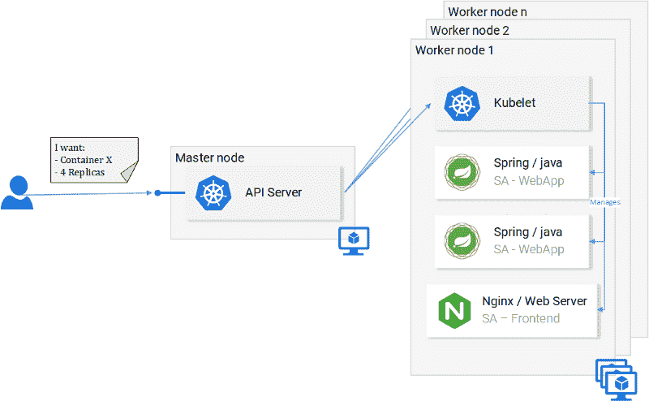

Fig. 12\. Request to the API Server** 

**这对开发者意味着什么？他不必关心节点的数量，容器从哪里开始，以及它们如何通信。他不处理硬件优化，也不担心节点停机(它们会停机*墨菲定律*)，因为新节点可以添加到 Kubernetes 集群中。与此同时，Kubernetes 将加速其他仍在运行的节点中的容器。它尽最大可能做到这一点。**

**在图 12 中，我们可以看到一些新的东西:**

*   **API 服务器:我们与集群交互的唯一方式。无论是启动或停止另一个容器(err *pods)还是检查当前状态、日志等。**
*   ****Kubelet** :监控节点内部的容器(err *pods)并与主节点通信。**
*   ***** pod**:最初只是把 pod 当做容器。**

**我们将在这里停下来，因为深入研究只会放松我们的注意力，我们以后总是可以这样做，有一些有用的资源可供学习，如官方文档(艰难的方式)或阅读令人惊叹的书 [Kubernetes in Action](https://www.amazon.com/Kubernetes-Action-Marko-Luksa/dp/1617293725) ，作者[马尔科·卢克萨](https://twitter.com/markoluksa)。**

#### **标准化云服务提供商**

**Kubernetes 强调的另一个优点是，它标准化了云服务提供商(CSP)。这是一个大胆的说法，但让我们用一个例子来详细说明:**

**–Azure、谷歌云平台或其他 CSP 领域的专家最终会在一个全新的 CSP 中从事一个项目，而且他没有使用它的经验。举几个例子，这会有很多后果:他可能错过最后期限；公司可能需要雇佣更多的资源，等等。**

**相比之下，使用 Kubernetes，这根本不是问题。因为无论使用什么 CSP，您都将对 API 服务器执行相同的命令。你以声明的方式从 API 服务器**请求你想要的东西。** Kubernetes 抽象出并实现了相关 CSP 的 **how** 。**

**给它一点时间让它理解——这是一个非常强大的功能。对该公司而言，这意味着他们不再局限于 CSP。他们在另一个 CSP 上计算费用，然后继续前进。他们仍将拥有专业知识，仍将拥有资源，而且他们可以以更低的成本做到这一点！**

**综上所述，在下一节中，我们将把 Kubernetes 付诸实践。**

### **实践中的 Kubernetes 豆荚**

**我们将微服务设置为在容器中运行，这是一个繁琐的过程，但很有效。我们还提到，这种解决方案不可扩展或缺乏弹性，而 Kubernetes 解决了这些问题。在本文的后续部分，我们将向图 13 所示的最终结果迁移我们的服务，其中容器由 Kubernetes 编排。**

**

Fig. 13\. Microservices running in a Kubernetes Managed Cluster** 

**在本文中，我们将使用 Minikube 进行本地调试，尽管将要展示的所有内容在 Azure 和 Google 云平台中也可以工作。**

### **安装和启动 Minikube**

**遵循官方文件安装 [Minikube](https://kubernetes.io/docs/tasks/tools/install-minikube/) 。在 Minikube 安装过程中，您还将安装 **Kubectl。**这是一个向 Kubernetes API 服务器发出请求的客户端。**

**要启动 Minikube，请执行命令`minikube start`,完成后，执行 kubectl get nodes，您应该会得到以下输出**

```
`kubectl get nodes
NAME       STATUS    ROLES     AGE       VERSION
minikube   Ready     <none>    11m       v1.9.0`
```

**Minikube 为我们提供了一个只有一个节点的 Kubernetes 集群，但是请记住，我们并不关心有多少个节点，Kubernetes 将其抽象出来，这对我们学习 Kubernetes 来说并不重要。在下一节中，我们将从我们的第一个 Kubernetes 资源[DRUM ROLLS]**Pod**开始。**

#### **分离舱**

**我喜欢容器，现在你也喜欢容器了。那么，为什么 Kubernetes 决定给我们 Pods 作为最小的可部署计算单元呢？豆荚是做什么的？Pods 可以由一个甚至一组共享相同执行环境的容器组成。**

**但是我们真的需要在一个容器中运行两个容器吗？环境资源管理（Environmental Resources Management 的缩写）..通常，你只运行一个容器，这就是我们在例子中要做的。但是对于某些情况，例如两个容器需要共享卷，或者它们使用进程间通信相互通信，或者以其他方式紧密耦合，那么使用 **Pods** 就可以做到这一点。Pods 使之成为可能的另一个特性是，我们不依赖于 Docker 容器，如果需要，我们可以使用其他技术，例如 [Rkt](https://coreos.com/rkt/) 。**

**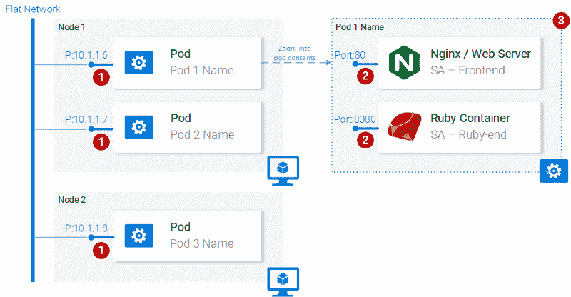

**Fig. 14\. Pod properties**** 

**总而言之，pod 的主要属性是(也如图 14 所示):**

1.  **每个 pod 在 Kubernetes 集群中都有一个唯一的 IP 地址**
2.  **Pod 可以有多个容器。容器共享相同的端口空间，因此它们可以通过本地主机进行通信(可以理解，它们不能使用相同的端口)，并且与其他 pod 的容器的通信必须结合 pod ip 来完成。**
3.  **pod 中的容器共享相同的卷*、相同的 ip、端口空间、IPC 命名空间。**

***容器有自己独立的文件系统，尽管它们能够使用 Kubernetes 资源**卷共享数据。****

**这些信息足够我们继续下去了，但是为了满足你的好奇心，请查看官方文档。**

### **Pod 定义**

**下面我们有第一个 pod **sa-frontend** 的清单文件，下面我们解释所有的要点。**

```
`apiVersion: v1
kind: Pod                                            # 1
metadata:
  name: sa-frontend                                  # 2
spec:                                                # 3
  containers:
    - image: rinormaloku/sentiment-analysis-frontend # 4
      name: sa-frontend                              # 5
      ports:
        - containerPort: 80                          # 6`
```

1.  ****Kind:** 指定我们想要创建的 Kubernetes 资源的种类。在我们的例子中，一个**吊舱**。**
2.  ****名称:**定义资源的名称。我们把它命名为 **sa-frontend** 。**
3.  ****Spec** 是定义资源所需状态的对象。Pods 规范最重要的属性是容器的数组。**
4.  ****Image** 是我们希望在此 pod 中开始的容器图像。**
5.  ****名称**是 pod 中容器的唯一名称。**
6.  ****容器端口:**是容器监听的端口。这只是给读者一个提示(去掉端口并不限制访问)。**

### **创建 SA 前端窗格**

**您可以在`resource-manifests/**sa-frontend-pod.yaml.**`中找到上述 pod 定义的文件，您可以在终端中导航到该文件夹，也可以在命令行中提供完整的位置。然后执行命令:**

```
`kubectl create -f sa-frontend-pod.yaml
pod "sa-frontend" created`
```

**要检查 Pod 是否正在运行，请执行以下命令:**

```
`kubectl get pods
NAME                          READY     STATUS    RESTARTS   AGE
sa-frontend                   1/1       Running   0          7s`
```

**如果它仍然在**容器创建**中，当 Pod 处于运行状态时，您可以执行上述带有参数`--watch`的命令来更新信息。**

#### **从外部访问应用程序**

**为了从外部访问应用程序，我们创建了一个类型为 **Service** 的 Kubernetes 资源，这将是我们的下一篇文章，这是一个合适的实现，但是为了快速调试，我们有另一个选项，那就是端口转发:**

```
`kubectl port-forward sa-frontend 88:80
Forwarding from 127.0.0.1:88 -> 80`
```

**在 **127.0.0.1:88** 中打开您的浏览器，您将进入 react 应用程序。**

#### **扩大规模的错误方式**

**我们说过 Kubernetes 的主要特性之一是可伸缩性，为了证明这一点，让我们运行另一个 pod。为此，使用以下定义创建另一个 pod 资源:**

```
`apiVersion: v1
kind: Pod                                            
metadata:
  name: sa-frontend2      # The only change
spec:                                                
  containers:
    - image: rinormaloku/sentiment-analysis-frontend 
      name: sa-frontend                              
      ports:
        - containerPort: 80`
```

**通过执行以下命令创建新的 pod:**

```
`kubectl create -f sa-frontend-pod2.yaml
pod "sa-frontend2" created`
```

**通过执行以下命令，验证第二个单元是否正在运行:**

```
`kubectl get pods
NAME                          READY     STATUS    RESTARTS   AGE
sa-frontend                   1/1       Running   0          7s
sa-frontend2                  1/1       Running   0          7s`
```

**现在我们有两个豆荚在运行！**

****注意:**这不是最终的解决方案，有很多瑕疵。我们将在另一个 Kubernetes 资源**部署**部分对此进行改进。**

#### **Pod 摘要**

**包含静态文件的 Nginx web 服务器运行在两个不同的 pod 中。现在我们有两个问题:**

*   **我们如何对外公开它，使它可以通过 URL 访问，以及**
*   **我们如何在它们之间实现负载平衡？**

**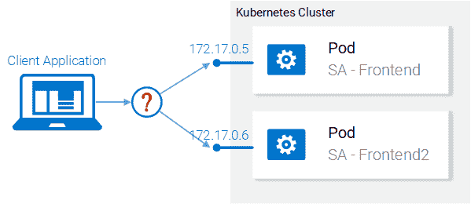

Fig. 15\. Load balancing between pods** 

**Kubernetes 为我们提供了**服务**资源。让我们直接进入下一部分。**

### **实践中的 Kubernetes 服务**

**Kubernetes **服务**资源充当一组提供相同功能服务的 pod 的入口点。如图 16 所示，该资源承担了发现服务和服务间负载平衡的重任。**

**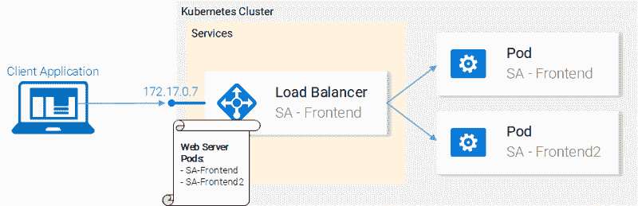

Fig. 16\. Kubernetes Service maintaining IP addresses** 

**在我们的 Kubernetes 集群中，我们将拥有具有不同功能服务的 pod。(前端、Spring WebApp 和 Flask Python 应用)。所以问题来了，服务如何知道哪些 pod 是目标？即，它如何为 pod 生成端点列表？**

**这是使用**标签**完成的，并且是一个两步过程:**

1.  **将标签应用到我们希望我们的服务定位的所有 pod 上**
2.  **对我们的服务应用一个“选择器”,这样就定义了哪些标签窗格是目标。**

**这在视觉上要简单得多:**

**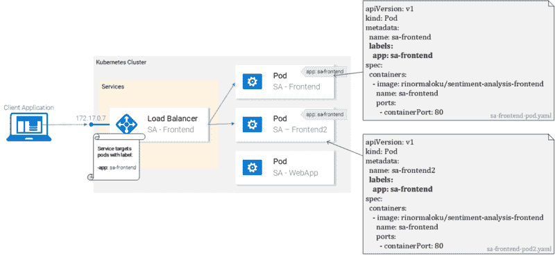

Fig. 17\. Pods with labels and their manifests** 

**我们可以看到，pod 被标记为“app: sa-frontend ”,服务的目标是带有该标签的 pod。**

#### **标签**

**标签为组织 Kubernetes 资源提供了一种简单的方法。它们代表一个键值对，可以应用于每个资源。修改 pod 的清单，以匹配图 17 中所示的示例。**

**完成更改后保存文件，并使用以下命令应用它们:**

```
`kubectl apply -f sa-frontend-pod.yaml
Warning: kubectl apply should be used on resource created by either kubectl create --save-config or kubectl apply
pod "sa-frontend" configured
kubectl apply -f sa-frontend-pod2.yaml 
Warning: kubectl apply should be used on resource created by either kubectl create --save-config or kubectl apply
pod "sa-frontend2" configured`
```

**我们收到一个警告(应用而不是创建，收到)。在第二行中，我们看到配置了 pod“sa-frontend”和“sa-frontend2”。我们可以通过筛选要显示的窗格来验证这些窗格是否已贴上标签:**

```
`kubectl get pod -l app=sa-frontend
NAME           READY     STATUS    RESTARTS   AGE
sa-frontend    1/1       Running   0          2h
sa-frontend2   1/1       Running   0          2h`
```

**另一种验证我们的 pod 被标记的方法是将标志`--show-labels`附加到上面的命令。这将显示每个 pod 的所有标签。
太好了！我们的豆荚是有标签的，我们已经准备好为他们提供服务。让我们开始定义如图 18 所示的 LoadBalancer 类型的服务。**

**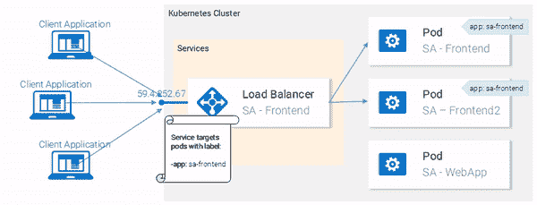

Fig. 18\. Load balancing with the LoadBalancer Service** 

### **服务定义**

**负载平衡器服务的 YAML 定义如下所示:**

```
`apiVersion: v1
kind: Service              # 1
metadata:
  name: sa-frontend-lb
spec:
  type: LoadBalancer       # 2
  ports:
  - port: 80               # 3
    protocol: TCP          # 4
    targetPort: 80         # 5
  selector:                # 6
    app: sa-frontend       # 7`
```

1.  ****种类:**某服务。**
2.  ****Type:** Specification type，我们选择 LoadBalancer 是因为我们希望在 pod 之间平衡负载。**
3.  ****Port:** 指定服务获取请求的端口。**
4.  ****协议:**定义通信。**
5.  ****目标端口:**转发传入请求的端口。**
6.  ****选择器:**包含用于选择窗格的属性的对象。**
7.  ****app:** sa-frontend 定义以哪些 pod 为目标，只有标有“app: sa-frontend”的 pod**

**要创建服务，请执行以下命令:**

```
`kubectl create -f service-sa-frontend-lb.yaml
service "sa-frontend-lb" created`
```

**您可以通过执行以下命令来检查服务的状态:**

```
`kubectl get svc
NAME             TYPE           CLUSTER-IP      EXTERNAL-IP   PORT(S)        AGE
sa-frontend-lb   LoadBalancer   10.101.244.40   <pending>     80:30708/TCP   7m`
```

****外部 IP** 处于挂起状态(不要等待，因为它不会改变)。这仅仅是因为我们正在使用 **Minikube** 。如果我们在像 Azure 或 GCP 这样的云提供商中执行，我们将获得一个公共 IP，这使得我们的服务可以在全球范围内访问。**

**尽管如此，Minikube 并没有让我们挂它提供了一个有用的命令用于本地调试，执行以下命令:**

```
`minikube service sa-frontend-lb
Opening kubernetes service default/sa-frontend-lb in default browser...`
```

**这将打开指向服务 IP 的浏览器。服务收到请求后，会将调用转发到其中一个 pod(哪个无所谓)。这种抽象使我们能够将服务作为一个入口点，将众多的 pod 作为一个单元来查看和操作。**

#### **服务摘要**

**在本节中，我们讨论了标记资源，在服务中使用这些资源作为选择器，并且定义和创建了一个负载平衡器服务。这满足了我们的需求，以服务为切入点，扩展应用程序(只需添加新的标签单元)并在单元之间实现负载平衡。**

### **实践中的 Kubernetes 部署**

**Kubernetes 部署帮助我们在每个应用程序的生命周期中保持不变，那就是**改变**。此外，唯一不变的应用程序是那些已经死亡的应用程序，虽然没有，但是新的需求将会出现，更多的代码将会被发布，它将会被打包和部署。在这个过程的每一步，都有可能出错。**

**部署资源自动执行从应用程序的一个版本转移到下一个版本的过程，零停机时间，并且在出现故障时，它使我们能够快速回滚到以前的版本。**

#### **实际部署**

**目前，我们有**两个 pod**和**一个服务**公开它们并在它们之间进行负载平衡(参见图 19。).我们提到单独部署分离舱远非完美。它需要分别管理每个组件(创建、更新、删除和监控它们的运行状况)。快速更新和快速回滚是不可能的！这是不可接受的，而**部署** Kubernetes 资源解决了这些问题。**

**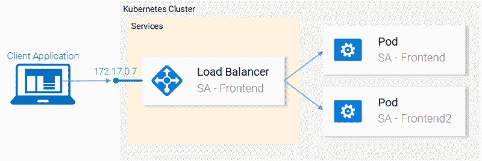

Fig. 19\. Current state** 

**在我们继续之前，让我们陈述我们想要实现的目标，因为这将为我们提供一个概述，使我们能够理解部署资源的清单定义。我们想要的是:**

1.  **图像的两个豆荚——情感分析——前端**
2.  **零停机部署，**
3.  **标有`**app:** sa-frontend`的 pod，以便服务被服务 **sa-frontend-lb 发现。****

**在下一节中，我们将把需求转化为部署定义。**

### **部署定义**

**实现上述所有要点的 YAML 资源定义:**

```
`apiVersion: apps/v1
kind: Deployment                                          # 1
metadata:
  name: sa-frontend
spec:
  selector:                                               # 2
    matchLabels:
      app: sa-frontend                                    
  replicas: 2                                             # 3
  minReadySeconds: 15
  strategy:
    type: RollingUpdate                                   # 4
    rollingUpdate: 
      maxUnavailable: 1                                   # 5
      maxSurge: 1                                         # 6
  template:                                               # 7
    metadata:
      labels:
        app: sa-frontend                                  # 8
    spec:
      containers:
        - image: rinormaloku/sentiment-analysis-frontend
          imagePullPolicy: Always                         # 9
          name: sa-frontend
          ports:
            - containerPort: 80`
```

1.  ****种类:**一次部署。**
2.  ****选择器:**与选择器匹配的 pod 将被纳入该部署的管理之下。**
3.  ****Replicas** 是 deployments Spec 对象的一个属性，它定义了我们想要运行多少 pod。所以只有两个。**
4.  ****Type** 指定从当前版本迁移到下一版本时，在此部署中使用的策略。战略**滚动更新**确保零停机部署。**
5.  ****MaxUnavailable** 是 RollingUpdate 对象的一个属性，它指定在进行滚动更新时所允许的最大不可用窗格数(与所需状态相比)。对于我们有 2 个副本的部署，这意味着在终止一个单元后，我们仍有一个单元在运行，这样可以保持我们的应用程序可访问。**
6.  ****MaxSurge** 是 RollingUpdate 对象的另一个属性，它定义了添加到部署中的最大 pod 数量(与所需状态相比)。对于我们的部署，这意味着当迁移到新版本时，我们可以添加一个单元，最多可以同时添加 3 个单元。**
7.  ****Template:** 指定部署将用于创建新 pod 的 pod 模板。很可能与豆荚的相似之处立刻打动了你。**
8.  **`**app:** sa-frontend`用于由此模板创建的窗格的标签。**
9.  ****ImagePullPolicy** 当设置为 **Always** 时，it**将在每次重新部署时提取容器图像。****

**老实说，那堵文字墙甚至让我感到困惑，让我们从这个例子开始吧:**

```
`kubectl apply -f sa-frontend-deployment.yaml
deployment "sa-frontend" created`
```

**像往常一样，让我们验证一切都按计划进行:**

```
`kubectl get pods
NAME                           READY     STATUS    RESTARTS   AGE
sa-frontend                    1/1       Running   0          2d
sa-frontend-5d5987746c-ml6m4   1/1       Running   0          1m
sa-frontend-5d5987746c-mzsgg   1/1       Running   0          1m
sa-frontend2                   1/1       Running   0          2d`
```

**我们有 4 个运行单元，两个由部署创建，另外两个是我们手动创建的。使用命令`kubectl delete pod <pod-name>`删除我们手动创建的。**

****练习:**删除部署中的一个单元，看看会发生什么。在阅读下面的解释之前，请思考原因。**

****解释:**删除一个 pod 使部署注意到当前状态(1 个 pod 运行)与期望状态(2 个 pod 运行)不同，因此它启动另一个 pod。**

**那么，除了保持期望的状态，部署还有什么好处呢？先说好处。**

#### **好处#1:实现零停机部署**

**我们的产品经理带着一个新要求来找我们，我们的客户希望在前端有一个绿色按钮。开发人员发布了他们的代码，并为我们提供了我们唯一需要的东西，容器映像`rinormaloku/sentiment-analysis-frontend:green`。现在轮到我们了，我们 DevOps 必须推出一个零停机部署，努力工作会有回报吗？让我们看看！**

**通过更改容器图像来编辑文件`sa-frontend-deployment.yaml`，以引用新图像:`rinormaloku/sentiment-analysis-frontend:green`。将更改保存为`sa-frontend-deployment-green.yaml`，并执行以下命令:**

```
`kubectl apply -f sa-frontend-deployment-green.yaml --record
deployment "sa-frontend" configured`
```

**我们可以使用以下命令检查卷展栏的状态:**

```
`kubectl rollout status deployment sa-frontend
Waiting for rollout to finish: 1 old replicas are pending termination...
Waiting for rollout to finish: 1 old replicas are pending termination...
Waiting for rollout to finish: 1 old replicas are pending termination...
Waiting for rollout to finish: 1 old replicas are pending termination...
Waiting for rollout to finish: 1 old replicas are pending termination...
Waiting for rollout to finish: 1 of 2 updated replicas are available...
deployment "sa-frontend" successfully rolled out`
```

**根据结果，部署已经展开。它是以这样一种方式完成的，复制品一个接一个地被替换。这意味着我们的应用程序一直在运行。在我们继续之前，让我们验证更新是实时的。**

#### **验证部署**

**让我们在浏览器上实时查看更新。执行我们在`minikube service sa-frontend-lb`之前使用的相同命令，打开浏览器。我们可以看到按钮被更新了。**

**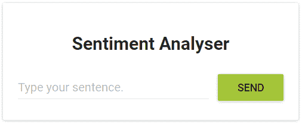

Fig. 20\. The Green button** 

#### **“滚动更新”的幕后**

**在我们应用了新的部署之后，Kubernetes 将新旧状态进行了比较。在我们的例子中，新状态请求两个带有图像`rinormaloku/sentiment-analysis-frontend:green.`的窗格，这不同于当前运行的状态，因此它在 **RollingUpdate** 中启动。**

**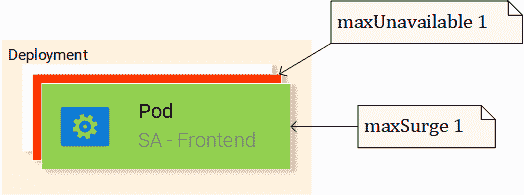

Fig. 21\. RollingUpdate replacing pods** 

**RollingUpdate 根据我们指定的规则运行，这些规则是“ **maxUnavailable:** 1”和“ **maxSurge:** 1”。这意味着部署只能终止一个 pod，并且只能启动一个新的 pod。重复该过程，直到所有的荚都被替换(见图 21)。**

**让我们继续福利 2。**

****免责声明:** *出于娱乐目的，下篇写成中篇小说。***

#### **好处#2:回滚到以前的状态**

**产品经理跑进你的办公室，他正面临一场危机！**

**“应用程序在生产中有一个严重的错误！！“立即恢复到以前的版本”——产品经理喊道。**

**他看到了你的冷静，没有眨一下眼睛。你转向你心爱的终端，输入:**

```
`kubectl rollout history deployment sa-frontend
deployments "sa-frontend"
REVISION  CHANGE-CAUSE
1         <none>         
2         kubectl.exe apply --filename=sa-frontend-deployment-green.yaml --record=true`
```

**您简单看了一下以前的部署。"上一个版本有问题，而前一个版本运行良好？"—你去问产品经理。**

**“是的，你在听我说话吗！”—产品经理尖叫道。**

**你不理他，你知道你要做什么，你开始输入:**

```
`kubectl rollout undo deployment sa-frontend --to-revision=1
deployment "sa-frontend" rolled back`
```

**您刷新页面，更改被撤消！**

**产品经理们惊讶得目瞪口呆。**

**你扭转了局面！**

***结束了！***

**是的……那是一部无聊的中篇小说。在 Kubernetes 存在之前，它要好得多，我们有更多的戏剧，更高的强度，并且持续了更长的时间。哦，美好的旧时光！**

**大多数命令都是不言自明的，除了一个您必须自己解决的细节。为什么第一个版本有一个**变化-原因**的<无>同时第二个版本**有一个变化-** CAUS *E 的" ku bectl . exe apply–filename = sa-frontend-deployment-gree**n**。YAML–recor*d = true "。**

**如果你认为这是因为我们在应用新图像时使用的`--record`标志，那么你完全正确！**

**在下一节中，我们将使用到目前为止学到的概念来完成整个架构。**

### **Kubernetes 和实践中的其他一切**

**我们了解了完成架构所需的所有资源，这就是为什么这一部分会很快。在图 22 中，我们用灰色标出了所有我们还需要做的事情。让我们从底层开始:**部署 sa 逻辑部署**。**

**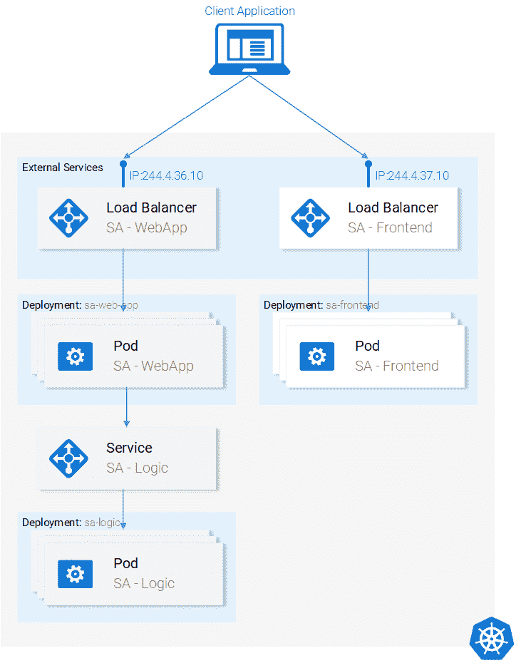

Fig. 22\. Current Application State** 

#### **部署 SA 逻辑**

**在终端中导航到 resource-manifest 文件夹，并执行以下命令:**

```
`kubectl apply -f sa-logic-deployment.yaml --record
deployment "sa-logic" created`
```

**部署 SA-Logic 创建了三个 pod。(运行我们的 python 应用程序的容器)。它用`**app:** sa-logic.`标记它们。这个标记使我们能够使用 SA-Logic 服务中的选择器来定位它们。请花些时间打开文件`sa-logic-deployment.yaml`并检查其内容。**

**这是重复使用的相同概念，让我们直接进入下一个资源:**服务 SA 逻辑**。**

#### **服务服务协议逻辑**

**让我们详细说明为什么我们需要这项服务。我们的 Java 应用程序(运行在 SA-web app 部署的 pod 中)依赖于 Python 应用程序完成的情感分析。但是现在，与我们在本地运行一切的时候相比，我们没有一个单独的 python 应用程序监听一个端口，我们有 2 个 pod，如果需要，我们可以有更多。**

**这就是为什么我们需要一个**服务**“作为一组提供相同功能服务的 pod 的入口点”。这意味着我们可以使用服务 SA-Logic 作为所有 SA-Logic pod 的入口点。**

**让我们这样做:**

```
`kubectl apply -f service-sa-logic.yaml
service "sa-logic" created`
```

****更新的应用程序状态:**我们有 2 个 pods(包含 Python 应用程序)正在运行，我们有 SA-Logic 服务作为入口点，我们将在 SA-WebApp pods 中使用它。**

**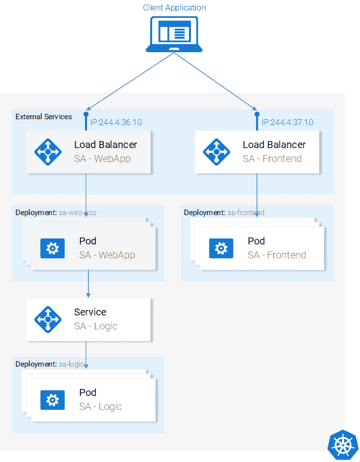

Fig. 23\. Updated Application State** 

**现在我们需要使用部署资源来部署 SA-WebApp pods。**

#### **部署 SA-WebApp**

**我们已经掌握了部署的诀窍，尽管这个还有一个特性。如果你打开文件`sa-web-app-deployment.yaml`，你会发现这部分是新的:**

```
`- image: rinormaloku/sentiment-analysis-web-app
  imagePullPolicy: Always
  name: sa-web-app
  env:
    - name: SA_LOGIC_API_URL
      value: "http://sa-logic"
  ports:
    - containerPort: 8080`
```

**我们感兴趣的第一件事是 **env** 属性是做什么的？我们推测它在我们的 pod 中用值“ [http://sa-logic](http://sa-logic/) ”声明了环境变量 SA_LOGIC_API_URL。但是为什么我们要将其初始化为 [**http://sa-logic**](http://sa-logic/) ，什么是 **sa-logic** ？**

**让我们来认识一下 **kube-dns** 。**

#### **KUBE-DNS**

**Kubernetes 有一个特殊的 pod 叫做 kube-dns。默认情况下，所有的 pod 都将其用作 DNS 服务器。 **kube-dns** 的一个重要特性是它为每个创建的服务创建一个 dns 记录。**

**这意味着当我们创建服务 **sa-logic** 时，它获得了一个 IP 地址。其名称作为记录(与 IP 一起)被添加到 kube-dns 中。这使得所有的 pod 能够将 **sa 逻辑**转换为 sa 逻辑服务 IP 地址。**

**很好，现在我们可以继续:**

#### **部署 SA WebApp(续)**

**执行命令:**

```
`kubectl apply -f sa-web-app-deployment.yaml --record
deployment "sa-web-app" created`
```

**完成了。我们需要使用负载平衡器服务对外公开 SA-WebApp pods。这使我们的 react 应用程序能够向服务发出 http 请求，该服务充当 SA-WebApp pods 的入口点。**

#### **服务 SA-WebApp**

**打开文件`service-sa-web-app-lb.yaml`，可以看到一切都是你熟悉的。
所以无需进一步执行命令:**

```
`kubectl apply -f service-sa-web-app-lb.yaml
service "sa-web-app-lb" created`
```

**架构完成了。但是我们有一个不协和音。当我们部署 SA-Frontend pods 时，我们的容器映像指向我们在[http://localhost:8080/情操](http://localhost:8080/sentiment)中的 SA-WebApp。但是现在我们需要更新它以指向 SA-WebApp 负载平衡器的 IP 地址。(充当 SA-WebApp 窗格的入口点)。**

**修复这种不一致为我们提供了一个机会，让我们能够简洁地再次包含从代码到部署的所有内容。(如果你单独做这件事，而不是按照下面的指南去做，效果会更好)。让我们开始吧:**

1.  **通过执行以下命令获取 SA-WebApp 负载平衡器 IP:**

```
`minikube service list
|-------------|----------------------|-----------------------------|
|  NAMESPACE  |         NAME         |             URL             |
|-------------|----------------------|-----------------------------|
| default     | kubernetes           | No node port                |
| default     | sa-frontend-lb       | http://192.168.99.100:30708 |
| default     | sa-logic             | No node port                |
| default     | sa-web-app-lb        | http://192.168.99.100:31691 |
| kube-system | kube-dns             | No node port                |
| kube-system | kubernetes-dashboard | http://192.168.99.100:30000 |
|-------------|----------------------|-----------------------------|`
```

**2.使用文件`sa-frontend/src/App.js`中的 SA-WebApp 负载平衡器 IP，如下所示:**

```
`analyzeSentence() {
        fetch('http://192.168.99.100:31691/sentiment', { /* shortened for brevity */})
            .then(response => response.json())
            .then(data => this.setState(data));
    }`
```

**3.构建静态文件`npm run build`(你需要导航到文件夹 **sa-frontend****

**4.构建容器映像:**

```
`docker build -f Dockerfile -t $DOCKER_USER_ID/sentiment-analysis-frontend:minikube .`
```

**5.将图像推送到 Docker hub。**

```
`docker push $DOCKER_USER_ID/sentiment-analysis-frontend:minikube`
```

**6.编辑 sa-frontend-deployment.yaml 以使用新的映像**

**7.执行命令 ku bectl apply-f sa-frontend-deployment . YAML**

**刷新浏览器，或者如果关闭了窗口，执行`minikube service sa-frontend-lb`。键入一个句子来试试吧！**

****

### **文章摘要**

**Kubernetes 对团队和项目都有好处，它简化了部署、可伸缩性和弹性，使我们能够使用任何底层基础设施，你知道吗？从现在开始，让我们称之为超级明星！**

**我们在本系列中讨论的内容:**

*   **构建/打包/运行 ReactJS、Java 和 Python 应用程序**
*   **码头集装箱；如何使用 Dockerfiles 定义和构建它们，**
*   **集装箱登记处；我们使用 Docker Hub 作为容器的存储库。**
*   **我们涵盖了库伯内特最重要的部分。**
*   **分离舱**
*   **服务**
*   **部署**
*   **零停机部署等新概念**
*   **创建可扩展的应用程序**
*   **在这个过程中，我们将整个微服务应用迁移到了 Kubernetes 集群。**

**我是里诺尔·马洛库，我想感谢你加入我的这次航行。既然您已经读到这里，我知道您喜欢这篇文章，并且会对更多内容感兴趣。我每三个月写一篇文章，深入探讨新技术的细节。您总是可以期待一个示例应用程序、实际操作和一个指南，为您提供解决任何现实世界项目的正确工具和知识。**

**为了保持联系，不错过我的任何文章，请订阅我的[简讯](https://tinyletter.com/rinormaloku)，在[推特](https://twitter.com/rinormaloku)上关注我，并查看我的页面【rinormaloku.com】T4。**