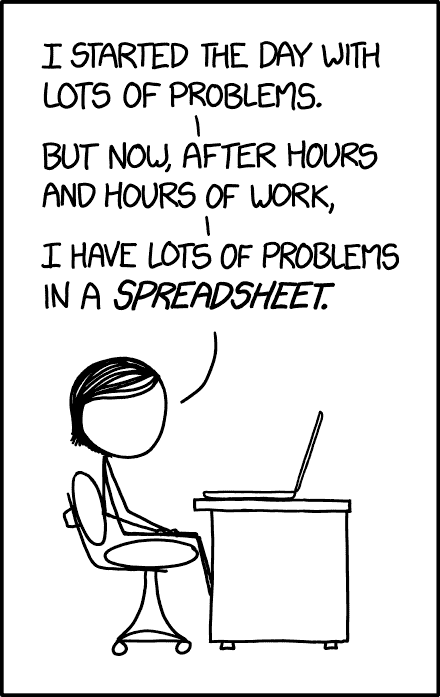

# 学习微软 Excel -全视频课程

> 原文：<https://www.freecodecamp.org/news/learn-microsoft-excel/>

从办公室工作人员到数据科学家，每个人都在使用像 Microsoft Excel 这样的电子表格软件。Excel 为处理数据的人提供了强大的功能，但它也可能让人望而生畏。

我们在 freeCodeCamp.org YouTube 频道上发布了一个完整的课程，将教你如何从头开始使用 Microsoft Excel。您将通过创建 6 个真实项目来学习。大多数内容也适用于 Google Sheets。

这个球场是由沙德·斯鲁特创建的。Shad 是大峡谷大学的计算机科学教授。在过去的 20 年里，他在技术的许多方面教过从六年级到老年人的学生。

Excel 是商业、工程、会计和更多行业中最常用的工具之一。它可以帮助您组织和操作大量的数据，否则这些数据将会非常耗时、乏味且难以组织。

精通 Excel 能增加你找到工作的机会。它可以帮助你在许多不同的方向上加速你的职业生涯，例如开始你的数据分析师之旅。

如果你在商业领域，学习 Excel 是必须的。它帮助您管理库存、人力资源和财务。

在本 Excel 课程中，您将学习如何:

*   输入数据，
*   浏览电子表格，
*   创建解决问题的公式，
*   创建图表和图形，
*   理解相对和绝对引用，
*   导入和导出数据，
*   实现 VLOOKUP，
*   使用数据透视表，
*   拆分和连接文本，
*   还有更多。

Source: [xkcd](https://xkcd.com/1906/)

学习 Excel 时，您将创建以下六个项目:

*   工资单
*   成绩册
*   决策因素
*   销售数据库
*   汽车库存
*   问题解决模板

在 freeCodeCamp.org YouTube 频道观看完整的课程(2.5 小时观看)。