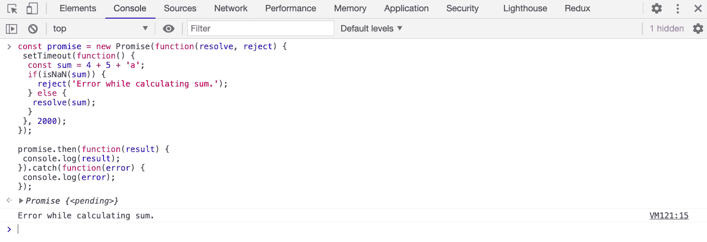
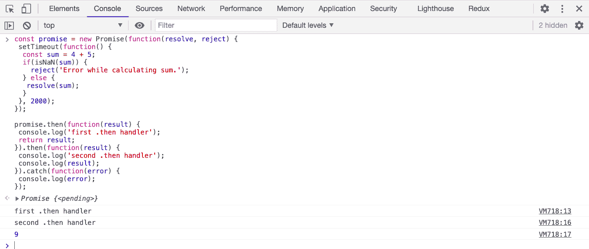
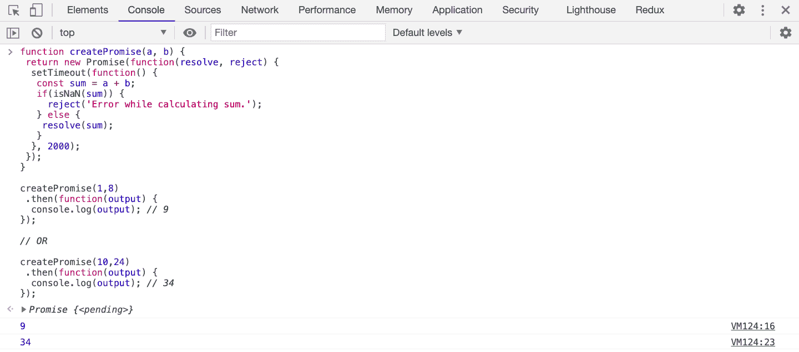
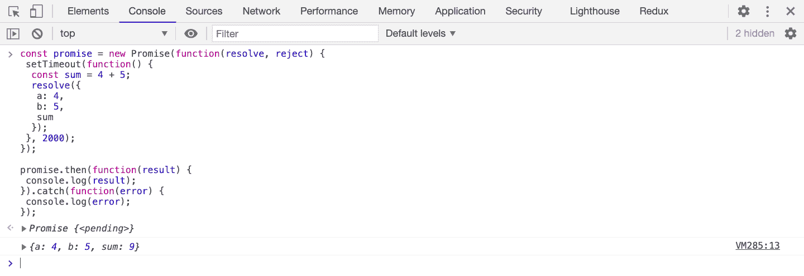

# 现代 JavaScript——ES6+中的导入、导出、Let、Const 和承诺

> 原文：<https://www.freecodecamp.org/news/learn-modern-javascript/>

在过去的几年里，JavaScript 语言有了很多更新。如果你想改进你的编码，这些更新是非常有用的。

跟上这门语言的最新发展真的很重要。它可以帮助你获得一份收入更高的工作，跟上最新的趋势，提高你的代码质量，并在你目前的工作中脱颖而出。

如果你想学习像 React 这样的 JavaScript 库或者像 Angular 或 Vue 这样的框架，你肯定需要了解最新的特性。

最近，JavaScript 增加了许多有用的东西，比如**无效合并运算符**、**可选链接**、**承诺**、**异步/等待**、 **ES6 析构**等等。

所以今天，我们将看看每个 JavaScript 开发者都应该知道的一些概念。

让我们开始，深入了解你需要知道的关于 JS 的事情。

## JavaScript 中的 Let 和 const

在 ES6 之前，JavaScript 使用的是只使用函数和全局范围的`var`关键字。没有块级范围。

添加了`let`和`const`之后，JavaScript 增加了块范围。

### 如何在 JavaScript 中使用 let

当我们使用`let`关键字声明一个变量时，我们可以**稍后给**一个新值，但是我们不能**用相同的名字重新声明**。

```
// ES5 Code
var value = 10;
console.log(value); // 10

var value = "hello";
console.log(value); // hello

var value = 30;
console.log(value); // 30 
```

正如你在上面看到的，我们已经多次使用关键字`var`重新声明了变量`value`。

在 ES6 之前，我们能够重新声明一个之前已经声明过的变量，如果它没有被有意义地使用，反而引起混乱。

但是如果我们已经在别的地方声明了一个同名的变量，而我们在没有意识到的情况下重新声明了它，那该怎么办呢？那么我们可能会覆盖变量值，导致一些难以调试的问题。

所以当你使用`let`关键字时，当你试图用相同的名字重新声明变量时，你会得到一个错误——这是一件好事。

```
// ES6 Code
let value = 10;
console.log(value); // 10

let value = "hello"; // Uncaught SyntaxError: Identifier 'value' has already been declared 
```

但是，下面的代码是有效的:

```
// ES6 Code
let value = 10;
console.log(value); // 10

value = "hello";
console.log(value); // hello 
```

我们在上面的代码中没有得到一个错误，因为我们正在**给**变量`value`重新赋值。但是我们**不会再次重新声明** `value`。

现在，看一下下面的代码:

```
// ES5 Code
var isValid = true;
if(isValid) {
  var number = 10;
  console.log('inside:', number); // inside: 10
}
console.log('outside:', number); // outside: 10 
```

正如您在这段代码中看到的，当我们用关键字`var`声明一个变量时，它在`if`块之外也是可用的。

现在看一下下面的代码:

```
// ES6 Code
let isValid = true;
if(isValid) {
  let number = 10;
  console.log('inside:', number); // inside: 10
}

console.log('outside:', number); // Uncaught ReferenceError: number is not defined 
```

如您所见，使用`let`关键字声明的`number`变量只能在`if`块中访问。在块之外它是不可用的，所以当我们试图在`if`块之外访问它时，我们得到了一个引用错误。

但是如果在`if`块之外有一个`number`变量，那么它将如下所示工作:

```
// ES6 Code
let isValid = true;
let number = 20;

if(isValid) {
  let number = 10;
  console.log('inside:', number); // inside: 10
}

console.log('outside:', number); // outside: 20 
```

这里，我们在一个单独的范围内有两个`number`变量。所以在`if`块之外，`number`的值将是 20。

看看下面的代码:

```
// ES5 Code
for(var i = 0; i < 10; i++){
 console.log(i);
}
console.log('outside:', i); // 10 
```

使用`var`关键字时，`i`甚至在`for`循环之外也是可用的。

```
// ES6 Code
for(let i = 0; i < 10; i++){
 console.log(i);
}

console.log('outside:', i); // Uncaught ReferenceError: i is not defined 
```

但是当使用`let`关键字时，它在循环之外是不可用的。

正如你从上面的代码示例中看到的，使用`let`使得变量只能在代码块内部使用，而在代码块外部是不可访问的。

我们也可以通过一对像这样的花括号创建一个块:

```
let i = 10;
{
 let i = 20;
 console.log('inside:', i); // inside: 20
 i = 30;
 console.log('i again:', i); // i again: 30
}

console.log('outside:', i); // outside: 10 
```

如果你还记得，我说过我们不能在同一个块中重新声明一个基于`let`的变量，但是我们可以在另一个块中重新声明它。正如你在上面的代码中看到的，我们已经重新声明了`i`,并在代码块中为`20`赋了一个新值。一旦声明，该变量值将只在该块中可用。

在块外，当我们打印那个变量时，我们得到的是`10`而不是之前分配的值`30`，因为在块外，内部的`i`变量不存在。

如果我们没有在外面声明变量`i`,那么我们会得到一个错误，如你在下面的代码中看到的:

```
{
 let i = 20;
 console.log('inside:', i); // inside: 20
 i = 30;
 console.log('i again:', i); // i again: 30
}

console.log('outside:', i); // Uncaught ReferenceError: i is not defined 
```

### 如何在 JavaScript 中使用 const

`const`关键字在块范围功能上与`let`关键字完全相同。所以让我们来看看它们之间有什么不同。

当我们声明一个变量为`const`时，它被认为是一个常量变量，其值永远不会改变。

在`let`的例子中，我们可以像这样给这个变量赋值:

```
let number = 10;
number = 20;

console.log(number); // 20 
```

但是我们不能这样做，以防`const`:

```
const number = 10;
number = 20; // Uncaught TypeError: Assignment to constant variable. 
```

我们甚至不能将**重新声明**为`const`变量。

```
const number = 20;
console.log(number); // 20

const number = 10; // Uncaught SyntaxError: Identifier 'number' has already been declared 
```

现在，看一下下面的代码:

```
const arr = [1, 2, 3, 4];

arr.push(5);

console.log(arr); // [1, 2, 3, 4, 5] 
```

我们说过`const`变量是常量，其值永远不会改变——但是我们已经改变了上面的常量数组。这有什么意义呢？

> 注意:数组是引用类型，而不是 JavaScript 中的基本类型

所以实际存储在`arr`中的不是实际的数组，而是实际数组存储的内存位置的引用(地址)。

因此，通过执行`arr.push(5);`，我们实际上并没有改变`arr`所指向的引用，而是改变了存储在该引用中的值。

对象也是如此:

```
const obj = {
 name: 'David',
 age: 30
};

obj.age = 40;

console.log(obj); // { name: 'David', age: 40 } 
```

这里，我们也没有改变`obj`所指向的引用，但是我们改变了存储在那个引用中的值。

所以上面的代码可以工作，但是下面的代码不行。

```
const obj = { name: 'David', age: 30 };
const obj1 = { name: 'Mike', age: 40 };
obj = obj1; // Uncaught TypeError: Assignment to constant variable. 
```

上面的代码不起作用，因为我们试图改变`const`变量指向的引用。

所以使用 const 时要记住的关键点是，当我们用 const 声明一个变量为常量时，我们不能重新定义它。我们也不能重新分配那个变量，但是如果变量是引用类型的，我们可以改变存储在那个位置的值。

所以下面的代码是无效的，因为我们要给它重新赋值。

```
const arr = [1, 2, 3, 4];
arr = [10, 20, 30]; // Uncaught TypeError: Assignment to constant variable. 
```

但是请注意，我们可以改变数组内部的值，就像我们之前看到的那样。

下面重新定义`const`变量的代码也是无效的。

```
const name = "David";
const name = "Raj"; // Uncaught SyntaxError: Identifier 'name' has already been declared 
```

### 让我们来总结一下

*   关键字`let`和`const`在 JavaScript 中增加了块范围。
*   当我们声明一个变量为`let`时，我们不能在同一个作用域(函数或块作用域)内`re-define`或`re-declare`另一个同名的 let 变量，但是我们可以`re-assign`给它赋值。
*   当我们将一个变量声明为`const`时，我们不能在同一个作用域(函数或块作用域)内`re-define`或`re-declare`另一个同名的`const`变量。但是，如果变量是引用类型，如数组或对象，我们可以更改存储在该变量中的值。

好了，让我们进入下一个大话题:承诺。

## JavaScript 中的承诺

承诺是 JavaScript 中最重要但又令人困惑和难以理解的部分之一。大多数新开发人员以及有经验的开发人员都很难理解它们。

承诺作为本机实现添加到了 ES6 中。

那么什么是承诺呢？承诺代表将来要完成的异步操作。

之前在 ES6 之前，没有办法等待某个东西来执行某个操作。

例如，当我们想要进行 API 调用时，没有办法等到 ES6 之前返回结果。

为此，我们过去使用外部库，如 Jquery 或 Ajax，它们有自己的 promises 实现。但是没有浏览器实现承诺的东西。

但是现在使用 ES6 中的 Promises，我们可以自己进行 API 调用，并等待它完成来执行一些操作。

### 如何创造承诺

为了创建一个承诺，我们需要像这样使用`Promise`构造函数:

```
const promise = new Promise(function(resolve, reject) {

}); 
```

`Promise`构造函数将一个函数作为参数，该函数在内部接收`resolve`和`reject`作为参数。

`resolve`和`reject`参数实际上是我们可以根据异步操作的结果调用的函数。

一个`Promise`经历三种状态:

*   悬而未决的
*   感到满足的
*   拒绝

当我们创建一个承诺时，它处于待定状态。当我们调用`resolve`函数时，它进入履行状态，如果我们调用`reject`，它将进入拒绝状态。

为了模拟长时间运行或异步操作，我们将使用`setTimeout`函数。

```
const promise = new Promise(function(resolve, reject) {
 setTimeout(function() {
  const sum = 4 + 5;
  resolve(sum);
 }, 2000);
}); 
```

这里，我们创建了一个承诺，它将在 2000 毫秒(2 秒)超时结束后解析为`4`和`5`的总和。

为了获得成功执行承诺的结果，我们需要使用`.then`注册一个回调，如下所示:

```
const promise = new Promise(function(resolve, reject) {
 setTimeout(function() {
  const sum = 4 + 5;
  resolve(sum);
 }, 2000);
});

promise.then(function(result) {
 console.log(result); // 9
}); 
```

因此，每当我们调用`resolve`，承诺将返回传递给`resolve`函数的值，我们可以使用`.then`处理程序收集该值。

如果操作不成功，那么我们这样调用`reject`函数:

```
const promise = new Promise(function(resolve, reject) {
 setTimeout(function() {
  const sum = 4 + 5 + 'a';
  if(isNaN(sum)) {
    reject('Error while calculating sum.');
  } else {
    resolve(sum);
  }
 }, 2000);
});

promise.then(function(result) {
 console.log(result);
}); 
```

这里，如果`sum`不是一个数字，那么我们调用带有错误消息的`reject`函数。否则我们调用`resolve`函数。

如果您执行上述代码，您将看到以下输出:


正如您所看到的，由于调用`reject`函数会抛出一个错误，我们在指定消息的同时还会得到一个未捕获的错误消息。但是我们没有添加错误处理程序来捕获该错误。

为了捕捉错误，我们需要使用`.catch`注册另一个回调，如下所示:

```
promise.then(function(result) {
 console.log(result);
}).catch(function(error) {
 console.log(error);
}); 
```

您将看到以下输出:



正如您所看到的，我们已经添加了`.catch`处理程序，所以我们不会得到任何未捕获的错误，但我们只是将错误记录到控制台。

这也避免了突然停止应用程序。

因此，总是建议在每个承诺中添加`.catch`处理程序，这样您的应用程序就不会因为错误而停止运行。

### 承诺链

我们可以向单个承诺添加多个`.then`处理程序，如下所示:

```
promise.then(function(result) {
 console.log('first .then handler');
 return result;
}).then(function(result) {
 console.log('second .then handler');
 console.log(result);
}).catch(function(error) {
 console.log(error);
}); 
```

当我们添加了多个`.then`处理程序时，前一个`.then`处理程序的返回值会自动传递给下一个`.then`处理程序。



正如您所看到的，添加`4 + 5`解决了一个承诺，我们在第一个`.then`处理程序中获得了这个总数。在那里，我们打印一个日志声明，并将该总数返回给下一个`.then`处理程序。

在下一个`.then`处理程序中，我们添加了一个日志语句，然后我们打印从上一个`.then`处理程序中得到的结果。

这种添加多个`.then`处理程序的方式被称为承诺链。

### 如何在 JavaScript 中延迟承诺的执行

很多时候，我们不想立即创造承诺，而是想在某个操作完成后创造一个。

为了实现这一点，我们可以将承诺包装在一个函数中，并从该函数中返回该承诺，如下所示:

```
function createPromise() {
 return new Promise(function(resolve, reject) {
  setTimeout(function() {
   const sum = 4 + 5;
   if(isNaN(sum)) {
     reject('Error while calculating sum.');
   } else {
    resolve(sum);
   }
  }, 2000);
 });
} 
```

这样，我们可以使用 promise 内部的函数参数，使函数真正具有动态性。

```
function createPromise(a, b) {
 return new Promise(function(resolve, reject) {
  setTimeout(function() {
   const sum = a + b;
   if(isNaN(sum)) {
     reject('Error while calculating sum.');
   } else {
    resolve(sum);
   }
  }, 2000);
 });
}

createPromise(1,8)
 .then(function(output) {
  console.log(output); // 9
});

// OR

createPromise(10,24)
 .then(function(output) {
  console.log(output); // 34
}); 
```



**注意:**当我们创建一个承诺时，它将被解决或拒绝，但不能同时解决和拒绝。所以我们不能在同一个承诺中添加两个`resolve`或`reject`函数调用。

此外，我们可以只向`resolve`或`reject`函数传递一个值。

如果您想将多个值传递给一个`resolve`函数，请将它作为一个对象传递，如下所示:

```
const promise = new Promise(function(resolve, reject) {
 setTimeout(function() {
  const sum = 4 + 5;
  resolve({
   a: 4,
   b: 5,
   sum
  });
 }, 2000);
});

promise.then(function(result) {
 console.log(result);
}).catch(function(error) {
 console.log(error);
}); 
```



### 如何在 JavaScript 中使用箭头函数

在上面所有的代码示例中，我们在创建承诺时使用了常规的 ES5 函数语法。但是通常使用箭头函数语法而不是 ES5 函数语法，如下所示:

```
const promise = new Promise((resolve, reject) => {
 setTimeout(() => {
  const sum = 4 + 5 + 'a';
  if(isNaN(sum)) {
    reject('Error while calculating sum.');
  } else {
    resolve(sum);
  }
 }, 2000);
});

promise.then((result) => {
 console.log(result);
}); 
```

根据您的偏好和需要，您可以使用 ES5 或 ES6 函数语法。

## ES6 导入和导出语法

在 ES6 开始使用之前，我们在一个 HTML 文件中使用多个`script`标签来导入不同的 JavaScript 文件，如下所示:

```
<script type="text/javascript" src="home.js"></script>
<script type="text/javascript" src="profile.js"></script>
<script type="text/javascript" src="user.js"></script> 
```

因此，如果我们在不同的 JavaScript 文件中有一个同名的变量，就会产生命名冲突，并且您所期望的值不会是您得到的实际值。

ES6 通过模块的概念解决了这个问题。

我们在 ES6 中编写的每个 JavaScript 文件都被称为一个模块。我们在每个文件中声明的变量和函数对于其他文件是不可用的，直到我们专门从那个文件中导出它们并导入到另一个文件中。

所以文件中定义的函数和变量对于每个文件都是私有的，在我们导出它们之前，不能在文件外部访问它们。

有两种类型的导出:

*   命名导出:一个文件中可以有多个命名导出
*   默认导出:一个文件中只能有一个默认导出

### JavaScript 中的命名导出

要将单个值导出为命名导出，我们可以像这样导出它:

```
export const temp = "This is some dummy text"; 
```

如果我们有多个东西要导出，我们可以在单独的一行写一个导出语句，而不是在变量声明前面。我们在花括号中指定要导出的内容。

```
const temp1 = "This is some dummy text1";
const temp2 = "This is some dummy text2";

export { temp1, temp2 }; 
```

请注意，导出语法不是对象文字语法。所以在 ES6 中，要导出某些东西，我们不能像这样使用键值对:

```
 // This is invalid syntax of export in ES6

export { key1: value1, key2: value2 } 
```

为了导入我们作为命名导出导出的内容，我们使用以下语法:

```
import { temp1, temp2 } from './filename'; 
```

注意，当从文件中导入内容时，我们不需要在文件名中添加扩展名`.js`,因为它是默认的。

```
// import from functions.js file from current directory 
import { temp1, temp2 } from './functions';

// import from functions.js file from parent of current directory
import { temp1 } from '../functions'; 
```

这里有一个代码沙盒演示:[https://codesandbox.io/s/hardcore-pond-q4cjx](https://codesandbox.io/s/hardcore-pond-q4cjx)

**需要注意的一点是，导出时使用的名称必须与我们导入时使用的名称一致。**

因此，如果您导出为:

```
// constants.js
export const PI = 3.14159; 
```

然后在导入时，您必须使用导出时使用的相同名称:

```
import { PI } from './constants'; 
```

你不能像这样使用任何其他名称:

```
import { PiValue } from './constants'; // This will throw an error 
```

但是，如果已经有一个变量与导出的变量同名，则可以在导入时使用重命名语法，如下所示:

```
import { PI as PIValue } from './constants'; 
```

这里我们已经将`PI`重命名为`PIValue`，所以我们现在不能使用`PI`变量名。相反，我们必须使用`PIValue`变量来获得`PI`的导出值。

我们也可以在导出时使用重命名语法:

```
// constants.js
const PI = 3.14159; 

export { PI as PIValue }; 
```

那么在导入时，我们必须像这样使用`PIValue`:

```
import { PIValue } from './constants'; 
```

要将某个东西作为命名导出导出，我们必须首先声明它。

```
export 'hello'; // this will result in error
export const greeting = 'hello'; // this will work
export { name: 'David' }; // This will result in error
export const object = { name: 'David' }; // This will work 
```

我们导入多个指定导出的顺序并不重要。

看看下面的`validations.js`文件:

```
// utils/validations.js

const isValidEmail = function(email) {
  if (/^[^@ ]+@[^@ ]+\.[^@ \.]{2,}$/.test(email)) {
    return "email is valid";
  } else {
    return "email is invalid";
  }
};

const isValidPhone = function(phone) {
  if (/^[\\(]\d{3}[\\)]\s\d{3}-\d{4}$/.test(phone)) {
    return "phone number is valid";
  } else {
    return "phone number is invalid";
  }
};

function isEmpty(value) { 
  if (/^\s*$/.test(value)) {
    return "string is empty or contains only spaces";
  } else {
    return "string is not empty and does not contain spaces";
  } 
}

export { isValidEmail, isValidPhone, isEmpty }; 
```

在`index.js`中，我们使用这些函数，如下所示:

```
// index.js
import { isEmpty, isValidEmail } from "./utils/validations";

console.log("isEmpty:", isEmpty("abcd")); // isEmpty: string is not empty and does not contain spaces

console.log("isValidEmail:", isValidEmail("abc@11gmail.com")); // isValidEmail: email is valid

console.log("isValidEmail:", isValidEmail("ab@c@11gmail.com")); // isValidEmail: email is invalid 
```

这里有一个代码沙盒演示:[https://codesandbox.io/s/youthful-flower-xesus](https://codesandbox.io/s/youthful-flower-xesus)

如您所见，我们可以只导入所需的导出内容，并且以任何顺序导入，因此我们不需要检查我们在另一个文件中导出的顺序。这就是命名出口的妙处。

### JavaScript 中的默认导出

如前所述，在一个文件中最多只能有一个默认导出。

但是，您可以将多个命名导出和一个默认导出合并到一个文件中。

要声明默认导出，我们在导出关键字前添加默认关键字，如下所示:

```
//constants.js
const name = 'David'; 
export default name; 
```

为了导入默认导出，我们不像在命名导出中那样添加花括号，如下所示:

```
import name from './constants'; 
```

如果我们有多个命名导出和一个默认导出，如下所示:

```
// constants.js
export const PI = 3.14159; 
export const AGE = 30;

const NAME = "David";
export default NAME; 
```

然后，要在一行中导入所有内容，我们只需要在花括号前使用默认的导出变量。

```
// NAME is default export and PI and AGE are named exports here

import NAME, { PI, AGE } from './constants'; 
```

**默认导出的一个特点是，我们可以在导入时更改导出变量的名称:**

```
// constants.js
const AGE = 30;
export default AGE; 
```

在另一个文件中，我们可以在导入时使用另一个名称

```
import myAge from ‘./constants’; 

console.log(myAge); // 30 
```

这里，我们将默认导出变量的名称从`AGE`更改为`myAge`。

这样做是因为只能有一个默认导出，所以您可以随意命名它。

关于默认导出，另一件要注意的事情是 export default 关键字不能出现在变量声明之前，如下所示:

```
// constants.js
export default const AGE = 30; // This is an error and will not work 
```

因此，我们必须在单独的一行中使用 export default 关键字，如下所示:

```
// constants.js 

const AGE = 30; 
export default AGE; 
```

但是，我们可以导出 default，而不用像这样声明变量:

```
//constants.js
export default {
 name: "Billy",
 age: 40
}; 
```

在另一个文件中这样使用它:

```
import user from './constants';
console.log(user.name); // Billy 
console.log(user.age); // 40 
```

使用以下语法，还有一种方法可以导入文件中导出的所有变量:

```
import * as constants from './constants'; 
```

在这里，我们导入所有在`constants.js`中的命名和默认导出，并存储在`constants`变量中。所以，`constants`就成了现在的一个对象。

```
// constants.js
export const USERNAME = "David";
export default {
 name: "Billy",
 age: 40
}; 
```

在另一个文件中，我们如下使用它:

```
// test.js

import * as constants from './constants';

console.log(constants.USERNAME); // David
console.log(constants.default); // { name: "Billy", age: 40 }
console.log(constants.default.age); // 40 
```

这里有一个代码沙盒演示:[https://codesandbox.io/s/green-hill-dj43b](https://codesandbox.io/s/green-hill-dj43b)

如果您不想在单独的行上导出默认和命名的
导出，您可以如下所示合并它:

```
// constants.js
const PI = 3.14159; const AGE = 30;
const USERNAME = "David";
const USER = {
 name: "Billy",
 age: 40 
};

export { PI, AGE, USERNAME, USER as default }; 
```

这里，我们将导出`USER`作为默认导出，将其他导出作为命名导出。

在另一个文件中，您可以这样使用它:

```
import USER, { PI, AGE, USERNAME } from "./constants"; 
```

这里有一个代码沙盒演示:[https://codesandbox.io/s/eloquent-northcutt-7btp1](https://codesandbox.io/s/eloquent-northcutt-7btp1)

### 总而言之:

1.  在 ES6 中，在一个文件中声明的数据不可被另一个文件访问，直到从该文件导出并导入到另一个文件中。
2.  如果我们在一个文件中有一个要导出的东西，比如类声明，我们使用默认导出，否则我们使用命名导出。我们还可以将默认导出和命名导出合并到一个文件中。

## JavaScript 中的默认参数

ES6 增加了一个非常有用的特性，在定义函数时提供默认参数。

假设我们有一个应用程序，一旦用户登录到系统，我们向他们显示一条欢迎消息，如下所示:

```
function showMessage(firstName) {
  return "Welcome back, " + firstName;
}
console.log(showMessage('John')); // Welcome back, John 
```

但是，如果我们的数据库中没有用户名，因为它是注册时的可选字段，该怎么办呢？然后我们可以在用户登录后向用户显示`Welcome Guest`消息。

所以我们首先需要检查是否提供了`firstName`，然后显示相应的消息。在 ES6 之前，我们必须编写这样的代码:

```
function showMessage(firstName) {
  if(firstName) {
    return "Welcome back, " + firstName;
  } else {
    return "Welcome back, Guest";
  }
}

console.log(showMessage('John')); // Welcome back, John 
console.log(showMessage()); // Welcome back, Guest 
```

但是现在在 ES6 中使用默认的函数参数，我们可以编写如下所示的代码:

```
function showMessage(firstName = 'Guest') {
   return "Welcome back, " + firstName;
}

console.log(showMessage('John')); // Welcome back, John 
console.log(showMessage()); // Welcome back, Guest 
```

**我们可以将任何值作为默认值分配给函数参数。**

```
function display(a = 10, b = 20, c = b) { 
 console.log(a, b, c);
}

display(); // 10 20 20
display(40); // 40 20 20
display(1, 70); // 1 70 70
display(1, 30, 70); // 1 30 70 
```

如您所见，我们为 a 和 b 函数参数分配了唯一的值，但对于 c，我们分配的是 b 的值。因此，如果在调用函数时没有为 c 提供特定的值，那么我们为 b 提供的任何值也会被分配给 c。

在上面的代码中，我们没有为函数提供所有的参数。所以上面的函数调用将和下面的一样:

```
display(); // is same as display(undefined, undefined, undefined)
display(40); // is same as display(40, undefined, undefined)
display(1, 70); // is same as display(1, 70, undefined) 
```

所以如果传递的实参是`undefined`，那么对应的形参将使用默认值。

**我们也可以将复杂值或计算值指定为默认值。**

```
const defaultUser = {
  name: 'Jane',
  location: 'NY',
  job: 'Software Developer'
};

const display = (user = defaultUser, age = 60 / 2 ) => { 
 console.log(user, age);
};
display();

/* output

{
  name: 'Jane',
  location: 'NY',
  job: 'Software Developer'
} 30 

*/ 
```

现在，看看下面的 ES5 代码:

```
// ES5 Code
function getUsers(page, results, gender, nationality) {
  var params = "";
  if(page === 0 || page) {
   params += `page=${page}&`; 
  }
  if(results) {
   params += `results=${results}&`;
  }
  if(gender) {
   params += `gender=${gender}&`;
  }
  if(nationality) {
   params += `nationality=${nationality}`;
  }

  fetch('https://randomuser.me/api/?' + params) 
   .then(function(response) {
     return response.json(); 
   })
   .then(function(result) { 
    console.log(result);
   }) 
   .catch(function(error) {
     console.log('error', error); 
   }); 
}

getUsers(0, 10, 'male', 'us'); 
```

在这段代码中，我们通过在`getUsers`函数中传递各种可选参数，对[随机用户](https://randomuser.me/) API 进行 API 调用。

因此，在进行 API 调用之前，我们添加了各种 if 条件来检查参数是否被添加，并基于此构建如下查询字符串:`https://randomuser.me/api/? page=0&results=10&gender=male&nationality=us`。

但是，我们可以在定义函数参数时使用默认参数，而不是添加这么多 if 条件，如下所示:

```
function getUsers(page = 0, results = 10, gender = 'male',nationality = 'us') {
 fetch(`https://randomuser.me/api/?page=${page}&results=${results}&gender=${gender}&nationality=${nationality}`)
 .then(function(response) { 
  return response.json();
 }) 
 .then(function(result) {
   console.log(result); 
 })
 .catch(function(error) { 
  console.log('error', error);
  }); 
}

getUsers(); 
```

正如你所看到的，我们已经大大简化了代码。因此，当我们不向`getUsers`函数提供任何参数时，它将采用默认值，我们也可以像这样提供自己的值:

```
getUsers(1, 20, 'female', 'gb'); 
```

因此它将覆盖函数的默认参数。

### 空不等于未定义

但是你需要注意一点:`null`和`undefined`在定义默认参数的时候是两回事。

看看下面的代码:

```
function display(name = 'David', age = 35, location = 'NY'){
 console.log(name, age, location); 
}

display('David', 35); // David 35 NY
display('David', 35, undefined); // David 35 NY 
```

由于我们没有在第一次调用中为 location 参数提供第三个值来显示，默认情况下它将是`undefined`,因此 location 的默认值将在两个函数调用中使用。但是下面的函数调用并不相等。

```
display('David', 35, undefined); // David 35 NY
display('David', 35, null); // David 35 null 
```

当我们把`null`作为一个参数传递时，我们特别指出要给`location`参数分配一个`null`值，它与`undefined`不同。所以它不会采用`NY`的默认值。

## 数组.原型.包含

ES7 增加了一个新函数，它检查数组中是否存在元素，并返回布尔值`true`或`false`。

```
// ES5 Code

const numbers = ["one", "two", "three", "four"];

console.log(numbers.indexOf("one") > -1); // true 
console.log(numbers.indexOf("five") > -1); // false
```

使用 Array `includes`方法的相同代码可以写成如下所示:

```
// ES7 Code

const numbers = ["one", "two", "three", "four"];

console.log(numbers.includes("one")); // true 
console.log(numbers.includes("five")); // false
```

所以使用数组`includes`方法使得代码简短易懂。

在比较不同的值时，`includes`方法也很方便。

看看下面的代码:

```
const day = "monday";

if(day === "monday" || day === "tuesday" || day === "wednesday") {
  // do something
}
```

上面使用`includes`方法的代码可以简化如下:

```
const day = "monday";

if(["monday", "tuesday", "wednesday"].includes(day)) {
  // do something
}
```

所以在检查数组中的值时，`includes`方法非常方便。

## 结束点

从 ES6 开始，JavaScript 中加入了许多变化。每个 JavaScript、Angular、React 或 Vue 开发人员都应该知道它们。

了解他们会让你成为一个更好的开发者，甚至能帮你找到一份高薪的工作。如果你只是在学习 React 这样的库和 Angular、Vue 这样的框架，你肯定想熟悉这些新特性。

## 了解更多关于现代 JavaScript 特性的信息

你可以在我的[掌握现代 JavaScript](https://modernjavascript.yogeshchavan.dev/) 一书中了解 JavaScript 中添加的所有最新特性。这是学习现代 JavaScript 概念的唯一指南。

[](https://modernjavascript.yogeshchavan.dev/)

订阅我的[每周简讯](https://bit.ly/2HwVEA2)加入 1000 多个其他订阅者的行列，直接在您的收件箱中获得惊人的提示、技巧和文章。