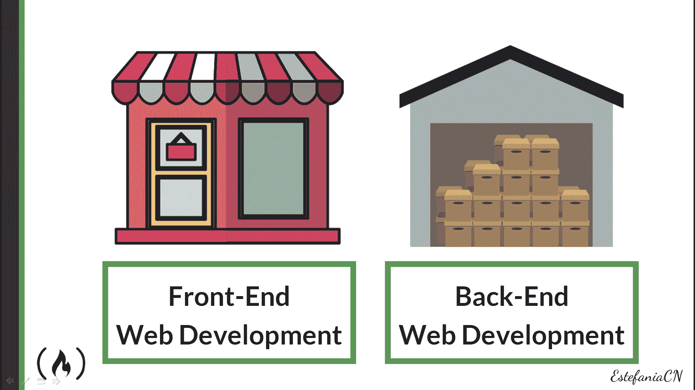
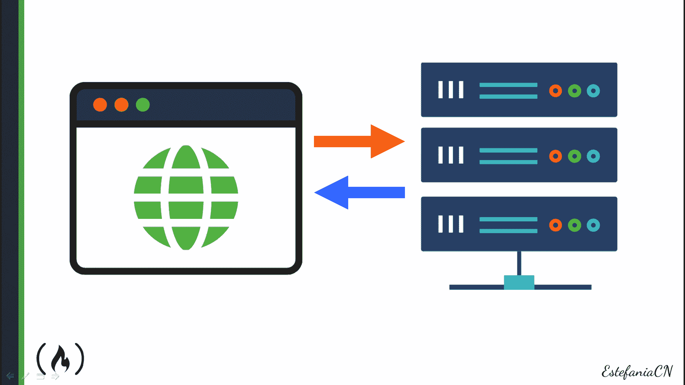
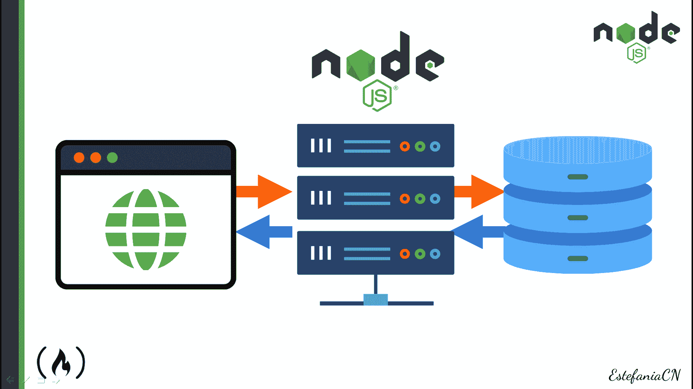
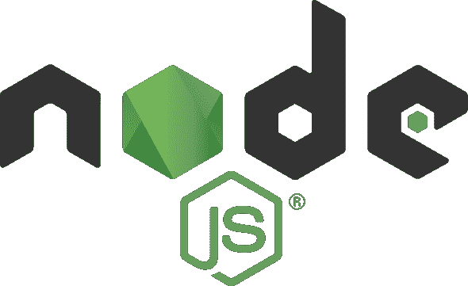
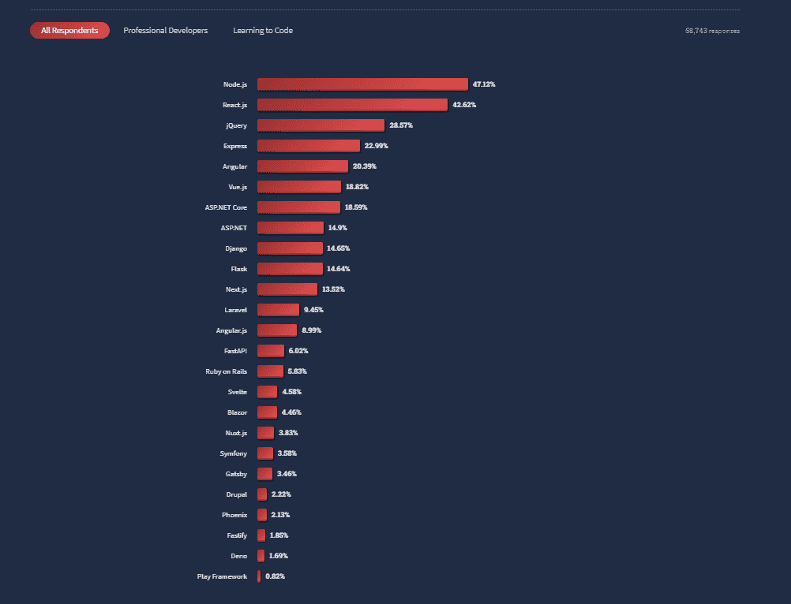
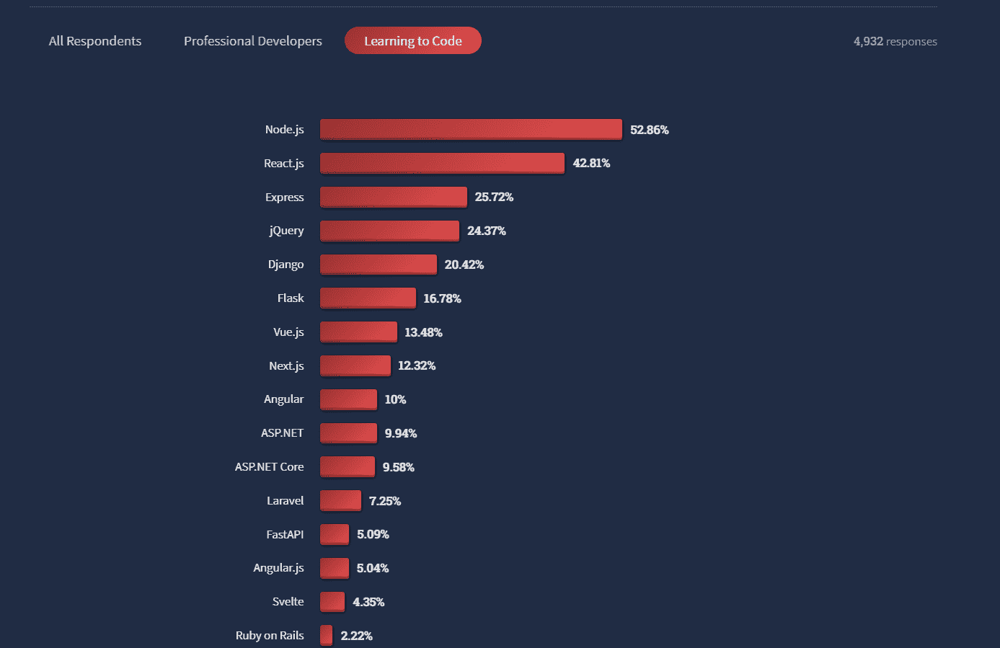
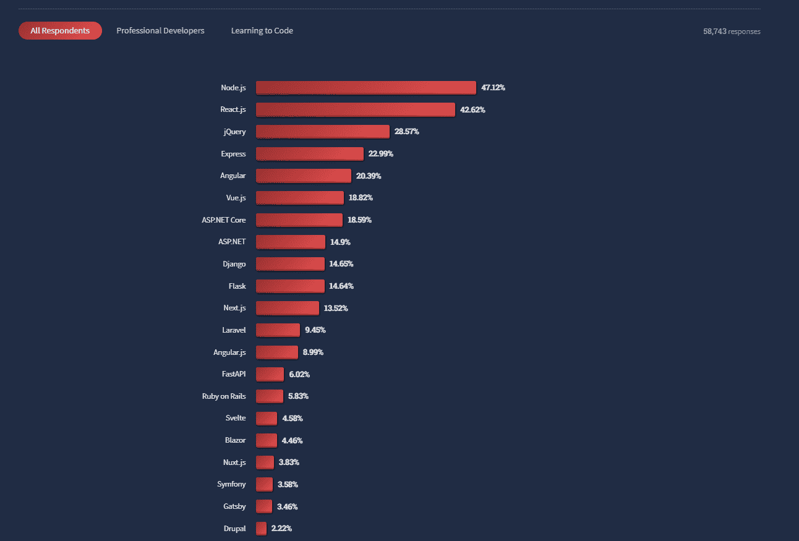
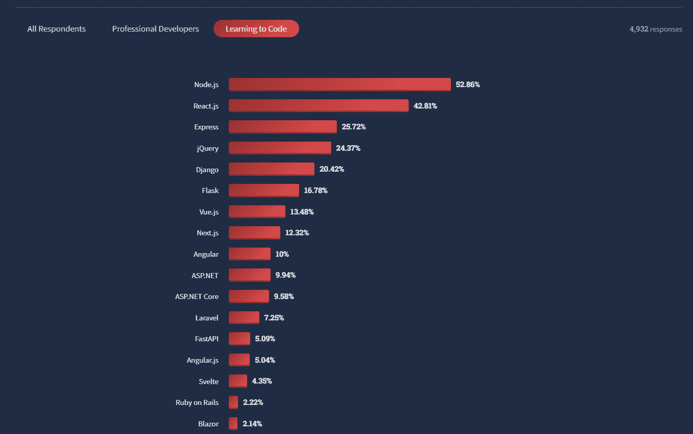
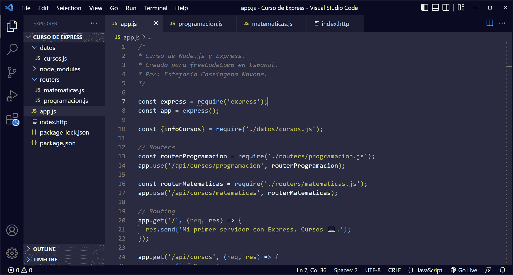

# 学习西班牙语的 Node.js 和 Express–初学者课程

> 原文：<https://www.freecodecamp.org/news/learn-node-js-and-express-in-spanish-course-for-beginners/>

嗨！如果你会说西班牙语，并且想学习 Node.js 和 Express，那你来对地方了。

在本文中，您将找到对后端 web 开发、Node.js 和 Express 的简要介绍。您将了解为什么它们是开发 web 服务器的非常强大的工具，以及如果您的目标是成为后端 web 开发人员，为什么您应该学习它们。

然后，你会在 freeCodeCamp 的西班牙语 YouTube 频道上找到[一个 **8.5 小时** Node.js 和快速课程](https://www.youtube.com/watch?v=1hpc70_OoAg)，在那里你可以学习西班牙语的基础知识，并一步一步地建立一个项目。

如果你有说西班牙语的朋友，欢迎你把这篇文章的 西班牙语版 ****[分享给他们。](https://www.freecodecamp.org/espanol/news/aprende-node-js-y-express-curso-desde-cero/)****

我们开始吧！✨

## **🔸什么是后端 Web 开发？**

网络发展已经改变了我们的现代世界。每天，我们都会上网查找信息、学习、购买产品、分享想法、联系家人和朋友。

基本上，如果没有网站和网络应用程序，我们的生活将会完全不同。你同意吗？🙂

如果你这样做了，那么学习 web 开发可以让你走上一条非常有益的职业道路，因为你可以对成千上万甚至数百万用户的生活产生巨大的影响。

让我们来谈谈 web 开发的不同领域。

### ◼️前端与后端 Web 开发

创造惊人的网络应用的开发者被称为**网络开发者**。他们可以专门开发 web 应用程序的不同部分:

*   **Font-End Web 开发者**实现用户直接交互的 Web 应用部分。他们开发了我们每天使用和喜爱的惊人平台的可见部分。在上面您可以看到的商店类比中，前端将由客户可以看到的商店部分来表示。
*   **后端 Web 开发者**实现所有用户看不到的功能，比如服务器、数据库，以及它们与应用前端部分的交互。在我们的商店类比中，后端将由仓库表示，仓库是商店的一部分，支持客户看到的一切。
*   全栈网络开发者负责这两个领域。他们对前端和后端 web 开发有透彻的了解。

很有趣，对吧？✨

现在让我们更深入地研究后端 web 开发，因为这是 Node.js 和 Express 的主要应用之一。

### 客户机-服务器模式

互联网基于**客户机-服务器模型**，其中两个设备(客户机和服务器)相互通信。

Illustration of the client-server model.

### 什么是客户？

当您尝试在浏览器中访问某个网站时，浏览器(**客户端**)会向服务器发送该网站的 HTTP 请求。

### 什么是服务器？

**服务器**是一个监听请求并生成适当响应的程序。这些响应通常包括:

*   向客户端发送数据。
*   运行一些任务。
*   使用或更新数据库。

例如，我们可以向服务器发送一个请求，向 web 应用程序的数据库添加一个新用户。服务器应该在数据库中进行必要的更新，并通知客户端更改成功。

Client (left) - Server (center) - Database (right)

开发和维护服务器是后端 web 开发人员的主要任务之一，这也正是 **Node.js 和 Express** 的用途。

## 🔹Node.js 是什么？

**Node.js** 是一个异步事件驱动的 JavaScript 运行时，构建在 Chrome 的 V8 JavaScript 引擎上。它为我们提供了在没有浏览器的终端中运行 JavaScript 所需的所有工具。

💡**提示:**在 Node.js 之前，没有浏览器我们是无法运行 JavaScript 程序的。因为 JavaScript 是网络的主要编程语言之一，所以只有浏览器是为这个任务设计的。

Node.js 最棒的地方在于，它让我们能够构建高性能的可伸缩网络应用程序。

根据其[官方文件](https://nodejs.org/en/about/):

> Node.js 的用户不用担心死锁进程，因为没有锁。Node.js 中几乎没有函数直接执行 I/O，所以除非使用 Node.js 标准库的同步方法执行 I/O，否则进程永远不会阻塞。**因为没有什么阻挡，所以在 Node.js 中开发可扩展的系统是非常合理的**

🚩需要注意的是 **Node.js 不是** a:

*   编程语言。
*   框架。
*   图书馆。

它是一个为运行 JavaScript 代码而开发的 JavaScript 运行时。

### **为什么要学习 Node.js？**

现在你知道 Node.js 是什么了，让我们看看**为什么**你应该学习它。

Node.js 是开发人员中最受欢迎的 web 技术之一，包括正在学习如何编码的初学者以及专业人士。

Node.js Logo

**Node.js** 人气极高。根据 [2022 栈溢出开发者调查](https://survey.stackoverflow.co/2022/#most-popular-technologies-webframe)，它是专业开发者和学习编码的人使用的最流行的 web 技术之一。

当被调查者被问及在过去一年中他们在哪些 web 框架和 web 技术上做了大量的开发工作，以及他们希望在接下来的一年中在哪些方面工作时，Node.js 获得了 47.12%的选票。

**💡提示:**这几乎是 58743 条回复的一半！

The results of the Web Frameworks and technologies category in the [2022 Stack Overflow Developer](https://survey.stackoverflow.co/2022/#most-popular-technologies-webframe) Survey. **Node**.js leads with 4**7.12**%********of the responses.****

在学习如何编码的受访者中，这一比例甚至更高: **52.86%** 。牛逼吧？😁

The results of the Web Frameworks and technologies category in the [2022 Stack Overflow Developer](https://survey.stackoverflow.co/2022/#most-popular-technologies-webframe) Survey when Learning to Code was selected. **Node**.js leads with** 52.86**%of the responses.****

这清楚地证明了 Node.js 对 web 开发的影响。通过学习 Node.js，你将明智地投资你的时间和资源。你将获得这个领域非常需要的有价值的技能。

## 🔸什么是快递？

如果你的目标是用 Node.js 开发一个服务器，如果你使用 **Express** ，这个过程会容易得多。这是一个专门为 Node.js 开发的 web 应用程序框架。

根据快递的[官方文件](https://expressjs.com/):

> Express 是一个最小且灵活的 Node.js web 应用程序框架，为 web 和移动应用程序提供了一组强大的功能。

**💡提示:** Express 包含许多工具，您可以使用它们来编写更简洁、可读性更好、更易维护的代码。相信我。一旦您开始使用 Express，您将永远不想停止。

Express 有许多 HTTP 实用方法和中间件，可以用来创建健壮的 API(应用程序编程接口)，这是后端和全栈 web 开发的基础。

在 [2022 Stack Overflow 开发者调查](https://survey.stackoverflow.co/2022/#most-popular-technologies-webframe)中， **Express** 以 **22.99%** 的得票率位列第四:

The results of the Web Frameworks and technologies category in the [2022 Stack Overflow Developer](https://survey.stackoverflow.co/2022/#most-popular-technologies-webframe) Survey. **Express** was fourth with **22.99**%of the responses.****

Express 还获得了正在学习如何编码的受访者的 **25.72%** 的投票:

**Express** had **25.72%** of the votes of the respondents who are learning how to code. It was third in the results of the Web Frameworks and technologies category. 

**牛逼！**现在你知道为什么要学习 Node.js 和 Express 了吧。我向你保证这是完全值得的。✨

## 🔹 **Node.js 和 Express 课程内容**

现在，让我们回顾一下您将在本课程中学到的内容。

****💡提示:**** 要参加该课程，你应该先有 **JavaScript** 的知识。如果你需要用西班牙语复习这些话题，我推荐你在 freeCodeCamp 西班牙语 YouTube 频道观看这个 [JavaScript 课程](https://www.youtube.com/watch?v=ivdTnPl1ND0&t=3s)。

### Node.js 和基本概念介绍

*   Node.js 简介。
*   后端 Web 开发的基本概念。
*   Node.js 的应用
*   API 及其用途。
*   Node.js 的优势。
*   如何下载安装 Node.js？
*   如何确认 Node.js 安装成功？
*   如何检查你的 Node.js 当前版本？
*   REPL 节点。

### 您的第一个 Node.js 项目和节点模块

*   什么是模块？概念和优势。
*   如何导出和导入模块？
*   如何从一个 JavaScript 模块导出多个元素？
*   如何用`node`命令运行一个 JavaScript 文件？
*   Node.js 核心模块。
*   `console`模块。
*   `process`模块。
*   `os`模块。
*   `fs`模块。
*   `timers`模块。

### npm 和 JSON 简介

*   什么是 npm？
*   基本的国家预防机制概念。
*   如何用`npm init`初始化一个包？
*   `package.json`文件。
*   JSON 简介。
*   如何使用 npm 安装和卸载软件包？
*   `package-lock.json`文件。

### 事件和异步操作

*   什么是事件？
*   Node.js 中的事件
*   异步与同步事件。
*   JavaScript 中的承诺和回调函数。
*   承诺，`.then()`，和`.catch()`。
*   带`async`和`await`的异步功能。

### Node.js 服务器和 HTTP 协议

*   客户机-服务器模式。
*   HTTP 请求和响应的格式。
*   HTTP 动词:GET、POST、PUT、DELETE。
*   HTTP 州代码。
*   Node.js 中的`http`模块
*   如何在 Node.js 中创建服务器。
*   `req`和`res`对象。
*   URL 的结构。
*   Node.js 中的路由

### Nodemon

*   什么是 Nodemon？
*   如何全局安装 Nodemon？
*   如何使用 Nodemon 自动更新 Node.js 应用程序？
*   概念:CRUD，REST，API。

### 表达

*   如何安装 Express，如何开始一个项目。
*   快速路由。
*   Express 和 Nodemon。
*   如何匹配多条路线？
*   路由参数和动态路由。
*   Express 的中间件。
*   处理 GET、POST、PUT、PATCH 和 DELETE 请求。
*   查询参数。
*   快速路由器。

💡提示:我们将在课程中使用 Visual Studio 代码，我们将安装一个扩展来模拟 POST、PUT 和 DELETE 请求。

## 🔸 **Node.js 和快递项目**

在课程中，你将通过实际的例子学习，你将一步一步地应用你所学的一切。

Proyect that we will build with Node.js and Express

你将通过一个比萨饼的例子来学习如何履行承诺🍕，如何使用异步 JavaScript，您将使用 Node.js 开发一个简单的服务器和 API，向浏览器发送有关编程和数学课程的信息。

然后，我们将修改这个简单的服务器来与 Express 一起工作。您将逐步应用以前的和新的概念来创建一个服务器，它将处理多个路由、参数和不同类型的 HTTP 请求。

## ************📌********node . js****和 Express************Course****上的********

太棒了。现在您已经对 Node.js 和 Express 有了更多的了解，也知道了您将在课程中学到的东西，欢迎您开始参加 ********西班牙语******** 的课程:

[https://www.youtube.com/embed/1hpc70_OoAg?feature=oembed](https://www.youtube.com/embed/1hpc70_OoAg?feature=oembed)

由****estefan ia cassingena navone****创建的✍️球场(Twitter: [@EstefaniaCassN](https://twitter.com/EstefaniaCassN) ，YouTube: [用 Estefania](https://youtube.com/codingwithestefania) 编码)。

我真的希望你喜欢这个课程，并发现它有助于你向后端 web 开发的世界迈出第一步。

也欢迎您继续学习我们的 ********西班牙语******** 课程:

[https://www.youtube.com/embed/XqFR2lqBYPs?feature=oembed](https://www.youtube.com/embed/XqFR2lqBYPs?feature=oembed)

[https://www.youtube.com/embed/ivdTnPl1ND0?feature=oembed](https://www.youtube.com/embed/ivdTnPl1ND0?feature=oembed)

[https://www.youtube.com/embed/DLikpfc64cA?feature=oembed](https://www.youtube.com/embed/DLikpfc64cA?feature=oembed)

[https://www.youtube.com/embed/6Jfk8ic3KVk?feature=oembed](https://www.youtube.com/embed/6Jfk8ic3KVk?feature=oembed)