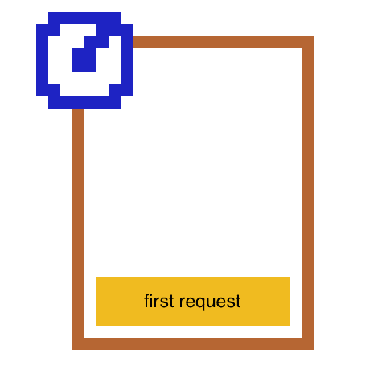
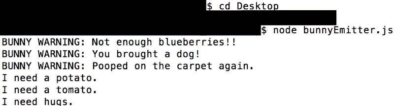

# 学习 Node.js 和准将·弗金斯第二部分:事件、事件发射器和事件循环

> 原文：<https://www.freecodecamp.org/news/learn-node-js-with-brigadier-fluffykins-part-ii-events-eventemitter-the-event-loop-6d4c139694fb/>

欢迎来到第二部分**跟随准将 Fluffykins** 学习 Node.js，该系列旨在帮助您轻松了解 Node.js ❤

在第一部分中，准将·弗罗金斯和我介绍了 Node.js，你可以用它来构建什么，异步/同步概念。我指导您完成了安装，我们一起创建了您的第一台服务器。

这是光荣的:


今天的课程将涵盖:

*   为什么 Node.js 是一种事件驱动的语言，以及这对异步行为的重要性
*   DOM 中的事件与 Node.js 中的事件是如何相似的
*   事件循环如何处理请求
*   使用*事件发射器*创建自定义事件

#### 事件驱动编程太棒了

由于 Node.js 是单线程的，为了让它创建并发性并且不会慢得令人痛苦——正如传统的客户端服务器模型在[第一部分](https://medium.com/free-code-camp/learn-node-js-with-brigadier-fluffykins-i-basics-async-sync-create-your-first-server-b9e54a45e108#.6jgtvz314)中解释的那样——它使用事件来监听请求。

这与 Apache 不同，Apache 是一种使用多线程 HTTP 的 web 服务器。对于 Apache 收到的每个请求，它都会创建一个新线程来处理它。这意味着，是的，虽然您可以通过线程同时运行多个进程，但是所有请求的结果都必须在服务页面之前返回。

另一方面，Node.j 的事件驱动架构允许在一个线程上处理多个请求。例如，一旦*请求* *事件*被触发，回调和承诺就会异步处理这些请求。

这意味着，如果有多个请求传入，而请求 A 仍在做它的事情，请求 B 将开始获取结果——结果是请求 B 在请求 A 之前响应客户端，或者与请求 A 同时响应。

因为一切都处理得更快，所以客户端有更好的用户体验。让我们在本课中更详细地讨论这一点。

Node.js 的并发模型有一些缺点，但我们将在接下来的几课中讨论这一点。

#### DOM 中的事件类似于 Node.js 中的事件

这样考虑事件:正如事件与 DOM 对象交互一样，Node.js 中的许多对象都会发出事件。

如果你用 JavaScript 做过任何类型的 DOM 操作，那么你应该知道 DOM 可以有事件监听器，比如 *click* 、 *dblclick* 、 *submit、keydown、keyup* 等等。一旦被触发，事件将通过回调来处理。

例如，当你设置一个 *click* 事件时，你可以有一个回调说:“当某个东西被点击时，把第三个 div 变成蓝色！”

这里有一个编码的例子。

在你的*index.html*文件中:

在您的 *main.js 文件*中:

如果你想在你自己的浏览器中测试这个，这里有一些 CSS。这应该放在 *style.css* 中:

当客户端点击按钮时，我们的 *click* 事件被触发，我们的回调对 DOM 做了一些事情。在这种情况下，它将第三个 div 变为蓝色，并更改按钮内的文本。

就像 Node.js 中的*请求* *事件*一样，当客户端点击一个按钮时，就好像他们正在向 main.js 文件发送一个请求，而*点击*事件正在监听这个文件——就像*请求事件*会监听传入的请求一样。

然后，就像*响应* *事件*用回调中的一些信息来响应客户端一样，DOM 的 *click* 事件的回调通过改变第三个 div 的背景颜色来响应。它还会更改 html 文件中按钮的文本。

Node.js 中的事件和 DOM 中的事件之间的主要区别在于，DOM 事件主要附属于客户端的 DOM 对象，而 Node.js 的事件更关注客户端和服务器之间的关系。

Node.js 从对象中发出事件，比如 web 服务器对象( *http.createServer)。*幸运的是，您实际上已经在第 1.5 步中使用了[第一部分](https://medium.com/free-code-camp/learn-node-js-with-brigadier-fluffykins-i-basics-async-sync-create-your-first-server-b9e54a45e108#.6jgtvz314)中的事件！

在这一步中，您将 web 服务器对象保存在它自己的变量中，并通过附加到第一个参数中的 *http.createServer* 对象的*请求事件*来监听传入的请求。

这个对象下面是*事件发射器* *构造器*，我们很快就会了解到。现在，回顾一下我们在[第一部分](https://medium.freecodecamp.com/learn-node-js-with-brigadier-fluffykins-i-basics-async-sync-create-your-first-server-b9e54a45e108#.bvd38wc9b)中设置的代码，看看你是否对我们的事件解释有了更好的理解。

这里再次供参考:

#### 事件循环

好了，你对事件以及它们与 Node.js 的关系有了基本的了解，但是 Node.js 实际上是如何工作的呢？

Node.js 在读取你的代码时做的第一件事就是订阅你使用的事件，比如*请求*、*监听*、*连接*或者*关闭。*一旦完成，它就进入*事件循环*并在单线程中持续监听这些事件。

例如，在我们之前创建的服务器中，它只监听*请求事件*，因此事件循环认为:

“有什么要求吗？”

“现在怎么样？”

"…. "

“现在？”

“现在对吗？”


Brigadier Fluffykins likes to pretend he’s Jules Winfield.

别担心，Node.js 的单线程事件循环不是 Jules Winfield。它实际上只是耐心地等待和监听它以前在后台订阅的事件。

如果请求确实到达，它会触发*请求* *事件*并运行我们编写的回调——在我们的例子中，是我们之前的服务器示例中的 *end* 方法内的迷你 html。还要注意事件可以触发其他事件。

但是如果多个请求同时出现呢？像*请求*和*关闭*事件？事件循环将一次处理一个事件。因此，首先将处理*请求* *事件*，然后处理*关闭* *事件*。当它们被处理时，它们不会阻止更多的事件进入。如果他们这样做了，我们的代码将运行两倍的时间。

#### 让我们进一步探究这一切意味着什么

因此，当我们说 JavaScript 是单线程的时候，我们是说它只有一个 [*调用栈*](https://en.wikipedia.org/wiki/Call_stack)——跟踪将在代码中执行的函数。每个金色条代表*调用栈*中的一个函数。最后添加到顶部的函数是第一个执行并弹出的函数。


Call Stack — Last in, first out.

如果 JavaScript 是一种同步语言，我们有两个请求，你认为会发生什么？我们必须等待第一个请求的结果返回，然后才能处理第二个请求。这意味着第一个请求将停留在*调用堆栈*中，阻止任何其他请求进入，直到返回必要的结果。

一旦检索到结果，第一个请求“弹出”，只有这时第二个请求才会进入*调用栈*并被执行:



If JavaScript was synchronous.

JavaScript 通过将异步函数存储在其他地方，而其他快得多的任务先运行来实现其并发模型。然后，当我们的异步函数收到它需要的东西时，它最终会执行。至少这是它的主旨。

现在我们已经知道了*调用栈*，让我们更深入地研究一下。

当一个带有回调或事件的异步函数进入*调用栈*时，它会自动进入 *Web API* 。 *Web API* 是存储订阅了*事件循环*的事件的地方。它们等待来自*事件循环*的命令，该循环监听是否有任何事件被调用。

一旦有人触发了一个事件，例如，*请求事件*，这个事件的回调就会被发送到一个*事件队列*。这个队列也被称为*回调队列*或者简称为*任务队列。*

我们对队列使用多个名称的原因是，对于异步函数(或方法)来说，发生在事件上的过程是相同的，任何有回调的东西，包括 DOM 事件和不属于本地 JavaScript 的事件函数，如 *ajax* 和 *setTimeout* (是的，它们是 *Web API* 的一部分，而不是 JavaScript)。

现在发生的最后一件事是*请求事件*的回调将在这个*事件/回调/任务队列*中等待*调用栈*清空。这与 JavaScript 处理内存的方式有关——所以基本上只要知道一旦我们到达这个阶段，我们必须等到所有的函数仍然空着，然后我们才能将回调添加到*调用栈*并处理它。

以下是我们刚才解释的所有内容的可视化演示:

1.  JavaScript 扫描您的代码，并将函数、事件和其他所有东西堆叠在*调用栈*中。
2.  下面的金色条是常规的、非异步的函数。最后的粉色和绿色条是两个请求事件。这些事件订阅了*事件循环*(由准将·弗菲金斯扮演)并在 *Web API* 中等待被调用。
3.  当事件等待时，在*调用栈*上执行其他函数。
4.  一旦一个事件被触发，*事件循环*会听到它，并且那个特定事件的回调会移入*队列。*虽然*，*因为这是*请求事件*，它会先等待它需要的任何结果。只有这样，它才会将回调发送到队列中。
5.  当在*调用栈*上仍有函数在运行和执行时，事件必须等待*调用栈*清空才能运行。准将·弗菲金斯让他们知道是否可以移入*调用堆栈*，这取决于堆栈是否为空。


**Left:** Call Stack. **Top Right:** Web API. **Bottom Right:** Queue. **Brigadier Fluffykins is the Event Loop.**

### 让我们创建自定义事件！

事件发射器在 Node.js 库中被广泛使用，所以让我们学习如何创建我们自己的发射器，并更好地理解它们是如何工作的！

所有发射事件的对象都是 *EventEmitter* *类*的实例，所有事件都继承自 *EventEmitter 构造函数*。我们将为 *bunnyError* 事件发射器创建两个事件— *bunnyWarning* 和 *bunnyNeed* 。

复制并粘贴到一个名为 *bunnyEmitter.js* 的文件中:

好吧，这里发生了什么？

首先我们需要 Node.js 的 *EventEmitter 对象*，然后我们创建一个新的 EventEmitter 对象的实例，我们将为其构建自定义事件。我们把这个实例叫做 *bunnyError* 。

然后，我们为第一个事件 *bunnyWarning* 创建一个事件监听器，用 *on* 方法监听事件。我们通过触发一个简单的打印“兔子警告:警告”的回调来处理这个事件

注意我使用了*模板文字*——ES6 的一个特性。你可以在这里了解更多他们[。和说 *console.log("兔子警告:"+ message)* 是一样的。](https://medium.freecodecamp.com/learn-es6-the-dope-way-part-iii-template-literals-spread-operators-generators-592765337294#.7udhwbjrl)

最后，我们使用 *emit* 方法来触发或调用事件。一旦事件被调用，回调应该运行。我们想做多少次都可以。

假设文件在您的桌面上，在 shell 中键入 *node bunnyEmitter.js* :



如果您只想让事件发射器触发一次， *EventEmitter 对象*有一个名为*的方法。一旦*可以代替*使用。开:*

```
yourEventEmitter.once(yourEvent, yourCallback)
```

有了这个，无论你发出多少次 *yourEvent* ，它都只会工作一次。

限制事件侦听器的数量是一个很好的做法。事实上如果你有十个以上，你会得到一个警告:

```
"(node) warning: possible EventEmitter memory leak detected. 11 listeners added. Use emitter.setMaxListeners() to increase limit."
```

到目前为止，您已经看到了诸如*事件*、*事件监听器*和*事件处理器*等术语。在我们继续之前，让我们先弄清楚主要的区别:

*事件监听器*是您创建的用于监听任何传入事件的*事件*。*事件处理程序*是在*事件监听器*听到*事件*时触发的回调。

在我们的自定义事件发射器示例中，*事件侦听器*是 *bunnyWarning* 和 *bunnyNeeds* ，而*事件处理程序*是每个事件的回调。

#### 查看这些额外资源

*   [事件上的 Node.js 文档](https://nodejs.org/api/events.html)
*   [DOM 的事件列表](https://developer.mozilla.org/en-US/docs/Web/Events)
*   您学习了创建一个事件发射器的实例，但是如果您想扩展它并在不同的文件中使用它呢？[查看本教程](http://www.hacksparrow.com/node-js-eventemitter-tutorial.html)
*   [了解更多关于 EventEmitter 对象的方法](http://www.tutorialspoint.com/nodejs/nodejs_event_emitter.htm)
*   [想了解有关事件循环的更多信息吗？](http://www.tutorialspoint.com/nodejs/nodejs_event_loop.htm)

恭喜你。你已经通过**学习 Node.js 与准将·弗菲金斯**第二部分！在今天的课程中，您了解了 Node.js 是一种事件驱动语言，以及为什么它对异步行为很有用。您还了解了如何通过事件循环处理这些事件。

我们还深入了解了 DOM 事件和 Node.js 中的事件之间的相似之处，以帮助您更轻松地进入这个新领域。

最后，我们创建了第一个事件发射器和两个令人敬畏的事件！

让我们进一步了解这些主题，以及我们在接下来的几节课中只涉及到的其他主题。感谢您的阅读，敬请关注。

点击下面的❤并关注，让你的智慧保持最新，因为更多的**学习 Node.js 与准将 Fluffykins** 即将进入中级！

第一部分:同步、异步和创建您的第一台服务器！

[**第二部分:事件，EventEmitter &事件循环**](https://medium.com/@__Masha__/learn-node-js-with-brigadier-fluffykins-part-ii-events-eventemitter-the-event-loop-6d4c139694fb#.957cacwgv)

[**第三部分:请求对象，配置路由，服务文件**](https://medium.com/@__Masha__/learn-node-js-with-brigadier-fluffykins-part-iii-request-object-configure-routes-serve-files-7666f783dc10#.g5j0faw3x)