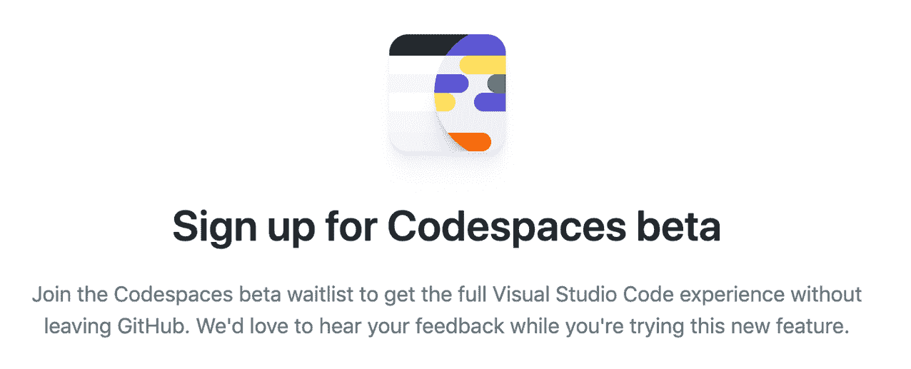
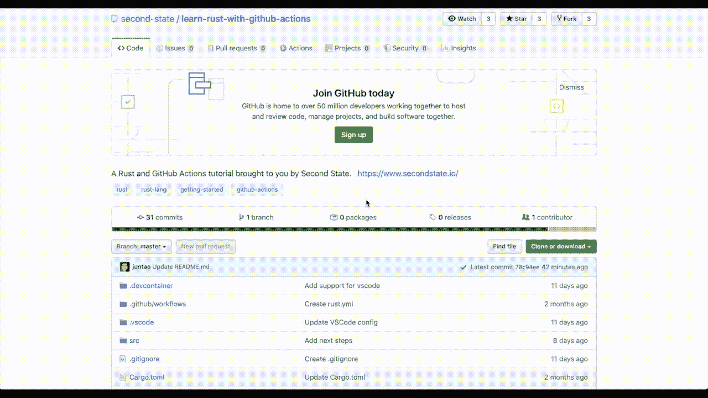
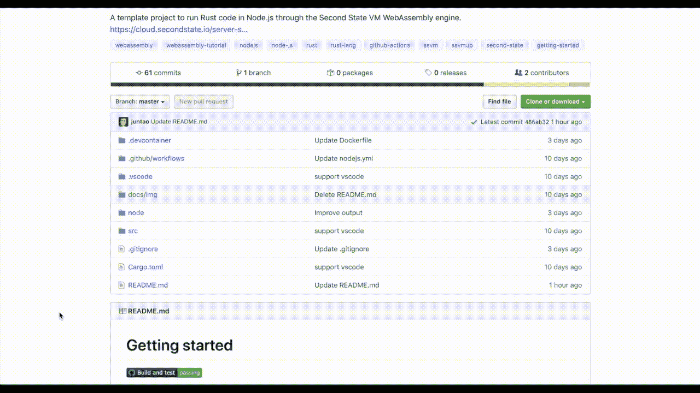
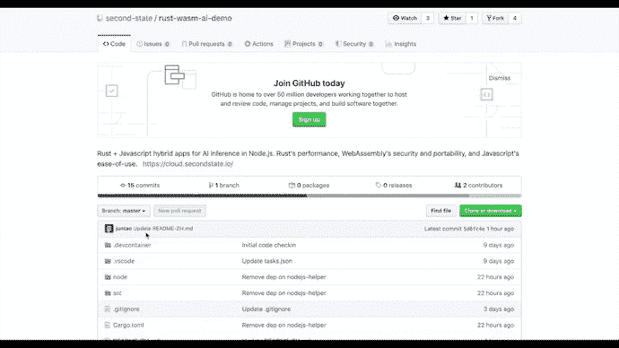

# GitHub Code spaces——如何在您自己的云开发环境中在您的浏览器中正确编码

> 原文：<https://www.freecodecamp.org/news/learn-programming-in-your-browser-the-right-way/>

GitHub Codespaces 使您能够直接在 web 浏览器上试验复杂的软件开发栈。没有要安装或配置的软件。没有压力。不乱。


A gif showing the setup process of a GitHub Codespace

在最近的 GitHub 卫星在线会议上，最令人兴奋的产品发布之一是 GitHub Codespaces。想法是在每个存储库上有一个代码按钮。

当您单击它时，它会启动一个全功能的 VSCode IDE，其中包含所有必要的软件依赖项，包括操作系统级库，以构建和运行项目。这个 VSCode IDE 完全在您的浏览器中运行，不会安装任何软件或更改任何配置来搞乱您的计算机。

听起来好得难以置信？好吧，自己去看 Github 卫星关于 Codespaces 的主题演讲吧！

[https://www.youtube.com/embed/fQbH3meWNQ8?feature=oembed](https://www.youtube.com/embed/fQbH3meWNQ8?feature=oembed)

A clip from the keynote: https://youtube.com/watch?v=L618Pp0n7us

Github Codespaces 的一个主要好处是你可以很快地让新开发人员加入到一个项目中。一个新的开发人员可以在几分钟而不是几天内准备好，并立即开始为项目做贡献。对于新的语言、框架和软件工具来说，这是一个很好的学习工具。

在幕后，它在远程服务器上启动 Docker 容器，安装项目所需的整个软件栈，并在远程 Docker 中运行编译和调试等任务。

web 浏览器充当 Docker 实例的前端 UI。这种方法不需要在开发人员的机器上安装软件。但是代价是从操作系统到最终应用程序的所有软件安装都发生在服务器上。

GitHub 必须为每个代码空间实例启动一个新的服务器。这需要大量的数据中心资源。事实上， [GitHub Codespaces 网页](https://github.com/features/codespaces/)在今天(2020 年 6 月)就有一个等候名单。




就我个人而言，我迫不及待地想看到 GitHub Codespaces 的出现。但是时间机器确实存在。今天你可以免费体验 GitHub Codespaces 的所有功能。

## VS 代码空间

GitHub Codespaces 背后的软件实际上是基于一个叫做 [VS Codespaces](https://online.visualstudio.com/) 的微软 VSCode 产品。VS 代码空间现在对所有微软 Azure 用户开放。是的，它允许你直接从浏览器窗口打开 VSCode IDE 中的 GitHub 库。

在本教程中，我将向您展示如何在您自己的开发工作中使用代码空间。

要使代码空间在 GitHub 存储库中可用，您只需在 web 页面的任意位置添加以下 HTML 按钮。

当 Azure 用户点击按钮时，它会要求用户登录 VS Codespaces，并引导用户在在线 IDE 中打开存储库。您可以在下一节的示例中看到它是如何工作的。

```
<p>
  <a href="https://online.visualstudio.com/environments/new?name=My%20Project&repo=username/reponame">
    
  </a>
</p>
```

HTML example for adding a VS Codespaces launch button for your GitHub repo

> VS Codespaces 完全在你的浏览器上运行，每个工作日大约花费 1 美元。比办公室一杯咖啡还便宜。

## 例子

现在，让我们看几个例子，看看如何使用 VS 代码空间学习新的编程技能。

Rust 是当今发展最快的编程语言之一。它连续四年被 Stackoverflow 用户选为最受喜爱的编程语言。

但是实验 Rust 需要一个复杂的工具链，包括编译器、链接器、包管理器、工具管理器等等。

VS Codespaces 提供了一个简单的方法来[了解 Rust](https://www.secondstate.io/articles/how-to-learn-rust-without-installing-any-software/) 。只需点击[这个库](https://github.com/second-state/learn-rust-with-github-actions)中的 VS 代码空间按钮，你现在就有了一个可以进行实验的 Rust 项目！



[https://github.com/second-state/learn-rust-with-github-actions](https://github.com/second-state/learn-rust-with-github-actions)

作为一种系统语言，Rust 非常适合构建高性能的服务器端应用程序。最有前途的堆栈是在 WebAssembly 容器中编译和运行 Rust 函数，然后从现有的 web 应用程序框架(如 Node.js)中访问那些高性能函数。

然而，正如您已经看到的，这种“最佳实践”设置需要一套复杂的软件。

点击这个库的[中的 VS 代码空间按钮，你会看到一个全功能的 Node.js 项目，它使用 WebAssembly](https://github.com/second-state/ssvm-nodejs-starter) 中的 [Rust 函数作为模块。您可以立即开始修改 Rust 和 JavaScript 代码，并从 web 浏览器 ide 中运行 Node.js 应用程序。](https://www.secondstate.io/articles/getting-started-with-rust-function/)



[https://github.com/second-state/ssvm-nodejs-starter](https://github.com/second-state/ssvm-nodejs-starter)

[服务器端 Rust 和 WebAssembly](https://www.secondstate.io/articles/why-webassembly-server/) 听起来很酷。但是，除了简单的 hello world 之外，我们真的有更完整的例子来展示 Rust 的能力和性能吗？

[这个库](https://github.com/second-state/rust-wasm-ai-demo)就是这样一个例子。在 VS Codespaces 中打开它，你会有一个利用 Tensorflow 执行图像识别的 [Rust + JavaScript 应用程序的项目](https://www.secondstate.io/articles/artificial-intelligence/)。由于该应用程序运行在 Node.js 内部，它为 AI 即服务 web 应用程序提供了一个模板。



[https://github.com/second-state/rust-wasm-ai-demo](https://github.com/second-state/rust-wasm-ai-demo)

如果您想保持领先地位，使用基于 Rust 的 web 运行时 Deno，而不是基于 C 的 Node.js，该怎么办？嗯，有一个 VS Codespaces [模板也可以作为 Azure 函数](https://github.com/anthonychu/azure-functions-deno-worker)运行 Deno！

## 它是如何工作的

如果仔细观察，每个支持 VS 代码空间的存储库都有一个`.devcontainer`文件夹。在这个文件夹中，`Dockerfile`指定了如何为开发环境构建 Docker 容器。

例如，Node.js Docker 容器基于 Ubuntu Linux，预装了 Node.js 和选定的 NPM 软件包。[点击此处查看示例](https://github.com/second-state/ssvm-nodejs-starter/tree/master/.devcontainer)。

`devcontainer.json`文件指定了远程 Docker 上 VSCode IDE 的配置。例如，它配置要安装的 VSCode 扩展、要使用的终端和调试器命令，以及要转发到的用于测试和调试的主机端口。

微软提供了[相当多的`.devcontainer`模板](https://github.com/microsoft/vscode-dev-containers)供你修改和使用。它们涵盖了当今大多数常见的软件开发栈。

您可以通过在`.vscode`文件夹中提供启动和任务定义来进一步定制用户的 VSCode 体验。[看看他们](https://github.com/second-state/ssvm-nodejs-starter/tree/master/.vscode)！

## 结论

随着 VS Codespaces 和 GitHub Codespaces 的推出，软件开发的障碍和摩擦进一步减少。您可以在不离开 web 浏览器的情况下开始使用复杂的软件堆栈。[今天就试试](https://www.secondstate.io/articles/getting-started-rust-nodejs-vscode/)！

最后，在 GitHub Codespaces 上观看完整的 GitHub 卫星演示。

[https://www.youtube.com/embed/dy2eYaNxaQc?feature=oembed](https://www.youtube.com/embed/dy2eYaNxaQc?feature=oembed)

A preview of GitHub Codespaces

订阅我的简讯并保持联系。

[https://webassemblytoday.substack.com/embed](https://webassemblytoday.substack.com/embed)