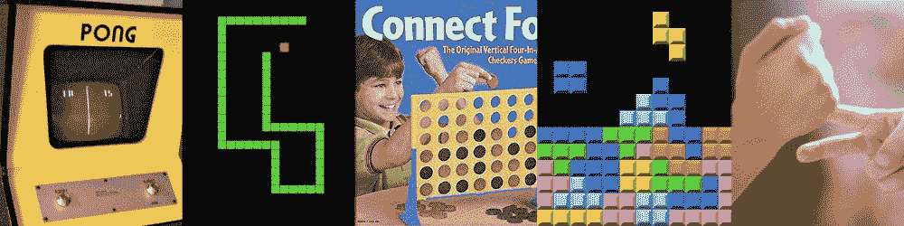

# 通过构建 5 个游戏来学习 Python

> 原文：<https://www.freecodecamp.org/news/learn-python-by-building-5-games/>

许多人通过构建项目来学习编程语言。如果你想通过编写五个游戏来学习 Python，可以看看我们刚刚在 freeCodeCamp.org YouTube 频道上发布的 7 小时视频课程。我们收集了 5 个很棒的游戏开发教程，可以帮助你学习 Python。

您将构建 Pong、Snake、Connect Four、俄罗斯方块和一个简单的多人游戏。这些都是流行的游戏，玩起来很有趣，代码也很有趣。

Code games in Python!

本课程采用基于项目的方法。如果你通过实践学得最好，这就是适合你的课程。你将从 Christian Thompson、Keith Galli 和 Tech with Tim 学习。这些经验丰富的老师会帮助你理解项目中的每一行代码。

你不需要之前的编程经验来学习本课程。不过，如果您了解一些基本的编程概念，这将非常有用，因为本课程会跳过基本的语法说明，直接跳到构建项目中。

### 使用命令行、turtle 和 Pygame 构建游戏

其中一个游戏就是用命令行。为命令行编写代码是学习基本编程技能的好方法，而不必担心图形。

另一个游戏使用海龟图形模块。这是一个内置模块，通常用于教授初级编程技能，也可用于简单的游戏。

您还将学习使用 Pygame 构建游戏。Pygame 是一组 Python 模块，用于创建各种游戏，甚至是高级游戏。它使得向 Python 程序添加图形和声音变得很容易。

在最后一部分，您将学习如何使用套接字和网络用 Python 编写可扩展的多人游戏。您将学习如何部署您的游戏，以便世界上任何地方的人都可以相互对战。

通过构建一个多人游戏，你将学习一些概念，如开发客户端和服务器，发送加密数据，以及将多个客户端连接到一个服务器。

你可以在 freeCodeCamp.org YouTube 频道观看完整的课程(7 小时观看)。