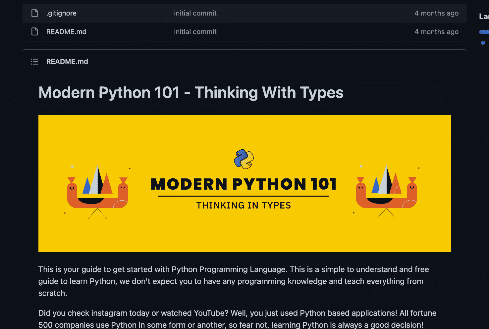

# 通过类型思维学习 Python

> 原文：<https://www.freecodecamp.org/news/learn-python-by-thinking-in-types/>

你今天看了 Instagram 还是看了 YouTube？嗯，您使用了基于 Python 的应用程序！Python 是最流行的编程语言之一。

我们刚刚在 freeCodeCamp.org YouTube 频道上发布了一个新的 Python 课程。

我们在 freeCodeCamp.org YouTube 频道上有很多 Python 课程，所以你可能想知道为什么我们还需要一个。本课程使用一种有趣的方法来教授 Python。你将通过类型思维来学习 Python。该课程侧重于基本的编程概念，而不仅仅是教授语言语法。从许多不同的角度学习总是有帮助的，本课程可能正是你理解 Python 所需要的。

来自 Octallium 的 Anil Kulkarni 开发了这个课程。Anil 以创作易于理解的视频、教程和文章而闻名

Python 是初学者学习的完美语言。使用 Python 你几乎可以做任何事情:创建你自己的网络应用程序，创建游戏，桌面应用程序，数据科学项目，人工智能，等等！

虽然 Python 是最容易学习的语言之一，但要真正掌握它往往需要大量的时间和练习。人们经常混淆学习语言语法和学习编程。在本课程中，这种差异非常明显。你将被引导通过有效学习 Python 所需的基本原则。

Anil put together a comprehensive guide on GitHub to go along with this course.

以下是本综合课程涵盖的所有主题:

*   介绍
*   欢迎& Github 链接
*   Python 之旅
*   安装和设置本地机器
*   安装故障排除(Mac)
*   你好世界
*   理解变量
*   创建变量
*   存储器分配
*   变量声明规则
*   原始数据类型
*   字符串格式
*   第一个 Bug
*   练习字符串格式
*   If/Else
*   和/或
*   对于循环
*   While 循环
*   匹配运算符
*   游戏-拯救佐尔坦
*   列表
*   元组
*   词典
*   一组
*   游戏-拯救佐尔坦
*   列举型别
*   函数介绍
*   更好的功能
*   重量
*   飞
*   Args & Kwargs
*   全球和本地范围
*   游戏-拯救佐尔坦
*   高阶函数
*   面向对象编程(OOP)
*   类与实例
*   方法
*   字符类
*   类别的使用
*   成员
*   遗传和多态性
*   装修工
*   游戏-拯救佐尔坦
*   神奇的方法
*   错误处理
*   尝试/例外
*   try/Except/Else/最后
*   断言错误
*   引发错误
*   了解模块
*   包装
*   本地包导入
*   __init__.py
*   VOC-DTP
*   收银机-第 1 部分
*   收银机-第二部分
*   游戏-拯救佐尔坦
*   最后的话

观看 freeCodeCamp.org YouTube 频道的全部课程(9 小时观看)。

[https://www.youtube.com/embed/jH85McHenvw?feature=oembed](https://www.youtube.com/embed/jH85McHenvw?feature=oembed)