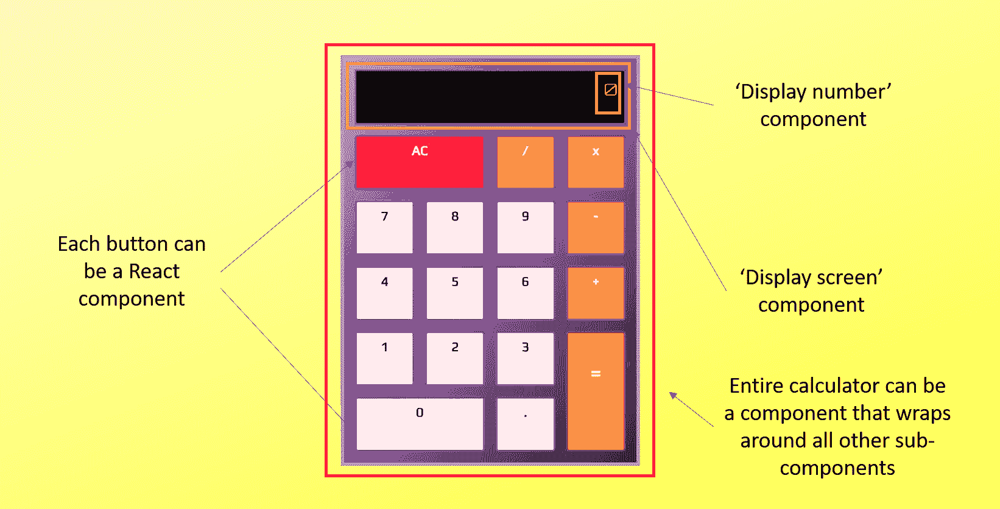

# 在 10 分钟内学习 React 基础知识

> 原文：<https://www.freecodecamp.org/news/learn-react-basics-in-10-minutes/>

如果你想在喝一杯咖啡的时间里学习 React 的基础知识，这篇文章是为你准备的。

这篇文章旨在提供一个初学者友好的介绍 React，它是什么，以及我们为什么需要它。它假设你对基本的 JavaScript 有所了解。

我们将讨论它的一些基本概念，并回顾您可以用 React 构建什么。

我们还将讨论一些代码，但总体目标是对 React 有一个直观的理解，这样您就可以轻松掌握基础知识。

## 什么是反应？

由脸书在 2011 年开发的 React 已经迅速成为使用最广泛的 JavaScript 库之一。根据 HackerRank 的调查，30%的雇主会寻找懂 React 的开发人员，但是只有大约一半的申请人真正具备所需的知识。

显然，React 在就业市场上需求量很大。

那么 React 到底是什么？

React 是一个高效灵活的 JavaScript 库，用于构建用户界面(React 本身就是用 JavaScript 编写的)。它将复杂的用户界面分解成称为“组件”的小而孤立的代码。通过使用这些组件，React 只关心你在网站首页上看到的内容。



A calculator app that can be split into React components.

组件是独立的，可重用的。它们可以是 JavaScript 函数或类。无论哪种方式，它们都返回一段代表部分网页的代码。

下面是一个在页面上呈现一个`<h2>`元素的函数组件的例子:

```
function Name() {
  return <h2>Hi, my name is Joe!</h2>;
}
```

这里有一个类组件做同样的渲染:

```
class Person extends React.Component {
  render() {
    return <h2>Hi again from Joe!</h2>;
  }
}
```

使用类组件需要花费更多的精力，因为您必须扩展 React。组件(React 库的一部分)，而函数组件主要是普通的 JavaScript。然而，类组件提供了功能组件所缺乏的某些关键功能(参见 React 中的[功能与类组件)。](https://medium.com/@Zwenza/functional-vs-class-components-in-react-231e3fbd7108)

您可能已经注意到，每个组件内部都奇怪地混合了 HTML 和 JavaScript。React 实际上使用了一种叫做 JSX 的语言，它允许 HTML 和 JavaScript 混合使用。

您不仅可以使用 JSX 返回预定义的 HTML 元素，还可以创建自己的元素。例如，您可以不直接在类组件中呈现`<h2>`元素，而是呈现返回相同内容的功能组件:

```
class Person extends React.Component {
  render() {
    return <Name />;
  }
}
```

请注意组件的自结束“/>”。

React 的力量开始变得更加明显，因为您可以想象呈现许多简单的组件来形成一个更复杂的组件。

要构建一个页面，我们可以按照一定的顺序调用这些组件，使用它们返回的结果，并将它们显示给用户。

## 为什么选择 React 而不是普通的 JavaScript？

能够通过使用组件来分解复杂的 ui 使 React 比普通的 JavaScript(没有任何外部库或框架的普通 JS)更有优势。但还有什么能让它在雇主中如此受欢迎呢？

让我们来看看 React 和 vanilla JS 处理事情的不同之处。

在上一节中，我们讨论了 React 如何使用组件来呈现 ui。我们没有深究 HTML 方面发生了什么。令人惊讶的是，与 React 配对的 HTML 代码非常简单:

```
<div id="root"></div>
```

它通常只是一个带有 id 的`<div>`元素，作为 React 应用程序的容器。当 React 呈现其组件时，它将查找要呈现到的 id。在此呈现之前，页面是空的。

另一方面，Vanilla JS 在 HTML 中定义了初始 UI。

此外，普通 JS 负责功能，而 HTML 负责显示内容(标记)。

在网络的早期，功能和标记的分离听起来很合理，因为应用程序更简单。然而，随着复杂性的增加，维护大量 JS 代码也变得越来越麻烦。

更新一段 HTML 的 JS 代码可以分布在几个文件中，开发人员可能很难跟踪代码的来源。他们必须把不同文件中的代码之间的所有交互保持在头脑中。

React 将代码分类成组件，每个组件维护显示和更新 UI 所需的所有代码。

更新 UI 需要更新 DOM 或文档对象模型(参见[使用 JavaScript 的 DOM 操作](https://1000mileworld.com/dom-manipulation-using-javascript/))。这是 React 真正闪光的地方。

如果您想访问 vanilla JS 中的 DOM，您必须首先找到它，然后才能使用它。React 将数据存储在常规的 JS 变量中，并维护自己的*虚拟* DOM。

如果您想在 vanilla JS 中更新 DOM，您必须找到适当的节点，然后手动添加或删除元素。React 根据应用程序的状态自动更新 UI，我们将在下一节详细讨论这一点。

因此，我们之所以想要使用 React 而不是普通 JS 的主要原因可以用一个词来概括:简单。

使用 vanilla JS，很容易迷失在 DOM 搜索和更新的迷宫中。React 迫使你将你的应用程序分解成组件，这产生了更易维护的代码。

因此，对于复杂的应用程序，你肯定想学习 React。

## 基本反应概念

我们已经讨论了 React 如何使用组件来分解复杂的 ui 和 JSX 来呈现这些组件。

在本节中，我们将讨论 React 的一些更基本的概念。

### 状态

如前所述，React 基于应用程序状态更新 UI。这种状态实际上是作为 React 类组件的属性存储的:

```
class Counter extends React.Component {
  state = {
    value: 0
  };
}
```

假设我们有一个计数器和两个增加或减少的按钮。计数器的值通过 JSX 呈现在页面上。

显示计数器值基于状态，我们通过单击其中一个按钮来更改状态。Vanilla JS 将按钮点击视为一个事件，并作出反应。当这样的事件发生时，我们将调用函数，根据点击的按钮增加或减少计数器。这些函数有改变组件状态的代码。

下面是这种计数器的一个例子:

```
class Counter extends React.Component {
  state = {
    value: 0
  };
handleIncrement= () => {
  this.setState(state => {
     value: state.value + 1 
  });
};
handleDecrement= () => {
  this.setState(state => {
     value: state.value - 1 
  });
};
render() {
    return (
      <div>
        <h2>{this.state.value}</h2>
        <button onClick={this.handleDecrement}>Decrement</button>
        <button onClick={this.handleIncrement}>Increment</button>
      </div>
    );
}
}; 
```

我们通过在每个处理按钮点击的函数中调用`setState`来更新状态。页面上显示的计数器将实时更新。因此，React 得名于它对状态变化的反应*。*

*简而言之，React 自动监视每个组件状态的变化，并相应地更新 DOM。*

### *小道具*

*我们可以使用 props(“属性”的缩写)来允许组件相互对话。*

*假设我们上一个例子中的计数器表示客户希望购买的产品数量。商店希望每位顾客最多购买 2 件产品。在结帐时，如果顾客试图购买 2 个以上，我们希望显示适当的消息。*

*下面是我们如何用道具做到这一点:*

```
*`const Display = (props) => {
   let message;
   if(props.number>2){
	message = ‘You’re limited to purchasing 2 max!’;
   }else{
	message = ‘All’s good.’;
   }
   return(
	<p>message</p>
   );
};

class Timer extends React.Component {
   state = {
	quantity: 0
   }
   //...code for handling button clicking, updating state, etc.
    render(){
        return(
          <Display number = {this.state.quantity} />
          //...code for other components
       );
    }
};`*
```

 *我们创建一个名为`Display`的功能组件，并将 props 作为参数传递。当我们呈现这个组件时，我们将 number 作为一个属性传递给它，该属性设置为客户想要购买的产品的数量。这类似于设置 HTML 标签的属性。我们用`Display`中的`props.number`调用这个值来确定返回什么消息。

### 组件生命周期

当 React 基于组件状态更新 DOM 时，存在称为生命周期方法的特殊方法，以提供在组件生命周期的特定点执行操作的机会。

它们允许您在某个时间点捕获组件以调用适当的函数。这些时间点可以是在组件被呈现之前，在它们被更新之后，等等。您可能想要探索一个[组件的生命周期方法](https://www.freecodecamp.org/news/how-to-understand-a-components-lifecycle-methods-in-reactjs-e1a609840630/)。

要了解生命周期方法的作用，你可以看看我做的这个[番茄钟](https://codepen.io/1000mileworld/full/qBEwRvK)。

时钟定时器最初被设置为会话长度。当会话定时器倒计时到零时，定时器需要切换到中断长度，并从那里开始倒计时。

因为计时器是一个组件，所以我在我的主类组件中使用了生命周期方法`componentDidUpdate`来处理对`handleChange()`的任何更改:

```
componentDidUpdate() {
    this.handleChange();
}
```

您可以将生命周期方法视为向 React 组件添加普通 JS 中的事件侦听器。

## 用 React 可以构建什么？

现在你对 React 有了一个基本的了解，你能用它来构建什么呢？

我们在这篇文章的开头已经提到，脸书在 2011 年开发了 React，所以脸书平台自然是基于 React 的。其他完全或部分使用 React 的著名应用包括 Instagram、网飞和 Whatsapp。

但是作为 React 的初学者，我们并不希望立即构建下一个脸书，所以这里有一个列表，列出了 10 个 React Starter 项目想法，让你能够编写代码。

如果你想了解更多关于 web 开发的知识，并查看一些初学者友好的 React 项目的例子，请访问我的博客。

感谢阅读和快乐编码！*