# 通过建立一个迷因生成器来学习反应

> 原文：<https://www.freecodecamp.org/news/learn-react-by-building-a-meme-generator/>

模因很棒——它们是描述想法和观点的有趣方式。因此，我在 Scrimba 的免费课程中选择了一个热图生成器应用作为压轴戏项目，这绝非巧合。该应用程序的工作原理是从一个 API 中随机抽取一个迷因图像，并将你的文本放在它的顶部，以创建你自己的个性化迷因。

所以在这篇文章中，我会给你一步一步的指导来创建这个应用程序。如果你曾经感到困惑，你也可以在 Scrimba 课程中遵循这些步骤，从本讲座的[开始。](https://scrimba.com/p/p7P5Hd/c6K77um)

然后，如果你喜欢我的教学风格，并在完成本教程后有心情迎接更艰巨的挑战，请查看我即将推出的 Scrimba 高级课程。

> 注意:您应该已经相当熟悉 React 的一些基本概念，比如组件、状态、道具和生命周期方法。此外，本教程不使用钩子，但在我即将到来的课程中，我们将深入讨论钩子，并进行大量的使用钩子的练习。

## 1.创建样板文件并呈现应用程序组件

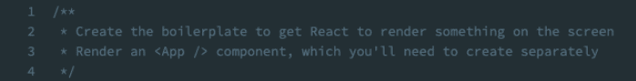

我们需要做的第一件事是为应用程序创建样板代码。为此，我们导入`React`和`ReactDOM`并使用`ReactDOM`来呈现一个名为`App`的组件，我们将在后面创建它。然后我们将`App`组件放在“根”上。我们还从它的文件`"./App"`中导入`App`，我们很快就会创建这个文件。

```
// index.js
import React from 'react';
import ReactDOM from 'react-dom';
import App from './App';

ReactDOM.render(<App />, document.getElementById('root')); 
```

然后我们创建我们的`App.js`文件。在其中，我们创建了一个名为`App`的功能组件，它现在返回一个简单的`<h1>`。然后我们出口它。`<h1>`允许我们检查应用程序是否正确显示在屏幕上。

```
import React from 'react';
function App() {
  return <h1>Hello world!</h1>;
}
export default App; 
```

得到的输出是这样的:
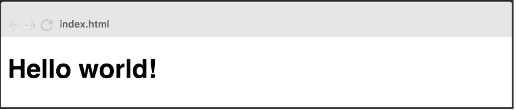

## 2.创建 Header 和 MemeGenerator 组件

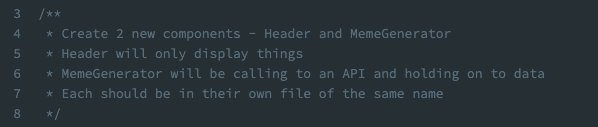

接下来，我们创建 Header 和 MemeGenerator 组件。Header 将只显示元素，而 MemeGenerator 将调用 API 并将数据保留在 state 中。

让我们从创建`Header.js`文件开始。既然 Header 是一个只用来显示的组件，那么它应该是一个功能性组件。现在，组件应该返回一个简单的`<h1>`。创建后，我们导出标题。

```
import React from 'react';
function Header() {
  return <h1>HEADER</h1>;
}
export default Header; 
```

接下来，我们创建`MemeGenerator.js`文件。因为`MemeGenerator`组件将保存数据并调用 API，所以它需要是一个类组件。我们仍然需要导入 React，因为它将是一个类组件，我们也将导入`Component`(这是一个名为 import 的[)。](https://developer.mozilla.org/en-US/docs/Web/JavaScript/Reference/Statements/import#Import_a_single_export_from_a_module)

MemeGenerator 需要一个调用`super()`的`constructor()`，因为它将保持状态，我们现在给它添加一些空状态。像在 Header 组件中一样，我们首先呈现一个简单的`<h1>`。然后我们导出 MemeGenerator。

```
import React, { Component } from 'react';
class MemeGenerator extends Component {
  constructor() {
    super();
    this.state = {}; //empty state
  }
  render() {
    return <h1>MEME GENERATOR SECTION</h1>;
  }
}
export default MemeGenerator; 
```

现在，我们将 Header 和 MemeGenerator 都导入到`App.js`中，并在我们的应用程序组件中分别创建一个实例。为了正确显示组件，我们将它们包装在一个`<div>`中。

```
import React from 'react';
import Header from './Header';
import MemeGenerator from './MemeGenerator';
function App() {
  return (
    <div>
      <Header />
      <MemeGenerator />
    </div>
  );
}
export default App; 
```

## 3.完成标题组件。

为了完成`<Header>`组件，我们通过插入一个``标签并将 src 设置为图像的 URL 来添加一个 trollface 图像。然后，我们添加一个带有我们应用程序名称的`<p>`标签，并将它们包装在语义 HTML5 `<header>`标签中。

```
function Header() {
  return (
    <header>
      
      <p>Meme Generator</p>
    </header>
  );
} 
```

由于样式超出了本课程的范围，CSS 样式已经创建并应用于`<header>`标签。结果是这样的:

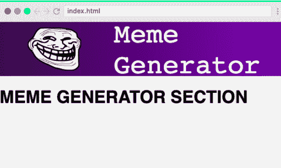

也就是说，学习者总是可以自己摆弄样式，磨练他们的 CSS 技能。现在`<Header/>`已经结束，剩下的挑战将在`<MemeGenerator/>`进行

## 4.初始化状态

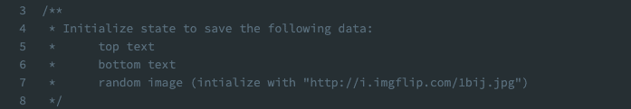

我们现在必须初始化状态，以便它保存一个顶部文本，一个底部文本和一个随机图像，这是已经提供的。

为此，我们构建了最初构建时放在`<MemeGenerator/>`中的空对象。我们将`topText`和`bottomText`初始化为空字符串，将`randomImg`初始化为提供的 URL。

```
class MemeGenerator extends Component {
  constructor() {
    super();
    this.state = {
      topText: '',
      bottomText: '',
      randomImg: 'http://i.imgflip.com/1bij.jpg'
    };
  }
} 
```

## 5.进行 API 调用

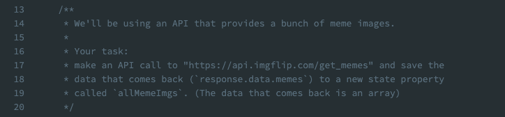

接下来，我们对提供的 URL 进行 API 调用，并将返回的数据(在`response.data.memes`中找到的数组)保存到名为`allMemeImgs`的新状态属性中。
当我们需要从一个端点加载数据以用于我们的组件时，提出请求的一个好地方是`componentDidMount()`生命周期方法。组件一挂载，我们就使用本机的`fetch()`函数来调用提供的 URL。

```
componentDidMount() {
  fetch("https://api.imgflip.com/get_memes")
} 
```

这将返回一个承诺，我们用`.json()`方法将它转换成一个 Javascript 对象。

```
componentDidMount() {
  fetch("https://api.imgflip.com/get_memes")
    .then(response => response.json())
} 
```

然后我们从`response.data`中提取模因数组，得到对我们有用的响应。

```
componentDidMount() {
fetch("https://api.imgflip.com/get_memes")
  .then(response => response.json())
  .then(response => {
  const { memes } = response.data
  })
} 
```

现在，我们将结果保存到一个名为`allMemeImgs`的新状态属性中。为此，我们将`allMemeImgs`初始化为一个空数组。

```
this.state = {
  topText: '',
  bottomText: '',
  randomImg: 'http://i.imgflip.com/1bij.jpg',
  allMemeImgs: []
}; 
```

现在，回到`componentDidMount()`，我们设置状态。由于我们对先前的状态不感兴趣，我们将`allMemeImgs`设置为 memes。

```
componentDidMount() {
  fetch("https://api.imgflip.com/get_memes")
    .then(response => response.json())
    .then(response => {
  const { memes } = response.data
  this.setState({ allMemeImgs: memes })
  })
} 
```

为了确保它能够工作，我们`console.log`了第一项，看起来像这样:

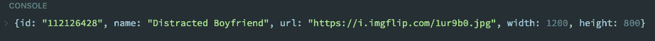

下面是整个`componentDidMount()`函数的概述。

```
componentDidMount() { //ensure that data is fetched at the beginning
  fetch("https://api.imgflip.com/get_memes") //call to URL
    .then(response => response.json()) //turn promise into JS object
    .then(response => {
  const { memes } = response.data //pull memes array from response.data
  console.log(memes[0]) // check data is present
  this.setState({ allMemeImgs: memes }) // set allMemeImgs state
})
} 
```

## 6.创建输入表单

我们现在想要创建一个最终允许用户输入顶部和底部文本的表单。我们用一个 HTML `<form>`标签和一个简单的写着“Gen”的`<button>`来做这件事。我们用预先提供的 CSS 样式。

```
render() {
  return (
    <div>
      <form className="meme-form">
        <button>Gen</button>
      </form>
    </div>
  )
} 
```

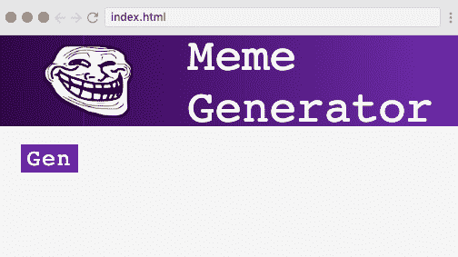

## 7.向表单添加输入字段

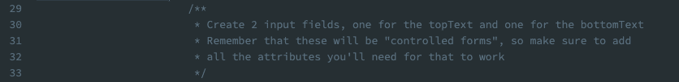

接下来，由我们添加两个输入字段(一个用于顶部文本，一个用于底部文本)。该表单应该是一个受控制的表单，所以我们需要添加所有需要的属性，以便工作。我们稍后将创建`onChange`处理程序。

我们创建两个输入字段，它们都具有类型`text`和适当的名称属性(`topText`和`bottomText`)。我们不使用标签，而是使用占位符:“顶部文本”和“底部文本”。

最后，为了使其成为[受控形式](https://reactjs.org/docs/forms.html#controlled-components)，我们用`{this.state.topText}`和`{this.state.bottomText}`将该值设置为等于`state`中的当前值。

```
render() {
  return (
    <div>
      <form className="meme-form">
        <input
          type="text"
          name="topText"
          placeholder="Top Text"
          value={this.state.topText}
        />
        <input
          type="text"
          name="bottomText"
          placeholder="Bottom Text"
          value={this.state.bottomText}
        />
        <button>Gen</button>
      </form>
    </div>
  )
} 
```

## 8.创建 onChange 处理程序。

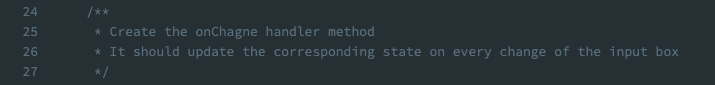

现在，我们创建 onChange 处理程序，它将在输入字段每次改变时更新相应的状态。

首先，我们创建一个接收事件的`handleChange()`函数。

```
handleChange(event) {

} 
```

现在，我们将两个输入字段的`onChange`设置为等于`handleChange`。

```
<form className='meme-form'>
  <input
    type='text'
    name='topText'
    placeholder='Top Text'
    value={this.state.topText}
    onChange={this.handleChange}
  />
  <input
    type='text'
    name='bottomText'
    placeholder='Bottom Text'
    value={this.state.bottomText}
    onChange={this.handleChange}
  />
  <button>Gen</button>
</form> 
```

我们需要记住在构造函数中绑定方法——这是 React 开发人员的常见问题。

```
constructor() {
  super()
  this.state = {
    topText: "",
    bottomText: "",
    randomImg: "http://i.imgflip.com/1bij.jpg",
    allMemeImgs: []
  }
  this.handleChange = this.handleChange.bind(this)
} 
```

为了测试新的`handleChange()`函数，我们添加了一个简单的`console.log`:

```
handleChange(event) {
  console.log("Working!")
} 
```

如果发射正确，你会看到这样的东西:
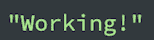

现在来填写`handleChange()`函数。为此，我们希望从 event.target 中提取 name 和 value 属性，这样我们就可以获得应该更新的州名(`topText`或`bottomText`)以及键入到框中的值。

```
handleChange(event) {
  const { name, value } = event.target
} 
```

我们现在将使用这些来更新状态。由于我们对之前的状态不感兴趣，我们可以只提供一个对象，在该对象中我们将`[name]`设置为输入到输入字段中的值。

```
handleChange(event) {
const {name, value} = event.target
this.setState({ [name]: value })
} 
```

## 9.在顶部和底部文本旁边显示一个迷因图像

我们现在希望应用程序在顶部和底部文本旁边显示一个迷因图像。我们在`<form>`下面插入一个``标签，并使用`src={this.state.randomImg}`将我们初始化的`randomImg`设置为它的源。然后我们添加两个`<h2>`标签，显示相应的文本，这些文本也保存在 state 中。所有这些都被包装在一个`div`中，并用预先提供的`meme`类进行样式化。

```
<div className='meme'>
  
  <h2 className='top'>{this.state.topText}</h2>
  <h2 className='bottom'>{this.state.bottomText}</h2>
</div> 
```

我们现在可以通过在文本框中键入来测试应用程序。由于在每次击键时都正确设置了状态，所以每次我们键入时，图像上显示的文本都会发生变化。

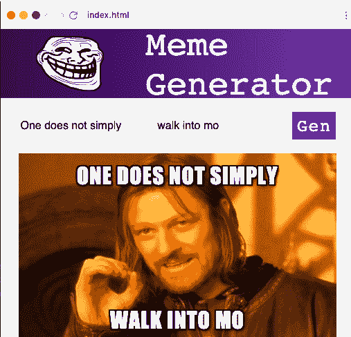

## 10.在顶部和底部文本旁边显示随机的迷因图像

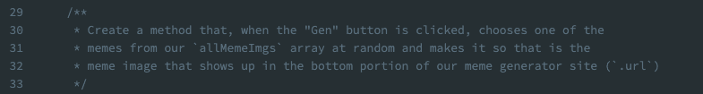

现在，我们需要创建一个方法，当点击`Gen`按钮时，它从我们的`allMemeImgs`数组中随机选择一个 meme 图像。数组中所选图像的属性是`.url`。我们可以把这项任务分成更小的部分。

首先，我们将表单的`onSubmit`设置为新方法的名称，我们称之为`handleSubmit()`。

`<form className="meme-form" onSubmit={this.handleSubmit}>`

我们现在在`render()`函数之上创建`handleSubmit()`函数。我们需要防止事件的默认，否则，该方法将尝试刷新页面。

```
handleSubmit(event) {
  event.preventDefault()
} 
```

我们还需要在我们的`constructor()`中绑定`handleSubmit()`。

```
constructor() {
  super()
  this.state = {
    topText: "",
    bottomText: "",
    randomImg: "http://i.imgflip.com/1bij.jpg",
    allMemeImgs: []
  }
  this.handleChange = this.handleChange.bind(this)
  this.handleSubmit = this.handleSubmit.bind(this)
} 
```

现在，我们需要获取一个随机数，从该索引中获取迷因，并将随机项的`randomImg`设置为`.url`。

```
handleSubmit(event) {
  event.preventDefault()
  // get a random int (index in the array)
  // get the meme from that index
  // set `randomImg` to the `.url` of the random item I grabbed
} 
```

为了得到一个随机数，我们使用`Math.floor(Math.random)`。为了确保它是我们的`allMemeImgs`数组中的一个索引，我们乘以数组的长度。

```
const randNum = Math.floor(Math.random() * this.state.allMemeImgs.length); 
```

我们现在设置`randMemeImg`等于`allMemeImgs`，用`allMemeImgs`的索引作为我们刚刚得到的`randNum`。然后我们在它的末尾加上`.url`。

```
const randMemeImg = this.state.allMemeImgs[randNum].url; 
```

现在，我们需要做的就是通过用`randMemeImg`更新 randomImg 属性来更新状态。

```
this.setState({ randomImg: randMemeImg }); 
```

我们完成的`handleSubmit()`函数如下所示:

```
handleSubmit(event) {
  event.preventDefault()
  const randNum = Math.floor(Math.random() * this.state.allMemeImgs.length)
  const randMemeImg = this.state.allMemeImgs[randNum].url
  this.setState({ randomImg: randMemeImg })
} 
```

## 完整的迷因生成器

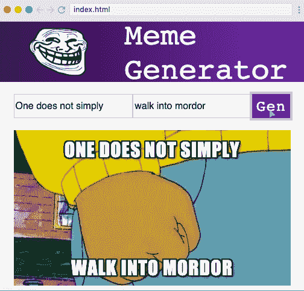

我们现在已经完成了热图生成器应用程序，每次点击`Gen`按钮都会得到一个不同的图像，然后覆盖上我们输入的文本。

为了进一步学习，我们可以玩玩代码，看看我们是否可以改进它，或者尝试从不同的 API 获取图像。对于一些真正繁重的实践，我们甚至可以删除所有代码，并尝试从头开始重新构建。

祝贺你完成教程并学习了本项目中使用的所有技能。

如果你准备好了，一定要看看我即将推出的[高级课程](https://scrimba.com/g/greact)，因为它将带你达到 React 的专业水平！