# 如何使用 React 和 React 挂钩构建天气应用程序

> 原文：<https://www.freecodecamp.org/news/learn-react-by-building-a-weather-app/>

React 是一个超级棒的前端库，可以用来构建用户界面。

React 最大的优点之一是我们创建的组件是封装的。换句话说，他们是看不见的。

让我们通过使用 React 构建一个天气应用程序来了解这一切是如何工作的。

## 如何安装节点和 npm

为了构建 React 应用程序，我们需要一个名为 Node 的运行时环境。主要用于执行 JavaScript 代码。

若要下载，请前往[https://nodejs.org/en/](https://nodejs.org/en/)。

您还需要 **npm** ，它是构建在 Node 上的包管理器。您可以使用它来为您的 JavaScript 应用程序安装软件包。好在它自带 Node，所以不需要单独下载。

一旦这两个都完成了，打开你的终端或命令提示符并输入`node -v`。这将检查您拥有的节点版本。

## 如何创建 React 应用程序

要创建 react 应用程序，请在终端中键入 **`npx create-react-app <Your app name>`** ，或者在本例中键入 **`npx create-react-app my-weather-app`** 。

您将看到软件包正在安装。

一旦包完成，进入项目文件夹并键入 **`npm start`** 。

您将看到默认的 React 模板，如下所示:

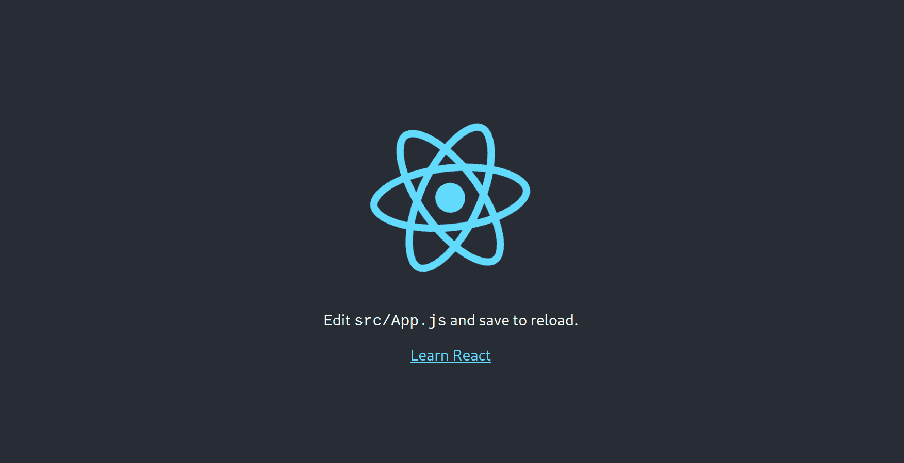

The default React Boilerplate Template

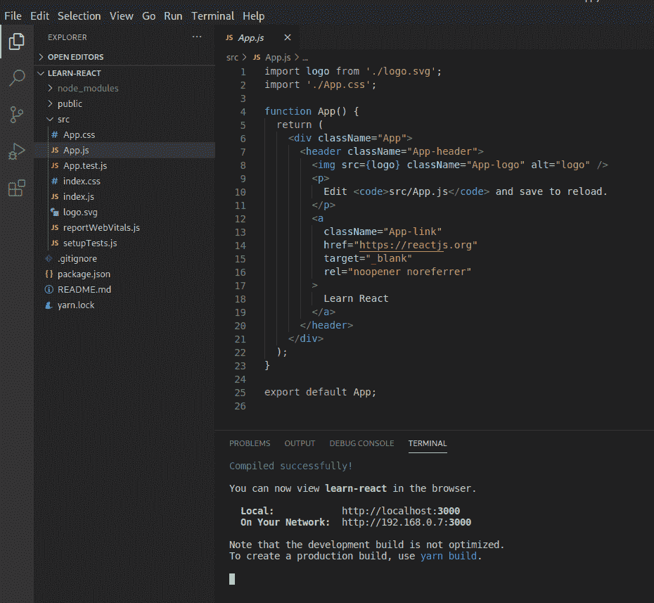

App.js

我们现在不需要这些。所以，让我们清除一些代码。

在你的 **app.js** 文件中，清除`div`标签中的所有内容。删除徽标导入。

完成后，您将在输出上看到一个空白屏幕。

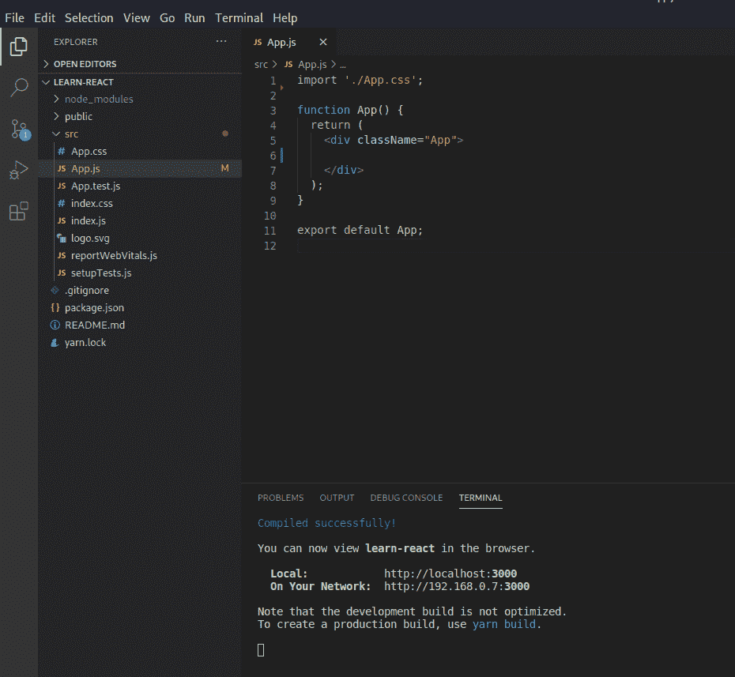

App.js after cleanup

## 如何安装我们需要的软件包

为了使这个应用程序更有吸引力，我们需要一些外部包。所以，让我们安装它们。

我们需要[语义反应 UI](https://react.semantic-ui.com/usage/) 库。要安装它，请在终端中键入以下命令:

```
npm install semantic-ui-react semantic-ui-css
```

安装完成后，打开 **index.js** 并导入库。只需将以下命令复制并粘贴到您的 **index.js** 文件中:

```
import 'semantic-ui-css/semantic.min.css'
```

我们还需要 [moment.js](https://momentjs.com/) 来格式化我们的时间。使用以下命令安装它:

```
npm install moment --save
```

您可以检查 package.json 文件来跟踪所有已安装的包。

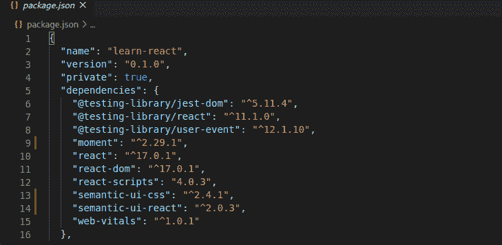

package.json

在这里，您可以看到您目前拥有的所有包。

## 如何创建我们的天气应用程序

为了让我们的天气应用程序工作，我们需要 OpenWeatherMap，这是一个第三方 API，可以让我们获取天气数据。

前往[https://home.openweathermap.org/users/sign_up](https://home.openweathermap.org/users/sign_up)创建您自己的账户。

完成后，单击导航栏上的 API 选项。您将看到不同的选项，如当前天气数据、每小时 4 小时预报、16 天预报等。这些是获取数据所需的 API 端点。

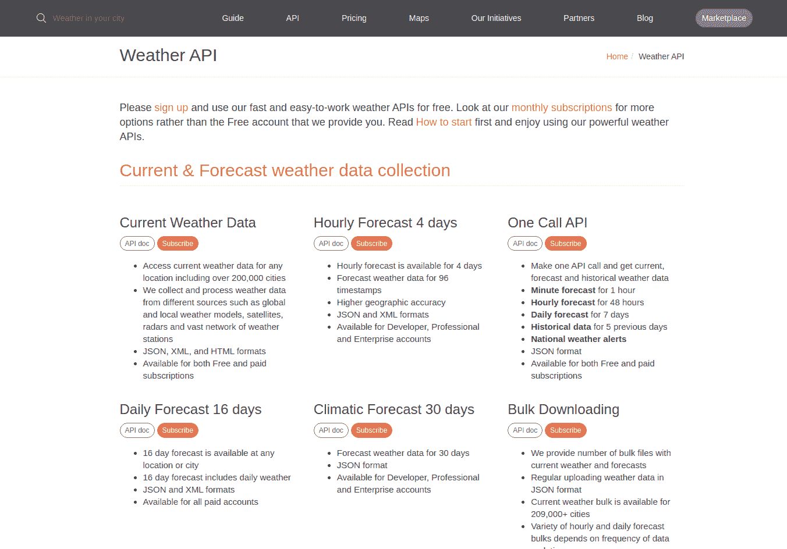

您还需要一个 API 键来调用这些 API。要获取 API 密钥，请点击右上角的用户名，然后点击“我的 API 密钥”。

如果 API 键不存在，请创建一个。

在主应用程序文件夹中，创建一个名为 **.env.** 的文件

这是一个环境变量文件，将包含所有 API 端点和密钥。

```
REACT_APP_API_URL = 'https://api.openweathermap.org/data/2.5'
REACT_APP_API_KEY = Paste your API key here.
REACT_APP_ICON_URL = 'https://openweathermap.org/img/w'
```

将复制的 API 密钥粘贴到 REACT_APP_API_KEY 变量中。

## 如何使用 React 钩子

React Hooks 允许我们使用和管理功能组件中的状态。

我们将使用`useState`挂钩和`useEffect`挂钩。让我们在顶部导入它们。

```
import React, { useEffect, useState } from "react";
```

让我们创建两个状态。一个是纬度，另一个是经度。

```
const [lat, setLat] = useState([]);
const [long, setLong] = useState([]);
```

现在，创建`useEffect`函数。它的目标是在应用程序加载和重新加载时加载函数。

```
useEffect(() => {
    navigator.geolocation.getCurrentPosition(function(position) {
      setLat(position.coords.latitude);
      setLong(position.coords.longitude);
    });

    console.log("Latitude is:", lat)
    console.log("Longitude is:", long)
  }, [lat, long]);
```

我们使用`navigator.geolocation`获得我们的纬度和经度，并且我们使用 **setLong** 和**setLat****来设置我们的经度和纬度状态。**

```
`import './App.css';
import React, { useEffect, useState } from "react";
export default function App() {

  const [lat, setLat] = useState([]);
  const [long, setLong] = useState([]);

  useEffect(() => {
    navigator.geolocation.getCurrentPosition(function(position) {
      setLat(position.coords.latitude);
      setLong(position.coords.longitude);
    });

    console.log("Latitude is:", lat)
    console.log("Longitude is:", long)
  }, [lat, long]);

  return (
    <div className="App">

    </div>
  );
}` 
```

**app.js**

**这是我们的 app.js 文件现在的样子。您可以在控制台上查看纬度和经度值。**

```
`Latitude is: 25.5922166
Longitude is: 85.12761069999999`
```

**Our latitude and longitude**

## **如何使用纬度和经度获得我们当前的位置。**

**让我们创建另一个函数 **getWeather** ，它将根据我们的纬度和经度从天气 API 获取天气数据。**

**在这个函数中，我们使用一个 fetch 调用从 API 获取数据。**process . env . react _ APP _ API _ URL**获取你的 API 地址**T3**process . env . react _ APP _ API _ KEY**从**获取你的 API 密钥。env** 文件。纬度和经度是我们之前得到的纬度和经度。****

**然后我们把数据转换成 **JSON** 格式。**

**下一步，我们使用 **setData** 将结果存储到**数据**对象中。**

```
`await fetch(`${process.env.REACT_APP_API_URL}/weather/?lat=${lat}&lon=${long}&units=metric&APPID=${process.env.REACT_APP_API_KEY}`)
      .then(res => res.json())
      .then(result => {
        setData(result)
        console.log(result);
      });`
```

**我们在控制台中记录数据。**

**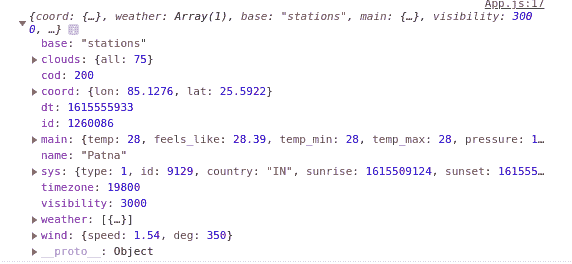**

**在这里，您可以看到基于我们的纬度和经度的所有天气数据。**

**这是我们新的 app.js 文件，它根据经度和纬度获取天气数据:**

```
`import './App.css';
import React, { useEffect, useState } from "react";
import Weather from './components/weather';
export default function App() {

  const [lat, setLat] = useState([]);
  const [long, setLong] = useState([]);
  const [data, setData] = useState([]);

  useEffect(() => {
    const fetchData = async () => {
      navigator.geolocation.getCurrentPosition(function(position) {
        setLat(position.coords.latitude);
        setLong(position.coords.longitude);
      });

      await fetch(`${process.env.REACT_APP_API_URL}/weather/?lat=${lat}&lon=${long}&units=metric&APPID=${process.env.REACT_APP_API_KEY}`)
      .then(res => res.json())
      .then(result => {
        setData(result)
        console.log(result);
      });
    }
    fetchData();
  }, [lat,long])

  return (
    <div className="App">

    </div>
  );
}` 
```

**app.js**

### **如何创建天气组件**

**让我们创建天气组件，在其中显示天气数据。**

**在你的 src 文件夹中，创建一个名为 **components** 的文件夹，在这个文件夹中，创建一个名为 **weather.js.** 的文件**

**现在，让我们调用主 **app.js** 文件中的天气组件。**

```
`import './App.css';
import React, { useEffect, useState } from "react";
import Weather from './components/weather';
export default function App() {

  const [lat, setLat] = useState([]);
  const [long, setLong] = useState([]);
  const [data, setData] = useState([]);

  useEffect(() => {
    const fetchData = async () => {
      navigator.geolocation.getCurrentPosition(function(position) {
        setLat(position.coords.latitude);
        setLong(position.coords.longitude);
      });

      await fetch(`${process.env.REACT_APP_API_URL}/weather/?lat=${lat}&lon=${long}&units=metric&APPID=${process.env.REACT_APP_API_KEY}`)
      .then(res => res.json())
      .then(result => {
        setData(result)
        console.log(result);
      });
    }
    fetchData();
  }, [lat,long])

  return (
    <div className="App">
      {(typeof data.main != 'undefined') ? (
        <Weather weatherData={data}/>
      ): (
        <div></div>
      )}

    </div>
  );
}` 
```

**Importing Weather Component in app.js file**

**你可以看到我在退货单上加了一张支票。如果我们正在获取的数据类型是未定义的，它将向我们显示一个空的 div。因为获取数据是一个异步函数，所以必须包含这个检查。它在所有其他函数执行完毕后加载该函数。所以，如果你取消这个检查，你会得到一个错误。**

**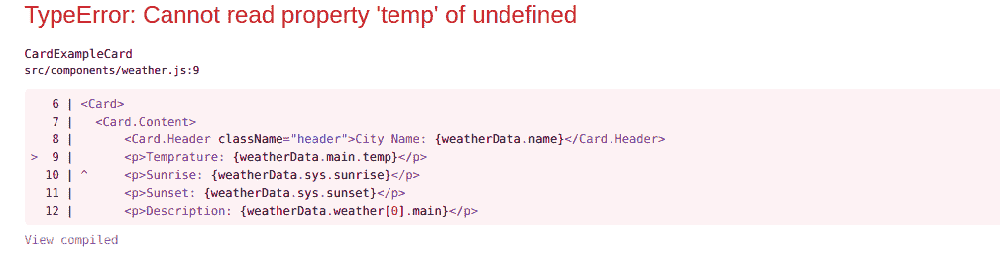**

**这是因为我们的应用程序在进行 API 调用之前呈现了 return 语句，在这种情况下没有什么可显示的，所以它抛出了一个未定义的错误。**

**要了解关于 async/await 的更多信息，请查看本文。**

### **如何创造我们的天气体**

**对于这一部分，我们将使用语义 UI 库来设计我们的界面。**

**让我们制作一张显示天气信息的卡片。**

```
`import React from 'react';
import './styles.css';
import { Card } from 'semantic-ui-react'

const CardExampleCard = ({weatherData}) => (
  <Card>
    <Card.Content>
        <Card.Header className="header">{weatherData.name}</Card.Header>
    </Card.Content>
  </Card>
)

export default CardExampleCard;`
```

**Weather.js**

**在这里，我们从 semantic-ui-react 导入一个卡片，在这个卡片中，有一个显示城市名称的标题。**

**但问题是，我们如何将数据从我们的 app.js 获取到 weather.js 组件？**

**答案很简单。我们可以在 React 中使用 props 将数据从父组件发送到子组件。在我们的例子中，父组件是 app.js，子组件是 weather.js。**

**为此，只需在 **app.js.** 的组件中添加道具**

```
`<Weather weatherData={data}/>`
```

**在这里，我们将道具名为 weatherData 的数据进行传递。并且我们会收到 **Weather.js.** 中的 weatherData 道具**

```
`import React from 'react';
import './styles.css';
import { Card } from 'semantic-ui-react'

const CardExampleCard = ({weatherData}) => (
  <Card>
    <Card.Content>
        <Card.Header className="header">{weatherData.name}</Card.Header>
    </Card.Content>
  </Card>
)

export default CardExampleCard;`
```

**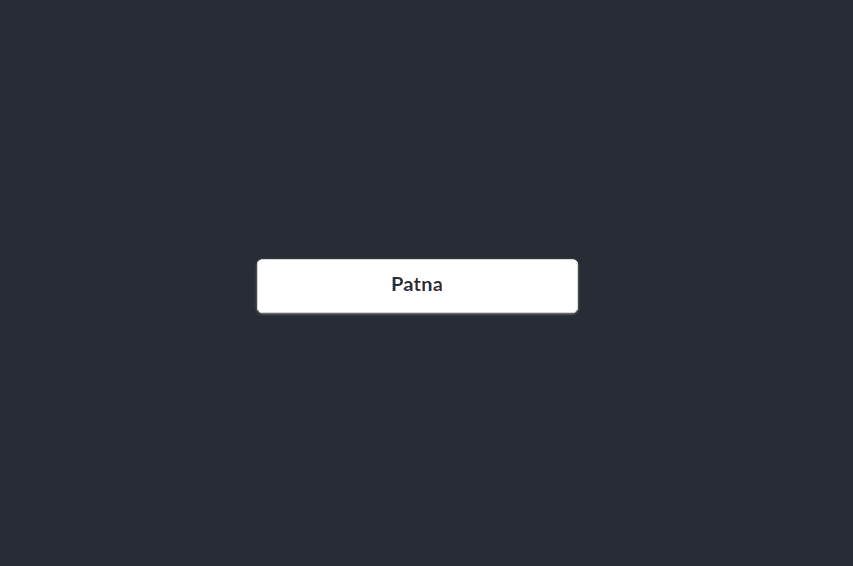**

**你可以看到我们根据位置得到了城市的名字。**

**类似地，我们可以向天气组件添加更多的字段。**

```
`import React from 'react';
import './styles.css';
import { Card } from 'semantic-ui-react'

const CardExampleCard = ({weatherData}) => (
  <Card>
    <Card.Content>
        <Card.Header className="header">City Name: {weatherData.name}</Card.Header>
        <p>Temprature: {weatherData.main.temp}</p>
        <p>Sunrise: {weatherData.sys.sunrise}</p>
        <p>Sunset: {weatherData.sys.sunset}</p>
        <p>Description: {weatherData.weather[0].description}</p>
    </Card.Content>
  </Card>
)

export default CardExampleCard;`
```

**我们可以从 API 中获得温度、日出、日落和描述。**

**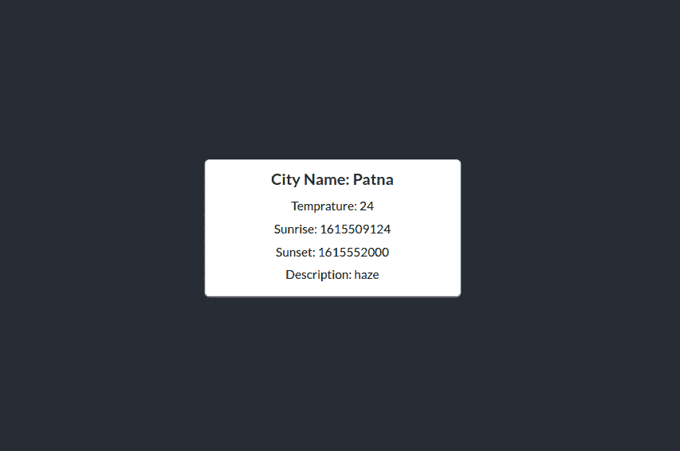**

**您可以添加您想要的任何其他字段，如湿度、风速、能见度等。**

### **如何格式化数据并添加今天的日期**

**让我们把数据格式化，以便于理解。我们将添加更多的字段。**

**首先，添加温度单位。你可以通过添加**&deg；C** 后的温度。**

**还有，我们把日出日落改成当地时间。**

```
`import React from 'react';
import './styles.css';
import { Card } from 'semantic-ui-react'

const CardExampleCard = ({weatherData}) => (
  <Card>
    <Card.Content>
        <Card.Header className="header">City Name: {weatherData.name}</Card.Header>
        <p>Temprature: {weatherData.main.temp} &deg;C</p>
        <p>Sunrise: {new Date(weatherData.sys.sunrise * 1000).toLocaleTimeString('en-IN')}</p>
        <p>Sunset: {new Date(weatherData.sys.sunset * 1000).toLocaleTimeString('en-IN')}</p>
        <p>Description: {weatherData.weather[0].main}</p>
        <p>Humidity: {weatherData.main.humidity} %</p>
    </Card.Content>
  </Card>
)

export default CardExampleCard;`
```

**现在，让我们使用 **moment.js.** 添加今天的日期**

```
`import moment from 'moment';

<p>Day: {moment().format('dddd')}</p>
<p>Date: {moment().format('LL')}</p>`
```

**Using moment.js**

**我们在顶部导入**时刻**包，分别显示今天的星期几和日期。这个软件包的伟大之处在于它可以自动更新日期和星期。**

**这是我们的 **weather.js** 现在的样子:**

```
`import React from 'react';
import './styles.css';
import { Card } from 'semantic-ui-react';
import moment from 'moment';

const CardExampleCard = ({weatherData}) => (
  <Card>
    <Card.Content>
        <Card.Header className="header">City Name: {weatherData.name}</Card.Header>
        <p>Temprature: {weatherData.main.temp} &deg;C</p>
        <p>Sunrise: {new Date(weatherData.sys.sunrise * 1000).toLocaleTimeString('en-IN')}</p>
        <p>Sunset: {new Date(weatherData.sys.sunset * 1000).toLocaleTimeString('en-IN')}</p>
        <p>Description: {weatherData.weather[0].main}</p>
        <p>Humidity: {weatherData.main.humidity} %</p>
        <p>Day: {moment().format('dddd')}</p>
        <p>Date: {moment().format('LL')}</p>
    </Card.Content>
  </Card>
)

export default CardExampleCard;`
```

**weather.js**

**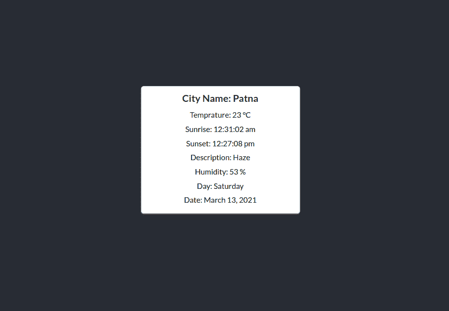**

**以上是我们的输出。**

## **让我们做一些造型**

**现在我们已经有了所有的数据，让我们来设计它们的样式，使其更有吸引力。**

**首先，让我们把卡片变大，改变边框半径，添加更酷的字体和颜色，去掉文本对齐。**

```
`import React from 'react';
import './styles.css';
import moment from 'moment';

const CardExampleCard = ({weatherData}) => (
  <div className="main">
      <p className="header">{weatherData.name}</p>
      <div>
        <p className="day">Day: {moment().format('dddd')}</p>
      </div>

      <div>
        <p className="temp">Temprature: {weatherData.main.temp} &deg;C</p>
      </div>

  </div>
)

export default CardExampleCard;`
```

**weather.js**

```
`@import url('https://fonts.googleapis.com/css2?family=Recursive&display=swap');

.main{
    width: 700px;
    border-radius: 15px;
    background-color: #01579b;
}

.header{
    background-color: #424242;
    color: whitesmoke;
    padding: 10px;
    font-size: 28px;
    border-radius: 15px;
    font-family: 'Recursive', sans-serif;
}

.day{
    padding: 15px;
    color: whitesmoke;
    font-family: 'Recursive', sans-serif;
    font-size: 24px;
    font-weight: 600;
}

.temp{
    padding: 15px;
    color: whitesmoke;
    font-family: 'Recursive', sans-serif;
    font-size: 18px;
}`
```

**styles.css**

**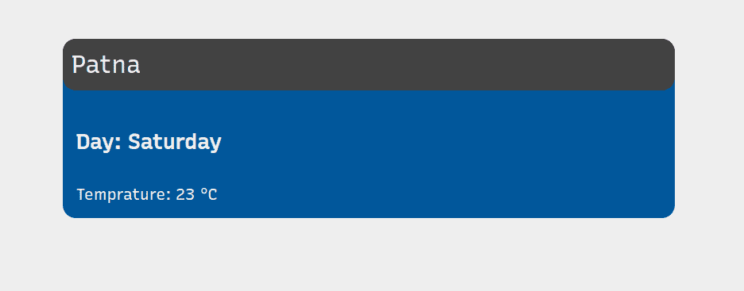**

**这是我们的应用程序现在的样子。**

**让我们使用 **flexbox** 来按列排列数据。**

```
`<div className="flex">
   <p className="day">Day: {moment().format('dddd')}</p>
</div>

<div className="flex">
   <p className="temp">Temprature: {weatherData.main.temp} &deg;C</p>
</div>`
```

**将 div 命名为“flex”，并在 ***styles.css.*** 中添加以下属性**

```
`.flex{
    display: flex;
    justify-content: space-between;
}`
```

**我们的 weather.js 现在看起来像这样。**

```
`import React from 'react';
import './styles.css';
import moment from 'moment';

const CardExampleCard = ({weatherData}) => (
  <div className="main">
      <p className="header">{weatherData.name}</p>
      <div className="flex">
        <p className="day">Day: {moment().format('dddd')}</p>
        <p className="day">{moment().format('LL')}</p>
      </div>

      <div className="flex">
        <p className="temp">Temprature: {weatherData.main.temp} &deg;C</p>
        <p className="temp">Humidity: {weatherData.main.humidity} %</p>
      </div>

  </div>
)

export default CardExampleCard;`
```

**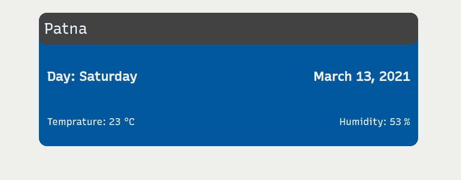**

**类似地，添加剩余的字段。**

```
`import React from 'react';
import './styles.css';
import moment from 'moment';

const WeatherCard = ({weatherData}) => (
  <div className="main">
      <p className="header">{weatherData.name}</p>
      <div className="flex">
        <p className="day">{moment().format('dddd')}, <span>{moment().format('LL')}</span></p>
        <p className="description">{weatherData.weather[0].main}</p>
      </div>

      <div className="flex">
        <p className="temp">Temprature: {weatherData.main.temp} &deg;C</p>
        <p className="temp">Humidity: {weatherData.main.humidity} %</p>
      </div>

      <div className="flex">
        <p className="sunrise-sunset">Sunrise: {new Date(weatherData.sys.sunrise * 1000).toLocaleTimeString('en-IN')}</p>
        <p className="sunrise-sunset">Sunset: {new Date(weatherData.sys.sunset * 1000).toLocaleTimeString('en-IN')}</p>
      </div>

  </div>
)

export default WeatherCard;`
```

**weather.js**

```
`@import url('https://fonts.googleapis.com/css2?family=Recursive&display=swap');

.main{
    width: 700px;
    border-radius: 20px;
    background-color: #01579b;
}

.top{
    height: 60px;
    background-color: #424242;
    color: whitesmoke;
    padding: 10px;
    border-radius: 20px 20px 0 0;
    font-family: 'Recursive', sans-serif;
    display: flex;
    justify-content: space-between;
}

.header{
    background-color: #424242;
    color: whitesmoke;
    margin: 10px 0px 0px 10px;
    font-size: 25px;
    border-radius: 20px 20px 0 0;
    font-family: 'Recursive', sans-serif;
}

.day{
    padding: 15px;
    color: whitesmoke;
    font-family: 'Recursive', sans-serif;
    font-size: 24px;
    font-weight: 600;
}

.temp{
    padding: 15px;
    color: whitesmoke;
    font-family: 'Recursive', sans-serif;
    font-size: 18px;
}

.flex{
    display: flex;
    justify-content: space-between;
}

.sunrise-sunset{
    padding: 15px;
    color: whitesmoke;
    font-family: 'Recursive', sans-serif;
    font-size: 16px;
}

.description{
    padding: 15px;
    color: whitesmoke;
    font-family: 'Recursive', sans-serif;
    font-size: 24px;
    font-weight: 600;
}`
```

**styles.css**

**这是我们的应用程序现在的样子:**

**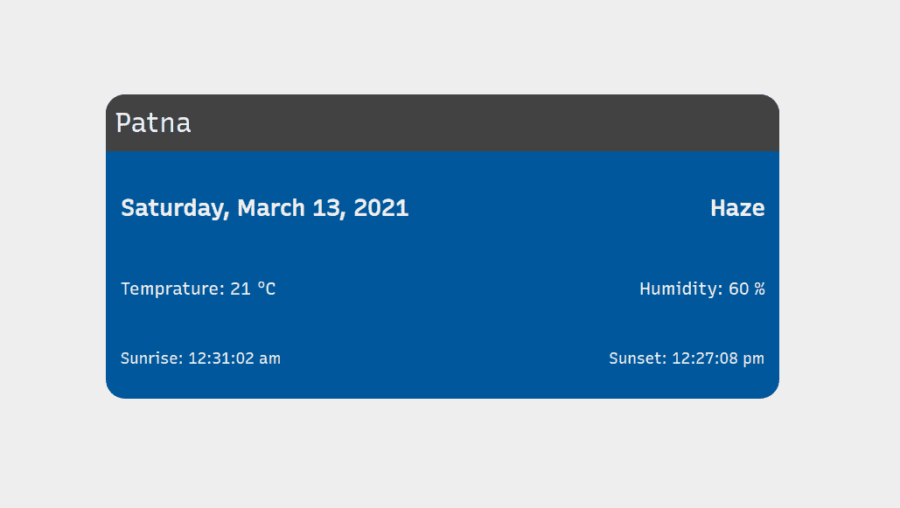**

### **如何添加刷新按钮？**

**让我们在页面顶部添加一个刷新按钮。**

```
`import React from 'react';
import './styles.css';
import moment from 'moment';
import { Button } from 'semantic-ui-react';

const refresh = () => {
  window.location.reload();
}

const WeatherCard = ({weatherData}) => (
  <div className="main">

      <div className="top">
        <p className="header">{weatherData.name}</p>
        <Button className="button" inverted color='blue' circular icon='refresh' onClick={refresh} />
      </div>
      <div className="flex">
        <p className="day">{moment().format('dddd')}, <span>{moment().format('LL')}</span></p>
        <p className="description">{weatherData.weather[0].main}</p>
      </div>

      <div className="flex">
        <p className="temp">Temprature: {weatherData.main.temp} &deg;C</p>
        <p className="temp">Humidity: {weatherData.main.humidity} %</p>
      </div>

      <div className="flex">
        <p className="sunrise-sunset">Sunrise: {new Date(weatherData.sys.sunrise * 1000).toLocaleTimeString('en-IN')}</p>
        <p className="sunrise-sunset">Sunset: {new Date(weatherData.sys.sunset * 1000).toLocaleTimeString('en-IN')}</p>
      </div>

  </div>
)

export default WeatherCard;`
```

**weather.js**

```
`.button{
    width: 35px;
    height: 35px;
}`
```

**styles.css**

**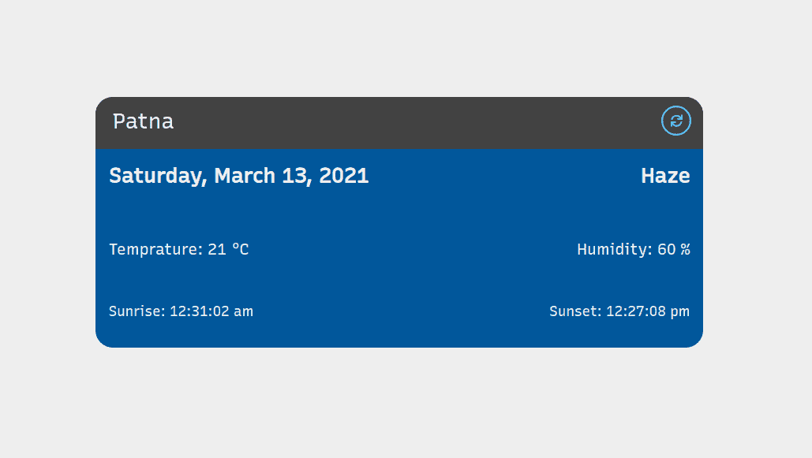**

**您可以看到一个触发刷新功能的按钮。当你按下它时，它会刷新页面。**

### **如何在应用程序加载时添加加载器？**

**让我们添加一个加载程序，使应用程序更加神奇。**

**从语义 UI 导入 Loader，并将其添加到返回函数中，在这里我们检查未定义的数据。**

```
`import { Dimmer, Loader } from 'semantic-ui-react';

<div className="App">
      {(typeof data.main != 'undefined') ? (
        <Weather weatherData={data}/>
      ): (
        <div>
          <Dimmer active>
            <Loader>Loading..</Loader>
          </Dimmer>
       </div>
     )}
 </div>`
```

**app.js**

## **让我们回顾一下我们所做的事情**

**我们已经创建了一个 React 应用程序，根据您的位置显示当前天气。**

**让我们回顾一下到目前为止我们所做的一切。**

### **我们学习了状态和道具**

**状态和道具是 React 中非常强大的功能。它们用于管理数据并控制数据在不同组件中的流动。**

**在我们的应用程序中，我们管理应用程序的状态。例如，城市名称、温度、日期、湿度等等。它们因用户而异，取决于他们的位置。**

**另一方面，Props 用于在组件之间传递数据。我们在我们的 **app.js** 文件中获取数据，但是我们在 **weather.js.** 中读取数据。记住，props 只能用于将数据从父组件传递到子组件。**

### **我们用了反应钩**

**如果您使用过类组件，那么您必须了解生命周期方法。如果没有，它们是在我们的页面呈现或重新呈现时调用的方法。但是我们不能在功能组件中使用生命周期方法，因为它们是专门为类组件构建的。**

**因此，React Hooks 是替代方案。我们在应用程序中使用了两个钩子。一个是 useState，用于管理应用程序的状态。另一个是 useEffect，它在页面呈现或加载时加载。**

### **我们尝试了语义用户界面**

**语义 UI 是 React 的一个库，它预定义了令人敬畏的组件。**

**就这些了，伙计们。你可以向应用程序添加更多功能，如五天预报、图标等。**

**如果你想进一步试验，你可以在 Github 上找到代码。**

**如果你愿意，你也可以在我的 YouTube 频道观看这个教程。**

> **尝试和实验，快乐学习。**