# 通过构建一个绘画应用程序来学习 React Hooks

> 原文：<https://www.freecodecamp.org/news/learn-react-hooks-by-building-a-paint-app/>

据了解内情的人说，React Hooks 很热，很热，很热。在本文中，我们跟随 Christian Jensen 的 [14 部分教程](https://scrimba.com/g/greacthooks?utm_source=dev.to&utm_medium=referral&utm_campaign=greacthooks_launch_article)来了解 React 这一新特性的基础知识。请继续关注，了解更多信息！

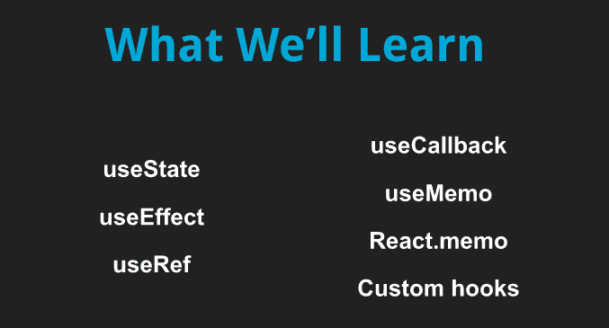

# 介绍

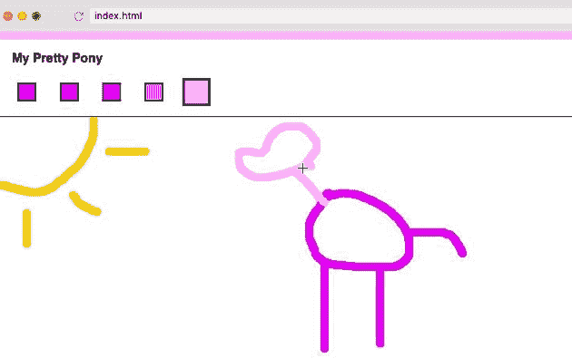

钩子对于 React 库来说是新的，它允许我们在组件之间共享逻辑并使它们可重用。

在本课程中，我们将构建一个类似于 Microsoft Paint 的绘画应用程序，这将允许我们命名我们的项目，切换颜色，获得一批新的颜色，当然还有绘画。

Scrimba 允许你在任何时候暂停截屏，玩代码。这是边做边学的好方法！

# 先决条件

本课程假设一些关于 ES6 、 [JSX、状态和道具](https://www.freecodecamp.org/news/learn-react-js-in-5-minutes-526472d292f4/)的[先验知识，但是不用担心，我们已经为你准备好了——点击上面的链接查看我们的 Scrimba 文章。](https://www.freecodecamp.org/news/learn-modern-javascript-in-this-free-28-part-course-7ec8d353eb/)

如果你完全是 React 新手，一定要看看我们的 [Scrimba React 课程](https://scrimba.com/g/glearnreact?utm_source=dev.to&utm_medium=referral&utm_campaign=greacthooks_launch_article)

# `useState` -第一部分

首先，我们给应用程序一种使用`useState`管理状态的方法。

在我们的`<Playground.js />`组件中，我们声明了一个名为`<Playground />`的组件，并创建按钮来增加和减少它。然后我们给`useState`一个参数(0)，并使用状态重组从我们的`useState`函数中得到`state`和`setState`(更新状态的函数)。这些现在被重命名为`count`和`setCount`。然后，我们在浏览器中呈现我们的计数。

最后，我们使用点击触发的内嵌函数来呈现更新计数的按钮。

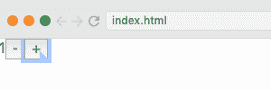

为了确保我们的计数准确，我们将一个函数传递给我们的`setState`函数，而不是一个值。该函数将当前状态作为其参数，然后更新该参数:

```
import React, { useState } from "react";
import randomColor from "randomcolor";

export default function Playground() {
	const [count, setCount] = useState(0);
	return (
		<div>
			{count}
			<button onClick={() => setCount((currentCount) => currentCount - 1)}>
				-
			</button>
			<button onClick={() => setCount((currentCount) => currentCount + 1)}>
				+
			</button>
		</div>
	);
} 
```

如果你担心内联函数的性能，看看这个博客。

# `useState` -第二部分

现在我们将名称输入添加到`<Name.js />`组件中，这样用户就可以命名他们的项目。

为了用一个`useState`钩子设置`<Name.js />`，我们需要用一个命名的导入来导入钩子，然后设置我们的状态。我们的状态将是`name`，我们将用 setName 更新它。然后我们调用`useState`并传入一个空字符串作为我们的默认状态值。

我们现在需要一个具有四个属性的输入元素。这些是:

*   `value`，这将始终是上面的状态`name`
*   `onChange`，它将使用`setState`内联更新`name`，将值传递给`setState`
*   `onClick`使用 setSelectionRange 来选择完整的名称，它的起始索引为 0，结束索引为字符串的长度，这使得最终用户更容易更改名称。
*   `placeholder`，我们设置为‘无标题’。

```
import React, { useState } from "react";

export default function Name() {
	const [name, setName] = useState("");
	return (
		<label className="header-name">
			<input
				value={name}
				onChange={(e) => setName(e.target.value)}
				onClick={(e) => e.target.setSelectionRange(0, e.target.value.length)}
				placeholder="Untitled"
			/>
		</label>
	);
} 
```

我们现在可以命名我们的项目，只需单击一下就可以选择要重置的名称:

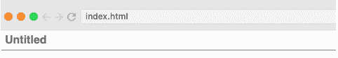

# `useEffect`

目前，我们的 Playground.js 组件只是呈现一个计数器，可以增加或减少计数。现在我们将更新这个，这样每次计数改变时，一些东西的颜色也会改变。

我们使用`useState`钩子来设置初始颜色，我们将其设置为`null`并使用函数来更新它(`setColor`)。现在，我们设置`useEffect`来更新这个颜色。`useEffect`的第一个参数是 setColor，我们想把它设置成一个`randomColor`。

因为我们只希望`count`中的一个变化触发`useEffect`，所以我们将它设置为第二个参数。如果计数值没有改变，钩子将不会运行效果，颜色将保持不变。

```
import React, { useState, useEffect } from "react";
import randomColor from "randomcolor";

export default function Playground() {
	const [count, setCount] = useState(0);

	const [color, setColor] = useState(null);
	useEffect(() => {
		setColor(randomColor());
	}, [count]);

	return (
		<div style={{ borderTop: `10px solid ${color}` }}>
			{count}
			<button onClick={() => setCount((currentCount) => currentCount - 1)}>
				-
			</button>
			<button onClick={() => setCount((currentCount) => currentCount + 1)}>
				+
			</button>
		</div>
	);
} 
```

现在，每次我们增加或减少计数时，我们的颜色都会改变。


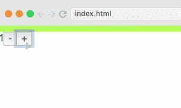

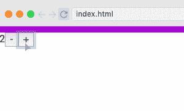

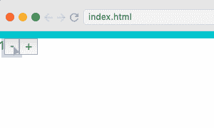

# `useState` & `useEffect`挑战

现在是时候测试我们目前掌握的技能了。在这个截屏中，一个为我们获取一些随机颜色的功能被添加到了<paint.js>:</paint.js>

```
const getColors = () => {
	const baseColor = randomColor().slice(1);
	fetch(`https://www.thecolorapi.com/scheme?hex=${baseColor}&mode=monochrome`)
		.then((res) => res.json())
		.then((res) => {
			setColors(res.colors.map((color) => color.hex.value));
			setActiveColor(res.colors[0].hex.value);
		});
}; 
```

我们的任务是为`setColors`编写函数，这将给我们一个十六进制颜色数组和`setActiveColor`，这将告诉 use 当前的颜色是什么。

如果我们设置正确，用户界面将更新为五种颜色，我们可以点击展开。这个测试我们只需要`useState`和`useEffect`。

# `useState` & `useEffect`解#

在[这个](https://scrimba.com/p/pKkkVU3/cDbkNJsg?utm_source=dev.to&utm_medium=referral&utm_campaign=greacthooks_launch_article)截屏中，Christian 向我们展示了如何赋予`<ColorPicker />`组件功能。在它的最后，我们现在有一些颜色:

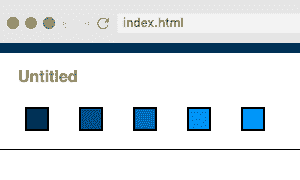

# `useEffect`清理

现在我们添加一个名为`<WindowSize.js />`的组件，当用户调整窗口大小时，它将在屏幕底部显示窗口的宽度和高度。半秒钟后，这种情况就会消失。

当我们设置一个计时器或事件监听器时，我们还需要在组件卸载后清理它。这需要两种状态——窗口大小和`<WindowSize />`组件的可见性:

```
export default function WindowSize() {
	const [[windowWidth, windowHeight], setWindowSize] = useState([
		window.innerWidth,
		window.innerHeight,
	]);
	const [visible, setVisible] = useState(false);
} 
```

现在我们设置我们的效果，它添加了事件监听器:

```
useEffect(() => {
	const handleResize = () => {};
	window.addEventListener("resize", handleResize);
}); 
```

接下来，我们设置清理阶段。这将返回函数，并传入一个空数组，告诉它`useEffect`应该只在第一次挂载时运行。然后，清理将运行并删除事件侦听器:

```
useEffect(() => {
	const handleResize = () => {};
	window.addEventListener("resize", handleResize);
	return () => window.removeEventListener("resize", handleResize);
}, []); 
```

我们现在设置窗口大小、可见性和计时器，以便调整窗口大小出现，然后在 500 毫秒后消失:

```
const [visible, setVisible] = useState(false);
useEffect(() => {
	const handleResize = () => {
		setWindowSize([window.innerWidth, window.innerHeight]);
		setVisible(true);
		setTimeout(() => setVisible(false), 500);
	};
	window.addEventListener("resize", handleResize);
	return () => window.removeEventListener("resize", handleResize);
}, []); 
```

然而，我们不希望每次用户调整窗口大小时都添加一个新的计时器，所以我们还需要用`clearTimeout(timeoutId)`清除计时器:

```
timeoutId = setTimeout(() => setVisible(false), 500); 
```

为了给`clearTimeout`上一次函数运行时的`timeoutId`，我们使用了*闭包*，这意味着我们在`handleResize`函数外声明了我们的`timeoutId`变量。这样，内部函数仍然可以使用该变量。每次函数运行时，先前的超时将被清除，并设置一个新的超时。

最后，我们将调整大小功能呈现给浏览器。最终的代码可以在截屏中看到。

现在，每当用户调整他们的窗口大小时，窗口大小被设置为当前窗口大小，可见性被设置为真，并且在 500 毫秒后启动计时器将可见性设置为假。

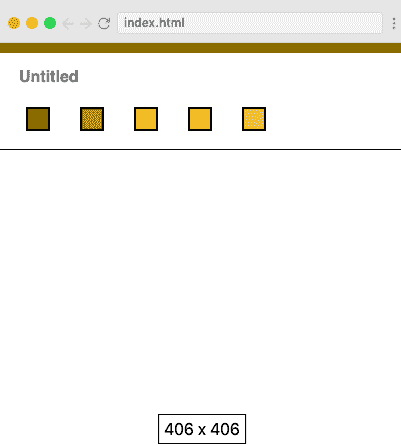

# `useRef`挑战

如果需要在 React 中访问实际的 DOM 元素，可能需要使用 Refs。React 有一个钩子，`useRef`，专用于 Refs。

要使用 Ref，需要将其添加到元素中:

```
<input
	ref={inputRef}
	type="range"
	onChange={(e) => setCount(e.target.value)}
	value={count}
/> 
```

该输入是一个滑块，它更新`count`并因此更新选择的颜色。由于该值也与计数相关，因此如果计数通过我们之前添加的按钮发生变化，滑块也会进行调整。

我们现在已经声明了我们的 Ref，但是我们还需要通过调用`useRef`来设置它:

```
const inputRef = useRef(); 
```

为了在每次我们用按钮改变计数时聚焦输入，我们简单地在按钮被点击时运行的效果中添加必要的逻辑:

```
 useEffect(() => {
    setColor(randomColor())
    inputRef.current.focus()
  }, 
```

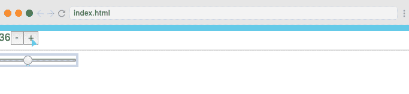

目前，画布被设置为窗口本身的高度，这使得用户可以在画布内滚动，如果图像被导出，这会导致空白。

我们现在的挑战是确保我们的画图应用程序的画布只有窗口减去标题高度那么大。为此，我们需要使用 useRef 来获取标题的高度，并将其从窗口的高度中减去。

# `useRef`解决方案

在[这个](https://scrimba.com/p/pKkkVU3/c66w99up?utm_source=dev.to&utm_medium=referral&utm_campaign=greacthooks_launch_article)的截屏中，克里斯蒂安带我们了解了如何用`useRef`获得正确的画布高度。

在此之后，用户不再能够滚动，除了 Scrimba 的浏览器和普通浏览器之间的几个像素偏移。现在图像底部没有空白。

# `useCallback` & `useMemo` +挑战

在这个截屏中，我们介绍了记忆化的概念。这是指纯函数从之前处理的计算中返回相同的输出，而不是重新运行整个计算:

```
function Calculate(num) {
	// first call, num === 3... ok I will calculate that
	return fetchComplicatedAlgorithmToAdd47(3); // returns 50 after a while

	// second call, num === 5... ok I guess I have to calculate that too
	return fetchComplicatedAlgorithmToAdd47(5); // returns 52 after a while

	// third call, num === 3... WAIT, I've seen this before! I know this one!
	return 50; // immediately
} 
```

React 提供了两个钩子，允许我们使用记忆化:`useCallback`和`useMemo`。

### `useCallback` ###

我们从 Playground.js 中的一个非常简单的组件开始，它呈现函数已经呈现的次数:

```
function Calculate(num) {
	const renderCount = useRef(1);
	return <div>{renderCount.current++}</div>;
} 
```


现在我们假设组件应该只在计数改变时呈现，而不是在颜色改变时呈现。为了实现这一点，我们可以使用`useCallback`。我们将`useCallback`的结果赋给一个叫做`calculate`的变量:

```
const calculate = useCallback(<Calculate />, [count]); 
```

我们现在将呈现新的`calculate`变量，而不是`<Calculate />`组件。现在，组件只在计数改变时呈现，而不是在单击“改变颜色”按钮时呈现。

我们还需要呈现我们的`<Calculate />`组件，而不是我们之前使用的变量，并创建一个回调函数。我们使用`useCallback`，并将其赋给一个名为`cb`的变量。`count`是唯一的依赖项，这意味着如果计数改变，我们将获得一个新的函数实例:

```
const cb = useCallback((num) => console.log(num), [count]); 
```

现在我们将一个数字(设置为计数)传递给`Calculate`组件和回调函数，并将其记录到控制台。每当`Calculate`组件重新呈现时(即点击加号和减号按钮时)，当前计数将被记录到控制台。

但是，使用这种方法，当我们单击“更改颜色”按钮时，计数也会记录到控制台中。这是因为我们对我们的`console.log`函数使用了记忆化，而不是对我们的实际组件，这意味着不检查回调函数是否与之前的函数相同。

### `React.memo`

为了解决这个问题，我们将 React.memo 添加到`Calculate`组件中。现在，它将检查输入并查看它们是否相同，如果相同，则不会呈现:

```
const Calculate = React.memo(({ cb, num }) => {
	cb(num);
	const renderCount = useRef(1);
	return <div>{renderCount.current++}</div>;
}); 
```

“改变颜色”按钮现在不再将计数记录到控制台。

### `useMemo` ###

为了看看`useMemo`能做什么，我们在`useMemo`调用旁边添加了一个`useCallback`调用:

```
useCallback(() => console.log("useCallback"));
useMemo(() => console.log("useMemo")); 
```

这告诉我们每次函数渲染的时候都会用到`useMemo`。这是因为`useCallback`返回函数，而`useMemo`返回函数的结果:

```
useCallback(() => console.log("useCallback")); // return the function
useMemo(() => console.log("useMemo")); // return the result of the function 
```

可用于一些你想记忆的昂贵功能。另一方面，当您不想不必要地呈现组件时，`UseCallback`更适合将回调传递到组件中。

截屏以一个新的挑战结束。我们的绘画应用程序目前只提供几种颜色。我们的挑战是为新添加的刷新按钮添加一些功能，以便用户可以单击该按钮并获得一些新的颜色。这应该发生在`RefreshButton.js`中，它当前正在接受一个回调，并且应该在单击刷新按钮时调用那个回调。我们的挑战是使用`useCallback`或`useMemo`传递回调。

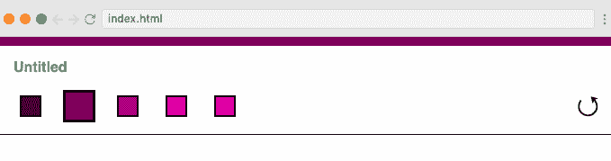

作为一个额外的挑战，我们还被要求使用`React.memo`来记忆`<Name />`组件，这是当前每次我们改变颜色时都不必要的渲染。

# `useCallback`解决方案

现在，Christian 将带我们了解之前挑战的解决方案，跟随他观看这个精彩的视频。

在截屏结束时，我们的刷新按钮现在在单击时会提供闪亮的新颜色:

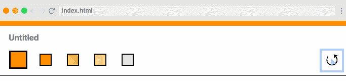

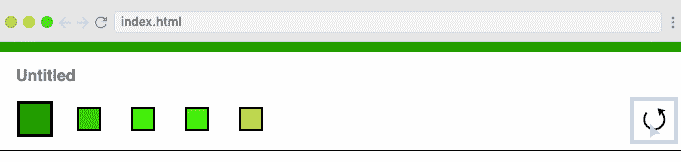

# 定制挂钩

在这里，我们通过将`<WindowSize />`组件重构为一个钩子来了解定制钩子。这对于可重用性来说非常好。

目前，`<WindowSize />`正在处理两组不同的状态；窗口大小和可见度。由于在将来使用`<WindowSize />`时可能不需要可见性，我们将它的逻辑移到我们的`<Paint />`组件中，这也是我们将使用`useWindowSize`钩子的地方。

以下几行从`WindowSize.js`中删除:

```
let timeoutId;
///
setVisible(true);
clearTimeout(timeoutId);
timeoutId = setTimeout(() => setVisible(false), 500); 
```

此外，现在需要从`<Paint.js />`而不是`<WindowSize />`返回以下行:

```
<div className={`window-size ${visible ? "" : "hidden"}`}>
	{windowWidth} x {windowHeight}
</div> 
```

窗口的宽度和高度将从`<WindowSize />`返回:

```
return [windowWidth, windowHeight]; 
```

为了使`windowWidth`和`windowHeight`变量可用，我们向`<Paint.js />`添加以下代码:

```
const [windowWidth, windowHeight] = useWindowSize(); 
```

为了实现可见性逻辑，以便我们可以根据需要显示和隐藏窗口大小，我们向我们的`useWindowSize`钩子传递一个回调，并使用一个 Ref 使`timeoutID`在呈现之间可用:

```
let timeoutId = useRef();
const [windowWidth, windowHeight] = useWindowSize(() => {
	setVisible(true);
	clearTimeout(timeoutId.current);
	timeoutId.current = setTimeout(() => setVisible(false), 500);
}); 
```

当我们需要从`<WindowSize />`开始时，我们现在可以调用它:

```
export default function useWindowSize(cb) {
	const [[windowWidth, windowHeight], setWindowSize] = useState([
		window.innerWidth,
		window.innerHeight,
	]);

	useEffect(() => {
		const handleResize = () => {
			cb();
			setWindowSize([window.innerWidth, window.innerHeight]);
		};
		window.addEventListener("resize", handleResize);
		return () => window.removeEventListener("resize", handleResize);
	}, []);
	return [windowWidth, windowHeight];
} 
```

我们现在拥有和以前一样的功能，但是`<WindowSize />`逻辑在一个可重用的钩子中。

课程以另一个挑战结束——将`<Canvas />`组件转换成使用钩子而不是生命周期方法的函数。

# 用钩子构建绘画应用程序

这个截屏向我们展示了如何使用钩子将`<Canvas />`转换成一个功能组件。它还向我们展示了如何重构我们的应用程序，使其更加简洁，可读性更强。使用钩子的一个很大的优点是，所有相关的逻辑都是紧挨着的，这与我们的旧组件形成了对比，在旧组件中，相关的逻辑项是相互分离的。

在截屏结束时，我们的绘画应用程序终于完成，我们准备好绘制我们的杰作:

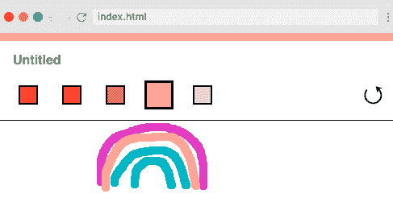

# 结尾部分

我们现在已经完成了 React Hooks 课程。我们已经了解了:

*   `useState`，管理状态
*   `useEffect`，哪个有副作用，
*   `useRef`，它获取对 DOM 元素的引用，并跨渲染保存值
*   `useCallback`，创建不需要在每次渲染时创建的函数
*   这使得昂贵的计算变得容易
*   `React.Memo`，它可以绕过一个 React 组件并记忆它
*   允许我们创建自己的可重用逻辑。

使用这些钩子时，要记住两条规则:

1.  只在 React 组件的顶层调用钩子，也就是说，不要在 if 块或任何类似的地方调用。
2.  只从 React 函数调用钩子，而不是你自己的自定义函数。

祝贺你按照教程学习了这个项目中用到的所有技巧。为了进一步学习，请查看 Scrimba 的免费六小时 [Learn React for Free](https://scrimba.com/course/glearnreact?utm_source=dev.to&utm_medium=referral&utm_campaign=greacthooks_launch_article) 课程，该课程旨在让您成为 React 向导！

编码快乐！