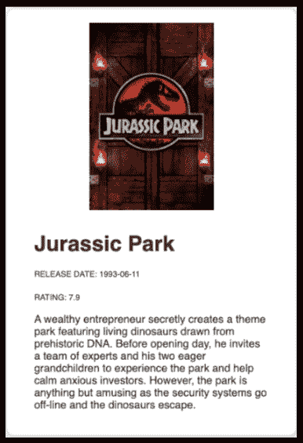
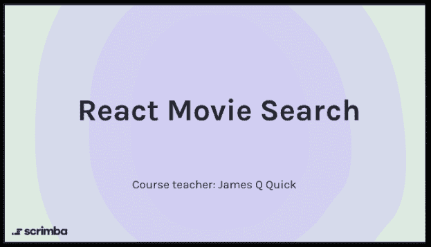
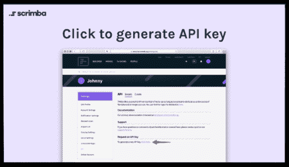
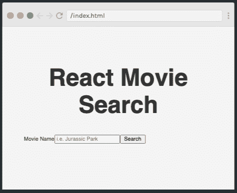
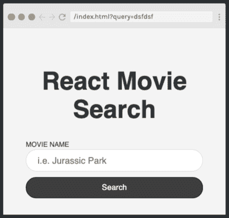
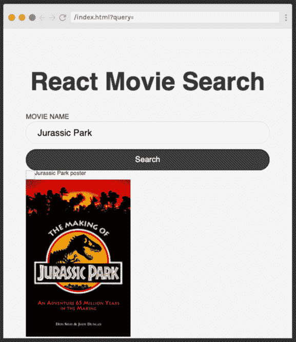

# 通过构建电影搜索应用程序，在 1 小时内学会反应

> 原文：<https://www.freecodecamp.org/news/learn-react-in-1-hour-by-building-a-movie-search-app/>

如果你一直想学习 React，但不确定从哪里开始，Scrimba 全新的[构建电影搜索应用](https://scrimba.com/course/greactmovie?utm_source=dev.to&utm_medium=referral&utm_campaign=greactmovie_launch_article)课程非常适合你！

在本课程中，您将在一个小时内从头到尾了解该应用的创建过程。在此过程中，您将经历交互式挑战，帮助您获得成为一名有效的 React 开发人员所需的肌肉记忆。

## 为什么要学习 React？

React 是世界上最流行的前端框架。正如文档所述，React 使得创建交互式用户界面和更容易调试的可预测代码变得更加容易。使用 React，您可以通过构造管理自身状态的可重用组件来生成复杂的 ui。

## 这门课是做什么的？

[](https://scrimba.com/course/greactmovie?utm_source=dev.to&utm_medium=referral&utm_campaign=greactmovie_launch_article)

这一学习之旅将带您浏览 11 个互动截屏，向您展示 modern React 的以下核心概念:

*   如何获取 API 密钥
*   添加基本样式
*   创建组件并设置其样式
*   创建函数
*   使用钩子管理状态
*   显示信息
*   创建和设计卡片

## 向老师介绍

本教程由 James Q. Quick 领导，他是一名全栈 Web 开发人员，经常在社区活动中发言并参加黑客马拉松。他还经营着一个教授网络开发的 YouTube 频道。他的座右铭是“学习”。建造。教。”使他成为这门实用课程的完美老师。

## 先决条件

为了有效地学习这门课程，你应该具备 HTML、CSS 和 JavaScript 的基础知识。您还会发现以前看过一些 React 代码很有用，但这不是必须的。

如果你需要更多的背景知识，看看这些精彩的免费 Scrimba 课程:

*   [HTML 和 CSS](https://scrimba.com/course/ghtmlcss?utm_source=dev.to&utm_medium=referral&utm_campaign=greactmovie_launch_article)
*   [Javascript](https://scrimba.com/course/gintrotojavascript?utm_source=dev.to&utm_medium=referral&utm_campaign=greactmovie_launch_article)

如果您准备好使用 React 立即投入使用，让我们开始吧！

## 课程介绍

[](https://scrimba.com/p/pZaznUL/cdVKdrtr?utm_source=dev.to&utm_medium=referral&utm_campaign=greactmovie_launch_article)

在第一篇文章中，詹姆斯向我们介绍了我们将要开发的应用的一些关键特性，并简要介绍了这款应用的工作原理。最后，詹姆斯向我们介绍了我们将使用的 API-【themoviedb.org[。](https://www.themoviedb.org/)

## 如何获得您的电影数据库 API 密钥

[](https://scrimba.com/p/pZaznUL/cdVKdLSk?utm_source=dev.to&utm_medium=referral&utm_campaign=greactmovie_launch_article)

在这个短片中，詹姆斯告诉我们如何通过注册一个免费账户来获得电影数据库 API 密钥。这非常简单，只需要几分钟。点击上面的图片进入课程。

## 向您的应用程序添加基本样式

[接下来](https://scrimba.com/p/pZaznUL/cNDyQvc2?utm_source=dev.to&utm_medium=referral&utm_campaign=greactmovie_launch_article)，James 向我们展示了他为我们实例化的基本 React 应用程序:

```
import React from "react";
import ReactDOM from "react-dom";

class Main extends React.Component {
	render() {
		return <h1>Hello world!</h1>;
	}
}

ReactDOM.render(<Main />, document.getElementById("root")); 
```

然后我们给我们的`style.css`文件添加一些基本样式，包括边距和填充、标题样式以及 CSS 的圣杯——将应用程序的内容居中。[点击此处](https://scrimba.com/p/pZaznUL/cNDyQvc2?utm_source=dev.to&utm_medium=referral&utm_campaign=greactmovie_launch_article)亲自查看款式。

## 创建您的第一个组件

[](https://scrimba.com/p/pZaznUL/caZvgqTk?utm_source=dev.to&utm_medium=referral&utm_campaign=greactmovie_launch_article)

[在这个稀松布](https://scrimba.com/p/pZaznUL/caZvgqTk?utm_source=dev.to&utm_medium=referral&utm_campaign=greactmovie_launch_article)中，我们面临第一个挑战——创建一个 React 组件。詹姆斯用一个`test.js`文件给我们一个简单的预览，然后把任务分成可管理的部分:

```
//to create the SearchMovies component //form with a class of form //label with
htmlFor="query" and a class of Label //input of type text with a name of "query"
and a placeholder //button class of button and a type of submit 
```

点击上面的链接或图片，尝试一下挑战吧。

## 设置搜索电影组件的样式

[](https://scrimba.com/p/pZaznUL/c6WdV7Ap?utm_source=dev.to&utm_medium=referral&utm_campaign=greactmovie_launch_article)

[接下来是](https://scrimba.com/p/pZaznUL/c6WdV7Ap?utm_source=dev.to&utm_medium=referral&utm_campaign=greactmovie_launch_article)，是时候设计我们的新应用了。詹姆斯为我们的`<form>`、`<label>`、`<input>`和`<button>`建议了一些样式，并添加了一个媒体查询来调整大屏幕上的样式:

```
@media (min-width: 786px) {
	.form {
		grid-template-columns: auto 1fr auto;
		grid-gap: 1rem;
		align-items: center;
	}

	.input {
		margin-bottom: 0;
	}
} 
```

不要忘记 Scrimba 是完全互动的，所以你可以随心所欲地创造风格——这些想法只是一些可能性。

## 创建搜索电影功能

```
export default function SearchMovies(){

    const searchMovies = async (e) => {
        e.preventDefault();

        const query = "Jurassic Park";

        const url = `https://api.themoviedb.org/3/search/movie?api_key=5dcf7f28a88be0edc01bbbde06f024ab&language=en-US&query=${query}&page=1&include_adult=false`;

        try {
            const res = await fetch(url);
            const data  = await res.json();
            console.log(data);
        }catch(err){
            console.error(err);
        }
    } 
```

在[这个截屏视频](https://scrimba.com/p/pZaznUL/cdVQEGh9?utm_source=dev.to&utm_medium=referral&utm_campaign=greactmovie_launch_article)中，我们创建了一个异步函数，它将使用 Fetch API 从电影数据库 API 中检索电影信息。点击链接看看是怎么做的。

## 使用 React useState 挂钩管理状态

在[这个稀松布](https://scrimba.com/p/pZaznUL/c73GVeS4?utm_source=dev.to&utm_medium=referral&utm_campaign=greactmovie_launch_article)中，James 向我们展示了如何使用 state 通过`useState`钩子跟踪用户的查询:

```
const [query, setQuery] = useState(""); 
```

接下来，我们将`<input>`上的`onChange`设置为绑定到那个状态:

```
<input
	className="input"
	type="text"
	name="query"
	placeholder="i.e. Jurassic Park"
	value={query}
	onChange={(e) => setQuery(e.target.value)}
/> 
```

接下来是我们的第二个挑战——为电影信息创建状态，并根据需要更新该状态。跳到教程上去试试吧。

## 显示电影信息

[](https://scrimba.com/p/pZaznUL/cgKVEEf4?utm_source=dev.to&utm_medium=referral&utm_campaign=greactmovie_launch_article)

现在我们可以搜索我们的电影了，是时候向用户显示信息了。点击链接或图片，看看它是如何做到的！

## 设计电影卡片

[](https://scrimba.com/p/pZaznUL/c9qaG6sD?utm_source=dev.to&utm_medium=referral&utm_campaign=greactmovie_launch_article)

[接下来](https://scrimba.com/p/pZaznUL/c9qaG6sD?utm_source=dev.to&utm_medium=referral&utm_campaign=greactmovie_launch_article)，詹姆斯向我们展示如何设计电影卡片，以创建一个有吸引力的、用户友好的应用程序。我们从我们的卡片容器`<div>`开始:

```
.card {
    padding: 2rem 4rem;
    border-radius: 10px;
    box-shadow: 1px 1px 5px rgba(0,0,0,0.25);
    margin-bottom: 2rem;
    background-color: white;
} 
```

完成后，我们继续我们的标题和图片。点击上面的链接或图片了解详情。

## 创建电影卡组件(挑战)

我们的[最后一个任务](https://scrimba.com/p/pZaznUL/cE9N3nsw?utm_source=dev.to&utm_medium=referral&utm_campaign=greactmovie_launch_article)是创建一个单独的组件来显示电影卡。这确保了项目增长时的可维护性，并且是为更大的项目做准备的好习惯。

在真正的 Scrimba 风格，詹姆斯提出了这一挑战，然后带我们通过他的解决方案。现在就去剧组亲自体验一下吧。**注:**为此需要道具，但詹姆斯在任务说明中给出了快速操作方法。

## 包裹

恭喜你完成电影搜索应用！现在，您已经知道如何使用核心 React 概念构建一个功能完整的应用程序，包括功能组件、挂钩、获取请求、样式和可重用组件。

我希望你从本课程中获益良多，并受到鼓舞继续你的学习之旅。要了解 React 的更多信息，请前往 Scrimba 的免费六小时[学习 React 免费](https://scrimba.com/course/glearnreact?utm_source=dev.to&utm_medium=referral&utm_campaign=greactmovie_launch_article)课程。

在那之后，为什么不去看看 Scrimba 上所有其他的好课程，看看你下一步要去哪里？

无论您的旅程带您到哪里，祝您编码愉快:)

[https://www.youtube.com/embed/UKmsNUk7RxM?feature=oembed](https://www.youtube.com/embed/UKmsNUk7RxM?feature=oembed)