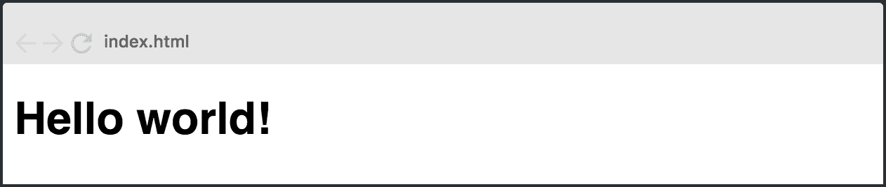
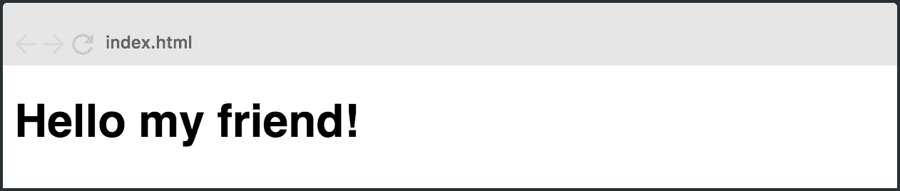
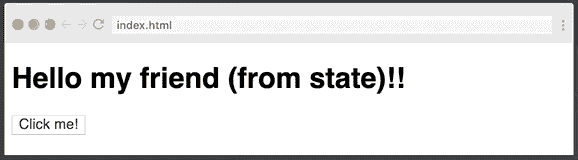

# 5 分钟学会 React——React . js 初学者教程

> 原文：<https://www.freecodecamp.org/news/learn-react-js-in-5-minutes-526472d292f4/>

本教程将通过构建一个非常简单的应用程序让你对 React 有一个基本的了解。我将省去**所有我认为不是核心的东西**。

如果它激发了你的兴趣，并且你想了解更多，你可以在 Scrimba 上查看我们的[免费反应课程](https://scrimba.com/g/glearnreact?utm_source=freecodecamp.org&utm_medium=referral&utm_campaign=glearnreact_5_minute_article)。

但是现在，让我们把重点放在基础上！

### 设置

在开始使用 React 时，您应该使用最简单的设置:一个 HTML 文件，它使用脚本标签导入`React`和`ReactDOM`库。

看起来是这样的:

```
<html>
<head>  
<script src="https://unpkg.com/react@16/umd/react.development.js"></script>  
<script src="https://unpkg.com/react-dom@16/umd/react-dom.development.js"></script>  
<script src="https://unpkg.com/babel-standalone@6.15.0/babel.min.js"></script>  
</head>  
<body>  
    <div id="root"></div>  
    <script type="text/babel">  

    /*   
    ADD REACT CODE HERE 
    */  

    </script>  
</body>  
</html> 
```

我们还导入了 Babel，因为 React 使用一种叫做 JSX 的东西来编写标记。我们需要将 JSX 转换成普通的 JavaScript，以便浏览器能够理解它。

我还想让你注意两件事:

1.  id 为`#root`的`<div>`。这是我们应用程序的入口。这是我们整个应用程序的所在地。
2.  正文中的`<script type="text/babel">`标签。这是我们编写 React 代码的地方。

如果你想尝试这些代码，可以去看看这个 Scrimba 游乐场。

### 成分

React 中的所有东西都是一个组件，它们通常采用 JavaScript 类的形式。您通过扩展`React-Component`类来创建一个组件。让我们创建一个名为`Hello`的组件:

```
class Hello extends React.Component {  
    render() {  
        return <h1>Hello world!</h1>;  
    }  
} 
```

然后为组件定义方法。在我们的例子中，我们只有一个方法，它叫做`render()`。

在里面`render()`你将返回一个你想要 React 在页面上绘制的描述。在上面的例子中，我们只是想让它显示一个带有文本 *Hello world 的`h1`标签！*里面吧。

为了让我们的小应用程序呈现在屏幕上，我们还必须使用`ReactDOM.render()`:

```
ReactDOM.render(  
    <Hello />,   
    document.getElementById("root")  
); 
```

因此，这就是我们将`Hello`组件与应用程序的入口点(`<div id="root"></div>`)连接起来的地方。

所以我们只是简单地说:嘿，反应过来！请渲染 id 为 **root** 的 DOM 节点内的 **Hello** 组件！

它会导致以下结果:



我们刚刚看到的 HTML 语法(`<h1>`和`<Hello/>`)就是我之前提到的 JSX 代码。它实际上不是 HTML，它的功能要强大得多。尽管你在那里写的东西最终会作为 HTML 标签出现在 DOM 中。

下一步是让我们的应用程序处理数据。

### 处理数据

React 中有两种数据:**道具**和**状态**。这两者之间的区别在开始的时候有点难以理解，所以如果你觉得有点困惑，不要担心。一旦你开始和他们一起工作，事情就会变得容易。

关键的区别在于,**状态**是私有的，可以在组件内部进行更改。**道具**是外部的，不受组件本身控制。它是由更高层的组件传递下来的，这些组件也控制着数据。

组件可以直接改变其内部状态。它不能直接改变道具。

我们先仔细看看道具。

### 小道具

我们的`Hello`组件是完全静态的。不管怎样，它都传达出同样的信息。然而，React 的一大部分是可重用性，这意味着编写一个组件一次，然后在不同的用例中重用它的能力。例如显示不同的消息。

为了实现这种类型的可重用性，我们将添加一些道具。这是将道具传递给组件的方式:

```
ReactDOM.render(  
    <Hello message="my friend" />,   
    document.getElementById("root")  
); 
```

这个道具叫做`message`，有“我的朋友”的数值。我们可以通过引用`this.props.message`来访问 Hello 组件中的这个属性，就像这样:

```
class Hello extends React.Component {  
    render() {  
        return <h1>Hello {this.props.message}!</h1>;  
    }  
} 
```

结果，这被呈现在屏幕上:



我们用花括号写`{this.props.message}`的原因是因为我们需要告诉 JSX 我们想要添加一个 JavaScript 表达式。这叫做**逃逸**。

所以现在我们有了一个可重用的组件，它可以在页面上呈现我们想要的任何消息。呜哇！

然而，如果我们希望组件能够改变它自己的数据呢？那我们只好用 state 来代替了！

### 状态

React 中存储数据的另一种方式是在组件的状态中。与道具不同——道具不能被组件直接改变——状态可以。

因此，如果您希望应用程序中的数据发生变化，例如，基于用户交互，它必须存储在应用程序中某个位置的组件状态中。

#### 初始化状态

要初始化状态，只需在该类的`constructor()`方法中设置`this.state`。我们的状态是一个对象，在我们的例子中只有一个名为`message`的键。

```
class Hello extends React.Component {  

    constructor(){  
        super();  
        this.state = {  
            message: "my friend (from state)!"  
        };  
    }  

    render() {  
        return <h1>Hello {this.state.message}!</h1>;  
    }  
} 
```

在我们设置状态之前，我们必须在构造函数中调用`super()`。这是因为在调用`super()`之前`this`是未初始化的。

#### 改变状态

要修改状态，只需调用 **this.setState()，**传递新的状态对象作为参数。我们将在一个名为`updateMessage`的方法中做这件事。

```
class Hello extends React.Component {  

    constructor(){  
        super();  
        this.state = {  
            message: "my friend (from state)!"  
        };  
        this.updateMessage = this.updateMessage.bind(this);   
   }

   updateMessage() {  
        this.setState({  
            message: "my friend (from changed state)!"  
        });  
    }

    render() {  
        return <h1>Hello {this.state.message}!</h1>;  
    }  
} 
```

注意:为了实现这一点，我们还必须将`this`关键字绑定到`updateMessage`方法。否则我们不可能在方法中访问`this`。

### 事件处理程序

下一步是创建一个点击按钮，这样我们就可以触发`updateMessage()`方法。

所以让我们给`render()`方法添加一个按钮:

```
render() {  
  return (  
     <div>  
       <h1>Hello {this.state.message}!</h1>  
       <button onClick={this.updateMessage}>Click me!</button>  
     </div>     
  )  
} 
```

这里，我们将一个事件监听器挂接到按钮上，监听 **onClick** 事件。当这被触发时，我们调用**更新消息**方法。

这是整个组件:

```
class Hello extends React.Component {  

    constructor(){  
        super();  
        this.state = {  
            message: "my friend (from state)!"  
        };  
        this.updateMessage = this.updateMessage.bind(this);  
    }

    updateMessage() {  
        this.setState({  
            message: "my friend (from changed state)!"  
        });  
    }

    render() {  
         return (  
           <div>  
             <h1>Hello {this.state.message}!</h1>  
             <button onClick={this.updateMessage}/>Click me!</button>  
           </div>     
        )  
    }  
} 
```

然后， **updateMessage** 方法调用 **this.setState()** 来改变`this.state.message`的值。当我们点击这个按钮时，这就是结果:



恭喜你。现在，您已经对 React 中最重要的概念有了非常基本的了解。

如果你想了解更多，一定要查看我们在 Scrimba 上的免费 React 课程。

祝编码好运:)

* * *

感谢阅读！我的名字叫 Per Borgen，我是最简单的学习编码方法——Scrimba 的联合创始人。如果你想学习建立专业水平的现代网站，你应该看看我们的[响应式网页设计训练营](https://scrimba.com/g/gresponsive?utm_source=freecodecamp.org&utm_medium=referral&utm_campaign=glearnreact_5_minute_article)。


[Click here to get to the advanced bootcamp.](https://scrimba.com/g/gresponsive?utm_source=freecodecamp.org&utm_medium=referral&utm_campaign=glearnreact_5_minute_article)