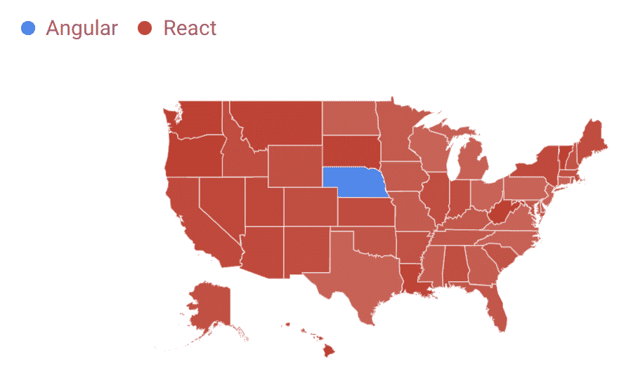

# 在这个 7 小时的免费课程中学习 React JS

> 原文：<https://www.freecodecamp.org/news/learn-react-js-in-this-free-7-hour-course/>

根据 Google trends，React 是最流行的 JavaScript 前端框架。除非你在美国的内布拉斯加州。😀

Google Trends (React vs Angular)

React 是一个声明式的、高效的、灵活的 JavaScript 库，用于构建用户界面。我们刚刚在 freeCodeCamp.org YouTube 频道上发布了完整的 React 课程。

托马斯·魏本法克创立了这门课程。他是一个优秀的开发者，开发了很多很棒的课程。

在本课程中，您将从头开始学习 React.js，从基础知识一直到更高级的主题。你将通过构建一个真正的应用程序来学习。

您将了解到:

*   反应
*   JSX
*   样式组件
*   反应路由器
*   状态和道具
*   语境
*   半铸钢ˌ钢性铸铁(Cast Semi-Steel)
*   API 处理
*   钩住
*   以打字打的文件
*   在会话存储中保持状态
*   部署到网络
*   还有更多。

在 freeCodeCamp.org YouTube 频道观看完整的课程(7 小时观看)。

[https://www.youtube.com/embed/nTeuhbP7wdE?feature=oembed](https://www.youtube.com/embed/nTeuhbP7wdE?feature=oembed)

## 副本

(自动生成)

react 是本课程中最受欢迎的 JavaScript 框架之一。

Thomas Weibenfalk 将教你开始使用 react 所需要知道的一切。

你好，欢迎。

我是来自瑞典的开发人员托马斯·沃沃。

感谢您注册这门课程。

实际上，我对此感到有点自豪，因为这些年来，我创建了很多课程，但这是我创建的第一个课程，因为我喜欢 react。

我想创建课程。

所以这是第三次迭代第三个版本，意味着我已经改进了很多，并听取了你们在课程中想要的东西。

所以我觉得其实真的很好。

当然，总有改进的空间，但这一次，我真的很喜欢这一次。

制作它也很有趣。

所以希望你能在这门课中找到很多基础和中级的东西，也许还有一些高级的东西。

我想我们必须开始了。

让我们开始吧。

让我们来看看我们在本课程中构建的应用程序。

这是一个很好的基于电影数据库 API 的移动应用程序。

所以你必须在电影数据库里创建一个账户。

但我们会在下一个视频中介绍。

所以我想我可以给你们展示一下这个应用程序，让你们对我们在这门课中要构建的东西有一点感觉。

这个总是会放映最受欢迎的电影，我们有这个英雄形象。

所以我们要创造这个。

我们也有一些文本，这里也有一个标题，然后我们可以搜索电影，或者例子，星球大战。

我们会在这里看所有的电影。

这就是这个应用程序的基本功能。

如果我们点击这部电影，您可以看到我们从这部电影中获得了所有数据。

所以这很好。

我们将展示女演员和一些关于电影本身的信息，例如，我们可以看到收入、预算和运行时间。

而在这里，你可能认为也可以点击演员。

是的，当然，我们可以这样做。

但是我不得不把这个教程限制在某个地方。

所以这门课不会讲到这里。

但是，如果您想在这个应用程序的基础上进行构建，这是一个很好的基础。

所以你可以增加显示不同演员信息的功能。

我们也有这个小面包屑菜单出现，我们可以回到主页。

在这个版本的课程中，这是第三个版本，我将向你们展示如何创建风格，当我展示星星时也会很快，因为我仍然希望将主要注意力放在 react 本身上。

这是本课程第三版的新内容。

当然，一切都将是响应性的，我们也将创建一个，正如您在这里看到的，例如，电影的网格，它会根据视窗大小而变化。

所以这很好。

所以这是一个完全正常工作的应用程序。

老实说，我对这个设计很自豪，我自己设计了这个课程，我既是开发者也是设计师。

所以这也是我喜欢做设计的原因。

我认为它看起来很整洁。

事实上，我已经稍微更新了它，因为前两个版本看起来更现代一点。

但我认为主要是是的，我改变了一些颜色，例如，在底部和类似的东西。

好了，这就是应用程序。

在下一个视频中，我将讨论电影数据库 API，以及如何注册以获得我将在本课程中使用的免费 API 密钥。

好了，那么我们来谈谈电影数据库 API。

这就是我们将在本课程中使用的 API。

电影数据库有一个很好的 API，可以获取很多电影、电视节目等，我们将专注于电影。

这就是我们要做的。

你可以在电影数据库注册一个免费账户。

所以去看电影《db.org》吧。

然后单击加入 TMDB。

然后你可以填写用户名和密码，发电子邮件，创建一个账户。

当你创建了一个帐户，你可能会收到一封电子邮件，要求你在登录之前验证自己。

但是，当你创建了你的帐户，请确保你回到电影数据库，并点击登录。

然后你输入你的用户名和密码，就像你登录一个普通的网站一样。

好的，然后你会看到这个仪表板之类的东西。

我认为它是一个仪表板。

你唯一要做的就是进入你的个人资料，点击这里的圆形按钮。

然后你在这里设置，所以她会设置。

在左边的菜单中，你可以看到有一个叫做 API 的东西。

所以点击 API，我想我可能要把这些模糊掉，因为我不想给你看我自己的 API 键。

这是一个我们使用的 API 密钥第三版认证。

这就是我们要用的。

所以现在请确保将它保存在某个地方，因为我们稍后会将它添加到我们的应用程序中。

因此，请确保您可以方便地访问它，因为我们很快就会将它粘贴到我们的应用程序中，那时我们已经用一个叫做 create react app 的东西引导了我们的应用程序。

过一会儿我会更多地谈到这一点。

在我们开始创建我们的应用程序之前，我只想简单介绍一下 react 以及它是什么。

所以如果你去 React js.org，你可以读到更多关于 React 的内容。

这是一个很好的起点，如果你刚刚开始使用 react，他们有不同的文档，有教程，有博客之类的东西。

您可以阅读开始使用 react 所需的所有内容。

所以我试着让这门课对初学者友好一些。

但是反应至少在本质上是中间的。

所以很难让它对初学者非常友好。

这也很大程度上取决于你如何学习东西，我喜欢以这种面向产品的方式学习东西，在这种方式下，我只是构建一些产品，并在过程中学习。

所以我只创建关于我自己想如何学习的课程，但这是非常个性化的。

所以有些人可能会认为它对初学者一点也不友好，因为它有太多的优点。

这就是为什么我也推荐去看看 react js.org 来阅读非常非常基础的东西，至少在 react 里面。

那么什么是反应呢？是的，react 是一个用于构建用户界面的 JavaScript 库，正如他们在这里告诉你的，我认为，实际上这句话有点误导，因为你使用 React 的目的远远不止是构建用户界面。

例如，我做了很多东西，我做了一些小游戏，我做了一个吃豆人游戏。

而我建立的一切逻辑也在反应过来。

所以不仅仅是视图层，我想这里可能会有一点误导。

想想你为视图创建组件。

但事实并非如此，如果你想这么做，你可以使用 react。

在这个应用程序中，我们在 react 中构建所有东西。

所以我们有所有的 API 调用和 react 所做的一切。

这就是我们在这门课中使用它的方式。

react 使用声明性的 peridinium。

我都不知道我发音对不对。

但希望你明白我的意思。

所以 react 是声明性的。

但是比如 jQuery 是必不可少的。

当一些东西是声明性的，你解释，在这种情况下，用户界面，它会是什么样子，你不必告诉它你想如何实现这种外观，你只需要告诉它我们希望我们的用户界面以某种方式出现。

然后 react 会处理剩下的事情。

例如，在 jQuery 中，我们必须获取 DOM 元素。

我们必须修改 DOM 元素。

我们必须一行一行地创建它们，然后将元素附加到 DOM 本身。

所以实际上，在做一些简单的事情时可能会有很多代码。

但是在 react 中，例如，我们有救世主，它是基于组件的。

因此，我们创建一个组件，然后我们只需告诉 react 使用该组件。

它会把它呈现给我们。

随着我们在课程中的深入，以及创建我们自己的组件和应用程序本身，这一点会变得更加清楚。

所以，如果你现在还不明白所有的事情，也不要担心。

所以它是声明性的，它的组件库和“一次学习，随处写”告诉你，他们不关心技术堆栈的其余部分。

这很好，你可以将很多东西与 react 结合使用。

那么什么是 react 组件呢？是的，我们可以看看这里，例如，这里他们创建了一个类，这是一种，我喜欢称之为老方法，类仍然存在，我不再使用它们了。

在本课程中，我们将专注于创建功能组件。

稍后我会告诉你更多。

在本教程的最后，当我们完成应用程序时，我还将向您展示如何将一些组件(有状态的组件)转换为类组件，以防万一，您还需要知道如何创建类组件，因为现实是，如果您开始为一家公司或客户工作，可能会有一些组件仍然是类组件。

因为 react 中有许多应用程序是在我们拥有功能组件状态之前开发的。

这就是为什么你必须先上课才能待在教室里。

我们稍后也会谈到这一点。

这是他们用一个类创建的组件，他们称之为 Hello message。

正如你在这里看到的，他们使用的东西非常像普通的 HTML，他们在这里有一个 Hello 消息的标签。

这个名字是一个所谓的道具，我们稍后会谈到更多的道具，所以不用担心。

但这其实不是 HTML。

这是一种叫做 JSX 的东西。

这也是我们在这门课中要学的东西。

所以我们在这里创建组件，我们告诉它使用这个组件，react 将负责剩下的工作，并用我们的文本 Hello 创建这个 div。

在这种情况下，它将是我们发送的带有道具的名称。

所以名字是泰勒。

它会打出你好泰勒。

正如你在这里看到的。

因此，react 非常非常简洁，我们可以在应用程序中重用这些组件。

所以这是反应的缩写。

正如我告诉你的，当我们创建应用程序时，我们将在课程本身中学到更多的东西。

希望在课程结束时，您会对 react 有更多的了解，并且知道它有多棒。

因为我真的很喜欢 react，所以我对使用 react 充满热情。

实际上，这门课也是我非常热爱的事情。

因为这是我创建的第一个球场。

这是第三个版本，也就是说，我听了以前注册这门课程的人的意见，改变了内容，增加了内容，使它变得更优化，更完美。

希望你会喜欢这门课。

对于本课程，我为您提供了一个 sip 文件，您应该在开始本课程之前下载该文件。

这个 zip 文件包含了几个文件夹，正如你所看到的，当我录制这门课程时，它看起来可能会有一点不同，因为我还没有真正录制它，但我认为它会是这样的。

但是如果它看起来有点不同，没关系。

希望你能读懂文件夹名并理解它们的含义。

因此，我将为您提供一个名为“要复制到项目文件夹中的文件”的文件夹。

这些是我们将在课程中使用的文件。

因此，我为我们创建了一个文件 setups API，这样我们就不必编写自己的函数来获取数据。

我将向你们展示，当我们从 API 获取数据时，我有一个配置文件和一个助手文件。

稍后我还会谈到这些。

然后我有一些我们在课程中也需要的图片。

这就是为什么我有这个文件夹，当我们创建它时，我们将把它复制到一个项目中，还有公共文件夹，index . HTML 文件，我在这里有这个，因为我用的是谷歌字体。

所以我已经在 index . HTML 中提供了，所以我们不需要自己去做。

这就是我们稍后要复制的。

到时候我会告诉你。

你也有两个选择。

如果你不想从头开始创建一切，当我设置应用程序时，你可以忽略它，从一个没有样式的项目开始。

如果你也想创造风格，我组织了这个课程。

因此，您应该能够相当容易地跳过我为组件创建样式的部分。

有些人有，你不想创建 CSS 和样式。

所以这就是我这样做的原因。

所以这是你应该使用的，如果你想创造的风格。

否则，你使用一个叫做样式的，它会为你提供所有的样式，所以你不需要输入样式。

你可以跳过这些视频。

因此，如果您想从其中一个项目开始，您可以在该项目中导航，并在您的终端中键入 npm install，这将为您安装所有依赖项。

然后每次你启动应用程序的时候，你可以输入 NPM 启动。

这也是我将要展示给你们的，所以不要担心。

如果你想查看结果，那么你就有一个完成的应用程序的文件夹。

但是请注意，你必须把你自己的 API 密匙放在一个文件里，这个文件现在被隐藏在这里，叫做点 end。

在那个里面，你必须粘贴你自己的 API 密匙，否则，它不能工作。

这也适用于分步解决方案。

此外，我为您提供了与每个视频相对应的分步解决方案。

如果你想运行一个例子，从一个特定的步骤解决方案，你也必须粘贴你的 API 键到. m 文件中。

我也开始更多地谈论. m 文件。

但这是文件的开始。

所以你必须考虑你是否想在这个课程中创造风格，你也必须考虑现在你是否想从头开始设置一切。

或者，如果你不想这样做，你可以从这里的其中一个文件夹开始，在 Odin 中导航，键入 npm install，或者如果你使用 yarn，你应该也能使用那个。

然后 NPM 开始或纱线开始启动应用程序。

好吧，让我们继续下一个视频。

我很快就会谈到我在本课程中使用的工具。

只是一个简短的视频，介绍我在本课程中使用的工具，我认为您应该已经了解并安装了这个工具，以便能够充分利用本课程。

否则，可能会有点困难。

例如，如果您没有使用过我将用来安装依赖项的 NPM。

我建议你先了解一下，因为这是 react 的初级中级课程。

这不是一门编程初学者课程，你应该知道一些 JavaScript，尤其是 iOS 6 语法，我们将在这门课程中使用大量的 iOS 6 语法。

因此，在开始学习之前，完善您的 JavaScript 知识是一个好主意。

做出反应。

但这只是我的看法。

但是当然，你应该用你自己的方式去做。

如果你想在学习香草 JavaScript 之前学习 react，这完全取决于你，我不应该告诉任何人他们想如何开始他们的编码之旅。

好吧，我用 NPM。

这意味着我必须安装 node，本质上我们没有使用 de。

但不，德乌斯包括 NPM 包经理。

所以这就是为什么我们必须安装那个。

所以，如果你还没有安装，确保获得最新版本并安装它。

然后我用 Visual Studio 代码作为我的 ID。

这就是我在这门课中用到的。

然后，我将使用 create react app 并快速轻松地引导 react 应用程序。

这就是我们要做的。

实际上，我将在下一个视频中这样做。

因此，让我们开始使用我们的应用程序。

我很高兴看到你将从头开始创建这个项目。

我们将使用 create react app 来引导我们的应用程序。

所以让我们开始吧。

如果我们看一下 create react app 的主页，你可以在 create dash react dash app dot Dev 找到它。

然后他们在菜单上有一个叫做“开始”的东西。

我们唯一要做的就是记住这一行，创建 dash react dash 应用程序。

然后你有你想要创建的应用程序的名字，一个空的 x 是 NPM 在最新版本中提供的，所以你不必全局安装 create react app 来使用它，这将确保我们获得最新版本。

所以我一直用 mpex，而不是先全局安装 create react app。

这真的很棒，因为我知道我使用的是最新版本，你不必在全球范围内安装。

但如果你想这样做，你当然可以先全局安装 create react app，但这是我将要使用的命令。

因此，请确保您在终端内导航。

我正在使用一个叫做 hyper 的终端，我收到了很多关于我正在使用的终端的问题，我实际上不记得主题的名字了，但是我根据自己的喜好设计了一点。

所以那很甜蜜。

所以 hyper 是一个很棒的终端。

如果你想有一个定制的终端。

当然，在 Visual Studio 代码中也有一个内置的终端。

让我们开始吧，确保您导航到您想要创建声誉的文件夹。

然后我们输入 MP x，然后创建 dash，React dash app。

然后我们有了应用程序的名称。

我将把它命名为 react dash 或 dB。

RM DB 代表 react 电影数据库。

所以这是我能想到的最好的了。

你想用什么名字都可以。

然后我们可以按回车键，然后等待它。

它会为我们安装一切。

所以需要一点时间。

好吧。

希望你安装正确。

create react app 现在有了引导程序或应用程序，您可以自己设置，而不用 create react app。

但是 create react app 实际上是用在很多生产应用中的。

实际上它现在正被我的一个客户使用。

这是一个相当大的应用程序。

所以你可以用 create react app 做很多事情。

它在后台使用 Babel 和 Webpack 为你建立直接的环境。

所以如果你不想用 crate react app，你自己也可以这么做。

但我不会在这门课中展示，因为我认为对于初学者来说，这有点高级。

实际上，我们会很好地使用 create react 应用程序，这就是我们所需要的。

所以我们也想确保它有效。

因此，请确保您在产品文件夹内导航，我将清除它，然后键入 CD、React dash 或 MDB，或者您命名的任何名称。

然后我们在那个文件夹里面。

然后我们可以输入 NPM 开始。

它应该启动我们的环境。

这是现在已经完成的。

所以它将被这个应用程序取代。

所以起作用了。

我们已经成功地引导了我们应用程序。

这很贴心。

在下一个视频中，我们将安装几个将用于本项目的依赖项。

我们正在引导应用程序。

现在，我们将安装一些我们将用于此项目的依赖项。

第一个是所谓的反应路由器。

react 路由器是 react 应用程序中处理路由的标准，因为这是一个单页面应用程序。

我们需要一些东西来处理或滚动，因为我们将有不同的页面。

我们将要使用的是 react 路由器。

还有一个库叫做到达路由器。

实际上，我在这门课的第二版中使用了这个。

但是创建 reach 路由器和 react 路由器的团队是同一个团队。

所以他们打算把它们合并成 react 路由器，第六版。

这个还在测试阶段，但是我已经和他们谈过了，我认为我应该在这个课程中有这个，因为它很快就会出来。

API 也不会改变，因为我们不会使用这个路由器库中最先进的东西。

所以我们会没事的。

我们这里有一些说明。

我在 github.com，正斜杠反应训练正斜杠反应破折号路由器，正斜杠释放。

在下面这里，我们可以看到我们有一些关于如何安装它的说明。

所以我要打开我的终端，做这样的事情。

当然，我们可以复制这个，然后粘贴进去。

但是在我的课程中，我想学到尽可能多的东西。

不要复制粘贴太多的东西，直接输入是个好主意，因为这样会让你更容易记住。

这就是我们现在要做的。

所以我要输入 MPM II，或者如果你用的是纱线，你当然可以用它来代替，我要用 NPM 来完成整个课程。

我输入的是 I，而不是完整的 install，这是 install 的简称。

所以 NPM 我，然后我们需要安装一个叫做历史的东西。

此外，这是另一个与 react 路由器结合使用的库，我们可以一次性安装它们。

如果我在这里输入历史，那么我有一个空格。

然后我可以输入我想要安装的另一个库。

在这种情况下，这将是反应仪表板，路由器，仪表板圆顶。

然后我们有一个加号。

接下来，这将抓取 react 路由器的更好版本。

所以按下回车键，等待它。

希望你安装正确。

所以我要再次清空我的控制台。

我们将继续讨论所谓的样式组件，样式组件是一个超级棒的库，可以与样式组件一起使用，我们可以在隔离和限定范围的组件中创建 CSS。

所以这真的，真的很棒。

我们有很多功能，例如，在 SAS 中，我们可以做嵌套之类的事情。

我们可以送他道具，动态改变我们的造型。

随着课程的进行，我们将更多地讨论样式化组件，因为我们将创建样式。

如果你选择那条路，我真的认为你应该，如果你想有一些 CSS 实践，但这取决于你，我为你提供了这门课的不同选择。

所以我们要安装样式组件。

你可以在 components.com 时尚达什了解更多。

所以回到终端，我们在 MPM 输入的是风格化的破折号组件。

我们按下回车键。

好吧，很顺利。

所以再次清空控制台，我们继续我们需要的最后一个依赖项。

这就是所谓的道具类型。

Prop types 是 react 中一个非常好的工具，您可以在其中对发送到组件中的 Prop 进行类型检查。

正如他们所说，这里是 react props 和类似对象的运行时类型检查。

那太好了。

今天，很多人使用 TypeScript 来代替，那么你就不需要使用 prop 类型。

实际上我自己也经常使用 TypeScript，我开始喜欢上它了。

但是在我们的例子中，我们没有使用 TypeScript。

没错。

现在，我将在本课程结束时，在我创建的一个特殊模块中向你们展示这一点，在这个模块中，我们将所有内容都重构为使用 TypeScript。

但是现在，我们没有使用 TypeScript。

这就是为什么我们要使用道具类型。

我会在稍后的课程中详细讨论这一点。

我把它的标题放在了课程的最后，因为我不希望在我们学习反应的时候有太多的东西。

这就是原因，所以我会在课程的最后讲一下。

当你创建一个有一些道具的组件时，你应该使用道具类型对你的道具进行类型检查。

但我不会先这么做，我会在后面的课程中添加。

这样我们就不会分心或者有太多事情要做。

好吧，回到终端，输入 NPM。

我放弃了破折号类型，并按下回车键。

原来如此。

那是我们的依赖。

当然，我在本视频开始时没有提到它，你当然应该在我们创建应用程序的文件夹中，我们用 create react app 引导该应用程序，这非常重要，你必须在该文件夹中导航。

否则，它将不起作用，因为我们将在该项目文件夹中安装依赖项。

好的，在下一个视频中，我们将把商店中的一些文件复制到这个项目的 c 文件中，我们将需要这些文件来完成这项工作。

如果我们查看项目文件夹 React dash orientdb 的内部，我们可以看到这里有一些不同的文件夹和文件。

例如，如果我们查看公共文件夹，我们可以看到一些图像文件和 index . HTML 文件。

这是开发环境将为我们构建的文件夹。

因此，公共文件夹是我们用来运行应用程序的已完成文件。

这就是里面的所有东西。

和源文件夹。

src 文件夹将是我们为应用程序创建所有材料的文件夹。

所以你可以看到我们有一些 CSS 文件，我们有一个应用程序文件，一个索引文件和一个索引 CSS 文件。

我们也有一个测试文件。

这门课我们不会做任何测试。

所以这个，我们不打算用。

我们有一个服务人员，我们也不会使用这个。

我们有一套不会用到的测试。

如果我们看一下 zip 文件的内部，您应该已经下载了本课程的起始文件。

我们来看看这里的第一个文件夹，一个要复制到产品文件夹的文件。

好了，这就是要复制到项目中的文件。

因此，请确保在这里标记它们，复制它们，移回您的文件夹，您的项目文件夹，并粘贴它们。

然后，您将选择替换旧文件夹。

这个是瑞典语的。

所以如果你不是瑞典人，你可能不会理解。

但这里说的是替换它，所以我要点击那个按钮。

然后它会问我是要合并源文件夹还是要替换它。

因此，如果它要求您合并或替换它，总是选择替换。

好吧，我们成功复制了文件。

如果我们看一下 public 文件夹的内部，在这里，我们会看到完全相同的文件。

唯一的区别是，我在谷歌的导入中添加了一种叫做 Abel 或 Apple 的字体，我真的不知道，如果我发音正确，它听起来更好发音，Abel。

所以我认为这是正确的。

这是我在这里唯一改变的。

这是在 index . HTML 文件中，其他文件保持不变。

这就是公共文件夹。

如果我们查看 src 文件夹内部，您可以看到现在文件数量减少了。

这是因为我删除了所有与测试有关的文件，或者服务人员和所有我们不需要的 CSS 文件，因为我们将使用样式化的组件。

我还添加了一些文件和一个文件夹，我们有图像文件夹。

这一张，当然包含了我们将在本课程中用到的图片。

然后我有一个名为 API dot j s 的文件。

在这个文件中，有一些函数将处理对电影数据库 API 的 API 调用。

在之前的版本中，我们实际上是在课程中自己创建的。

但我认为这只是转移了 react 和 react 语法的注意力。

因为这是一门关于学习反应的课程。

问题是，这是这个脚本中的普通 JavaScript，与 react 本身没有任何关系。

所以这就是为什么我为你创建了这个，并把它们放在一个文件里。

当然，当我们在课程中讲到这一点时，我会更多地讨论这些函数。

然后我有一个配置文件。

这个配置文件包含了所有必须用电影数据库 API 设置的东西。

我也有一个助手文件，帮助我们文件包含一些函数，可以帮助我们将一些数字转换成金钱，也可以转换我们的时间。

在本课程的后面，我还会更多地讨论这两个文件。

这些是文件，希望这一个有用。

因此，如果我们回到我们的终端，这个现在正在运行，为了确保万无一失，我将中断它并运行 NPM start，以查看它是否正常工作。

当你分享一些东西时，看到这些东西有用总是一个好主意。

然后我打开浏览器，重新加载页面。

你可以看到我在 localhost 3000，和以前一样。

但是现在这个好看的小旋转 react logo 被去掉了，上面写着从这里开始。

那是因为我去掉了那个。

我修改了这个文件，这样我们就可以从这里开始使用这个应用程序了。

因此，如果它说从这里开始，你知道你成功地复制了所有的文件，希望，它应该为你工作。

在下一个视频中，我们将继续实际使用您在注册电影数据库 API 时获得的 API 密钥。

好吧，我们还有一件事要做。

然后我们完成了项目的设置。

那就是我们要创建一个点 m 文件，并粘贴我们的 API 密钥。

因此，在我们的应用程序文件夹中，我们将创建一个新文件，我将把它命名为点 E 和 V 点 m，create react app 内置了对环境变量的支持，您唯一要做的就是先用 react 命名它们。

所以反应一下，强调一下，这很重要，否则，它就认不出来了。

这个叫做 AP 下划线 API 下划线键，都是大写字母。

然后我们有一个等号。

然后你可以在这里粘贴你的 API 密匙。

这就是你要做的一切。

所以只要把它贴在等号后面，就可以了。

并保存文件。

然后，在我的 config.js 文件的源文件夹中使用这个 API 键。

您可以看到我们的 get it to here，process dot n dot react app API key。

这都是在 Create react 应用程序中管理的。

当它启动或开发环境，并为我们创建所有的文件和东西。

在环境变量的实际名称前，用下划线标出这些对市场非常重要的变量，所有这些都是我为你创建的。

所以你不用在意这个。

因此，我从电影数据库的端点创建了不同的资源。

我们会在后面的课程中用到这些资源。

然后我会讲更多。

因此，举例来说，我有不同的搜索端点，来获取流行的电影。

这是我们最后的奖励视频，我创建了登录和投票，也提供了电影数据库 API，你可以用你的帐户登录，对电影或老电影投票。

如果你想这么做。

然后我们有了图像基础 URL。

这张也是电影数据库里的。

所以这些是由 API 提供的。

所以只要按照他们的指示使用它们。

我们有一个背景大小，我们可以设置背景的大小和图像上海报的大小，我们可以在这里设置不同的大小，如果你想改变它们，我会在这里为你标记出来。

所以我们不必考虑太多，因为我已经为你准备好了。

还有一个文件，叫做 API dot j s。

在这个里面，我创建了实际的代码来获取数据，我们可以在获取数据的时候调用这些函数。

我们不需要自己输入所有这些。

当然，当我们获取电影的时候，我还会进一步讨论这些函数。

所以这个是用来读取所有电影的，这个是用来读取一部电影的。

然后我们这里有一个，它将获取学分。

在这下面，这些都是额外的材料。

所以你不必关心那些在课程主要部分的内容。

所以我们有三个函数来获取数据。

这是我改变的一件事，实际上，在这之前的课程版本中，我们在课程中自己创建了这些，但我认为对于初学者课程来说有点高级。

我还认为，它将重点放在 react 本身，因为这是 JavaScript，而不是 react 特定的代码。

这就是为什么我想要这种体验，我希望这门课也是一门有趣的课。

这样你就不会累到停下课程学不完了。

所以这就是为什么我为我们创造了这些。

好了，这是配置和一个 py 文件。

我还有一个文件，叫做 helpers . dot . js。

这个包含两个函数，可以帮助我们计算时间，也可以转换成金钱，因为我们从 API 得到的数字必须转换成时间和金钱。

所以我在后面的课程中也会用到这些。

好的，那么创建点 m 文件，创建一个变量，反应下划线 app，下划线 API 键大写字母等于，然后你粘贴你的 API 键。

否则无法工作，因为无法访问 API。

这里需要注意的一件非常重要的事情是，这个环境变量是不安全的，因为它在客户端是可见的。

所以不要以为这个不会在浏览器里显示出来，当然要自己去找。

但是如果你擅长浏览代码，你将能够找到这个 API 键。

所以，如果你想在浏览器中隐藏一个 API 键，这不是一个安全的方法。

在我们的情况下，它不是那种密钥，那不重要。

为了这门课，创造一个对我们完全隐藏这一点的系统太先进了。

所以注意，这个在客户端是不安全的。

在我们继续之前，我想谈谈 react 的一个非常重要的方面，我想很多人实际上都忘记了。

当我们用 react 创建东西时，我们也在使用一种叫做 JSX 的东西。

它代表 JavaScript，XML。

如果我们看这里，我现在在 React js.org 页面，他们在这里向我们展示如何创建组件。

这是一个类组件。

正如我之前告诉你的，我们将创建功能组件。

所以我们不打算为这个应用程序创建类组件。

但是他们在利用 JSX。

这里，这是 JSX。

你可能认为这是 HTML，但实际上不是，这是 JSX。

JSX 和 react 结合使用真的很棒，因为我们可以通过使用 HTML ish 语法来呈现不同的组件。

我想很多人都忘记了。

因为我不知道确切的百分比，但我认为至少 99%的应用程序使用 JSX。

结合 react，有的人不用。

这就是我要在这里谈论的。

因为您可以在 react 中创建没有 JSX 的组件。

如果我们向下滚动到这里，你在 react 对象上使用一个叫做 create element 的东西 React 点 create element，我们指定是否需要一些道具。

然后我们为这个元素指定子元素。

你可以在这里看到，React 点创建元素，我们有我们想要创建的组件，我们有道具，我们还有孩子，这是 JavaScript 中的扩展语法，他有六个。

这就是为什么他们用三个点来解释这个。

这里的这个实际上和这个一样，这里的这个，会向下平移，以对点创建元素做出反应。

但是对 react 中的每个组件和所有操作都使用 react 点创建元素是不实际的，你可以看到它不是那么可读，而且会变得有点乱。

实际上，我认为如果你这样使用 react，它就没什么意思了。

所以我将向你们展示如何用 react 创建一个元素。

在下一个视频中，我将更多地谈论 JSX。

但是现在我将向你展示一个小例子，告诉你如何用 react 创建一个元素。

让我们回到我们的终端，确保我们的开发环境正在运行。

所以 NPM 开始，总是用 NPM。

开始，当您启动您的开发服务器时，您可以看到它现在正在这里运行。

然后我回到 Visual Studio 代码。

我会在 app.js 文件中。

对于这一个，它在 src 文件夹中。

这是我们应用程序的核心，我们有 index.js。

这是应用程序的启动文件。

您可以看到这里有导入应用程序组件，这些导入是 e6 语法的导入。

所以我们可以导入一个模型。

在这种情况下，模型是一个组件。

而且叫 app。

所以我在这里输入了那个。

然后用在这里，这个是 JSX。

这是我们应用程序的核心，我们有一个名为 react 的库。

我们有 react Dom，因为 react 可以用于除 Dom 之外的其他东西，例如，您可以使用 react 创建本机应用程序。

但是我们将使用库 react DOM。

这个是用 create react app 为我们设置的。

因此，您可以从我们在这里导入的 React Dom 中看到，我们调用了 render 方法。

我们给它我们想要渲染的组件。

我们会告诉它我们想在哪里渲染它。

因此，通过 ID 从文档中获取元素，我们得到根元素。

因此，如果我们在 republic 和 index . HTML 中查找，您可以看到我们在这里有一个 div，它被称为 root。

在这个 div 中，我们将在公共文件夹节点附近呈现完整的应用程序，并返回到 index.js 文件。

所以我们告诉 react 将我们的应用程序呈现给一个名为 route 的 div。

它也处于所谓的反应严格模式。

以前不是这样。

但这是默认的。

严格模式下的阻力很大。

如果你在编写应用程序时做了一些不应该做的事情，它会做更多的检查。

所以在 react 中使用严格模式总是一个好主意。

好了，让我们回到 app.js 文件。

如你所见，这里，我们有这个元素，我们有一个叫做 AP 的 div。

我从这里开始渲染。

这是我们之前在启动应用程序时看到的。

如果你不想的话，你可以不输入，因为我想给你看这个，这和我们将要构建的应用程序没有任何关系。

所以我现在要创建一个小组件。

然后我将删除它，我们可以继续创建我们的应用程序。

我要用箭头函数来做，我喜欢用箭头函数，这里不用。

但是你可以改变这个，如果你想要一个箭头函数 const app equals，然后我们在这里创建一个箭头，就像这样，我习惯使用箭头函数。

所以我也用它们来做元件。

所以 const，我要创建一个叫做 store 的组件，我有一个箭头函数。

然后从 react，我们在这里导入 react，你总是要在顶部导入 react，另一个调用 create element，我有一个括号，我要创建一个 div。

然后我们不会有任何道具，因为我们还没有谈到道具。

所以我把那个设置为现在，然后我要渲染出屏幕。

这是一个类似的小商店，我将删除侧栏，我们可以在这里看到组件。

所以这不是用 JSX。

如果我们想把这个渲染出来，而不是在这里返回这个，我要返回存储。

因为这是现在的函数，我也必须这样调用它，保存它。

然后我将返回到应用程序。

你可以看到这是一颗小星星，所以它呈现得很完美。

这只是一个小例子。

我想让你注意到，你不需要用 JSX。

这实际上是 React 功能的核心。

所以你不必用 JSX。

但是我们打算用 JSX，因为它很可爱，和它一起工作很有趣。

我认为，实际上，如果没有 JSX，创建应用程序将是一件微不足道的事情，至少我是这样认为的。

因此，我删除了我在这里创建的所有内容并保存了文件。

同样，只要确保它存储在这里的工作。

这很有效，这很好。

这就是关于 react 点创建元素和在没有 JSX 的情况下使用 react 的一些内容，只是一个很小很小的注意事项，我不打算深入讨论，因为我不认为在没有 JSX 的情况下使用 react 实际上是相关的。

这就是原因。

好的，我谈了一点没有 JSX 的 react 的使用。

但我真的不认为这是个好主意。

这就是为什么在我们继续讨论这个应用程序之前，我还想简单介绍一下 JSX。

所以 JSX 代表 JavaScript，XML，它非常类似于普通的 HTML。

如果我们看一下这里，你可以看到他们在这里创建了一个 h1 标签，上面写着 hello word。

这看起来就像普通的 HTML。

但是就像他们说的，这里，这个有趣的攻击语法既不是字符串也不是 HTML，我实际上不认为这是一个有趣的攻击。

我们可以在这里了解更多关于我们为什么使用 JSX 的信息。

这里最重要的是，他们不想把标记放在一个文件里，逻辑放在另一个文件里，他们想把它们合并在一个文件里。

这对于一些人来说可能听起来很可怕，因为几年前，你不应该把它们混在一起。

但是在 react 中，它真的很棒。

正如他们所说，在这里，框架组件包含标记和逻辑。

所以 JSX 看起来很像 HTML，但也有一些不同。

我想在这里谈谈这些。

因为在这种情况下，我们创建了一个 h1 元素。

这看起来一模一样。

但是有一些东西不同于普通的 HTML。

例如，你可以看到你可以在这里嵌入 JavaScript 作为表达式。

例如，对于 image 标记中的源区域，可以使用花括号，然后嵌入 JavaScript 表达式。

你能以这种方式将它们结合起来真是太棒了。

此外，当你看标签索引时，它是骆驼大小写的，不同于 HTML。

他们在这里说，JSX 似乎更接近 JavaScript，然后是 HTML，react，Dom 使用 camel case 属性命名约定，而不是 HTML 属性名称。

所以请记住，在 JSX 你必须使用驼色字体。

有一些不同之处。

例如，当你在一个元素上设置一个类时，你不使用 class 关键字，而是使用类名，大小写一致。

他们在这里也提到了。

我花了一点时间来适应这个。

不，我实际上是在输入类名，当我输出普通的 HTML 时。

此外，很高兴知道 JSX 是非常安全的，它可以防止注射攻击之类的事情。

所以我想你会学到很多关于 JSX 的东西。

在我们继续这门课的时候，因为我们会用到实际的例子，最重要的部分不是记住 JSX 不是 HTML。

当你创建一个属性时，它也使用骆驼大小写。

在我们开始用状态和道具创建组件以及 react 中所有这些重要的东西之前，您可以坐下来，放松一下，喝一杯，喝一杯啤酒，喝杯茶，或者您正在喝的任何东西。

听我说，在这个视频中，我会讲一点 react 中的道具和状态，你可以做的第一件事就是想象这是一个从上面看的房间。

这里的灰色圆圈是没有打开的灯。

橙色的是一盏灯，每盏灯都有一个常开的灯开关。

所以如果我点击这里的这个，我可以打开这个灯，灯的开关会变成开。

这个我可以关掉它。

两盏灯都关了，我打开这盏灯，然后打开这盏灯。

这之所以成为可能，是因为我可以在 react 中使用状态。

所以灯有两种状态。

我第一次有一个状态，第二盏灯有一个状态，这是一个布尔值，它告诉灯是开还是关。

但是如果我们考虑这个，我们实际上也有房间的状态，因为我们也需要一个状态，让灯的开关从关变到开。

因为这些是联系在一起的，所以你可以从不同的角度看这个国家。

在这种情况下，我将从房间的角度来看状态。

所以我没有把状态放在灯或灯开关中，我把状态放在房间本身中，因为我们有一个房间舞台，房间将会是灯和灯开关是开还是关。

所以我们有了房间本身的状态。

这就是我在 React 文档中谈到的，他们告诉你，如果你想在多个子组件中使用父组件，你可以将状态提升到父组件。

因为如果我们把状态放在灯本身，例如，我们只能访问灯的子组件的状态。

当然，我们可以像孩子一样把灯开关放在灯旁边，但这不是最有效的方法。

如果你想重用你的代码，事情会变得复杂。

我在这里所做的是研究，我在这里有这个房间，我在房间里放置了组件，我还将在房间里放置状态，这样我们就可以将该状态用于灯和灯开关，我现在将向您展示如何做到这一点，还会多谈一点关于状态和道具的内容。

如果我们看看这里的代码，这是我为你创建的应用程序。

你也可以在本课程的源文件中打开它，我在那里提供了。

我有了索引文件，这是显示应用程序组件的标准索引文件，而应用程序组件实际上就是房间。

我也可以给这个房间命名，因为这实际上是房间的组成部分。

如您所见，在房间组件中，我创建了两种状态。

在 react 中，当你用钩子创建一个状态时，你使用了一个叫做使用状态钩子的东西。

在我们有钩子之前，我们必须使用类来包含状态。

所以你不可能创造出一个功能性的组件。

但是现在我们有了钩子，这意味着我们可以拥有有状态的功能组件。

这很贴心。

所以当我们调用这个使用状态钩子时，我们可以用一个初始值来初始化它。

所以在这种情况下，我给它假的，因为我希望这盏灯最初是关着的。

然后我在销毁这个数组的时候，做了一个叫做 ear 6 destruction 的操作，这个数组是我从使用状态钩子返回的。

所以我们可以随意命名我们的州。

在这种情况下，我命名它为灯 1，然后我们有国家中心的中心是灯 1。

关于 react 中的状态，您应该知道一些事情。

第一个是，你应该把状态看作是不可变的，你不应该改变状态，这意味着你应该总是使用你得到的状态设置器来设置 react 中的状态。

例如，如果您正在直接修改状态，请尝试更改这个状态。

这意味着您的组件不会重新呈现。

这可不好。

而且在申请中也会给你以后造成很多麻烦。

但是，如果您使用 setter 并更改状态而不改变状态，您的组件将重新呈现并更新 DOM。

这就是 react 的工作原理，当你的组件重新渲染时，你更新 DOM。

关于功能组件的另一件事是，我们可以使用类组件中的使用状态钩子添加任意多的状态，你只能有一个状态，所以你必须创建一个具有不同属性的对象来保存你的状态。

这太棒了，我们可以根据我们想要的状态结构来划分状态。

在这种情况下，我创建了两个状态，一个是灯一，一个是灯二。

所以他们做着完全相同的事情。

这里唯一的区别是当我初始化它的时候，我把这个设置为真，这会打开灯二。

好，现在我有两个函数。

当我们点击灯的开关时，这些就会被调用。

所以我有一个灯开关 1，一个灯开关 2，你可以用一个函数来代替。

但是我想非常非常清楚地说明这些东西是如何工作的。

所以我创造了两个。

因此，开关 1 有一个函数，开关 2 有一个函数。

这个将设置为灯 1，这是灯 1 的状态设置器。

我在这里做的是，给它提供一个内联函数。

当你给状态设置器提供一个函数的时候，它会被前一个状态调用。

所以在这种情况下，我要翻转那个布尔值。

所以当我点击按钮时，这个值第一次会变成真，因为它最初是假的。

按钮 2 的这个会是假的，因为它是真的。

好了，这些是电灯开关的功能。

所以如果我们看着 JSX，这里，我们回到圆顶，这是一个房间的组成部分。

如果我转到这里，您可以看到这是我们在本课程中也会经常谈到的样式组件，我创建了一个样式组件，这是一个 div。

所以我对房间本身的那个设置了一些样式，我让它宽 500 像素，高 500 像素，然后我给它设置了一个边框，空白 0 将使它在屏幕上居中。

所有东西都包在这个房间组件中，然后我还有一个组件，那就是灯，我马上就要谈到它。

我还有电灯开关。

因此，我们在这个应用程序组件中有状态。

就是这个房间。

这是我为这个简单的应用程序收集所有状态的地方。

这样，我可以在灯组件和灯开关中使用这种状态。

因为正如您在这里看到的灯组件，我创建了一个叫做道具的东西，道具是您可以创建的东西，它将被发送到您创建的组件中。道具是一个对象。

因此，您可以在该对象上创建任意多的属性。

在这种情况下，我在道具上创建了一个灯。

所以这个将被发送到道具对象中的灯组件中。

我还创造了一个叫做位置的道具。

这就是我如何让灯出现在房间的左边或右边。

“灯开”将是灯的状态。

所以这是一个布尔值。

这样该组件将知道灯是开着还是关着。

我马上会给你们展示。

我用电灯开关做同样的事情。

对于这一个，我有回调，因为我出现在这里。

我给这个道具一个回调。

不一定是 Call callback，这是我选的名字。

打开开关，我要给它一个灯的状态。

因此，您可以看到，我将灯状态用于灯和灯开关。

这就是我之前谈到的，如果我们在灯本身中创建灯的状态，我们将无法访问灯开关的状态，那么我们必须创建灯开关作为灯的子级。

这并不好，正如你现在可能看到的，因为现在我们可以在我们的房间里放置尽可能多的灯和电灯开关。

所以如果我们把污渍放在灯上，就很难做到了。

我还有一个电灯开关的支架。

让我们进入我在这里创建的灯组件。

我还有一个包装器 div，它是一个样式化的组件。

所以我把所有东西都包装在这个 div 中。

样式组件的有趣之处在于它们也可以有道具，因为它们也是有效的 react 组件。

所以我们可以在样式组件中使用道具来修改 CSS。

我认为这是样式组件的超级优势之一，因为正如你在这里看到的，这就是所谓的模板文字。

在这个模板中，我们可以获取发送到这个组件中的道具。

所以在这种情况下，我创建了美元符号和花括号，我可以使用 JavaScript 表达式。

我在这里有一个内联函数来获取道具。

因此，如果我们看看下面的包装组件，您可以看到我还发送了一个道具灯和位置。

所以我只是发送这些道具，它们最初被发送到灯组件中。

所以我在实验室组件中获取它们，然后我也将它们发送到包装器组件。

那就是风格成分。

通过这样做，我可以，例如，检查这里，如果道具点的位置等于左边，那么我要设置左边的值为 20 像素。

否则，我将它设置为三个或两个像素以下，这将使它位于房间的右侧。

这样，我就可以修改我的 CSS，让它变得非常非常动态。

你还可以在风格元素中使用道具，这真的很棒。

好了，这就是风格组件和道具的工作原理。

所以如果我们看看这里的实验组件，我把这些道具放在这里。

我在这里做的是使用 iOS 6 析构。

从我们得到的通常称为 props 的对象中，我正在析构这些正在发送的值，如果我没有在这里进行析构，我只是这样做，你可以看到它现在需要我，然后我必须键入 props，dot 和 props，而不是因为 props 是一个对象，所以我必须从 toggle 中获取那些特定的属性。

但是如果我像这样析构它，我不需要每次都输入。

所以我只在这里构造属性。

关于道具你应该知道一些事情，因为它们不同于状态。

而最主要的区别就是道具是传入组件的。

你永远也不应该改变组件中的属性，属性，值是从发送属性到组件的父组件中改变的。

因此，如果父组件中的道具发生变化，它也会重新渲染，这是这个组件。

所以永远不要改变这个组件中的 props 值，你可以用一个状态设置器来改变组件中的状态。

举例来说，这就是你触发重新渲染的方式。

当您更改组件中的状态时。

这很好，你应该用设置器改变组件的状态。

但是在接收道具的组件中，提示永远不应该是可耻的。

当 prop 值改变时，该组件将重新呈现，并且它将在 props 中具有新值。

这就是道具的工作原理。

好吧，我们可以检查一下电灯开关。

我也在做同样的事情，我在这里销毁道具。

我有这个底部组件。

这就是明星成分。

我在这里也用道具修改了它。

所以我在做同样的事情。

您可以在这里看到正在发送回调，这是我在应用程序组件中提供的功能。

这就是我要把一个回调道具放进电灯开关的那个。

然后我有我的按钮，按钮有一个 onClick 处理程序，onClick 处理程序会触发这个回调函数。

这使得这个组件非常动态，因为通过使用道具，你可以使你的组件动态。

你可以在不同的情况下使用它。

在这种情况下，我可以发送任何我想在单击按钮时触发的回调函数。

这意味着我可以在不同的情况下使用这个按钮。

在这种情况下，我还显示了开关的开和关，因为我发送的是道具开关开。

所以很可能不会有用，比这个用例具体少太多。

但是如果你想的话，你可以用这个按钮来做其他的事情来触发灯的开关，你可以打开和关闭其他的东西，并有另一个回调函数，这将工作。

这就是你用道具的原因。

此外，你可以通过给你的组件一些道具来使它们具有动态性和可重用性。

通过在组件内部使用这些道具。

你可以调整你的组件和改变逻辑，你可以改变 JSX 和它应该渲染什么，诸如此类。

所以这对我们真的很有用。

支持一下。

好吧，这就是状态和道具的短缺。

我希望在我们开始创建自己的产品之前，这篇文章能给你一些启发。

让我们在下一个视频中继续，我将更多地讨论样式组件以及它们是什么。

在我们开始真正创建一些代码之前，我还想说一件事。

那就是样式组件。

因为在下一个视频中，我们将为我们的应用程序创建一个全局样式。

我们将对样式化的组件做同样的事情。

所以就简单谈谈风格的组成部分，以及为什么它如此伟大。

我认为最大的好处是你得到了 CSS 的作用域。

这意味着不同的组件可以有相同的类名，这没关系，因为它的作用域是那个组件。

第二，你可以使用语法，有点像 sass，例如，你可以嵌套东西，你不需要有 polyfills，和类似的东西，它会自动为你创建所有的东西。

第三，你可以在里面放些道具。

道具是我们在本课程中会经常谈到的东西，因为它是 react 中必不可少的一部分。

这意味着你可以通过给你的风格发送不同的道具来修改 CSS，你现在不需要确切地知道道具是如何工作的，因为我们会在课程的后面谈到这一点。

此外，你可以使用普通的 CSS，这也是非常棒的。

这就是在你的应用程序中使用样式组件的好处。

所以我们已经安装了这个库。

当你使用它的时候，你必须导入一些叫做样式的东西，我想他们在这里有一个例子，在这里，从样式组件输入样式。

而样式是一个拥有不同属性的对象。

例如，在这种情况下，他们想要设计一个底部。

所以这些属性对应于它们在 HTML 中的名称。

所以如果你想设计一个按钮的样式，如果你想创建一个样式组件，那就是一个按钮，你使用样式点按钮，然后你有一个模板文字。

这就是所谓的标签模板文字。

这是一个用模板文字调用的函数。

这是 JavaScript 中的 e6 语法。

这非常棒，因为如果我们移到这里，你可以看到，我们有这个模板文字。

这里，你有一个开始的反勾号。

你可以回到这里。

在这里，我们可以写我们的 CSS。

在本例中，他们使用了样式点 A，因为他们想要样式 A 标签。

然后他们在这里做一些事情，普通的 CSS。

但是有些事情正在发生。

那不是普通的 CSS。

这是因为我们在这里使用了一个模板文字，我们可以在这个模板文字中使用 JavaScript 表达式。

当你想在模板文字中使用一个表达式时，你可以用$1 符号，然后用花括号把它括起来。

然后你可以在这里放任何你想要的 JavaScript 表达式，它会把它插入到字符串中。

在这种情况下，你可以看到他们有自己的道具，他们有一个内嵌箭头功能。

从道具中，他们抓住一个道具。

这就是所谓的初级。

并且您可以根据这个主要属性有条件地设置这个 CSS。

正如我告诉你的，我们稍后会详细讨论这个问题，所以不要被吓倒。

如果你现在还不理解这个语法，希望在本课程结束后你会完全理解。

在我们创建全局样式之前，这只是一个简短的介绍。

我们将在下一个视频中这样做。

是时候开始编码了。

我们将从创造一些全球风格开始。

您必须做的第一件事是启动您的开发环境。

您可以通过在应用程序的文件夹中导航来实现这一点。

然后你键入 NPM 开始，这将为你启动一切。

希望它看起来像这样，应该是从这里开始。

让你的主机开着总是一个好主意。

我现在用的是 Chrome。

所以它看起来像这样。

我也可以推荐延期。

这就是 react 开发工具。

然后你就可以接触到这里所谓的组件了。

如果我们打开它，我们可以在这里看到我们的应用程序。

但在这种情况下，我们还没有任何组件。

因此，这里将只显示应用程序组件。

但是当你在 react 中开发东西时，这是一个很好的工具。

所以强烈推荐安装 react 开发者工具。

好了，让我们回到 Visual Studio 代码中的应用程序，或者其他 ID，或者使用内部 src 文件夹，我们将创建一个新文件，我将把它命名为 global style，capital G 和 capital s.js。

所以这将包含我们应用程序的所有全局样式。

我们将创建一个包含样式组件的全局样式。

这就是为什么我们必须从样式组件中导入一个特殊的东西。

这叫做创造全球风格。

所以我们从导入花括号开始。

打造 Lobel 风格的骆驼表壳，这意味着有一个大写 D 和一个大写 s。

我们从 style dash 组件移植而来。

这就是我们如何用 e6 语法导入模块。

在这种情况下，它不是所谓的从这个库的默认导出。

这就是为什么我们把它放在花括号内，我们将从不同的组件创建默认导出。

然后我们不需要使用花括号。

但是我会在我们创建第一个组件的时候展示给你们看。

好了，我们有了这个导入的创建全局样式的方法。

在这里，我们稍后将在我们的应用程序组件中使用全局样式，这意味着我们希望将它导入到这里，并在 JSX 使用它。

这也意味着我们必须从这个文件中导出这个样式化的组件。

这是一个常数。

也是 e6 语法，它代表常量。

这就是我们在 JavaScript 中看到的。

现在我们有了常数。

我们有各种，我总是用 const。

在我知道这个会不会变之前，然后我把它变到左边，它会在应用中变。

但是通常 const 会做，至少当你做函数式编程的时候，就像我们在这门课中经常做的那样。

所以 const 意味着这个不会改变。

和所有事情一样，也有特殊情况下它会改变。

例如，如果创建一个具有常量的对象，可以更改该对象中的属性，但不能更改对象本身。

好了，说够了。

这个将被称为全球风格。

这是一个组件，你在 react 中创建的每个组件都有一个大写字母。

在这种情况下，大写的 G 和大写的 S，会相等，然后我们把这个方法叫做，创建全局样式。

在这种情况下，我们不会在这里有一个点，因为这是全局样式。

因此，我们将有两个反斜线，创建我们的模板文字。

然后我确实喜欢这个。

然后我们可以在这个模板中写 CSS。

剩下的就是普通的 CSS 了。

首先，我想设置一些 CSS 变量。

在路上打电话，我们在路上打。

当你创建一个 CSS 变量的时候，你用双破折号。

然后你就有了变量名。

因此，最大宽度，这是骆驼套管，正如你在这里看到的，将设置最大宽度为 1280 像素。

然后我有另一个可变双划白色。

然后我设置我的白色，另一个可变双虚线浅灰色。

这一个将会是一个中等等级。

这辆车是 335 re 535 双划线深灰色。

而这张是 one c one c one C 双破折号字体超级大。

那是个有趣的名字，我忘了我是这么叫它的。

好吧，你想怎么叫都行。

这个是 2.5 雷姆。

下一个是双破折号和字体大 1.5 雷姆双破折号字体中等或中等 1.2。

雷姆。

最后一个是小的双划线字体，一个 REM。

这是我们的 CSS 变量，我们将在这个应用程序中使用。

然后，我将为整个应用程序设置字体，并在这里进行一些重置。

所以我有一个星号。

就像这样，我将框的大小设置为边框虚线框。

然后，我将字体系列设置为 able，这是 Google 字体，在 index . HTML 文件中很重要。

然后是如何备份字体或无衬线。

好了，这就是身体的复位。

我也要设置一些东西。

所以我们要把边距设为零，填充也为零，就像这样。

然后，正如我告诉你的开始组件，你可以在主体内部嵌套东西，我们可以像这样嵌套 h1 标记，并将字体大小设置为 REM 字体粗细将为 600，颜色，我将从我在这里创建的变量中获取。

当你在 CSS 中抓取一个变量时，你可以通过输入不同的括号，然后变量名，在这个例子中，将会是双划白色。

这是 h1，然后我将设置三岁，字体大小为 1.1 或 m。

那个字体的粗细也是 600。

这里还有一件事要做，那就是 p 标签。

所以字体大小，p 标记为 1 雷姆，颜色也是白色。

所以 var，双划白色。

然后我也做一些自动格式化。

有时当我这样做时，创建全局样式，自动格式不起作用。

我不知道为什么。

所以我改为手动操作并保存文件。

永远记得保存你的文件，很容易忘记保存文件，然后就不行了。

这就是我们全球风格所需要的一切。

现在，我们将移动到 app.js 文件内部。

在我们导入 react 的地方，我们可以用样式标记它。

然后我们从点正斜杠全局样式导入全局样式。

这意味着我们在这里创建的这个常量中导入，这个常量叫做全局样式，我们可以导入它，因为我们在这个文件中导出它。

我们不进行默认导出，我将在创建组件时向您展示这一点。

这就是为什么我们使用花括号并将其作为命名导入导入。

我们从名为全局样式的文件中导入它。

不用打 out.js。

这就足够了，我们只需输入全球风格，它会计算出自己的文件扩展名。

就在那里，我们有我们的全球股票组成部分。

但是我们如何在应用程序中使用它，我们应该把它放在应用程序的顶层。

因为我们将有一个包装完整应用程序的组件。

在本例中，它是一个名为 app 的 div，它的类名为 app，我们将在稍后进行路由设置时更改它。

但是现在，这是一个包装 div。

所以在那个里面，我们可以使用全局风格。

我们像这样自我关闭它，我们没有任何道具发送到这个。

我们不会设置一个类名之类的东西。

所以当你在 react 中使用不带类名的 playing 组件和 props 的时候，你是这样做的。

这非常类似于 HTML 标签。

所以我们保存文件，回到浏览器。

我们现在唯一能看到的是，这里的边距和填充已经改变，现在就在边缘处。

以前不是这样的。

因此，我们知道我们的全球风格正在发挥作用。

我们可以把这个注释掉，保存文件，回到浏览器。

你可以看到边缘现在就在那里。

这样，我们就知道它在工作。

希望我们在 CSS 本身没有犯任何错误。

所以应该能行。

否则，我们必须稍后调整。

好了，在下一个视频中，我们将开始为应用程序创建 header 组件。

因此，我们将在这个应用程序中创建第一个真正的组件。

它将成为标题组件。

因此，当我们创建一个新组件时，我们要做的第一件事就是为该组件创建一个文件。

您可以看到，这里有一个 src 文件夹，还有一个 images 文件夹。

但是我们没有一个文件夹来存放我们的组件，通常我们会创建一个名为 components 的文件夹。

这就是我现在要做的。

组件，都是小写字母，在这个文件夹中，我们将创建所有的组件。

事实上，构建应用程序是一件非常主观的事情。

所以你可以有你自己的想法去构建它。

如果你想以不同的方式构建它，你当然可以这样做。

但是请注意这门课会有这个文件夹结构。

你必须考虑一下。

如果你改变了自己。

如果您只想专注于学习 react，我强烈建议您使用我为该课程创建的文件夹结构，我还将为每个组件创建一个文件夹，因为我想将我的样式分离出来，并将样式放在单独的文件中，并将组件本身放在单独的文件中，我已经创建了该课程，如果您愿意，您不必创建样式。

所以分开嘴对我来说更容易处理。

因此，我也认为把所有与组件相关的东西都放在自己的文件夹里是件好事。

因此，我们将在 components 文件夹中创建一个新文件夹。

那叫头球。

大写 h。

所以我们在头文件中，这是 Visual Studio 代码中的内容。

当你只有一个文件夹时，它不会在这里显示一个完整的树形结构。

但这一点以后会改变。

但是我们在一个标题文件夹里。

在一个头文件中，我创建了一个名为 index.js 的新文件。

这实际上也是非常主观的事情，因为我将在 index.js 文件中创建我的组件。

所以我们要为每个组件准备一个文件夹，每个文件夹都有一个 index . j . s 文件。

当你导入东西的时候，这很棒，我稍后会展示给你看。

但是如果你，比如说，在这里打开了 10 个组件，它们都将被命名为 index . js，那就没什么了不起了。

这就是这样做的坏处。

但这是一个相当小的应用程序。

所以我觉得无所谓。

但是我可以展示一下，如果我们有一个名为 test component 的组件，我们可以像这样导入它。

从点正斜杠开始，我们有我们的文件夹，叫做测试组件。

像这样的，当然我们没有这个哦，这只是一个例子。

它被导出为默认导出。

所以我们像导入测试组件一样导入它，不带花括号，我们可以给它起任何我们想要的名字。

但是我喜欢按照它们在文件中的样子来命名。

我们从测试组件文件夹中导入它。

如果我们有一个名为 index.js 的文件，我们不需要在这里输入任何东西，它会自动获取 index.js 文件。

但是如果我们把这个文件命名为 test component，我们也必须这样指定它。

我们得把它打两遍。

我不喜欢打两次。

这就是我使用 index.js 文件的原因，因为这是一个相当小的应用程序。

因此，当我们打开许多组件时，我们不会感到困惑。

这就是我对为什么使用这个结构的解释。

这也是为什么你这样命名我的文件。

好了，删除这里的这个，我们还要为样式创建占位符组件，因为我们要在这个组件本身内部使用样式组件。

这就是我们要做的。

我们通过创建另一个文件来实现。

那叫 heather.styles.js

这就是我喜欢给我的样式组件文件命名的方式。

所以我有了组件名，然后我有一个点，然后我用样式标记它。

然后我有一个. on，文件扩展名。

好的，所以从样式组件，我们导入样式，像这个从样式组件导入样式，组件，它应该是一个 s。

现在，我将创建占位符组件，因为我将在下一个视频中创建样式。

因此，如果你选择跳过这些风格，你不必这样做。

正义之前，你总是要导出这些，因为它们在一个单独的文件中，我们很快就会在 index.js 文件中导入它们。

我有一个组件，我喜欢把它命名为 wrapper，它将是一个样式点 div。

这是我要开始的一个 div。

我只是重复了一遍。

我在这里结束了，因为这只是一个占位符，所以我们可以复制这个。

但是正如我告诉你的，当你学东西的时候，我想重复输入很多次。

所以我们导出 const，我有另一个组件，叫做 content。

它等于从一开始，我们有另一个双反斜线，然后我们导出常量标志，IMD，它等于一个样式。

这是一个图像，这是我们要设计的标志，双反斜杠，然后我们导出 const TMDB 标志。

img，注意这里的大写字母。

这是电影数据库的标志。

大写的 TMDB，大写的 L 和大写的 II。

从样式中，我们将设计另一个像这样的图像。

这是我们将用于 react 组件的四个样式组件。

所以保存文件，我将在下一个视频中向你们展示，如何创建实际的 CSS 样式，但是移到 index.js 内部，我们将创建我们的 header 组件。

现在，当您创建 react 组件时，您要做的第一件事是导入 react capital 或从 react 导入。

这将确保我们在该组件中使用 react。

然后我有一些标志的图像。

所以，如果我们看看图像文件夹里面，我有 TMDB 的标志。

这是一个奇异值分解。

我们在这里看到一些代码。

然后我们还有 React 电影的 logo。

这也是一个 SVG。

回到索引点 j，s，我们现在要导入这个。

因此，导入我们的 IMDb 徽标，您可以在这里将其命名为任何您想要的名称，但我选择将其命名为 RMD v 徽标，您可以将其命名为徽标，当然，如果您想这样做，我想将它们分开，因为我们还将使用 TMDB 徽标。

我们将从头文件文件夹中的点点正斜杠导入它，我们想再上移一个文件夹，所以点点正斜杠再次出现。

然后我们有我们的图像文件夹。

然后我们抓住反应破折号电影破折号标志点 SVG。

在这种情况下，键入 SVG 扩展名非常重要，否则当它是一个图像时将无法工作。

这就是 rmvb 的标志。

然后我们从文件点正斜杠点点正斜杠图像，正斜杠 TMDB，下划线标志点 SVG 导入 TMDB 标志，像这样。

如你所见，这可能是一个很长的文件路径。

这可不好。

当然，在某些情况下，你可以用 create react app 来设置这个，所以你使用了绝对重要的步骤。

但是我选择不在这门课中这样做，因为我希望这对初学者来说是友好的。

老实说，我们不会有那么长的文件路径。

这就是为什么好吧，这就是我们的标志。

这是我们的徽标图像，我们将导入我们创建的继承旧样式点 j，s 的样式，因为我们在这里导出它们，正如我告诉你的，所以我们想在此组件中导入它们。

所以导入花括号，我们有我们的包装，我们有我们的内容。

我们有我们的标志，IMD，我们有我们的 TMDB 标志，没有标志，IMG TMDB 标志 IMG。

我们将从以分号结束的点正斜杠标题点样式中导入一次。

我将删除这里的侧边栏，这样我们就可以看到我们在做什么。

就这样，我们现在有了组装这个组件所需的一切。

因此，我们将创建一个名为 header 的组件。

我们将在我们的应用程序中只使用功能组件，因为现在您可以继续使用您的功能组件。

几年前，如果你想拥有某种状态，你必须创建一个类，但是现在我们已经有了钩子，我们可以只使用功能组件。

所以我喜欢用箭头函数来创建我的组件。

所以成本头等于括号，和一个粗箭头。

这是一个箭头函数，你也可以有常规函数，如果你也想要的话。

然后，当然，你就像这样做，而不是函数头。

你有花括号，但我喜欢有箭头功能。

这是因为你可以像这样做一个隐式的返回，如果我们只是返回 JSX，我们可以加上括号，你不需要输入 return。

在我们的例子中，我们有包装器。

这是我们创建的样式组件。

在包装器内部，我们将拥有内容。

这也是我们创建的一个样式组件。

然后我会有 IMG 的标志。

我们可以在这个上设置源，因为这是我们设计的图像标签。

因此，我们可以使用与 SRC 相同的属性，我们已经导入了我们的 IMDb 徽标或 IMDb 徽标，就像在 OLT 上设置的一样。

现在我们可以把它命名为 IMDb dash 标志。

然后我们可以像这样自动关闭它。

这是这个应用程序的标志。

我们有电影数据库标志 TMDB 标志，IMG 我们有 SRC，它将是 TMDB 标志 IMG，我们设置旧的 TMDB 破折号标志，我们自己关闭它，做一些自动格式化。

现在你可以看到。

好吧，我只是命名为 TMDB 标志，当然，这种风格的成分，我们不应该使用它。

所以 TMDB 标志课程。

现在你可以看到它在这里抱怨，因为我们没有导出这个，它说它从未被使用过。

那是因为我们不出口它。

你应该总是导出它。

我喜欢在底部导出。

所以导出默认头。

这也是导出东西的第六种语法。

因此，在这种情况下，我们没有命名的导出，而是默认导出。

有些人喜欢在这里出口，但我不喜欢。

这就是我把它放在底部的原因。

但是你可以随心所欲。

这是我们现在的头组件。

但是我们实际上并没有使用它。

如果我们回到这里的应用程序，您可以看到什么也没有发生，因为我们已经创建了一个组件，但我们实际上还没有使用它。

所以我们必须做点什么。

所以让我们回到我们的 app.js 文件。

在这个 div 里面是包装 div。

这也是你必须知道的事情，因为在 react 中，你总是可以只返回一个组件，如果你在另一个组件中有多个组件，你必须将它们包装起来，或者包装在一个片段中，我将在本课程的后面讲到。

因此，在这里，我们将有我们的头组件，但首先，我们必须导入它，当然。

所以我喜欢做的是，我喜欢用组件来标记它，就像这样。

然后我从点正斜杠组件中导入希瑟。

像这样，当你想在 react 中使用一个组件时，你必须像这样首先导入它，这是我们导入的一个模块，我们的组件是我们用 EF six 语法导入的一个模块，像这样，对，然后我们可以在这里使用该组件，现在我们没有这个组件的任何道具。

正如我们对全局样式所做的一样，我们可以将组件插入到 JSX 中。

我们拿到了我们的标题。

所以做一些自动格式化并保存它。

如果我们回到浏览器，你会发现我们现在看不到图像了。

这是因为我们现在还没有设置图像的样式。

这就是我们在下一个视频中要做的。

或者，如果您选择不创建样式，您可能会在这里看到标题。

现在，如果您使用复制到产品文件夹中的样式，但在下一个视频中，我们将创建样式，这将使页眉显示我们创建的徽标或组件，但我们实际上看不到任何内容。

所以我们必须为它创造风格。

还有，你可以看到。

是啊，这里看起来糟透了。

所以我们必须给它一些造型。

所以我们看到它有漂亮的小标志和/或标题。

所以在我们的文件中，它被称为 header.styles.js。

我们将从创建参考样式组件开始，我们将在该背景上设置背景。

从我们的变量中，我们会得到一个叫做深灰色的变量，就像这样。

然后我会给它一些填充 0 和 20 像素。

这将使它在侧面有一些衬垫。

我们将保存它，返回到我们的浏览器。

现在你可以看到，在我们巨大的页眉上，我们看到了所有巨大的徽标。

所以我们也必须对此做些什么。

所以我们有我们的内容 div。

这个将被显示为一个 flex，因为我想在左边和右边放置徽标。

我们可以通过 flex 做到这一点。

所以首先我们将项目居中对齐。

这将使它们垂直对齐。

然后我们证明内容的正当性。

我们将它设置为间隔，这将在它们之间创建间隔，并将它们推向一侧，一个将被推向右侧，另一个将被推向左侧。

我还要设置这个的最大宽度。

这就是为什么我也有一个名为 content 的容器，因为说唱歌手将有这个深灰色的背景。

但我不希望内容本身具有完整的宽度，最大宽度将来自我们的可变 dash dash max，就像这样。

我将在顶部和底部设置一些填充，为 20 像素，两侧为零。

我将边距设置为零，这将使内容 div 本身居中，保存它，返回并查看到目前为止我们得到的内容，您可以看到它们被推到了最大尺寸。

这很好。

Flexbox 做这样的事情真的很好，但是尺寸在 logo 上不正确。

所以我们必须修改这个。

所以我们有我们的标志 IMG。

这是主徽标，这是样式图像，我们将宽度设置为 200 像素，保存它，返回到应用程序，您可以看到我们在这里有正确的大小。

但是，当我们在更小的设备上时，我们也想改变徽标的大小。

因此，我们在媒体屏幕上创建了一个媒体查询，Max dash 显示“我不知道您现在是否真的需要使用屏幕”。

我觉得没必要，但是我已经习惯了。

所以我会这么做。

我将最大宽度设置为 400 像素。

这意味着当屏幕尺寸小于 500 像素时，这一个将会启动。

因此，我们设置宽度为 150 像素，保存它，回到我们的应用程序，看看我们得到了什么。

所以我可以把它变小。

你可以在这里看到。

标志也变小了。

所以我们知道媒体查询是有效的。

这对于样式化组件来说也是一件非常棒的事情，因为你可以像我在这个组件中所做的那样嵌套媒体查询。

我认为这样做很有可读性，因为您知道这个特定的媒体查询属于这个组件。

好了，这是主要标志。

然后我们就有了风格，还有 TMDB 的标志。

我将在这个上设置宽度为 200 像素。

然后，我在媒体屏幕上设置了一个媒体查询，最大值为 500 像素。

因此，让他们两个在这里似乎是多余的。

但实际上，正如我告诉你的，我认为这是非常可读的。

如果您只想更改该组件的媒体查询，可以在此处的嵌套媒体查询中进行。

我很喜欢这样。

因此，对于这一个，我将设置宽度为 80 像素，并保存它，回到应用程序。

这就是我们的标题。

当我们缩小视窗时，你可以看到它对两个徽标都起作用。

太好了，那是头球的星星。

在下一个视频中，我们将搭建我们的主页。

好了，我们要开始为我们漂亮的小应用程序建立主页了。

我们将把所有这些东西放在这里，放在我们的主页上，主页将是一个所谓的容器组件。

然后我们将创建不同的组件。

例如，搜索栏的英雄图像，网格的缩略图，以及加载更多按钮。

让我们回到我们的代码编辑器。

在 components 文件夹中，我们创建了一个名为 home 的新文件。

点 j 的大写 h。

这一个，我没有一个文件夹，因为这是一个容器组件。

因此，我们在这一个中没有任何样式，我们将改为在单个组件上应用样式。

好的，当我们在 react 中创建一个组件时，我们总是做的第一件事是导入 react，从 react 导入 react，然后我将在这里创建一个小注释，并将其命名为 config，因为我们将从文件中导入一些东西，我们称之为 config.js。

在这个文件中，我已经为您设置了电影数据库 API 所需的一切，并将它们导出到一个对象中。

因此，我们将从 home 组件的这个文件中导入一些东西。

所以回到原点 j s，我们导入花括号，我们要导入海报下划线大小，全部大写字母，我们要导入背景，下划线大小。

和图像下划线基础下划线 URL。

移除此处的侧栏。

我们将从 dotnet 中导入它们，像这样的正斜杠配置，并且在这里要非常小心拼写所有的大写字母和下划线。

好吧，那么稍后，我们将在这里进口许多组件。

所以现在，我只是这样标记它，我们也要导入到 hook。

所以我也做了标记。

我们还将导入一个图像。

所以，如果我们回过头来，在 images 文件夹中，我有这个图像，它被称为无下划线图像。

如果我们没有从电影数据库 API 获得图像，这是一个后备图像。

所以我们这里有一个有趣的小笑脸气球，如果我们没有图像返回到 home.js，它就会退回到

我们称之为无图像。

当你做这样的导入时，你可以随便叫它什么。

所以不需要这样命名。

我要从文档中导入点正斜杠图像。

我抓取了没有下划线的图像点 jpg，这对于像这样导入图像时的文件扩展名非常重要。

好的，接下来我将创建组件本身。

正如我告诉你的，我喜欢用一个箭头函数来创建它，你可以有一个常规函数，如果你想这么做的话。

我有一个 const home，我有一个大写的 h。

所有 react 组件的首字母总是大写。

非常重要的一点是，一定要用大写首字母来命名你的组件。

所以首页大写 h。

然后这一次我们没有任何道具。

所以我把括号留空，然后我有一个箭头函数。

我用了花括号，因为这里面会有一些逻辑，我们必须有一个返回语句，并进行显式返回。

所以现在我们可以返回一个这样的主页。

好的，那么我们也可以把这个组件中的状态脚手架出来。

为此，我们需要一个叫做使用状态的钩子。

所以一定要把那个导入到这里。

你在昏迷中打字，然后你有花括号。

我们从 React 库中导入使用状态。

使用状态挂钩是您在 react 中的功能组件中用来创建状态的挂钩。

所以当我们调用使用状态钩子时，我们会得到一个数组。

第一个值是状态值本身，第二个值是状态的设置者。

获取和使用这些值的标准是使用 Six 语法进行析构。

所以我创建了一个 const，或者说状态的结构和状态 set state 的 setter。

你可以随便叫它什么，但是我想叫这个状态，你可以这样叫它酷，但是我并不认为它有多酷。

所以我会坚持这样的状态。

然后我们有一个等号，我们调用使用状态钩子。

现在，我们让它为空，但是它可以在这里为它提供一个初始状态。

但是我们现在不这么做。

如你所见，在这里，我调用了 use state，它会返回一个数组。

因此，我从数组中析构出状态和状态的设置器。

否则，我们可以这样做。

但是你不应该那样做。

我们有一个 const 保持不变，你像这样保持不变，这个状态将是一个数组，第一个值日期值在这里。

然后我们有 setter，或者状态作为第二个值。

因为我们没有析构函数，这里的这个，我们只是把它放在一个叫做 state 的常量里。

如果我们想获取状态，我们必须像这样输入，使用索引 0，因为这是数组中的第一个值。

如果我们想要设置状态，我们必须像这样用数组中的第二个值，也就是索引 1，来获取 setter。

所以这样不好。

实际上，这样做要好得多，相反，我们析构出来，我们也可以这样分别命名它们。

好的，这就是要走的路，这就是你应该做的。

这就是我们将保存所有电影的状态，然后我们将有加载状态，加载和设置加载等于使用状态，这一个，我将给出一个初始状态，我将它设置为假。

这也是使用状态钩子的一个很好的方法，你可以想要多少就有多少，你可以把状态分成多个。

你不能在 react 的类组件中这样做，因为在我们使用状态钩子之前，我们需要创建一个类来在 react 中拥有状态。

然后我们只有一个状态，你必须有一个包含所有内容的状态对象。

但是现在我们可以把它们分成不同的状态。

这真是太棒了。

所以我要创建第三个，叫做错误和设置错误。

如果我们从 API 收到一个错误，就会用到这个。

所以我们可以把它作为一个标志，我们也把它设为 false。

没错。

这就是状态，我们还要做一件事，因为我们已经创建了这个组件。

我们还必须出口。

所以导出默认，首页这样。

看看我们能否得到更多的格式。

现在看起来很棒。

不管怎样，好吧，保存文件。

但是，如果我们回到我们的应用程序，你可以看到，我们还没有看到任何东西，它只是从这里开始。

这是因为我们已经创建了一个组件，但我们实际上并没有使用它。

因此，在 app.js 文件中，在我们导入头的地方，我们将从点正斜杠组件导入 home，就像这样。

然后我们可以使用下面的组件。

所以我们从这里移除 start，使用一个组件，我们自己关闭它，因为我们没有发送任何道具。

所以我们只需在这样的标签中输入名字，保存文件，返回应用程序。

你可以看到它写着主页。

这很好。

我们知道它在起作用。

你可能想知道为什么我们会有这些警告。

但是它们只是警告，因为我们没有使用这些值。

现在，当我们在组件中使用它们时，它们将会消失。

所以没什么好担心的。

在下一个视频中，我将简单介绍一下标准挂钩，即间接库，然后我们继续从电影数据库 API 中获取一些数据。

好的，在我们继续之前，我想简单的说一下 React 库中的内置钩子，我们也可以创建我们自己的钩子。

我们也将在本课程中这样做，但我们有一些内置的挂钩，您可能会在创建 react 应用程序时大部分时间使用它们。

所以我对 js.org 做出了反应。

我在这一章里提到了钩子。

如果你想了解更多关于钩子的知识，这是很棒的，因为老实说，钩子在开始的时候可能有点难掌握。

因此，如果你对 hooks 完全陌生，我强烈推荐你在这里阅读这一章。

如果你是 react 新手，这是一个很好的方法，在你开始学习任何课程或用 react 创作任何东西之前，先做一些阅读。

在开始做某件事之前，掌握一些基本的理论知识总是一个好主意。

当然，这取决于你喜欢如何学习，所以我不应该告诉你怎么做。

好了，他们有一个钩子的介绍，这里有不同的章节，我们实际上要看这个第七号钩子 API 参考，我要讲的是库中内置的钩子，分为基本钩子和附加钩子。

基本的钩子可能是你在 99%到 95%的时间里都会用到的，然后你会创建一些自己的定制钩子，有时会使用一些特殊的钩子。

我们已经谈了一点关于使用状态钩子的内容。

这是您在 react 中用于在功能组件中创建状态的方法。

我们在上一个视频中导入了一个，我们在 home 组件中初始化并设置了它，我们还将使用名为 use effect 的钩子。

使用效果是一个钩子，你可以用它来产生副作用。

所以在我们的例子中，我们将从一个 API 获取数据，这是一个副作用。

因此，我们将使用使用效果挂钩来获取这些数据。

我们将使用状态在我们的应用程序中保存数据，然后您有一个名为“使用上下文”的挂钩，我们不会在本课程的主要部分使用该挂钩。

但我将在最后的额外章节中使用 use context 挂钩，在这里我创建一个电影数据库，登录应用程序，让您可以对电影进行投票，然后我将设置一个全局状态，通过使用 use context 保存用户的登录信息。

这就是基本的挂钩。

然后你有一些额外的钩子使用 reducer，这与你使用 Redux 非常相似。

用的减速器和那个很像。

如果你需要更多，可以用它来代替使用状态钩子。

不知道是不是更复杂的状态。

但是是的，是的，也许比使用状态更复杂的状态，我们想在这门课中使用它。

使用回调和使用备忘录挂钩是你可以用来记忆东西的挂钩。

例如，如果你不想在每个渲染上重新创建一个函数，它们会非常方便，如果你遇到了使用效果的无限循环。

这实际上很常见，因为你可以这样做。

因为如果您在使用效果中设置状态，将会触发重新渲染。

如果你在使用效果上有一个依赖，例如，一个在每次渲染上重新创建的函数，它将再次触发那个效果，它将再次设置状态，它将再次触发那个效果。

是的，你明白这一点了，它会创建一个无限循环，然后你可以用使用回调函数来包装这个函数。

这不会在每次渲染时重新创建函数。

因为默认情况下，如果您只创建一个常规函数，React 将在每次渲染时重新创建该函数。

和使用效果。

如果你在我们将要讨论的依赖数组中指定一个，那么这个使用效果会再次触发，因为它会认为这是一个新函数，因为这个函数已经在下一次渲染中被重新创建了。

所以使用回调，使用备忘录或钩子，你可以用它们来记忆 react 中的内容，但我认为还有更高级的，所以我不会在本课程中使用它们，它们使用 ref hooked，我们实际上要使用那个，因为我将在这个应用程序中向你展示一个小技巧。

使用 ref 的一个简洁的小用例基本上是一个钩子，你可以用它来创建一个不会触发 rerender 的可变值，你可以把它看作是一个不会触发 rerender 的普通变量。

所以我们可以用这个来创建一个可变值。

因为如果我们把它放在一个状态中，当我们改变那个值时，它总是会触发一个 render。

但是如果我们用 use ref 钩子改变这个值，它不会触发一个 rerender。

使用命令句柄，我从来没用过这个。

所以我实际上不知道什么是使用布局效果，它非常类似于使用效果。

它们的区别仅在于触发的时间。

因此，本课程中没有使用布局效果的用例。

所以就不细说了。

并使用调试值。

这个我也没用过。

这些是 react 中的内置钩子。

但是我认为钩子的优势在于你可以创建定制的钩子。

我们也将在本课程中这样做，这是对 react 中钩子的简要介绍。

因此，在下一个视频中，我们将从电影数据库 API 中获取一些数据，我们将为此使用使用效果挂钩和使用状态挂钩。

好了，让乐趣开始吧，因为现在我们实际上要从电影数据库 API 中获取一些数据。

这是非常令人兴奋的，因为当你看到神奇的事情发生时，你有一个漂亮的小 JSON 对象，它包含了我们从外部来源获取的所有数据。

我喜欢我爱它。

好的，所以我们要在 home.js 文件中找到这个。

现在，我们将把它分离出来，放入它自己的自定义钩子中。

但是现在，我们将在 home 组件中，并在这里创建。

所以我们已经在导入美国州了。

但是我们也将导入 use effect，因为我们将使用它来获取数据。

我这里有一个文件，叫做 api.js。

在这个文件中，我创建了从 API 获取数据的所有函数。

我还想说，这可能是本课程中最先进的视频之一，也是最长的视频之一，所以你可以稍微多关心一下这个视频，因为它是这个视频中的先进内容。

好吧，在这个文件里。

api.js，我在导出几个函数的地方省略了这个。

前三个是我们真正需要关心的，其他的是这门课的额外材料。

所以你现在不用关心这个了。

这是我们现在要使用的一个获取电影，它将获取许多电影，多个电影，然后我让这个获取电影不带 s，这个将获取单个电影。

然后我得到学分。

这是电影本身的演职员表。

所以这些将被用于单独的电影页面。

如果我们快速看一下这个获取电影，在这里，你可以看到这个有两个参数搜索词和页面。

因此，我们将为它提供搜索词以及我们想要获取的页面。

这里有一个三元运算符。

这是 ies six 的语法，是 if else 的一种快捷方式，所以我在这里做一个检查，我检查我是否有一个搜索项，然后我有一个问号。

如果这个是真的，如果我有一个搜索词，它会把这个搜索到问号的右边。

如果这个是假的，我这里有一个冒号，它会在冒号右边运行这个。

这是 if 和 else 的简写，我必须这么做，因为我们有不同的资源，取决于我们是在搜索，还是在抓取最受欢迎的电影。

这就是为什么我有这个三元运算符。

如果我们在搜索中，我们将从这里的端点使用该资源，并附加搜索词。

然后我们也抓取正确的页面。

所以我们将它作为参数添加到 URL 中。

然后我回来等待。

实际上我等了两次。

这是因为我首先等待从端点获取。

然后我等待用 JSON 进行转换，因为这个也是异步的。

所以我必须等待。

因为我有一个 await，所以我用 async 标记了它。

所以我使用异步 await 语法，你也可以使用它们。

但我认为这不是可读性。

实际上我更喜欢这个。

这就是为什么我在这里使用异步 await 语法的原因。

好了，我想这份文件到此为止。

我们不用关心这个，因为我们要导入这个函数。

所以还是回 home.js 吧。

就在下面，我还将删除 API 市场上的侧栏。

然后我从点点正斜杠 API 导入 API。

这将为我们提供这个对象，我们可以在这里访问这些函数。

好了，这就是 API，然后在实际的组件中，就在 return 语句的上面，我们可以创建一个新的函数，我们称之为 fetch movies。

当我们从 API 获取时，我们将使用等待，我们必须用 async 标记它。

然后它会有两个参数，页面和搜索词。

我们可以将搜索词的默认值设置为一个空字符串，就像这样。

我有一个箭头，我称它为括号。

所以我们在这里创建了一个异步函数，因为我们要从 API 获取数据并等待数据。

这个将会得到我们想要的页面。

然后我们也可以发送搜索词，我们实际上还没有创建这个，因为当我们创建搜索栏时，这个将是另一个状态。

因此，我们稍后将在这里添加更多的州，并且也为搜索词添加一个州。

如果我们不输入一个搜索词，我们将返回一个空字符串。

所以我们把这个设为默认。

这就是获取电影的功能。

我们将在尝试和捕捉模块中，尝试和捕捉。

在这种情况下，我们可以得到错误，我实际上不会设置错误，我只是有一个标志，设置它是真还是假。

但是当然，你也可以有一个状态来存储错误消息，如果你想这么做的话。

所以在 catch 中，我们将设置 error，并将其设置为 true。

这里来看看我如何为状态使用这个 setter。

所以我们在这里析构它。

为了给它设置一个新的状态，我们称它为，并给它赋值。

所以我调用 set error，并给它赋值 true，这将把 try 块中的状态改为 true，首先将 error 设置为 false。

因为现在我们得到了一个新的数据。

所以我们必须确保这个没有被设置为真，因为在我们获取任何东西之前没有错误。

我们要将 loading 设置为 true，因为现在我们正在获取，所以我们将此标志设置为 true。

这就是我们如何跟踪我们实际获取的时间，我们可以显示加载微调器之类的东西。

好吧。

然后我开设了一门课程，我称之为电影。

而且这个课程要装所有的电影。

所以我要等。

从我们在这里导入的 API 中。

我们有我给你展示过的功能。

这就是所谓的获取电影与 s 真的很重要，然后我们要给它的搜索词和页面，所以这将有望为我们抓取电影。

我们可以用控制台日志电影来试试自己。

但是如果我们回到我们的应用程序，你可以看到我们实际上没有得到任何东西，因为我们没有触发这个函数。

我们必须在使用效果中做到这一点。

现在我们有了这个函数，但是我们还没有触发它，再做一些格式化，然后到这个函数下面。

我们称之为使用效应。

而使用效果是用这样的内联函数调用的。

然后我们可以在这个使用效果中做我们想做的事情。

因此，我们现在想要的是，仅当我们在这个主组件的初始运行时装载这个主组件时，才在装载时触发它。

所以我们可以通过在这里指定一个逗号和一个空数组来实现。

这就是所谓的依赖数组。

对于使用效果，我们可以指定不同的依赖来决定何时触发这个使用效果。

在我们的例子中，我们现在只想在启动应用程序和安装 home 组件时触发，所以我现在将它指定为一个空数组。

当我们把它指定为空数组时，它只会运行一次。

这真的很棒。

在这种情况下，我们可以调用 fetch movies，我们将发送一个，因为我们想要获取第一页，我们也可以用初始渲染标记这个页面。

所以我们被指定了一个空的依赖数组，这意味着它将只在初始渲染时运行一次。

在使用效果中，我们调用获取电影的函数。

如果我们保存这一个并且回到我们的浏览器，我们将有希望得到所有电影的控制台日志。

是的，你可以看到这里有一个电影对象。

所以在这个物体中，我们有第一页。

这些都来自电影数据库 API。

我们在这里没有设置任何东西，我们总共有 500 页，10，000 个结果。

我们在一个名为 result 的地方拥有真正的电影。

这是一个数组，我们一次从 API 中获取 20 部电影。

这很好，我们知道我们在获取数据，我们知道它只触发一次。

这真是太棒了。

因此，现在当我们在这里有数据时，我们实际上可以设置我们的州，因为我们在这里有我们的州，我们希望将我们的电影放在该州。

所以我要调用 set state。

对于这一个，我将为它提供一个内联函数，这是一个回调函数，它将被状态设置器调用之前的状态，如果你为状态设置器提供一个函数，它将被之前的状态调用。

这很好，因为我们在设置状态时需要一个先前的状态。

我马上会告诉你为什么。

所以我们有一个参数叫做祈祷，你可以随便叫它什么。

在状态下，我们要设置一个对象，所以我们要返回一个对象，所以我有一个圆括号和花括号。

如果我们没有括号，它会认为这些花括号标记了函数本身的范围。

这可不好。

我们想返回一个对象，这个对象也用花括号标记。

所以我们有这个括号在前面，这个括号在后面，这将确保我们返回一个对象。

这个括号是给 setter 用的，所以我们在最后有两个括号。

所以我有了这个小小的插件。

同样在 Visual Studio 代码中，你可以看到我得到了这些不同颜色的括号。

所以真的很容易看到括号，我觉得那个插件叫彩虹括号。

因此，我们将在成本中设置电影的状态。

因此，我将使用 e6 语法，称为 spread，我使用三个点并展开电影。

这是因为我要把这个物体拿到这里，在这里展开。

这意味着我们创建了一个新的对象，它将从这个电影中获取所有的属性，并将它们分散到这个对象中。

当您在 react 中设置状态时，您应该始终为其提供一个新值，您永远不应该在 react 中改变状态，因为如果您直接改变状态，它不会触发重新渲染。

而且会有很多麻烦。

你应该经常使用卫星来改变状态。

您应该始终为它提供一个新值，而不要改变状态。

非常非常重要。

不要改变 react 中的状态。

好了，我们有电影了。

如果你还记得的话，我们有一个叫做结果的属性。

这是存放所有电影的地方。

但在我们的例子中，我们需要决定这个新状态应该是什么样子，因为如果我们加载更多的电影，我们希望将新电影附加到旧电影的旧状态，而不是清除它们。

因此，我们必须在这里对结果进行一些检查。

因此，我们有结果属性，冒号，然后我要把它放在一个新的行。

我要检查页面是否大于 1。

那我就有个问号了。

这里又是一个三元运算符，将要返回一个新的数组，该数组是从前一个状态 prep 中展开的。

正如我告诉过你的，这个是用之前的状态调用的，所以从之前的状态，我展开了旧的结果，三个点 prevot 点的结果，最后有一个 S。

好吧，这就是我们州已经有的老电影，然后我就昏迷了。

我将附上新电影中的新电影，点点点电影，点点结果。

这个将会把新电影添加到这个数组中。

所以我们得到了一个旧电影和新电影的数组。

这很好。

然后我们有一个冒号，因为如果我们不加载更多，我们可以删除旧电影，只给它我们在这个概念中得到的新电影，称为电影。

所以点点，点点，电影，点点的结果，就像这是一些自动格式化。

这有望成功。

我们不知道它是否有效，因为我们还没有创建一个加载更多按钮。

我们会在稍后的课程中看到。

还有一件事我们必须要做，因为我们在这里将 loading 设置为 true。

当我们抓取了所有的电影后，我们必须将它设置为 false。

就在这个函数末尾的 try and catch 块下面，我们要像这样把 loading 设置为 false，保存文件，然后返回来看看它是否工作。

重新加载，是的，它的工作。

这真是太棒了。

但我们在这里称之为苦干，我们不知道它是否与国家合作。

因此，我们删除这个控制台日志，转到 return 语句上面的某个地方，我们可以通过控制台注销状态，保存文件。

我们希望有最好的结果。

回到浏览器。

是的，你可以看到我们这里有州。

你可能想知道为什么它会多次出现。

这是因为如果我们看一下 home 部分，我们有三种不同的状态。

所以每次我们改变其中一个状态，它都会重新渲染。

有些人可能会疯狂地说，哦，我们有太多的渲染程序了，这会让这个应用程序变得太慢。

但是，实际上，你不应该担心这个，因为 react 会改变这些东西，只更新 DOM 中已经改变的东西。

所以即使重复很多次也没关系。

而且说实话，反应也快。

因此，即使您有许多后端，在这种规模的应用程序中也不会有任何性能问题，不要担心，它渲染所有这些时间完全没问题，因为它不会重新渲染整个页面，它只会运行已更改的内容。

好了，这就是你如何用一个使用效果钩子从电影数据库 API 获取数据，然后用使用状态钩子把它放入状态。

在下一个视频中，我们将把所有这些逻辑放在这里，创建我们自己的定制钩子，并把数据放在那里。

然后我们可以在家用部件中去掉这个。

所以看起来会干净很多。

好的，我们用 use effect 钩子从电影数据库 API 中获取数据，并用 use state 钩子将它放入状态中，我们将把所有这些逻辑移到一个自定义钩子中，因为这将使这个组件更加简洁。

如果我们想在应用程序的其他地方重用这个逻辑，把它分离出来总是很好的。

在我们的情况下，我们不需要这样做。

所以我们这样做只是因为我们想清理这个组件，并分离出这个逻辑。

这就是为什么你创造了定制挂钩。

要么你这样做是因为你想在你的应用程序中重用一些逻辑，要么你想清理它并把它分离出来。

因此，在 src 文件夹中，而不是在 components 文件夹中，这次是在 src 文件夹中，创建一个新文件夹，称为 hooks。

在这个文件夹中，创建一个新文件，名为 use home fetch camel cases，点 j s，大写 H，大写 f。

而我为什么要这样命名呢？React 希望你用 use 命名所有的定制钩子，然后是你的名字。

这样 react 就知道这是一个定制的钩子，你可以跳过使用 use。

但是你不应该那样做，你应该总是在名字前用 use 来命名，总是这样。

不然以后会给你添麻烦。

所以在这个文件里面，我要创建一个新的函数。

我还将导出它，因为我们将在 home 组件中导入它，并使用这个自定义挂钩的导出常量使用 home 集合。

我创建了一个像这样的常规箭头函数。

好了，这就是我们的函数，然后我们回到 components 文件夹中的 home 组件。

我们要抓住这里所有的逻辑，所有的状态，第一步是功能和使用效果。

我们可以保留控制台日志，现在会给我们一个错误，但没关系，我们很快就会修复它。

回到使用 home fetch 自定义挂钩粘贴逻辑在这里，它现在报错，因为我们没有在这里导入这些。

所以我们实际上可以从 home 组件中复制它们，但是和以前一样，我希望我们在这里输入很多东西，因为我们在学习东西。

因此，我们将从机架导入。

库，我们需要使用状态。

所以导入花括号，你陈述昏迷使用效果。

我们还将使用名为 use ref laters 的钩子，我们也可以导入它。

我们从 react 导入它。

你可以看到红色的，不要导入 react，因为我们不需要实际的 react 库，我们只需要这个库中的东西。

所以这就是为什么我们这里没有任何 JSX 或任何东西。

所以这就是为什么我们不需要导入 react 本身，我们还需要导入 API。

还有那个，我们可以直接从家里复制这个。

所以回到家里，把这个从这里切掉，像这样导入 API，回到美国家里把它取钩粘贴到这里。

这个应该就是了。

好吧，更多的是采矿。

我们只有这个函数，或者我们实际上没有返回一些东西，我们必须在我们的自定义钩子中返回一些东西。

所以向下到函数的底部。

现在我们要返回我们的状态，以后当我们创建更多的东西时，我们会返回更多的东西。

但是现在我们回到目标上来。

我们有状态，我们有这样的负载和误差。

这也是第六个语法，当我们返回这个对象时，这个会自动得到属性状态，因为它有相同的名字。

所有这些都有相同的名字。

所以我们不必明确地指定它们，它会自己解决这个问题。

好了，在我们结束这个视频之前，我还想在这个里面做一件事。

那就是我想创建一个初始状态。

在这里，我创建了一个常量初始状态，如果你想重置，有一个初始状态总是个好主意。

我们想以后再做。

因此，我将构建状态，就像我们从电影数据库 API 中获得的状态一样。

我们有了这个页面，它最初是零，然后我们有了结果。

这是保存所有电影的属性，一开始会给它一个空数组，下划线的总页数为零。

下划线的总结果也是零。

所以这是初始状态。

现在我们可以把这个初始状态赋予使用状态，在这里我们创建一个状态。

所以提供了初始状态，这将确保它得到状态。

好吧。

这就是我们的定制钩子。

现在，我们回到主页组件。

现在我们必须使用这个定制的钩子。

我已经在这里创建了这个评论，我们将在这里导入它。

所以我们导入花括号，使用电影抓取，像这样，从点点正斜杠钩子，使用 home 抓取。

然后在我们可怜的小空屋组件里，我们要用这个。

我将再次使用 ESX 析构语法，从我们在这里导出的对象中获取这些属性。

我们在这里用所有这些值导出一个对象。

所以我要在这里销毁它们。

花括号保持加载一个错误，等号和我们的调用我的自定义挂钩使用电影适合。

所以这有望成功。

我们控制台注销状态，所以保存这个文件，请确保您也保存了钩子本身。

然后回到浏览器。

重新装弹。

是的，我这里有一些箭头。

使用电影抓取没有导出，我不是导出了吗？出口常量？是啊，应该是用 home fetch，当然不是用电影 fetch。

把这个换成用 home fetch。

像这样，保存文件，回到浏览器。

你可以看到我们的州在这里。

这很好。

你可以看到有很多渲染。

很多人会说，哦，太疯狂了。

渲染太多，这是一个性能问题。

但其实不是。

所以这完全没问题。

但是你可以看到，如果我们先有初始状态，它是零，所有的都被清零。

然后我们在这里得到数据。

这里有所有的电影。

所以那很甜蜜。

我向你保证，由于这些渲染，在这个应用程序中不会有任何性能问题。

这就是在 react 中创建自定义钩子的方法。

在你有名字之前，总是用 use 来命名你的定制钩子。

这真的很重要，你应该总是这样命名它们。

在下一个视频中，我们将开始创建主页的组件，我们将从英雄图像开始。

在本视频中，我们将在应用程序中创建这个英雄图像。

因此，我们将从电影数据库 API 中获取背景图像和所有文本。

事实上，我们已经抓住了他们。

因此，我们将在英雄图像组件中使用这些数据。

所以让我们回到我们的代码编辑器。

在 components 文件夹中，创建一个名为 hero image，capital H capital I 的新文件夹，在 hero image 文件夹中，创建一个名为 index dot j，s 的新文件，以及一个名为 hero image dot styles 的文件。

点 j，就像以前一样，只是要脚手架样式，所以我们可以在组件中使用它们，但我将在下一个视频中创建实际的样式。

因此，如果您已经在这里有这个文件，并选择不创建本课程的样式，您已经在这里有这个文件，不需要这样做。

因此，在 hero image.styles.js 中，从这样的样式组件导入样式，然后我将从样式点 div 导出一个名为 rapper 的开销，我将创建一个 div，我有这样的反勾号，然后我将导出 const content equals styled.do，完全相同，有两个反勾号。

我将有一个名为导出常量文本等于样式化的点 div 双反斜杠。

仅此而已。

这是三个 Olam，保存这个文件并进入 index.js 文件，我们从 react 导入 react，然后我们将导入样式。

所以我用样式、导入、包装、平静内容和来自点正斜杠英雄图像样式的文本来标记它。

对吗？然后我创建组件本身 const 英雄形象大写字母 h n i equals，这一个实际上是要接受一些道具。

探针是可以发送到组件中的东西。

因此，组件可以根据属性动态地改变，在接收属性的组件中，属性不应该被改变。

因此，他们只能改变，如果有东西重新运行这个，他们得到一个新的道具。

这就是工作原理。

道具就像这样被分成道具对象上的组件。

我们有道具，我有箭头功能。

这一次，我要返回 JSX。

所以我可以隐式返回。

所以我有括号，这样我就可以跳过 return 语句。

然后我有我的包装纸。

这是一个样式组件，我们最近才把它搭建出来，这个还可以接收一个道具。

所以当你把一个道具发送给一个组件时，你可以命名这个道具，然后给它赋值。

在这种情况下，这个组件将从道具中得到道具。

会有一个道具叫形象。

因此，我们发送到这个样式组件，它被命名为包装器。

在下一个视频中，我将向您展示如何在这个组件中设置背景图像，方法是将图像 URL 发送到名为 wrapper 的样式组件。

所以这就是我在这里做的。

因此，我将这个 URL 发送到一个名为 image 的属性上的样式组件。在这个包装器中，我们将拥有内容。

在内容里面，我们会有这样的文本。

在文本中，我们会有一个常规的 h1 标签。

在 JSX，当你想使用 JavaScript 表达式时，你需要创建一个花括号，然后输入你的表达式。

在我们的例子中，我们希望显示标题。

这个英雄形象将会从这个叫做标题的道具中获得标题，你用一个花括号结束它。

在这里你可以有任何你想要的 JavaScript 表达式。

所以你可以做一些计算，绘制地图之类的东西，我们稍后会做的，也会向你展示，现在我们有了一个 p 标签。

再说一次，我有花括号，我有文字和花括号。

且一个是来自适当点 txt。

还有更多格式。

然后我导出默认的英雄图像。

实际上，这看起来不错。

但是我想在这里给你展示一个小技巧，你应该在创建你的组件时使用，因为现在我们必须打出正确的点图像正确的点标题正确的点文本。

所以你可以在这里使用 e6 语法，从道具对象中析构出这些道具。

所以我们有圆括号，一些花括号，所以我们破坏了这个物体。

然后我们有图像，标题和文本，然后我们可以删除所有这些的道具。

所以我认为你应该习惯总是这样做，因为这样会看起来更干净。

所以我们不必每次都输入 prop。

好吧，保存组件。

和往常一样，我们什么也看不见。

现在，如果我们回到我们的应用程序，因为我们还没有使用组件，保存它，回到首页。

在这里，我用组件标记了它，我们从点正斜杠导入英雄图像，英雄图像。

现在我们可以使用这个组件。

所以在下面这里，代替主页和 div，我们可以像这样返回英雄图像。

但是我们也想给这部电影送些道具，因为这部电影需要标题之类的东西。

我们还需要确认本州是否有电影。

所以我们实际上不能这样做，因为如果数组中没有任何电影，它会抛出一个错误。

所以我们在这里可以做的是，在括号内返回一些东西，因为我们需要多行来把这个移到这里。

正如我之前告诉你的，在 JSX 我们只能返回一个父元素。

所以我们必须包装这个，因为我们稍后会有更多的组件。

所以我们可以在 react 中创建一个叫做片段的东西，当然，我们也可以创建一个像这样的 div，然后把它放进去。

但有时我们实际上并不想创建一个 div，我们只想在不创建 div 的情况下返回这个。

你可以通过创建一个片段来实现。

这是片段的简写，你只需要创建这个尖括号和一个结束尖括号。

这是可行的。

所以在这里，我们也想检查我们是否真的在状态中有一些结果。

就像之前一样，就像我在英雄图像本身中所做的那样，如果你可以在 JSX 看到，我有一个 JavaScript 表达式，我可以在家里做同样的事情。

回到家，我有一个花括号，现在我可以使用任何我想要的 JavaScript 表达式。

所以我想看看州政府的结果。

《英雄形象》将会是第一部电影，它将会是最受欢迎的电影。

所以我抓取了数组中的第一个元素，检查它是否存在。

然后我做了一件叫做短路的事情。

所以我有两个&符号。

我要把这个列括号移到这里的末尾，因为我想让这个列括号嵌套在这个列括号里面。

这意味着如果这个为真，它将在这里运行这段代码。

如果是假的，就只是回落。

有时有些人认为，你不应该这样做，因为它会返回实际值 false，但 JSX 不会显示出来。

但是如果你愿意，你可以像这样做一个三元运算符。

所以如果这个是真的，我们返回英雄形象。

然后我们有冒号，否则我们返回 null，我们可以把它放在它自己的卷上。

这也是可行的。

我们想给这个理论一些支持。

所以我们有了一个形象的支柱。

这个会等于。

我必须构建这个，因为图像 URL 是由我们在这里得到的图像基本 URL 和背景尺寸构建的。

所以我在美元符号花括号里有反勾号，我要像这样抓取图像的基本 URL。

这个会很长，所以我要去掉侧边栏。

这是一个模板文字。

你可以在字符串中插入这样的表达式。

好的，然后我要增加背景尺寸，就像这样。

然后我要添加，你可以看到我这里有美元符号和花括号，美元符号和花括号再次，从状态点结果，我再次抓取第一个元素。

然后我们有一个东西叫做背景，强调路径。

注意这里的拼写。

所以你没弄错。

这里真的真的很容易打错字。

然后就不行了。

这将为我们提供图像 URL。

这些都在这个文件里。

让我们调用配置。

它们是按照电影数据库 API 的说明进行设置的。

你可以看到图像的基本网址是这个网址。

这就是那个，然后我设置背景尺寸。

你可以改变这个尺寸，如果你想试试这里。

你可以把它们变小，也可以把它们设置成原来的大小。

在本例中，我将它们的宽度设置为 1280。

这就是我在这里抓住的。

我在这里生成字符串，通过把它们合并到这个模板文本中。

现在我们有了标题。

我们从州认证结果中得到那个。

第一个元素，我们有一个属性叫做原始下划线标题，就像这样。

然后我们又有了州结果的文本。

从第一个元素开始，如果你不想每次都输入它，你也可以把它放在它自己的变量中。

因此，在这个应用程序中，您可能有很多可以优化的地方。

但是由于这是一个初级和中级的课程，我不想做很多这样的东西，因为这只会花时间。

它会和其他正在发生的事情混淆。

所以我们这里有一个属性，叫做 overview。

当然，这些都来自电影数据库 API，不是我创造的。

这些是从电影数据库 API 中这样命名的。

好吧，做一些自动格式化。

所以你可以在这里看到我发送了三个道具，图像，标题和文本。

这些是我在这个组件中销毁的。

当你想给一个道具 2 一个分量时，你这样做，给道具命名，然后给它赋值。

然后你可以在这个组件中抓取这些道具。

所以保存文件，回到浏览器，你可以看到我们还看不到任何东西。

但是如果我在这里做标记，你可以看到我们有文本。

但是我们实际上还没有为这个设定任何样式。

这就是我们在下一个视频中要做的。

然后我们有希望在我们的应用程序中看到这个漂亮的小英雄图像。

是时候为 hero 组件创建样式了。

回到代码编辑器，我们在上一个视频中创建的名为英雄图像点样式点 j 的文件。

所以我们有所有这些组件，在这里给它一些空间。

我们将从一个包装器开始，向包装器发送一个道具。

如果你记得这里的这个，你可以看到我们这里有这个图像道具。

因此，正如我们对常规组件所做的那样，我们可以向 style 组件发送道具。

这对于样式组件来说是非常棒的。

因为这样，我们可以用 CSS 做一些事情。

在我们的例子中，我们想要设置一个背景图像，以前通常的做法是，当你有一个动态图像时，你必须创建一些内联 CSS。

并且你从一开始就不知道它来自哪里，或者不知道它的名字是什么，你必须在 HTML 中用元素本身的内联样式来设置它。

但在这种情况下，我们可以做得更干净，给这个组件发送一个道具。

我们把图像放在这里。

此外，如果您在这里看到已完成的应用程序，我们将创建。

不知道你现在看到了没有。

但是这里也有一点点渐变，因为我希望这个文本可以在任何不同的背景下看到。

这就是为什么我在这段文字下面有一个暗的小渐变。

这也是我们将要创造的。

因此，在 repple 组件中，我们有这个 div，我们在这里用样式组件进行样式化。

所以我们有了背景。

我们将设置一个线性渐变第一个线性渐变，括号，将到底部的 RGB a，我用这个，因为我想设置阿尔法值 0000。

这些值是从互联网上的某个地方自动生成的，我通常在创建梯度时这样做，只需在那里键入梯度，它就会给你代码，非常简单。

这就是为什么这些值看起来有点奇怪。

这个是 39%。

而 RGBA 又要变成 0000，41%，rgba，000，0.65。

这是阿尔法值。

我看到你知道这个不应该有这些在这里。

我想实际上，我可以把这个拿掉。

我们不需要那个。

然后我们说 100%。

在括号后面，右括号后面，有一个逗号。

然后我们指定 URL。

现在我们可以拿到送来的道具了。

你这样做是因为这是一个模板文字，就像之前我们在花括号中使用美元符号一样，我们可以抓住这些道具，你创建一个内联函数，这个函数将被这些道具调用。

从道具中，我们抓取图像，如果你想析构数量，你也可以在这里做，然后你有一个括号，然后保持对象。

然后我们重组图像。

我们这样做。

没错。

现在我们有一个昏迷的自变数，后悔点雷。

希望这能成功。

做一些自动格式化，并保存它回到浏览器。

您可以看到，我们实际上在这里有图像，但我们没有设置任何其他属性。

所以这就是为什么它会看起来像这样。

让我们回到这里，我们将设置大小为 100%的背景和封面，我们将设置背景位置居中，高度将是 6 个 600 像素。

位置是相对的，因为我们要去绝对位置或者文本。

这就是为什么我们要把它设置为相对的。

我们还将制作一个小动画。

所以我设置了一个动画，叫做动画英雄图像，持续一秒钟。

如果我们看这里的成品，你可以看到它有点褪色。

这就是我要创作的动画。

我在下面这样做。

嵌套在这里。

所以动作关键帧，名字叫动画英雄形象。

我从不透明度将是零到不透明度将是一，保存它，回去看看我们得到了什么。

好了，这里有一些小边界。

我不知道为什么。

让我们看看当我创建其他样式时，它是否会自动整理出来。

但是你可以看到它在这里很平稳地流动。

那太好了。

好了，让我们来修理其他组件。

我们有了内容，填充是 20 个像素，我们设置了一个最大宽度，我们从我们的变量最大宽度中获取。

为了保存它，摩根将是 0，让我们来看看，你可以看到它现在在中间。

太好了。

那个也去掉了上面那个讨厌的小边框，很可爱。

然后我们有了文本。

让我们也创建一个，我设置单元格索引为 200。

只是为了把它放在顶部，我把这个文本位置的最大值设置为 700 像素，这将是绝对的。

从底部开始，我们将它设置为 40 像素，右边距为 20 像素。

最小高度将是 100 像素。

颜色是由变量决定的，我们有白色。

好了，这就是我们的文本。

在里面我们有 h1 标签。

所以对于这个，我设置了字体大小。

对于更多的变量，我们有字体，超级大骆驼套管。

然后，我将在这个媒体屏幕上进行媒体提问。

当然，我必须这样结束，才能看到我的 720 像素的结肠。

我把字体大小设置为可变破折号，所以我把它做得稍微小一点。

对，那是 h1。

然后我们有了 p 标签，它会有一个字体大小。

从变量中，我们得到了字体 med。

那是中号的。

然后，我们有一个媒体查询媒体屏幕，您可以将最大值设置为 720 像素。

对于这一个，字体大小将是一个可变的字体小。

所以这意味着，当然，直到 720 像素，我们将使用小的形式，否则它将使用字体中等。

这里也一样，我们使用 720 像素的大字体，否则使用超大字体。

好吧，那么我们将会有一个媒体对文本本身的询问。

所以媒体屏幕和最大宽度 720 像素。

我们把最大值设为 200%。

CSS 中可能还有优化的空间，因为我还没有把大部分注意力放在这门课的 CSS 中，因为这是 react 中的一门课。

但是我也想向你展示如何创建 CSS。

所以我把它包括进来了。

但我确信还有优化的空间。

回去看看里面有什么。

似乎起作用了。

让我们看看会发生什么。

是的，你可以看到它变小了。

这很好。

现在，它实际上开始变得有趣了，因为现在我们看到这里发生了不同的事情，事情显示在屏幕上。

这就是我喜欢前端开发的地方，可以看到它是这样组合在一起的。

好的，在下一个视频中，我们将为网格组件创建逻辑。

所以我们有了我们的英雄组件，下一个组件将是实际的搜索栏。

但是我要把这个留到以后。

所以我们现在要创建这个网格，在这个视频中。

因此，让我们像往常一样创建一个逻辑。

在下一个视频中，我们将创建样式，然后返回代码编辑器。

在组件内部创建一个新的文件夹，叫做 grid。

在网格内部，创建一个名为 index dot j s 的新文件。

另一个文件叫做网格点样式点 j，s 和网格上的大写字母 G，当然，就像以前一样，我们首先要在网格点样式点 j 中为样式组件创建占位符。

因此，从样式组件导入样式，然后导出我们称为包装器的列。

正如您在这里看到的，这对于起始组件来说非常好，因为我给它们起了相同的名字，但这没关系，它们将被限定在该组件的范围内。

所以我们可以有一个完全一样的名字。

真是太贴心了。

所以风格不会互相干扰。

所以样式点 div，双反斜杠。

然后我们导出 const 内容，它等于一个样式化的点 Dave，也是 n 个双反斜杠，保存它并进入 index.js 文件。

所以我们从 react 导入 react，希望你现在开始学习，所以这个以后会在你的肌肉记忆中。

然后我们有了样式，我们导入包装器，内容来自点正斜杠网格样式。

然后我们创建一个组件，它本身是 const grid equals，我将析构两个我们要发送到这个组件中的属性。

所以头儿和孩子。

我有一个箭头函数，我要做一个隐式返回。

你可能想知道什么是孩子。

这是我们可以在 react 中使用的默认属性。

当我们把东西嵌套在一个组件中时，它们将在 children prop 中被访问。

这很好，我一会儿会向你们展示它是如何工作的，我们将有一个包装器。

然后我们有一个 h1 标签。

然后我有花括号，因为我要抓取标题属性，并显示在这里。

然后我们有了内容。

对于那个，我创建了另一个花括号，我抓住了孩子。

这意味着无论我在这个组件中包装什么，当我使用它时，我可以通过显示子组件来显示它，然后我们需要像这样导出默认网格并保存它。

这就是网格组件的大部分内容。

如果我们回到 home.js 文件，我们可以在这里导入它。

从点正斜杠网格导入网格。

然后就在英雄图像的下方，我将在这里使用网格。

这个将会得到一个道具，标题是流行电影。

因此，在网格内，我将绘制该州所有电影的地图。

所以我有花括号和状态点结果。

我想这也是第六种语法，我们有一部电影。

在这个内联函数中，我可以进行隐式返回。

所以我有括号。

如你所见，我在这里使用了很多 e6 语法，希望你在开始这门课之前对它有所了解，因为如果我详细解释每一个小语法，这门课会太长，但我会试着为你解释一些东西。

希望你也能从中学到很多。

但是 map 方法可以用来代替 for 循环。

所以使用数组上的映射，结果数组，它将映射到数组中的每一项。

我们还没有创建缩略图。

所以我们要创建一个 div。

我认为我们有一种叫做所有权的属性。

所以我映射了每部电影，现在我将在网格中显示一个 div，向我们显示电影标题。

或者将其格式化保存并返回到应用程序。

您可以看到，我们这里有所有的电影，所以显示标题，您可以看到它还警告我们，现在列表中的每个孩子都应该有一个唯一的关键道具，当我们绘制地图时，我们也必须用一个关键来营销，否则，React 将会抱怨。

React 在内部使用它来区分东西并优化自己。

所以我们可以在这个上设置一个键。

我们要给它一个电影 id。

这是我们从电影数据库 API 得到的唯一 ID，它有时会返回两个相同的电影，这个实际上会给出一个警告。

所以我认为这是 API 中的一些错误，因为它应该只返回每部电影中的一个。

所以如果它给你一个警告，那可能是因为它可能返回了不止一部相同的电影。

所以你可以添加一些别的东西，你可以添加一个随机数，如果你有这个问题，也可以添加到电影 ID 中。

所以让我们回到应用程序。

而且你可以看到它现在不抱怨了。

所以现在它高兴了，我们提供了一把独一无二的钥匙。

这真是太棒了。

我们有标题，但看起来像废话。

现在，因为我们还没有设计它的样式，我们还没有创建缩略图。

在下一个视频中，我们将设计网格本身的样式，然后我们将创建缩略图。

所以我们有了自己的网格，但我们还必须对它进行样式化。

这就是我们在这个视频中要做的。

回到代码编辑器，在 grid 文件夹中名为 grid doc stars dot j s 的文件中，我们已经在这里创建了这个文件。

所以我们要用 CSS 来填充它们。

我还可以告诉你，如果你没有在 Visual Studio 代码中安装那个插件，我有一个插件，叫做 VS 代码破折号风格破折号组件。

这就是在这种风格的组件内部创建这个漂亮的语法高亮显示的那个。

如果你还没有安装，这是一个小提示。

好的，让我们为包装创建星星。

首先，我们将从变量 max width 中设置最大宽度。

然后，我们设置空白为 0 自动，这将中心的 div，我们给它一些填充 0 和 20 个像素的边缘填充。

然后我们有了 h1 标记，我将在那个标记上设置变量 mid gray 的颜色。

然后，我还会有一个媒体提问。

因此，在媒体屏幕上，最大破折号为 768 像素。

这个将改变可变字体 big 的字体大小。

好吧，保存它回到浏览器。

你可以看到我们这里有这个不错的摩根，但是我们实际上还没有创建一个网格。

这就是我们接下来要做的。

在内容组件中，我们将显示一个网格。

然后，我们设置一些所谓的网格模板列，网格破折号模板破折号列，我们将设置这个重复。

这是一个小技巧，如果你想创建一个响应网格，你可以使用，所以我们重复这些列，我们设置它为自动填充彗差，然后我们使用最小最大 200 像素，这是这些小缩略图的最小宽度。

然后我们将它设置为一个片段，所以我们不在最大值上指定精确的像素宽度。

这是 CSS 网格语法。

CSS 网格可能需要一门完整的课程。

所以我不打算去那里。

网格间距，我们将把它设置为 1 到 2 个 REM，这样在行和列之间会有一些间距，保存它，回到浏览器，你可以看到我们有了网格。

所以现在每行显示五个项目。

如果我们这样做，你可以看到它是有反应的。

这真是太棒了。

如果你有一个像这样的网格，这是一个很好的技巧，只需要 CSS 网格中的一行，你就可以让它完全响应。

所以这真的非常非常酷。

它之所以有效，是因为我们将这个设置为重复列，并将其设置为自动填充。

然后我们设置一个最小值和最大值。

所以我们告诉它，当它是 200 像素宽时，它不能再低了。

所以它删除了一列。

这将一直延续到移动设备。

好了，这就是网格的样式。

速度相当快。

我想。

在下一个视频中，我们将开始创建缩略图。

我们现在有了网格，但是我们还没有为电影创建缩略图。

这就是我们接下来要做的。

回到代码编辑器中，在 components 文件夹中，创建一个名为 thumb，capital T 的新文件夹，在这个文件夹中，创建一个名为 index dot j s 的新文件。

然后你创建另一个文件，叫做 thumb dot styles，dot j s，我希望你开始看到我如何构造组件的模式。

首先，我们将从拇指点样式的点 j 开始，就像以前一样。

所以我们从样式组件导入样式。

对于这个，我们只有一个组件。

所以导出 const。

图像大写。

这个将被命名为点 IMG，因为我们在这里设计图像。

对，保存它并返回到 index.js 文件或 thumb。

首先，我们从 react 导入 react。

然后我们用样式标记它，从点正斜线拇指样式导入图像。

我们稍后将在这里导入更多的内容，因为这些缩略图将是可点击的，我们稍后将在设置路由时创建这些缩略图，并开始创建我们的电影页面。

现在，我们创建我们的 thumb 组件，成本 thumb 等于，我要析构出一个图像道具电影 ID 和 clickable，我对这个做一个隐式返回，因为我只返回 JSX。

对于这一个，我将有一个包装 div，像这样。

然后我们要用这个道具来判断它是否可以点击。

然后我们会有一个三元运算符。

但是现在，我们只是要返回一个图像。

这就是我们在这里创造的形象。

来源将是错误的图像道具。

埃里克，这是一个老电影拇指在这一点上。

用 self，关闭它。

在这下面，我们导出 default，有些保存文件，然后我们将返回到 home 组件，也导入这个组件。

所以在这里，从点正斜线大拇指导入一些。

好的，在下面这里，我们映射所有的电影，我们将使用 thumb 而不是这个 div，删除这里的这个，我们使用 sum，然后我们也将有一个这个的键，因为当我们映射这样的组件并显示它们时，我们总是需要有一个键。

所以这个键就像之前的 movie.id 一样，我们将它设置为 clickable，这将是真的，它总是默认为真。

所以你不必这样做，如果你想把它设置为真。

因为我们没有在组件本身中利用它，所以现在它还没有工作。

但是我们稍后会解决这个问题。

然后我们有了图像属性，我们要给它图像的 URL。

对于这一个，如果我们没有电影的任何图像，我们也将使用这个后备图像。

因此，我们将有一个更高的操作符，电影点海报下划线路径。

因此，我们正在检查我们是否施加了路径，如果没有，我们将显示回退图像。

但是如果我们有这条路，我们知道我们可以抓住那个图像。

所以我们有一个问号。

我在另一行输入它，但它是常规的三元运算符。

然后我们有了图像基础 URL。

实际上，我要告诉你另一种方法，不要像这样做。

但是你可以用老方法用加号，代替，海报大小，然后我们有电影点海报路径，电影点海报下划线路径。

注意拼写，这里很容易出一点错别字。

这将打破一切。

好的，这就是我们有一个海报路径，然后我们有冒号。

如果我们没有海报路径，我们将显示 no image。

这就是图像，然后我们将发送电影 ID。

这是因为当我们点击缩略图时，我们需要该缩略图的电影 ID。

这样我们就知道该抓取什么电影，并在单独的电影页面上显示。

然后我们将关闭 thumb 组件。

所以在这里要非常小心。

有点嵌套。

这里很容易输入错误的内容。

但这应该是对的我想我真的希望如此。

我将它保存回浏览器。

如您所见，我们有缩略图，但看起来不太对。

那是因为我还没有设计它们。

但至少我们展示了一些东西。

因此，在下一个视频中，我们将开始缩略图一些，使它看起来像这样。

非常现代。

我希望好的，我们很快就有了一个漂亮的小缩略图网格，我们只需对拇指组件本身进行样式化。

在缩略图样式 dot j s 中，我们已经创建了这个样式，我们将在图像样式组件中设置它的样式。

所以我们将宽度设置为 100%。

最大宽度将是 720 像素，过渡，所有 0.3 秒。

这是因为我想在悬停时有一些不错的过渡。

对象对象虚线适合将被覆盖边界虚线半径将是 20 像素。

这里的封面将使图像居中，并使其很好地适合缩略图。

所以这是一个非常方便的小规则，你可以在 CSS 中使用。

我还需要一个动画，因为我想让它淡入淡出，我们可以在完成的应用程序中看到它。

你知道，你可以在这里看到这些缩略图也像英雄图像一样逐渐消失。

这就是我想要动画的原因。

所以我称之为动画拇指。

0.5 秒。

所以我们要制作那个动画。

所以添加关键帧并制作动画。

从 a 设置不透明度为 02。

这将是不透明的一个，这是动画。

然后我还想设置悬停效果。

所以结肠像这样盘旋。

我说容量为 0.8，有一个自动格式化，并保存回应用程序。

如你所见，它看起来很棒。

这很好，它正在工作，它开始看起来像一些东西，我们可以把它与这里的这个进行比较，它看起来完全一样，没有搜索栏。

因此，我们还有一些事情要做，我们必须创建微调，当我们加载和搜索栏和底部加载更多。

在下一个视频中，我们实际上将创建旋转器组件。

所以我们已经准备好了，当我们要获取更多数据时，就可以显示它。

好的，我们的网格上有我们的英雄形象。

因此，我们将在这个视频中创建旋转器。

回到代码编辑器和 components 文件夹中，在 components 文件夹中，创建一个新文件夹，我们称之为 spinner。

然后我们创建一个文件，我们称之为 index . js 和另一个文件。

让我们称旋转点样式，点 j s，它已经开始有点重复了。

但是正如我之前说过很多次的，当你学习的时候重复总是很棒的。

所以即使很无聊，也最好重复一遍，因为这样以后就会在你的肌肉记忆里了。

这就是为什么我在这门课中重复了很多东西。

这一个实际上有点特殊，因为我们在 index.js 文件中有组件本身，但组件实际上只是一个样式化的组件。

因此，在这个 index.js 文件中，我们将只导入这个文件中的 start 组件。

我们可以在这个视频中创建它，然后导入它，这样就完成了。

因此，在 spinner.styles.js 文件中，我们从样式化的组件中导入样式。

我们导出一个名为 spinner 的常量，它等于一个样式化的点 div 双反勾号，在反勾号内我们编写 CSS，我们将边框设置为 5 像素实心。

我们有浅灰色的变量。

我们将边框虚线顶部设置为五个像素的实线，可变虚线为灰色。

我们将边框虚线半径设置为 50%，因为这将是一个圆形，所以这就是为什么宽度将是 50 像素，高度也将是 50 像素。

我们也有这个的动画。

我们称之为自旋 0.8 秒，将会是一个线性动画，将会是无限的。

那是在摩根 220 像素。

好的，然后我们在关键帧处创建一个动画。

我们从 0%开始旋转变换。

我们旋转了西里尔度，这里，我用的是前声数据。

所以你想用什么就用什么。

我们没有在我使用的两个缩略图样式中这样做。

所以当我创建这样的课程时，我喜欢稍微改变一些东西，这样你就可以看到你可以用许多不同的方式来创建它。

所以在这里，我用百分比代替。

它应该说，变换，不是变换，变换，旋转零度，它会看到我的结肠。

然后我们达到 100%。

转换将被旋转 360 度，一些自动格式化，并保存它。

然后我们回到 spinner 文件夹中的 index.js 文件。

对于这一个，我们只需导入我们创建的样式组件的微调器。

所以从点正斜线微调点样式。

然后我们导出它，导出默认微调器。

这就是这个组件，我们可以看看它是否也能工作。

所以回到首页 home.js，我们这里先导入。

从点正斜杠微调器导入微调器。

好的，然后就在网格下面，我们可以放置微调器和大豆，我们实际上不需要更多的使用状态和使用效果，所以我们可以删除它们，也可以保存文件，回到浏览器。

如你所见，就在这下面，它疯狂地旋转着。

当然，只有当我们从 API 获取数据时，它才会显示出来。

但目前，我们一直在显示它，但我们将在以后修复它。

这就是如何在 react 中用一些 CSS 和样式组件创建一个真正简单的 spinner。

在下一个视频中，我们将开始创建搜索栏。

所以我们用拇指创建了一个网格，我们有我们的英雄形象，我们想创建我们的搜索栏。

接下来，如果我们在完成的应用程序中查看搜索栏，我们可以看到这里有一个漂亮的小图标，这是我自己创建的，首先我有一个来自字体 Awesome 的图标。

但后来我想，也许我们不应该仅仅为了一个结果而导入整个字体库。

这就是我创建 SVG 图像的原因。

然后它说搜索电影，然后我们可以在这里输入要搜索的内容。

这就是它的工作原理。

所以让我们回到我们的代码。

在一个组件文件夹中，创建一个新文件夹，叫做搜索栏，大写 S，大写 b。

在那个文件夹里，你可能已经猜到了，我们创建了一个文件，我们把它叫做 index . js，还有一个文件叫做 search bar dot styles。

点 j s。

我们一如既往地做，我们将在搜索栏中点样式点 j s，我们将从样式组件导入样式，然后我们导出一个常量，称为包装器。

他将等同于一种主题风格。

我们有两个反斜杠。

我们输出，不是三个反勾号，而是两个反勾号和一个分号，然后我们输出叫做内容的课程。

这将是平等的风格点 div，双反斜杠和分号，保存它回到搜索栏文件夹中的 index.js，我们导入 react coma，我们还将在这里导入一些其他的东西，我们将需要使用状态，我们将需要使用效果。

我们还需要用到 ref。

我们从 react 导入它。

那么我为什么需要这些东西呢？我们要用这个状态来创建一个控制组件。

这意味着我们将有自己的输入字段，但它将由 react 控制，输入字段将基于状态中的值。

我们将使用使用效果来触发本地状态的变化。

然后我们将更新搜索词，以便它可以从 API 中获取新电影。

如果我们不想在初始渲染的使用效果上做些什么，我们可以用这个小技巧。

然后我们将导入图像，也就是我给你们展示的那个小图标。

所以导入搜索图标，骆驼大小写从点点正斜杠再点正斜杠，图像，我们有个东西叫搜索破折号图标点 SVG。

不要错过那里的文件扩展名。

然后我们有风格，进口，花括号，包装和内容从点正斜线运动点风格。

好了，这就是我们的进口货。

然后我们创建一个组件 const 搜索栏，大写 S 大写 V 等于，我们将析构出将被设置为搜索词 camel 的属性。

现在对于这一个，我们要做一个显式的返回，因为我们想有一些逻辑在里面。

所以我们有一个返回语句，括号。

现在我们有了包装材料。

在一个包装器里，我们的内容是这样的。

因此，我们首先需要的是图标，它将是一个图像。

因此，图像 SRC 将成为搜索图标。

我们可以在上面设置一个作者，也可以用 self 搜索破折号图标，像这样关闭它，只是一个常规的 img 标签，然后我们将有一个输入字段。

这将是一篇打字文本。

我们将有一个占位符。

我们去看被搜查的电影吧。

然后我们将有一个 on change 处理程序和值。

但是现在，我要用冲浪来结束这个话题。

并做一些自动格式化和导出这个组件，导出默认搜索栏。

然后我们将它导入到 home 组件中，看看我们在这里得到了什么。

所以回到家里，关闭这一切，回到家里。

在英雄图像的正下方，我们将放置该组件，但首先，我们需要导入它。

因此，从英雄图像下方的点正斜杠搜索栏导入搜索栏，就在网格上方，我们可以放置一个搜索栏，保存它并返回浏览器。

您可以看到，这里有我们的输入字段。

当然，我们还没有开始。

因此，希望它看起来像这样，当我们完成时，回到 index.js 文件中的代码和搜索栏，我们将使它成为所谓的受控组件，react 中的受控组件是 react 控制的组件。

所以输入值将基于我们创建的状态。

当状态改变时，它也会改变输入框中的值。

这很好，因为我们知道我们的状态与输入字段中的实际值是同步的。

我们在这里创建一个状态 const，我们可以称之为 state，set state 等于 use state。

对于商店来说这将是一个空字符串。

在我们的输入字段中，它们都是这样格式化的，我希望它们是这样的，相反，我们会有一个 on change handler equals，对于这个，我想创建一个内联函数，如果你想这样做，你也可以在这里创建一个函数。

但是我想告诉你如何以不同的方式做事。

在这种情况下，我创建了一个内联函数，我们有事件，或者你可以只输入 E，例如，你可以命名它，然后我们用事件点目标点值设置状态，这将为我们提供输入字段中的值。

我们需要这个内联函数，因为我们实际上是用那个值调用这个函数，否则，它就不能工作。

所以通过这个内联函数，我们可以为这个函数提供值。

这就是为什么你有这个内联函数。

否则，它将立即运行此功能。

这可不好。

例如，如果我们有一个函数，我们不想给它发送一些参数，我们只想触发变化，我们可以这样做。

这是可行的，但在这种情况下，我们希望输入参数或当前值。

这就是为什么我们有这个内联函数。

好的，这是不变的，然后我们把值设置为状态。

我们已经成功地创建了一个控件组件。

我们可以看看它是否工作，回到浏览器，键入一些东西，你可以看到这里的值现在是由 react 控制的。

一旦我们在这里将这个值设置为某个状态值，我们就使它成为一个控制组件。

每次它改变的时候，都会触发重置状态，它会在这里获取值，并替换文本输入中的值。

，然后该值显示在文本框本身中。

所以这是一个封闭的循环。

它是这样循环的。

现在我们有了输入字段，但是我们希望发生一些事情。

此外，我们希望在之前创建的钩子中设置将要创建的搜索词。

所以我们实际上要在使用 home fetch 内部创建一个新的状态。

因此，在美国 home fetch 挂钩中，我们将创建一个成本，称之为搜索术语大写 T，并设置搜索术语，然后它将等于使用状态。

我们最初将它设置为一个空字符串，然后我们也需要导出这个。

所以把它输出到这里。

我们只需要一个二传手。

所以我们可以像这样导出设置好的搜索词，保存文件，回到 home.js。

在这里，我们在这里使用或者使用 home fetch 挂钩，我们可以析构出集合搜索项，集合搜索项到达。

这个将成为我们搜索栏的道具。

所以我也把这个属性集叫做搜索词。

你想怎么叫都行。

然后我给它设置搜索词。

这样，我们将它传递给搜索栏的组件，这样我们就可以在搜索栏中使用它。

所以当这个触发时，当我们设置搜索词时，它会在这里触发。

所以实际上改变我们钩子中的状态。

这正是我们想要的，因为这样我们在取东西的时候就可以在钩子中使用它了。

但在这种情况下，我们希望在用户尝试获取数据之前输入一些内容时有一点延迟，我们可以在完成的应用程序中查看这里，您可以看到当我在这里输入一些内容时，我有一点延迟，否则，如果它只是立即开始获取数据，这将不是一个好的用户体验。

这就是为什么我这样做，否则，我们可以用这个状态来获取数据。

但是在我们的情况下，我们希望稍微延迟。

然后我们设置将要用于获取的搜索词。

这就是为什么我有两种状态。

所以让我们在搜索栏使用效果中创建一个使用效果。

和以前一样，我们有一个内嵌的箭头函数。

我们有依赖数组。

我们马上就要填写了。

我将向您展示如何在 react now 中创建超时，以及如何在使用效果中使用它。

首先我们创建一个计时器。

我们使用 JavaScript 内置的设置超时，我们有一个内联函数。

然后我们称之为集合搜索项。

那是我们创造的。

我们要给它这样的状态。

我将它设置为半秒，也就是 400 毫秒。

所以这个会在 500 毫秒后触发。

如果你想要其他值，你当然可以输入。

你现在可以看到它立即报错，因为我们没有将它指定为依赖项。

因此，我们将搜索项指定并设置为依赖项。

它还抱怨，因为它需要状态，这也是对这个使用效果的依赖。

所以这个林挺规则真的很好。

它告诉我们一些东西，所以我们实际上是正确的。

如果需要的话，我们应该总是指定依赖关系并在使用效果中处理它。

好吧，但是我们还有一件更重要的事情要做。

在每次渲染时都声明一个定时器，因为否则，它会创建很多定时器。

这可不好。

有一个很方便的小东西，它有使用效果，我们可以用它来做这个。

因为如果我们在使用效果中返回一个函数，那么每次新的渲染之前，就会触发这个函数。

所以我们可以在函数内部清除超时。

这样我们就可以清理这个计时器了。

所以我们没有很多计时器只是在后台滴答作响。

你可以想象你有很多想做的事情，比如清理东西。

所以你可以在带有使用效果的返回函数中这样做。

这一个不会触发，直到这个渲染完成，并再次渲染。

所以那很甜蜜。

我们可以说这个。

我们实际上可以在获取时返回使用。

在这上面。

我们可以控制台记录搜索词，这样我们就可以看到正在发生的事情。

所以再回到应用程序。

是的，我在某个地方打错了。

也许我没有拯救这个家。

保存并返回浏览器。

是啊，不，更糟。

你可以看到保存你的文件非常重要，因为它会打破，否则，一定要保存所有的文件。

所以如果我输入 test，你可以在这里看到，500 毫秒后它就会触发。

所以那很甜蜜。

我们知道这是可行的，我们用它从 API 中获取数据。

但是我还想做一件事。

我答应过你给你展示一个使用 ref 的小技巧。

这是因为使用效果总是在初始渲染时触发，我们不想触发提取。

当这个组件挂载时，我们只希望它在用户输入内容时触发。

这就是为什么我要创建一个成本，叫做初始成本。

我要用 ref。

我把它设为真。

因此，当我们调用 use ref 钩子时，这个钩子将为我们创建一个可变值，您可以将它与类似的可变变量进行比较。

所以我们有了这个初始常数，实际值将会在初始点电流中，这个属性将会保持值为真。

所以我设置的是真值，在使用效果里面，我要检查初始点电流，这将是现在的真值，如果是真值，在里面，它应该说初始，像这样，对吗？然后我立即将初始点电流设置为假。

你可以在这里看到，我可以直接改变这个变量，我不需要为这个变量设置一个 setter，因为这个变量不会触发 rerender。

这是与使用 ref 时不会触发 rerender 的状态的最大区别。

如果这个是真的，我们知道这是初始渲染，然后我会返回，我们不做任何更多的使用效果。

我们把它设为假。

所以下一次，这个触发，这个将会是假的。

它会运行我们的逻辑。

这就是你如何在这里创建一个整洁的小代码片段，在使用效果中跳过初始渲染，保存文件，只要确保它工作。

是的，而且看起来很有效。

我们已经学习了如何在 react 中创建一个控件组件，该组件用状态来控制输入字段。

因此，输入字段始终具有与状态相同的值，这就是控制组件或状态与输入字段同步。

然后我们创建了一个计时器，每半秒触发一次，调用这个设置搜索词来设置停留时间。

状态将是输入字段中的值。

我们也把这个从美国传过来。

这就是你将数据传递给组件的方式。

这就是 props 的作用，你可以把数据传递给你的组件，我们可以在那个组件中使用它。

这意味着我们在我们的 use home fetch 钩子中也有这个值，以便以后使用 fetch 数据，现在可以删除这个控制台日志，保存文件，这将是搜索栏的实际内容。

在下一个视频中，我们将设置搜索栏的样式。

然后我们将创建获取数据的逻辑。

创建了我们的搜索输入字段，但它看起来不太好。

所以我们也要设计它。

这就是我们现在要做的。

所以在我们的搜索栏点样式文件中，我们将首先创建包装器。

我将把它显示为一个 flex。

我要将项目居中对齐。

现在没有对齐一条线，我设置的高度为 200 像素。

背景将来自变量，我们有深灰色。

我将在边上给它一些填充，0 和 20 像素，做一些格式化，保存它回到浏览器。

您可以看到，我们在这里有搜索栏。

现在，我们必须对搜索栏的内部进行设计。

我们在内容中做到了这一点。

在内容中，我将把位置设置为相对位置，因为我们希望放置一个具有绝对位置的图标。

最大宽度将来自我们的最大宽度变量，宽度将是 100%。

高度将是 55 像素，背景将是灰色的变量。

摩根将会是零。

边框的半径是四个像素，颜色是白色的。

省省吧，回去看看我们到目前为止得到了什么。

所以我们现在有了搜索栏的这个内部部分来添加样式图标和搜索栏输入字段本身。

因此，在内容中，我们将嵌套一些东西，这里有我们的图标，这是 IMG，我将位置设置为绝对。

这就是为什么我使用相对出现，否则它不会工作。

因此，它需要相对于实际内容的 div 将离开 15 个像素。

所以是 14 像素，而 will 将是 30 像素，把它保存回去。

现在，它看起来排列正确，大小也正确。

太好了。

然后我们有了输入字段本身。

所以在 IMG 输入的下方，我们将字体大小设置为 20 个像素，这一个位置的绝对左边是 0，边距是 8 个像素。

零填充将是 000 和 60 个像素。

边框为零，宽度将为 95%。

背景将是透明的。

高度将是 40 像素。

颜色来自变量，是白色的。

所以回到浏览器。

你可以看到它现在工作，但我们有这个讨厌的小轮廓，你不应该删除轮廓，实际上，但在这种情况下，我认为这样做是公平的，因为它看起来不太好。

所以我要把它们拿掉。

所以在输入里面，我要嵌套焦点。

我要删除轮廓，我把它设置为无。

希望这能移除它。

是的，你可以看到它被移除了。

现在。

你还可以做一件事，如果你想为移动设备设计风格，也许可以让它在字体大小等方面不那么有洞察力，如果你想在这里真正微调它，但它现在似乎工作了。

好了，搜索栏到此结束。

这就是搜索栏的风格。

在下一个视频中，我们将把它连接到 API 并获取一些数据。

我们已经在搜索栏上创建了搜索功能，但我们实际上无法搜索任何内容。

没错。

因此，如果我们输入一些东西，我们只是在这里得到这个控制台日志。

因此，我们将实现从 API 获取搜索数据的实际功能。

让我们回到代码编辑器内部。

我们将会在使用 home fetch 时被钩住。

在这里，我们说初始渲染，我们要把这个改为初始，像这样搜索，因为我们要把这个使用效果用于初始渲染和搜索。

这其实很简单，因为现在我们只有这个空的依赖数组，这意味着我们只在挂载时触发这个使用效果一次。

但是我们也想每次都触发这个来搜索一些东西。

这里是我们的搜索词。

在这个例子中，我们将存储用户在搜索栏中输入的内容。

这意味着当搜索项在依赖数组中向下改变时，我们要触发使用效果，我们指定一个搜索项，这意味着每次搜索项改变时都会触发此使用效果，并且在装载时也会触发一次。

所以我们也可以用这个来进行初始设置。

因为当我们搜索某个东西时，我们总是希望获取第一页，就像我们获取初始数量一样。

所以没关系，我们要拿第一页。

但是我们也想提供搜索词。

这对于初始获取也没问题，因为搜索项将是一个空字符串。

所以我们知道我们正在获取最受欢迎的电影，因为我们没有指定任何搜索术语。

不过，还有一件事我们必须做，那就是在我们进行新的搜索之前清除旧的状态，因为我们想要清除它，然后进行搜索，显示加载微调器，然后显示我们从搜索中抓取的新电影。

所以我们可以在这里将状态设置为初始状态，这将会消除状态。

这就是它的全部内容。

所以我们说这个文件，回到我们的应用程序，我们试图搜索一些东西。

你可以看到它是有效的。

现在这个变了，因为这个总是抓取电影数组中的第一个元素。

这很好。

事实上，如果你愿意，你可以这样做，但我想在搜索时删除这个英雄图像。

我们也可以这样做，回到我们的代码。

然后在 home.js 里面。

在这下面，我们展示了英雄的形象。

我们也可以指定，如果我们有一个搜索项，我们就不要显示这个，所以不要搜索项，双&符号，所以现在我们检查我们没有搜索项，而且我们实际上在数组中有第一个元素。

或者电影。

但是你可以看到你现在不会见她了。

那是因为我们还没有从我们的 hooked 中导出这个。

所以回到被钩住的地方。

在这下面，我们可以像这样导出这个搜索词，保存钩子，回到主页通知，在这上面，我们从罩中析构出所有东西，我们也可以像这样析构搜索词，保存文件，回到我们的应用程序，我们尝试再次搜索。

现在你可以看到它消失了。

这正是我想要的。

如果你想保持英雄形象，你可以不这么做。

然后当我们在搜索栏中没有任何内容时，它会重新出现。

好的，我还想做一件小事，那就是在 home.js。

如果我们向下看这里，我们有网格，我现在要创建一个三元运算符，因为现在它显示流行电影，即使我们正在搜索。

这一次，我要在最后创建一个花括号，然后检查我是否有搜索项，我有一个问号。

如果我们有一个搜索词，我创建一个字符串，我想说，搜索结果。

如果我们不搜索，它会说流行电影。

所以如果我们有一个搜索词，它会返回问号，以及搜索结果。

否则，它将返回流行的电影，保存文件，回到应用程序。

这一次，我要去寻找印第安纳·琼斯。

现在，您可以看到网格上的标题发生了变化。

那太好了。

上面写着搜索结果。

我拿掉这个，上面写着流行电影。

这就是我们的搜索，我们已经实现了搜索栏的所有逻辑。

在下一个视频中，我们将开始交换“装载更多”按钮。

好了，让我们开始创建一个按钮，将在这里的底部。

微调器不会一直显示，它只会在我们加载代码时显示。

在组件内部创建一个名为 baronne capital V 的新文件夹。

你猜对了，我们创建一个新文件，我们把它叫做 index . j . s。

我们创建了另一个文件叫做 Baran 点样式点 j s。

我们将在该文件中导入炸弹样式的组件。

对于这个，我们只有一个样式组件。

所以我们导出 const。

在这种情况下，它将是一个包装器，相当于一个样式点按钮，双反勾号自动格式化并保存它，然后我们返回到 index.js 文件。

我们要创造一个底部。

所以我们从 react 导入 react。

然后我们有我们的样式，我们导入我们从点正斜杠按钮和点样式创建的包装器。

好了，现在我们有了我们的组件 const bottom。

然后我就构造了两个道具。

一个叫文本，一个叫回调。

我创建了一个错误，并对这个错误进行了隐式返回。

我将添加说唱歌手将是类型按钮。

它将有一个 onClick 处理程序。

这将是作为道具发送的回调。

然后我将在底部显示文本。

这是我们作为开始组件创建的一个按钮，我们称之为 wrapper。

当用户点击按钮时，它将触发一个回调函数，然后我们显示我们想要发送到这个按钮的文本。

如果我们想要重用它，那么我们导出默认的，底部的，保存它，然后我们回到 home 组件内部。

在顶部，我们将从点正斜杠底部导入底部。

然后在 JSX 的尽头，我们将展示底部。

而我们不得不考虑这一点，因为我们不想在看完电影的最后一页时露出底部。

所以我们必须考虑这一点。

就在这个微调器下面，我将使用花括号并创建一个 JavaScript 表达式，我们将从 State DOT 页面进行检查。

如果那个小于 State DOT 总下划线页数，我们知道我们还没有到最后一页。

我有一个双&符号，这里短路。

我还想检查一下，确保我们没有装载任何东西。

如果不加载，我还有另一对&符号。

我有一个括号，把它放在一个新的路径上，只是为了让它更具可读性。

然后我就要露出屁股了。

所以文本将被加载更多。

现在我不会给它回电。

暂时就这样了。

所以这条语句将检查我们当前所在的页面是否少于总页数。

然后我们知道我们仍然想要显示 Load More 按钮。

它还会检查我们没有加载任何东西，因为当我们加载一些东西时，我们希望显示微调器。

我们这里有旋转器。

所以我们实际上可以在这里创建另一个语句，创建者花括号，输入 loading 和双&符号，我们用另一个花括号结束它，就像这样。

因此，这将显示微调，如果加载设置为真。

如果它被设置为 false，它将不会显示微调器，但会显示按钮。

如果我们回到应用程序，我们可以看到这个按钮在下面的角落里。

但是看起来不太对，我们决定在这里也这样。

这就是我们在下一个视频中要做的。

我们有一个丑陋的小按钮在角落里，所以现在是时候对它进行样式化了，回到代码，在 button dot styles dot j s 文件里面，我们有包装器，我们要给它一些漂亮的小样式，我们开始把它显示为 blocked 显示块，我们设置背景。

对于更多的变量，我们有深灰色，我们设置宽度为 25%。

最小宽度将是 200 像素，高度将是 60 像素。

边框虚线半径将为 30 像素。

颜色来自变量 dash dash white，边框将重置为零，字体大小将来自变量 font big Morgan，将为 20 像素，自动过渡将为 0.3 秒。

我懒在这里，我可以设置它只是属性数据想要有一个过渡，但我说，它所有的大纲将是没有。

光标将是指针，然后我想要一点悬停效果各种各样的一套能力到 0.8。

这就是为什么我在这里有这个转变。

另外，我还想检查一下这里的字体大小。

字体大。

也许我们可以用这个来代替搜索栏的样式，因为我想我已经做到了。

是的，我有字体大小，或者 20 像素，我们可以在 big 上使用变量 instead variable，看看它看起来怎么样。

是的，我觉得那看起来不错。

实际上，我们可以用那个来代替。

但是让我们来看看这个按钮。

是的，你可以看到它的工作。

看起来很棒。

现在，我们只需要创建一个逻辑页脚按钮，这样我们就可以加载更多的电影。

这就是我们在下一个视频中要做的。

这实际上是主页的最后一个视频。

因此，我们将创建抓取逻辑来加载更多的电影。

我们将从钩子文件夹中的美国 home fetch 钩子开始。

我们将从创建一个新的州开始。

所以这将在某种程度上起作用，我们有一个状态，有一个标志，被设置为真或假。

当我们点击一个按钮时，我们把它设置为真。

然后我们要触发复用效应。

因为正如我之前所说的，我认为这是使用效果挂钩和状态挂钩的很好的实践。

所以你也可以用其他方式。

但这是一个非常简洁的方法，我们有这个状态，被设置为真或假。

当它改变时，我们触发了使用效果。

然后我们可以触发加载更多的电影，我们首先创建状态 const 像往常一样加载更多的 camel 外壳。

然后我们让 setters 集合加载更多，它将等于，我们调用使用状态钩子，我们最初把它设置为 false。

这个将由按钮本身触发。

所以我们也必须把它导出到这里。

所以在设置搜索项后，我们可以导出正在加载的多项设置。

好了，我去掉了侧边栏，所以我们可以在这里看到完整的一行。

现在我们出口其中的六个。

这就是我们的状态。

所以我们可以回到 home.js 文件。

这是我们的按钮，但是我们首先需要析构出 set 正在加载更多 set 正在加载更多。

有一些自动格式化，它会为我们清理一点。

所以我们也构造了那个。

这意味着我们可以在这个组件中使用它。

我们还没有做的一件事是，实际检查我们是否有错误，所以我们可以在这里的 return 语句之前做。

如果出现错误，我们可以返回一个 div，表明出现了错误。

就像那样。

这将确保如果我们变得太窄，我们不会在这里显示所有内容，我们将显示此错误消息，而不是。

所以你可以在这里创建一个更复杂的东西，如果你想这么做的话。

就我们的情况来说，我认为对这门课来说已经足够了。

好了，让我们继续，这一套正在加载更多。

所以我们把按钮放在下面。

我们已经创造了一个回调道具。

所以我们给它一个回调函数，这个函数有一个内嵌的箭头函数。

因为我想用一个参数集来调用这个函数。

是的，我要删除侧边栏设置加载更多，我们要像这样设置它为真。

所以当我们点击底部时，这将改变这种状态。

如果我们检查应用程序，我们实际上什么也看不到。

现在，当我们点击底部时，你可以看到它在渲染，因为它记录了这个，所以我们知道它在工作。

值得注意的是，如果我在这里多点击几次，你会发现它不再呈现了。

这是因为我们赋予它相同的价值。

因此，如果 react 获得相同的值，它不会更新状态。

所以知道使用 react，如果你给它相同的状态值，它不会重新渲染它是很好的。

所以 react 有点聪明，它已经知道它有相同的值。

所以它不会做任何事情，一个快速的专业提示。

好的，我们知道按钮在工作。

所以我们回到使用 home fetch 钩子。

我们将在下面创建另一个使用效果。

在搜索使用效果下面，我准备用 load more 来标记。

就像之前一样，我创建了另一个使用效果，一个内嵌的箭头函数，我们有了依赖数组。

我们希望它在负载发生变化时触发。

所以它的负载更像这样。

事实是，我们只希望当我们实际上加载更多的时候触发这个使用效果。

如果不是，加载更多，如果这个是假的，我们就返回，我们不想在这个使用效果中做任何事情。

这个应该只有在我们加载更多电影的时候才会有所作为。

而我们现在要做的是再次调用或获取电影函数。

这一次，我们想给它一个 State DOT 页面，再加一个，因为我们想加载下一个页面。

如果我们在搜索，我们也给它一个搜索词。

现在，您可以看到它是关联的，因为它需要一些其他依赖项，它告诉我们需要指定搜索词和 State DOT 页面。

这就是我们要做的搜索词和州点页面。

现在它会高兴地看着我们。

那是因为这些在使用效果之外。

所以我们应该总是在依赖数组中指定依赖。

我们应该在使用效果挂钩中处理它们。

如果当事情发生变化时，我们不想做什么，我们应该考虑这个使用效果内部。

所以我们获取电影，然后我们设置加载更多为假。

再做一些格式化，然后保存。

希望这能成功。

所以我们有了触发器的使用效果。

当我们改变时，加载更多的布尔型。

如果我们没有加载更多，我们将返回，我们不做任何其他的事情。

否则，我们调用获取电影功能。

我们给它下一页我们想要获取的内容。

我们还给它一个搜索词。

然后我们再慢慢加大力度，这样我们就回到了之前的状态。

如果我们想再次单击“Load More”按钮，保存它并返回浏览器，看看这是否可行，我们可以从头开始。

我们点击加载更多。

如你所见，这很有效。

我喜欢事情顺利进行。

您可以看到，我们的装载旋转器也出现了。

它的速度很快，所以我们几乎看不到它，但它就在那里。

所以起作用了。

我们还可以在控制台中看到，这是第 11 页。

我们现在有 220 个结果。

那太好了。

我们知道负荷增加正在起作用。

我们也可以试一试，这样当我们搜索某样东西的时候它就能工作了。

确实如此。

所以那很甜蜜。

我对此很满意。

希望你也喜欢。

你也可以看到那些图像，其中一些有一些奇怪的比例。

所以如果你愿意，你可以调整 CSS 来考虑这个问题。

在下一个视频中，我们将开始创建我们的应用路线。

我们将开始为我们的应用程序创建路由。

在此之前，我想简单介绍一下 react 路由器。

尤其是我们正在使用的第六版。

我录这个教程的时候还没有正式发布。

所以希望它现在已经发布了，当你看这个教程的时候，因为就像他们说的，就在这里，就在拐角处。

事实上，我在推特上和迈克尔·杰克逊聊过。

他说我应该在我的课程中使用这个版本，因为它现在很稳定，不会有太大的变化。

我们不会使用路由器本身的所有高级功能。

这就是我们在安装该应用程序的依赖项时安装下一版本 react 路由器的原因。

和第五版相比，它有一些变化。

实际上，我不想谈论第五版，因为它很快就会被弃用。

所以只想提一下我为什么选择使用 React 路由器的版本六，因为这是未来的版本。

它的 API 将会被使用很长一段时间，希望在未来。

所以这就是我用它的原因。

在本教程中，我想确保本教程使用最新的东西，这样你就知道你所学的东西是最新的。

这就是为什么只有几个词，这里的词你可以比较，例如，他们吹嘘这里有一个反应路由器，第五版，捆绑大小是 20.4 千字节缩小。

第六版只会缩小到 8.5 千字节。

所以，如果你很在意你的包裹的大小，这个比第五版要小得多。

然后他们还会向您展示一些如何使用路由器的东西。

但这就是我将在下一个视频中展示给你们的。

但是如果你想在这里了解更多，你可以去 react training.com 博客。

然后你可以阅读更多关于它的内容或者只是谷歌 react 路由器第六版，如果你想阅读更多关于它的内容，你可能会找到很多关于它的信息。

所以让我们开始吧。

我们将在下一个视频中创建路线。

我们已经完成了主页，这里有我们的应用程序。

我们有这个漂亮的小网格，里面有所有的电影，但是我们不能点击它们来观看电影。

我们不能点击这里的标志。

所以我们必须解决这个问题。

为此，我们将为我们的应用程序创建一些路由。

因此，我们要做的第一件事是，如果我们回到代码，我们将在 components 文件夹中再创建两个组件，我们将创建一个名为 not found dot j s 的新文件，也不是名为 movie dot j s 的文件，movie 上的大写 M 和大写 F 都没有找到。

所以我们要把这个弄出去。

所以我们有路由到的东西。

如果我们在 movie.js 文件中，我们从 react 导入 react，然后我创建一个名为 movie 的组件，它将是一个箭头函数。

我要返回一个写着电影的 div。

现在导出默认电影，做一些格式化，并保存它总是保存你的文件。

好吧，那我就抄这个。

我进入我们刚刚创建的 notfound 文件。

我把它粘贴进去，我改变了这个，我要一次分享它们，而不是像这样找到并保存它。

就这样，我们有两个组件可以使用。

这一个，电影点 j . s，将会是显示电影的单独的电影组件。

所以我们以后会在这个组件上做很多工作。

这将是一个系列，我不会创造一个花哨的和没有发现的组件。

所以如果你想的话，你可以在这里自己做一些事情。

所以我们搭建了两个组件。

然后我们可以在 app.js 文件中移动，您可以在 src 文件夹中找到该文件，而不是在 components 文件夹中。

所以 app.js。

我们要做的第一件事是从 react router 的路由器库中导入我们需要的所有组件。

我们可以在这里用路由来标记。

如果我们想这么做。

然后我们导入我们有花括号，我们要导入一个叫做浏览器路由器的东西，大写 D 大写 r。

这个名字有点长。

因此，如果您想重命名这个模块，您可以通过键入 s 和 router 来完成。

所以我们将其作为路由器导入。

我想我也要删除这个侧边栏。

好的，这是我们导入的第一个浏览器路由器，但我们将其作为路由器导入，因此我们可以使用路由器名称来代替它。

然后我们导入另一个叫做 routes 的组件。

然后我们导入另一个组件，它在这里被称为路由非常相似的名称。

所以进口这些的时候要小心。

我们从一个叫 react dash router 的东西中导入它们。

所以在这里要非常小心。

我们不是从 react dash router 导入的。

我们从 react 路由器 DOM 中提取的。

所以这个在后台用的是 react 路由器。

但是这个是专门为穹顶设计的。

好了，这就是我们要做的所有输入。

让我们在下面创建组件。

实际上我要把这个改成隐式返回。

所以我删除了回车和花括号。

我想创建一个箭头函数，而不是 const f equals，因为它只有箭头函数，你可以做一个隐式返回，我去掉了那里的花括号，做了一些自动格式化，对我来说，它看起来更干净一点。

这个 div 将被替换为这个包装器 div，它的类名为 app，将被替换为路由器，因此我们用路由器包装了完整的应用程序。

所以你想把路由放在哪里真的很重要，你应该用路由器把它包起来。

这是我们在这里导入的浏览器路由器，但我们将其重命名为路由器。

这就是为什么我在这里用它作为路由器。

然后标题将显示在主页和单个电影页面上。

所以报头将被排除在路由之外。

所以我把那个留在这里。

然后我使用路线组件。

在 routes 组件中，我们可以创建我们的路线。

第一条路由，我们将使用名为 route 的组件。

我们在路由器库中有三个不同的组件路由器，在这种情况下，我们将包装我们的完整应用程序，然后我们有路由，这将包装一个路由，因为如果您想这样做，您可以路由不同的组件。

假设您的应用程序树深处有一个组件，然后您想为该组件创建一些路由，您可以将它们包装在这个路由组件中，然后创建路由。

所以你不需要把它们放在应用程序的顶部。

然后使用 route 组件实际创建您的路线。

这个路由组件有一个名为 path 的属性。

因此，我们可以指定想要显示特定组件的路径。

在这种情况下，它是一个正斜杠，因为它是主页。

然后我们有另一个道具，叫做 element，它等于，这里我们可以给它一个分量。

我们想给它一个像这样的 home 组件。

然后，我们还必须自行关闭路由组件。

这意味着我们可以在这里移除这个 home 组件。

这是第一个写的，如果我们愿意，我们可以保存它，看看它是否仍然工作，回到应用程序，重新加载它，你可以看到它工作了。

这很好，然后我们将创建另一条路线。

所以我们再次使用 route 组件，我们设置路径，这个将是正斜杠。

然后，我们将在这里做一些特殊的事情，因为当我们要获取一个单独的电影时，我们需要电影 ID，我们可以为此发送一个长的路由参数。

我们通过指定一个冒号为路由创建一个路由参数，然后将其命名为。

所以电影 ID。

因此，这意味着当我们在缩略图上创建一个链接时，我们很快就会这样做，我们可以发送电影的 ID。

我们可以在电影组件中获取该 ID，并从 API 中获取数据。

你可以随意命名。

因为这是一个 rod puram，你可以决定它的名字。

所以我想把它命名为电影 ID。

然后我们指定这个元素。

我们赋予它电影的成分。

我们还关闭了路由组件。

我们实际上还没有导入电影组件，我们可以这样做。

从点正斜杠导入电影，组件。

电影。

然后我们还可以从点号中导入未找到的正斜杠和未找到的组件。

这就是了。

这是单个电影的路线，我们保存它。

我们现在实际上不能点击缩略图，因为我们还没有创建那个缩略图。

但是我们能做的是到这里，创建一个正斜杠，然后我们输入一些 ID。

您可以看到它现在在这里打电影。

这是因为它显示了电影组件，所以我们知道它在工作。

真贴心。

如果我们去掉这个，我们会显示主页。

好的，我们将创建最后一条路线。

这是我们的未找到的组件。

因此，我们创建了一条带有正斜杠和星号的路由。

这将确保我们在任何其他不存在的路线上显示未找到的组件。

我们将元素设置为 not found 组件。

并且我们也冲浪关闭这条路线，保存它回到申请。

我们知道，如果我们像这样指定一个 id，它会显示电影组件，但如果我们像这样在这里创建另一个路由，会发生什么呢？

这真是太棒了，因为如果用户试图去我们应用程序中的其他地方，我们就有了一个后备组件。

这就是我们 app.js 文件中设置的路线。

然后，如果我们在 header 组件和 index.js 文件中移动，我们将在徽标上创建一个链接。

在这里，我们必须导入花括号，该组件被称为 react dash router dash DOM 中的 link。

这其实很简单。

它的工作方式类似于 HTML 中的 a 标签。

因此，我们有一个链接组件，我们指定的，在这种情况下，它将导致主页，所以我们有一个正斜杠。

在链接组件中，我们就像这样放置我们的徽标。

所以我们将它包装在链接组件中。

这将确保我们可以链接到主页，所以回到浏览器。

现在，我们指定一个 ID。

所以我们在电影部分，然后我们点击这个标志。

我们回到主页。

所以很容易与 react 路由器建立链接。

您也可以通过编程来创建它们。

但我们不会在这门课中这么做，因为这有点更高级。

在这个应用中，我们并不真正需要它。

但是我们也必须添加一个链接到缩略图。

所以我们知道我们可以点击缩略图，这将导致一个特定的电影。

所以在 thumb 组件中，index.js 文件会做同样的事情，这里我们从 react dash router dash dome 导入花括号链接。

我们这里有一个叫做可点击的道具，因为我们也将在每个单独的页面上使用这个电影海报的缩略图。

这意味着我们不能点击那个按钮。

所以我们必须用这个布尔值来检查我们是否应该点击缩略图。

我解决这个问题的方法是创建一个三元运算符。

所以在 div 下面，我们检查 clickable 是否为真。

输入 clickable 就够了，然后我们就有了问号。

我有括号。

我将使用我的链接组件，它将链接到，在这种情况下，我们希望使用电影 ID，因为正如我之前所说，我们将在路由中发送此 ID。

我们可以稍后在这里创建的电影 ID 参数中获取它。

所以我们有倒签。

我在这里创建一个模板文字。

所以我有正斜杠，然后我有美元符号花括号，我要给它电影 ID，这将给它一个带正斜杠的链接，电影 ID 关闭链接组件。

然后我们有了自己的形象。

在这种情况下，我将复制并粘贴它。

如果缩略图应该是可点击的，那么在三元运算符中要非常小心，应该在这个括号之后，我创建一个冒号，然后创建一对新的括号。

我把这张图片放到那张里面。

我还必须用花括号结束三元运算符。

然后我做一些自动格式化。

我在这里做了什么？嗯，我创建了一个三元操作符来检查 clickable 是真还是假，我显示了链接组件，其中包装了图像。

这意味着我们可以点击这个缩略图。

否则，这就是冒号右边的内容，我只显示图像本身，或者不将它包装在链接组件中。

因此用户将无法点击它。

保存文件，返回应用程序。

希望我们能够点击我们的缩略图，你可以看到我们有这只漂亮的小手。

这意味着我们已经创建了一个链接。

如果我们点击这个，你也可以看到我们在这里有电影 ID。

这就是我们将在电影组件的 puram 中获取的内容。

所以效果很好。

实际上，这就是路由，在这个应用中，我们不需要做更多的路由。

在下一个视频中，我们将开始创建电影页面。

好的，在我们继续之前，我们将在我们的电影组件中做一点脚手架。

在这里，我们已经导入了 react，我们还将从 config 中导入一些内容。

因此，进口，我们将需要图像，下划线基地，下划线网址大写字母和海报下划线大小。

我们将从点点正斜杠配置中导入它。

然后，我们将拥有我们的组件，我们将为此创建新的组件。

但是其中两个我们已经创造了。

我们将从点正斜杠 win 导入网格。

然后我们还需要一个微调器，所以除了点正斜杠微调器之外还要导入微调器，然后我们将在后面创建其他的微调器，我们将为这个创建一个钩子。

我们还需要一张图片。

这是之前的备用图像。

所以导入，没有图像，从点点正斜杠图像，也没有下划线图像点 jpg。

和往常一样，当它是一个图像时，在这里添加扩展名时要非常小心。

好的，然后我们有我们的电影组件，这个组件实际上没有隐式返回，我们创建了花括号，因为我们在这个组件中有一些逻辑。

所以我们创建了一个返回语句，括号。

然后我们要创建一个 react 片段，就像这样。

现在在内部，我们可以有一个 div，显示电影，做一些自动格式化，然后保存它。

我想应该是这样了，回到浏览器。

试试这里的其他东西。

或者我们可以点击其中的一个。

是的，它还放映电影。

太好了。

我们知道这是可行的。

然后我们可以继续前进。

我们将从从 API 获取数据开始，这样我们就有东西可以使用了。

好了，我们要创建第二个自定义挂钩。

现在，我不打算首先在 movie 组件中创建它，然后将它移动到一个定制的挂钩中。

因为现在我们知道如何创建自定义挂钩。

所以这就是为什么我要在那一个里立刻做。

所以在 hooks 文件夹中，让我们创建一个新文件，名为 use movie，fetch capital M，capital F，和 dot j s。

正如我之前告诉你的，在命名之前用 use 来命名钩子是很重要的。

这是实际的财务。

所以这里无所谓。

但是重要的是你要在使用之前命名你的钩子。

所以对于这个钩子，我们将导入花括号，我们将需要 react 中的使用状态和使用效果。

就像以前一样，我们真的不需要这个主 react 库，因为我们没有做任何 JSX 之类的东西。

所以这就是为什么我们不导入它，我们要从点点正斜杠 API 导入 API 对象。

这将使我们能够使用所有这些为我们创造的功能。

然后我们创建实际的挂钩，所以输出 const，使用 movie fetch，equals，这个实际上会有一个参数，因为它会是电影 ID。

我一会儿会详细讨论这个问题。

这就是箭头函数。

在这里，我创建了三个状态，state 和那个状态的 setter。

我把使用状态叫做挂钩。

我将给它一个空对象作为默认值。

现在我创建一个加载状态并设置加载。

你说我一开始要把这个设置为 true，因为这个组件要从获取电影的数据开始，所以我们可以把那个设置为 true。

然后我们会有一个错误和一个设置错误，就像之前一样，这个设置为假。

所以你声明并给它一个 false 的初始值，对吧。

这就是我们需要的状态。

然后我们只需要一个使用效果。

对于这一个，因为我们只获取数据一次，那是在组件安装的时候，然后我们不会再获取任何东西，因为这样我们就有了电影中的所有数据，我们需要有内联箭头函数。

我们还有抚养率。

如果电影 ID 改变，这一点也会改变，但实际上现在不会改变，因为正如我告诉你的，我们只是在最初做它，但正如我也告诉你的，我们需要指定我们使用效果的所有依赖关系。

这很好，在这种情况下，把它放在那里，它只会取一次。

然后作为一个使用效果，这里不能有一个异步函数，我们创建了另一个函数，异步获取数据等于异步。

在这种情况下，我把它放在使用效果里面，我马上会告诉你为什么。

所以我们有一个异步箭头函数。

然后我们可以在这个里面做取逻辑，它会和我们之前做的另一个很相似。

所以我们有一个尝试块。

如果有错误的话，我们会抓住它。

如果像这样将 error 设置为 true 有错误。

然后在我们的 try 块中，我们要做的第一件事就是把。

我们还将 error 设置为 false。

是的，那是我们以前做的。

然后我们可以获取我们的数据。

但是我这里有个打印错误。

它只是说，错误。

是的，我想我把它拼错了。

是啊。

你知道了，对吧。

是的，这个也是。

啊，差不多吧。

没错。

首先，我们将从一个资源获取电影数据。

然后，我们还必须从他们那里获取从另一个资源获得的积分。

所以我们有常数，电影等于重量。

从 API 中，我创建了一个调用 fetch movie 的函数，末尾没有 S。

好了，我们要给它一个电影 ID。

没错。

这就是电影，然后我们还想获取演职员表。

因此，我们创建了一个成本，当我们命名信用时，我们再次等待从 API 点获取信用。

我们还给它一个电影 ID。

因此，希望我们在这些成本中得到我们需要的所有数据。

但是我们想在这里做些事情。

也就是说，我们只希望向导演展示，因为如果我们查看完成的应用程序，我们返回，然后我们单击哇，是的，在那里您会看到两个具有相同 Keith 的孩子。

这就是这个 API 有时会发生的情况。

我真的不知道为什么。

所以，如果你收到这个警告，你可以用某种方式创建你自己的唯一密钥，也许用一个随机数和电影 ID，我不知道，你可以用许多不同的方法来做。

但是现在，这真的不重要。

所以我们有了这部电影。

如您所见，在这里，我们展示了控制器，我们需要以某种方式从 API 获取控制器。

因为从 API 和 credits 中，我们得到了一些东西，这叫做 crew。

而且剧组包含的不仅仅是导演。

因此，我们必须筛选出控制器，以便只获得控制器的名称。

因此，我标记为“仅获取导演”。

然后我创建了新的演员阵容，我称之为导演平等，从演职员表来看，这是上面的一个，我们有剧组的属性。

我要过滤这个过滤器，它是 JavaScript 中的一个内置方法，我们有一个成员，一个组员。

因此，我将检查成员点作业，这也是我们从电影数据库 API 返回的属性，是否将检查该作业是否等于带有大写 d 的 director。

这将过滤掉所有的控制器，并将它们放入这个常量中。

或者格式化它。

然后我们有了我们需要的所有数据，所以我们可以设置我们的状态，所以我们调用子状态，这是我们状态的设置器。

在这种情况下，我们不需要使用以前的值。

所以我只是在这里返回一个对象，我展开了电影。

这是我们从这里得到的数据。

所以我们把所有的东西都展开了。

然后我们有一个属性叫做演员。

我要给它点演职员表。

所以从演职员表来看，我们有演员，也有剧组的导演。

所以演员是我自己创造的财产，我想在我的状态中拥有它。

我要让所有演员都呆在演员的房子里。

最后一个是董事，可以有多个董事。

这就是为什么它被称为带 s 的导演。

因为这是 iOS 的语法，我们只需要输入它，它就会像这样自动创建它。

好吧。

然后我们要像这样设置加载 false。

自动格式化它，这应该是这个使用效果。

实际上，我认为现在，我们也需要从钩子返回一些东西。

返回一个状态为 loading 和 error 的对象。

保存它返回到 movie.js 文件。

我们可以看看它是否有效。

所以在这里我用钩子做了标记。

我要导入使用电影抓取罗马点点正斜杠钩和使用电影抓取。

然后我们可以试试我们的 hooked，看看我们是否能得到一些数据。

所以在我们组件的顶部，我们可以析构从钩子中导出的属性，我还想向你们展示，当你分心的时候，你如何重命名一些东西。

所以我们有一个被破坏的状态，我们有一个冒号，我想叫它电影。

这就是你给它重新命名的方式。

然后我们析构出加载和错误。

然后我们打电话或用电影取回窒息。

我们还想给它一个电影 ID。

但是我们还没有真正得到电影的 ID。

那么我们如何得到它呢？是的，这是来自我们这里的路由，正如我之前告诉你的，我们在路由中有 ID，我们可以从路由器中获得那个 ID。

所以我们必须在这里输入一些东西。

所以我们引入了花括号，这是一个叫做使用参数的钩子。

从反应仪表板路由器，仪表板圆顶。

所以使用这个钩子，我们可以获取 URL 中参数。

因此，我们将在析构出状态和这里的所有内容之前这样做，从我们使用电影获取挂钩，以确保我们有 ID 发送到该挂钩，常数，然后我们析构出电影 ID 等于，我们调用使用参数。

这就是你要做的一切。

这个被命名为电影 ID，因为我们在 app.js 文件中是这么命名的。

我们称之为电影 ID。

如果我们在这里叫它别的东西，我们必须用那个名字来分散它的注意力。

但是这将为我们提供我们应用程序中 ID。

因此，希望这将工作，当我们试图控制台注销电影，这实际上是国家，但我将其重命名为电影。

所以，这就是为什么我可以控制台注销它作为电影。

省省吧。

所以我们试了一下，点击一部电影，什么也没显示出来。

我想我知道为什么我们要使用电影获取钩子，我们也需要在这里调用这个函数。

所以我们在使用效果挂钩的底部这样做。

获取电影。

我把它命名为获取数据，我们可以把它重命名为获取电影，就像这样。

并确保在钩子的底部调用它。

保存它并返回到应用程序。

现在你可以看到我们这里有数据。

所以我们有所有的演员。

我们还有在这里筛选掉的导演。

那太好了。

我们需要的所有数据都在这里。

我想再给你看一样东西。

也就是说，如果我们要删除这个，在使用效果之外的电影功能，就像这样，它告诉我们，我们需要指定获取的电影，这没关系，因为它在使用效果之外。

现在，我们这样做。

这给了我们另一个警告。

这是因为函数 2 会在每次渲染时重新创建。

这个使用效果会认为这是一个新的函数，它会创建一个无限循环。

所以这样不好。

所以如果我们想把它放在使用效果之外，我们需要把它包在一个叫做使用后备钩子的东西里，我们可以在这里导入它。

然后我们像这样用回调钩子把这个包起来。

最后，我们需要一个依赖数组。

在这种情况下，它是空的。

然后它给了我们另一个警告。

然后它说它需要指定电影 ID，因为电影 ID 不在这里。

我们还需要指定这个，我们指定了一个像这样的电影 Id。

现在它不会抱怨了。

除非电影 ID 改变，否则这个不会被重新创建。

这将停止无限循环。

我们可以看到它不会进入无限循环。

如果你想这样做，你可以这样做。

在这种情况下，我们不需要从使用效果之外的任何地方调用这个函数。

所以我要把它还原回来，不使用 use 回调钩子。

所以我要把它放在我的使用效果里。

就像我们以前一样。

保存它，确保它再次工作，它确实工作了。

这就是在 react 中使用回调钩子停止无限循环的方法。

但在这种情况下，我们不需要它。

所以还是直接在使用效果钩子里有这个功能比较好。

好了，让我们继续为我们的电影页面创建一些漂亮的组件。

好的，我们将在每部电影上创建这个漂亮的小面包屑导航。

因此，回到 components 文件夹内的代码编辑器中，创建一个名为 Brad Trump 的新文件夹。

大写的 B，大写的 C，然后你在那个里面创建了另一个文件。

让我们调用 index.js。

你创建了一个文件，我们称之为面包屑点样式，点 j 现在有点重复，但这很好，因为这意味着我们可能在这里学到了一些东西。

因此，在面包屑点样式文件中，我们将搭建样式组件。

但是首先我们从样式组件导入样式，然后我们导出类，这叫做包装器。

并且 is 等于 style.do，双反斜杠。

然后我们导出 const，那叫内容。

它等于一个样式化的点 div，全部格式化并保存它。

回到 breadcrumb 文件夹中的 index.js 文件内部，首先，我们从 react 导入 react，我们将从 react dash router dash DOM 导入链接。

因为我们希望能够链接回主页，所以我们有自己的样式、导入包装器和点正斜杠 breadcrumb 点样式的内容，然后我们创建组件成本 bread crumb。

等于，那么我们就要析构到叫做电影标题的道具。

我们创建一个箭头函数，我们可以做一个隐式返回，我们有括号，我们有说唱歌手 num，我们有内容。

现在我们将使用 React 路由器 DOM 将要链接到的链接，我们认为它将链接到哪里？大概猜到了，会是正斜杠，因为我们要链接到主页。

这是面包屑菜单中的第一个元素。

所以我们会有一个固定的跨度。

上面会写着家。

这是第一个，然后在链接之后，我们创建另一个跨度。

我们将有一个这样的管道，我认为这是 Mac 上的选项 7。

是的，第七种选择。

或者你可以在里面吃任何你想要的东西。

但是我想把它作为一个分隔物。

然后我们有了最后一个跨度，这将是电影的标题。

再做一些格式化。

然后我们需要导出默认的这个。

下一个导出默认面包屑，右。

因此，这将是一个两级面包屑，我们只有主页按钮点击返回到主页。

然后我们显示电影标题，保存文件，然后返回到 movie.js 文件。

在这里，我们有组件导入，我们从点正斜杠面包屑导入面包屑。

没错。

现在我们可以在 JSX 这里使用它。

我们首先可以做的一件事是，如果我们正在装货，我们可以在这里退货。

所以如果 loading 返回，我们要返回 spinner，如果我们正在加载一些东西，这是我们最初要做的。

如果我们有一个错误，返回一个 div，表示有什么地方出错了，或者如果你需要的话，返回其他的东西。

因此，这将确保我们在加载电影的所有数据时，最初显示加载微调器。

如果我们有一个错误，我们想在这里显示 JSX，我不知道为什么它是一个旋转器，你知道，被删除了。

好的，我将移除这个，而不是这里的电影，我将使用我的面包屑，它有一个名为电影标题的道具。

对于这一个，我要给它一个电影点原下划线标题。

我像这样关闭组件，保存它，然后返回浏览器，单击一部电影，您可以看到这里有我们的面包屑。

它看起来像垃圾，但我们将在下一个视频中设计它的样式，所以不要担心。

它似乎在这里有一个标题和一切，我们可以单击主页按钮返回到主页。

在下一个视频中，情况并非如此。

我们要给它一些造型。

好了，是时候给这个小面包屑，一些样式了，我们在面包屑点样式文件里面做这些。

我们在那个里面有组件，我们有包装器和内容。

因此，让我们从设计包装器开始，我将把它显示为一个 flex align items，它将居中，justify content 也将居中。

我设置宽度为 100%，高度为 70 像素。

背景将来自于一个叫做灰色的变量。

颜色也来自一个变量，但那是白色的。

省省吧，回去看看我们到目前为止得到了什么。

你可以看到我们这里有它，但它现在看起来不太好，所以我们也必须解决这个问题。

这里是一个做内容的。

所以内容被设置为一个也是为了伸缩显示伸缩。

宽度将是 100%。

这一个的最大宽度将来自可变的最大宽度，填充将是 0 和 20 个像素。

然后我们的面包屑中有一个 span 元素，我们将设计一个 span 元素，并设置字体大小。

根中的全局样式是什么？对我来说，我认为是字体媒介。

所以可变破折号破折号，字体 med

变量的颜色是白色的。

右边的填充破折号将是 10 个像素。

然后我们还会有一个媒体提问。

因此，添加媒体屏幕和最大破折号将是 762 像素。

我要改变这里的字体大小。

我想是的，我现在都忘了。

是的，字体很小。

我想那就行了。

所以从变量来说，字体小。

好吧，保存它，回到我们的应用程序。

这就是了，它的字体大小应该会改变。

是啊。

所以这是可行的，这种联系是可行的。

太好了。

那里有一些填充物。

我那里也有，好的。

是的，没关系，如果你想的话，你可以调整那个。

好了，这就是面包屑的样式。

因此，让我们继续创建我们的电影信息组件。

我们将创建电影信息组件。

所以我们看了一部个人电影，或者我们可以看任何人。

这是这个成分，有点像英雄成分。

因此，我认为这将是该应用中最大的单个组件。

所以我们要做一点 JSX。

此外，这将是一个小造型。

所以我们最好从回到代码编辑器开始。

在组件文件夹中，创建一个新的文件夹，我们称之为电影信息，大写 M 大写 I。

然后，我们将创建一个新的文件 index dot j，s，然后在该文件夹中创建另一个文件，名为电影信息，dot styles dot j s。

我们搭建出风格。

所以导入，从样式化组件样式化。

对于这一个，我们实际上也将在这里导入一些其他的东西，因为我们需要来自配置的图像基本 URL 和背景尺寸。

当我们设计这个组件的样式时，我会谈到这一点，但是我们现在导入它们。

因此，进口，大写字母，图像，下划线，基地，下划线网址，以及回降下划线的大小。

我们从点点正斜杠点点正斜杠配置中获取它们。

我们在这里搭建了三个组件。

所以 export const，rapper，equals style，Dave，双反斜杠，export const。

内容，希望开始看到我的造型模式。

在这种情况下，我通常有一个包装和内容。

这个也将被命名为 div。

然后我们会有第三个孩子。

这就叫做导出常量文本。

它也将等同于会反勾号的 div 的样式。

像这样保存文件，回到电影信息文件夹中的 index.js 文件。

现在我们可以开始建造这个巨大的组件了。

现在它并没有那么大，我想大约有 50 排左右。

好的，从 react 导入 react，然后我们将有一个组件，所以我们实际上将使用 thumb 组件。

所以从点点正斜杠导入拇指，拇指。

好的，这就是我们需要的组件。

我们还需要配置中的一些东西。

因此，导入图像下划线基础下划线网址，以及海报。

下划线大小。

从点点正斜杠点点正斜杠双点点正斜杠配置。

然后我们有了一个图像。

它将是我们一直使用的后备图像，所以不要从点点正斜杠点点正斜杠导入图像。

无下划线图像点 jpg。

好吧。

然后我们有了自己的风格。

从点正斜杠导入花括号、包装、内容和文本，移动信息点样式。

对，那是我们的进口货。

然后我们将创建组件本身。

所以我们有一个常数。

电影。

信息等于愤怒是一个道具的结构。

这叫做电影，我们给它电影数据作为道具，一个箭头函数，我们可以对它进行隐式返回。

首先，我要导出默认的电影信息，就像这样，然后在这里，我们首先要有一个包装器。

这个实际上是要装一个道具。

这将是背景图像。

所以我们有一个道具叫做背景。

从电影中，我们有一个属性叫做背景。

下划线路径。

我们关闭组件，在包装器中，我们有我们的内容，就像这样，然后我们将再次使用 thumb 组件。

这实际上很棒，因为你可以看到如何在 react 中重用组件。

这是使用组件的基本原则，你可以在你的应用程序中重用它们。

所以你应该始终记住这一点，如果你想在某个地方重用它，你应该使组件灵活。

所以不需要创建类似的组件，不如用一个可以用道具修改的组件来代替。

所以我们有拇指。

如果你记得的话，我们有一个形象道具。

所以我们要给它一个图像。

这个，和之前一样，我要检查它是否是电影海报路径，我用了一个三元运算符，我有一个问号。

还要注意，我在这里创建了花括号，因为这是一个 JavaScript 表达式。

因为我喜欢用模板文字来做，所以我要用双反勾号。

我有一个 1 美元符号，然后我将获取图像的基本 URL，然后我有另一个美元符号和花括号，我将获取海报大小。

最后，我将有一个新的美元符号和花括号。

我将抓取电影点海报下划线路径。

如果我们有海报通行证的话。

否则，我们有一个冒号，并显示我们导入的 no 图像。

那就是形象道具。

然后我们有了可点击的道具。

在这种情况下，我们要给它假，因为我们不希望这个是可点击的，我们设置了一个电影拇指 OLT。

然后，我们可以关闭此组件，进行更多格式化，保存它，我们实际上可以返回到我们的 move it up JS 组件，并在此处导入此组件，我们在此处导入组件，导入电影信息，从点正斜杠，电影信息。

然后在面包屑下面，或者我们可以像这样移动组件，我们给它一滴电影。

这将是一部完整的电影。

如果你想，你可以指定它更详细，如果你不想给它完整的状态，但我想为了简单起见，我给它完整的状态在这里工作，说文件回到我们的浏览器。

你可以看到这里有我们的图像。

我们可以点击它，这很好。

所以是的，是的，它可以和这里的其他东西一起工作。

是啊，没错。

太好了。

移回电影信息文件夹中的 index.js 文件内部。

因此，我们创建了我们的拇指，就在拇指下面，我们将有我们的文本。

所以我们使用文本样式组件。

在那个里面，我们会有一个 h1 标签。

我要为那部电影取个电影名。

然后我们有一个三岁的标签。

如果你想要的话，它会说剧情或者其他什么的。

接下来我们有一个 p 标签。

我们将抓住电影点概述。

这就是关于这部电影的短文。

在这里，我实际上将创建一些具有类名的常规类，因为我想向您展示，您也可以创建股票组件。

此外，如果您想为我现在要创建的这些文件执行此操作。

但是我将创建一个常规的 div，它带有一个类名或评级 dash directors，我将在这个 div 中同时包含评级和董事。

在这个里面，我将嵌套另一个 div。

在这个 div 中，我将嵌套一个 H ^ 3 标记，它将显示 rating，就像这样。

然后我有另一个带有类名的 div。

那将会是那将会是得分。

然后我会从电影里抓取点票下划线平均值。

这将为我们提供来自 API 的分数。

来做评分吧。

然后，在这个包装 div 下面，我们将创建另一个包装 div，这个包装 div 将有一个 director 的类名，在这个包装 div 内部将有另一个 age retag，它将表示 director，我将做得稍微复杂一点，因为如果有多个 director，我们不会表示 directors，所以我创建了花括号。

在这里，我不知道为什么会这样。

在花括号里，我可以有一个 JavaScript 表达式。

我可以检查电影导演的点长度。

如果那个大于 1，我就加一个 S，像这样。

否则，我只返回一个空字符串。

如果只有一个，它会说董事，否则它会说董事。

然后在这个标题下面，我们创建另一对花括号，因为现在我们必须循环遍历这些控制器，并在我们的圆顶中显示它们。

因此，在我们的电影中，我们有一个名为 directors 的属性，我们将映射到这个属性上。

我们有一个导向器，我们可以在这个箭头函数中进行隐式返回。

所以我们有一个带键的 p 标签，如你所知，包含一个键总是很重要的，否则，react 会抱怨 React 在内部使用键来区分东西，所以它知道在 DOM 中要改变什么。

好的，那么密钥将来自于 director，我们将获取一个叫做 credit 下划线 ID 的东西。

这将是唯一的，对吧，在 p 标记内，我们有另一对花括号，我将获取 director，点名称，自动格式化。

这就是导演们，希望是这样。

所以我们可以保存它，回到应用程序，看看我们得到了什么，我们可能不会看到任何东西，因为这个文本是白色的，我想。

或者，如果我们检查下面这里，我们可以看到我们是最后一个它现在是白色的。

所以你可以看到，评分是 5.1。

我们也有一个目录。

因此，我们知道它的工作，我们只是要给它一些造型，使它看起来很好。

这正是我们在下一个视频中要做的。

我们已经完成了一部电影的逻辑和四个组成部分。

所以是时候给这个造型了。

回到代码编辑器内部。

在电影 info dot styles dot j s 里面，我们从一个包装器开始。

对于这一个，我们设置背景，这一个将基于我们正在出售的道具。

这就是所谓的背景。

所以我要在这里创建一个三元运算符，因为如果我们没有背景，那么我们要将背景设置为黑色。

如果你还记得当我们在样式组件中获取一个道具时，我们可以用$1 符号和花括号来完成。

因为这是一个模板文字。

这就是如何创建一个 JavaScript 表达式。

然后我将从道具中析构出来。

所以我又有了圆括号和花括号。

所以我要像这样析构背景。

然后我创建了一个内嵌的箭头函数。

然后我将在这里创建一个三元运算符来检查背景是否存在。

那么背景呢，我有一个问号。

然后我做另一个模板文字。

在这里，我们有网址。

我有一个常规的单引号，我不知道我们是否需要这个。

但我会把它留在里面以防万一。

然后是美元符号花括号。

我拿到了图片的网址。

然后我又有了美元符号和花括号，我抓住了背景尺寸，我有了第三个美元符号和花括号。

我将获取背景，这是我们发送到此组件的背景。

如果我们有背景的话，在冒号的右边。

我要展示黑色。

然后我们有一个分号到 MDS，就在最后一个花括号后面。

这可能有点像嵌套在这里，很难读，实际上看看它是否做了什么，如果我是的，它都被格式化在一行上。

好吧，是的，没关系。

我要删除这个侧边栏。

所以你可以看到这可能更容易阅读。

所以我检查背景是否真实。

然后右边的问号将解析图像的基本 URL 和背景大小，然后我们将背景发送到这个星形组件。

如果这个存在，我们就把它作为背景展示出来。

否则，我们将背景设置为黑色。

对，然后我们要设置背景破折号的大小。

这将是封面，然后我们有背景破折号的位置。

那个会成为中心。

我要在这个上面加一点衬垫。

所以 40 像素和 20 像素。

我有一个动画也是因为我想让这个和其他的一样逐渐消失。

动画电影信息，骆驼套管，一秒钟，然后我创建关键帧，所以像这样添加关键帧，然后我们从。

或者，如果你想使用 0%，相反，我们设置不透明度为零，然后两个，或 100%。

如果你用那个来代替，不透明度将是一个，保存它，看看我们得到了什么。

好吗？我一定是在什么地方打错了，因为我们看不到背景。

是的，那是因为我也需要这个单引号，在最后，保存它，然后回去。

这就是背景。

太好了，实际上我也可以试着去掉它们，看看没有它们还能不能用。

是的，而且看起来很有效。

所以我们实际上不需要这些单引号。

好吧，亲爱的。

好了，包装纸往下移。

然后，我们将设计内容本身的样式，我们将显示设置为 flex，最大破折号将来自变量 max with。

然后我们设置空白为零，所有的背景，我将设置一个透明的黑色。

所以 RGB 或者 RGBA，我不认为你真的需要一个 000 和 0.7。

这将使它变得有点透明。

那么我们有一个 20 像素的边界半径。

我们还有一个媒体问题。

因此，在媒体屏幕上，最大宽度将是 768 像素。

然后我们将它显示为一个块，并将最大高度设置为无。

这就是内容，保存它，回到应用程序。

你可以看到我们这里有内容。

但是我们需要在文本上做更多的样式，使它看起来完全符合我们的要求。

因此，我们在这里有我们的文本样式组件。

对于这个，我们将宽度设置为 100%。

我将填充设置为 20 像素和 40 像素。

从变量 white 中设置颜色。

溢出将会隐藏在这里。

然后我要去抢课了。

那叫评级破折号导演。

这是我在这里创建的。

评级 dash 董事，你可以抓住他们就像一个普通类的明星组成部分。

这就是为什么你不需要为每一个元素创建一个单独的星形组件。

如果你不想这样做，有些元素真的很小。

也许有自己的风格成分是不合理的。

因此，我们将把它显示为一个 flex，而调整内容将是 flex dash start。

然后我们有体育课。

这一个也将显示它作为一个 flex align 破折号项目将是中心和调整内容将是中心，所以这三个将为我们中心的东西。

如果你不想一直输入它们，你也可以创建一个单独的类。

宽度将是 35 像素。

高度也将是 35 像素，背景将是白色。

所以 FFF，颜色是黑色的。

你当然也可以为这些变量创建变量。

如果你想这样做，把它们放在全局样式中，我们有其他的 CSS 变量。

字体虚线宽度将为 800，边框虚线半径将为 25 像素。

或者你可以把它设置为 50%,因为这是一个圆，摩根值为零。

这就是分数。

然后我们有了导演。

所以摩根的点方向图是 0004 像素。

在那个里面我们有一个 p 标签，我们把它的边距设为零。

下面是最后一个 h1 标签。

那个是 760 像素的媒体屏幕和 Max dash。

我们设置字体破折号的大小，变量破折号的字体很大。

对吗？保存它并返回到应用程序。

是啊。

所以这里有些东西看起来不对劲。

我想我知道是什么了。

对，这个叫导演。

很可能，我拼错了这个，但是给导演评分，我们应该在那个类上有一个 S 零，确保你添加了一个 S 并保存它。

回到应用程序。

现在它看起来应该是正确的。

是的，确实如此，我们可以看看它在另一部电影中是否也很棒，确实如此。

太好了。

这就是电影信息组件。

在下一个视频中，我们将查看下方的这个小电影信息栏，我们可以看到预算的运行时间和收入。

让我们创建电影信息栏。

这里是运行时间、预算和收入。

我们将一如既往地首先创建组件，然后在下一个视频中创建样式。

因此，我们从组件文件夹开始，创建一个新文件夹，我们称之为电影信息栏，大写 M，大写 I 大写 d。

在这个文件夹中，我们将创建一个名为 index . js 的新文件。

然后我们要创建另一个文件叫做无聊的东西。

不，我只是在开玩笑。

当然不是。

但这里有点重复，它将被称为 full bore.styles.js 中的电影。

当然，我们从搭建那些组件开始，导入样式的，ROM 样式的组件。

我们导出常量，我们有包装器，样式点 div，双反斜杠。

然后，我们将让我们的内容导出锥内容等于站，点格，和双反勾。

保存文件并返回 index.js 文件，我们从 react 导入 react。

然后，我们将使用一些为我们提供的帮助函数，他们将查看 helpers.js 文件，您可以看到我有一个计算时间的函数和一个转换金钱的函数。

比如这个，转换货币，JavaScript 内置了一些东西，我们可以用来转换成货币。

我说的这个是兑换美元的，如果你想兑换另一种货币，你可以换这个。

这个会给我们小时和分钟的时间。

这些是我们将要导入到组件中的。

所以回到 index.js 文件。

我用助手做标记。

进口计算，时间，骆驼大小写和转换货币也骆驼大小写错误。

点点正斜杠和点点正斜杠再次，帮助我们的权利，然后我们有我们的风格。

所以我们导入了花括号、包装器和内容。

从点正斜线电影和 FUBAR 明星，好吧。

然后我们可以创建我们的组件。

所以我们有了电影信息栏的概念，这个将会有一些道具。

所以我破坏了时间、预算和收入。

我有一个箭头函数，做一个隐式返回。

在我们开始创建 JSX 之前，我想我也要导出默认。

所以导出默认的电影信息栏。

好吧，我们从包装纸开始。

现在我们有了我们的内容。

我们要做的第一个 div 是一个交易，如果我们有一个类名或列的话。

所以我们有一个 p 标签，一个运行时间冒号，然后我有一个花括号，我们调用函数 calc time 来导入它。

我们给它时间值，用一个花括号结束。

所以那会给我们准确的时间。

实际上，另外两天看起来几乎完全一样。

所以我要复制这个，再粘贴两次。

这个类的名字也在列中，但是我们可以把它改成 budget。

我们将调用 convert money，而不是 chart time，我们将为它提供预算。

最后一个是收入。

我们还调用转换货币并给它收入。

对吗？省省吧。

这是我们的足球电影，我们只需要确保我们在电影部分使用它。

所以回到这里导入的 movie.js，从点正斜杠导入电影信息栏，电影信息栏。

然后在电影信息的下面。

我们使用组件电影信息栏。

我们还必须给它一些道具时间将等于电影点运行时间预算将等于电影预算。

收入将会是电影收入。

然后我们像这样关闭组件，再做一些格式化，让他出现在每一行。

这样更好。

我们现在可以在这里看到它。

所以我们这里有这些道具。

现在。

这应该是一部电影和 FUBAR。

如果我们保存这一个，回到浏览器。

什么都没有显示。

那是因为我们还没有设计它。

我想我们至少应该看些东西。

但我想这是因为是的，文字现在是白色的。

这就是为什么，你可以在下面看到，我们有运行时间，我们有预算。

但是预算实际上很糟糕。

还是针对那部特定的电影？是的，它没有任何预算。

没错。

所以在下一个视频中，我们将开始它。

好了，我们要为电影创造风格。

对于鲍里斯，请确保您在 FUBAR 点星文件中插入了一部电影。

我们像往常一样从包装器开始，我们将其显示为 flex，对齐项目。

为了居中，我将设置这个 200 像素的最小高度。

背景将来自变量，我将抓住深灰色。

我将填充设置为 0 和 20 像素。

省省吧，回去看看我们到目前为止得到了什么。

是的，我们可以在这里看到它。

所以回到代码，然后我们将开始内容，我们将它显示为一个 flex。

我从变量 max width 中设置了 max win over 变量。

我将宽度设置为 100%。

摩根将成为 CRN 汽车公司。

然后，我们有一个叫做列的类。

所以点列。

就是这个，如果你还记得，我们这里有，类名栏。

我还展示了一个 flex flex 框在 CSS 中是一个非常方便的工具。行项目将被分割，调整内容将被分割。评估背景，从我们的变量中获取中等级别，一组边框虚线半径为 20 像素，边距为 0 20 像素，flex 将被设置为 1。

然后我要设计我们的第一个孩子，我们有三个孩子。

所以我想以不同的方式开始第一个镜头。

我想把摩根向左划设为零。

我还想用冒号开始最后一个孩子，最后一个破折号孩子，我把摩根破折号向右设置为零。

没错。

现在，我们在媒体屏幕的底部留下了一个媒体查询，几个 168 像素的 Max dash 显示为低于该像素大小的块。

点列将有 20 个像素的空白，对吗？应该就是这样，保存回应用程序。

如果成功了，是的，就是这样。

它也适用于移动设备。

那真是太棒了。

那是电影信息栏。

现在我们只剩下网格和演员要做，然后我们已经完成了这个应用程序的基本工作。

好了，让我们为我们的应用程序创建最后一个组件。

那就是演员。

在 components 文件夹中，创建一个名为 actor 的新文件夹。

然后在这个文件夹中创建一个新文件，我们称之为 index . js。

我们创建了另一个文件叫做演员点样式，点 j s。

在 actor dot styles dot j s 中，我们导入了罗马风格的组件。

然后我们导出成本，我们称之为包装等于样式点 div，双反斜杠。

然后我们将有另一个，export const 将被称为 image capital I，当然，等于 style 点 IMG，我们将样式化这个图像标签，保存它，回到 index.js 文件，我们可以创建我们的实际组件。

所以进口反应来自反应。

然后我们有了自己的风格。

我们导入包装和图像，从点正斜杠演员风格。

然后我们创建组件 const actor 等于括号，另一个是析构函数。

在花括号的外面，是名字、字符和图片的 URL。

我们有一个箭头函数，我们做一个隐式返回，我们有包装器，然后我们将显示我们的图像，我们有源或图像 URL ot 将等于演员破折号 thumb。

然后我们关闭它。

现在我们有了一个 H3 标签，它将显示花括号中的名字，而 name 是专有名称。

然后我们有一个 p 标签，我们有花括号，我们要抓住这个字符，它将是这个字符的名字。

对，然后我们只需要导出默认的 actor 和 or 组件就可以了。

所以回到这里导入的 movie.js 文件，从点正斜杠 actor 导入 actor，对，然后移到我们的 JSX。

我就在电影信息栏下面。

我们将向这些演员展示，我们将向他们展示我们的网格内部。

所以我们首先显示一个网格。

这部电影的标题是演员。

如果你还记得，我们有一个叫做 header 的道具，我们可以在这里设置网格的标题。

在一个网格中，我们将绘制所有参与者的地图。

所以我们有花括号，从电影点演员，我们要映射通过每个演员。

所以我们有一个 actor 和一个内嵌的 arrow 函数，括号，我们做一个隐式的 return。

然后我们显示一个 actor，它需要有一个键，像往常一样，当我们在 react 中通过我们的 JSX 遇到 stuff 时，那么这个键将来自 actor 的点号 credit 下划线 ID。

这是关键。

然后我们有一个道具叫名字。

所以我们要给它起个演员点的名字。

这里向上滚动一点。

然后我们有一个道具叫做性格。

对于这个，我们给它一个点字符。

就像现在我们有了一个图像 URL。

它将等于，这个也将是我们之前使用的三元运算符，因为如果没有它，我们希望显示一个后备图像。

所以我们检查我们是否有一个 actor 点配置文件下划线路径。

然后我们有一个问号，我们要返回我们漂亮的小 URL。

因此，我有双反勾美元符号，我有花括号，我抓住了图像的基本网址，然后直接在这之后，我有另一个美元符号花括号，我抓住了我的海报大小。

然后我有第三个美元符号和花括号。

我要抓取演员点轮廓下划线路径。

注意这里的拼写。

当你做这样的事情时，很容易出现打印错误。

现在我们有了冒号，如果我们没有配置文件路径，我们就给它一个 no image。

然后在下面这里，我们需要关闭该组件，也做一些自动格式化。

所以这应该是我的朋友，我们希望已经完成了申请的基础。

然后我会教你一些在 react 中有用的东西。

所以这应该是它，我希望，保存它，回到浏览器，你可以看到我们有准确性，但它看起来不太好，因为我们还没有对它们进行样式化。

但至少它起作用了。

这些是白色的，你可以看到他们在电影中扮演的角色。

因此，我们将在下一个视频中设计它们的样式。

然后我们有这个很好的演员网格。

好吧，让我们给这些演员一些造型。

因此，在 actor.styles.js 文件的代码中，我们有两个样式组件。

所以让我们像往常一样从包装器开始。

我将从我们的变量中设置颜色，我们有白色，我设置背景。

同样从我们的变量，我们有深灰色，我设置边框虚线半径为 20 像素，填充将为 5 像素，文本对齐将为 Sunder，然后我将有一个三岁的标签嵌套在这里，我设置摩根为 10 像素 000。

在那一个上，然后我们有 p 标签将有五个像素和零的空白。

好了，这就是包装器的所有内容，然后我们有了图像，只剩下几行代码，我们将它显示为一个块，宽度将是 100%。

高度将是 200 像素。

虽然破折号 fifth 将被覆盖，边框半径将为 15 像素。

这应该就是了，保存它，返回到应用程序。

希望你有一个好的网格。

是的，差不多了。

这里有问题有背景。

是的，那是因为我打错了，应该是边框半径，而不是半径。

省省吧，回去。

现在你知道了。

让我们确保它能在所有设备上运行。

确实如此。

甜，甜，甜。

这就是这个应用程序的基本内容。

在下一个视频中，我们将讨论道具类型，以及如何对发送到组件中的道具进行类型检查。

我要讲一个叫做道具类型的东西。

你可以在 react 中的组件上使用道具类型来检查你发送到组件中的道具。

所以你在你创建的组件上有这个特殊的属性。

这叫做道具类型。

我在 react 官方页面上。

现在，雷吉·deus.org。

正如这里所说，React 有一些内置的类型检查功能。

在本章的后面，我将向您展示如何将这个应用程序转换成 TypeScript。

所以如果不使用 TypeScript，应该用 prop 类型代替。

这样的话，你至少可以检查你发送的道具。

所以他们在这里告诉你，要对一个组件的属性进行类型检查，你可以指定一个特殊的属性。

我在这里举个例子。

因此，他们从我们在这里安装的早期道具类型库中导入道具类型。

然后他们有组件名，然后赋值给这个叫做属性类型的属性。

所以这个有一个小写字母开始。

这个有个大写字母。

这是组件本身的实际属性。

这个是你从库中导入的，叫做道具类型。

这可能有点令人困惑，但我们将在组件中实践这一点。

所以希望你能很快掌握它，你的组件有一个特殊的属性，叫做属性类型。

这是一个物体。

在这里你可以指定你的道具。

从我们在这里导入的道具类型中，您可以检查不同的类型。

所以如果这个属性不是这个组件接收的字符串，这个就会得到一个警告。

如果我们向下滚动到这里，他们会向您展示您在这里可以做的一切。

我们实际上只是要做那些简单的检查，如果它是一个字符串，一个数字或者一个布尔值。

但是你也可以检查一个对象，例如，你可以设置一个对象的所有属性，然后使用一个叫做 shape 的东西。

然后你在里面指定你的轨道形状。

所以你可以在这里做一些更高级的原型验证，而不仅仅是检查它是一个对象。

您可以使用点形状来检查对象的所有属性。

所以我强烈建议你读读这本关于 rxjs.org 的书。

如果你想了解更多道具类型。

我想现在很多人都开始在 react 中使用 TypeScript 了。

还有打字稿。

我们没必要这么做。

我们有免费的打字稿。

所以 prop types 只有在你不使用 TypeScript 的情况下才有效，这也是为什么我也不会深入讨论它的原因，因为我认为 TypeScript 实际上非常适合与 react 结合使用。

但是您至少应该知道，您可以通过使用其中一些语法来进行更深入的属性类型验证。

在这里，您还可以检查带有额外属性警告的对象。

如果你想的话，你可以在这里做一个精确的检查。

你也可以检查，如果你发送的数组应该只有数字，你也可以检查。

以便确保数组不包含字符串。

或者你可以对这里的一个物体做同样的事情。

所以，如果你想更深入地学习道具类型，这里有一些非常有用的东西可以学习。

但是我们将使用最简单的用例。

我想我们会检查字符串，数字，布尔以及函数。

所以在下一个视频中，我们将学习如何在你的组件中使用最简单的形式。

好了，让我们开始做一些道具类型验证。

因此，我们将使用我们在本课程开始时安装的 prop 类型库来完成这项工作。

因此，让我们从 components 文件夹中的 actor 开始，然后我们将向下移动，浏览所有组件。

所以在 actor 中，确保导入 prop 类型，大写 P，大写 T，from Prop，dash 类型，对。

在底部组件的正下方，导出默认值的正上方，我们有 actor 组件，因此我们将在该组件上使用一个称为 prop types 的特殊属性。

演员点道具类型，这个是小写的 p，不是大写的 T，就像这里一样。

非常小心，实际上，这里可能会很混乱。

所以道具类型，等于我们有了一个对象。

然后我们可以指定不同的道具。

所以我们有了名字，道具，还有道具这个名字。

我们知道这是一个字符串。

从我们导入的大写 P 属性类型中，我们有一个叫做字符串的东西，所以我们要检查它是否是一个字符串。

好了，我们有了角色。

对于大写 P 的 prop 类型，我们也要检查它是否是一个字符串，我们有第三个，图像 URL，Rob 类型，点字符串，所有这些都是字符串。

所以我们说这个，回到我们的应用。

我们可以在这里看到，我们将需要在这里的一个单独的电影。

所以我们这里有这个电影，这里什么都没有。

但是如果我们进去，或者我就在这里结束。

因此，如果我们进入 move it up JS 组件，我们在这里有我们的演员。

我们知道这个名字是一个字符串。

因此，如果我们将它更改为一个数字，例如 10，保存它，返回到我们的应用程序，您可以看到我们立即得到一个警告，提示失败属性类型，提供给 actor 预期字符串的类型编号的属性名称无效。

因此，当您开发应用程序时，这是一种非常方便的方式来了解您正在向组件发送正确的道具。

这仅在开发模式下可用，不会在生产中使用。

所以当你开发这个应用程序的时候，它是一种工具，用来验证你发送给你的组件的道具。

所以我们现在要把它改回来，希望能知道它是如何工作的。

那是我们的演员。

然后我们有面包屑。

就像之前我们导入道具类型一样，大写 P 大写 T 来自道具破折号类型。

在组件下面，我们有组件名称，面包屑点属性类型。

小写的 p 等于一个物体。

对于这个，我们有一个道具。

那叫电影片名。

从带有大写 P 的道具类型中，我们要检查它是否是一个字符串，对吧。

这就是面包屑。

然后我们有了按钮。

对于这一点，我们有两个道具。

所以我们从道具破折号类型中导入道具类型，大写 P。

和组件下方。

我们有底部点道具类型。

小写 p 等于一个对象。

我们有我们的文本属性，我们要检查属性类型，大写的 P，这里有一点重复，我们检查它是否是一个字符串。

然后我们有一个昏迷，我们有一个回调。

从道具类型来看，大写的 P，这是一个函数。

所以我们在适当类型对象上也有一个。

funk，我们可以检查它是否是一个函数，保存它，回到我们的应用程序并检查是的，它似乎是正确的。

我们去找巴隆。

然后我们有我们的网格，从属性破折号类型导入属性类型大写 P，在组件下面，网格点属性类型小写 P，然后我们有两个属性，标题，属性类型点字符串，我们检查它是否是一个字符串。

我们实际上不需要检查子节点，因为这是一个内置的道具，所以我们不需要验证它。

那是我们有头球的等级，而头球没有任何道具，我们可以跳过那一个，我们有英雄形象。

这一个有 reom 从道具破折号类型导入道具类型大写 P。

在组件下面，键入英雄图像，点道具类型小写 p，我们有我们的对象。

我们有一个图像，我们用大写的 P 点串对照道具类型进行检查。

所有这些都是字符串。

此外，我们有标题，道具类型点串。

我们有文本道具类型。

点串，对吧？图像、标题和文本。

保存我们移动到电影信息组件中的组件。

对于这一点，我们有一个适当从适当的数据类型导入适当的类型。

在组件 movie 下面，info dot prop types 等于一个对象。

我们称之为电影，是的，电影。

这个是一个物体。

所以适当类型点对象。

这就是我在上一个视频中提到的。

如果我们回到这里，你可以看到，如果你愿意，我们可以用点的形状保存这个对象。

但是我认为这个对象的属性太多了。

现在要真正做到这一点。

我觉得不值得。

所以只要检查它是否是一个对象。

但是如果你使用点形状，你可以在这里塑造完整的对象，并检查对象的每个属性。

好了，让我们继续我们有电影信息栏。

对于这个，我们有三个。

所以从道具破折号类型导入道具类型。

加载器组件，电影信息栏等于一个对象。

我们有时间和道具类型。

这将是一个数字，所以我们要检查数字属性。

这时候我们就有了预算，道具类型。

点号也是一个数字。

我们有收入，道具类型点号这三个都是数字。

电影在 forbore 是啊，当然，我也有像这样的点道具类型。

对吗？查一下申请就知道了。

一切似乎都在运转。

电影信息并不有趣，是因为我输入了电影信息吗？是的，这是我在下面输入电影信息时自动生成的。

好吧，把它拿走，保存起来。

然后我们有搜索栏。

从属性数据类型导入属性类型。

就在组件下面。

我们将搜索栏的点属性类型等同于一个对象。

所以我们有了回调函数。

所以适当的类型点 func，我们检查它是否是一个函数。

省省吧。

旋转者对此没有任何支持。

我们有拇指，这里有三个。

所以从组件下面的道具类型导入道具类型，我们有拇指点道具类型，小写 p 等于一个对象。

我们有了图像。

我认为图像电影 ID 和可点击的图像，道具类型大写 P，点串，那是图像的 URL。

所以是一串。

然后我们有电影 ID，道具类型，点号，ID 是一个数字，然后点击。

正确的类型，点号，这是一个布尔值。

所以我们有一个叫做布尔的东西。

这将根据布尔值进行检查。

对吗？现在，它实际上是我们的最后一个组成部分，我认为我们在家里和电影里没有任何东西是找不到的。

那是最后一个。

实际上，我把这个留到了最后，因为我们构建了整个应用程序。

当然，当你构建一个组件时，你应该从一开始就这样做，在我们了解更多关于 react 的知识之前，我不想让你太困惑。

所以我最后才说。

但是当你创建一个接受一些道具的组件时，你应该养成这样做的习惯。

所以我把它留到了最后。

我认为这是道具类型的总结，我不会对道具类型着迷。

希望您能在这里学到一些东西，以帮助您开始使用适当类型。

实际上，我认为在这个应用程序中，我们不需要做任何更深入的检查。

好的，在下一节中，我们将看到如何在会话存储中保存我们的状态。

我们几乎已经完成了复制，我们可以做一些事情来优化它。

因为现在是的，它起作用了。

但是例如，这里，这里的那些电影，当我们访问这里的每个站点时，我们总是重新加载那些电影。

此外，当我们返回到起始页时，我们总是从 API 中获取。

这就是我们要在这里讨论的。

因为在你的浏览器中，有一个叫做本地存储和会话存储的东西。

我们将利用会话存储来存储我们已经检索到的数据。

如果打开面板，您会看到一个名为“应用程序”的东西，在应用程序内部，您会看到存储。

在这里，您可以看到本地存储和会话存储。

这些是应用程序中存储的所有电影。

你可以看到这里是电影 ID，这里是存储在这里的电影数据。

然后我们还有宅基地。

这是来自另一个已经完成的应用程序，不是我们的。

我只是想把它们放在这里，向你们展示当我们在会话存储中存储这些东西时，它会是什么样子，本地存储和会话存储非常相似。

最大的区别是本地存储会一直存在，直到您决定删除它，而会话存储只在会话期间存在。

因此，每次创建新会话时，会话存储都会被清空。

您可能想知道，将本地存储用于应用程序不是更好吗？是的，可能会，但是这一页是基于所有受欢迎的电影。

所以变化很大。

这意味着，如果我们将它存储在本地存储器中，并且从不删除它，我们在这里总是得到相同的电影列表。

这可不好。

这就是为什么最好把它存储在会话存储器中。

这里的每一部电影。

分享只是因为我们有一个评级，那一个是零评级。

好吧。

我们再选一个，那个有 7.6。

所以评分会随着投票而变化。

所以每部电影中也有可以改变的东西。

这就是我为它们选择会话存储的原因。

但是如果你愿意，你可以使用本地存储，代码是一样的，除了当我们写代码的时候，你把会话存储换成了本地存储。

在下一个视频中，我们将学习如何在主页的会话存储中保存状态。

好的，我们将学习如何在会话存储中保存状态。

我们将从创建一个小函数开始，我们可以用它来读取会话存储。

回到代码编辑器里面，在文件里，我们把 helpers 叫做点 j，这是商店里提供给你的，我们要在文件底部添加一个小函数。

所以我们导出 const 是持久化的，像这样保持等于，然后我们有一个参数叫做状态名或者名字，你可以随便命名，然后我有一个 arrow 函数。

然后，我们从会话存储中创建一个成本，我们称之为会话状态等于。

我们有一个方法叫做 get item。

这就是我之前谈到的，如果您想使用本地存储，您可以将它更改为本地存储，只需将它替换为本地存储即可。

好的，我们调用这个叫做 get item 的方法，我们给它一个状态名。

如果有状态，这将从会话存储中返回状态，否则将返回 No。

因此，它将从会话存储中以我们提供的名称获取项目，需要从我们创建的函数中返回一些内容。

所以返回，我要在这里做一个短路，我检查了，如果会话状态。

如果我们在这里有一些东西，现在我有两个&符号，它将返回&符号右边的内容。

否则，它将返回这个。

如果在会话存储中找不到这个，就会变成现在。

假设我们在会话状态中有一些东西，它将运行双&符号右边的东西，这样我们就可以返回那个状态。

但是我们可以原样返回它，因为你只能以字符串的形式写入会话存储和本地存储。

所以我们必须把它从字符串解析回 JSON。

这也是我们在写入会话存储时要做的，我们首先要把它转换成字符串，但现在我们必须来回解析它，我们可以用 JSON 大写字母来做，解析，然后我们给它会话保持这样。

这将把它解析回 JSON 对象，我们返回它并保存文件。

这就是这个小功能。

让我们移到下面的使用 home fetch 钩子里面。

我们的搜索初步使用效果挂钩。

在这个示例中，我们可以在从 API 中检索任何内容之前检查是否有会话状态。

所以这里有几件事我们必须考虑。

因为我们想在从 API 获取任何东西之前，在初始渲染时检查会话存储。

如果我们在会话存储中有一些东西，我们取而代之的是检索那个。

稍后，我们将创建一个也写入会话存储的挂钩。

如果我们在搜索，我们不会写入会话存储。

这意味着，如果我们在搜索，我们也不想检索任何东西。

这就是为什么我们要在这里创建一个 if 语句。

在这个使用效果的顶部，我们会有一个感叹号和搜索词。

这意味着如果没有搜索项，我们将检查会话存储。

因此，我们创建了一个新的成本，称之为会话陈旧等于，然后我们还必须导入一个我们在 helpers 文件中创建的函数，它在顶部，与市场和 helpers 一起，import 是从点点正斜杠 helpers 持久化的状态。

这就是我们在这里要用到的函数。

在等号的右边，我们称这个函数为持久状态。

对于我们的主页，我们将创建一个名为“家庭州”的州。

所以我们在这个字符串中进行硬编码，如果你想这样做，你可以让它更优雅一点。

但是我这里有一个字符串，我称之为 home state。

这就是我们要写入会话存储的属性。

这个实际上应该叫做像这样呆着。

然后我要在这里嵌套另一个 if 语句。

你可以用多种方式做到这一点。

但我认为这本书更适合这门课。

这就是为什么我在这里有一个嵌套的 if 语句。

如果是会话状态，我们检查这里是否有什么东西，然后我们要设置状态并赋予它会话状态。

同样重要的是，我们返回，因为我们不想在这里做任何其他事情，因为否则它也会从 API 中获取它。

这就是我们从会话状态中检索东西所需要的，如果我们在搜索，我们确保不检查会话存储。

但是如果我们不是在搜索，我们会检查我们是否有什么。

如果我们在会话存储中有一些东西，我们用在这里检索到的表单来设置状态。

然后我们返回，我们从这个使用效果中提前返回。

否则，它将像以前一样在这里工作。

我们先用初始状态设置状态，把它抹掉。

然后我们从 API 中获取电影。

好吧，省省吧，确保一切正常。

确实如此。

那太好了。

我还将清除这里的旧会话存储。

这个来自 react 开发工具。

所以当你删除它的时候，它会创建一个新的。

没错。

但是我们实际上还没有要检索的东西，我们还需要向会话存储中写入一些东西。

因此，如果我们在“负载更多使用效果”下面，我们将创建另一个使用效果。

我将它标记为会话存储权限。

然后我就有了我这样的使用效果。

这个将会有一个依赖率。

当搜索词变老时，它会写入会话存储，当状态改变时，我再次检查了是否不是搜索词。

因为如果我们在搜索，我们不想把它写到会话存储中。

当然，这是可选的。

此外，如果你想保存搜索，你也可以这样做。

但是我不认为把你最后一次主动搜索放在主页上是一个好方法。

这就是原因。

如果没有，在搜索项中，我们可以设置会话存储。

这和之前一样，如果你想把它存储在本地存储中，你可以把这个改为本地存储，我们有一个方法叫做 set item，就像我们有一个叫做 get item 的方法一样。

在这种情况下，我们将设置它。第一个参数将是我们希望在会话到会话存储中使用的名称。

对于这一个，我选择了 homestead 这个名字，就像我在这里抓到的那个一样，同名非常重要。

这是一个硬编码的字符串，那么第二个参数就是我们想要写入状态的内容。

如果你还记得，我提到过我们只能写一个字符串到决策存储器和本地存储器。

所以我们必须把它弄成丝状。

我们可以用 JSON，大写字母，点字符串来实现。

我们给它这样的状态。

即使我们没有首先指定这些，你可以看到它抱怨它现在想要搜索术语和状态，所以这是包含在 create react 应用程序中的钩子的林挺规则。

所以有那个真的很棒。

好吧。

这就是我们如何写入会话存储，保存文件，返回浏览器。

你可以看到，当我说这个文件时，它为我们写了整个状态。

所以我们有了结果。

实际上，我们可以回到代码，做一些控制台日志记录。

因此，在从会话存储中抓取的 if 语句的搜索和初始位置，我们可以像这样从会话存储中抓取控制台日志。

在下面，我们可以从 API 控制日志抓取并保存文件。

然后，如果我们返回控制台，您可以看到从会话存储中抓取。

如果我们重新加载页面，它会一直从会话存储中抓取数据。

然后回到这里的应用程序。

我们删除会话存储中的 homestate，返回控制台，重新加载它。

现在你可以看到我们从 API 中获取了。

所以如果我们在这里加载更多的电影，其中一些。

然后，我们重新加载页面，你可以看到他们在这里，立即。

这是因为我们将它保存到会话存储中。

在下一个视频中，我们将把每个电影的状态保存在会话存储中。

好的，关于会话存储还有一件事。

那就是将每个单独的电影存储在会话存储器中。

这就是我们在代码编辑器中要做的事情。

所以我们将使用电影获取。

而我们这个只有一个使用效果。

在底部，我们运行获取电影功能。

在此之前，我们要检查会话存储中是否有某个东西就在那个上面。

和以前一样，我们创建了一个我们称之为会话状态等于的常量。

但是当然，首先我们也必须在这里导入这个函数。

为了用帮助者标记市场，一个从点点正斜杠开始的导入被持续状态帮助我们。

是啊，我不知道我为什么喜欢这个。

好的，在等号的右边，我们要运行持久状态。

我们将检查电影 ID。

因为每部电影都将使用自己的 ID 存储在会话状态中。

所以这会给我们空值或实际状态。

所以如果会话状态，如果我们有一个会话状态，我们将设置状态并给你会话状态。

然后我们还要将 loading 设置为 false。

这一个是因为我们在这里设置为真，当我们开始的时候。

这就是为什么我们必须设置它为假，否则，它将继续显示微调。

好的，然后我们早点回来，就像以前一样。

否则，它将在这里运行这个函数，从 API 中获取电影，然后自动格式化并保存。

但是，我们还将为写入会话存储创建使用效果。

对这个会话存储，然后我们创造我们的使用效果。

有了内联 IRA 函数，它将有一个依赖数组。

它会随着电影 id 和状态的改变而改变。

这些实际上不会改变，因为我们只是为每部电影采集一次数据。

但是正如我之前多次告诉你的，你应该为每个使用效果指定所有的依赖关系。

如果有什么东西不能工作，因为你在这里指定了它们，你应该在使用效果里面处理它。

这将确保您在应用程序中有更少的错误。

对于这一个，我们不需要 if 语句，我们可以写入会话存储点集项，我们将为它指定电影 ID 的名称，每个电影都将存储在会话故事中，并有自己的 ID，这就是我们如何将它们分开的。

然后我们有一个逗号，我们给它状态。

但是和以前一样，我们必须运行 JSON stringify。

状态，因为我们只能将字符串写入会话存储。

好了，保存这个，回到应用程序。

在这里，你可以看到它已经保存了电影。

这是关于那个的电影。

所以如果我们看看这个，我认为它在下面，你可以看到它会立即抓取电影。

如果我们不选择一个，这里是零决策存储权限。

下一次，它会立刻抓住它，因为这个，你可以看到装载旋转器在哪里，但是下一次，我们不需要重新装载它。

这就是如何利用会话存储在应用程序中保持状态。

在下一节中，我将向您展示如何部署该应用程序，现在是部署该应用程序的时候了。

在本课程中，我将向您展示如何将其部署到 netlify。

我认为 netlify 是部署 react 应用程序的一种非常好而且非常简单的方法。

这就是为什么我没有得到 netlify 的任何赞助。

我就是喜欢。

我知道也有很多人喜欢它。

所以这个我觉得 netlify 是个不错的选择。

所以你要做的第一件事就是在 netlify 上创建一个账户，这是免费的。

因此，请确保您创建了一个帐户。

这将向您展示一个仪表板，我现在有很多站点。

因此，如果您还没有帐户，您的帐户将为空。

所以一定要在 netlify 创建一个账户。

我们将在下一个视频中用到它。

因此，在这个视频中，我将向您展示如何创建应用程序的生产版本，我们将把它部署到 netlify。

所以回到终端，创建 react 应用程序非常简单易用。

它有一个内置的命令，我们可以用它来建立我们的网站。

因此，请确保您在应用程序文件夹中。

然后你运行 NPM，像这样运行 build。

这将为我们构建应用程序。

正如这里所说，它将为我们创建一个优化的生产构建。

那太好了。

它会将它放在一个名为 build 的文件夹中。

如果我们再次进入代码编辑器，我们可以看到现在有了这个名为 build 的文件夹。

这是一个完整的网站。

这是我们站点的生产版本，当我们部署到 netlify 时，如果我们希望我们的路由正常工作，我们必须做一件小事，因为例如，我可以在这里向您展示，这是站点。

如果我去这个网站选择一部电影，抓取这个 URL，这是电影的直接 URL，然后粘贴到这里，你可以看到它现在工作了。

这是因为我创建了我们现在要做的那个小文件。

否则无法工作，这里会显示错误。

这是因为我们使用了 react 路由器。

所以这就是为什么我们必须有那个小文件。

回到代码编辑器中。

在根目录下的一个构建文件夹中创建一个新文件，它的名字将会是下划线重定向，就像这样，非常重要的一点是，你的名字要和下划线重定向完全一样。

然后在其中，我们将输入正斜杠星号，正斜杠索引点 HTML，空格和 200。

这将确保路由在我们的应用程序中工作。

所以保存文件。

现在我们准备在 natla phi 上部署它。

这就是我们在下一个视频中要做的。

在这个视频中，我将向你展示两种方法，如何部署你的网站来使之无效，第一种方法实际上非常简单。

因为如果你登录到你的帐户在无效，你在这个仪表板边，在下面的底部，你会有这个小缝在这里，你可以放下你的网站想部署一个新的网站，而不需要连接到拖放你的网站文件夹在这里。

实际上，netlify 真的很可爱。

因此，如果我们抓住我们的文件夹，这就是这里的文件夹，其中完整的应用程序是您的工作文件夹与应用程序，您有一个名为构建的文件夹内的文件夹。

因此，请确保获取我们在上一个视频中构建的构建文件夹，并将其拖放到这里，您可以看到 netlify 开始构建您的站点。

事实上，在我的网站发布之前，我还没来得及说完这句话。

这里有一个链接，它会创建一个随机生成的名称，如果你想这样做，可以点击这个链接。

您可以看到您的应用程序已经启动并正在运行。

这就是部署起来有多容易，谁会让它无效，这是一种方式。

另一种方法是使用一种叫做网兜的东西。

这就是我们接下来要做的。

所以一定要呆在你的候机楼里。

当然，你会在你的应用程序所在的文件夹中，我们已经构建了我们的应用程序，否则，你必须构建它。

NPM，运行 build，并添加我在上一个视频中给你看的那个小文件，让路由在无效中工作，然后我们要安装 natla phi COI，我已经安装了，但我可以再给你看一遍，当然是 NPM，安装 netlify dash c ally dash D

这意味着我在全球范围内安装它。

好了，安装正确，我要清除我的控制台。

然后我们可以像这样运行作废部署。

然后你会面临不同的问题。

在这种情况下，我们将创建并配置一个新端。

所以一定要找到那个。

这是瓦班福克斯队，在这种情况下，你可能也只有一个队可以选择。

所以选那个吧。

然后你可以创建一个网站名称，如果你想这样做。

我现在不会那么做了。

但是你也可以以后再改。

因此，我们将使用默认值，只需在此处按 enter 键。

然后它会在这里询问公共目录。

如果你还记得，发布目录是构建文件夹。

所以我们键入点正斜杠 build 并按回车键。

现在你有了它，但是这个网站实际上还没有上线，因为我们现在有机会看看我们的网站是否有效。

所以你有一个网站的草稿网址，我们可以点击它。

在我们实际使用它之前，我们可以在这里尝试我们的应用程序，看看它是否工作。

好的，它似乎回到了终端。

如果我们在这里阅读，我们可以添加破折号破折号产品标志，如果我们想去生活。

因此，我们运行无效部署破折号破折号产品，这将使它上线。

是的，当然，我不应该有空间，应该是这样的破折号。

而公共目录就像之前的点正斜杠构建一样。

这里为您提供了几个 URL。

因此，这是该部署的唯一部署 URL。

这实际上不是现场直播。

这是这个链接上的实时网站，你可以点击打开它。

但是我想进入纳特拉·菲内部，检查一下它是否在这里，你可以看到它在这里。

所以你可以点击这个，看看是否有效。

这很有效。

这很贴心。

因此，在终端中这样做实际上也很简单。

因此，如果您更改了应用程序中的某些内容，您可以非常轻松地部署它，而无需从浏览器登录 netlify。

所以你只需输入 netlify deploy。

如果你知道它有效，你可以像这样用 prod 标记它。

每次你在你的站点上改变一些东西的时候，你都可以这样做。

好的，在下一个视频中，我将向您展示如何通过持续部署进行部署。

这意味着当你改变一些东西并把它推给 GitHub 时，我将使用 GitHub，因为它会自动部署它。

好的，我们将讨论 netlify 上的持续部署。

现在，这意味着你可以，例如，在这种情况下，我在 GitHub 上有一个存储库，我将使用它，我在这里发布了我的站点，我将使用它进行持续部署。

这意味着当我把一些东西推送到这个仓库时，netlify 会自动构建我的站点并发布它。

所以这真的，真的很棒。

事实上，只要确保你添加到 Git 忽略文件，不上传点 m 文件。

您还需要做另一件事，那就是我们在 build 文件夹中创建的文件，您需要将它移到 public 文件夹中，您可以看到，我在 public 文件夹中有下划线重定向。

这将确保 netlify 在构建侧面时包含这一个。

这就是你要做的，把它推送到你的仓库。

我正在使用 GitHub，如果你想这样做，你可以使用 Bitbucket 或其他服务。

所以这是完整的一面。

然后，我将移动到无效的内部，我在我的仪表板。

你有一个新的方面，我选择站起来，因为那是我正在用的。

所以它授权我在这里。

所以你必须登录，然后我可以搜索我的名字是 RM DB 版本三。

所以我选择了这个存储库。

我们要从大师开始。

没错。

该命令将由 MPM 运行构建。

而我们发布主管就是构建文件夹。

所以这是正确的。

但是我们还有一件事要做，因为我们的站点有一个环境变量。

所以我们必须将它设置为也显示高级。

这里我们可以创建一个新变量。

因此，您可以在这里设置名称，该名称将是 react 下划线 app 下划线 API 下划线 key，就像我们在应用程序中的点 env 中的名称一样。

文件。

好了，这里，我们需要给它一些值。

在这里，我们可以为它提供电影数据库 API 的 API 键。

所以我显然不会给你们看这个。

所以我要把那个贴进去。

然后我将单击“部署站点”。

因此，请确保在此处粘贴您的密钥，然后单击 Deploy site。

现在我们只需等待它，它将建立网站。

所以现在要花一点时间。

希望这能成功。

如果我们想查看构建日志，我们也可以通过单击此处部署您的站点来完成，它会向我们显示日志。

这就是了，网站已经上线，这里写着，所以我们要试一下。

回到我们的仪表板。

这是侧面。

点击链接，我们确保它的工作。

确实如此。

这很好。

我只是想确认一下，如果我们把那个链接粘贴进去，这些唯一的链接会起作用。

是的，而且很有效。

甜，甜，甜。

这就是你在网上发布的方式。

这也是本课程的主要部分，我希望你喜欢它，还有一些额外的部分。

在下一部分，我将向您展示如何使用类组件而不是钩子。

然后我将向您展示如何将这个应用程序转换成 TypeScript。

最后，我将向您展示如何使用电影数据库 API 的登录和投票系统。

我们将使用类组件而不是 react 钩子来反映我们的应用程序。

我实际上不再使用类组件了。

我想很多人都不会这么做。

但是，如果你得到一份 react 开发人员的工作，你将有机会使用至少包含一些类组件的代码库。

所以有很多应用程序仍然包含类组件。

实际上，它甚至没有被 React 库中弃用。

所以这是在 react 中创建组件的合法方式。

所以从某种意义上来说，这是一个偏好的问题。

实际上，我想我再也不会用它们了，因为我喜欢钩子。

我总是使用带挂钩的功能组件。

但是我想告诉你如何用类组件来做这件事。

我们必须重构三个组件，因为我们在 stadium 中有三个组件。

这是回家和看电影的搜索栏。

我们将从搜索栏开始。

因此，请确保您位于搜索栏文件夹中的 index.js 文件中。

当我们现在删除这里的内容时，这里会出现许多错误和警告，但我们会在本视频中解决这些问题。

首先，这是一个功能组件，我们希望它是一个类组件。

然后在这里，不是导入使用状态，而是使用 ref，我们可以导入一个叫做 component 的东西，就像这样。

代替这里的常量，我们删除这里的所有内容。

我们创建了一个类，我们称之为搜索栏，就像以前一样，它扩展了组件。

因此，如果我们在这里做了一个重要的，我们必须指定扩展反应点组件，这是一个小的快捷方式，你可以在这里做。

所以我们可以去掉这些。

在一个类组件中，你有一个类属性，叫做 state。

这是你唯一的州持有人。

所以这是一个。

这是上课的一个缺点。

如果你使用你的状态和反应钩子，你可以有尽可能多的状态来分隔它们。

我们这里只有一个。

所以我们有了阶级属性。

那叫状态。

现在你可以看到我没有像这样使用构造函数。

因为我们不需要这样做，Babel 和 Webpack 会确保它被正确地传输。

所以我们有了这个阶级属性。

这叫做状态，它相当于一个对象。

我们将有一个名为 value 的属性，它是一个空字符串。

这就是搜索栏中输入字段的值。

然后我们还需要一个叫做超时的类属性。

我们把那个设置成正确的，我们可以继续使用那个。

但是我们可以在这里为计时器重用这个逻辑。

所以我现在要把这些拿掉。

在 react 的类组件中，有一种叫做生命周期方法的东西。

其中有三个你应该知道，这可能是最常用的，一旦你有了一个叫做组件安装。

这是组件中最先触发的一个。

还有另一个名为“组件更新”的，这是我们现在要用的。

然后是最后一个，叫做组件将卸载。

在组件即将卸载之前触发该事件。

在那个房间里，你可以做一些清洁之类的事情。

但是我们要用下划线来表示组件确实更新了。

你可以通过几种方式做到这一点，你实际上不必使用这种生命周期方法来让它工作。

但是我想在这里用它来展示这个生命周期方法是如何工作的。

组件是这样更新的，这个会给我们之前的道具和之前的状态。

所以我做了一个下划线的预备道具，我们不打算用这个道具，因为我们不需要对照前面的道具进行检查。

所以用下划线标出市场，只是为了告诉大家我们不会用这个下划线。

然后我们有准备状态，我们将使用的准备状态。

好了，这就是组件更新生命周期的方法。

这将在组件的每次更新时触发。

那么我们想在这里做什么呢，现在这里的状态值将是用户在输入字段中输入的文本，因为这是一个控制组件来保持它的状态。

所以我们要检查这个点是否表示点值，就是这里的值。

因为这是一个类，我们必须使用它。

所以这个点态点值，如果那个不等于准备态点值，我们想做点什么，否则，我们会进入一个无限循环，这是不好的，我们在这里检查，如果状态中的值和之前的不一样，那么我们知道我们应该做点什么。

好吧。

然后我们有一个属性传入这个组件，我们可以把它析构出来。

所以 const，叫做集合搜索项等于这个点 props。

所以我们把这个从道具里拆了出来。

因为我们把这个函数放在这里，当我们搜索的时候，它就会被触发，然后我们有一个超时。

它在这里复制这个，把它移到那里。

我们将把它设置为我们在这里创建的超时值，而不是 const timer。

所以这个文档超时，等于这里的这个。

我们还必须做的第一件事是清除这个计时器，清除超时，这个停止超时，这就是我显示它的原因，以便我们可以在这里访问它，并在做其他事情之前清除它。

好吧。

在这个超时时间内，我们将获取状态值。

我们也可以把它破坏掉。

所以成本价值等于这个点的状态。

所以我们从我们的州夺取了那份财产。

代替这里的状态，我们给它这样的值。

所以每次我们输入东西，我们都要设置状态，这将更新组件，它将触发这个，我们清除当前超时，然后我们设置一个新的。

每隔 500 毫秒，我们将像之前一样触发这个搜索功能。

然后，在类组件中，我们有一个 render 方法。

在 render 方法中，我们可以在这里返回这个逻辑，我们可以抓取这个，把它翻出来，粘贴到 render 方法中，就像这样。

这个，我们要改变这个，这个点态值。

当我们设置阶段的时候，这个是不正确的，我们应该指定这个点的设置状态。

我们的状态看起来像这样，我们有一个像 URL 这样的对象，我们有一个合适的叫做 value 的对象。

这里的值是一样的。

现在您可以看到，我们在这个组件中没有任何错误。

这很好。

如果你愿意，你也可以在 return 语句之前，析构这个值，成本值等于这个点状态，就像这样，然后我们可以像这样使用这个值。

保存组件，返回到我们的应用程序，确保您正在运行该应用程序，然后我们可以尝试它是否工作，它是否工作。

它的工作方式和以前完全一样，只是我们现在用了一个类。

这就是我们如何将搜索栏重构为一个类组件。

在下一个视频中，我们将重构主页。

我们将搜索栏重构为一个类组件。

现在我们要重构 home 组件。

所以请确保您在 home.js 文件中。

首先，我们可以去掉这个钩子，就像这样，在这里，我们要导入组件和 home 函数，我们创建一个名为 home 的类，像这样扩展组件。

fetch 的用法，我们不打算用那个，我们要复制那个逻辑，在这个组件内部使用。

所以我们的状态等于一个物体。

我将为它准备一个属性，叫做电影，它将保存所有电影的数组。

我会给它一个初始状态。

这个，我们在钩子里面有一个，叫做使用 home fetch。

所以复制这个。

我们可以贴在这里，他需要她留下来，他需要留下来。

是的，它不应该是一个看我的专栏，因为这没什么大不了的。

所以我们有一个逗号。

然后我们会有搜索词，因为现在我们所有的东西都在同一个状态。

我们不能把它们分开，然后我们会加载更多的，最初会被设置为假。

我们的 loading 也将被设置为 false。

我们会让错误为假。

这就是一个国家的结构。

是的，我说过我做的这个将是一个数组，但它将是一个对象。

然后我们会得到结果，这将是一个包含所有电影的数组。

所以你可以随心所欲地构建它。

这是我选择的组织方式电影是我们从 API 中获取的数据，其他的是我们自己创建的。

好吧。

然后我们要在这里腾出一些空间，回到使用 home fetch hooked。

这里有一个获取电影的函数，来获取这个函数。

一切，复制它，回到 home.js 文件，粘贴到这里。

在州以下，我们必须删除 const。

那是电影，这里也一样。

在这里，我们必须做些别的事情，因为我们没有把州作为独立的州。

现在，去掉这些。

这个文档集保留了下来，我们有了我们的对象，我们将错误设置为 false。

我们像这样设置 loading 为 true。

在这里，您可以看到我们只更改我们想要更改的属性，React 会自动合并其他属性。

这实际上与使用状态的功能组件中状态的工作方式不同。

使用状态挂钩不会合并旧体育场，如果你想保留它，他们还必须确保你也提供了一个。

但是在这种情况下，我们改变了误差，这里和其他地方的载荷保持不变。

这就是它在类组件中的工作方式。

好吧，我们有自己的电影，这一部也一样。

现在的设定状态将会非常不同。

首先我要把之前的状态展开。

然后我得拥有我的电影产业。

因为在我们在这里创建的这个电影属性中，我们将放置从电影数据库 API 返回的所有内容。

这就是我们这里的内容，我实际上也将删除侧栏。

所以把这个移到电影对象里面。

于是我们摊开之前的电影，一直没有结果。

然后我们像之前一样检查页面是否大于 1。

但是这里我们必须改变这个，因为从之前的状态，我们也必须进入电影属性，像这样。

所以准备点电影点结果。

这里的 movies dot 结果是相同的，因为这是我们从 API 中获取的新数据，所以我们合并了那个数据。

这个也是一样的。

这是我们为电影设置的状态，下面我们有一个昏迷，然后我们设置加载为假。

在捕捉过程中，我们没有设定错误。

所以这一套留了下来。

我们将误差设为真。

我们还将 loading 设置为 false。

就像这样，我们可以去掉这里的载荷。

这是我们获取电影的方法。

那叫方法。

现在因为我们在一个类里，那么我们在这里没有使用效果来触发。

这里我们将有几个函数，我们将有一个叫做句柄搜索的函数。

等于，我们有搜索项，或者为这个创建一个箭头函数。

当我们搜索某个东西时，我们会把这个设置状态称为括号，我们有我们的状态对象 movies，我们会把 movies 设置为初始状态，就像之前一样重置它。

然后我们给州政府一个搜索词。

由于这是第六种语法，我们不必像这样指定它，当名称相同时，只指定搜索词就足够了。

好的，我们设置了这个状态，当我们设置了搜索词，并且将电影重置为初始状态时，我们想在状态更新时做些什么。

在设置状态的 react 类中，我们有一个回调函数，可以在设置新状态时触发。

我们有一个彗差，我在这里创建了一个内嵌的箭头函数，然后在这里的另一行。

然后我们想获取电影，这个点，就是电影。

我们给它 1，因为我们从第一页开始取，这个点留了下来。

我们给它一个搜索词，就像这样。

我们实际上可以去掉那些花括号，我不认为我们需要它们。

如果我们不想要它们，由你来决定。

好了，这就是搜索，然后我们有了句柄句柄加载更多的函数。

它只是一个像这样的箭头函数。

我要把它输入到另一行，这个点取电影。

从这个点状态点电影，我们有这一页。

我们将在页面上添加一个，因为现在我们正在抓取下一页。

然后我们给它初始状态，搜索项。

所以如果我们在搜索，我们也提供一个搜索词，对吗？我们实际上还可以自动格式化它，因为这下面有一些箭头。

所以我们要创建一个随机方法。

然后我们要把这个逻辑移到这里，在随机方法里面，像这样。

然后我们有一些事情要纠正。

首先，我想销毁一些国家的东西。

所以在这里，作为 render 方法的第一行，我有一个 const。

我破坏。

搜索电影，加载和错误等于这个点状态。

好吧，这样就能解决一些问题了。

在这里，我们必须改变住了，因为这将是从电影点的结果。

我在这三部电影中都这样做。

我们不是在搜索栏上为这个道具设置搜索词，而是给它一个点句柄搜索。

在这里，我们将通过电影点结果来映射，而不是州。

在下面，我们改变状态。

这里回调的电影将会被这个点句柄加载更多。

现在我们可以自动格式化它。

希望我们不会出错。

但是我们还有一件事要做。

因为它还拿不出任何东西。

是的，当然，我必须有这个点集合状态。

而且我也没有导入过 API。

所以回到美国主场。

抓住这个，抄下来，然后回家。

我们可以把它粘贴在这里。

这将消除所有的错误，但我们实际上并没有获取任何东西。

现在，如果我们保存这个，回到应用程序。

您可以看到，这里是空的，因为我们不会触发它，我们需要一个生命周期方法来触发此组件的装载。

我们为此内置了一个生命周期方法。

它叫做组件安装。

所以我们称之为，在内部，我们简单地调用这个点取电影。

我们给它一个 1，因为我们想抓取第一页或者格式化它并保存它，回到应用程序。

现在你可以看到我们在这里有我们的数据和电影。

希望一切正常。

是啊，很管用。

原来你是这么做的。

同样，应用程序在这里看起来完全一样，我们在应用程序本身中有相同的功能。

但是我们已经重构了主页，改为使用类组件。

如你所见，我认为这里有更多的代码。

我认为把事情分开并不容易。

这就是为什么我更喜欢使用功能组件，而使用状态钩子可以使用效果。

我真的不喜欢这种方式了，尤其是对于州政府，因为你必须在这里嵌套很多东西。

因为你只有一个状态，当你可以像使用状态钩子一样把它们分成不同的状态时，就容易多了。

好了，这一部分还有一件事要做。

那就是重构 move a 组件，改为使用 class 组件。

这正是我们在下一个视频中要做的。

我们几乎完成了对类组件的重构，我们只剩下电影页面要做了。

我们现在就要这么做。

所以回到代码编辑器和 movie.js 文件中。

这一次，我们要做一件特别的事情。

这是因为我们在这里使用这个钩子，使用参数。

这是 react 路由器的第六版。

实际上，没有什么好的方法可以用 react router 获取类组件中的参数，它们已经完全移除了该功能。

并且它们不支持类组件。

这就是为什么我要在底部下面做一个小把戏，就在我们导出这个的上面，我们要为这个 const 创建函数组件。

有参数的电影，像这样，然后它会接受一些道具，我们有一个箭头函数，实际上要再次删除侧边栏。

然后我们在这里有我们的电影部分。

因此，这一个将扩展这个组件接收的所有道具，如果我们想这样做，我们可以有更多的道具。

所以我们只是把它们传递给电影组件。

然后我将创建一个名为 params 的道具。

在这里，我调用 use params，就像这样。

然后，我不导出电影本身，而是导出带有参数的电影。

因此，我在这里做的是创建一个包装组件，它将显示电影类组件，并为我们提供它的参数。

这是我发现的最好的方法，实际上，可能还有其他的解决方法。

但我认为这实际上是一种整洁，因为你可以像这样在一个卷轴上完成它，然后你就可以用路由器来包装你的组件。

但是 React 路由器 Dom 或 React 路由器库中不再提供这种功能。

所以这就是为什么我必须这样做。

好吧。

让我们反思一下这个，我们要去掉这个钩子。

我们还可以从使用电影抓取挂钩中抓取，我们可以抓取 API 导入。

我要把它粘贴到电影里的某个地方，也许是那里。

我们不会再用那个钩子了。

当然，我们还得给它重新命名。

在这里，我们将像以前一样导入组件，并将其重命名，创建一个类类 movie extends component。

这个，我们也可以去掉那个。

实际上，我们现在就可以创建一个呈现方法，并将这个逻辑移到那个方法中。

类似这样的。

好了，现在我们有一些重要的重构工作要做。

所以首先，我们要创建我们的国家。

谁的类属性声明它是一个对象电影。

我将把它设置为一个空对象。

然后我们将 Loading 设置为 true，error 设置为 false，就像这样。

好的，这也是模态格式，然后从使用电影获取钩子，我要像这样复制这个获取电影函数。

对于这一个，我不打算实现会话存储。

所以我只是在这里复制这个。

我也没有在 home 组件中这样做。

在 mover 组件中，我们从 fetch movie 中删除了 const。

在我们重构这个之前，这个变成了这个固定括号，我们的对象 error 将会是 false。

加载将会是这样的。

然后我们也可以析构出 or 或 Prop，因为我们是用在这里创建的特殊的小组件来发送的。

现在我们有了一个道具，叫做 params。

析构函数把那个去掉，因为我们需要电影 Id，像这样等于这个点道具，点参数。

它会帮我们抓住那个。

好吧，这些都是一样的。

这个也设置状态，我们必须改变这个，这个点也设置状态，状态将会是电影，我们有那个属性，它是一个对象。

所以我们把这些移到物体内部。

然后我们就昏迷了。

我们将 loading 属性设置为 false。

那应该是，如果我们不是一个，我们要删除设置加载。

而这里，把设定误差改成这个点设定状态。

括号和对象错误。

真的和装假的。

好吧。

我认为这就是它的功能。

然后，我们还将有一个生命周期方法，对于这一个，组件已安装我们将在组件安装时做一些事情，我们唯一要做的事情是调用这个点获取影片。

然后在下面的渲染函数中。

我们可以从我们的州构造中破坏掉。

我们有自己的电影。

我们有负载，我们有错误。

仅此而已。

然后我们把他们从这东西里抓出来留下来。

希望它现在能在这里工作。

是的，我想那很好。

还有一个更格式化的。

让我们看看它是否有效。

我们保存文件，回到应用程序。

正在从会话存储中抓取。不，我想。

是啊，很管用。

所以那很甜蜜。

我们已经成功地将这个应用程序重构为我认为更差的应用程序，因为我们在课堂上使用它。

现在，我不会这样做，我会用钩子保存功能组件和状态，以及我们在应用程序中使用的使用效果和使用状态。

但这要由你来决定。

但希望这能让您了解类组件如何在 react 中工作，以及如何在类组件中保持状态。

和生命周期方法。

还有更多生命周期方法，但我不会在这里深入讨论，因为我不会在这个应用程序中使用它们。

这就是为什么好吧，在下一个奖金部分，我要谈谈 TypeScript。

我们将把我们的应用程序重构为 TypeScript。

欢迎来到这个额外的部分，在这里我们将把您的应用程序反映为使用 TypeScript。

而 TypeScript 本身就是一个相当大的话题。

所以我们实际上只会触及表面。

但希望这足以让您对 TypeScript 的工作方式有一个基本的了解，尤其是对 react。

所以 TypeScript 是 JavaScript 的扩展。

它给 JavaScript 增加了类型。

这很好，因为 JavaScript 实际上是一种非常松散的语言，你可以做任何你想做的事情，而且它仍然有效。

所以如果你在一个大的应用程序中，可能会有点混乱。

所以 TypeScript 会在那里转换成 JavaScript。

这就是为什么，正如他们在这里所说的，所有有效的 JavaScript 代码也是类型脚本代码。

所以你可以决定你想打多少东西，以及你想对 TypeScript 有多严格。

TypeScript 正在获得越来越多的支持。

今天，当你从零开始创造一些东西时，这几乎是一个标准。

当然，许多应用程序并不使用 TypeScript，因为它们是这样的，并且有许多代码库没有被重构。

您可能也不应该对所有的应用程序都这样做。

但是如果您有一个相当大的应用程序，并且您想跟踪类型，那么 TypeScript 是非常好的。

这真的很棒，因为这有点像你身边有第二个编码员，告诉你哪里做错了。

同时你的代码。

所以这是一个写更多错误，更少代码的好方法。

我认为这是 TypeScript 的伟大之处之一，因为你有一个非常强大的智能感知，如果你做错了什么，它会告诉你。

好了，这是对 TypeScript 的一个非常简短的介绍。

在下一个视频中，我们将建立一个项目，并开始使用 TypeScript 重构我们的应用程序。

好了，让我们开始使用 TypeScript 来重构我们的应用程序。

实际上，我将使用 create react app 创建一个全新的应用程序。

这是因为你也可以创建一个支持 TypeScript 的应用程序，它提供了一些我们可以使用的默认设置。

所以我们不需要自己去做。

如果我们看这里，使用 create react app，我们可以用 template 和 TypeScript 标记它。

这将创建支持 TypeScript 的应用程序。

这就是我们首先要做的。

因此，请确保您在一个可以创建新项目的文件夹中，然后进入终端。

这也将向你展示。

然后我们输入 MP x，创建 dash react dash 应用程序。

然后我们将我们的应用程序命名为 React dash 或 IMDb dash，Ts。

我想你在命名中也必须只有小写字母。

然后我们用模板类型脚本标记它，就像这样。

我们按下回车键，然后等待。

好了，这就是应用程序本身的引导。

因此，让我们在文件夹、CD、React dash 或 IMDb dash Ts 中导航。

你可以看到我们这里有一些不同的文件。

那太好了。

嗯，在我们开始编码之前，我们还需要做一件事，那就是在这个 TypeScript 应用程序中安装我们的依赖项，还有样式组件。

我们还有 React 路由器。

所以让我们从样式组件开始，MPM，我样式破折号组件。

由于这是一个 TypeScript 项目，我们还需要样式组件的类型。

如果库不提供类型，默认情况下，您通常可以在 AD types 正斜杠中找到类型，然后您可以键入您正在安装的库的名称。

因此，在这种情况下，它将是广告类型，正斜杠样式的破折号组件。

我们会按回车键。

好了，安装正确了。

然后，我们还需要安装 React 路由器，下一个版本，版本 6 和该版本的类型。

MPM 一号，如果你还记得，我们还安装了一个名为“历史”的库，这个库用于 react 路由器、历史、空间，然后我们在下一个版本中有 React dash 路由器 dash dome，就像我们在下一个版本中抓取一样，这是版本 6，然后我们有一个空间。

我们也要抓住这个的类型。

因此，添加类型，或斜线，反应破折号路由器，破折号圆顶，我们按下回车键。

好了，这就是我们需要的这个产品的依赖关系。

但是我们还必须做一件事，因为现在我们已经启动了这个新的 TypeScript 应用程序。

但我们希望我们的旧文件在那个里面。

如果我们看这里，这是这个项目的文件。

我还在这里展示了隐藏的文件。

所以我们有 Git 和 Git ignore。

现在，在这个 src 文件夹中，我们有所有的类型脚本文件。

但我们想要我们的文件。

因此，我们实际上可以在这里删除一些文件，我们不需要设置测试，我们不需要服务人员，我们不需要徽标索引 CSS 应用程序，我们实际上仍然可以保留索引，因为那个已经为我们设置好了。

其他的我们可以删除。

所以只要保留 TSX 索引和 React 应用程序和. ts 就行了

并删除文件。

像这样。

然后从我们完成的应用程序，我现在使用的是挂钩版本。

所以不用基于类的，用基于钩子的。

我们将从 src 文件夹中获取 API 应用程序组件、配置、全局样式帮助器、钩子、图像，以及除 index.js 文件之外的所有内容，复制这些内容，然后进入新引导的 TypeScript 项目的 src 文件夹并粘贴它们。

应用程序现在无法工作，因为我们必须在这里做很多事情才能让它工作，但这没关系。

还有一件事我们必须做也分析复制你的点 m 文件像这样或如果它说你不能复制它，因为它是隐藏的，你可以创建一个新的点 m 文件，并设置你的电影数据库 API 的环境变量，所以只是复制。

所以只需从另一个 m 文件中复制代码，创建一个新的并粘贴进去。

因为它真的很重要，因为我们需要它能够从电影数据库 API 获取数据，所以我们复制了 TypeScript 项目所需的所有文件。

这意味着我们可以关闭另一个项目，从现在开始我们将进入新项目。

在下一个视频中，我们将把这里的基础文件、API、应用程序配置、全局样式帮助器等转换成 TypeScript。

然后我们将继续讨论组件、主页和电影页面。

好吧，在我们做任何事情之前，我必须纠正我在上一个视频中犯的错误。

那是点 m 文件，它不应该在 src 文件夹中，它应该在根文件夹中。

所以把这个移到你的项目的根文件夹中。

并确保它在 src 文件夹之外，否则它将无法工作，我们可以进入我们的终端并尝试启动一个项目，我们会得到一个错误，或者可能很多错误。

如你所见，因为我们实际上还没有把任何东西转换成 TypeScript。

这就是原因。

因此，首先在索引点 TSX 文件，我们必须做一些清理，我们将删除索引点 CSS，我们将删除这样的服务工人，并保存文件。

然后我们有一个叫做 react dash app 的东西，dash m.ts。

这是 react 脚本类型的参考。

所以我们就不去管它了。

这里还有一些东西，你可以看到，叫做 Ts 配置点 JSON。

这是您可以为 TypeScript 设置的配置。

这就是我想用 create react app 引导应用程序的原因，因为他们已经为我们设置了这个应用程序。

因此，他们在这里有很多很好的默认设置，为我们设置。

如果您想为 TypeScript 配置一些特殊的东西，您可以在这个文件中完成。

所以你可以在这里添加它们，实际上你可以做很多事情来设置它，就像你喜欢的那样。

但我们不会这样做，我们将使用 create react app 为我们提供的默认设置。

所以我们清理了索引点 TSX 的文件。

我们将在此视频中重构所有其他文件。

我们可以从 api.js 文件开始，我们必须对它进行重命名，我们实际上要对所有这些文件进行重命名。

因为它们应该被称为。

因此它表明这是一个类型脚本文件，所以我们将它们重命名为. ts。

相反，所有这些文件都将是. ts。

该应用程序实际上将是点 TSX。

这是因为我们使用了 JSX，在那个里面，否则，它不会工作。

所以每次你使用 JSX 时，确保你的文件扩展名是点 TSX。

否则，TypeScript 将失败。

好吧。

这就是文件的重命名。

然后我们可以从 api.ts 文件开始。

对于这一个，我们实际上要创建一些类型，因为我们从 API 返回数据，并且我们需要类型化这些数据。

但是首先，我们可以开始自己输入函数。

所以在这里，你可以看到它抱怨，没有参数搜索词隐式地有一个 any 类型。

那是因为我们没有设置任何类型。

这个，如果我们想指定这个参数的类型，我们用冒号。

然后我们把它指定为一个字符串。

你可以看到它现在停止抱怨了。

这很好。

这一页实际上是一个数字。

所以我们把它指定为一个数字。

这就是你指定参数的方式，你可以为它们指定很多类型。

如果你想指定函数的返回类型，你可以看到 TypeScript 实际上不会抱怨，因为默认设置不会强迫我们指定返回类型。

但是我想向你们展示我们是如何做到的。

在这种情况下，我们返回的是一个承诺，因为我们从 API 中获取并得到一个承诺。

所以如果我们想把返回类型定为承诺，这里有一个冒号。

然后我们把它指定为一个承诺。

但是这个承诺需要其他的东西，你可以看到这里代表了另一个的完成，等等，等等，一般类型的承诺需要一个类型参数。

当你像这样发送一个类型参数类型时，你在尖括号内做，我们要指定这将是我们要创建的新类型的类型。

那叫电影。

我们还没有创建这个。

当然，它会抱怨。

所以我们马上就要这么做了。

我们只在这里指定这个常量，也就是我们在这里创建的端点。

我们有一个冒号，然后我把它作为字符串输入。

这就是我们输入这个函数的方式。

现在我们要创建一个类型。

那叫电影。

我们从 API 得到的实际数据是，它有很多属性。

因此，我将只输入我在应用程序内部实际使用的属性。

所以我们可以在这里用类型来标记。

然后我要导出这个类型，因为我要在另一个文件中使用它。

那太好了。

也可以导出类型，不必到处指定，可以在一个文件中指定，可以在需要的地方导出和导入。

所以像这样输出类型的电影。

从 API 中，我们得到页面。

这个是一个数字，你也可以创建一个叫做接口的东西。

然后你这样做。

它们今天几乎是一样的，在新版本的 TypeScript 之前有一些重大的不同。

实际上，建议在 react 应用程序中使用 type。

所以我们要这么做。

所以导出类型电影，然后等于和对象，然后我们有结果。

结果实际上将是所有的电影，我们将指定另一种类型，这叫做电影，这是一个单一的电影。

这个将会是一个数组。

所以这将是一个电影类型的数组。

这就是我们指定数组的方式。

所以如果你有一个数组，例如，只有数字，你可以这样指定它。

但是我们要创建另一种类型的对象，叫做电影。

我们马上就要这么做了。

但首先，我们也要输入总页数，这将是数字。

然后我们有总的结果，那也是一个数字。

再做一些格式化。

你可以在它使用的细菌类型中看到我的结肠，而不是像普通的 JavaScript 对象那样昏迷。

实际上我认为它对昏迷也有效。

但是格式已经设置好了，所以它使用查看我的列，但是你可以看到它，它似乎在工作。

但是当我想要格式化它的时候，是的，它会返回到分号。

好吧。

好吧。

因此，我们需要在这里指定每个特定的电影。

所以我们创建了另一个类型，我导出，导出类型 movie 等于一个对象。

这里我们有更多不同的属性。

因此，背景下划线路径将是一个字符串，ID 将是一个数字，原来的下划线标题将是一个字符串，over 视图将是一个字符串，这里很容易出现打印错误。

所以要小心。

受欢迎程度将是一个数字，海报下划线路径将是一个字符串，标题将是一个字符串，投票下划线平均值将是一个数字。

投票下划线计数将是一个数字，预算也将是一个数字。

然后是运行时间，也是数字，最后一个是收益。

它也将是一个数字。

这就是一部单一电影的对象类型。

现在你可以看到，它不会抱怨，因为我们使用的是一个类型为 movie 的数组。

所以数组中的每个元素都是这种类型的对象。

这就是我们现在指定它的方式。

好的，你可以看到它现在不会抱怨，因为我们在这里使用这种类型，电影，所以这很好。

然后我们继续看电影，奇异的获取。

对于每部电影，我们都有这个参数。

所以我们必须使用括号。

当我们输入这个的时候，电影 ID 将会是一个数字。

返回类型又是一个承诺。

这一次，是电影，我们已经创作了这部电影，因为这是一部单一的电影。

所以我们有了这个物体。

那太好了。

我们还可以指定端点，您可以看到它不会抱怨，因为默认设置不会强制我们指定所有内容。

但是指定在上下文中返回什么类型总是一个很好的 ID。

好吧。

这就是那部电影。

您还可以看到登录的奖励材料。

我们不打算打这个。

因此，我将在这里停止基本的获取功能。

我们有了电影 ID，它将是一个数字，就像这样。

它也将返回一个承诺，我们创建一个类型，称为学分。

但在此之前，我们还可以将 credits 端点指定为一个字符串。

好的，然后我们到这里，再一次，就在电影类型下面，我们将导出称为演职员表的类型，导出类型总是一个好主意，因为你永远不知道什么时候你需要它们。

这样，你可以确保你可以从你的应用程序中的任何地方访问它们，ID 将是一个数字，cast，我们实际上要为它创建一个新的 cast 对象。

所以这将是一个数组，包含一个我们指定为强制转换的对象。

我们马上就要这样做了，我们有船员，它也将是一个新的类型对象。

所以像这样的一队船员。

在这里，我们将类型导出为 cast equals，我们的字符将是一个字符串，信用下划线 ID 将是一个字符串，名称将是一个字符串。

轮廓下划线路径也将是一个字符串。

如果你想在一行中输入这些，而不是把它们输出，当它们都是一个字符串时，你可以这样做。

你有一个方括号，然后你有属性，属性将是一个字符串。

然后类型会是这样的字符串。

这也是可行的。

但我认为最好更明确一些，把它们都打成这样，然后我们就有了船员。

所以导出类型，crew equals object job 将是一个字符串，name 也将是一个字符串，credit 下划线 ID 将是一个数字，或者将其格式化并保存。

希望这能起作用，你可以看到，它会给我们一些箭头，因为我不会在这里输入这个。

还是只有是的，我可以直接打这个。

所以我们没有错误，请求令牌将是一个字符串。

用户名也将是一个字符串。

密码也是一个字符串，有更多的格式，但是我们把它们放在了错误的一行。

这样就可以去掉箭头了。

但我们不会关注奖金材料下面的这些，所有这些都在这里。

这就是我们正在做的。

好吧，保存文件。

这就是 api.ts，然后我们会让我们的应用点 TSX 文件。

你现在可以看到它在抱怨，因为我们没有这个的类型。

这是因为我们正在使用下一个版本。

所以在这种情况下，我会忽略它，因为我知道它会工作。

因此，当您使用 TypeScript 忽略某些内容时，可以通过命令和 n at Ts dash ignore 来实现。

这将消除这个错误。

所以我们现在必须这样做，在它正式发布之前，他们会为它提供类型。

然后我们就不用这样做了。

我们唯一要做的就是指定我们的 react 组件。

所以这是一个功能组件。

如果我们做一个冒号，然后 react.fc，我们就把它内置到 react 中了。

所以我们有了功能组件的类型。

这就是我们要做的一切，将它指定为一个反应功能组件。

好吧，保存文件。

然后我们有了 config.ts 文件。

如果我们想的话，我们唯一要做的就是指定这些字符串，因为它们都是字符串。

这个也可以不定义。

所以，我们可以这样做，API URL 冒号字符串，这一个冒号字符串。

如果它可以有多个值，我们就可以有这个管道。

我们也把它指定为 undefined，因为你可以看到，如果我在这里去掉这个，它会报错，因为它告诉我们，类型 string，undefined 不能赋给类型 string，因为我们说它只能是一个字符串，但它也可以是 undefined。

所以 TypeScript 告诉我们，是的，你做错了。

所以这个也可能是未定义的，所以你应该做点什么。

这就是我们在这里所做的。

管道未定义，像这样，它将是快乐的，所有其他的都是字符串。

所以我会很快地做一遍。

string，string string Spring 在这里列出了一个，一个 string，这个 string，最后一个 string。

对，保存文件。

这就是配置。

然后我们有了全局样式，我们不需要在这里做任何事情，这是一个开始组件。

所以就像现在这样很好，助手们。这里，我们也要开始了。

所以这次我们有了 puram。

所以我们创建了括号。

这个将会是一个数字。

但是函数本身的返回类型是一个字符串。

所以我们像这样输入，我们的将是一个数字。

平均值也是一个数字。

这就是那个函数，然后我们要转换钱，括号，它将是一个数字，它也将返回一个字符串。

而这个是特别的一个。

你可以看到这种格式。

这种类型实际上是把这个转换成点号格式，国际号码格式。

所以复制这个。

我们可以把它指定为一种类型。

像这样。

这个文件中的最后一个是州名。

这将是一个字符串。

当然，Jason 有一个 Annie 类型作为返回类型，我们可以指定 Annie，它实际上不应该在这里抱怨。

是啊，那是因为这个名字叫错了。

这里应该是会话状态。

这就是原因。

JSON 点解析有一个 any 类型。

这就是为什么我们必须把它指定为 Annie，你应该避免把任何东西都指定为 Annie，因为当你把它指定为 any 时，你去掉了所有的类型检查，因为你说它可以是任何类型。

所以要养成一个习惯，如果你能做到的话，不要使用任何一个，只在特定的情况下使用它，就像这个，因为这个会回来的。

这就是为什么我们必须把它指定为一个 ID。

这些文件就这些了。

在这里，我们可以启动我们的应用程序，看看它的工作 NPM 开始。

这似乎很有效。

所以那很甜蜜。

在下一个视频中，我们将重构主页以使用 TypeScript 以及我们在主页上使用的组件。

好了，让我们继续将应用程序重构为 TypeScript，并移到组件 home . js 的内部，我们将把这个文件重命名为 Ts。

我还可以告诉您，如果我们在终端中查看，我不会运行我的开发环境，因为当您更改文件名时，它会中断。

所以你必须再次恢复它。

所以这就是为什么我要稍后启动它。

但是，如果有些东西不工作，因为我已经改变了一些文件名，或类似的事情，尝试打破它，并再次启动您的开发环境。

权利就这样更名为家 ts。

在该文件中，我们唯一要做的就是将它指定为一个 react 点功能组件 react.fc

你可以看到这里实际上犯了一个错误，这个不应该是 Ts，那么它就不会起作用，因为我们这里有同性恋性行为。

所以这个应该是点 TSX。

所以把那个改成家点 TSX。

然后它将有希望地工作，这里我们有一些它抱怨的东西。

这是因为我们还没有在钩子中输入任何获取数据的东西。

所以如果我们移动到钩子内部，使用 home fetch，首先我们把这个文件重命名为. ts。

在这里，我们没有使用任何 Deus Ex，所以我们可以将其命名为. ts。

好的，这里我们要做的第一件事是导入电影类型。

我们在花括号内这样做，因为这不是默认的导出。

然后它在页面上抱怨，这将是一个数字和一个搜索词，它实际上将这解释为一个字符串，因为我们在这里将其设置为默认字符串。

所以我们不需要在这里详细说明。

但它抱怨国家。

这是因为如果我们将鼠标悬停在这个使用状态上，您可以看到结果被设置为“从不”,它不知道这将是什么类型。

这就是为什么我们可以把它指定为电影和数组。

所以我们告诉它，我们把它设置为一个空数组，但是它应该把它解释为一个电影数组。

所以这就是我们把它进口到这里的原因。

这就是为什么我们在这里也能正确地得到状态的类型。

所以在 home 中，你可以看到警告已经消失了，因为现在它知道所有这些类型，因为它从这个钩子中解释，因为我们告诉它这个状态将是这种类型。

然后它在这个文件里面，这是超级棒的。

再说说家，然后我们将重构我们用于家组件的组件。

所以我们有底了。

所以在 index.js 文件中，它将被重命名为 index . dot TSX。

样式文件将被重命名为. ts。

因为我们没有在里面使用任何 JSX。

对于样式文件，我们不需要做任何事情。

但是在索引点 TSX 文件中，我们必须做一些东西，因为现在我们这里有一些道具。

我们还将删除道具类型。

我们打字的时候不需要那个。

所以去掉所有和道具类型有关的东西，然后我们来指定类型。

我创造了一种叫做道具的类型。

你想怎么叫都行，不需要叫道具。

这里有文本属性，文本，这将是一个字符串。

然后我们有一个回调，然后我将非常松散地输入它，它将是一个不返回任何东西的函数。

所以当我们指定为 void，因为 void 意味着它不会返回任何东西。

所以这是一个点击回调。

好吧，但它仍然抱怨，我们已经创建了一个道具对象。

所以我们必须将按钮指定为 react 点功能组件 react.fc。

如果我们想指定我们的道具，我们可以在尖括号里面做。

然后我们使用道具对象。

然后你可以看到它是有效的。

它现在知道这些道具的类型，你可以看到如果我们悬停在它们上面，你可以看到类型。

好了，底部就这样了。

现在我们有了网格，网格样式，我们将把它重命名为 grid styles.ts。

该指数将被重新命名为点 TSX。

同样，对于明星，我们不需要在这里做任何事情，因为我们没有向样式组件发送任何道具。

在索引点 TSX 文件，我们必须做一些事情，虽然。

所以我们去掉了道具类型。

还要确保在底部把它们去掉，就像这样。

然后我指定了类型。

我创建了一个类型道具一个对象，我们有了标题。

我们把一个设置成字符串，孩子们，我们不需要输入那个，因为那是内置的反应。

所以我们指定网格来 react.fc。

我们有尖括号，我们给它道具对象。

这是一个网格。

移动到标题标题点标题样式将会像这样，索引将会是点 TSX。

在 stars 文件中无所事事。

但是在索引点 TSX。

我们可以做些事情。

我们只需将其指定为 react.fc。

这就是标题的全部内容。

好了，我们有了英雄的形象，我们的形象点斯泰尔斯将被重命名为. ts。

这个 index.js 将被重新命名为点 TSX。

相反，在这个星形组件中，我们实际上必须做一些事情，因为我们这里有这个道具，而我们还没有想到上面那个。

我把它标记为类型。

我创建了一个类型 props equals，我们有图像，这将是 URL，所以它是一个字符串。

当您键入一个样式组件时，就在您选择创建的组件之后。

我们又有了尖括号，我们像这样发送小道具。

好了，这就是风格。

然后，我们有指数点 TSX 删除道具类型。

就像我们之前指定类型一样，类型 props 等于 object image 将是一个字符串 title 将是一个字符串，文本也将是一个字符串，我们将其指定为 react.fc。

我们有尖括号，并发送道具。

这应该是这个组件，保存它继续。

为移动足球而移动这些是为电影页面准备的，我们要搜索 index.js，它将被重新命名为 index dot TSX。

对样式的搜索将会是。ts 我们不需要在这个样式文件中做任何事情，但是在索引点 TSX 中，我们移除了道具类型。

所有与道具类型有关的东西。

然后我们有类型。

我创建了一个类型 props 等于一个对象。

然后我们有一组搜索词，这是一个回调函数。

我们怎么打这个？这隐含着安妮的风格。

但是，如果我们回到家里，看看我们有搜索栏的地方，你可以看到这里，这里，我们实际上得到了那种类型。

所以当你悬停在某样东西上时，我们得到了类型。

这真的很好，因为我们实际上可以只复制这一个，复制并移回到搜索栏中的索引点 TSX 文件。

然后我们把它粘贴到这里。

所以这是反应点调度。

在这里 React 点设置状态动作，所以这是使用状态的设置器的类型。

在这种情况下，它是一个字符串，如果它是一个布尔值，它会在这里说布尔值，而不是什么。

首先，我们有一个反应点调度。

我们指定的类型是，它是一个状态动作。

我们指定它是一个用来设置状态的字符串。

因此，搜索栏将是一个 react.fc 组件，我们有尖括号，我们给它道具。

搜索栏到此结束，转到 spinner，spinner Stiles 将被重命名。ts。

该指数将被重新命名为点 TSX。

旋转器我们没有任何道具。

而这个实际上什么都不用做，因为它只是导出了 star 组件。

最后一个是拇指。

所以我们把这个指数重新命名为点 TSX。

拇指风格将会是. ts

因此，没有做任何样式，但在索引点 TSX 删除道具类型，就像这样。

然后我们指定类型，类型 props，equals，图像将是一个字符串，因为它是图像的 URL，然后我们有电影 ID，它将是一个数字，可点击的将是一个布尔值。

然后将其指定为 react.fc。

我们给它道具。

这应该是它保存的组件。

我认为我们应该能够启动我们的应用程序。

所以我们从 NPM 开始。

让我们看看是否有错误。

它实际上似乎在工作。

好吧，太好了。

我没有任何错别字或类似的东西。

第一次成功的时候，我总是很开心。

好的，这就是家庭部分。

在下一个视频中，我们将把电影页面和该页面的所有组件转换成 TypeScript。

因此，我们将进行重构，以移动一个组件，实际上还有未找到的组件。

我们将从一个“没有发现”开始，这是一个小组件，所以我们将它指定为 FC 的一个反应。

这将是一个。

我们还得把它重新命名为点 TSX。

并保存文件。

现在，如果我们在控制台中查看，您可以看到它给出了一个错误，这是因为我们对它进行了重命名。

这就是我在打破它之前的意思，你必须恢复它，否则，它通常不会工作。

好了，让我们移动到 movie.js 文件内部，重命名它以将其移出 TSX。

然后我们会在这里重构一些东西。

所以我们将其指定为 react.fc。

我们没有这个的任何道具。

你可以看到它在抱怨，因为它不能解释这里的类型。

所以我们要把它固定在钩子上。

所以进入钩子内部，使用电影抓取，我们把这个重命名为. ts。

我们还需要导入一些东西，我们需要电影类型的对象，我们需要演员和工作人员。

那是我们制造的所有错误，我们进口一幅壁画。

所以现在我要指定一些类型。

导出类型，电影状态，电影状态就是电影。

但由于我也在创造这些属性，我自己，演员和导演，我必须添加这些，所以我们实际上可以将它们合并成一个类型。

所以我们用了&符号，然后我们有了一个对象，演员是一组演员，导演是一组工作人员。

这将为电影创建一个类型对象。

然后我们加入女演员和国内一系列演员。

然后我们有了导演，我们把他们归类为一组工作人员。

对吗？电影 ID，它抱怨说，在这里，我们必须指定类型。

它被指定为一个数字。

这里的使用状态，它不知道这实际上是什么状态。

所以我们要指定状态，我们有尖括号，然后我们可以给它电影状态。

然后它就会知道这个状态会有这个类型。

但是现在它报错了，那是因为我们把它设置为一个空对象。

而它不喜欢那样，因为我们说它只能是电影状态。

所以我们可以这样做，如果我们想告诉它，它也可以是一个空对象。

或者我们可以像以前一样，我们说电影就像这样。

而且它也不会再抱怨了。

这就是我们要做的一切，我认为这部电影还不错。

是的，我们也必须把它变成一个字符串，因为这个持久状态函数接受一个字符串。

这个数字已经足够了。

所以你可以看到 TypeScript 有多棒，因为它告诉我们什么时候我们做错了，所以我们用一个内置函数把它转换成字符串，就像这样。

我敢打赌这里也是一样的，像这样。

希望这就是了。

回到电影点 TSX 文件。

是的，这是因为我们从 API 得到了一个字符串。

现在它想要一个数字。

所以我们可以把它转换成一个数字。

有更顺畅的方式来做到这一点。

所以不用这么换算。

但我认为这是打字稿的一个很好的练习。

所以这就是我这样做的原因。

所以我们可以转换它，因为如果我们发送错误的类型，TypeScript 会抱怨。

但是当然，我们可以更加一致，在使用电影集和 API 文件中重构一些东西，从一开始就指定正确的类型。

当然，在这里的 API 中，你可以看到电影 ID 是一个数字，我们可以将其指定为一个字符串，相反，我们可以这样做。

所以我们把它变成一串。

或者我们把这个指定为数字，这个应该是字符串。

我们把它存起来，回到电影里。

现在应该可以了。

是啊。

所以这可能是替代的方法。

所以你不必做所有这些转换。

现在，我们还必须重构用于电影页面的组件。

所以让我们从演员开始，对，点样式将是活跃的。

索引将会是点 TSX。

我们在款式上没有任何道具。

所以我们只会在 TSX 这个点上。

像以前一样删除道具类型。

然后我们有类型。

类型，我创建的类型 props 等于一个对象，我们的名字将是一个字符串，字符将是一个字符串，图像 URL 也将是一个字符串，我们指定它为 react.fc。

我把它给了道具。

就像以前一样，保存文件，然后我们将在面包屑。

所以把这个也重命名为. ts。

索引将会是点 TSX。

明星也一样。

除了在索引点 TSX，我们什么都不用做。

移除道具类型。

这里有很多重复的东西，但是当你学到东西的时候那是很棒的。

正如我之前告诉你的，我指定了道具的类型等于一个对象。

我们有电影，那是 URL，所以是一个字符串。

然后这将是一个 rec.fc 和尖括号，并把它给道具。

是的，实际上我给它起了个名字叫电影名。

应该是这么说的。

对，那是面包屑。

然后，我们将电影信息重命名为 index.js，以索引点 TSX，电影信息块将被重命名为. ts

星星中的故事，因为这是一个发送一些道具到这里，一个有类型的市场创造了类型道具，等于，我们有背景，将是一个字符串。

和以前一样，我们在想要的组件上有尖括号，然后我们发送小道具。

不知道为什么还是红的。

是的，那是因为这部电影应该像这样命名为动画电影信息。

所以再一次，你看到 TypeScript 是伟大的，因为它会警告我们，如果我们没有以正确的方式做事情，它会警告我们保存它。

因为我实际上没有看到这个，当我在之前的课程中创建它的时候，我忘记给它命名了。

我没有看到警告。

但是现在 TypeScript 警告我，保存文件，然后像这样进入 TSX 文件，我们删除了 prop 类型。

我们会有一些这种类型的。

对于这一个，我将从点点正斜杠点点正斜杠钩子导入电影状态，并使用电影获取。

像这样。

然后，我还将指定一个类型 props 等于一个对象，我们有电影，电影将是电影状态类型。

所以你可以在这里看到我导入了类型，我不需要再次指定它们。

我的意思是，如果你真的喜欢结构，你可以为你的类型创建特定的文件，并将它们放在这些文件中。

好吧，电影信息，这将是一个反应。fc 将把它给道具，就像这样。

好的，然后它在这里抱怨，这个不应该在这里。

和合规性。

再说一次，我在这里犯了一个错误。

你看，打字稿很棒。

它告诉我这个错误。

这是因为我没有为这个提供电影 ID，因为我们不应该能够点击它。

所以回到拇指里面。

还有这个，电影 ID 要设置成可选的，可以这样设置一个带问号的可选道具，保存文件，返回。

你可以看到警告从电影信息中消失了。

好吧，保存文件。

我们还需要一个组件。

这是电影信息栏，重命名为点 TSX。

还有 styles.ts，我们不需要对样式做任何处理。

在索引中，我们像这样移除道具类型。

然后我们指定类型。

所以我有 a 型道具。

讣告时间将是一个数字，预算也将是一个数字，收入也将是一个数字。

然后我们将它指定为 rec FC，我们有尖括号并将其交给 props，我们自动格式化它。

它应该有希望工作，保存文件。

这是我的朋友，实际上，我们已经成功地，有希望地，将这个重构为打字稿。

因此，让我们确保它的工作。

进入终端运行 NPM 启动。

这很有效。

超级棒。

现在，你有了一个类型脚本应用程序。

一切都正常运行。

到处都没有箭头。

太好了。

还有打字稿部分。

在下一部分，我将向您展示一些电影数据库可以做的额外工作。

这是一个整洁的小登录系统。

然后就可以给电影投票了。

我们已经到了本课程的最后一部分。

首先，祝贺你，因为我们在这门课程中已经走了很长一段路。

我希望你已经了解了 react。

在课程的这一部分，我将向您展示如何从我们的应用程序中为电影数据库 API 创建一个登录帐户，您将能够对不同的电影进行投票。

首先，我想在电影《db.org》中向大家展示一下我们将如何使用登陆功能。

在这下面显示电影的地方，我点击了这个，你可以看到电影的完整 API。

他们这里有一个，叫做电影分级的帖子。

这就是我点击的那个。

通过张贴到此处的 URL，我们可以对电影进行评级，我们必须提供我们的 API 密钥，还必须提供会话 ID。

这就是我们登录的地方。

我想，登录是在某个地方。

人们搜索，他们在哪里有认证，他们这里有很多东西。

首先，您必须创建一个请求令牌。

然后我们创建一个会话。

所以我们得到了一个会话 id。

因此，要登录，您必须完成两个步骤。

他们还建议您实际上重新路由到电影数据库进行登录。

但它也提供了一个解决方案，我们实际上并不建议您在不离开应用程序或站点的情况下从自己的站点登录。

这就是我在这里要用的。

本课程中这一额外章节的原因实际上是我想向您展示如何创建一个全局上下文，并在该全局上下文中存储用户(登录的用户)。

这是我想给你们看的主要部分。

此外，我还收到了很多请求，要求展示如何制作一个登录表单，并能够对电影进行投票。

但是有一点，这个解决方案是行不通的。

因为这不是一个完整的解决方案。

实际上，在这种情况下，您必须使用电影数据库中的登录信息才能登录。

所以我们无法创建新用户之类的东西。

最好的事情可能是构建你自己的 API，你自己的后端，让你的用户登录并保存数据，这样你就可以保存关于用户的所有信息。

所以有很多不同的方法。

而且这绝对不是一个完全的登录系统和投票系统。

我只是想在这里向你展示一些小技巧和窍门，如果你想创建自己的全功能日志系统之类的东西，那么让我们开始吧。

在我们继续学习 api.js 文件之前，我将在这里简短地向您展示代码。

我已经为我们创建了这些函数，在这个评论下面，下面是你的额外材料，用于登录，我有一个名为 GET request token 的函数，这样它显然可以从 API 获得请求令牌。

我还有一个叫做身份验证的。

我在这里也做了一些评论。

因此，首先，我们必须验证从这个服务器获得的请求令牌。

然后我们必须用请求令牌获取会话 ID。

所以实际上有三个步骤，不要对它们排序，因为我们必须先得到请求令牌。

然后我们对请求令牌进行身份验证。

然后我们获得会话 ID，然后登录。

然后我在这下面有这个函数。

那叫速率电影。

这个程序将向电影数据库 API 发送一个评分，并有希望返回一个表明我们成功的对象。

这就是我们在教程的这一部分将要用到的。

所以让我们开始吧。

在下一个视频中，我们将创建一个全局上下文和全局状态，用于存储用户。

好的，让我们从为我们的应用程序创建一个上下文开始。

我们正在接触中国，中国现在有先进的东西在反应。

所以，如果你第一次没有理解所有这些东西，不要难过。

在 src 文件夹中，我们将创建一个新文件，我们称之为 context，dot j s。

所有小写字母似乎都在 SRC 的根中，而不是在组件或类似的东西中，在这个的根中，我可以在这里关闭它。

我们有了 context.js 文件，在这个文件中，我们将导入 react、逗号和从 react 导入的使用状态，然后我将在 react 中创建一个名为 context 的东西。

当我们创建一个上下文时，我们正在创建一些东西，使我们能够在这个上下文中为我们的应用程序提供一些东西，我们希望在应用程序的组件树中使用这些东西。

在这种情况下，我们将使用房地产价值和 setter。

因此，上下文可以是您希望提供给应用程序的任何值。

但是，如果我们希望有一个状态和一个 setter，我们希望能够从应用程序中的任何地方访问，这真的非常非常方便。

所以我要导出这个，因为我们必须在想要使用它的组件中导入上下文。

所以导出 const，我称之为上下文。

有了大写的 C，你想怎么叫都行。

不需要命名为 context。

在 react 中，我们有一个叫做创造环境的东西。

我把这个叫做。

当然，你也可以像这样输入到这里。

我们可以这样做。

如果你觉得那样更好。

我真的不知道。

好吧。

然后，我将创建一个称为提供者的东西。

该提供者将包装我们的应用程序，并确保我们将该值提供给我们的应用程序，以便我们可以决定我们希望在应用程序中的何处包装该提供者。

在我们的例子中，我们将在以后把它包装在应用程序组件中，这样我们就可以为我们的完整应用程序提供价值。

因此，我们将它包装在层次结构的高层，这样整个应用程序和所有组件都可以访问这个值。

所以我创建了一个 const，我把这个组件叫做 use provider，我析构掉了 children 的，因为我们要用这个组件来包装我们的应用程序。

这意味着孩子们将成为应用程序。

在这种情况下，我有一个粗箭头。

然后我要创建一个状态常量。

正如我们之前所做的，我调用使用状态钩子。

我可以给它未定义的值作为初始值。

对，这是我们的状态，我们使用 provider 创建这个，然后我们想把这个提供给我们的应用程序。

所以我将从我们在这里创建的上下文中返回。

上下文是一个组件，我们有一个叫做提供者的东西。

上下文点提供者，大写 C，大写 P，然后我们有一个称为 value 的属性，在 value 属性中，我们可以提供我们希望应用程序能够访问的值。

所以一个花括号，我想提供一个带有状态和设置状态的数组，这将确保我们得到与这里的状态完全相同的结构，我们有状态本身，然后我们在数组中有设置器。

这就是我现在要做的，我给它一个完全相同的结构化数组。

好的，在这个里面，我们要把孩子放回去。

这确保了我们可以使用这个提供者来包装 react 应用程序中的任何组件，它将向它提供这些值。

现在我们必须像这样导出默认使用的提供程序，保存这个文件，我们到此结束。

这就是你如何设置一个全局上下文和一个你希望你的应用程序能够全局访问的状态。

现在，我们将移动到 app.js 文件内部，在此文件内部的某个位置，我们可以用上下文标记它。

我们进口，使用供应商。

这是我们从点正斜杠上下文中创建的。

好了，这就是我们的提供商组件。

我们想把它放在更高的层次上。

所以我们可以把它放在路由器内部。

使用这样的提供程序。

我们要把这个移到这里，然后做一些自动格式化。

所以我们在使用 provider 内部包装或完成应用程序。

这确保了我们完整的应用程序可以访问我们创建的状态。

所以我们一会儿要用这个。

但是首先，我们要创建一个登录页面。

这就是我们在下一个视频中要开始做的事情。

我们将开始创建我们的登录组件。

我也没有说我使用的是没有 TypeScript 的应用程序版本。

所以你不应该用带 TypeScript 的那个，用我们在用 TypeScript 做任何事情之前完成的原始的那个。

在我们将它重构为类之前，因为我使用的是功能组件版本，这一点非常清楚，这样你就知道你用的是什么产品了。

好的，让我们进入组件文件夹，我们将创建一个新的组件组件，名为 login dot j，s，capital L。

我们进口反应。

我们还需要你留下来使用上下文，这是我们用来获取上下文的新钩子。

一会儿我会给你们看这个。

我们从 react 导入这个。

然后，我们将从 react dash、router dash DOM 中导入一个名为 use navigate 的东西。

如果你想在你的应用中以编程方式导航，那么我们需要一个我在 API 文件中展示的函数，所以从点点正斜杠 API 导入 API。

对于这一个，我们将减少按钮组件。

所以我用点正斜杠底部的组件导入按钮来标记它。

没错。

然后我们也要为这个创造一些风格。

所以我们现在就可以这样做，先把它们架出来。

因此，我们在 components 文件夹中创建了一个名为 login dot styles dot j s 的新文件。

我们将在下一个视频中创建实际的样式。

但是现在，我们从样式组件导入样式。

我们导出 const wrapper，它等于一个样式化的点 div 和双反斜杠保存文件返回到长结尾注释，因为我们用样式标记它并从点正斜杠导入 refer 登录样式，像这样登录点星号，然后我们需要我们的上下文。

所以我用上下文做了标记。

我们从点点正斜杠上下文中导入上下文。

当然，这是我们之前创建的。

好的，然后我们可以创建我们的组件成本登录等式，我们没有任何道具来做一个显式的返回，我们有一个返回语句。

我们可以创造 JSX。

首先，我也要先导出 default。

所以不要忘记一个导出默认登录。

在 return 语句中，我们首先要返回一个包装器。

在说唱歌手里面，我要创造一个标签。

我将输入用户名冒号，数字加载为 1，我创建了一个输入字段 input，类型将是文本，值我们稍后将从状态中获取。

所以我现在用状态值来标记它。

这个名字将会是用户名。

onchange 将被处理输入。

这就是我们要创建的函数，我们可以在这里搭建这个，首先 const handle input equals 在我们的函数上，我们要接收事件，我可以跳过括号，因为它是唯一的一个参数。

我们现在就像这样创建一个空函数。

然后我们还会有一个函数叫做 handle Submit。

我们现在也让它空着。

好的，让我们继续输入。

我们可以在这里关闭这个，然后创建另一个输入字段。

这一个的类型将是密码。

我们不想在这里显示用户输入的字符，因为密码输入框的值也是我们将要添加的状态值。

这一个的名字是密码。

onchange 也将处理输入。

因此，我们对这两个输入字段使用相同的功能，我们在这里关闭它，然后我们将有一个提交按钮，我们使用一个组件，底部的组件，文本将是登录。

我们也不需要提供一个叫做文本的属性，我们发送文本，如果我们想这样做，我们也可以用这个组件包装文本。

然后我们用儿童道具抓取文本。

我们有一个回电。

这将是这个的把手史密斯。

做一些自动格式化，保存它。

这是我们组件的基本结构，我们希望能够使用这个组件，所以我们必须为它创建一个新的路由。

我们可以在 app.js 文件中这样做。

首先，在我们有组件的地方，我们将从点正斜杠组件正斜杠登录导入登录，他们将有组件，然后我们可以在这里的某个地方创建它，我们创建一个带路径的新路由。

当我们转到路径 login，正斜杠 login，元素将成为我们的组件时，将会显示这个。

登录。

然后，我们关闭 route 组件和一些其他格式，保存它，返回到我们的应用程序，确保它正在运行。

实际上我没有运行我的。

所以我要输入 NPM 开始。

哇，我听说它真的在这里。

稍后我将打开控制台。

因此，如果我们在路由中向上走，键入正斜杠 login，您可以看到我们在这里显示了我们的组件。

这是有效的。

太好了。

返回到应用程序和登录组件。

我们将为此创建几个状态。

因此，在登录组件的顶部，我们创建一个状态，称为用户名并设置用户名，equals use state 将创建一个空字符串作为初始状态，我们创建另一个状态，称为密码。

setter 叫做 Set password equals use state，用一个空字符串作为初始值，这个也是这样。

然后我还要注意状态，这叫做错误和设置错误。

我们有一个使用状态调用。

我们最初把它设置为假。

这是我们拥有的三种状态，您也可以为输入字段赢得组合状态，如果您想要像这样单独创建它们，那么我们将获取我们的上下文，我们在这里导入它。

我们可以用一个叫做使用上下文的钩子来抓取上下文。

我们的背景将会是我们创造的状态。

所以我们创造了新的成本。

我们可以像以前一样构造它，我们有状态，状态实际上将是用户。

所以我们可以更具体一点，我们称之为用户和集合用户。

它等于，我们称之为使用上下文钩子。

这很简单，我们只要给它上下文就行了。

这个将为我们带来背景。

而用户，我们不打算用这个，我们只打算用 set user，我们可以用下划线标记它。

如果我们想这么做。

这也是非常主观的，你喜欢怎么做这样的事情，然后我们有一个钩子，我们将看到我们的导航导入。

所以我们创建了一个叫做导航的课程。

我们用导航来调用这个钩子。

这将使我们有可能使用这个导航常量在我们的应用程序中以编程方式导航。

好的，首先，我们要让这些输入字段由这个组件控制。

因此，我们必须将它们与 state 挂钩，就像我们对搜索栏所做的那样。

我们在这里有这个句柄输入，我们从输入字段获取事件，所以输入字段，这个的值，我们现在可以改变这个。

它将是被称为用户名的状态。

不，不是大写的 N，全是小写字母，这个将会有密码状态的值。

好吧。

所以这将确保它连接到状态。

因此，现在当这些输入字段发生变化时，我们可以在处理输入中进行更改，因为我们在它们上面有一个 on change 处理程序。

我们可以在句柄输入中设置不同的状态。

你可以看到我给它们起了个名字。

所以首先，我们要抓住这个名字。

所以我创建了一个 const name 等于 e dot 的当前目标点名称，这个将获取在 name prop 上设置的名称。

然后我们有了另一个成本。

我们从 e 点当前目标点值中得到一个值。

所以我们需要名字和价值。

实际上，你可以用一行代码来完成。

如果我们的输入字段只使用一种状态，我们可以用从输入字段获得的名称动态地设置对象中属性的名称。

然后我们设置这个值，这样就会在对象中创建新的值。

这取决于我们在应用程序中添加了多少输入字段。

但是在这种情况下，我对每个输入字段都有一个单独的状态。

所以我改为这样做，在这样的小应用程序中，我认为这样更具可读性。

但这意味着我们现在必须检查我们输入的输入框。

所以我们有一个 if 语句。

如果 named 等于 username，那么我们将设置 username stay 和 set username，stay setter，我们就有了值。

所以我们设置输入框的名称，然后获取值。

如果名称是 username，我们知道应该为用户名设置状态。

这就是我们在这里做的。

如果名称等于密码，我们将设置密码状态。

我们也给这个赋值。

这个可能应该有一个小写的 m，而不是大写的，所以我们改变这个只是为了保持一致。

或者格式化保存它，我们可以看看它是否工作，回到应用程序。

我们可以在这里输入一些东西。

是的，这很有效。

所以我们知道我们有控制组件。

那太好了。

因此，我们的输入字段正在工作，然后我们将不得不提交一些东西，并实际上从 API 中获取一些东西来进行登录。

我们在 handle submit 函数中实现了这一点。

我们要做的第一件事是将错误设置为 false，就像我们完成电影时一样，然后我有一个 try 块和一个 catch 块，我们就有了错误。

为了这次抓捕。

我们可以设定为真或假。

这是我们在 catch 块中唯一要做的事情。

所以我们现在要在 try 块中。

首先，我们需要获得请求令牌。

所以我创建了一个新的常量。

实际上，我现在也注意到我忘记增加字体大小了。

所以我现在就要这么做，从现在开始要做大。

好的，我有一个请求令牌的开销。

我们将等待从 API，我有这个函数获取请求令牌。

当然，这个函数必须是异步函数，因为我们在这里等待。

所以用同步标记这个。

这样我们就有希望得到请求令牌，如果这里出错，catch 块会将错误设置为真，我们将在 JSX 中处理这个问题。

代价是，我们将再次获取我们等待的会话 ID，从 API 中，我有一个名为 authenticate 的函数。

对于这个，我们先给它一个请求令牌。

然后我们给它用户名，然后是密码。

好吧，希望能找到我们的会议 ID。

然后我们可以设置用户。

这个 set user 实际上是我们创建的上下文，因为我们在这里获取了上下文和用户的 setter。

我们在上下文中设置它，我先用一个对象来设置它，我想设置会话 ID。

所以我从会话 ID 中给出了它，这是我们将从 API 中返回的 ID。

我们有一个名为会话下划线 ID 的属性，全部是小写字母，然后我将设置用户名。

因为这也是 e6 语法，我不需要输入两次，因为它会自动解释。

好的，然后我们还有一件事要做。

那就是当我们成功登录时，我们必须导航到某个地方。

因此，我们可以使用 react router 以编程方式导航，我们使用从挂钩导航获得的导航，我们放置那个，我们将获得的内容放置在导航成本中。

因此，导航括号，我们只需指定网址。

在这种情况下，我们想去主页。

所以我们这样指定。

我想做一些控制台，在这里登录，控制台日志，会话 ID 只是为了看看我们在这里得到的东西，保存文件，回到我们的应用程序。

现在我们还没有设计这个。

我们将在下一个视频中这样做。

但是我们可以在这里使用输入字段。

所以我的登录名是 vevo，然后我有我的密码，我不会告诉你这样的事情，我试图登录。

您可以看到，我们从 API 获得了这个对象，我们获得了会话 ID，成功告诉我们这是真的。

所以这真的，真的很棒。

我们知道我们的登录系统正在工作，它将我们重定向到主页。

返回登录页面。

在我们结束这个组件的逻辑之前，我想再做一件事。

在这下面，第一个标签的上面，我有一个花括号，我要创建一个短路，我要检查错误是否为真。

如果错误为真，我们将得到一个类名为 error 的 div。

然后我会说有一个错误，就像这样。

然后我想格式化它。

然后我要说这个文件。

所以你当然可以输入任何你想保存的文件，回到应用程序。

所以试着在这里输入一些东西，然后点击登录。

你可以看到我们在这里展示这个。

反而出现了错误。

我们的控制台也会出现一个错误。

所以我们知道尝试和捕捉块正在工作。

这是我们的登录组件和逻辑，在下一个视频中，我们将为此组件创建样式。

我们有自己的登录组件和功能。

现在我们要为它创造星星。

因此，回到代码编辑器和登录点样式点 j 文件内部。

我们有自己的包装器，这是我们唯一使用的样式组件。

首先，我们将把它显示为一个 flex。

我们将 dash 项目对齐到中心，我们将资源中心和中心内容对齐。

然后，我们设置弯曲方向，这一个将是列，我们可以保存它，看看我们已经得到了什么。

你可以看到我们把它放在屏幕的中间。

那太好了。

回到代码，我将设置最大宽度为 320 像素，填充为 20 像素。

颜色来自变量，我们有一个颜色，叫做深灰色。

所以双划深灰色。

省省吧，回去看看我们有什么，对吧？当我设置最大宽度为 320 像素时，它显示在左边。

但是，如果我们将边距设置为零并自动设置，然后保存它，这将使它再次位于中心，这很好。

好吧。

这就是包装的全部内容。

现在我们有了输入，我们嵌套，这个在包装组件里面，我们设置宽度为 100%。

在输入字段中，高度将为 30 像素。

边框将是一个像素的纯色。

我们有一个颜色变量。

我们也用深灰色。

然后，我们设置边界虚线半径为 20 像素，空白将是 10 像素和零。

填充将是 10 像素，保存文件，回到应用程序。

您可以看到，我们在这里创建了这个漂亮的小输入框，带有圆角，它与应用程序的整体外观相匹配。

然后，我们只是想样式我们的错误类也点错误。

对于这个，我将把颜色设置为红色。

如果你想这么做，你可以把这个设计得更好一点。

因此，如果我们在这里键入一些内容并单击登录，您可以看到这是一个错误。

好吧。

实际上，这就是登录组件，我不打算做任何繁重的设计，因为这是本课程的附加部分。

所以如果你想做得更好，你可以自己做。

在下一个视频中，我们将在标题中显示一个登录的用户，在底部也有一个登录。

好了，让我们从头开始创建登录系统，我们将显示一个底部来登录。

我会把它放在中间。

它可能应该在右边。

但是，是的，正如我告诉你的，我不会为这个部分做任何繁重的造型。

所以以后你可以根据自己的喜好来设计。

让我们回到应用程序内部和 header 组件内部，也就是 header 文件夹和 index.js 文件。

我们需要添加到导入中的一件事是实际导入上下文。

所以我们导入上下文。

从点点正斜杠和点点正斜杠，我们又有了这样的上下文文件。

这个是隐性回报。

现在我们需要在它里面有一些功能，我们必须把它变成一个显式的返回。

就像这样，我们在这里添加 return 语句或者重新格式化它，只是为了让它更好一些。

当你保存文件时，有些人也可以激活格式化，实际上我不喜欢这样，因为有时当我保存文件时，我还没有完成，它就开始格式化了。

我不喜欢这样。

这就是我为什么要手动操作的原因。

好的，const user，我们将从上下文中获取用户，我们不需要在这里设置任何东西，我们只需要用户。

回想一下挂钩的使用上下文，我们实际上需要导入一个也出现在。

所以 import react 逗号，花括号使用上下文。

所以我们给这个使用上下文，挂钩上下文。

这将给我们带来用户。

所以我们不需要析构状态的 setter，我们只需要使用 So，这就是为什么我们没有析构那个。

我们可以这样做一个控制台日志用户。

保存文件，返回我们的应用程序，我将尝试再次登录。

我点击登录。

您可以在这里看到这个控制台日志。

所以我们有会话 ID 和 vaman 的用户名。

这当然是 vaman 的错。

好的，我们知道我们的上下文运行得很好。

这很贴心。

所以回到 header 文件夹中的 index.js 文件。

现在我们可以用这个。

就在这两个标志之间。

我将创建花括号。

我要做的第一件事是检查我们是否有一个用户，然后我创建一个三元运算符。

我有一个问号，括号，如果我们有用户，我要做的第一件事就是显示一个 span，类名为 log in，就像这样。

我将用冒号键入“已登录”。

然后我有了新的方括号，我抓住了点用户名的使用。

当然，这是我们从上下文中得到的对象。

因此，当我们登录时，我们将显示文本登录为，我们还显示用户名。

否则，如果我们没有登录，我们有一个冒号，这里，我们有一对新的括号，我们将使用链接组件。

它将链接到，如果你还记得这个，链接组件是我们从 react router 中用来在我们的应用程序内部导航的组件。

这个链接会像这样链接到登录页面。

在链接中，我将有一个垃圾邮件，其类名为 login。

它说登录，然后做一些漂亮的自动格式化。

我要把这个移开，保存文件，看看是否有效。

回到应用程序，我们在这里几乎看不到它。

我们马上要设计这个。

但是我们有一个登录按钮。

因此它会将我们带到登录页面。

这里，我将再次登录。

如果您希望将用户信息存储在会话存储或本地案例中，您也可以这样做。关于使用什么样的最佳做法，正在进行大量讨论。

在这种情况下，我们有一个会话 ID，所以我们必须从电影数据库 API 请求每个会话的新会话 ID。

所以我只是把它存储在应用程序中。

因此，这意味着它会被清除，每次你重新加载应用程序，我不得不登录。

同样，如果这是在现实世界中，我们可能会有一个登录系统，也将这个令牌保存在某处。

这样就不用每次都登录了。

我在 YouTube 上有一个视频，展示了如何创建一个后端，如何设置 JSON Web 令牌，以及如何在 react 应用程序中创建一个登录系统。

这是一个非常简单的用例，展示了如何在这里创建一个登录系统。

好了，这是一个旁注，我将单击登录按钮。

希望在这里，是的，你可以看到我们显示登录为 beiben。

因此，它的工作，我们必须给它一些造型。

这只是几排而已。

所以我会在这个视频里做。

所以在 header.styles.js 里面，我们实际上不需要设置的类名，我们可以把颜色设置为一个白色的变量，就像这样，然后我们有一个 a 标签，我把颜色设置为同一个变量，双划线白色。

文本虚线声明将被设置为 none。

自动格式化。

还是省省吧。

如果我们愿意，我们也可以删除这些类，我们不需要它们，我们可以像这样跨一段时间，保存文件，返回到应用程序，现在我们可以看到它了。

是的，这可能不是最漂亮的方式，它看起来不太好，因为我只是把它放在中间。

现在，我们将有一些专用空间来放置登录按钮之类的东西。

但这只是为了展示功能。

所以我不会把它设计得比这更好。

所以我点击了登录。

我再次登录。

点击登录按钮，哎呦，什么的，估计是我这里输错密码了。

我再次登录。

这很有效。

现在我们可以看到，我们有这个白色的文本。

它告诉我们我已经登录了。

那太好了。

在下一个视频中，我们将创建比率组件，我们将在这里的某个地方展示，我想我们差不多完成了投票系统。

但是，我们需要一个评级组件，我们可以在这里放在电影信息组件。

所以我们要创建一个新的文件夹，我们称之为 Wraith，capital R。

在这个文件夹中，我们创建了一个新文件，名为 index dot j s，实际上我不会对这个文件进行任何样式化处理。

我将按原样使用组件。

首先我要导入 react。

我还需要这个的使用状态。

因为它将是我从 react 导入的控件组件。

然后我创建我的分量速率等于，我要析构出这个的回调。

因为当我们投票的时候，我们需要有一个回调函数来做一些事情。

在这种情况下，它将向 API 发送一个请求。

这是一个组成部分，我也要像这样导出违约率。

在此组件中，我们要做的第一件事是创建一个有值的状态，并将值设置为等于使用状态，我们将从值 5 开始，评级将在 1 到 10 之间。

然后我们有返回声明，我们返回我们的 JSX。

因此，我将在这里简化它，我创建一个包装 div，然后创建一个输入。

类型将会是范围。

所以我们创建一个范围滑块，最小值是 1，最大值是 turn，这个值是我们的状态值。

然后在改变时，我们必须改变这个状态值。

我还想告诉你们，你们可以创建一个内联函数，而不是在这里创建一个函数，事件 E，I，创建一个内联箭头函数。

然后我们设置目标网点值，这就够了。

我们将关闭该组件。

好的，这是一个范围滑块，在范围滑块之后，我们想要像这样显示我们的值。

然后我创建了一个 p 标签，让它出现在新的一行。

我创建了一个按钮。

我在这个按钮上有一个 onClick 处理程序。

在这种情况下，我们有一个内嵌的箭头函数，因为我们要用一个值调用回调函数。

我们给它一个值，如果我们没有这个内嵌的箭头函数，我们只是像这样输入它，然后它会立即运行这个函数，但它不起作用。

所以我们必须有一个内联函数，因为我们要给这个回调函数提供一个参数。

好的，关闭它，在按钮里面输入输出速率，做一些格式化，保存它，我们将移动到 index.js 文件的电影信息组件里面。

在我们导入 thumb 的地方，我们也要导入我们的 rate 组件，点点正斜杠率。

然后我们会在下面的某个地方显示速率部分。

主题，我们要把它放在这里，就在文本的 M 标签上面。

所以我创建了一个新 div，在这个 div 中，我有一个 p 标签分级的电影。

在那个下面，我们使用一个比率组件。

现在，我们还没有一个函数，我们将把回调函数发送到这个函数中。

因此，只显示组件只是为了查看它的工作和显示，保存文件。

回到应用程序。

你可以看到这里有一个速率滑块。

我们有一个利率底线，它不起作用。

现在，如你所见，因为我们没有向它发送回调函数。

但这个在下一个视频中会起作用，因为我们要把所有这些联系在一起，让它起作用，这样当我们按下这个红色按钮时，我们会把这个评级数字发送给 API，我们会对这部电影进行评级。

好了，我们快完成了。

这实际上是这门课的最后一个视频。

希望你喜欢这门课，我们将把它绑在一起。

让我们进入 index.js 文件中的代码和电影信息组件，我们要做的第一件事是获取上下文，上下文或导入上下文，从点点正斜杠和点点正斜杠，以及上下文。

所以我们要利用上下文。

这意味着我们也需要从这里导入，使用上下文挂钩。

没错。

现在，您有望看到拥有这种全局状态是多么方便，因为我们可以从应用程序中的任何组件访问它。

在这种情况下，我们将获取用户和会话 ID。

因此，当用户对电影进行评级时，您可以将会话 ID 发送给 API。

现在我们要做这个隐式的返回，我们要把它变成一个显式的返回，所以我创建了一个花括号，下面也需要一个。

有一些自动格式化，如果它在太空中就返回。

首先，我们将从我们的上下文中获取用户，就像我们在成本用户使用上下文之前所做的那样。

我们已经给了你背景。

这将为我们提供用户。

然后我们要给我们的 rate 组件发送一个回调函数。因此，我们在这个组件中创建这个函数，并将其发送给 rate 组件。

我们将调用这个函数调用句柄评级。这将是一个异步函数，因为我们要进行 API 调用。

我们有价值，然后我们可以在这里做一些事情。

所以这个值将是范围滑块的值。

所以创建一个新的成本率等于，然后我等待。

从 api.id 和我导入到这里。

不，我还需要导入 API。

我们在上面这样做，从点点正斜杠点点正斜杠 API 中导入 API，就像这样，然后我回到下面，更改这个。

API 点，我要去抓那个叫 rate movie 的函数。

如果你想知道更多关于这些函数的信息，你可以在 api.js 文件中找到它们。

因为我已经告诉你很多次了，我已经为你做了这些函数。

所以在这门课中你不必这么做。

好的，回到电影中，找一个 index.js 文件。

所以 rate movie 函数将接受三个参数。

所以我们有了用户点会话 ID。

我们有电影 ID，因为我们需要知道我们想要分级的电影的电影 ID。

我们还想赋予它价值，这就是评级价值。

没错。

这实际上是我们需要做的一切。

在这种情况下，我只想通过控制台注销 rate 来查看我们得到了什么，以及 rating 是否正常工作。

所以我们可以用这个手柄等级。

现在在这下面，我们可以把它给速率分量，我们有一个道具。

那叫回调。

我们把它交给人工阅读并保存文件。希望这就是了。

回到应用程序。

是的，我们还有一件事要做，因为我不想在我们没有登录时显示这个速率滑块。

所以我们也可以这样做。

就在这里，当我们有了评级，在包装 dem 的外面，将创建一个三元运算符，我将检查您是否先生。

然后，我将双&符号，我移动我的 M 花括号到这里，或者格式化它。

它也会自动生成这个括号。

因此，如果用户存在，如果我们登录，我们将显示评级。

否则，我们什么也不显示。

保存文件回到我们的应用程序，你可以看到我们没有显示速度滑块，现在我们必须登录。

所以我们点击登录按钮，我登录。

现在我们已经登录，我们将在这里观看电影。

现在，您可以看到我们看到了评级滑块。

所以我不知道这部电影好不好，但我会给它打个八分。

我点击红色按钮。

在这里，您可以在控制台中看到，我们成功获得了 true 和状态代码 1，即状态消息成功。

如果我们再次单击“rate ”,您可以看到我们会收到另一条消息，因为它显示该项目记录已成功更新。

所以你可以更新你的评分。

如果你想这么做。

如果您想删除分数，端点中还有一个资源。

所以你可以用电影数据库 API 做一些很好的事情。

我希望这能激励你在这个应用程序中加入更多的东西，因为现在你已经有了一个很好的基础。

例如，您可以做的下一步是为用户创建一个注销按钮。

在这种情况下，我的做法是清除这里的全局上下文状态，并从全局状态中删除用户。

这将注销用户，我们不必对电影数据库 API 或类似的东西做任何其他事情。

好了，这堂课就到这里。

我希望你喜欢这个。

我确实喜欢这个。

这是该课程的第三次重复。

所以这是我第三次更新它并从头开始重新录制。

如果你想要免费的教程，你可以随时访问我的 YouTube 频道，搜索 vaman Fox，或者你可以去 fact.com 的 vevo，如果你想要我的更多课程。