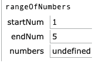

# 用 freeCodeCamp 挑战解释 JavaScript 中的递归

> 原文：<https://www.freecodecamp.org/news/learn-recursion-in-javascript-by-example/>

在这篇文章中，我将谈到几个重要的概念来帮助你理解 JavaScript 中的递归。这里我不打算给出完整的定义，但是你可以看看维基百科[有什么说](https://en.wikipedia.org/wiki/Recursion_%28computer_science%29)的。

为了本文的目的，让我们同意，我们正试图通过使用一个函数来解决一个问题，这个函数将调用它自己。

## 挑战

在 freeCodeCamp 的 Javascript 算法和数据结构—基础 Javascript 部分[的最后，你会遇到一个有趣的问题:“使用递归创建一个数字范围”，其中的说明如下:](https://www.freecodecamp.org/learn/)

> 我们定义了一个名为 rangeOfNumbers 的函数，它有两个参数。该函数应该返回一个整数数组，该数组以 startNum 参数表示的数字开始，以 endNum 参数表示的数字结束。起始数字将始终小于或等于结束数字。您的函数必须通过调用自身来使用递归，而不能使用任何类型的循环。对于 startNum 和 endNum 相同的情况，它也应该有效。

听起来很简单——如果你要运行 rangeOfNumbers(1，5)，它应该返回[1，2，3，4，5]。

如果你和我一样，基于本节前面的例子，你可以凭直觉找到答案。但这一切是如何运作的可能还是有点不清楚。

**剧透提示:**你马上就能在下面找到答案。但是这不算是一个剧透，因为答案很容易在网上找到。

## 我的解决方案

很有可能你可以通读代码，并且理解当它到达它的**基本情况**时，它将返回任何 startNum 到数组中。然后，它会继续将其他值推送到该数组中，直到完成所有的递归调用。

```
function rangeOfNumbers(startNum, endNum) {
    if (startNum === endNum) {
        return [startNum];
    } else {       
        const numbers = rangeOfNumbers(startNum, endNum - 1);
        numbers.push(endNum);
        return numbers;
    }
}
```

我发现棘手的是准确理解**调用栈如何工作以及我的值如何被返回。**

所以让我们来分解这个函数将如何返回它的最终值。

### 调用堆栈

首先要理解的是**调用栈**是如何工作的。我会让你参考 Mozilla 开发者网络的[解释](https://developer.mozilla.org/en-US/docs/Glossary/Call_stack):

> 当脚本调用一个函数时，解释器将它添加到调用堆栈中，然后开始执行该函数。任何被该函数调用的函数都被添加到调用栈中，并在调用到达的地方运行。
> 
> 当当前函数结束时，解释器将它从堆栈中取出，并从上次代码清单中停止的地方继续执行。

根据这个解释，让我们使用 *rangeOfNumbers(1，5)运行上面的代码。*

首先，创建 rangeOfNumbers 执行上下文，并使用以下值执行:



Screenshot from [http://www.pythontutor.com/javascript.html](http://www.pythontutor.com/javascript.html)

因此，我们在堆栈中添加了一个未解析的 *rangeOfNumbers(1，5)* 函数调用。然后我们继续为 *rangeOfNumbers(1，4)* 等等创建执行，将这些调用中的每一个添加到我们的堆栈中，直到我们最终**解析**一个函数调用。然后解释器将从堆栈中取出该函数，并继续下一个函数。

### 检查我们的调用堆栈

因此，我们的堆栈最终会是这样的:

```
rangeOfNumbers(1,1)
rangeOfNumbers(1,2)
rangeOfNumbers(1,3)
rangeOfNumbers(1,4)
rangeOfNumbers(1,5)
```

*rangeOfNumbers(1，1)* 将是我们堆栈中的最后一个，因为最后，这个调用将**返回**一个值，允许我们移动到堆栈中的下一个函数。

*rangeOfNumbers(1，1)* 返回值是[1]，因为这是我们的基本情况，所以我们假设它是[1]。现在我们从堆栈中弹出 *rangeOfNumbers(1，1)* ，并回到 *rangeOfNumbers(1，2)* 停止的地方…

```
var numbers = rangeOfNumbers(1,2) // returns an array of [1]
```

Numbers 不再是*未定义的*，下一步是将为 2 的 *endNum* 推入 numbers 数组。这给了我们数字[1，2]，现在我们返回值。

```
numbers.push(endNum) //numbers now holds an array of [1,2]
return numbers; // ends our function and returns [1,2]
```

### 分解棘手的部分

因此，我们弹出返回值为[1，2]的 rangeOfNumbers(1，2) 。让我们继续堆栈中的下一个调用 *rangeOfNumbers(1，3)。* Numbers 当前为[1，2]，因为这是 *rangeOfNumbers(1，2)的返回值。*这是我们在调用 *rangeOfNumbers(1，3)* 时插入的内容，因为 3 再减去 1，即 *rangeOfNumbers(1，2)* ，正如我们所说，它返回[1，2]。

明白了吗？太好了！如果你没有理解，重读这一段，因为这是最难理解的部分。

如果你跟上进度了，我们继续。如果点击了上面的部分，剩下的应该会很容易。

回到 *rangeOfNumbers(1，3)*:numbers 数组当前为【1，2】，所以我们推 *endNum* 为 3。现在我们有[1，2，3]，我们再次返回这个值。我们从返回值为[1，2，3]的堆栈中删除了*rangeOfNumbers(1，3)* 。

我们如何得到 rangeOfNumbers(1，3)？没错，从我们调用 *rangeOfNumbers(1，4)* 和 endnumber-1 的时候，也就是→ 3，我们知道 *rangeOfNumbers(1，3)* 给我们的返回值是[1，2，3]，这正是我们在数组中的。

现在，我们将 *endNum(也称为 4)* 推送到 numbers 数组上，得到[1，2，3，4]并返回这个值。让我们再次从堆栈中删除这个函数调用，因为它给出了我们想要的东西。

### 将这一切结合在一起

现在，对于开始这一切的调用: *rangeOfNumbers(1，5)* 。我们要做的第一步是确定数字的价值。当放入 *rangeOfNumbers(1，4)* 时，我们得到，如我们之前所说的，[1，2，3，4]。因此，我们现在可以将我们的 *endNum* 5 推入数组，并获取我们将返回的[1，2，3，4，5]，并且我们的堆栈现在在我们最后一次调用时是空的。

让我们快速回顾一下哪个返回了什么值，以什么顺序返回。

```
rangeOfNumbers(1,1) → returns [1]
rangeOfNumbers(1,2) → returns [1,2]
rangeOfNumbers(1,3) → returns [1,2,3]
rangeOfNumbers(1,4) → returns [1,2,3,4]
rangeOfNumbers(1,5) → returns [1,2,3,4,5]
```

如果这仍然令人困惑，首先我理解——这是一个令人困惑的话题。接下来我会推荐在这个伟大的工具中输入你的代码:[http://www.pythontutor.com/javascript.html](http://www.pythontutor.com/javascript.html)

这一切之所以能够成功，是因为我们从一个小的基础案例开始，我们基本上建立了自己的备份方式。每次我们的返回值都比上一次调用时大一点，就像用 for 循环执行同样的操作一样。

有什么问题吗？随时在推特上问我: [@NehemiahK](https://twitter.com/NehemiahKiv) 四