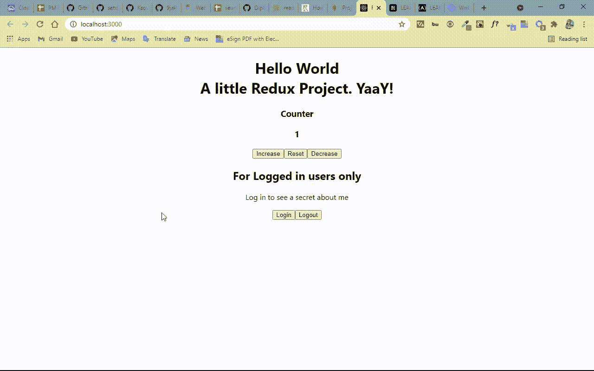

# 通过制作一个计数器应用程序来学习 Redux

> 原文：<https://www.freecodecamp.org/news/learn-redux-by-making-a-counter-application/>

Redux 是一个用于前端应用程序的状态管理库。开发人员通常通过 react-redux 包将它与 React 一起使用，但它也可以独立使用——因此您可以在任何前端框架或库中使用它，包括普通的 JavaScript。

Redux 一开始真的很吓人。你可能需要一段时间来适应它，你可能最终会检查你以前的项目，以找出如何把事情做好。

Redux 也经常受到批评，因为它有太多的样板文件来管理应用程序状态。这是真的——在小型应用程序中使用 Redux 就像用大炮射一只蚂蚁。你可以在 React 中使用漫游，例如，像 prop drilling 和 context，而 Vue JS 有 VueX，Angular 有 NGRX。

在 React 应用程序中，Redux 解决的主要问题是，不是通过传递 props(这是单向的)来管理应用程序的状态，而是将整个状态保存在一个全球化的存储中。这使您能够将它带到任何需要的地方。所以还挺多维的！

在本文中，我将教你如何在 React 应用程序中使用 Redux 创建一个计数器应用程序，这样你就有足够的基础知识开始在你的项目中使用 Redux。

## 如何设置项目

首先，您需要通过运行命令`npm i redux react-redux`从 NPM 安装 redux 和 react-redux 包。Redux 是独立的，react-redux 让我们可以使用几个钩子，让生活变得更简单。

## 如何创建文件夹和文件

接下来，我们需要创建 actions 和 reducers。顾名思义，动作是决定要做什么的对象。另一方面，Reducers 检查执行了哪个动作，并根据动作更新状态。它包含了状态和动作。

我喜欢在 actions 和 reducers 文件夹中创建它们，然后为了清晰起见，我把它们放在一个我命名为`Redux`的文件夹中。

在 reducers 文件夹中，我创建了一个名为`counterReducer.js`的文件。很多人通常使用 switch 语句创建 reducer，但是也可以使用 if 语句。在本例中，我将使用 switch。

因此，在计数器缩减器中，我将放入以下代码片段:

```
const counterReducer = (state = 1, action) => {
  switch (action.type) {
    case "INCREMENT":
      return state + 1;
    case "DECREMENT":
      return state - 1;
    case "RESET":
      return (state = 0);
    default:
      return state;
  }
};
export default counterReducer; 
```

这里我将状态硬编码为 1。愿意的话可以从 0 开始。

在 switch 语句中，我有这样一个例子:`INCREMENT`将计数器加 1，`DECREMENT`将计数器减 1，`RESET`将计数器重置为 0。

习惯上使用大写形式的 type，但是你不一定要这样做——使用你喜欢的任何一种形式。但是您确实需要导出计数器缩减器，以便在另一个文件中使用它。

## 如何向项目添加虚拟身份验证

我将进一步向 counter 应用程序添加一个虚拟身份验证。在那里，我会给你看一个关于我的秘密。因此，除了`counterReducer`之外，我还将创建一个`authReducer`，我将在其中粘贴以下代码:

```
const authReducer = (state = false, action) => {
  switch (action.type) {
    case "LOG_IN":
      return true;
    case "LOG_OUT":
      return false;
    default:
      return state;
  }
};
export default authReducer; 
```

在`authReducer`中，状态被初始化为假。`LOG_IN`将把它设置回真，`LOG_OUT`把它返回到假以完成切换动作。

## 如何使用`combineReducer`助手功能

由于我们有不止一个缩减器，我们需要从 Redux 导入`combineReducer`辅助函数。这个函数将我们的 reducer 转换成一个单独的 reducer，我们可以将它传递给`createStore` API。暂时不要担心什么是`createStor`e API——我将很快解释它。

所以我们像这样传入 reducer:
`combineReducer({reducer-a, reducer-b, reducer-c})`

在 reducer 文件夹中，我们必须创建另一个名为`index`的文件，这样我们就可以导入`combineReducer`辅助函数，与 reducer 放在一起，并将它们组合在一起。

在索引文件中，我有以下代码:

```
import counter from "./counter";
import auth from "./auth";
import { combineReducers } from "redux";

const allReducers = combineReducers({
  counter,
  auth,
});
export default allReducers; 
```

## 如何创建全球商店

接下来要做的是创建一个商店。我喜欢在 React 的`index`文件中创建它。

为此，你需要像这样从 Redux 导入`createStore`API:`import { createStore } from "redux";`。

我们还必须引入已经合并的 reducers，然后在它们的实例中创建存储。

为了让我们的计数器应用程序功能变得生动，我们必须将我们使用 Redux 所做的一切连接到该应用程序。

首先，我们需要从 react-redux 导入`Provider`,并在我们的索引文件中将它包裹在整个应用程序周围。提供者将全局状态连接到应用程序。`Provider`接受一个名为 store 的参数，在这个参数中我们必须传递创建的 store。

在索引文件中，我现在有以下代码片段:

```
import React from "react";
import ReactDOM from "react-dom";
import "./index.css";
import App from "./App";
import { createStore } from "redux";
import allReducers from "./redux/reducers";
import { Provider } from "react-redux";

//The created store
const store = createStore(
  allReducers,
);
ReactDOM.render(
  <React.StrictMode>
    <Provider store={store}>
      <App />
    </Provider>
  </React.StrictMode>,
  document.getElementById("root")
); 
```

## 如何提取减速器并设置动作

下一步是通过从`react-redux`导入`useSelector`来提取`counterReducer`，这样我们就可以访问其中的整个状态。

为了看到我说过的我将向你展示的关于我的秘密，我们也必须提取`authReducer`。我将在 app.js 文件中这样做:

```
import { useSelector } from "react-redux"; 
```

要开始递增和递减，以及登录和注销，我们必须回到 actions 文件夹，在应用程序中设置要调度的操作，并导出它们。调度是帮助我们实现行动的功能。

所以在 actions 文件夹的索引文件中，我有下面的代码:

```
export const increment = () => {
  return {
    type: "INCREMENT",
  };
};

export const decrement = () => {
  return {
    type: "DECREMENT",
  };
};

export const reset = () => {
  return {
    type: "RESET",
  };
};

export const logIn = () => {
  return {
    type: "LOG_IN",
  };
};

export const logOut = () => {
  return {
    type: "LOG_OUT",
  };
}; 
```

## 如何导入和分派操作

记得我在减速器文件中设置了`INCREMENT`、`DECREMENT`、`RESET`、`LOG_IN`和`LOG_OUT`动作。我们需要让他们以同样的方式行动起来。对象标识符可以是任何情况。

这意味着我们必须导入我们设置的动作，以及 react-redux 中的`useDispatch`钩子，这样我们就可以调度我们想要的任何动作。

```
import { useDispatch } from "react-redux"; 
```

既然我们现在可以使用`useDispatch`钩子和其他任何东西，我们必须设置递增、递减、重置和登录/注销按钮。

就在我们的按钮内部，我们需要设置一个点击事件处理程序来发送。ap.js 文件中的全部代码现在如下所示:

```
import "./App.css";
import { useSelector, useDispatch } from "react-redux";
import {
  decrement,
  increment,
  reset,
  logIn,
  logOut,
} from "./redux/actions/index";

function App() {
  const counter = useSelector((state) => state.counter);
  const auth = useSelector((state) => state.auth);
  const dispatch = useDispatch();

  return (
    <div className="App">
      <h1>
         Hello World <br /> A little Redux Project. YaaY!
      </h1>
      <h3>Counter</h3>
      <h3>{counter}</h3>
      <button onClick={() => dispatch(increment())}>Increase</button>
      <button onClick={() => dispatch(reset())}>Reset</button>
      <button onClick={() => dispatch(decrement())}>Decrease</button>

      <h2>For Logged in users only</h2>
      <p>Log in to see a secret about me</p>
      <button onClick={() => dispatch(logIn())}>Login</button>
      <button onClick={() => dispatch(logOut())}>Logout</button>
      {auth ? (
        <div>
          <p>
            I don't more than 50% of redux. But if you know 50% of it, you're like a Superman.
          </p>
        </div>
      ) : (
        ""
      )}
    </div>
  );
}

export default App; 
```

在这一切结束时，你会得到:


我希望你能发现我的秘密。

## 结论

感谢您阅读本教程。我希望它能让你对 Redux 有一个基本的了解，这样你就可以开始用它自己做一些东西了。

要与我联系，请在 [Twitter](http://twitter.com/koladechris) 上关注我，我大部分时间都在这里参与编码和 web 开发相关的讨论。