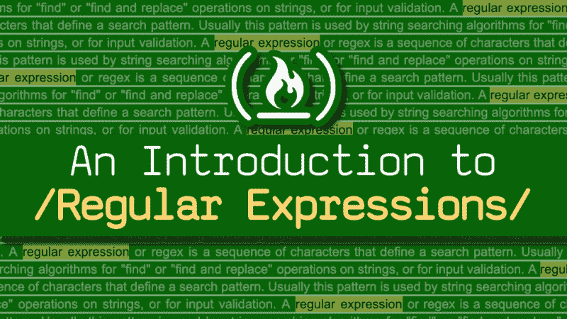
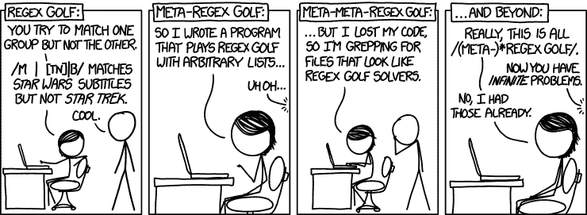

# 通过这个免费课程学习正则表达式

> 原文：<https://www.freecodecamp.org/news/learn-regular-expressions-with-this-free-course-37511963d278/>

作者博·卡恩斯

# 通过这个免费课程学习正则表达式



> “有些人在遇到问题时会想‘我知道，我会使用正则表达式。’现在他们有两个问题。*——杰米·扎温斯基*

对于一些人来说，使用正则表达式可能是一个问题。但这对你来说不一定是个问题。本文是关于正则表达式的完整课程。

### 1.介绍

几乎所有编程语言都使用正则表达式来定义搜索模式，该模式可用于搜索字符串中的内容。

我开发了一个关于 Scrimba.com 的免费完整视频课程来教授正则表达式的基础知识。

这篇文章以书面形式包含了课程。但是，如果你更喜欢观看带有互动课程的视频版本，你可以在 [Scrimba](https://scrimba.com/g/gregularexpressions) 上查看。本文中的部分对应于 Scimba 课程中的部分。

这门课程跟随着 freeCodeCamp.org 大学的 RegEx 课程。你可以去那里看看编码挑战并获得证书。

这些课程着重于在 JavaScript 中使用 RegEx，但是这些原则也适用于您可能选择使用的许多其他编程语言。如果你还不知道基本的 JavaScript，先了解一点会有所帮助。我还有一门基础的 JavaScript 课程，你可以在 Scrimba 和 freeCodeCamp.org 的 YouTube 频道上学习。

所以让我们开始吧！你马上就能扭转乾坤。？


From [https://xkcd.com/208/](https://xkcd.com/208/)

### 2.使用测试方法

为了使用正则表达式匹配部分字符串，我们需要创建模式来帮助您完成匹配。我们可以通过将模式放在斜线`/`之间来表示某个东西是正则表达式模式，就像这样`/pattern-we-want-to-match/`。

让我们看一个例子:

```
// We want to check the following sentencelet sentence = "The dog chased the cat."
```

```
// and this is the pattern we want to match.let regex = /the/
```

注意我们是如何使用`/the/`来表示我们正在`sentence`中寻找“那个”。

我们可以使用 RegEx `test()`方法来判断一个模式是否出现在一个字符串中。

```
// String we want to testlet myString = "Hello, World!";
```

```
// Pattern we want to findlet myRegex = /Hello/;
```

```
// result is now truelet result = myRegex.test(myString);
```

### 3.匹配文字字符串

我们现在去找沃尔多。

```
let waldoIsHiding = "Somewhere Waldo is hiding in this text.";let waldoRegex = /Waldo/;
```

```
// test() returns true, so result is now also truelet result = waldoRegex.test(waldoIsHiding);
```

注意，在这个例子中,`waldoRegex`是区分大小写的，所以如果我们用小写字母“w”来写`/waldo/`,那么我们的`result`将是 false。

### 4.用不同的可能性匹配一个字符串

RegEx 还有一个操作符`OR`，它是一个`|`字符。

```
let petString = "James has a pet cat.";
```

```
// We can now try to find if either of the words are in the sentencelet petRegex = /dog|cat|bird|fish/;
```

```
let result = petRegex.test(petString);
```

### 5.匹配时忽略大小写

到目前为止，我们已经看了字母大小写重要时的模式。我们如何使正则表达式模式不区分大小写？

要忽略大小写，我们可以在模式的末尾添加`i`标志，就像这样`/some-pattern/i`。

```
let myString = "freeCodeCamp";
```

```
// We ignore case by using 'i' flaglet fccRegex = /freecodecamp/i;
```

```
// result is truelet result = fccRegex.test(myString);
```

### 6.提取匹配项

当我们想要提取匹配值时，我们可以使用`match()`方法。

```
let extractStr = "Extract the word 'coding' from this string.";
```

```
let codingRegex = /coding/;
```

```
let result = extractStr.match(codingRegex);
```

```
console.log(result);
```

```
// Terminal will show: // > ["coding"]
```

### 7.查找比第一个匹配更多的内容

现在，当我们知道如何提取一个值时，也可以使用`g`标志提取多个值

```
let testStr = "Repeat, Repeat, Repeat";
```

```
let ourRegex = /Repeat/g;
```

```
testStr.match(ourRegex); // returns ["Repeat", "Repeat", "Repeat"]
```

我们还可以将`g`标志与`i`标志结合起来，提取多个匹配并忽略大小写。

```
let twinkleStar = "Twinkle, twinkle, little star";
```

```
let starRegex = /twinkle/ig;// writing /twinkle/gi would have the same result.
```

```
let result = twinkleStar.match(starRegex);
```

```
console.log(result);
```

```
// Terminal will show: // &gt; ["Twinkle", "twinkle"]
```

### 8.匹配任何带有通配符句点的内容

RegEx 中的`.`是可以匹配任何内容的通配符。

```
let humStr = "I'll hum a song";
```

```
let hugStr = "Bear hug";
```

```
// Looks for anything with 3 characters beginning with 'hu'let huRegex = /hu./;
```

```
humStr.match(huRegex); // Returns ["hum"]
```

```
hugStr.match(huRegex); // Returns ["hug"]
```

### 9.用多种可能性匹配单个字符

匹配任何字符都很好，但是如果我们想将匹配限制在一组预定义的字符上呢？我们可以在正则表达式中使用`[]`。

如果我们有`/b[aiu]g/`，说明我们可以匹配‘包’、‘大’、‘虫’。

如果我们想从一个句子中提取所有的元音，这就是我们使用 RegEx 的方法。

```
let quoteSample = "Beware of bugs in the above code; I have only proved it correct, not tried it.";
```

```
let vowelRegex = /[aeiou]/ig;
```

```
let result = quoteSample.match(vowelRegex);
```

### 10.匹配字母表中的字母

但是如果我们想要匹配一系列字母呢？当然，我们去吧。

```
let quoteSample = "The quick brown fox jumps over the lazy dog.";
```

```
// We can match all the letters from 'a' to 'z', ignoring casing. let alphabetRegex = /[a-z]/ig;
```

```
let result = quoteSample.match(alphabetRegex);
```

### 11.匹配字母表中的数字和字母

字母是好的，但是如果我们也想要数字呢？

```
let quoteSample = "Blueberry 3.141592653s are delicious.";
```

```
// match numbers between 2 and 6 (both inclusive), // and letters between 'h' and 's'. let myRegex = /[2-6h-s]/ig;
```

```
let result = quoteSample.match(myRegex);
```

### 12.未指定匹配单个字符

有时候指定不想看的角色更容易。这些被称为“被否定的字符”，在 RegEx 中你可以通过使用`^`来实现。

```
let quoteSample = "3 blind mice.";
```

```
// Match everything that is not a number or a vowel. let myRegex = /[^0-9aeiou]/ig;
```

```
let result = quoteSample.match(myRegex);// Returns [" ", "b", "l", "n", "d", " ", "m", "c", "."]
```

### 13.匹配出现一次或多次的字符

如果想匹配一个出现一次或多次的字符，可以使用`+`。

```
let difficultSpelling = "Mississippi";
```

```
let myRegex = /s+/g;
```

```
let result = difficultSpelling.match(myRegex);// Returns ["ss", "ss"]
```

### 14.匹配出现零次或多次的字符

还有一个`*` RegEx 量词。这个匹配一个字符的 0 次出现。为什么这可能有用？大多数情况下，它通常与其他字符结合在一起。让我们看一个例子。

```
let soccerWord = "gooooooooal!";
```

```
let gPhrase = "gut feeling";
```

```
let oPhrase = "over the moon";
```

```
// We are trying to match 'g', 'go', 'goo', 'gooo' and so on. let goRegex = /go*/;
```

```
soccerWord.match(goRegex); // Returns ["goooooooo"]
```

```
gPhrase.match(goRegex); // Returns ["g"]
```

```
oPhrase.match(goRegex); // Returns null
```

### 15.用惰性匹配查找字符

有时你的模式匹配可以有不止一个结果。例如，假设我在一个单词`titanic`中寻找一个模式，我的匹配值必须以“t”开头，以“I”结尾。我的可能结果是‘titani’和‘ti’。

这就是为什么正则表达式有“贪婪匹配”和“懒惰匹配”的概念。

贪婪匹配查找符合正则表达式模式的字符串的最长可能匹配**，这是默认的正则表达式匹配:**

```
**`let string = "titanic";`**
```

```
**`let regex = /t[a-z]*i/;`**
```

```
**`string.match(regex);// Returns ["titani"]`**
```

**惰性匹配查找符合正则表达式模式的字符串的**的最短可能匹配，为了使用它，我们需要使用`?`:****

```
***`let string = "titanic";`***
```

```
***`let regex = /t[a-z]*?i/;`***
```

```
***`string.match(regex);// Returns ["ti"]`***
```

### ***16.在狩猎中找到一个或多个罪犯***

***现在让我们来看一个正则表达式挑战。我们需要在人群中找到所有的罪犯。我们知道它们总是在一起，你需要写一个正则表达式来找到它们。***

```
***`let crowd = 'P1P2P3P4P5P6CCCP7P8P9';`***
```

```
***`let reCriminals = /./; // Change this line`***
```

```
***`let matchedCriminals = crowd.match(reCriminals);`***
```

***你可以发现我在这个 Scrimba cast 中浏览[解决方案。](https://scrimba.com/p/peyvVAN/c3nEpta)***

### ***17.匹配开始字符串模式***

***RegEx 还允许您匹配仅位于字符串开头的模式。我们已经讨论过`^`创建一个否定集合。我们可以使用相同的符号来查找一个匹配的字符串开头的*和*。***

```
**`let calAndRicky = "Cal and Ricky both like racing.";`**
```

```
**`// Match 'Cal' only if it's at the beginning of a string. let calRegex = /^Cal/;`**
```

```
**`let result = calRegex.test(calAndRicky); // Returns true`**
```

```
**`let rickyAndCal = "Ricky and Cal both like racing.";`**
```

```
**`let result = calRegex.test(rickyAndCal); // Returns false`**
```

### **18.匹配结束字符串模式**

**匹配字符串末尾的模式怎么样？我们可以用`$`来做这件事。**

```
**`let caboose = "The last car on a train is the caboose";`**
```

```
**`// Match 'caboose' if it's at the end of a string.let lastRegex = /caboose$/;`**
```

```
**`let result = lastRegex.test(caboose); // Returns true`**
```

### **19.匹配所有字母和数字**

**在第 10 部分和第 11 部分的前面，我向您展示了如何匹配字母和数字的范围。如果我让你写一个匹配所有字母和数字的正则表达式，并忽略它们的大小写，你可能会写类似于`/[a-z0-9]/gi`的东西，这是完全正确的。但是有点太长了。**

**RegEx 有一个叫做*‘速记字符类’*的东西，它基本上是普通 RegEx 表达式的速记。为了匹配所有的字母和数字，我们可以使用`\w`,我们还得到下划线`_`匹配作为奖励。**

```
**`let quoteSample = "The five boxing wizards jump quickly.";`**
```

```
**`// Same as /[a-z0-9_]/gi to match a-z (ignore case), 0-9 and _let alphabetRegexV2 = /\w/g;`**
```

```
**`// The length of all the characters in a string// excluding spaces and the period. let result = quoteSample.match(alphabetRegexV2).length;`**
```

```
**`// Returns 31`**
```

### **20.匹配除字母和数字以外的所有内容**

**如果我们想做相反的事情，匹配所有不是字母或数字的东西(也排除下划线`_`)，我们可以使用`\W`**

```
**`let quoteSample = "The five boxing wizards jump quickly.";`**
```

```
**`// Match spaces and the periodlet nonAlphabetRegex = /\W/g;`**
```

```
**`let result = quoteSample.match(nonAlphabetRegex).length;`**
```

```
**`// Returns 6`**
```

### **21.匹配所有数字**

**好吧，如果你只想要数字呢？有没有这方面的速记字符类？当然，是`\d`。**

```
**`let numString = "Your sandwich will be $5.00";`**
```

```
**`// Match all the numberslet numRegex = /\d/g;`**
```

```
**`let result = numString.match(numRegex).length; // Returns 3`**
```

### **22.匹配所有非数字**

**你愿意反过来匹配所有的非数字吗？使用`\D`**

```
**`let numString = "Your sandwich will be $5.00";`**
```

```
**`// Match everything that is not a numberlet noNumRegex = /\D/g;`**
```

```
**`let result = numString.match(noNumRegex).length; // Returns 24`**
```

### **23.限制可能的用户名**

**到目前为止一切顺利！干得好，走了这么远。正则表达式可能很棘手，因为它不是最易读的编码方式。现在让我们看一个非常真实的例子，并制作一个用户名验证器。在这种情况下，您有 3 个要求:**

*   **如果有数字，一定是在最后。**
*   **字母可以小写，也可以大写。**
*   **至少两个字符长。两个字母的名字不能有数字。**

**试着自己解决这个问题，如果你觉得很难或者只是想检查一下答案，看看我的解决方案。**

### **24.匹配空白**

**我们能匹配所有的空白吗？当然，我们也可以用简写来表示，它就是`\s`**

```
**`let sample = "Whitespace is important in separating words";`**
```

```
**`// Match all the whitespaceslet countWhiteSpace = /\s/g;`**
```

```
**`let result = sample.match(countWhiteSpace);`**
```

```
**`// Returns [" ", " ", " ", " ", " "]`**
```

### **25.匹配非空白字符**

**你能猜出如何匹配所有非空白字符吗？干得好，是`\S`！**

```
**`let sample = "Whitespace is important in separating words";`**
```

```
**`// Match all non-whitespace characterslet countWhiteSpace = /\S/g;`**
```

```
**`let result = sample.match(countWhiteSpace);`**
```

### **26.指定匹配的上限和下限**

**您可以使用*‘数量说明符’指定模式匹配的上限和下限。*可以和`{}`语法一起使用，比如`{3,6}`，其中`3`是要匹配的下界，`6`是要匹配的上界。**

```
**`let ohStr = "Ohhh no";`**
```

```
**`// We want to match 'Oh's that have 3-6 'h' characters in it. let ohRegex = /Oh{3,6} no/;`**
```

```
**`let result = ohRegex.test(ohStr); // Returns true`**
```

### **27.仅指定较低的匹配数**

**当我们只想指定下限时，我们可以省略上限，例如，为了匹配至少三个字符，我们可以写`{3,}`。注意，我们仍然需要一个逗号，即使我们没有指定上限。**

```
**`let haStr = "Hazzzzah";`**
```

```
**`// Match a pattern that contains at least for 'z' characterslet haRegex = /z{4,}/;`**
```

```
**`let result = haRegex.test(haStr); // Returns true`**
```

### **28.指定准确的匹配数量**

**在上一节中，我提到当我们仅指定下限时，我们需要在`{3,}`中使用逗号。原因是当你写`{3}`时不带逗号，这意味着你要精确匹配 3 个字符。**

```
**`let timStr = "Timmmmber";`**
```

```
**`// let timRegex = /Tim{4}ber/;`**
```

```
**`let result = timRegex.test(timStr); // Returns true`**
```

### **29.选择全部或全部不选**

**有时候，您可能希望在您的模式中指定一个字符的可能存在。当一个字母或一个数字是可选的，我们会用`?`来表示。**

```
**`// We want to match both British and American English spellings // of the word 'favourite'`**
```

```
**`let favWord_US = "favorite";let favWord_GB = "favourite";`**
```

```
**`// We match both 'favorite' and 'favourite' // by specifying that 'u' character is optionallet favRegex = /favou?rite/; // Change this line`**
```

```
**`let result1 = favRegex.test(favWord_US); // Returns truelet result2 = favRegex.test(favWord_GB); // Returns true`**
```

### **30.正面和负面前瞻**

***Lookaheads* 是告诉你的 JS 向前看，以进一步检查模式的模式。当您试图在相同的字符串中搜索多个模式时，它们非常有用。有两种类型的前瞻——积极的和消极的。**

**正向前瞻使用`?=`语法**

```
**`let quit = "qu";`**
```

```
**`// We match 'q' only if it has 'u' after it. let quRegex= /q(?=u)/;`**
```

```
**`quit.match(quRegex); // Returns ["q"]`**
```

**否定前瞻使用`?!`语法**

```
**`let noquit = "qt";`**
```

```
**`// We match 'q' only if there is no 'u' after it. let qRegex = /q(?!u)/;`**
```

```
**`noquit.match(qRegex); // Returns ["q"]`**
```

### **31.使用捕获组重用模式**

**假设我们需要捕捉一个重复的模式。**

```
**`let repeatStr = "regex regex";`**
```

```
**`// We want to match letters followed by space and then letterslet repeatRegex = /(\w+)\s(\w+)/;`**
```

```
**`repeatRegex.test(repeatStr); // Returns true`**
```

**我们可以告诉 RegEx 使用`\1`重复模式，而不是在最后重复`(\w+)`。所以同上可以再写成:**

```
**`let repeatStr = "regex regex";`**
```

```
**`let repeatRegex = /(\w+)\s\1)/;`**
```

```
**`repeatRegex.test(repeatStr); // Returns true`**
```

### **32.使用捕获组进行搜索和替换**

**当我们找到一个匹配时，用其他东西替换它有时会很方便。我们可以使用`replace()`方法。**

```
**`let wrongText = "The sky is silver.";`**
```

```
**`let silverRegex = /silver/;`**
```

```
**`wrongText.replace(silverRegex, "blue");`**
```

```
**`// Returns "The sky is blue."`**
```

### **33.删除开头和结尾的空白**

**给你一个小小的挑战。编写一个正则表达式来删除字符串周围的任何空白。**

```
**`let hello = "   Hello, World!  ";`**
```

```
**`let wsRegex = /change/; // Change this line`**
```

```
**`let result = hello; // Change this line`**
```

**如果你卡住了，或者只是想检查我的解决方案，请随意查看我解决这个挑战的 Scrimba 演员表。**

### **34.结论**

**恭喜你！您已经完成了本课程！如果你想继续了解更多，请随意查看这个 YouTube 播放列表，里面有很多你可以创建的 JavaScript 项目。**

**继续学习，感谢阅读！**

**你现在可以开始玩 regex 高尔夫了。？**

**

From [https://xkcd.com/1313/](https://xkcd.com/1313/)**