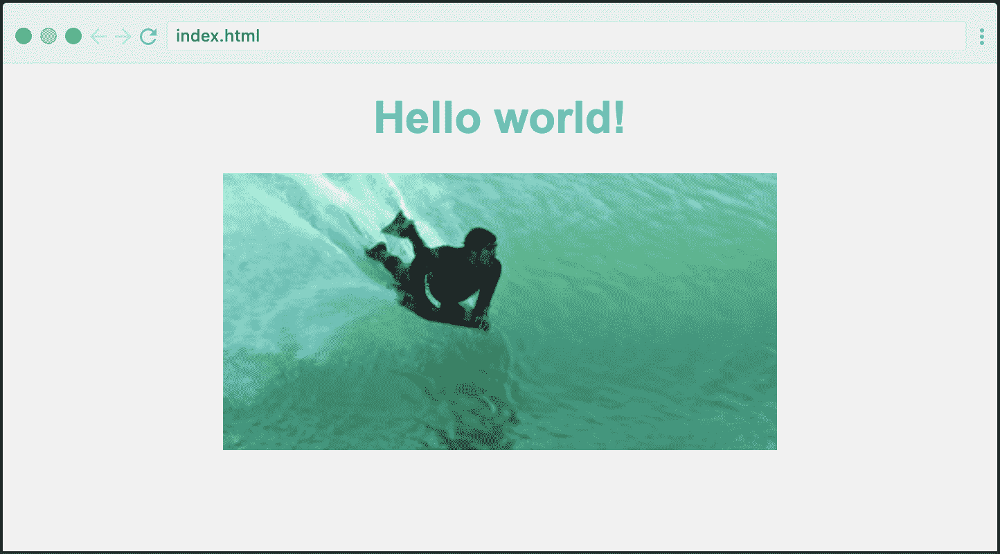
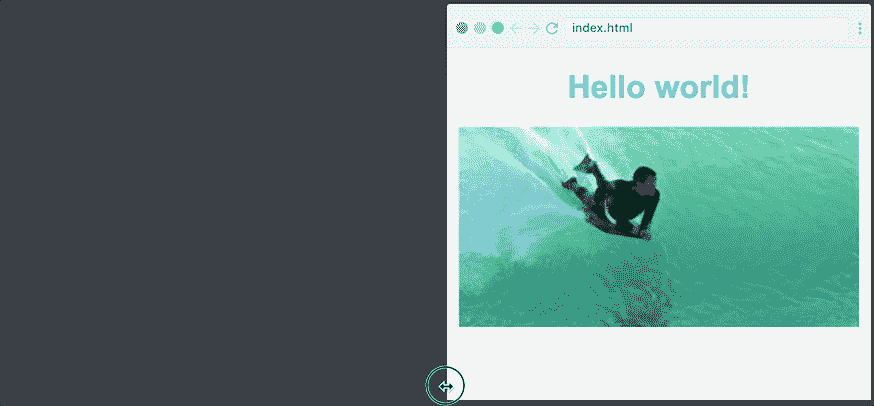
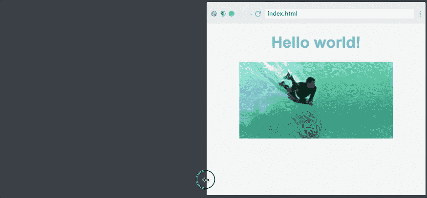
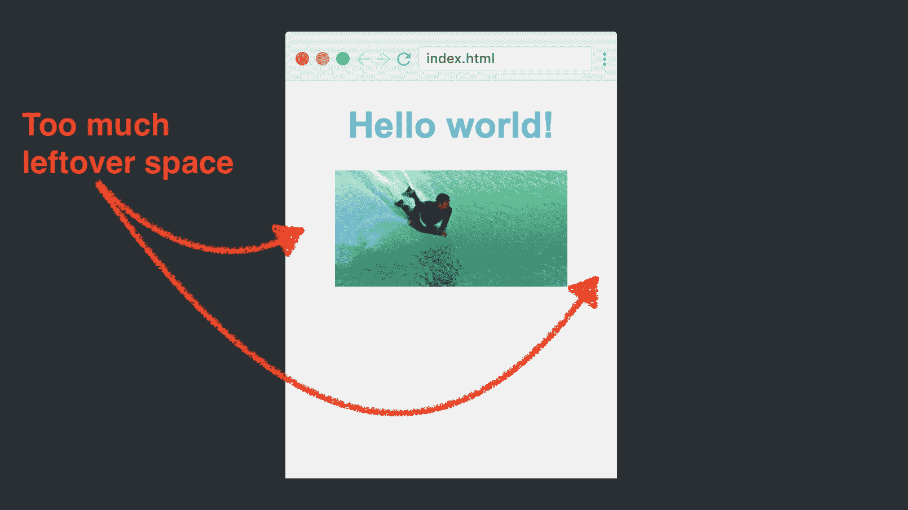
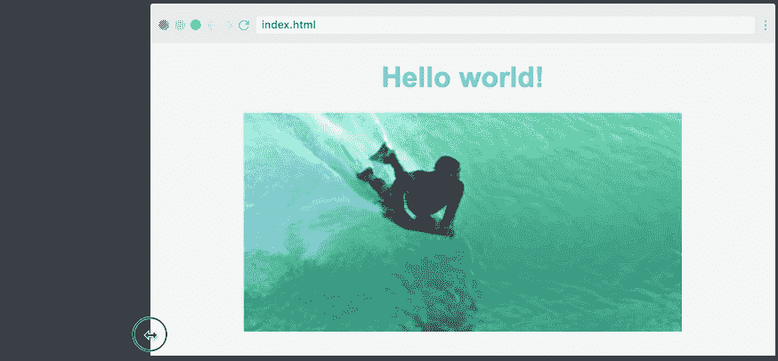
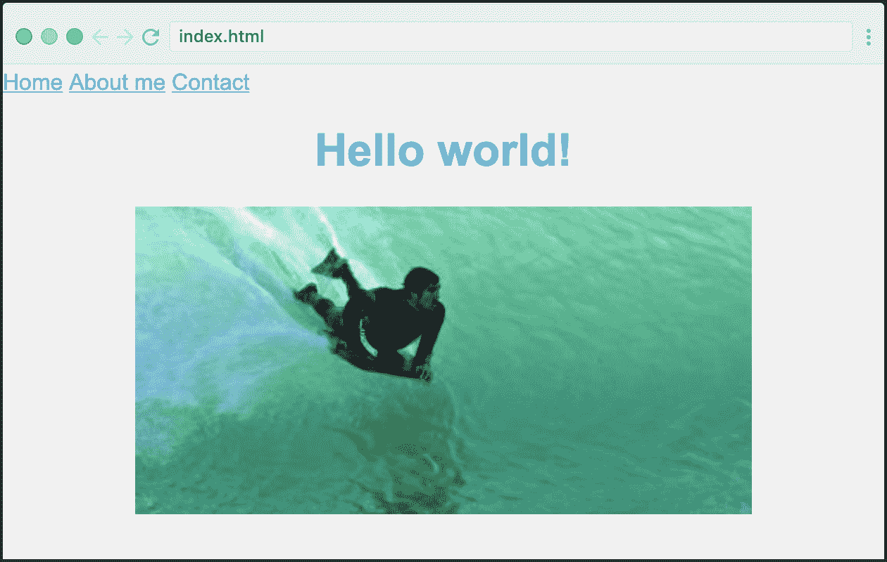
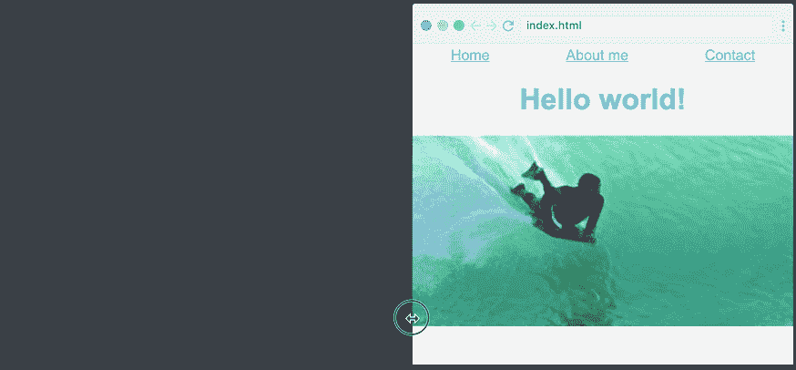
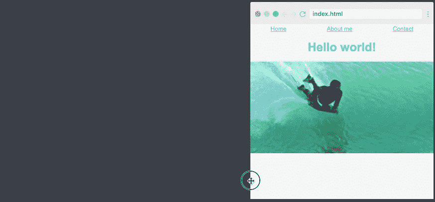

# 响应式设计教程-在 5 分钟内学会响应式网页设计

> 原文：<https://www.freecodecamp.org/news/learn-responsive-web-design-in-5-minutes/>

在这篇文章中，我将在五分钟内尽可能多地教你响应式设计技术。这显然不足以正确地学习它，但它将为您提供最重要概念的概述，我个人将其定义为:

*   相对 CSS 单位
*   媒体查询
*   flex box(flex box)的缩写形式
*   响应式印刷

如果你之后想更深入地研究这个主题，你可以在 Scrimba 上查看我们的[响应式 web 开发者训练营，它将使你能够在专业水平上构建响应式网站。](https://scrimba.com/g/gresponsive?utm_source=freecodecamp.org&utm_medium=referral&utm_campaign=gresponsive_5_minute_article)

但是现在，让我们从最基本的开始！

## 相对 CSS 单位

响应式网页设计的核心是相对的 CSS 单元。这些是从其他外部价值中获取价值的单位。这很方便，因为它允许图像的宽度基于浏览器的宽度。

最常见的有:

*   %
*   全身长的
*   雷姆
*   大众汽车（Volkswagen 的缩写）
*   vh

在本文中，我们将从百分比单位`%`开始，然后在最后一节看一下`rem`单位。

假设你有一个非常简单的网站，就像这样:



它的 HTML 如下所示:

```
<body>
    <h1>Welcome to my website</h1>
    <image src="path/to/img.png" class="myImg">
</body> 
```

正如你从下面的 GIF 中看到的，我们的图像默认有一个固定的宽度:



这不是特别有反应，所以让我们改为百分之七十。我们将简单地执行以下操作:

```
.myImg {
    width: 70%;
} 
```

这将图像的宽度设置为其父标签宽度的 70 %,父标签是`<body>`标签。由于`<body>`标签跨越了屏幕的整个宽度，图像将总是屏幕本身的 70%。

结果如下:



这就是创造一个有反应的形象是多么容易！

## 使用媒体查询改善移动体验

不过，我们的响应式布局有一个问题，那就是它在非常小的屏幕上看起来很奇怪。70%的宽度在手机上看太窄了。自己看看就好:



在这种情况下让它看起来更好是媒体询问的完美任务。它们允许您根据屏幕的宽度应用不同的样式。我们基本上可以说*如果屏幕小于 768 像素宽，使用不同的风格。*

下面是我们如何在 CSS 中创建媒体查询:

```
@media (max-width: 768px) {
    .myImage {
        width: 100%
    }
} 
```

只有当屏幕宽度小于 768 像素时，才会应用这个 CSS 块。

结果如下:



如你所见，页面有一个断点，图像在此处突然变宽。这是当浏览器为 768 像素宽时，图像在`70%`和`100%`之间交换。

## 将 Flexbox 用于导航条

接下来是 Flexbox。不了解 Flexbox，你就无法了解响应能力。几年前推出时，它改变了响应式设计游戏，因为它使沿轴响应性地定位元素变得容易得多。

为了利用 Flexbox，我们将在标题上方添加一个导航条，使我们的网站变得更加复杂。这是它的 HTML:

```
<nav>
    <a href="#">Home</a>
    <a href="#">About me</a>
    <a href="#">Contact</a>
</nav> 
```

默认情况下，它看起来就像这样。



我们的导航项都挤到了左边，这不是我们想要的。我们希望它们在页面上均匀分布。

要实现这一点，我们只需将 nav 容器转换成 flexbox，然后使用神奇的`justify-content`属性。

```
nav {
    display: flex;
    justify-content: space-around;
} 
```

`display: flex`将`<nav>`变成一个柔性框，`justify-content: space-around`告诉浏览器，柔性框中的项目周围应该有空间。因此，浏览器将所有剩余空间平均分配给这三个项目。

这是它的样子。您会注意到，它的伸缩性很好:



​

## 响应式印刷术:rem

最后一步是让我们的排版也有反应。你看，我想在屏幕宽度小于 768 像素的情况下，让导航条和标题缩小一点(我们的媒体查询断点，还记得吗？).

一种方法是减小媒体查询中的所有字体大小，如下所示:

```
@media (max-width: 768px) {
    nav {
        font-size: 14px;
    }
    h1 {
        font-size: 28px;
    }
} 
```

尽管这并不理想。我们可能会在应用程序中有几个断点，也有多个元素(h2、h3、段落等)。因此，我们必须跟踪所有不同断点中的所有元素。会很乱的！

然而，最有可能的是，在各个断点中，它们会以或多或少相同的方式相互关联。例如，`h1`将总是大于`paragraph`。

那么，如果有一种方法，我可以调整一个因素，然后让其余的字体大小相对于该因素缩放呢？

Enter rems!

一个`rem`基本上是这样的:你为你的`<html>`元素设置的字体大小值。喜欢这个:

```
html {
    font-size: 14px;
} 
```

所以在这个文档中，一个`rem`等于 14px。

这意味着我们可以在网站上以`rem`为单位设置所有的字体大小，就像这样:

```
h1 {
    font-size: 2rem;
}

nav {
    font-size: 1rem;
} 
```

然后，我们将简单地更改媒体查询中的`<html>`标签的字体大小值。这将确保我们的`h1`和`nav`元素的字体大小也会改变。

下面是我们如何在媒体查询中更改我们的`rem`值:

```
@media (max-width: 768px) {
    html {
        font-size: 14px
    }
} 
```

就这样，我们也为所有的字体大小设置了一个断点。请注意当页面越过 768 像素标记时，字体大小是如何变化的:



仅仅过了五分钟，但是现在你已经学会了根据页面的宽度来设置字体大小、图片和导航条。这很好，你已经迈出了第一步，学习构建响应性网站的宝贵技能。

如果你有兴趣继续这个学习之旅，我建议你看看我们关于这个主题的[大型 Scrimba 课程！这是由 YouTube 上最受欢迎的老师之一讲授的，它将带你达到反应式网页设计的专业水平。](https://scrimba.com/g/gresponsive?utm_source=freecodecamp.org&utm_medium=referral&utm_campaign=gresponsive_5_minute_article)

快乐编码:)

* * *

感谢阅读！我的名字叫 Per Borgen，我是最简单的学习编码方法——Scrimba 的联合创始人。如果你想学习建立专业水平的现代网站，你应该看看我们的[响应式网页设计训练营](https://scrimba.com/g/gresponsive?utm_source=freecodecamp.org&utm_medium=referral&utm_campaign=gresponsive_5_minute_article)。


[Click here to get to the advanced bootcamp.](https://scrimba.com/g/gresponsive?utm_source=freecodecamp.org&utm_medium=referral&utm_campaign=gresponsive_5_minute_article)