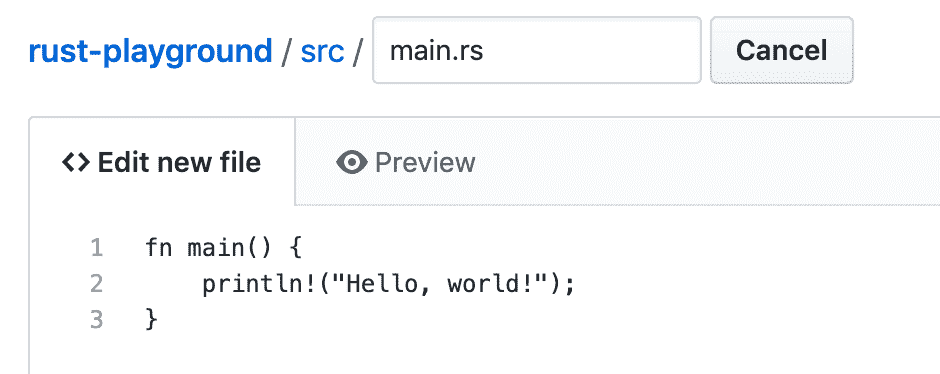
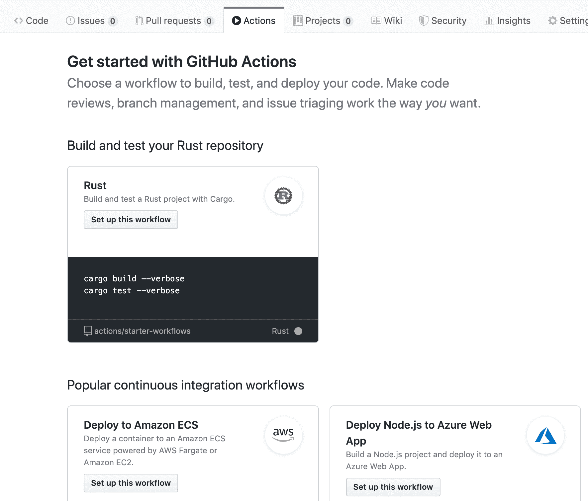
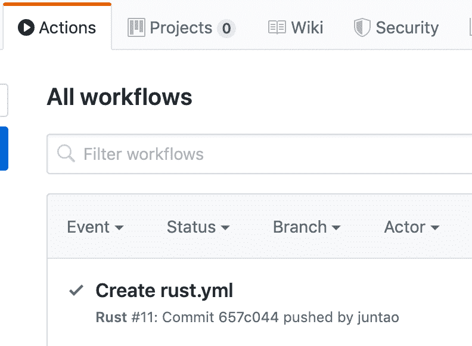
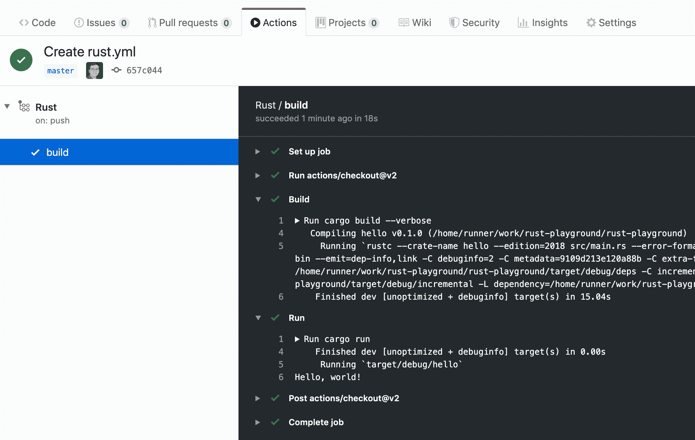
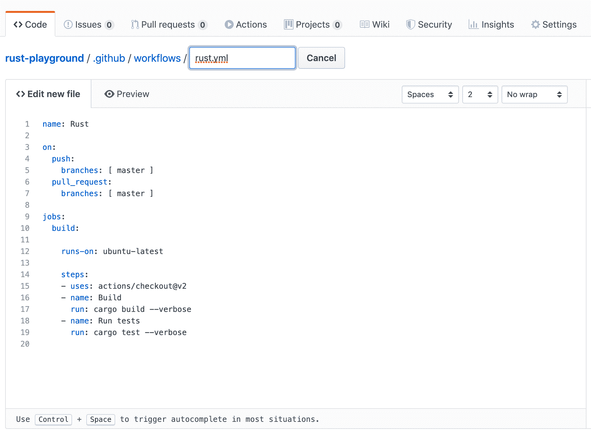
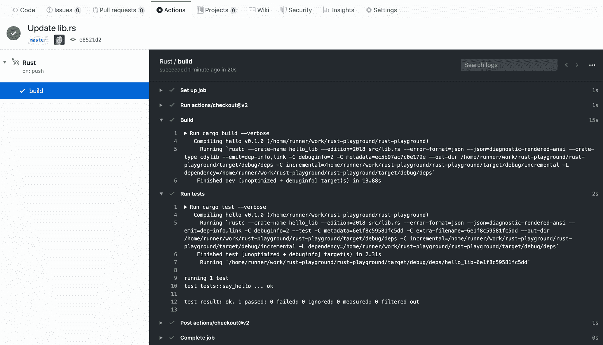

# 不安装任何软件如何学习 Rust

> 原文：<https://www.freecodecamp.org/news/learn-rust-with-github-actions/>

在本文中，我们将学习如何使用 GitHub 动作从您的 web 浏览器中学习 Rust。我们将从一个网页中编码、构建、测试、运行和发布所有内容。不需要软件！[通过 GitHub](https://github.com/second-state/learn-rust-with-github-actions) 或[在 Twitter 上关注我们](https://twitter.com/secondstateinc)学习。

Rust 是当今最热门的编程语言之一。[阿尔法极客](https://martinfowler.com/bliki/AlphaGeek.html)喜欢。它是 Stackoverflow 的[连续四年最受喜爱的编程语言](https://www.theregister.co.uk/2019/04/09/stack_overflow_survey/)。

Rust 最独特和最受欢迎的特性之一是它积极的编译器，可以在程序运行前帮助你确保正确性和安全性。因此，Rust 开发人员可以编写高性能且安全的程序。Rust 消除了各类编程错误，尤其是那些难以调试的运行时错误。

如果你还没试过，那就试试吧！*很神奇。我相信 Rust 可能是下一个 Java 或 Ruby——未来每个人都必须学习的编程语言。*

然而，[学习 Rust](https://www.secondstate.io/articles/a-rusty-hello-world/) 通常需要你在电脑上安装一堆命令行工具。Rust 编译器很慢，因为整个 Rust 范式是为了在编译时深入分析源代码并找到 bug 而设置的，而不是在运行时崩溃。

在线 Rust IDEs，如 [Rust Playground](https://play.rust-lang.org/) 和 [REPL.it](https://repl.it/languages/rust) ，是简单的工具，没有充分利用第三方编译器目标和库的 Rust 生态系统。

所以你可能想知道——我能试着学习 Rust 而不用在我的电脑上安装所有那些软件包吗？

嗯，有了 GitHub actions，你就可以了！您可以直接在 web 浏览器中学习和试验 Rust 代码。我们开始吧！

> GitHub Actions 现在拥有世界一流的 CI/CD，可以轻松实现所有软件工作流程的自动化。直接从 GitHub 构建、测试和部署您的代码。按照您想要的方式进行代码审查、分支管理和问题分类。Hello World 示例的源代码和工作流操作可以在 GitHub 库中找到。

## 你好世界

首先，创建一个新的 GitHub 库，并添加一个 Rust 源文件。我们添加一个`src/main.rs`文件，内容如下。

```
fn main() {
    println!("Hello, world!");
}
```

The src/main.rs file



接下来，返回到 GitHub 存储库的根目录`/`，并添加一个`Cargo.toml`文件。这个文件描述了 Rust cargo 系统应该如何构建和打包我们的项目。

```
[package]
name = "hello"
version = "0.1.0"
authors = ["ubuntu"]
edition = "2018"

[dependencies]
```

The Cargo.toml file at the root directory of the repository

现在我们有了一个完整的 Rust 项目。让我们现在构建并运行它。

## Github 操作

在 GitHub 的 Actions 选项卡上，我们可以添加与这个项目相关的工作流。这些是 Github 在某些事件发生时自动执行的动作，比如代码推送或提交。在我们的例子中，我们希望 GitHub 自动构建并运行我们的`main.rs`，并向我们显示结果。

工作流动作及其事件触发器在`.github/workflows`目录下的`yml`文件中定义。你可以编写自己的`yml`文件，或者从一个现成的模板中挑选。



The Rust workflow template in GitHub Actions

这里我们选择 Rust 模板。GitHub 允许您在将`rust.yml`文件签入存储库之前对其进行编辑。


The default Rust actions template. You can edit it to your own liking.

让我们花一点时间来解释 GitHub 动作是如何工作的。默认的`rust.yml`文件说

*   每当用户将代码推送到这个存储库中或者接受拉取请求时，这个`rust.yml`工作流中的动作就会被触发。
*   该工作流程将创建一个运行最新 Ubuntu 操作系统的虚拟机。在这个 Ubuntu 系统上，它将执行以下步骤。
*   它将从`master`分支检查代码。
*   它将运行`cargo build --verbose`命令来编译和构建 Rust 代码。
*   它将运行`cargo test --verbose`命令来执行测试用例。
*   GitHub Actions 将捕获上述两个命令在 Ubuntu 系统上的所有标准和控制台输出，并显示在 web 上。

可以编辑`rust.yml`中的最后一行来执行`cargo run`，运行编译好的二进制程序。我们更新的`rust.yml`文件如下。

```
name: Rust

on:
  push:
    branches: [ master ]
  pull_request:
    branches: [ master ]

jobs:
  build:

    runs-on: ubuntu-latest

    steps:
    - uses: actions/checkout@v2
    - name: Build
      run: cargo build --verbose
    - name: Run
      run: cargo run
```

We changed the last line of the default Rust template to cargo run

现在，每当您将代码推送到这个存储库时，就会执行`rust.yml`中的动作。您可以在“操作”选项卡下看到结果。



Every push to the GitHub repo will trigger the actions to run

您可以单击一个结果，然后单击左侧的 build 选项卡来查看详细信息。构建和运行部分提供了最相关的细节。Run 部分显示 hello world 打印成功！



The Run action shows Hello World! printed to the console!

接下来可以在`Cargo.toml`中添加第三方依赖，在 main.rs 中构建复杂的 Rust 应用，每次有人推送代码，我们就能看到结果。

## 测试驱动开发(TDD)

当然，很少有开发人员真正运行他们的程序将文本打印到控制台。上面的`cargo run`只是作秀。实际上，大多数开发人员编写函数和这些函数的测试用例。编译和构建之后最频繁的任务是运行测试用例。我们来看看是怎么做的。

创建一个新的 GitHub 资源库，然后在下面添加一个`src/lib.rs`文件。如你所见，它定义了一个 Rust 函数和一些测试用例。它可以作为一个 Rust 库包来构建和发布。

```
pub fn say(s: &str) -> String {
  let r = String::from("hello ");
  return r + s;
}

#[cfg(test)]
mod tests {
  use super::*;

  #[test]
  fn say_hello() {
    let result = say("ssvm");
    assert!(result.contains("hello ssvm"));
  }
}
```

The src/lib.rs file

然后，返回到 GitHub 存储库的根目录`/`,添加下面的`Cargo.toml`文件。

```
[package]
name = "hello"
version = "0.1.0"
authors = ["ubuntu"]
edition = "2018"

[lib]
name = "hello_lib"
path = "src/lib.rs"
crate-type =["cdylib"]

[dependencies]
```

点击“操作”标签，添加默认的 Rust 工作流程。正如您所记得的，默认的 Rust 工作流以`cargo test`结束，这正是我们在这里所需要的。



The default Rust workflow actions are what we need here.

每次新代码被推入这个存储库时，工作流都会运行。您可以单击打开一个成功的构建，并查看构建和测试操作的输出。



Github actions build and test your Rust program

## 下一步是什么

现在您可以试验您的 Rust 代码，让 GitHub 为您构建、测试和运行它，并提供完整的控制台输出，免费且无需离开您的浏览器！

## 资源

*   [学会在 Rust 中编程](https://www.rust-lang.org/learn)
*   [了解更多关于 GitHub 动作的信息](https://github.com/features/actions)
*   当然，在服务器上运行 Rust 程序的最佳方式是在 WebAssembly 虚拟机中运行[。检查开源的](https://www.secondstate.io/articles/rust-and-webassembly/)[第二状态虚拟机](https://www.secondstate.io/)为那！
*   了解 [BUIDL](https://www.secondstate.io/buidl/) 在线 IDE 到[代码，并在公共区块链上部署](http://buidl.secondstate.io/)分散式 web 应用

## 关于作者

Michael Yuan 博士是关于软件工程的 5 本书的作者。他的最新著作[构建区块链应用](https://www.buildingblockchainapps.com/)于 2019 年 12 月由 Addison-Wesley 出版。袁博士是第二状态(Second State)的联合创始人，这是一家由风投资助的初创公司，将 WebAssembly 和 Rust 技术引入云应用、人工智能应用。它使开发人员能够在 Node.js 上部署快速、安全、可移植、无服务器的 [Rust 函数。](https://www.secondstate.io/articles/getting-started-with-rust-function/)

[https://webassemblytoday.substack.com/embed](https://webassemblytoday.substack.com/embed)

在 Second State 之前，袁博士是 Red Hat、JBoss 和 Mozilla 的长期开源贡献者。在软件之外，袁博士是美国国立卫生研究院的首席研究员，在癌症和公共卫生研究方面获得了多项研究奖。他拥有奥斯汀德克萨斯大学的天体物理学博士学位。