# 学习可靠性——智能合同开发手册

> 原文：<https://www.freecodecamp.org/news/learn-solidity-handbook/>

当我在 2018 年从[律师转行到软件工程师](https://www.freecodecamp.org/news/from-lawyer-to-google-engineer/)时，我从来没有想象过我会像现在这样享受做一名开发人员的乐趣。我也从未想过我会最终为令人惊叹的组织[工作，比如谷歌](https://www.freecodecamp.org/news/coding-interview-prep-for-big-tech/)和 Chainlink labs。

在从事法律和其他工作 15 年后，我经历了许多工作、国家、公司和职业道路。它们都无法与我从编码中获得的快乐和激动相比。

坏处呢？掌握新的编码技能可能会令人困惑、沮丧，而且耗费时间。而且很容易忘记一些微小但重要的细节。

所以我写了这本手册。它的目的是让你尽快开始编写可靠的代码。它遵循帕累托原则(又名 80/20 法则)，专注于 20%的信息，这将覆盖你 80%的需求。

当我在学习 Solidity 时，我开始组合这些概念，作为我在 Chainlink Labs 的角色的一部分。我应用了我在 38 岁过渡到程序员时学到的许多自学技巧。

这是我希望拥有的资源。它旨在为初级和中级开发人员提供坚实的心智模型，以便在您更深入地学习该语言时进行堆叠([心智模型](https://fs.blog/mental-models/#what_are_mental_models)极大地加速了有效的学习)。

我会不断更新这本手册，但我真的需要你的帮助！如果我需要更新这本手册，就发微博给我。

我要感谢我出色的同事[凯文·刘](https://twitter.com/@dalteco)、[安德烈·拉基奇](https://twitter.com/@@andrej_dev)、[帕特里克·科林斯](https://twitter.com/PatrickAlphaC)和[理查德·戈特莱伯](https://twitter.com/RGottleber)为这本手册提供了宝贵的指导和意见。

## 目录

1.  这本手册是给谁的？
2.  [必要的先验知识](#essential-prior-knowledge)
3.  [什么是扎实？](#what-is-solidity)
4.  什么是智能合同？
5.  [如何在 Solidity 中声明变量和函数？](#how-to-declare-variables-and-functions-in-solidity)
6.  [智能合约中的可变范围](#variable-scope-in-smart-contracts)
7.  [可见性说明符如何工作](#how-visibility-specifiers-work)
8.  [什么是构造函数？](#what-are-constructors)
9.  [接口和抽象契约](#interfaces-and-abstract-contracts)
10.  [智能合同示例#2](#smart-contract-example-2)
11.  [什么是契约状态？](#what-is-contract-state)
12.  [状态可变性关键字(修饰符)](#state-mutability-keywords-modifiers-)
13.  [数据位置–存储、内存和堆栈](#data-locations-storage-memory-and-stack)
14.  [打字是如何工作的](#how-typing-works)
15.  [坚实度数据类型](#solidity-data-types)
16.  [如何在 Solidity 中声明和初始化数组](#how-to-declare-and-initialize-arrays-in-solidity)
17.  什么是函数修饰符？
18.  [Solidity 中的错误处理-要求、断言、恢复](#error-handling-in-solidity-require-assert-revert)
19.  [坚实中的传承](#inheritance-in-solidity)
20.  [带构造函数参数的继承](#inheritance-with-constructor-parameters)
21.  [实体中的类型转换和类型转换](#type-conversion-and-type-casting-in-solidity)
22.  [如何在 Solidity 中使用浮点数](#how-to-work-with-floating-point-numbers-in-solidity)
23.  [散列、ABI 编码和解码](#hashing-abi-encoding-and-decoding)
24.  [如何调用合同和使用回退功能](#how-to-call-contracts-and-use-the-fallback-function)
25.  [如何发送和接收以太网](#how-to-send-and-receive-ether)
26.  [实体库](#solidity-libraries)
27.  [事件和日志固化](#events-and-logs-in-solidity)
28.  [固体中的时间逻辑](#time-logic-in-solidity)
29.  [结论和更多资源](#conclusion-and-further-resources)

## 这本手册是给谁的？

本手册面向那些对探索“web 3”背后的[愿景感兴趣的人，以及那些希望获得实现这一愿景所必需的技能的人。](https://chain.link/education/web3)

不要背！阅读它，然后将它用作“桌面参考”伴侣。当你学习任何一门新的语言时，你会发现概念、习惯用语和用法会变得有点混乱，或者你的记忆会随着时间的推移而淡化。没关系！这就是本手册旨在帮助你的地方。

随着时间的推移，我可能会添加一些更高级的主题，或者创建一个单独的教程。但是现在，这本手册将会给你提供你所需要的大部分结果，来建立你的第一批可靠的 dApps。

这本手册假设你至少有几个月的编程经验。我所说的编程是指至少你已经用 JavaScript 或 Python 或某种编译语言编写过了(因为 HTML 和 CSS 实际上不是“编程”语言，所以只知道它们是不够的)。唯一的其他要求是你有好奇心，有责任感，不会给自己设定任意的截止日期。

只要你有一台笔记本电脑，一个能上网的浏览器，你就能运行 Solidity 代码。你可以在你的浏览器中使用 [Remix](https://www.youtube.com/watch?v=JWJWT9cwFbo&list=PLVP9aGDn-X0QwJVbQvuKr-zrh2_DV5M6J&index=47) 来编写本手册中的代码。不需要其他 IDE！

## 基本先验知识

我还假设你了解区块链技术的基础知识，特别是你了解以太坊的基础知识，什么是智能合约(提示:它们是运行在区块链上的程序，因此提供了特殊的最小化信任的好处！).

你不太可能需要他们来理解这本手册。但实际上，拥有一个像 [Metamask](https://metamask.io/) 这样的浏览器钱包，并了解[以太坊合约账户和外部拥有账户的区别](https://info.etherscan.com/understanding-ethereum-accounts/)将帮助你从这本手册中获得最大收益。

## 什么是扎实？

现在，让我们从理解什么是坚固开始。Solidity 是一种受 C++、JavaScript 和 Python 影响的[面向对象编程语言](https://www.freecodecamp.org/news/what-is-object-oriented-programming/)。

Solidity 被设计为编译(从人类可读代码转换为机器可读代码)成运行在以太坊虚拟机(EVM)上的字节码。这是 Solidity 代码的[运行时环境](https://www.techopedia.com/definition/5466/runtime-environment-rte)，就像你的浏览器是 JavaScript 代码的运行时环境一样。

所以，你用 Solidity 写智能合约代码，编译器把它转换成字节码。然后字节码被部署并存储在以太坊(和其他 EVM 兼容的区块链)上。

你可以在我制作的这个视频中得到关于 EVM 和字节码的基本介绍。

## 什么是智能合同？

这里有一个简单的智能契约，开箱即用。它可能看起来没什么用，但是你会从中了解到很多的可靠性！

和每一条评论一起阅读，了解发生了什么，然后继续学习一些关键的知识。

| //spdx-license-identifier:MIT  pragma solidity ^0 . 8 . 8 . 0；    contract HotFudgeSauce {  uint public qty cups；  }    //增量热忽悠量增 1  功能 增量 //同 qty cups = qty cups+1；  }    //函数以 1 为单位递减计数  函数 递减() //同 qty cups = qty cups-1；  //调用这个 func 时如果 qtyCups = 0 会怎么样？  }  } |

我们很快会谈到一些细节，比如`public`和`view`的含义。

现在，从上面的例子中吸取七个重要的经验:

1.  第一个注释是一个机器可读的行(`// SPDX-License-Identifier: MIT`)，它指定了包含代码的许可。强烈建议使用 SPDX 许可证标识符，尽管没有它你的代码也能编译。在这里阅读更多。此外，您可以添加注释或“注释掉”(隐藏)任何行，方法是在它前面加上两个正斜杠“`//`”。

2.  `pragma`指令必须是任何 Solidity 文件中的第一行代码。Pragma 是一个指令，它告诉编译器应该使用哪个编译器版本来将人类可读的可靠性代码转换为机器可读的字节码。

    Solidity 是一种新语言，更新频繁，所以不同版本的编译器在编译代码时产生的结果是不同的。当用新的编译器版本编译时，一些旧的 solidity 文件会抛出错误或警告。

    在较大的项目中，当你使用像 Hardhat 这样的工具时，你可能需要指定多个编译器版本，因为你所依赖的导入的 solidity 文件或库是为旧版本的 solidity 编写的。点击阅读更多关于 Solidity 的 pragma 指令。

3.  `pragma`指令遵循语义版本化(SemVer)——一个系统，其中每个数字表示该版本中包含的变化的类型和程度。如果你想亲自了解 SemVer，可以看看这篇教程——理解它非常有用，而且它在当今的开发(尤其是 web 开发)中被广泛使用。

4.  分号在可靠性中是必不可少的。如果缺少一个，编译器就会失败。混音会提醒你！

5.  关键字`contract`告诉编译器您正在声明一个智能契约。如果你熟悉面向对象编程，那么你可以把契约想象成类。

    如果你不熟悉 OOP，那么就把契约想象成保存数据的对象——包括变量和函数。您可以结合智能合约，为您的区块链应用程序提供所需的功能。

6.  功能是代码的可执行单元，封装了单一的想法、特定的功能、任务等等。一般来说，我们希望函数一次只做一件事。

    函数最常见于智能合约中，尽管它们可以在智能合约代码块之外的文件中声明。函数可以有 0 个或多个参数，也可以返回 0 个或多个值。输入和输出是静态类型的，这是您将在本手册后面了解的概念。

7.  在上面的例子中，变量`qtyCups`被称为“状态变量”。它保存契约的状态——这是程序运行时需要跟踪的数据的技术术语。

    与其他程序不同，智能合约应用程序即使在程序不运行时也能保持其状态。数据与应用程序一起存储在区块链中，这意味着区块链网络中的每个节点都在区块链上维护并同步数据和智能合同的本地副本。

    状态变量就像传统应用程序中的数据库“存储”，但由于区块链需要跨网络中的所有节点同步状态，使用存储可能相当昂贵！稍后会详细介绍。

## 如何在 Solidity 中声明变量和函数

让我们打破这个`HotFudgeSauce`智能契约，这样我们就能更好地了解每一个小部分。

在 Solidity 中定义事物的基本结构/语法类似于其他静态类型语言。我们给函数和变量一个名字。

但是在类型化语言中，我们还需要指定被创建、作为输入传递或作为输出返回的数据的类型。如果你需要理解什么是类型化数据，你可以跳到本手册的类型化数据部分。

下面，我们看看声明一个“状态变量”是什么样子的。我们也看到了声明一个函数的样子。

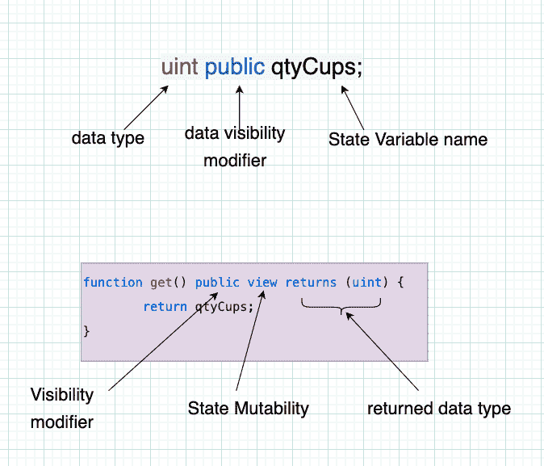

第一个片段声明了一个名为`qtyCups`的状态变量(我很快会解释这是什么，我保证)。这只能存储类型为`uint`的值，这意味着无符号整数。“整数”是指所有小于零(负)和大于零(正)的整数。

因为这些数字有一个+或-符号，所以它们被称为*有符号*整数。因此，无符号整数始终是正整数(包括零)。

在第二个代码片段中，我们在声明函数时也看到了一个熟悉的结构。最重要的是，我们看到函数必须为函数返回值指定一个数据类型。

在这个例子中，由于`get()`返回我们刚刚创建的存储变量的值，我们可以看到返回值必须是一个`uint`。

`public`是可见性说明符。稍后会详细介绍。`view`是一个状态可变性修饰符。下面还有更多！

这里值得注意的是，状态变量也可以是其他类型的- `constant`和`immutable`。它们看起来像这样:

| 字符串常量 TEXT =【ABC】；  地址不可变 owner =0xd 4a 33860578 de 61 DBA BDC 8 bfdb 98 FD 742 fa 7028 e； |

常量和不可变变量的值只被赋值一次，而且只有一次。在分配第一个值后，不能再给它们分配另一个值。

因此，如果我们将`qtyCups`状态变量设为常量或不可变变量，我们将无法再调用它的`increment()`或`decrement()`函数(事实上，代码将无法编译！).

常量的值必须硬编码在代码中，而不可变变量的值可以设置一次，通常是通过在构造函数中赋值(我保证，我们很快就会谈到构造函数)。你可以在阅读更多[文档。](https://docs.soliditylang.org/en/v0.8.16/contracts.html#constant-and-immutable-state-variables)

## 智能合同中的可变范围

智能合约可以访问三个范围的变量:

1.  状态变量:通过记录区块链上的值，将永久数据存储在智能协定中(称为持久状态)。
2.  局部变量:这些是在运行计算时短期保存信息的“瞬时”数据。这些值不会永久存储在区块链上。
3.  [全局变量](https://docs.soliditylang.org/en/v0.8.17/units-and-global-variables.html#special-variables-and-functions):这些变量和函数是由 Solidity“注入”到你的代码中的，不需要专门创建或者从任何地方导入它们就可以使用。这些提供了关于代码运行的区块链环境的信息，还包括程序中通用的实用函数。

您可以按如下方式区分这些范围:

1.  状态变量通常存在于智能契约中，但不在函数中。
2.  局部变量存在于函数内部，不能从函数范围之外访问。
3.  全局变量不是由你声明的——它们“神奇地”可供你使用。

这是我们的`HotFudgeSauce`例子，稍微修改了一下以显示不同类型的变量。我们给`qtyCups`一个初始值，给除我之外的每个人分发几杯软糖酱(因为我在节食)。

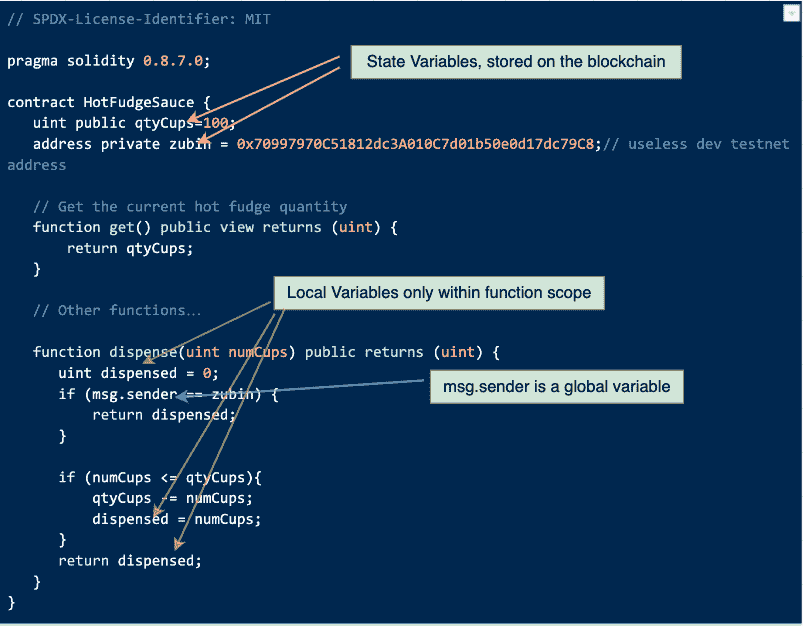

## 可见性说明符如何工作

“可见性”这个词的使用有点令人困惑，因为在公共区块链上，几乎所有的东西都是“可见的”，因为透明度是一个关键特征。但是，在这个上下文中，可见性意味着一段代码能够被另一段代码看到和访问。

可见性指定了从定义变量、函数或契约的代码区域之外访问变量、函数或契约的程度。可见性的范围可以根据软件系统的哪些部分需要访问它来调整。

如果您是 JavaScript 或 NodeJS 开发人员，您应该已经熟悉了可见性——任何时候导出一个对象，都是在声明它的文件之外使它可见。

### 可见性的类型

在固体中有四种不同类型的可见性 : `public`、`external`、`internal`和`private`。

**公共**函数和变量可以在契约内部、外部、从其他智能契约和外部账户(就是那种放在你的 [Metamask](https://metamask.io/) 钱包里的账户)——几乎可以从任何地方访问。这是最广泛、最宽松的能见度等级。

当一个存储变量被赋予`public`可见性时，Solidity 自动为该变量的值创建一个隐式 getter 函数。

所以在我们的`HotFudgeSauce`智能契约中，我们并不真的需要`get()`方法，因为 Solidity 会隐式地为我们提供相同的功能，只需给`qtyCups`一个`public`可见性修饰符。

**私有**函数和变量只能在声明它们的智能契约中访问。但是不能在封装它们的智能协定之外访问它们。`private`是四个可见性说明符中最严格的。

**内部**可见性类似于`private`可见性，因为内部函数和变量只能从声明它们的契约中访问。但是标记为 internal 的函数和变量也可以从派生协定(即从声明协定继承的子协定)中访问，但不能从协定外部访问。稍后我们将讨论继承(以及派生/子契约)。

`internal`是存储变量的默认可见性。

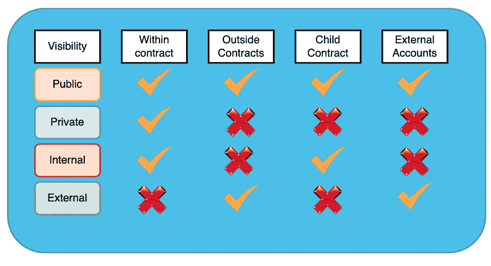

The 4 Solidity Visibility specifiers and where they can be accessed from

**外部**可见性说明符不适用于变量——只有函数可以被指定为外部的。

不能从声明协定或从声明协定继承的协定内部调用外部函数。因此，它们只能从封闭协定的外部调用。

这就是它们与公共函数的不同之处——公共函数也可以从声明它们的契约内部调用，而外部函数不能。

## 什么是构造函数？

构造函数是一种特殊类型的函数。在 Solidity 中，它是可选的，仅在合同创建时执行一次。

在下面的例子中，我们有一个显式的构造函数，它接受一些数据作为参数。您必须在创建智能协定时将此构造函数参数注入到其中。

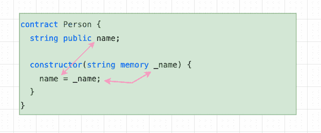

Solidity constructor function with input parameter

为了理解何时调用构造函数，记住智能契约是通过几个阶段创建的是很有帮助的:

*   它被编译成字节码(你可以[在这里](https://blog.chain.link/what-are-abi-and-bytecode-in-solidity/)阅读更多关于字节码的内容)。这个阶段被称为“编译时间”。
*   它被创建(构造)——这是构造器开始工作的时候。这可以称为“施工时间”。
*   字节码然后被部署到区块链。这就是“部署”。
*   部署的智能合约字节码在区块链上运行(执行)。这可以认为是“运行时”。

在 Solidity 中，与其他语言不同，程序(智能合约)仅在构造器完成创建智能合约的工作后*才被部署。*

有趣的是，在 Solidity 中，最终部署的字节码*不*包括构造器代码。这是因为在 Solidity 中，[构造器代码是创建代码](https://blog.openzeppelin.com/deconstructing-a-solidity-contract-part-ii-creation-vs-runtime-6b9d60ecb44c/)(构建时)的一部分，而不是运行时代码的一部分。它在创建智能契约时被用完，因为它只被调用过一次，所以在这个阶段之后就不再需要它了，并被排除在最终部署的字节码之外。

因此，在我们的示例中，构造函数创建(构造)了一个`Person`智能契约的实例。我们的构造函数希望我们传递一个名为`_name`的字符串值给它。

当构建智能契约时，`_name`的值将存储在名为`name`的状态变量中(这通常是我们将配置和其他数据传递到智能契约中的方式)。然后，当契约实际部署时，状态变量`name`将保存我们传递给构造函数的任何字符串值。

### 理解为什么

你可能想知道为什么我们要费心把值注入构造函数。为什么不直接写进合同里？

这是因为我们希望合同是可配置的或“参数化的”。我们想要的不是硬代码值，而是在需要时注入数据所带来的灵活性和可重用性。

在我们的例子中，假设`_name`指的是一个给定的以太网的名称，契约将在这个以太网上部署(比如 Rinkeby、Goerli、Kovan、Mainnet 等等)。

我们如何将这些信息提供给我们的智能合同呢？把所有这些价值都放进去是浪费。这也意味着我们需要添加额外的代码来计算出合同运行在哪个区块链上。然后，我们必须从存储在合同中的硬编码列表中选择正确的网络名称，这需要在部署时消耗汽油。

相反，我们可以在将智能合约部署到相关的区块链网络时，将它注入到构造函数中。这就是我们如何编写一个可以使用任意数量的参数值的契约。

另一个常见的用例是，当您的智能协定从另一个智能协定继承时，您需要在创建协定时将值传递给父智能协定。但是继承是我们以后会讨论的事情。

我提到构造函数是可选的。在`HotFudgeSauce`中，我们没有写一个显式的构造函数。但是 Solidity 支持隐式构造函数。因此，如果我们在智能契约中不包含构造函数，Solidity 将[假定一个默认的构造函数](https://docs.soliditylang.org/en/v0.8.13/contracts.html#constructors)，看起来像`constructor() {}`。

如果你在脑子里评估它，你会发现它什么也没做，这就是为什么它可以被排除(隐式)，编译器会使用默认的构造函数。

## 接口和抽象契约

solidity 中的[接口是一个需要理解的基本概念。以太坊上的智能合约是公开可见的，因此你可以通过它们的功能与它们进行交互(在可见性说明符允许的范围内！).](https://docs.soliditylang.org/en/develop/contracts.html#interfaces)

这就是智能合约“可组合”的原因，也是为什么这么多 Defi 协议被称为“金钱乐高”——你可以编写与其他智能合约交互的智能合约，这些智能合约与其他智能合约交互，等等……你明白了吧。

所以当你希望你的智能合约 A 与另一个智能合约 B 交互时，你需要 B 的接口。界面为您提供了各种功能的索引或菜单，您可以在给定的智能合约上调用这些功能。

接口的一个重要特征是它们不能有任何已定义函数的实现(代码逻辑)。接口只是函数名及其预期参数和返回类型的集合。它们并不是坚固性所独有的。

因此，我们的`HotFudgeSauce`智能契约的接口应该是这样的(注意，按照惯例，solidity 接口是通过在智能契约的名称前加上前缀“I”来命名的:

| //spdx-license-identifier:MIT    pragma solidity ^0 . 8 . 7；    接口 IHotFudgeSauce {  函数 获取 () 公共 查看 返回(  功能 增量 () 公共；  功能 减量 () 公共；  } |

就是这样！由于`HotFudgeSauce`只有三个功能，界面只显示这些。

但是这里有一个重要而微妙的问题:一个接口不需要包含智能契约中所有可调用的函数。一个接口可以被缩短以包括你想要调用的函数的函数定义！

所以如果你只想在`HotFudgeSauce`上使用`decrement()`方法，那么你完全可以从你的接口中移除`get()`和`increment()`——但是你不能从你的契约中调用这两个函数。

那么到底发生了什么呢？好吧，接口只是给你的智能合约一种方式，让你知道在你的目标智能合约中可以调用什么函数，这些函数接受什么参数(以及它们的数据类型)，以及你可以期待什么类型的返回数据。在 Solidity 中，这是您与另一个智能合约交互所需的全部内容。

在某些情况下，你可以有一个抽象契约，它类似于接口，但又不同于接口。

[抽象契约](https://docs.soliditylang.org/en/develop/contracts.html#abstract-contracts)是使用`abstract`关键字声明的，它的一个或多个功能被声明但没有被实现。这是至少声明了一个函数但没有实现的另一种说法。

反过来说，抽象契约可以有其函数的实现(不像接口可以有零个实现的函数)，但是只要至少有一个函数没有实现，契约就必须被标记为抽象的:

| //spdx-license-identifier:MIT  pragma solidity ^0 . 8 . 7；    抽象契约猫{int 公共时代；
//未实现。  功能 发声 () 公开 虚拟 返回(bytes 32)；//实现了。函数setAge(int _ age)公共 {年龄= _ 年龄；}} |

你可能(合理地)想知道这有什么意义。嗯，抽象契约不能直接实例化(创建)。它们只能由继承它们的其他协定使用。

因此，抽象契约通常被用作模板或“基础契约”,其他智能契约可以从该模板或“基础契约”中“继承”,以便继承的智能契约被强制实现由抽象(父)契约声明的某些功能。这在相关契约之间强制实施了一个定义好的结构，这通常是一个有用的设计模式。

当我们稍后讨论继承时，这个继承的东西会变得更清楚一些。现在，请记住，您可以声明一个不实现其所有功能的抽象智能契约——但是如果您这样做了，您就不能实例化它，并且继承它的未来智能契约必须完成实现那些未实现功能的工作。

接口和抽象契约的一些重要区别在于:

*   接口可以没有实现，而抽象契约可以有任意数量的实现，只要至少有一个函数是“抽象的”(即没有实现)。
*   接口中的所有函数都必须标记为“外部”，因为它们只能由实现该接口的其他契约调用。
*   接口不能有构造函数，而抽象契约可以。
*   接口不能有状态变量，而抽象契约可以。

## 智能合同示例 2

对于接下来的几个可靠性概念，我们将使用下面的智能合同。这部分是因为这个例子包含了一个在现实世界中实际使用的智能契约。我选择它也是因为自从我在 Chainlink Labs 工作以来，我对那里有明显的偏见(😆)而且很牛逼。但这也是我学到很多扎实的地方，用真实世界的例子来学习总是更好。

所以从阅读代码和下面的评论开始吧。如果你仔细阅读，你已经学会了理解下面合同所需的 99%。然后继续从该合同中学习关键知识。

| //spdx-license-identifier:MIT  pragma solidity ^0 . 8 . 7；    导入" @ chain link/contracts/src/v 0.8/interfaces/aggregator v3 interface . sol "；    合同价格消费 erV3 {  聚合器 V3 接口内部 priceFeed    /* *  *网络:Goerli  *聚合器:ETH/USD  *地址:0x d4a 3860578 de 61 dbdc 8 bfdb 98 FD 742 fa 7028 e  } /**  *返回最新价格  */  函数getLatestPrice()公共 视图 返回  【int price】，  /* uint started at */，  /* uint timeStamp */，    返回 价格；  }  } |

这个智能合约[从一个实时链接价格馈送 oracle (](https://docs.chain.link/docs/get-the-latest-price/) [参见 etherscan](https://goerli.etherscan.io/address/0xD4a33860578De61DBAbDc8BFdb98FD742fA7028e#code) 上的 oracle)获得 1 Eth 的最新美元价格。这个例子使用了 Goerli 网络，这样你就不会在以太坊主网上花费真金白银。

现在谈谈你需要吸收的 6 个基本可靠性概念:

1.  就在`pragma`语句之后，我们有一个 import 语句。这将现有代码导入到我们的智能契约中。

    这太酷了，因为这是我们重用和受益于他人编写的代码的方式。你可以查看这个 [GitHub 链接](https://github.com/smartcontractkit/chainlink/blob/develop/contracts/src/v0.8/interfaces/AggregatorV3Interface.sol)上导入的代码。

    实际上，当我们编译我们的智能契约时，这些导入的代码被拉进来并一起编译成字节码。我们马上就会明白为什么我们需要它…

2.  之前你看到单行注释标有`//`。现在您正在学习多行注释。他们可以跨越一行或多行，使用`/*`和`*/`来开始和结束注释。

3.  我们声明了一个名为`priceFeed`的变量，它的类型是`AggregatorV3Interface`。但是这种奇怪的类型从何而来呢？从我们在 import 语句中导入的代码中——我们可以使用`AggregatorV3Interface`类型，因为 Chainlink 定义了它。如果你查看 Github 链接，你会看到类型定义了一个接口(我们刚刚讨论完接口)。所以`priceFeed`是对`AggregatorV3Interface`类型的某个对象的*引用*。

4.  看一下构造函数。这个函数不接受参数，但是我们可以像传递类型为`address`的参数一样简单地传递 ETH/USD 价格提要的 oracle smart contract 的地址`0xD4a33860578De61DBAbDc8BFdb98FD742fA7028e`给它。相反，我们将地址硬编码在构造函数中。

    但是我们也创建了一个对价格馈送聚合器智能契约的引用(使用名为`AggregatorV3Interface`的接口)。

    现在我们可以调用`AggregatorV3Interface`上所有可用的方法，因为`priceFeed`变量引用了那个智能契约。事实上，我们接下来会这样做…
5.  让我们跳到函数`getLatestPrice()`。你会从我们在`HotFudgeSauce`的讨论中认出它的结构，但是它正在做一些有趣的事情。

    在这个`getLatestPrice()`函数中，我们称之为`latestRoundData()`函数，它存在于`AggregatorV3Interface`类型中。如果你[查看这个方法](https://github.com/smartcontractkit/chainlink/blob/develop/contracts/src/v0.8/interfaces/AggregatorV3Interface.sol#L22)的源代码，你会注意到这个`latestRoundData()`函数返回 5 种不同类型的整数！

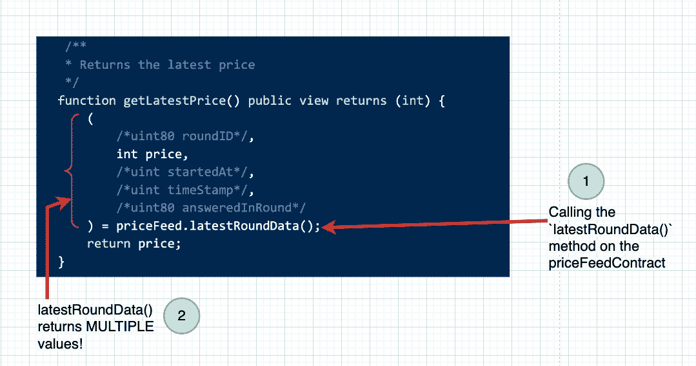

Calling methods on another smart contract from our smart contract

在我们的智能合同中，我们注释掉了我们不需要的所有 4 个值。这意味着 Solidity 函数可以返回多个值(在这个例子中，我们返回了 5 个值)，我们可以挑选我们想要的值。

另一种使用调用`latestRoundData()`结果的方式是:`( ,int price, , ,) = priceFeed.latestRoundData()`，其中我们忽略了 5 个返回值中的 4 个，没有给它们一个变量名。

当我们将变量名赋给一个或多个由函数返回的值时，我们称之为“析构赋值”，因为我们析构返回值(将每个值分开)并在析构时赋值，就像我们对上面的`price`所做的那样。

既然你已经了解了接口，我推荐你看一看 Chainlink Labs 的 [GitHub repo](https://github.com/smartcontractkit/) 来检查[的`Aggregator`契约](https://github.com/smartcontractkit/chainlink/blob/develop/contracts/src/v0.6/AggregatorProxy.sol#L211)中实现的`latestRoundData()`函数，以及`AggregatorV3Interface` [如何提供接口](https://github.com/smartcontractkit/chainlink/blob/develop/contracts/src/v0.8/interfaces/AggregatorV3Interface.sol#L22)与`Aggregator`契约进行交互。

## 什么是契约状态？

在我们继续下一步之前，重要的是要确保我们将经常看到的术语对您来说是可以理解的。

计算机科学中的“状态”有一个定义明确的含义。虽然它可能会非常令人困惑，但状态的关键是它指的是程序运行时“记住”的所有信息。这些信息可以更改、更新、删除、创建等等。如果您在不同时间拍摄快照，信息将处于不同的“状态”。

所以状态只是程序当前的快照，在程序执行期间的某个时间点——它的变量持有什么值，它们在做什么，哪些对象已经被创建或删除，等等。

我们之前已经检查了三种类型的变量——状态变量、局部变量和全局变量。状态变量和全局变量为我们提供了智能合约在任何给定时间点的状态。因此，智能合约的状态是对以下内容的描述:

1.  它的状态变量包含什么值，
2.  与区块链相关的全局变量在那个时刻有什么值，以及
3.  智能合约账户中的余额(如果有)。

## 状态可变性关键字(修饰符)

现在我们已经讨论了状态、状态变量和函数，让我们来理解 Solidity 关键字，这些关键字指定了我们可以对状态做什么。

这些关键字被称为[修饰符](https://docs.soliditylang.org/en/v0.8.17/cheatsheet.html#modifiers)。但是并不是所有这些都允许您修改状态。事实上，他们中的许多人明确表示*不允许*修改。

以下是你会在任何现实世界的智能合同中看到的可靠性修饰符:

| 修饰关键字 | 适用于… | 目的 |
| 常数 | 状态变量 | 声明并赋予一次值，同时。硬编码成代码。它的给定值永远不能改变。
当我们知道一个值永远不会改变时使用——例如，如果我们永远不允许用户购买超过 50 个单位的东西，我们可以声明 50 为常量值。 |
| 不可变 | 状态变量 | 这些在智能合约的顶部声明，但是给定它们的值(只有一次！)在构造时——即通过构造函数。一旦它们接收到它们的值，它们(实际上)就是常量。并且它们的值实际上存储在代码本身中而不是存储槽中(存储将在后面解释)。 |
| 视图 | 功能 | 你通常会在可见性说明符后看到这个。一个 视图 修饰符意味着该函数只能“查看”(读取)契约状态，而不能改变它(不能“写入”契约状态)。这实际上是一个只读修饰符。如果该函数需要使用合同状态中的任何值，但不修改该值，它将是一个视图函数。 |
| 纯 | 功能 | 纯函数不允许写入(修改)合同状态，甚至不允许读取合同状态！他们做的事情与区块链国家没有任何关系。通常，这些可以是帮助函数，进行一些计算或将一种数据类型的输入转换为另一种数据类型等。 |
| 应付款项 | 功能 | 这个关键字使一个函数能够接收 Eth。如果没有这个关键字，你就不能在调用函数时发送 Eth。    注意，在 Solidity 0 . 8 . 17 版本中，有 [的突破性变化](https://docs.soliditylang.org/en/v0.8.17/080-breaking-changes.html?highlight=payable%20address#new-restrictions) 支持使用应付款作为数据类型。具体来说，我们现在允许将 地址 数据类型转换为 应付款 地址 类型，方法是进行类似于 应付款(0x dcad 3a 6d 3569 df 655070 ded 06 CB 7a 1 B2 CCD 1 D3 af)的类型转换。  这样做的目的是让一个给定的以太坊地址成为应付款，之后我们可以发送 Eth 到那个地址。    注意，应付款的这种用法是一种类型转换，与函数修饰符不同，虽然使用了相同的关键字。我们将在后面介绍地址类型，但是您可以在这里 阅读这个 [。](https://docs.soliditylang.org/en/v0.8.16/types.html#address) |
| 虚拟 | 功能 | 这是一个稍微高级一点的话题，在继承一节中会有详细介绍。这个修饰符允许函数在继承它的子契约中被“覆盖”。换句话说，一个带有关键字 虚拟 的函数，可以在继承自这个契约的另一个契约中用不同的内部逻辑“重写”。 |
| 超驰 | 功能 | 这是 虚拟 修改器的另一面。当子契约“重写”它所继承的基础契约(父契约)中声明的函数时，它用 override 标记重写的函数，以表示它的实现重写了父契约中给定的函数。如果父级的 虚 函数没有被子级覆盖，则父级的实现将应用于子级。 |
| 索引 | 事件 | 我们将在本手册的后面介绍事件。它们是由智能合约“发出”的小数据包，通常是为了响应发生的值得注意的事件。 索引 关键字表示事件中包含的其中一条数据应该存储在区块链中，以便以后检索和过滤。一旦我们在本手册的后面介绍了事件和日志记录，这将更有意义。 |
| 匿名 | 事件 | [docs](https://docs.soliditylang.org/en/v0.8.17/cheatsheet.html#modifiers)说“不将事件签名存储为主题”，这可能对你来说还没什么意义。但这个关键词确实表明，它让事件的某个部分“匿名”。因此，一旦我们理解了本手册后面的事件和主题，这就有意义了。 |

请注意，不是存储变量的变量(即在给定函数范围内声明和使用的局部变量)不需要状态修饰符。这是因为它们实际上不是智能合约状态的一部分。它们只是该函数中本地状态的一部分。根据定义，它们是可修改的，不需要控制它们的可修改性。

## 数据位置–存储、内存和堆栈

在以太坊和 EVM 的连锁店中，系统内部的数据可以存放在多个“数据位置”并被访问。

数据位置是 EVM 基本设计和架构的一部分。当你看到“内存”、“存储”和“堆栈”这些词时，你应该开始考虑“数据位置”——也就是说，数据可以存储(写入)和检索(读取)到哪里。

数据位置对代码在运行时的执行方式有影响。但是，在智能合同的部署和运行过程中，它对使用多少[气体](https://ethereum.org/en/developers/docs/gas/)也有非常重要的影响。

gas 的使用需要对 EVM 和操作码有更深的理解——我们可以暂时搁置这个讨论。虽然很有用，但理解数据位置并非绝对必要。

虽然到目前为止我已经提到了 3 个数据位置，但是在智能合约中还有另外两种存储和访问数据的方式:“calldata”和“code”。但在 EVM 的设计中，这些都不是数据位置。它们只是 3 个数据位置的子集。

先说储物。在 EVM 的设计中，需要永久存储在区块链上的数据放在相关智能合约的“存储”区域。这包括任何合同“状态变量”。

一旦一个契约被部署并有了它自己的地址，它也就有了自己的存储区域，你可以把它想象成一个键值存储(就像一个散列表)，其中 **both** 键和值都是 256 位(32 字节)的数据“字”。而“单词”[在计算机架构中有着特定的含义](https://en.wikipedia.org/wiki/Word_(computer_architecture))。

因为存储将数据永久保存在区块链上，所以所有数据需要在网络中的所有节点上同步，这就是为什么节点必须就数据状态达成一致。这种共识使得存储使用起来非常昂贵。

您已经看到了存储变量(又名合同状态变量)的示例，但这里有一个来自 [Chainlink 可验证随机数消费者智能合同](https://github.com/smartcontractkit/chainlink/blob/develop/contracts/src/v0.8/VRFConsumerBaseV2.sol)的示例

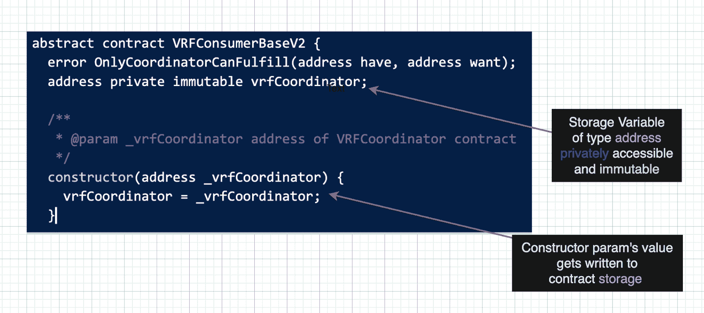

Storage data location. Putting data in the contract's storage layout.

当创建和部署上述契约时，传递到契约构造函数中的任何地址都将永久存储在智能契约的存储中，并且可以使用变量`vrfCoodinator`进行访问。由于该状态变量被标记为`immutable`，因此在此之后不能更改。

回顾一下上一节关于关键字的内容，我们上次讨论了`immutable`和`constant`变量，这些值没有被存储。当构造契约时，它们成为代码本身的一部分，因此这些值不会像存储变量那样消耗大量的能量。

现在我们转到`memory`。这是一个临时存储区，您可以在其中读取和写入智能合约运行期间所需的数据。一旦使用这些数据的函数执行完毕，这些数据就会被删除。

`memory`位置空间就像一个临时记事本，每次触发一个功能，智能合约中就会出现一个新的。执行完毕后，记事本被扔掉。

在理解存储和内存之间的区别时，您可以将存储视为传统计算世界中的一种硬盘，因为它具有数据的“持久”存储。但是传统计算中内存更接近 RAM。

`stack`是执行大部分 EVM 计算的数据区。EVM 遵循基于[堆栈的计算模型](https://en.wikipedia.org/wiki/Stack_machine#Comparison_with_register_machines)，而不是基于寄存器的计算模型，这意味着要执行的每个操作都需要使用[堆栈数据结构](https://en.wikipedia.org/wiki/Stack_(abstract_data_type))来存储和访问。

堆栈的深度是 1024，也就是它能容纳的项目总数，堆栈中的每个项目可以是 256 位(32 字节)长。这与存储数据位置中每个键和值的大小相同。

你可以在这里阅读更多关于 EVM 如何控制对堆栈数据存储区[的访问。](https://docs.soliditylang.org/en/v0.8.17/introduction-to-smart-contracts.html#storage-memory-and-the-stack)

接下来，我们来说说`calldata`。我假设你对以太坊智能合约[消息](https://ethereum.org/en/whitepaper/#messages)和[交易](https://ethereum.org/en/developers/docs/transactions/#:~:text=An%20Ethereum%20transaction%20refers%20to,takes%20place%20within%20a%20transaction.)有基本的了解。如果你没有，你应该首先阅读那些链接。

消息和事务是调用智能合约功能的方式，它们包含执行这些功能所需的各种数据。这个消息数据存储在内存中一个名为`calldata`的只读部分，其中包含函数名和参数等内容。

这与外部可调用的函数相关，因为内部和私有函数不使用 calldata。只有“输入的”函数执行数据和函数参数存储在这个位置。

记住，`calldata`是内存，除了`calldata`是只读的。您不能向其中写入数据。

最后，`code`不是一个数据位置，而是指智能合约的已编译字节码，它被部署并永久存储在区块链上。这个字节码存储在一个不可变的 ROM(只读存储器)中，其中加载了要执行的智能合约的字节码。

还记得我们讨论过不可变变量和常量变量在可靠性上的区别吗？不可变值被赋值一次(通常在构造函数中)，常量变量的值被硬编码到智能契约代码中。因为它们是硬编码的，所以常量值被逐字编译并直接嵌入到智能合约的字节码中，并存储在这个代码/ ROM 数据位置。

像`calldata`，`code`也是只读的——如果你理解了前面的段落，你就会明白为什么了！

## 打字的工作原理

在编程中，类型化是一个非常重要的概念，因为它是我们赋予数据结构的方式。从该结构中，我们可以以安全、一致和可预测的方式对数据进行操作。

当一种语言有严格的类型时，这意味着该语言严格定义了每一段数据的类型，一个有类型的变量不能被赋予另一种类型。

换句话说，在严格类型化的语言中:

| int a =1//1 这里是整型的  string b =【1】//1 这里是字符串型的
b=a //不对！b 是一个字符串。它不能保存 int 值，反之亦然！ |

但是在非类型化的 JavaScript 中，`b=a`完全可以工作——这使得 JavaScript“动态类型化”。

类似地，在静态类型语言中，不能将整数传递给需要字符串的函数。但是在 JavaScript 中，我们可以传递任何东西给一个函数，程序仍然会编译，但是当你执行程序时，它可能会抛出一个错误。

以此函数为例:

| 函数 添加 ( a，b){  返回a+b  }    添加( 1 【2】)//“2”是字符串，不是整数，所以输出变成了字符串“12”(！ ？) |

可以想象，这会产生一些很难发现的错误。代码可以编译，甚至可以成功执行，尽管它会产生意想不到的结果。

但是强类型语言绝不会让你传递字符串“2 ”,因为函数会坚持它接受的类型。

让我们来看看这个函数是如何用像 Go 这样的强类型语言编写的。

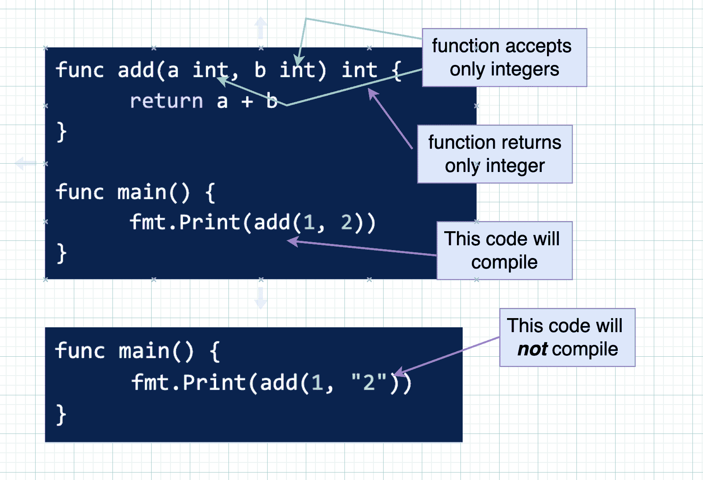

How typing works in syntax, using Golang for illustration purposes

试图传递一个`string`(即使它代表一个数字)甚至会阻止程序编译(构建)。您将看到类似这样的错误:

```
./prog.go:13:19: cannot use "2" (untyped string constant) as int value in argument to add

Go build failed.
```

[自己试试](https://go.dev/play/p/SrE1CXVD_pj)！

所以类型很重要，因为对人类来说看起来相同的数据可能被计算机理解为非常不同的。这可能会导致一些非常奇怪的错误、错误、程序崩溃，甚至是大的安全漏洞。

类型还使开发人员能够创建他们自己的自定义类型，然后可以用自定义属性(特性)和操作(行为)对其进行编程。

类型系统的存在是为了让人们可以通过提问“这个数据的类型是什么，它应该能够做什么？”来推理数据这些机器可以准确地完成预期的任务。

这是另一个例子，说明对你我来说看起来一样的数据可能被处理器以非常不同的方式解释。取二进制数字序列(即数字只能有 0 或 1 的值，这是处理器工作的[二进制系统](https://www.mathsisfun.com/binary-number-system.html))`1100001010100011`。

对人类来说，使用十进制看起来是一个非常大的数字——也许是 11 兆或其他什么。

但是对于二进制的计算机来说，它不是 11。计算机将其视为 16 位序列(二进制数字的缩写)，在二进制中，这可能意味着*正数*(无符号整数)49，827 或有符号整数-15，709 或英镑符号的 UTF-8 表示或其他不同的东西！


A sequence of bits can be interpreted by a computer to have very different meanings ([source](https://livebook.manning.com/book/programming-with-types/chapter-1/18))

所以所有这些解释都是在说类型是重要的，类型可以“内置”到一种语言中，即使这种语言并不像 JavaScript 那样严格执行类型。

JavaScript 已经有了[内置类型](https://www.w3schools.com/js/js_datatypes.asp)，比如数字、字符串、布尔值、对象和数组。但是正如我们所看到的，JavaScript 并不坚持像 Go 这样的静态类型语言所坚持的类型。

现在回到坚实。Solidity 在很大程度上是一种静态类型语言。当你声明一个变量时，你也必须声明它的类型。更进一步，如果你试图将一个字符串传递给一个需要整数的函数，Solidity 将拒绝编译。

事实上，可靠性对类型的要求非常严格。例如，不同类型的整数也可能会编译失败，如下例所示，函数`add()`需要一个无符号整数(正的),并且只对该数字求和，因此总是返回一个正整数。但是返回类型被指定为一个`int`，这意味着它可以是正数也可以是负数！

| 函数 添加(uint 256 a)公共 纯 返回(int 256【T26){返回  }//可靠性编译器抱怨道://类型错误:返回参数类型 uint256 不能隐式转换为预期类型(第一个返回变量的类型)int256。 r |

所以即使输入和输出都是 256 位整数，但函数只接收无符号整数的事实让编译器抱怨无符号整数类型是*而不是*可以隐式转换为有符号整数类型。

那是相当严格的！开发人员可以通过将 return 语句重写为`return int256(a + 10)`来强制转换(称为类型转换)。但是这种行为需要考虑一些问题，这超出了我们在这里讨论的范围。

现在，只要记住 Solidity 是静态类型的，这意味着在代码中声明变量时，必须明确指定每个变量的类型。您可以组合类型以形成更复杂的复合类型。接下来，我们可以讨论一些内置类型。

## 可靠性数据类型

内置于语言中并“开箱即用”的类型通常被称为“原语”。它们是语言固有的。您可以组合基本类型来形成更复杂的数据结构，成为“自定义”数据类型。

例如，在 JavaScript 中，[原语](https://developer.mozilla.org/en-US/docs/Glossary/Primitive)是不是 JS 对象*的数据，而*没有方法或属性。JavaScript 中有 7 种原始数据类型:`string`、`number`、`bigint`、`boolean`、`undefined`、`symbol`和`null`。

Solidity 也有自己的原始数据类型。有趣的是，实性并不*不*有“未定义”或“空”。相反，当你声明一个变量和它的类型，但没有给它赋值时，Solidity 会给那个类型分配一个[默认值](https://docs.soliditylang.org/en/v0.8.17/control-structures.html#default-value)。默认值具体是什么取决于数据类型。

Solidity 的许多原始数据类型是同一个“基本”类型的变体。例如，`int`类型本身具有基于`integer`类型所能容纳的二进制位数的子类型。

如果这让您有点困惑，不要担心——如果您不熟悉位和字节，这并不容易，我很快会谈到整数。

在我们探索可靠性类型之前，有另一个非常重要的概念你必须理解——它是编程语言中许多错误和“意外陷阱”的来源。

这是值类型和引用类型之间的区别，也是程序中数据“通过值传递”和“通过引用传递”之间的区别。我将在下面做一个简短的总结，但你可能会发现在继续之前，观看[这个简短的视频](https://www.youtube.com/watch?v=1HHjKG1372E)会有助于强化你的思维模式。

### 按引用传递与按值传递

在操作系统级别，当程序运行时，程序在执行期间使用的所有数据都存储在计算机 ram(内存)中的位置。当您声明一个变量时，会分配一些内存空间来保存关于该变量的数据以及已经或最终将被赋给该变量的值。

还有一种数据，通常被称为“指针”。这个指针指向可以找到该变量及其值的内存位置(计算机 RAM 中的一个“地址”)。所以这个指针实际上包含了一个*引用*，指向在计算机内存中可以找到数据的地方。

因此，当你在程序中传递数据时(例如，当你给一个新的变量名赋值时，或者当你把输入(参数)传递给一个函数或方法时)，这种语言的编译器可以通过两种方式来实现。它可以传递一个指向数据在计算机内存中位置的指针，**或**它可以复制数据本身，并传递实际值。

第一种方法是“通过引用传递”。第二种方法是“按值传递”。

Solidity 的数据类型原语分为两类——要么是值类型，要么是引用类型。

换句话说，在 Solidity 中，当您传递数据时，数据的类型将决定您传递的是值的副本还是对值在计算机内存中的位置的引用。

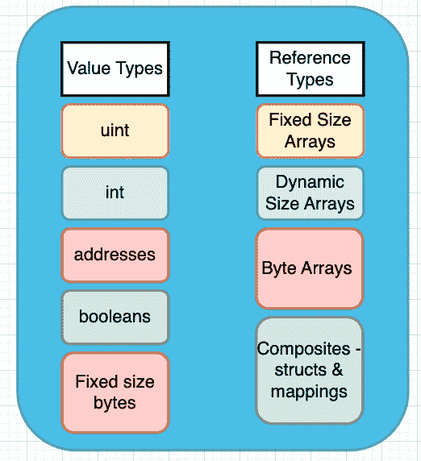

Value Types and Reference Types in Solidity

在 Solidity 的“值类型”中，整数分为两类- `uint`是无符号的(只有正整数，所以它们没有加号或减号)和`int`是有符号的(可以是正数或负数，如果你写下来，它们会有一个加号或减号)。

整数类型也可以指定它们有多长——或者用多少位来表示`integer`。

一个`uint8`是一个由 8 个二进制数字(位)表示的整数，可以存储多达 256 个不同的值(2^8=256).由于`uint`适用于无符号(正)整数，这意味着它可以存储从 0 到 255(不包括 1 到 256)的值。

然而，当你有了带符号的整数，比如一个`int8`，那么其中一个位就被用来表示它是正数还是负数。这意味着我们只剩下 7 位，因此我们最多只能表示 2^7 (128)个不同的值，包括 0。所以一个`int8`可以代表从-127 到+127 的任何值。

通过扩展，`int256`是 256 位长，可以存储+/- (2^255)值。

比特长度是 8 的倍数[(因为 8 比特组成一个字节)，所以你可以有`int8`、`int16`、`int24`等等，一直到 256 (32 字节)。](https://docs.soliditylang.org/fr/latest/types.html#integers)

地址是指以太坊账户类型——智能合约账户或外部拥有的账户(又名“EOA”)。您的元掩码钱包代表一个 EOA)。所以地址也是一种类型。

一个地址的缺省值(如果你声明了一个 address 类型的变量，但是没有给它赋值的话，它的值)是`0x0000000000000000000000000000000000000000`，它也是这个表达式的结果:`address(0)`。

布尔表示真值或假值。最后，我们有[固定大小的字节数组](https://docs.soliditylang.org/en/v0.8.17/types.html#fixed-size-byte-arrays)，比如`bytes1`、`bytes2` … `bytes32`。这些是包含字节的固定长度的数组。所有这些类型的值在代码中传递时都会被复制。

对于“引用类型”，我们有数组，它可以在声明时指定固定的大小，或者动态调整大小的数组，它从固定的大小开始，但可以随着数组中数据元素数量的增加而“调整大小”。

字节是一种低级数据类型，指的是编码为二进制格式的数据。所有的数据最终都被编译器转换成二进制形式，这样 EVM(或者，在传统计算中，处理器)就可以处理这些数据了。

与更易于阅读的其他数据类型相比，存储和处理字节通常更快、更有效。

你可能想知道为什么在上面的图片中，我没有在任何一种类型的数据中引用字符串。这是因为在 Solidity 中，字符串实际上是动态大小的数组，数组存储了以 UTF-8 编码格式编码的字节序列(只是二进制数)。

他们不是坚固的原始人。在 JavaScript 中，它们被称为原语，但即使在 JavaScript 中，字符串也与数组相似(但不相同),并且[是一系列用 UTF-16 编码的整数值](https://tc39.es/ecma262/#sec-ecmascript-language-types-string-type)。

在智能契约中将`string`存储为`bytes`类型通常更有效，因为在`strings`和`bytes`之间转换非常容易。因此，将`strings`存储为`bytes`并将它们作为字符串返回到函数中是很有用的。你可以看到下面的例子:

| //spdx-license-identifier:MIT    pragma solidity ^0 . 8 . 0；      合同 StringyBytes {//通过字符串输入时返回 0x5a 7562696 e  函数stringIntoBytes(字符串内存输入)publicpure返回   }  //返回“Zubin”当传递了字节输入“0x5a 7562696 e”  函数bytesIntoString(字节内存输入public纯  }  } |

除了可靠性字符串，`bytes`数据类型是一个[动态大小的字节数组](https://docs.soliditylang.org/en/v0.8.17/types.html#dynamically-sized-byte-array)。此外，与固定大小的字节数组不同，它是一种引用类型。Solidity 中的`bytes`类型是“字节数组”的简写，可以在程序中写成`bytes`或`byte[]`。如果你对字节和字节数组感到困惑，我深表同情。

字符串和字节数组的底层细节与本手册不太相关。现在重要的一点是，一些数据类型是通过引用传递的，而另一些是通过复制它们的值来传递的。

可以说，没有指定大小的 Solidity 字符串和字节是引用类型，因为它们都是动态大小的数组。

最后，在 Solidity 的原语中，我们有`structs`和`mappings`。有时这些被称为“复合”数据类型，因为它们是由其他原语组成的。

一个`struct`将一个数据定义为具有一个或多个属性，并指定每个属性的数据类型和名称。结构使您能够定义自己的自定义类型，以便您可以将数据片段组织和收集到一个更大的数据类型中。

例如，您可以拥有如下定义`Person`的 struct:

| struct Person {  字符串名称；  uint 年龄；bool is solidity dev；Job Job//Person struct 包含自定义类型的 Job  }
结构作业{字符串雇主；弦系；布尔 isRemote}
 |

可以通过以下方式实例化或初始化一个`Person`结构:

| //点符号更新。Job struct 是未初始化的  //这意味着它的属性将有它们各自的默认值  Person 内存 p；  p . name =【祖宾】  T22【p . age =41；  p . isssoliditydev =true；    //或者在函数式调用中。注意，我也正在初始化一个作业结构！  Person p = Person(【Zubin】【41】【true】，Job(【chain link Labs】【DevRel】 //或者以键值样式  Job j = Job({雇主:【chain link Labs】，【DevRel】， true )  p . job = j//这是用点符号样式完成的。 |

映射类似于哈希表、字典或 JavaScript 对象和映射，但功能稍少。

一个`mapping`也是一个键-值对，对于你可以作为键的数据类型有限制，你可以在这里读到关于[的内容。与映射的键相关联的数据类型可以是任何原语、结构，甚至是其他映射。](https://docs.soliditylang.org/en/v0.8.17/types.html#mapping-types)

以下是映射的声明、初始化、写入和读取方式——以下示例来自 [Chainlink 令牌智能合约源代码](https://github.com/smartcontractkit/LinkToken/blob/f307ea6d4c02dd87ea4c1f1032e3e384ceac20c2/contracts/v0.4/token/linkStandardToken.sol)。

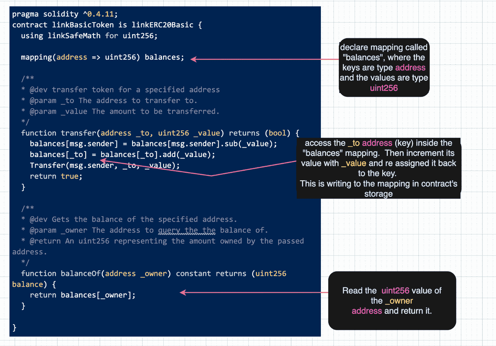

Declaring and using the Mappings type in Solidity

如果您试图使用映射中不存在的键来访问一个值，它将返回存储在映射中的类型的默认值。

在上面的例子中，`balances`映射中所有值的类型是`uint256`，它的默认值是`0`。因此，如果我们调用`balanceOf()`并传入一个没有任何链接令牌的地址，我们将得到一个值`0`。

在这个例子中这是合理的，但是当我们想知道一个键是否存在于一个映射中时，这就有点棘手了。

目前没有办法枚举映射中存在哪些键(也就是说，没有什么方法等同于 [JavaScript 的`Object.keys()`](https://developer.mozilla.org/en-US/docs/Web/JavaScript/Reference/Global_Objects/Object/keys) 方法)。使用键进行检索只会返回与数据类型相关联的默认值，这并不能清楚地告诉我们该键是否实际存在。

对于映射有一个有趣的“陷阱”。与其他可以将键值数据结构作为参数传递给函数的语言不同，Solidity 不支持将映射作为参数传递给函数，除非函数的可见性标记为`internal`。因此，您不能编写一个外部或公共可调用的函数来接受键值对作为参数。

## 如何在 Solidity 中声明和初始化数组

坚固性有两种类型的数组，所以理解声明和初始化它们的不同方式是很有用的。

Solidity 中的两种主要类型的数组是固定大小的数组和动态大小的数组。

为了刷新您的记忆，固定大小的数组通过值传递(在代码中传递时复制)，动态大小的数组通过引用传递(指向内存地址的指针在代码中传递)。

它们在语法和容量(大小)上也是不同的，这决定了我们何时使用其中一个。

下面是固定大小数组在声明和初始化时的样子。它有 6 个元素的固定容量，一旦声明就不能更改。6 个元素的数组的存储空间已分配，不能更改。

| string[6fixed array； //最大容量是 6 个元素。
fixed array[0]= 'a '； //第一个元素设置为‘a’fixed array[4]=‘e’； //第 5 个元素设置为‘e’fixed array . push(f’)//不 OK。Push()不适用于固定大小的数组。
fixed array[5]=‘f’； //第 6 个元素设置为‘f’fixed array[6]=‘g’； //不 OK。超过数组的固定大小。 |

固定大小的数组也可以通过使用以下语法声明变量、数组大小及其元素类型来声明:

| //数据类型 array name[array size]；stringmystring【10】； //大小为 10 的字符串数组。myStrings[0]= " chain . link "； |

相比之下，动态大小的数组的声明和初始化如下。它的容量是不确定的，您可以使用 push()方法添加元素:

| uint[]dynamic array；
// Push 向数组追加一个值//数组长度增加 1。dynamic ray . push(1)；  dynamic ray . push(2)；  dynamic ray . push(3)；    //dynamic array 现在是[1，2，3]动态数组长度； // 3
// Pop 移除最后一个元素。//数组长度减 1。uint lastNum = dynamicArray。 流行 ()动态数组长度； // 2
//delete 关键字将索引处的值重置为默认值删除 动态阵列1； //第二个元素不再是 2 而是 0。 |

也可以在同一行代码中声明和初始化数组的值。

| string[3fixed array =[【a】，【b】，【c】]； //固定大小的字符串数组  Fixed array . push(【ABC】)； //对固定大小的数组不起作用。    【String】【dynamic array =【【甲骨文】】； ///动态大小数组  Dynamic ray . push(【rocks】)； //作品。 |

这些阵列在存储中可用。但是如果您只需要函数中的临时内存数组呢？在这种情况下，有两个规则:只允许固定大小的数组，并且必须使用`new`关键字。

| 函数in memarray(字符串内存名，字符串内存姓)  公共  纯返回 (//在内存中新增固定大小为 2 的数组。  字符串[] 内存 arr = 新 字符串[](2)；  arr[0]=名字；  arr[1]=姓氏；  回车arr；  } |

显然，有几种方法可以声明和初始化数组。当您想要针对 gas 和计算进行优化时，您需要仔细考虑需要哪种类型的阵列，它们的容量是多少，以及它们是否可能无限制地增长。

这也会影响代码的设计，也受代码设计的影响——无论是在存储中需要数组，还是只在内存中需要数组。

## 什么是函数修饰符？

在编写函数时，我们经常会收到一些输入，这些输入需要某种验证、检查，或者在我们继续进行其余的“业务”逻辑之前对这些输入运行其他逻辑。

例如，如果您用纯 JavaScript 编写，您可能希望检查您的函数接收的是整数而不是字符串。如果在后端，您可能希望检查 POST 请求是否包含正确的身份验证头和秘密。

在 Solidity 中，我们可以通过声明一个类似函数的代码块(称为修饰符)来执行这些验证步骤。

修饰符是一段代码，可以在运行 main 函数(即应用了修饰符的函数)之前或之后自动运行。

修改量也可以从父合同继承。它通常被用作一种避免重复代码的方法，通过提取公共功能并将其放入可在整个代码库中重用的修饰符中。

一个修饰词看起来很像一个函数。关于修饰符，要观察的关键是`_`(下划线)出现的位置。这个下划线就像一个“占位符”,指示主函数何时运行。它读起来好像我们在下划线当前所在的位置插入了主函数。

所以在下面的修饰符片段中，我们运行条件检查来确保消息发送者是契约的所有者，然后*和*我们运行调用这个修饰符的函数的剩余部分。请注意，任意数量的函数都可以使用单个修饰符。

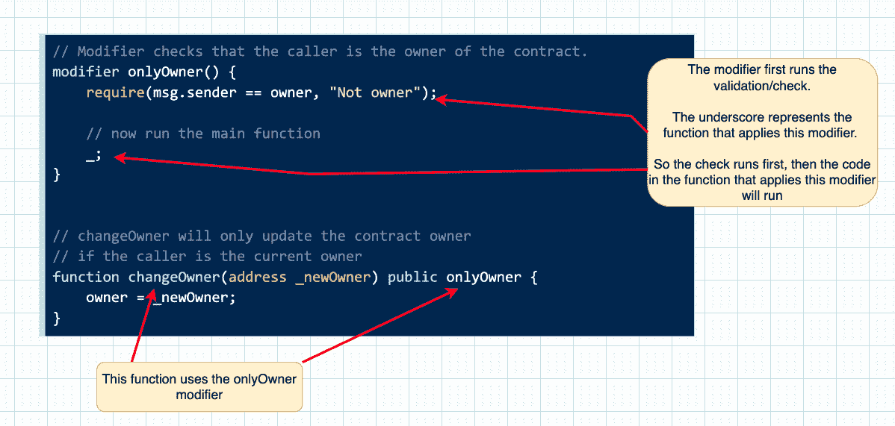

How function modifiers are written, and the role of the underscore symbol

在本例中，`require()`语句在下划线(`changeOwner()`)之前运行，这是确保只有当前所有者才能更改合同所有者的正确方法。

如果您切换了修饰符的行，然后第二个是`require()`语句，那么`changeOwner()`中的代码将首先运行。只有在那之后，`require()`语句才会运行，这将是一个非常不幸的错误！

修饰符也可以接受输入——只需将输入的类型和名称传递给修饰符。

| 修饰符 有效地址(address addr){  //地址不应该是零地址。  要求 (addr！=地址( 0 )， 【地址无效】)； //继续其余的逻辑  _；  }    函数transfer token to(address some address)publicvalid address(some address....T49
T51} |

修饰符是打包逻辑片段的好方法，这些逻辑片段可以在各种智能契约中重用，共同支持 dApp。重用逻辑使你的代码更容易阅读、维护和推理——因此有了这个原则 [DRY](https://en.wikipedia.org/wiki/Don%27t_repeat_yourself) (不要重复自己)。

## Solidity 中的错误处理-要求、断言、恢复

Solidity 中的错误处理可以通过一些不同的关键字和操作来实现。

当出现错误时，EVM 会将所有更改恢复到区块链的状态。换句话说，当抛出一个异常，并且它没有在 try-catch 块中被捕获时，该异常会“冒泡”被调用的方法堆栈，并返回给用户。在当前调用(及其子调用)中对区块链状态所做的所有更改都将被撤销。

也有一些例外，在低级函数中，比如`delegatecall`、`send`、`call`等等，错误会将布尔值`false`返回给调用者，而不是冒泡错误。

作为开发人员，有三种方法可以用来处理和抛出错误。可以用`require()`、`assert()`或者`revert()`。

require 语句计算您指定的布尔条件，如果为 false，它将抛出一个没有数据或包含您提供的字符串的错误:

| 功能 要求示例 () 公共 纯{  要求(msg . value>=1“你至少要付给我 1 个乙醚！”【T31》)；  } |

在继续我们的代码逻辑之前，我们使用`require()`来验证输入，验证返回值，并检查其他条件。

在这个例子中，如果函数的调用者没有发送至少一个以太，函数将恢复并抛出一个字符串消息:“*你必须支付我至少一个以太！*”。

您想要返回的错误字符串是`require()`函数的第二个参数，但它是可选的。没有它，您的代码将抛出一个没有数据的错误——这不是很有用。

关于`require()`的好处是，它将返回未使用的气体，但是在`require()`语句之前使用的气体将会丢失。这就是为什么我们尽早使用`require()`。

一个`assert()`函数与`require()`非常相似，除了它[抛出一个类型为`Panic(uint256)`的错误，而不是`Error(string)`](https://docs.soliditylang.org/en/v0.8.17/control-structures.html#panic-via-assert-and-error-via-require) 。

| 契约 ThrowMe {  函数assert example()publicpure{  assert(地址( this )。balance = =0)；  //做点什么。  }  } |

断言也用于稍微不同的情况——需要不同类型的保护。

最常见的是使用断言来检查“不变的”数据。在软件开发中，不变量是一段或多段数据，其值在程序执行时不会改变。

在上面的代码示例中，协定是一个微小的协定，并不是为了接收或存储任何以太网而设计的。它的设计是为了确保它的契约余额始终为零，这是我们用断言测试的不变量。

内部函数中也会用到调用。它们测试本地状态不包含意外的或不可能的值，但是这些值可能由于契约状态变得“脏”而发生了变化。

正如`require()`所做的那样，`assert()`也将恢复所有的更改。在 Solidity 的 v0.8 之前，`assert()`习惯于用尽所有剩余气体，这与`require()`不同。

一般来说，你可能会更多地使用`require()`而不是`assert()`。

第三种方法是使用`revert()`调用。这通常在与`require()`相同的情况下使用，但是条件逻辑要复杂得多。

另外，使用`revert()`时可以抛出自定义错误。从使用的气体来看，使用自定义错误通常会更便宜，并且从代码和错误可读性的角度来看，通常会提供更多信息。

请注意，我是如何通过在自定义错误的名称前加上合同名称来提高错误的可读性和可追溯性的，这样我们就知道是哪个合同引发了错误。

| 契约 ThrowMe {  //自定义错误  错误 ThrowMe _ bad input(string error msg，uint input num)；    功能revert 示例 ( uint 输入 ) 公共 纯{  如果【如果  }    如果 (输入<0){
回复( 【负数不  }  }  } |

在上面的例子中，我们对一个带有两个特定参数的自定义错误使用了一次 revert，然后我们又对一个只有字符串错误数据的错误使用了 revert。在这两种情况下，区块链状态都将恢复，未使用的气体将返回给调用者。

## 坚实中的继承

继承在面向对象编程(OOP)中是一个强大的概念。我们不会深入到这里的 [OOP](https://www.freecodecamp.org/news/object-oriented-concepts/) 的细节。但是，在编程中思考继承的最佳方式是将其视为一种方式，通过这种方式，代码段通过导入和嵌入数据和函数，从其他代码段“继承”数据和函数。

[Solidity 中的继承](https://goo.gl/maps/YgMqAwFfHUP8EZmS9)也允许开发者访问、使用和修改从继承而来的契约的属性(数据)和功能(行为)。

接收这种继承材料的契约称为派生契约、子契约或子类。其材料可供一个或多个派生合同使用的合同称为父合同。

继承促进了方便和广泛的代码重用——想象一个应用程序代码链，它从其他代码继承而来，而这些代码又从其他代码继承而来，以此类推。我们不需要输入继承的整个层次结构，只需要使用几个关键字就可以“扩展”继承链中所有应用程序代码捕获的功能和数据。通过这种方式，子契约可以从其层次结构中的所有父契约中获益，就像基因可以每一代遗传一样。

与 Java 等一些编程语言不同，Solidity 允许多重继承。多重继承是指派生协定从多个父协定继承数据和方法的能力。换句话说，一个子合同可以有多个父合同。

您可以通过查找关键字`is`找到一个子合同并识别其父合同。

| 契约 A {  字符串公共常量 A _ NAME =【A】；    函数getName()公共 纯 返回 ( 字符串内存 ) {    }  }    契约 B 是一个{  字符串公共常量 B _ NAME =【B】；T79
T82)} |

如果您使用浏览器内的 [Remix IDE](http://remix.ethereum.org) 只部署契约 B，您会注意到契约 B 可以访问`getName()`方法，即使它从未作为契约 B 的一部分写入。当您调用该函数时，它返回“A”，这是在契约 A 中实现的数据，而不是契约 B。契约 B 可以访问存储变量`A_NAME`和`B_NAME`，以及契约 A 中的所有函数

这就是继承的工作方式。这就是契约 B 重用契约 A 中已经编写的代码的方式，这些代码可能是其他人编写的。

Solidity 允许开发人员改变父契约中的功能在派生契约中的实现方式。修改或替换继承代码的功能被称为“重写”。为了理解它，我们来探讨一下当契约 B 试图实现自己的`getName()`函数时会发生什么。

通过向契约 b 添加一个`getName()`来修改代码。确保函数名和签名与契约 A 中的相同。只要函数名和签名相同，子契约在`getName()`函数中的逻辑实现就可以与在父契约中的实现完全不同。

| 契约 A {  字符串公共常量 A _ NAME =【A】；    函数getName()公共 返回 ( 字符串内存{  返回 }  }    契约 B 是一个{  字符串公共常量 B _ NAME =【B】；    函数getName()公共 返回 ( 字符串内存 ) {// …任何你喜欢的逻辑。可以完全不同//从合同中执行 A.  返回B _ NAME；  }  } |

编译器会给出两个错误:

1.  在契约 A 中，它会指出你是“*试图覆盖非虚函数*”，并通过询问你是否忘记添加`virtual`关键字来提示你。
2.  在契约 B 中，它会抱怨`getName()`函数缺少`override`说明符。

这意味着契约 B 中的新`getName`试图覆盖父契约中同名的函数，但是父契约的函数没有被标记为`virtual`，这意味着它不能被覆盖。

您可以更改合同 A 的功能并添加如下`virtual`:

| 函数getName()公共 虚拟 返回 ( 字符串内存){  返回A _ NAMET37
T40)} |

添加关键字`virtual`不会改变该函数在契约 a 中的操作方式，也不要求继承契约**必须**重新实现或覆盖它。这仅仅意味着如果开发者愿意，这个函数**可以被任何派生的契约**覆盖。

添加`virtual`修复了编译器对契约 A 的投诉，但没有修复对契约 B 的投诉。这是因为契约 B 中的`getName`还需要添加`override`关键字，如下所示:

| 函数getName()publicpureoverridereturn(string memory){  returnB _ NAME；  } |

我们还为契约 B 的 getName()添加了关键字`pure`,因为这个函数不改变区块链的状态，并且从一个常量读取(您会记得，常量在编译时被硬编码到字节码中，并且不在存储数据位置中)。

请记住，只有当名字和签名相同时，才需要重写函数。

但是名称相同但参数不同的函数会发生什么呢？当这种情况发生时，这不是超驰，而是超载。没有冲突，因为方法有不同的参数，所以在它们的签名中有足够的信息向编译器显示它们是不同的。

例如，在契约 B 中，我们可以有另一个带参数的`getName()`函数，与父契约 A 的`getName()`实现相比，它实际上给了该函数一个不同的“签名”。重载函数不需要任何特殊的关键字:

| // getName()现在接受字符串参数。//传入“亚伯·林肯”返回字符串“我的名字是:亚伯·林肯”函数getName(字符串内存名称 ) 公共 纯 返回 ( 字符串内存){  字节内存 n = abi.encodePacked  返回 字符串(n)；  } |

不要担心`abi.encodepacked()`方法调用。当我们谈到编码和解码时，我会解释这一点。现在只需要理解`encodepacked()`将字符串编码成字节，然后将它们连接起来，并返回一个字节数组。

我们在本手册的前一部分(在键入下)讨论了实度字符串和字节之间的关系。

此外，由于您已经学习了函数修饰符，所以这是添加修饰符也是可继承的一个好地方。你应该这么做:

| 契约 A {  修饰语 X 虚拟{  //…某种逻辑}  }    合同 B 是一个{  修饰符 X 覆盖{/…在合同 A 中替换 X 的逻辑}  } |

您可能想知道，如果在一个继承链中存在同名和同名的函数，那么将调用哪个版本的函数。

例如，假设有一个继承的契约链，如 A → B → C → D → E，并且它们都有一个`getName()`覆盖前一个父契约中的`getName()`。

哪个`getName()`被调用？答案是最后一个——契约层次结构中“最衍生”的实现。

子协定中的状态变量不能与其父协定具有相同的名称和类型。

例如，下面的协定 B 将不会编译，因为它的状态变量“隐藏”了父协定 a 的状态变量。但是请注意协定 C 如何正确处理这一点:

| 契约一{  字符串公开作者= 【祖斌】；    函数getAuthor()公共 虚拟 返回 ( 字符串内存 ) {    }  } //合同 B 不会编译合同 B 是一份{//不 OK。作者隐藏了契约 A 中的状态变量！  字符串公开作者= 【马克·吐温】；  }  //这个能行。  合同 C 是一个{  建造师(){  作者= 【海明威】；  }  } |

需要注意的是，通过向契约 C 的构造函数中的变量`author`传递新值，我们有效地覆盖了契约 a 中的值，然后调用继承的方法`C.getAuthor()`将返回‘Hemingway’而不是‘Zubin’！

还值得注意的是，当一个合同从一个或多个父合同继承时，在区块链上只创建一个单个(组合)合同。编译器有效地将所有其他契约及其父契约等沿整个层次结构向上编译成单个已编译的契约(称为“扁平”契约)。

## 带有构造函数参数的继承

一些构造函数指定输入参数，因此它们需要您在实例化智能协定时向它们传递参数。

如果该智能协定是父协定，那么它的派生协定也必须传递参数来实例化父协定。

有两种方法可以将参数传递给父协定——要么在列出父协定的语句中，要么直接在每个父协定的构造函数中。您可以在下面看到这两种方法:

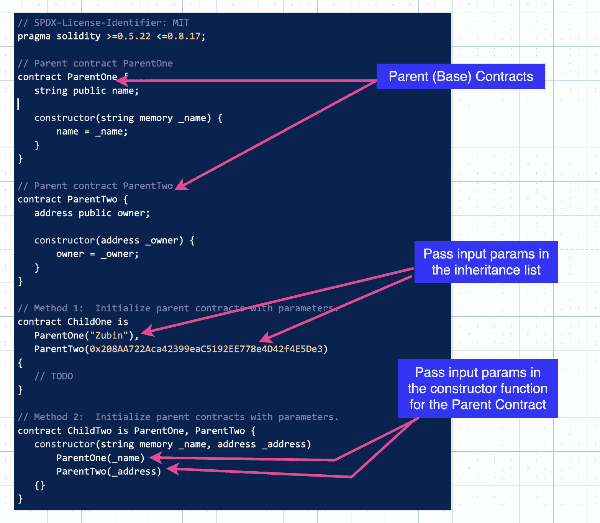

在`ChildTwo`契约的方法 2 中，您会注意到传递给父契约的参数首先被提供给子契约，然后沿着继承链向上传递。

这不是必需的，但却是一种非常常见的模式。关键的一点是，当父契约构造函数希望将数据传递给它们时，我们需要在实例化子契约时提供它们。

## Solidity 中的类型转换和类型转换

有时我们需要将一种数据类型转换成另一种。当我们这样做时，我们需要非常小心地转换数据以及计算机如何理解转换的数据。

正如我们在讨论类型化数据时看到的，JavaScript 有时会对数据做奇怪的事情，因为它是动态类型化的。但是这也是为什么引入类型转换和类型转换的概念是有用的。

以下面的 JavaScript 代码为例:

| vara =【1】  varb = a+9//我们得到字符串‘19’！！  type ofa//stringtype ofb//string |

有两种方法可以将变量`a`转换成整数。第一种称为类型转换，由程序员显式完成，通常涉及使用`()`的类似构造函数的操作符。

| a = 号 (a) //将字符串类型转换为号码显式。  type ofa//number |

| varb = a+9//10。一个数字。更直观！ |

现在让我们将`a`重置为一个字符串，并进行隐式转换，也称为类型转换。这是在程序执行时由编译器隐式完成的。

| a =【1】  varb = a *9//与加法不同，这并不是连接而是隐式地将‘a’转换为数字！
b //数字 9，不出所料！  类型 b //数量typeof a //还是一串…… |

在 Solidity 中，类型转换(显式转换)在某些类型之间是允许的，如下所示:

| uint 256 a =2022T4；  bytes 32 b = bytes 32(a)；
// b 现在的值为  //0x 000000000000000000000000000000000000000000000000007 E6//用  // 64 个十六进制字符表示的 32 字节(256)位数据，其中每个字符为 4 位(0.5 字节)。 |

在这个例子中，我们将一个大小为 256 位的整数(因为 8 位构成 1 个字节，所以这是 32 个字节)转换为一个大小为 32 的字节数组。

由于整数值 2022 和字节值的长度都是 32 字节，因此在转换中没有“丢失”信息。

但是如果你试图将 256 位转换成 18 位(1 字节)会发生什么呢？尝试在基于浏览器的 Remix IDE 中运行以下程序:

| 契约转换{  函数explicit 256 to 8()公共 纯 返回(uint 8){   uint 8 b = uint 8(a)；  回车b； // 230。T56}  } |

为什么整数 2022 会转换成 230？这显然是一个不受欢迎的和意想不到的价值变化。一只虫子，对吗？

原因是大小为 256 位的无符号整数将保存 256 个二进制数字(0 或 1)。因此`a`保存整数值‘2022 ’,该值以位为单位，有 256 位，其中大部分是 0，除了最后 11 位是...(通过将 2022 年从十进制转换成二进制来亲眼看看[这里](https://decimaltobinary.com/256-in-binary))。

另一方面,`b`的值将只有 8 位或数字，即 11100110。这个二进制数，当转换成十进制时(你可以用同一个转换器——只需填在另一个框里！)是 230。不是 2022 年。

Oopsie.

发生了什么事？当我们将整数的大小从 256 位降到 8 位时，我们最终去掉了数据的前三位(11111100110 ),这完全改变了二进制的值！

伙计们，这是信息丢失。

所以当你进行显式造型时，编译器会在某些情况下允许你这样做。但是你可能会丢失数据，编译器会认为你知道你在做什么，因为你明确地要求这样做。这可能是许多错误的来源，所以请确保正确测试代码以获得预期的结果，并且在将数据显式转换为较小的数据时要小心。

转换到更大的尺寸不会导致数据丢失。由于 2022 只需要 11 位来表示，你可以将变量`a`声明为类型`uint16`，然后将它向上转换为类型`uint256`的变量`b`，而不会丢失数据。

另一种有问题的类型转换是当你从无符号整数转换到有符号整数时。试着举一个例子:

| 契约转换{  函数 未签名委托 () 公共 纯 返回 ( int16，uint 16){    uint 16 b = uint 16(a)；  //uint 256 c = uint 256(a)；//编译器会抱怨  返回 (a，b)； // b 是 63514  }  } |

注意，`a`是大小为 16 位的有符号整数，保存-2022 作为(负整数)值。如果我们显式地将它类型强制转换为一个*无符号的*整数值(只有正的)，编译器会让我们这样做。

但是如果你运行代码，你会看到`b`不是-2022 而是 63514！因为`uint`不能保存关于负号的信息，所以它丢失了那些数据，产生的二进制数被转换成一个巨大的十进制数——这显然是不可取的，也是一个错误。

如果您更进一步，取消对赋值为`c`的那一行的注释，您会看到编译器报怨说“*不允许从“int16”到“uint 256”*的显式类型转换”。即使我们在`uint256`中向上转换到更大数量的位，因为`c`是一个无符号整数，它不能保存负号信息。

所以在显式强制转换时，一定要想清楚在你强迫编译器改变数据类型后，这个值的计算结果是什么。它是许多错误和代码错误的根源。

Solidity 类型转换和类型转换还有更多内容，你可以在本文中深入了解一些细节。

## 如何在 Solidity 中使用浮点数

Solidity 不处理小数点。这在将来可能会改变，但是目前你不能真正使用像 93.6 这样的固定(浮动)点数。事实上，在你的 Remix IDE 中输入`int256 floating = 93.6;`将会抛出一个类似于*的错误:类型 rational_const 468 / 5 不能隐式地转换为期望的类型 int256。*

这是怎么回事？468 除以 5 是 93.6，这似乎是一个奇怪的错误，但这基本上是编译器说它不能处理浮点数。

遵循错误的建议，将变量的类型声明为`fixed`或`ufixed16x1`。

| 固定浮动=93.6； |

您将得到一个“*未实现功能错误:尚未实现-固定点类型*”错误。

所以在 Solidity 中，我们通过将浮点数乘以 10 的小数点右边的小数位数的指数来转换成整数(没有小数点)来解决这个问题。

在这种情况下，我们将 93.6 乘以 10 得到 936，我们必须在某个变量中记录我们的因子(10)。如果数字是 93.2355，我们将它乘以 10 的 4 次方，因为我们需要将小数向右移动 4 位以使数字完整。

使用 ERC 令牌时，我们会注意到小数位数通常是 10、12 或 18。

例如，1 Ether 是)wei，也就是 1 后面跟着 18 个零。如果我们想用浮点来表示，我们需要将 100000000000000000 除以(这将得到 1)，但是如果它是 1500000000000000 魏，那么除以将在可靠性方面抛出一个编译器错误，因为它不能处理 1.5 的返回值。

在科学记数法中，10^18 也表示为 1e18，其中 1e 代表 10，其后的数字代表 1e 的幂。

所以下面的代码会产生一个编译器错误:“*返回实参类型 rational_const 3 / 2 不可隐式转换为预期类型…int256* ”:

| 函数 除数 y18()公 纯 返回(int【T22){  返回 1500000000 // 1.5 → Solidity 处理不了这个。} |

上述除法运算的结果是 1.5，但其中有一个小数点，Solidity 目前不支持。因此，Solidity 智能合约返回非常大的数字，通常多达 18 位小数，这超出了 JavaScript 的处理能力。所以你需要在你的前端使用 JavaScript 库适当地处理这个问题，比如为[bignome](https://docs.ethers.io/v5/api/utils/bignumber/)类型实现助手函数的 [Ethersjs](https://docs.ethers.io) 。

## 哈希、ABI 编码和解码

随着您更多地使用 Solidity，您会看到一些听起来很奇怪的术语，如哈希、ABI 编码和 ABI 解码。

虽然这些可能需要一些努力来理解，但它们对于使用加密技术，尤其是以太坊是非常基础的。原则上它们并不复杂，但是一开始可能有点难以理解。

先说哈希。使用加密数学，您可以将任何数据转换成一个(非常大的)唯一整数。这种操作称为哈希。哈希算法有一些关键属性:

1.  它们是确定性的——每次相同的输入都会产生相同的输出。但是用不同的投入产出相同的产出的可能性极小。
2.  如果只有输出，就不可能(或在计算上不可行)对输入进行逆向工程。这是一个单向的过程。
3.  输出的大小(长度)是固定的——无论输入大小如何，算法都会为所有输入生成固定大小的输出。换句话说，散列算法的输出将总是具有固定的位数，这取决于该算法。

有许多算法是哈希的行业标准，但您可能会最常见到 SHA256 和 Keccak256。这些都很像。256 指的是大小——产生的散列中的位数。

例如，进入[这个网站](https://emn178.github.io/online-tools/keccak_256.html)，将“FreeCodeCamp”复制粘贴到文本输入中。使用 Keccak256 算法，输出将(总是)是`796457686bfec5f60e84447d256aba53edb09fb2015bea86eb27f76e9102b67a`。

这是一个 64 字符的十六进制字符串，由于十六进制字符串中的每个字符代表 4 位，所以这个十六进制字符串是 256 位(32 字节长)。

现在，删除文本输入框中除“F”以外的所有内容。结果是一个完全不同的十六进制字符串，但它仍然有 64 个字符。这就是 Keccak265 哈希算法的“固定大小”特性。

现在粘贴回“FreeCodeCamp”并改变任何字符。你可以把 F 变成小写。或者添加一个空格。对于您所做的每个单独的更改，哈希十六进制字符串输出会有很大的变化，但大小是恒定的。

这是哈希算法的一个重要优点。最微小的变化都会极大地改变散列。这意味着您总是可以通过比较它们的散列来测试两个东西是否相同(或者根本没有被篡改)。

在可靠性方面，比较散列比比较原始数据类型更有效。

例如，比较两个字符串通常是通过比较它们的 ABI 编码(字节)形式的散列来完成的。比较两个字符串的可靠性的常用帮助函数如下所示:

| 函数 分隔 ( 字符串内存 str1，字符串内存 str 2)  公共  纯返回 (  } |

我们稍后将讨论什么是 ABI 编码，但是请注意`encodePacked()`的结果是一个`bytes`数组，然后使用 keccak256 算法(这是 Solidity 使用的本机哈希算法)对其进行哈希处理。比较散列输出(256 位整数)的相等性。

现在让我们转向 ABI 编码。首先，我们记得 ABI(应用程序二进制接口)是指定如何与已部署的智能合约交互的接口。ABI 编码是将来自 ABI 的给定元素转换成字节以便 EVM 可以处理它的过程。

EVM 对比特和字节进行计算。因此，编码就是[将结构化输入数据转换成字节](https://stackoverflow.com/questions/14822323/why-is-encoding-and-decoding-needed-for-any-programming-language-database)的过程，这样计算机就可以对其进行操作。解码是将字节转换回结构化数据的反向过程。有时，编码也被称为“序列化”。

你可以在这里阅读更多关于全局变量`abi`提供的 solidity 内置方法，这些方法执行不同类型的编码和解码[。编码数据的方法将它们转换成字节数组(`bytes`数据类型)。相反，解码其输入的方法将 bytes 数据类型作为输入，然后将其转换为编码的数据类型。](https://docs.soliditylang.org/en/latest/cheatsheet.html#global-variables)

您可以在下面的代码片段中观察到这一点:

| //spdx-license-identifier:MIT  pragma solidity ^0 . 8 . 13；    合同编码解码{  //将每个自变量编码成字节  函数 编码(  uint x，  地址 addr，  uint[]调用数据 arr   }    功能 解码(bytes calldata bytes data)    uint[]memory arr  )  {  (x，addr，arr) = abi.decode(bytesData，(uint，address，uint[])；  }  } |

我在 Remix 中运行了上面的内容，并使用了以下`encode()`的输入:1981，0x 3c 44 cddb 6a 900 fa 2b 585 DD 299 e 03d 12 fa 4293 BC，[1，2，3，4]。

而我得到的返回的字节用十六进制形式表示为:`0x00000000000000000000000000000000000000000000000000000000000007bd0000000000000000000000003c44cdddb6a900fa2b585dd299e03d12fa4293bc000000000000000000000000000000000000000000000000000000000000006000000000000000000000000000000000000000000000000000000000000000040000000000000000000000000000000000000000000000000000000000000001000000000000000000000000000000000000000000000000000000000000000200000000000000000000000000000000000000000000000000000000000000030000000000000000000000000000000000000000000000000000000000000004`。

我将它作为我的输入输入到`decode()`函数中，并获得了我最初的三个参数。

因此，编码的目的是将数据转换为 EVM 处理数据所需的字节数据类型。解码将它带回到人类可读的结构化数据中，我们开发人员可以使用这些数据。

## 如何调用合同和使用回退功能

根据智能合约的设计和其中存在的可见性说明符，该合约可以与其他智能合约或外部拥有的帐户进行交互。

通过 Remix 从你的钱包打电话是后者的一个例子，使用 Metamask 也是如此。您还可以通过 EthersJS 和 Web3JS、Hardhat 和 Truffle 工具链等库以编程方式与智能合约进行交互。

出于本 Solidity 手册的目的，我们将使用 Solidity 与另一个合同进行交互。

智能合约调用其他智能合约有两种方式。第一种方法是通过使用接口(我们之前讨论过)直接调用目标契约。或者，如果目标协定被导入到调用协定的范围内，则直接调用它。

这种方法如下图所示:

| 合同目标{  int256 公共计数；    功能 减量 () 公用{  计数-；  }  }    接口 ITarget {  功能 减量 () 外部  }    契约 目标调用方{  功能 调用减量接口【调用  target . decrement()；    }    函数 调用减量直接 ( 目标 _ 目标 )  }  } |

在 Remix 中，您可以首先部署`Target`，并调用`count()`来查看计数变量的默认值是`0`，正如所料。如果调用`decrement()`方法，该值将减 1。

然后你可以部署`TargetCaller`，有两个方法可以调用，这两个方法都会递减`Target`中`count`的值。

注意，这两个方法都使用稍微不同的语法来访问`Target`契约。当使用`ITarget`接口进行交互时，第一个方法接受`Target`的地址，而第二个方法将`Target`视为自定义类型。

第二种方法只有在`Target`契约在与`TargetCaller`相同的文件中声明或导入时才有可能。最常见的情况是，您将与第三方部署的智能合约进行交互，他们为此发布了 ABI 接口。

每调用一次这些方法，`Target`中的`count`的值就会减少`1`。这是与其他智能合约交互的一种非常常见的方式。

第二种方法是使用 Solidity 提供的“低级”调用语法。当您还想向目标合同发送一些以太(值)时，您可以使用此选项。我将在下一节讨论发送值，但现在只需用下面的代码替换 Remix 中的代码:

| 合同目标{  int256 公共计数；    功能 减量(int num)公有 应付{  count = count-num；  }  }   接口 ITarget {  功能 减量 ( }    契约 目标调用者{  函数call decreductive low level  target . decrement { value:0}(5)；    }    //其他递减功能…  } |

您会注意到`decrement()`现在接受一个参数，接口和`Target`契约用这个新的输入数据更新。

接下来要注意的是，`TargetCaller`实现了一个新的函数，这个函数用一个新的语法调用了`decrement()`,解释如下。

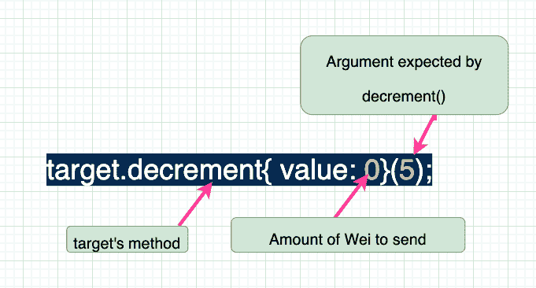

在下一节中，我们将看到调用目标智能契约向其发送以太网的这些低级方法的示例。

但是当你调用一个契约，而它实际上并没有你试图调用的函数，会发生什么呢？

这可能是恶意利用 EVM 的坚固性。或者，更常见的是，它可能会意外发生。例如，当接口中有错误，编译器无法将您发送的函数和参数与契约中实际包含的任何函数和参数进行匹配时，就会出现这种情况。接下来会发生什么？

对于这些情况，许多合同采用一种称为回退功能的特殊功能。这个函数看起来像一个普通的函数，但是它不需要`function`关键字。如果你想让它也处理你的合同被发送的情况，你也必须标记它`payable`。但这不是使您的合同能够收到付款的推荐方式。

让我们通过重新利用我们之前的`Target`、`ITarget`和`TargetCaller`并添加如下回退功能来看一看:

| 合同目标{  int256 公共计数；    功能 减量 () 公有 应付{  count = count-num；  }    回退()外部 应付{ 计数++；  }  }    界面 ITarget {  功能 减量  函数 不存在函数 () 外部；  }    契约 目标调用方{  功能  target . non exist function()；  }  } |

一旦我们部署了一个新的`Target`实例，我们可以调用`count()`并看到它被设置为默认值零。

接下来我们可以部署`TargetCaller`并调用内部调用`nonExistentFunction()`的`callFallback()`方法。

值得注意的是，界面上说`nonExistentFunction()`可用，但实际的`Target`契约没有任何这样的功能。这就是为什么`Target`回退功能被触发，并且 count 的值现在增加了`1`。

回退函数的目的是在没有其他函数可以处理的情况下处理对协定的调用。如果回退被标记为`payable`，回退功能还将使智能合约能够接收以太网(尽管这不是回退的推荐用途)。我们将在下一节讨论这个问题。

## 如何发送和接收以太

要从您的智能合约向目标合约发送以太，您需要使用以下三种内置可靠性方法之一调用目标合约:`transfer`、`send`或`call`。

`transfer`会在失败时抛出一个异常，`send`和`call`会返回一个布尔值，你必须在继续之前检查它。其中，`transfer`和`send`因为安全原因不再被推荐，尽管你仍然可以使用它们，它们也可以工作。

智能合同不能接收以太网，除非在以下情况下:

*   它们实现了`payable`回退或`payable`接收特殊功能，或者
*   当调用契约调用`selfdestruct`并强制目标契约接受其所有剩余以太时强制执行。然后从区块链中删除买入合约。这是一个单独的主题，经常被攻击者恶意使用。

如果您希望您的智能合约接收以太网，通常建议您使用`receive()`函数。你可以通过使用你的后备函数`payable`来逃脱，但是推荐的做法是使用一个`receive()`函数来代替。

如果你只依赖回退函数，你的编译器会用下面的消息向你抱怨:"*警告:这个契约有一个可支付的回退函数，但是没有接收以太函数。请考虑添加接收以太网功能。*

如果你同时拥有`receive`和`fallback`，你可能会有理由怀疑坚固性是如何决定用哪个函数来接收以太的。这个设计决策还会告诉您这些功能的设计目的。

接受意味着接受以太。回退是指处理这样的情况:契约已经被调用，但是正如我们在上一节中讨论的，契约中没有匹配的方法可以处理调用。

通过检查调用者发送的事务中的`msg.data`字段，Solidity 匹配要调用的方法。如果该字段为非空值，并且该值与调用的协定中声明的任何其他函数都不匹配，则触发 fallback 方法。

如果`msg.data`为空，那么它将检查是否有已经实现的接收功能。如果是这样，它会用那个来接受以太。如果不存在接收，它将默认为回退功能。因此，回退是...当其他方法都没有意义时的回退(默认)方法。

`receive`功能是使您的合同收到乙醚的更好方法。您可以在调用智能合约但没有“处理”该调用的任何情况下使用回退功能。

这里有一个非常方便的逻辑树，它显示了 receive 和 fallback 打算处理什么。

| 其中 功能 是 称为回退 () 或 接收 ()？    发 醚  &#124;  味精 。 数据 是 空 ？  /  是 否  / 接收 () 存在 回退()  /  是 否  /  |

(信用:[实例的可靠性](https://solidity-by-example.org/sending-ether/) )

回到我们探索回退函数的例子，我们可以如下将`receive`函数添加到`Target`:

| 合同目标{  int256 公共计数；    功能 减量 () 公有 应付{  count = count-num；  }    回退()外部 应付{ 计数++；  }接收()外部 应付 {  计数+= 5；  }  }    接口 ITarget {  功能(int num)  功能 不存在功能 () 外部；  } 契约 目标调用方{  函数 调用回退【T100  target . non exist function()；  }  } |

我们已经看到了`callFallback`将如何改变`Target`中的计数值。但是如果我们部署一个新的`Target`实例，我们现在可以给它发送 10 个 wei，如下所示，因为它现在有了一个`payable` `receive`函数。发送前 10 个魏(或任何其他金额)`Target`余额为零，如下所示。

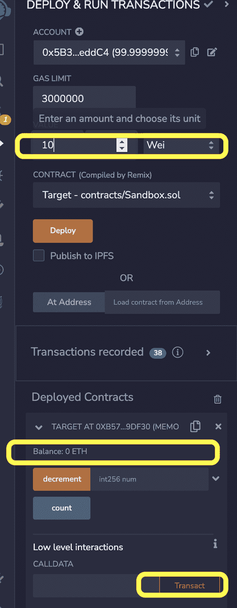

用空 calldata ( `msg.data`)点击交易按钮将改变余额，如下图所示。我们可以检查`count`,看到它增加了 5，这是`receive`函数中的逻辑。


Sending Wei to the Target Contract and observing the updated balance

如果我们调用`callFallback`并给它新`Target`实例的地址，我们会注意到它只增加了`1`。如果我们包括一些魏，那也将增加`Target`的平衡。

因此，任何以太网到智能合约的传输都需要接收智能合约具有能够接收它的`payable`函数。尽管`payable` `receive`函数是接收以太网付款的更好方法，但接收智能合同至少需要一个`payable`回退函数。

## 固体图书馆

在任何编程语言中，库指的是一组助手和实用函数，它们被设计成可以跨多个代码库重用。这些函数解决特定的、重复出现的编程问题。

实际上，图书馆服务于同样的目的，但是有一些特殊的属性。

首先，它们是无状态的——也就是说，它们不存储数据(除了常数，因为它们不会改变区块链的状态)。它们也不能接收值(这意味着它们不能有`payable receive`或`fallback`函数)。

它们也不能从其他协定或库继承，库也不能有子(派生)协定。

库中声明的所有函数都不能是抽象的——也就是说，它们都必须有具体的实现。

因为 Solidity 库是无状态的，所以其中的任何方法都不能修改区块链的状态。这意味着库中的所有方法都是`pure`或`view`函数。

Solidity 库的另一个有趣的属性是，它们不需要导入到您的智能合约中。它们可以作为独立的契约进行部署，然后在所有消费智能契约中通过它们的接口进行调用——就像在传统工程世界中调用 API 服务一样。

然而，只有当库包含公共或外部方法时，这才是正确的。然后，该库可以作为一个独立的契约进行部署，拥有自己的以太坊地址，并且可以被所有使用智能契约的用户调用。

如果库仅包含内部方法，则 EVM 简单地将库代码“嵌入”到使用该库的智能合约中(因为不能从其他智能合约访问内部函数)。

Solidity 中的库具有超越代码重用的优势。在区块链上一次性部署一个库可以避免重复部署或导入库代码，从而节省未来的汽油成本。

让我们看一个简单的库，然后剖析代码，以了解如何使用库的代码。

| 库 WeirdMath {  int 私有常数因子=100；    函数apply factor(int self)publicpurereturns(int  } 函数 添加 ( int self，int numberToAdd)公共  }  |

这个库有两个操作`int`数据类型的方法。第一个参数称为`self`,其原因很快就会清楚。一种方法是取一个数，然后乘以存储在库代码中的常数值。第二种方法接收两个数字，并将它们相加。

现在让我们看看如何在消费智能契约中使用它。

| //SPDX-License-Identifier:MIT    pragma solidity>=0 . 5 . 22<=0 . 8 . 17；    contract StrangeMath {  //方法 1 -使用带点符号的库名  函数multiplyWithFactor(int num)  }      //方法 2 -使用关键字和点符号。  //语法:使用< <库名> >作为要调用方法中第一个参数的数据类型。  使用WeirdMathforint；  功能addTwoNums(int num 1，int num 2)公共 纯  }  } |

首先要注意的是有两种使用`WeirdMath`库的方法。

您可以通过以下方式使用它:

1.  调用库名，后跟您想要调用的函数，或者
2.  直接在您希望函数操作的数据类型上调用函数。该数据类型必须与库函数中的`self`参数类型相同。

第一种方法由代码片段中的方法 1 演示，其中我们用`WeirdMath.add(num1, num2);`调用库。

第二种方法使用 Solidity `using`关键字。表达式`return num1.add(num2);`将`WeirdMath`库的 add 函数应用于`num1`变量。这与将它作为`self`传递是一样的，它是 add 函数的第一个参数。

## Solidity 中的事件和日志

智能合约可以发出事件。事件包含开发人员指定的数据片段。

事件不能由其他智能合约使用。相反，它们作为日志存储在区块链上，并且可以通过从区块链读取的 API 进行检索。

这意味着您的应用程序(最常见的是您的前端应用程序)可以从区块链“读取”包含事件数据的日志。通过这种方式，您的用户界面可以响应区块链上的事件。

这就是应用程序用户界面更新以响应链上事件的方式。由于可以查询区块链上的这些日志，因此日志是一种廉价的存储形式，这一点在前面关于存储区域的讨论中已经讨论过。

智能合约发出的事件可以使用相关的区块链浏览器进行检查，因为公共区块链上的所有内容都是公开可见的。但是如果智能合约的字节码没有被验证，事件数据可能是不可读的(它将被编码)。经过验证的智能合约的事件将是人类可读的。

节点和其他区块链客户端可以监听(订阅)特定事件。在它的核心，这就是[chain link oracle](http://docs.chain.link)的工作方式——分散的 Oracle 节点监听来自智能合约的事件，然后做出相应的响应。他们甚至可以从事件中提取数据，离线运行复杂的资源密集型计算，然后将可加密验证的计算结果提交回区块链。

其他网络 API 和索引服务[如子图](https://thegraph.com/en/)之所以成为可能，是因为能够通过智能合约发出的事件来查询区块链数据。

这是一个事件在 Solidity 中的样子:

| //spdx-license-identifier:MIT  pragma solidity ^0 . 8 . 7；    合同简单存储{  uint 256 favorite number；    事件stored number(  uint 256 索引 oldNumber， //最多允许 3 个索引参数  uint 256 索引 newNumber，  uint 22    功能 存储(uint 256new number)公共{   favorite number = new number；  }    功能 检索 () 公共 查看 }  } |

首先声明一个事件，并指定其参数和数据类型。任何包含关键字`indexed`的数据都被 EVM 索引，因此对区块链日志的查询可以使用索引参数作为过滤器。这使得检索日志更快。

一个事件最多可以存储 4 个索引参数——这取决于它是匿名的还是非匿名的。在实体世界中，索引事件参数也被称为“主题”。

大多数事件是非匿名的，这意味着它们包括关于事件名称和参数的数据。

非匿名事件只允许开发人员指定 3 个主题，因为第一个主题被保留来指定 ABI 编码的十六进制形式的事件签名。你可以在这里阅读更多关于匿名和非匿名话题[。](https://docs.ethers.io/v5/concepts/events/#events-solidity)

你也可以在相关的区块链浏览器上探索事件(比如 [etherscan.io](http://etherscan.io) )。

您可以从两个切入点中的一个着手。您可以直接查看协定的地址，然后转到 Events 选项卡(它将只显示由该协定发出的事件)。或者，您可以转到一个事务散列，检查该事务涉及的所有契约发出的所有事件。

例如，下面是以太坊主网上的 [Chainlink VRF 协调员智能合约的](https://docs.chain.link/vrf/v2/subscription/supported-networks#ethereum-mainnet)事件的截图。

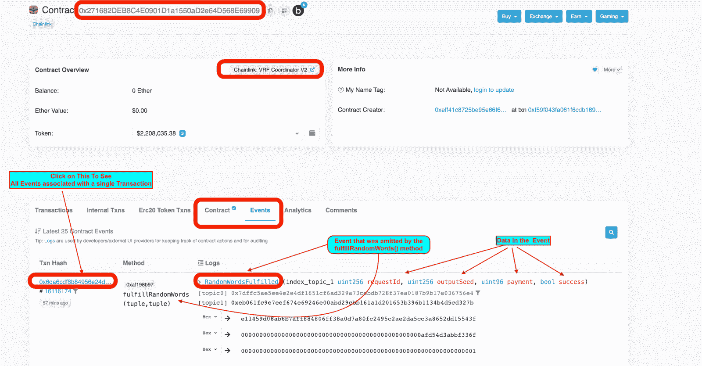

Inspecting the Chainlink VRF Coordinator Contract's events on etherscan

contract 选项卡上有一个绿色的勾号，表示契约已经过验证，因此事件名称和参数是可读的。请花点时间研究这张图片，因为它包含了大量的信息！如果你想在 etherscan 上直接研究它，[点击这里](https://etherscan.io/address/0x271682DEB8C4E0901D1a1550aD2e64D568E69909#events)。

该链式 VRF 协调器契约响应对可加密验证的随机数的请求，并向发出请求的智能契约提供随机数(称为“随机字”)。

如果你想了解“单词”在计算机科学中的含义，看看我和我的同事在这个 [Chainlink 2022 黑客马拉松视频](https://youtu.be/lu3yDJQqqY0?t=2627)中解决这个问题。

当 VRF 协调器契约满足对随机数的请求时，它发出一个`RandomWordsFulfilled`事件。该事件包含 4 条数据，其中第一条数据`requestID`被编入索引。

坚实度事件包含三类数据:

1.  发出事件的协定的地址。
2.  主题(用于过滤日志查询的索引事件参数)。
3.  非索引参数，称为“数据”，它们是 ABI 编码的，用十六进制表示。该数据需要按照“ABI 编码和解码”一节中描述的方式进行 ABI 解码。

在 Remix 中工作时，您还可以在控制台中检查事件，如下所示:

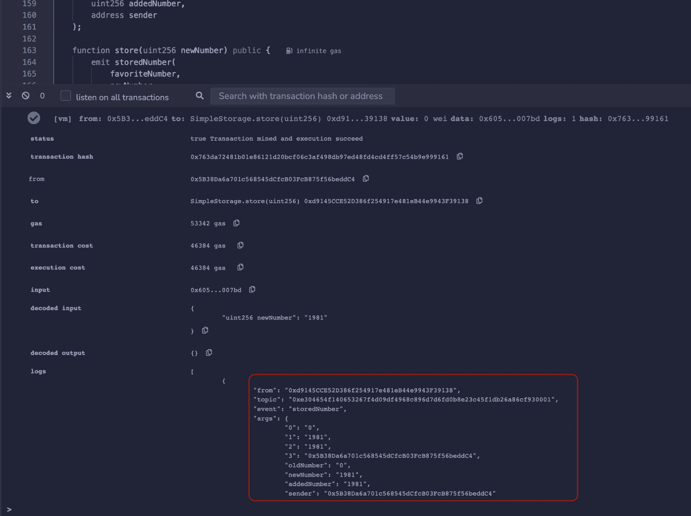

Inspecting Event data in the Remix Browser IDE

您还可以使用 EthersJS 中的契约收据对象以编程方式访问事件[。使用我们在上面的 SimpleStorage 契约中使用的代码片段，我们可以使用下面的 JavaScript 通过 EthersJS 和 Hardhat 访问事件:](https://stackoverflow.com/questions/73230175/does-etherjs-transactionreceipt-have-an-events-object)

| const 交易响应=【await】简单存储。商店(【1981】)log(receipt . events[0]。args . new number . tostring())//1981 |

您还可以在前端应用程序中使用 EtherJs 库等库来[监听事件](https://docs.ethers.io/v5/getting-started/#getting-started--events)和[过滤历史事件](https://docs.ethers.io/v5/getting-started/#getting-started--history)。当应用程序需要响应区块链上的事件时，这两种方法都很有用。

## 固体中的时间逻辑

固体中的时间是相对于添加到区块链的每个块来指定的。

全局变量`block.timestamp`指的是块生成并添加到区块链的时间，以毫秒为单位。毫秒计数指的是自 Unix 纪元开始以来已经过去的毫秒数(在计算中，这是 1970 年 1 月 1 日)。

与 Web2 引用以毫秒为单位的时间戳不同，该值可能不会随着每毫秒而递增。

一个块通常包含几个事务，并且由于`block.timestamp`指的是块被挖掘的时间，所以被挖掘的块中的所有事务将具有相同的时间戳值。因此时间戳实际上指的是块的时间，而不是调用者发起事务的时间。

Solidity 支持直接引用以下时间单位:秒、分、小时、天、周。

因此，我们可以做类似于`uint lastWeek = block.timestamp - 1 weeks;`的事情来计算当前区块被开采前一周的时间戳，精确到毫秒。该值将与`block.timestamp - 7 days;`相同。

您还可以使用它来计算未来的到期日期，例如，您可能希望从现在到下周之间可以进行某项操作。你可以用`uint registrationDeadline = block.timestamp + 1 weeks;`来做这件事，然后我们可以使用`registrationDeadline`作为函数中的验证或保护，如下所示:

| 功能 注册投票人 ( 地址投票人 ) 公开 查看{  要求(block . timestamp<=注册截止日期，“注册截止日期已过。”);   //登记选民....  } |

在这个函数中，只有当当前块的时间戳没有超过注册截止时间时，我们才注册投票人。

当我们希望确保某些操作在正确的时间或间隔内执行时，这种逻辑被广泛使用。

这也是配置 [Chainlink Automation](https://docs.chain.link/chainlink-automation/introduction/) 的方式之一，这是一种分散的方式，可以自动执行您的智能合同。Chainlink 分散式 oracle 网络可以配置为自动触发您的智能合约，您可以通过检查条件(包括与时间相关的条件)来运行各种自动化。这些广泛用于空投、促销、特殊奖励、赢取奖金等等。

## 结论和更多资源

恭喜你。你完成了这段史诗般的旅程。如果你已经花时间消化了这本手册，并在 Remix IDE 中运行了一些代码，那么你现在已经在 Solidity 方面受过训练了。

从这里开始，这是一个实践，重复和经验的问题。当您着手构建下一个令人敬畏的分散式应用程序时，请记住重温基础知识并关注安全性。安全性在 Web3 领域尤为重要。

你可以从 [OpenZeppelin 的博客](https://blog.openzeppelin.com/)和[的比特轨迹](https://www.trailofbits.com/resources)资源中获得关于最佳实践的信息。

您还可以通过参加我的同事 Patrick Collins 在 freeCodeCamp 上发布的完整的[端到端全栈区块链开发者课程](https://www.youtube.com/watch?v=gyMwXuJrbJQ&t=59657s)来获得更多实践经验(这是免费的！).

还有其他资源，如 blockchain.education 和 freeCodeCamp 自己即将推出的 Web3 课程，可以巩固你的学习。

在任何情况下，无论您处于什么样的经验水平，本手册都可以成为您快速更新基本概念的“桌面伴侣”。

需要记住的重要一点是，Web3 技术一直在发展。迫切需要开发人员愿意应对复杂的挑战，学习新的技能，并解决分散架构带来的重要问题。

那可能(也应该)是你！所以跟着你的好奇心走，不要害怕一路上的挣扎。

我打算再次更新这本手册。因此，如果你看到任何不太正确、过时或不清楚的东西，就在推特上提出来，并[标记我](https://twitter.com/zubinpratap)和 freeCodeCamp——大声呼喊你们所有人，让这本手册保持新鲜。

现在…去做牛逼吧！

### **发布脚本**

如果你真的想转行做代码，你可以了解更多关于我从律师到软件工程师的经历。查看 [freeCodeCamp 播客](http://podcast.freecodecamp.org/)的[第 53 集](http://podcast.freecodecamp.org/53-zubin-pratap-from-lawyer-to-developer)以及[的《来自放弃者的教训》第 207 集](https://lessonsfromaquitter.com/episode207/)。这些为我的职业转变提供了蓝图。

如果你有兴趣改变你的职业，成为一名专业的程序员，请点击这里。如果这是你梦寐以求的，你也可以看看我在[举办的关于](http://futurecoderstraining.com/)[转行做代码](http://futurecoderstraining.com/)的免费网络研讨会。