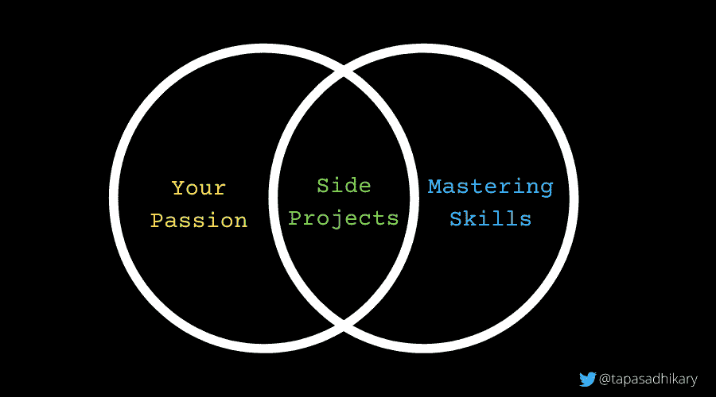

# 作为一名软件开发人员，如何每天学习新的东西

> 原文：<https://www.freecodecamp.org/news/learn-something-new-every-day-as-a-software-developer/>

作为软件开发人员，我们必须愿意不断学习。虽然它有助于我们完成日常工作任务，但跟上新技术和创新同样重要。

在花了 12 年多的时间从事软件开发之后，我发现坚持不懈地学习很有挑战性。但是如果你确定了你热爱的东西，并且沿着一条坚实的学习道路前进，你会一直学到新的东西。

本文将讨论开发人员教育的三个重要领域，您可能会发现它们对您的学习之旅有所帮助。在过去的两年里，我一直沿着这条路走下去，我已经看到了非常积极的结果。

# TL；速度三角形定位法(dead reckoning)

通过以下方式成为更好的学习者和开发者:

*   成为开发者社区的活跃分子
*   开始你自己的博客
*   建设辅助项目

这篇文章是关于经验分享和如何让这些事情发生。冷静下来，带着开放的心态去读它，🧘.

# 成为开发者社区的积极分子

当我们把所有的注意力集中在某件事情上时，学习就变得容易了。然而，具有挑战性的部分是知道该学什么。

我们应该从哪里寻求帮助？有没有更好的办法解决某些问题？我们如何不重新发明轮子？最后，我们如何让它持续发生？

Developer Community to grow together

成为您感兴趣领域的一个或多个开发人员社区的一员，有助于以一种重要的方式解决这些挑战。

如果你在早期没有任何贡献，也不要担心。坚持下去，吸收信息，与志同道合的人联系，观察最佳实践，等等。你最终会有所贡献，这是自然而然的。

我发现这些开发者社区、学习平台和社交媒体渠道非常有帮助。请注意，这些意见是我的，你们中的一些人可能不同意，或者可能想在列表中添加更多的内容。这很好，欢迎你这样做。

*   [**Twitter**](https://twitter.com/home) **:** 当涉及到与技术、软指导以及快速获取提示和技巧时，Twitter 是一个很好的平台。如果你还没有，创建一个 Twitter 账户并加入这个平台。关注你感兴趣的话题(使用标签)和那些发布你想了解更多信息的人。从 2009 年开始，我就有一个休眠的 Twitter 账户！一年前开始积极使用，可以告诉你它有多有用。
*   [**freeCodeCamp**](https://www.freecodecamp.org/)**:**如果你在寻找专注的学习，不妨试试 freeCodeCamp。有上千小时的学习资料，而且是免费的！你应该[加入论坛](https://forum.freecodecamp.org/)以获得见解、答案和解决方案。你也可以获得免费认证。如果你正在阅读这篇文章，你可能已经知道 freeCodeCamp 课程了。
*   **这是当今发展最快的开发者社区之一。一旦你加入了 Hashnode，你就可以关注你选择的标签和社区成员，在你的 feed 中看到文章、讨论等等。另一个 USP 是你可以获得一个免费的博客域名，在那里你可以写文章并发表。**
*   **[**Dev.to**](http://dev.to) **:** 一个成熟的开发者社区，拥有许多撰写文章、讨论话题、分享思想的贡献者。您可以关注您感兴趣的主题来创建个性化订阅源。**
*   **[**daily . dev:**](https://daily.dev/)**这还不完全是一个社区，而是很多人的聚合。它很好地为你提供了一份你可能感兴趣的热门文章列表，而不用去寻找它们。只要安装他们的浏览器扩展，你就可以开始了。****

****除了我上面提到的那些，LinkedIn ， [Reddit](https://www.reddit.com/) ， [Hackernoon](http://hackernoon.com/) ， [Code Newbie](https://www.codenewbie.org/) ，[Women of Code](https://www.womenwhocode.com/)， [StackOverflow](https://stackoverflow.com/) 和 [Hackernews](https://news.ycombinator.com/) 是其他值得关注的精彩社区。****

# ****开始你自己的博客(或类似的东西)****

****传授和分享知识是获得更多知识的最佳途径。一个话题不学好，就教不好，这是一个普遍的真理。****

****拥有一个科技博客(或者类似 YouTube 的频道)可以帮助你参与到学习分享的循环中。****

****

Start Blogging**** 

****在过去的几年里，我从博客中得到的主要收获是:****

*   ****你对一个主题的研究有助于你获得更多的相关知识。****
*   ****通过为开发人员社区做贡献，您可以在该社区获得更好的可见性。****
*   ****你为自己创建了一系列可以参考或使用的知识库(可能作为演讲者，在视频中，等等)。****
*   ****如果你不是说英语的人，用英语写文章，这有助于你更好地掌握这门语言。****
*   ****你可以通过提及你的博客为自己创建一个强大的投资组合。我发现，当你打算为像 freeCodeCamp News 这样的出版物写作时，这是有益的。****
*   ****最后但同样重要的是，你可以从你的文章中赚钱。一些出版物按文章付费给你。你可以成为某个组织博客项目的客座作家。如果你刚刚开始写博客，不要太强调赚钱。专注于向社区提供有用的内容。那么财务机会自然就来了。****

****如果你正在考虑用你自己的域名开一个博客，看看 [Hashnode](https://hashnode.com/) 。它拥有你作为博客平台所需要的一切，而且是免费的。如果您有一个现有的域，您也可以将其映射到该域。所以试试吧。****

****或者，你可以在 [dev.to](http://dev.to/) 、 [Hackernoon](http://hackernoon.com/) 以及我上面提到的其他社区上发表文章。你也可以申请成为[自由码营新闻](https://www.freecodecamp.org/news/developer-news-style-guide/)的撰稿人。****

# ****构建一些辅助项目****

****润色你的学习和激发你的激情的一个有效方法是做兼职项目。在很多情况下，你可能无法在工作中从事任何你喜欢的技术。但是没人能阻止你用这项技术做副业。****

****

Do Side Projects**** 

****兼职项目可以帮助您:****

*   ****活出你的激情****
*   ****产生想法****
*   ****学习新技能****
*   ****在新的领域成长****
*   ****为开源社区做贡献****
*   ****赚取奖励和金钱****

********

****那么如何开始呢？首先，您应该用 GitHub (或任何其他源代码库管理器)创建一个账户[。](https://github.com/)****

****接下来，您需要知道要构建什么。从小处着手，计划做很多项目。试着做一些你可能想用的东西。****

****然后确定你从中学到了什么，把它写成一篇文章，然后发表。****

# ****在我们走之前****

****我希望你觉得这篇文章很有见地，并激励你去检查这些学习领域。我想听听你的意见。我们来连线。****

****你会发现我活跃在 [Twitter (@tapasadhikary)](https://twitter.com/tapasadhikary) 。请随意跟我来。你可以从我的[博客(blog.greenroots.info)](https://blog.greenroots.info/) 中读到一些其他的文章。我所有的副业项目都在 [GitHub (atapas)](https://github.com/atapas) ，而且是开源的。请随意尝试/叉/关注。****

****您可能还喜欢:****

*   ****[如何毫不费力地找到博客内容创意？](https://blog.greenroots.info/how-to-find-blog-content-ideas-effortlessly-ckghrjv5200o7rhs1ewn40102)****
*   ****[作为开发者为什么需要做副业？](https://blog.greenroots.info/why-do-you-need-to-do-side-projects-as-a-developer-ckhn5m5km05teajs1fvjd7u5f)****
*   ****[你可能会发现有用的 16 个 GitHub 辅助项目库](https://blog.greenroots.info/16-side-project-github-repositories-you-may-find-useful-ckk50hic406quhls1dui2d6sd)****
*   ****技术写作者指南****