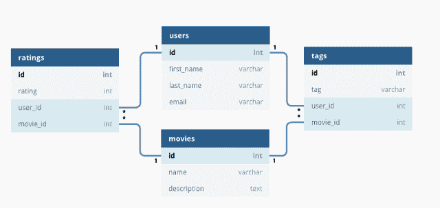
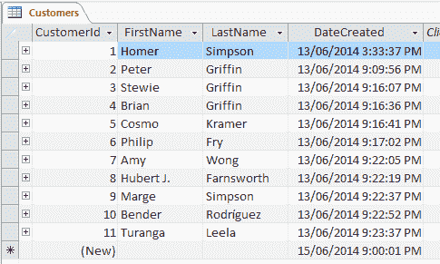

# SQL 命令备忘单——如何在 10 分钟内学会 SQL

> 原文：<https://www.freecodecamp.org/news/learn-sql-in-10-minutes/>

我是一名人工智能研究人员，所以我主要处理的事情之一是数据。一大堆。

随着每天*产生超过[2.5 EB 的数据，这些数据需要存储在某个我们需要时可以访问的地方也就不足为奇了。](https://www.socialmediatoday.com/news/how-much-data-is-generated-every-minute-infographic-1/525692/)*

*本文将带您浏览一个可破解的备忘单，让您快速启动并运行 SQL。*

## *什么是 SQL？*

*SQL 代表结构化查询语言。它是用于关系数据库管理系统的语言。SQL 现在被用来在关系数据库中存储、检索和操作数据。*

*下面是基本关系数据库的样子:*

*

[Source](https://assets-global.website-files.com/5debb9b4f88fbc3f702d579e/5e3c1a71724a38245aa43b02_99bf70d46cc247be878de9d3a88f0c44.png)* 

*使用 SQL，我们可以通过编写*查询来与数据库交互。**

*下面是一个示例查询:*

```
*`SELECT * FROM customers;`*
```

*使用这个`SELECT`语句，查询从客户表的所有列中选择 *all* 数据，并返回如下数据:*

*

Source: Database Guide* 

*星号通配符(*)表示“*所有*”，并选择*所有*行和列。我们可以用特定的列名来代替它——这里查询只返回那些列*

```
*`SELECT FirstName, LastName FROM customers;`*
```

*添加一个`WHERE`子句允许您过滤返回的内容:*

```
*`SELECT * FROM customers WHERE age >= 30 ORDER BY age ASC;`*
```

*该查询返回 products 表中所有的数据，这些数据的 *age* 值大于 30。*

*使用`ORDER BY`关键字只是意味着使用年龄列从最低值到最高值对结果进行排序*

*使用`INSERT INTO`语句，我们可以向表中添加新数据。下面是一个向 customers 表添加新用户的基本示例:*

```
*`INSERT INTO customers(FirstName, LastName, address, email)
VALUES ('Jason', 'Dsouza', 'McLaren Vale, South Australia', 'test@fakeGmail.com');`*
```

*当然，这些例子仅仅展示了 SQL 语言所能做的一小部分工作。我们将在本指南中了解更多。*

## *为什么要学 SQL？*

*我们生活在大数据时代，数据被广泛用于发现见解，并为战略、营销、广告和大量其他业务提供信息。*

*像谷歌、亚马逊、AirBnb 这样的大企业利用大型关系数据库作为改善客户体验的基础。理解 SQL 不仅对数据科学家和分析师来说是一项很好的技能，对每个人来说也是如此。*

*几分钟前，当你在谷歌上搜索你最喜欢的鞋子时，突然在 Youtube 上看到一则关于鞋子的广告，你是怎么想的？这就是 SQL(或 SQL 的一种形式)在起作用！*

## *SQL vs MySQL*

*在我们继续之前，我只想澄清一个经常混淆的话题——SQL 和 MySQL 之间的区别。事实证明，它们*不是*同一个东西！*

*SQL 是一种语言，而 MySQL 是实现 SQL 的系统。*

***SQL** 概述了允许您编写管理关系数据库的查询的语法。*

*MySQL 是运行在服务器上的数据库*系统*。它允许您使用 SQL 语法编写查询来管理 MySQL 数据库。*

*除了 MySQL，还有其他实现 SQL 的系统。一些比较受欢迎的包括:*

*   *SQLite*
*   *Oracle 数据库*
*   *一种数据库系统*
*   *Microsoft SQL Server*

## *如何安装 MySQL*

*在大多数情况下，MySQL 是数据库管理系统的首选。许多流行的内容管理系统(如 Wordpress)默认使用 MySQL，因此使用 MySQL 来管理这些应用程序可能是个好主意。*

*为了使用 MySQL，您需要在您的系统上安装它:*

### *在 Windows 上安装 MySQL*

*在 Windows 上安装 MySQL 的推荐方法是使用来自 MySQL 网站的 MSI 安装程序。*

*该资源将指导您完成安装过程。*

### *在 macOS 上安装 MySQL*

*在 macOS 上，安装 MySQL 还需要下载一个[安装程序。](https://dev.mysql.com/doc/mysql-osx-excerpt/8.0/en/osx-installation-pkg.html)*

*此资源将引导您完成安装过程。*

## *如何使用 MySQL*

*现在 MySQL 已经安装在您的系统上，我建议您使用某种类型的 *SQL 管理应用程序*来使管理您的数据库变得更加容易。*

*有许多应用程序可供选择，它们基本上做同样的工作，所以使用哪一个取决于你自己的个人偏好:*

*   *Oracle 开发的 MySQL 工作台*
*   *[phpMyAdmin](http://phpmyadmin.net/) (在网络浏览器中运行)*
*   *[HeidiSQL](https://www.heidisql.com/) **(推荐 Windows 使用)***
*   *[续作 Pro](https://www.sequelpro.com/) **(推荐用于 macOS)***

*当您准备开始编写自己的 SQL 查询时，可以考虑导入虚拟数据，而不是创建自己的数据库。*

*这里有一些[虚拟数据库](https://dev.mysql.com/doc/index-other.html)，可以免费下载。*

## *SQL cheat sheet–锦上添花*

### *SQL 关键字*

*在这里，您可以找到 SQL 语句中使用的关键字集合、描述以及适当的示例。一些更高级的关键字有自己的专用部分。*

*在一个例子旁边提到 MySQL 的地方，这意味着这个例子只适用于 MySQL 数据库(相对于任何其他数据库系统)。*

```
*`ADD -- Adds a new column to an existing table

ADD CONSTRAINT -- Creates a new constraint on an existing table, which is used to specify rules for any data in the table.

ALTER TABLE -- Adds, deletes or edits columns in a table. It can also be used to add and delete constraints in a table, as per the above.

ALTER COLUMN -- Changes the data type of a table’s column.

ALL -- Returns true if all of the subquery values meet the passed condition.

AND -- Used to join separate conditions within a WHERE clause.

ANY -- Returns true if any of the subquery values meet the given condition.

AS -- Renames a table or column with an alias value which only exists for the duration of the query.

ASC -- Used with ORDER BY to return the data in ascending order.

BETWEEN -- Selects values within the given range.

CASE -- Changes query output depending on conditions.

CHECK -- Adds a constraint that limits the value which can be added to a column.

CREATE DATABASE -- Creates a new database.

CREATE TABLE -- Creates a new table. 

DEFAULT -- Sets a default value for a column

DELETE -- Delete data from a table.

DESC -- Used with ORDER BY to return the data in descending order.

DROP COLUMN -- Deletes a column from a table.

DROP DATABASE -- Deletes the entire database.

DROP DEAFULT -- Removes a default value for a column.

DROP TABLE -- Deletes a table from a database.

EXISTS -- Checks for the existence of any record within the subquery, returning true if one or more records are returned.

FROM -- Specifies which table to select or delete data from.

IN --  Used alongside a WHERE clause as a shorthand for multiple OR conditions.

INSERT INTO -- Adds new rows to a table.

IS NULL -- Tests for empty (NULL) values.

IS NOT NULL -- The reverse of NULL. Tests for values that aren’t empty / NULL.

LIKE -- Returns true if the operand value matches a pattern.

NOT -- Returns true if a record DOESN’T meet the condition.

OR -- Used alongside WHERE to include data when either condition is true.

ORDER BY -- Used to sort the result data in ascending (default) or descending order through the use of ASC or DESC keywords.

ROWNUM -- Returns results where the row number meets the passed condition.

SELECT -- Used to select data from a database, which is then returned in a results set.

SELECT DISTINCT -- Sames as SELECT, except duplicate values are excluded.

SELECT INTO -- Copies data from one table and inserts it into another.

SELECT TOP -- Allows you to return a set number of records to return from a table.

SET -- Used alongside UPDATE to update existing data in a table.

SOME -- Identical to ANY.

TOP -- Used alongside SELECT to return a set number of records from a table.

TRUNCATE TABLE -- Similar to DROP, but instead of deleting the table and its data, this deletes only the data.

UNION -- Combines the results from 2 or more SELECT statements and returns only distinct values.

UNION ALL -- The same as UNION, but includes duplicate values.

UNIQUE -- This constraint ensures all values in a column are unique.

UPDATE -- Updates existing data in a table.

VALUES -- Used alongside the INSERT INTO keyword to add new values to a table.

WHERE -- Filters results to only include data which meets the given condition.`* 
```

### *SQL 中的注释*

*注释允许您解释 SQL 语句的各个部分，而无需直接执行。*

*在 SQL 中，有两种类型的注释，单行和多行。*

#### *SQL 中的单行注释*

*单行注释以'-'开头。这两个字符之后到行尾的任何文本都将被忽略。*

```
*`-- This part is ignored

SELECT * FROM customers;`*
```

#### *SQL 中的多行注释*

*多行注释以/*开始，以*/结束。它们跨越多行，直到找到结束字符。*

```
*`/*

This is a multiline comment.
It can span across multiple lines.

*/

SELECT * FROM customers;

/*

This is another comment. 
You can even put code within a comment to prevent its execution

SELECT * FROM icecreams;

*/`*
```

### *MySQL 中的数据类型*

*创建新表或编辑现有表时，必须指定每列接受的数据类型。*

*[在本例](https://www.datadriveninvestor.com/2020/05/04/could-machine-learning-and-nlp-have-predicted-oils-crash-the-answer-is-yes/)中，传递给`id`列的数据必须是 int(整数)，而`FirstName`列的数据类型是`VARCHAR`，最多 255 个字符。*

```
*`CREATE TABLE customers(
id int,
FirstName varchar(255)
);`*
```

#### *1.字符串数据类型*

```
*`CHAR(size) -- Fixed length string which can contain letters, numbers and special characters. The size parameter sets the maximum string length, from 0 – 255 with a default of 1.

VARCHAR(size) -- Variable length string similar to CHAR(), but with a maximum string length range from 0 to 65535.

BINARY(size) -- Similar to CHAR() but stores binary byte strings.

VARBINARY(size) -- Similar to VARCHAR() but for binary byte strings.

TINYBLOB -- Holds Binary Large Objects (BLOBs) with a max length of 255 bytes.

TINYTEXT -- Holds a string with a maximum length of 255 characters. Use VARCHAR() instead, as it’s fetched much faster.

TEXT(size) -- Holds a string with a maximum length of 65535 bytes. Again, better to use VARCHAR().

BLOB(size) -- Holds Binary Large Objects (BLOBs) with a max length of 65535 bytes.

MEDIUMTEXT -- Holds a string with a maximum length of 16,777,215 characters.

MEDIUMBLOB -- Holds Binary Large Objects (BLOBs) with a max length of 16,777,215 bytes.

LONGTEXT -- Holds a string with a maximum length of 4,294,967,295 characters.

LONGBLOB -- Holds Binary Large Objects (BLOBs) with a max length of 4,294,967,295 bytes.

ENUM(a, b, c, etc…) -- A string object that only has one value, which is chosen from a list of values which you define, up to a maximum of 65535 values. If a value is added which isn’t on this list, it’s replaced with a blank value instead.

SET(a, b, c, etc…) -- A string object that can have 0 or more values, which is chosen from a list of values which you define, up to a maximum of 64 values.`* 
```

#### *2.数字数据类型*

```
*`BIT(size) -- A bit-value type with a default of 1\. The allowed number of bits in a value is set via the size parameter, which can hold values from 1 to 64.

TINYINT(size) -- A very small integer with a signed range of -128 to 127, and an unsigned range of 0 to 255\. Here, the size parameter specifies the maximum allowed display width, which is 255.

BOOL -- Essentially a quick way of setting the column to TINYINT with a size of 1\. 0 is considered false, whilst 1 is considered true.

BOOLEAN	-- Same as BOOL.

SMALLINT(size) -- A small integer with a signed range of -32768 to 32767, and an unsigned range from 0 to 65535\. Here, the size parameter specifies the maximum allowed display width, which is 255.

MEDIUMINT(size) -- A medium integer with a signed range of -8388608 to 8388607, and an unsigned range from 0 to 16777215\. Here, the size parameter specifies the maximum allowed display width, which is 255.

INT(size) -- A medium integer with a signed range of -2147483648 to 2147483647, and an unsigned range from 0 to 4294967295\. Here, the size parameter specifies the maximum allowed display width, which is 255.

INTEGER(size) -- Same as INT.

BIGINT(size) -- A medium integer with a signed range of -9223372036854775808 to 9223372036854775807, and an unsigned range from 0 to 18446744073709551615\. Here, the size parameter specifies the maximum allowed display width, which is 255.

FLOAT(p) -- A floating point number value. If the precision (p) parameter is between 0 to 24, then the data type is set to FLOAT(), whilst if it's from 25 to 53, the data type is set to DOUBLE(). This behaviour is to make the storage of values more efficient.

DOUBLE(size, d) -- A floating point number value where the total digits are set by the size parameter, and the number of digits after the decimal point is set by the d parameter.

DECIMAL(size, d) -- An exact fixed point number where the total number of digits is set by the size parameters, and the total number of digits after the decimal point is set by the d parameter.

DEC(size, d) -- Same as DECIMAL.`*
```

#### *3.日期/时间数据类型*

```
*`DATE -- A simple date in YYYY-MM–DD format, with a supported range from ‘1000-01-01’ to ‘9999-12-31’.

DATETIME(fsp) -- A date time in YYYY-MM-DD hh:mm:ss format, with a supported range from ‘1000-01-01 00:00:00’ to ‘9999-12-31 23:59:59’. By adding DEFAULT and ON UPDATE to the column definition, it automatically sets to the current date/time.

TIMESTAMP(fsp) -- A Unix Timestamp, which is a value relative to the number of seconds since the Unix epoch (‘1970-01-01 00:00:00’ UTC). This has a supported range from ‘1970-01-01 00:00:01’ UTC to ‘2038-01-09 03:14:07’ UTC.
By adding DEFAULT CURRENT_TIMESTAMP and ON UPDATE CURRENT TIMESTAMP to the column definition, it automatically sets to current date/time.

TIME(fsp) -- A time in hh:mm:ss format, with a supported range from ‘-838:59:59’ to ‘838:59:59’.

YEAR -- A year, with a supported range of ‘1901’ to ‘2155’.`*
```

### *SQL 运算符*

#### *1.SQL 中的算术运算符*

```
*`+ -- Add
– -- Subtract
* -- Multiply
/ -- Divide
% -- Modulus`*
```

#### *2.SQL 中的按位运算符*

```
*`& -- Bitwise AND
| -- Bitwise OR
^-- Bitwise XOR`*
```

#### *3.SQL 中的比较运算符*

```
*`= -- Equal to
> -- Greater than
< -- Less than
>= -- Greater than or equal to
<= -- Less than or equal to
<> -- Not equal to`*
```

#### *4.SQL 中的复合运算符*

```
*`+= -- Add equals
-= -- Subtract equals
*= -- Multiply equals
/= -- Divide equals
%= -- Modulo equals
&= -- Bitwise AND equals
^-= -- Bitwise exclusive equals
|*= -- Bitwise OR equals`*
```

### *SQL 函数*

#### *1.SQL 中的字符串函数*

```
*`ASCII -- Returns the equivalent ASCII value for a specific character.

CHAR_LENGTH -- Returns the character length of a string.

CHARACTER_LENGTH -- Same as CHAR_LENGTH.

CONCAT -- Adds expressions together, with a minimum of 2.

CONCAT_WS -- Adds expressions together, but with a separator between each value.

FIELD -- Returns an index value relative to the position of a value within a list of values.

FIND IN SET -- Returns the position of a string in a list of strings.

FORMAT -- When passed a number, returns that number formatted to include commas (eg 3,400,000).

INSERT -- Allows you to insert one string into another at a certain point, for a certain number of characters.

INSTR -- Returns the position of the first time one string appears within another.

LCASE -- Converts a string to lowercase.

LEFT -- Starting from the left, extracts the given number of characters from a string and returns them as another.

LENGTH -- Returns the length of a string, but in bytes.

LOCATE -- Returns the first occurrence of one string within another,

LOWER -- Same as LCASE.

LPAD -- Left pads one string with another, to a specific length.

LTRIM -- Removes any leading spaces from the given string.

MID -- Extracts one string from another, starting from any position.

POSITION -- Returns the position of the first time one substring appears within another.

REPEAT -- Allows you to repeat a string

REPLACE -- Allows you to replace any instances of a substring within a string, with a new substring.

REVERSE	-- Reverses the string.

RIGHT -- Starting from the right, extracts the given number of characters from a string and returns them as another.

RPAD -- Right pads one string with another, to a specific length.

RTRIM -- Removes any trailing spaces from the given string.

SPACE -- Returns a string full of spaces equal to the amount you pass it.

STRCMP -- Compares 2 strings for differences

SUBSTR -- Extracts one substring from another, starting from any position.

SUBSTRING -- Same as SUBSTR

SUBSTRING_INDEX	-- Returns a substring from a string before the passed substring is found the number of times equals to the passed number.

TRIM --	Removes trailing and leading spaces from the given string. Same as if you were to run LTRIM and RTRIM together.

UCASE -- Converts a string to uppercase.

UPPER -- Same as UCASE.`*
```

#### *2.SQL 中的数值函数*

```
*`ABS -- Returns the absolute value of the given number.

ACOS -- Returns the arc cosine of the given number.

ASIN -- Returns the arc sine of the given number.

ATAN -- Returns the arc tangent of one or 2 given numbers.

ATAN2 -- Returns the arc tangent of 2 given numbers.

AVG -- Returns the average value of the given expression.

CEIL -- Returns the closest whole number (integer) upwards from a given decimal point number.

CEILING -- Same as CEIL.

COS -- Returns the cosine of a given number.

COT -- Returns the cotangent of a given number.

COUNT -- Returns the amount of records that are returned by a SELECT query.

DEGREES -- Converts a radians value to degrees.

DIV -- Allows you to divide integers.

EXP -- Returns e to the power of the given number.

FLOOR -- Returns the closest whole number (integer) downwards from a given decimal point number.

GREATEST -- Returns the highest value in a list of arguments.

LEAST -- Returns the smallest value in a list of arguments.

LN -- Returns the natural logarithm of the given number.

LOG -- Returns the natural logarithm of the given number, or the logarithm of the given number to the given base.

LOG10 -- Does the same as LOG, but to base 10.

LOG2 -- Does the same as LOG, but to base 2.

MAX -- Returns the highest value from a set of values.

MIN -- Returns the lowest value from a set of values.

MOD -- Returns the remainder of the given number divided by the other given number.

PI -- Returns PI.

POW -- Returns the value of the given number raised to the power of the other given number.

POWER -- Same as POW.

RADIANS -- Converts a degrees value to radians.

RAND -- Returns a random number.

ROUND -- Rounds the given number to the given amount of decimal places.

SIGN -- Returns the sign of the given number.

SIN -- Returns the sine of the given number.

SQRT -- Returns the square root of the given number.

SUM -- Returns the value of the given set of values combined.

TAN -- Returns the tangent of the given number.

TRUNCATE -- Returns a number truncated to the given number of decimal places.`*
```

#### *3.SQL 中的日期函数*

```
*`ADDDATE -- Adds a date interval (eg: 10 DAY) to a date (eg: 20/01/20) and returns the result (eg: 20/01/30).

ADDTIME -- Adds a time interval (eg: 02:00) to a time or datetime (05:00) and returns the result (07:00).

CURDATE -- Gets the current date.

CURRENT_DATE -- Same as CURDATE.

CURRENT_TIME -- Gest the current time.

CURRENT_TIMESTAMP -- Gets the current date and time.

CURTIME -- Same as CURRENT_TIME.

DATE -- Extracts the date from a datetime expression.

DATEDIFF -- Returns the number of days between the 2 given dates.

DATE_ADD -- Same as ADDDATE.

DATE_FORMAT -- Formats the date to the given pattern.

DATE_SUB -- Subtracts a date interval (eg: 10 DAY) to a date (eg: 20/01/20) and returns the result (eg: 20/01/10).

DAY -- Returns the day for the given date.

DAYNAME -- Returns the weekday name for the given date.

DAYOFWEEK -- Returns the index for the weekday for the given date.

DAYOFYEAR -- Returns the day of the year for the given date.

EXTRACT -- Extracts from the date the given part (eg MONTH for 20/01/20 = 01).

FROM DAYS -- Returns the date from the given numeric date value.

HOUR -- Returns the hour from the given date.

LAST DAY -- Gets the last day of the month for the given date.

LOCALTIME -- Gets the current local date and time.

LOCALTIMESTAMP -- Same as LOCALTIME.

MAKEDATE -- Creates a date and returns it, based on the given year and number of days values.

MAKETIME -- Creates a time and returns it, based on the given hour, minute and second values.

MICROSECOND -- Returns the microsecond of a given time or datetime.

MINUTE -- Returns the minute of the given time or datetime.

MONTH -- Returns the month of the given date.

MONTHNAME -- Returns the name of the month of the given date.

NOW -- Same as LOCALTIME.

PERIOD_ADD -- Adds the given number of months to the given period.

PERIOD_DIFF -- Returns the difference between 2 given periods.

QUARTER -- Returns the year quarter for the given date.

SECOND -- Returns the second of a given time or datetime.

SEC_TO_TIME -- Returns a time based on the given seconds.

STR_TO_DATE -- Creates a date and returns it based on the given string and format.

SUBDATE -- Same as DATE_SUB.

SUBTIME -- Subtracts a time interval (eg: 02:00) to a time or datetime (05:00) and returns the result (03:00).

SYSDATE -- Same as LOCALTIME.

TIME -- Returns the time from a given time or datetime.

TIME_FORMAT -- Returns the given time in the given format.

TIME_TO_SEC -- Converts and returns a time into seconds.

TIMEDIFF -- Returns the difference between 2 given time/datetime expressions.

TIMESTAMP -- Returns the datetime value of the given date or datetime.

TO_DAYS -- Returns the total number of days that have passed from ‘00-00-0000’ to the given date.

WEEK -- Returns the week number for the given date.

WEEKDAY -- Returns the weekday number for the given date.

WEEKOFYEAR -- Returns the week number for the given date.

YEAR -- Returns the year from the given date.

YEARWEEK -- Returns the year and week number for the given date.`*
```

#### *4.SQL 中的其他函数*

```
*`BIN -- Returns the given number in binary.

BINARY -- Returns the given value as a binary string.

CAST -- Converst one type into another.

COALESCE -- From a list of values, returns the first non-null value.

CONNECTION_ID -- For the current connection, returns the unique connection ID.

CONV -- Converts the given number from one numeric base system into another.

CONVERT -- Converts the given value into the given datatype or character set.

CURRENT_USER -- Returns the user and hostname which was used to authenticate with the server.

DATABASE -- Gets the name of the current database.

GROUP BY -- Used alongside aggregate functions (COUNT, MAX, MIN, SUM, AVG) to group the results.

HAVING -- Used in the place of WHERE with aggregate functions.

IF -- If the condition is true it returns a value, otherwise it returns another value.

IFNULL -- If the given expression equates to null, it returns the given value.

ISNULL -- If the expression is null, it returns 1, otherwise returns 0.

LAST_INSERT_ID -- For the last row which was added or updated in a table, returns the auto increment ID.

NULLIF -- Compares the 2 given expressions. If they are equal, NULL is returned, otherwise the first expression is returned.

SESSION_USER -- Returns the current user and hostnames.

SYSTEM_USER -- Same as SESSION_USER.

USER -- Same as SESSION_USER.

VERSION -- Returns the current version of the MySQL powering the database.`*
```

### *SQL 中的通配符*

*在 SQL 中，通配符是与关键字`LIKE`和`NOT LIKE`一起使用的特殊字符。这使我们能够相当有效地搜索具有复杂模式的数据。*

```
*`% -- Equates to zero or more characters.
-- Example: Find all customers with surnames ending in ‘ory’.
SELECT * FROM customers
WHERE surname LIKE '%ory';

_ -- Equates to any single character.
-- Example: Find all customers living in cities beginning with any 3 characters, followed by ‘vale’.
SELECT * FROM customers
WHERE city LIKE '_ _ _vale';

[charlist] -- Equates to any single character in the list.
-- Example: Find all customers with first names beginning with J, K or T.
SELECT * FROM customers
WHERE first_name LIKE '[jkt]%';`*
```

### *SQL 键*

*在关系数据库中，有一个*主键*和*外键*的概念。在 SQL 表中，它们作为约束包含在内，其中一个表可以有一个主键、一个外键或两者都有。*

#### *1.SQL 中的主键*

*主键让表中的每条记录都被唯一地标识。每个表只能有一个主键，并且可以将该约束分配给任何单个列或列的组合。但是，这意味着该列中的每个值都必须是唯一的。*

*通常在一个表中，ID 列是一个主键，通常与关键字`AUTO_INCREMENT`成对出现。这意味着该值会随着新记录的创建而自动增加。*

#### *示例(MySQL)*

*创建一个新表，并将主键设置为 ID 列。*

```
*`CREATE TABLE customers (
id int NOT NULL AUTO_INCREMENT,
FirstName varchar(255),
Last Name varchar(255) NOT NULL,
address varchar(255),
email varchar(255),
PRIMARY KEY (id)
);`*
```

#### *2.SQL 中的外键*

*您可以将外键应用于一列或多列。您使用它来将关系数据库中的两个表链接在一起。*

*包含外键的表被称为*子键*，*

*包含被引用(或候选)关键字的表称为*父*表。*

*这实质上意味着列数据在两个表之间共享，因为外键还可以防止插入父表中不存在的无效数据。*

#### *示例(MySQL)*

*创建一个新表，并将引用其他表中 id 的任何列转换为外键。*

```
*`CREATE TABLE orders (
id int NOT NULL,
user_id int,
product_id int,
PRIMARY KEY (id),
FOREIGN KEY (user_id) REFERENCES users(id),
FOREIGN KEY (product_id) REFERENCES products(id)
);`*
```

### *SQL 中的索引*

*索引是可以分配给频繁搜索的列的属性，以使数据检索过程更快、更有效。*

```
*`CREATE INDEX -- Creates an index named ‘idx_test’ on the first_name and surname columns of the users table. In this instance, duplicate values are allowed.
CREATE INDEX idx_test
ON users (first_name, surname);
CREATE UNIQUE INDEX -- The same as the above, but no duplicate values.
CREATE UNIQUE INDEX idx_test
ON users (first_name, surname);
DROP INDEX -- Removes an index.
ALTER TABLE users
DROP INDEX idx_test;`*
```

### *sql 连接*

*在 SQL 中，`JOIN`子句用于返回一个结果，该结果根据两个表中的一个公共列组合了多个表中的数据。*

*有许多不同的连接可供您使用:*

*   ***Inner Join(默认):**返回在两个表中具有匹配值的任何记录。*
*   ***Left Join:** 返回第一个表中的所有记录，以及第二个表中任何匹配的记录。*
*   ***Right Join:** 返回第二个表中的所有记录，以及第一个表中的所有匹配记录。*
*   ***完全连接:**当存在匹配时，返回两个表中的所有记录。*

*可视化连接如何工作的一种常见方式如下:*

*

[Source](https://websitesetup.org/sql-cheat-sheet/): Website Setup* 

```
*`SELECT orders.id, users.FirstName, users.Surname, products.name as ‘product name’
FROM orders
INNER JOIN users on orders.user_id = users.id
INNER JOIN products on orders.product_id = products.id;`*
```

### *SQL 中的视图*

*视图本质上是存储在数据库中的一个标签下的 SQL 结果集，因此您可以在以后返回它，而不必重新运行查询。*

*当您有一个可能需要很多次的昂贵的 SQL 查询时，这些特别有用。因此，不用反复运行它来生成相同的结果集，您只需运行一次，并将其保存为视图。*

#### *如何在 SQL 中创建视图*

*要创建视图，您可以这样做:*

```
*`CREATE VIEW priority_users AS
SELECT * FROM users
WHERE country = ‘United Kingdom’;`*
```

*以后，如果您需要访问存储的结果集，您可以这样做:*

```
*`SELECT * FROM [priority_users];`*
```

#### *如何替换 SQL 中的视图*

*使用`CREATE OR REPLACE`命令，您可以像这样更新一个视图:*

```
*`CREATE OR REPLACE VIEW [priority_users] AS
SELECT * FROM users
WHERE country = ‘United Kingdom’ OR country=’USA’;`*
```

#### *如何在 SQL 中删除视图*

*要删除一个视图，只需使用`DROP VIEW`命令。*

```
*`DROP VIEW priority_users;`*
```

## *结论*

*大多数网站和应用程序都以某种方式使用关系数据库。这使得 SQL 非常有价值，因为它允许您创建更复杂的功能性系统。*

*请务必在 Twitter 上[关注我，了解未来文章的更新。快乐学习！](http://twitter.com/jasmcaus)*