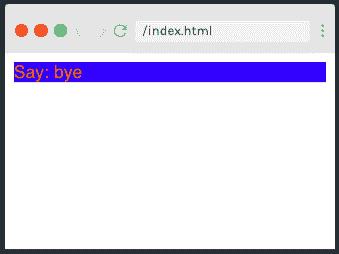
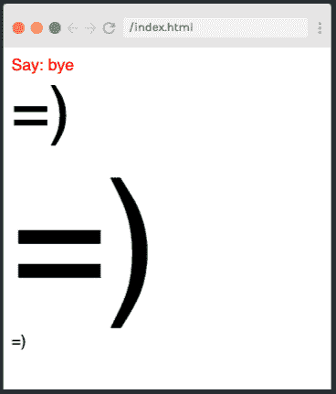
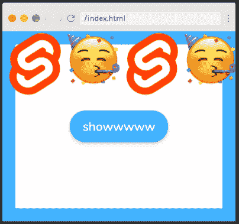

# 5 分钟学会苗条

> 原文：<https://www.freecodecamp.org/news/learn-svelte-in-5-minutes/>

本文为您提供了一个关于 Svelte 的闪电般的概述，Svelte 是一个 Javascript 框架，它让您编写更少的代码，不使用虚拟 DOM，并创建真正的反应式应用程序。

好像这还不够，苗条也是超直观的！它是为开发人员设计的，旨在使编码更容易，bug 消除更快，开发人员的工作生活更快乐。

如果这听起来正合你的口味，那就继续读下去吧！

虽然 5 分钟不足以教你深入苗条，但它确实可以让你对基本要素有一个扎实的了解，包括:

*   成分
*   导入和导出
*   模板
*   事件处理
*   事件调度
*   反应

如果你想在读完这篇文章后了解更多关于苗条身材的知识，请查看 Scrimba 网站上的全部课程。在那里，你将了解更多苗条的特征，并有机会通过一系列互动挑战来测试你的新技能。

现在，让我们从基础开始！

## 成分

[](https://scrimba.com/p/pG6X6UG/cNDg9yHB?utm_source=dev.to&utm_medium=referral&utm_campaign=glearnsvelte_5_minute_article) 
*(点击图片进入课程。)*

首先，我们将看看如何构建一个苗条的组件，它可以包含三个部分；`<script>`，包含 Javascript，`<style>`，包含 CSS 和 HTML，使用来自`<script>`标签的 JS。

```
<script>
    let say = 'hi';
</script>

<style>
    div {
        color: red;
    }
</style>

<div>
    Say: {say}
</div> 
```

**注意:**一个苗条的组件最起码需要的是 HTML，所以即使没有`<script>`和`<style>`标签，这个应用程序仍然可以工作。

## 导入和导出

使用框架的一大好处是能够通过将代码分割成独立的组件来模块化代码。然后使用`import`关键字将组件导入主应用程序:

```
 import Face from './Face.svelte'; 
```

与其他框架不同，`export`关键字不需要在应用程序的其他地方使用组件。相反，它用于从父元素向其子元素传递参数或道具。

例如，我们可以在组件中设置一个默认大小的大小属性:

```
<script>
    export let size = 1;
</script>

<div style="font-size: {size}em">=)</div> 
```

这使我们可以轻松地在我们的`App.svelte`文件中调整导入组件的大小:

```
<script>
    import Face from './Face.svelte';
</script>

<Face size="4" />
<Face size="10" />
<Face /> 
```

DOM 上显示的各种大小如下:

[](https://scrimba.com/p/pG6X6UG/cbDNVncg?utm_source=dev.to&utm_medium=referral&utm_campaign=glearnsvelte_5_minute_article) 
*(点击图片进入课程。)*

前往 Scrimba 上的[课程，查看并体验完整代码。](https://scrimba.com/p/pG6X6UG/cbDNVncg?utm_source=dev.to&utm_medium=referral&utm_campaign=glearnsvelte_5_minute_article)

## 模板

苗条的[模板语法](https://scrimba.com/p/pG6X6UG/cMZrQds2?utm_source=dev.to&utm_medium=referral&utm_campaign=glearnsvelte_5_minute_article)是一个很棒的特性，它允许我们在 HTML 中添加 if 语句和 for 循环。

if 语句的语法如下所示:

```
<Container>
    {#if say}
        <div>
            Hi!
        </div>

    {/if}
</Container> 
```

而 for 循环如下:

```
{#each [2,1,0] as faceIndex}
        <Face index={faceIndex} />
    {/each} 
```

## 事件处理

为了允许用户与我们的应用程序交互，我们需要事件处理程序。在[这个稀松布](https://scrimba.com/p/pG6X6UG/caZ3J6U3?utm_source=dev.to&utm_medium=referral&utm_campaign=glearnsvelte_5_minute_article)中，我们看到如何给`<button>`添加一个简单的`on:click`来显示我们应用的标题:

```
<button on:click={() => {showHeader = true}}>show</button> 
```

这是一个多么好的头球..！
[](https://scrimba.com/p/pG6X6UG/caZ3J6U3?utm_source=dev.to&utm_medium=referral&utm_campaign=glearnsvelte_5_minute_article) 
*(点击图片进入课程。)*

不过，这里有一个问题——它只适用于本地 HTML `<button>`标签，而不适用于名为`<Button>`的导入组件。

幸运的是，我们可以通过使用**事件转发**来解决这个问题，也就是在组件文件的原生`<button>`标签中添加一个`on:click`:

```
<button on:click>
        <slot></slot>
</button> 
```

## 事件调度

[](https://scrimba.com/p/pG6X6UG/cD4bKDuD?utm_source=dev.to&utm_medium=referral&utm_campaign=glearnsvelte_5_minute_article) 
*(点击图片进入课程。)*
事件调度是 Svelte 的一大特色，它允许我们对多个动作使用同一个元素，从而提高了代码的可用性。

在[这个稀松布](https://scrimba.com/p/pG6X6UG/cD4bKDuD?utm_source=dev.to&utm_medium=referral&utm_campaign=glearnsvelte_5_minute_article)中，我们学习如何使用一个`<Button>`组件来显示和隐藏一个元素。

我们在`<Button>`组件文件中创建一个事件调度程序，如下所示:

```
<script>
    import {createEventDispatcher} from 'svelte';
    const dispatch = createEventDispatcher();    
</script> 
```

然后，我们将 dispatcher 添加到本地 HTML `<button>`中，如下所示:

```
<button on:click={() => dispatch('show')}>
    Show
</button>
<button on:click={() => dispatch('hide')}>
    Hide
</button> 
```

最后，我们在`App.svelte`文件中声明按钮的功能选项如下:

```
<Buttons on:show={() => {showHeader = true}} on:hide={() => {showHeader = false}} /> 
```

我们可以通过使用事件变量(`e`)在调度中向上传递值来重构这一点。在这种情况下，我们的`App.svelte`文件中的`<Button>`如下所示:

```
<Buttons on:click={(e) => {showHeader = e.detail}} /> 
```

而我们的组件文件中的原生 HTML 看起来像这样:

```
<button on:click={() => dispatch('click', true)}>
    Show
</button>
<button on:click={() => dispatch('click', false)}>
    Hide
</button> 
```

## 反应

如果您想让一段代码在每次相关变量更新时都重新运行，那么 Svelte 的独特特性，[反应语句](https://scrimba.com/p/pG6X6UG/caZ3yBAB?utm_source=dev.to&utm_medium=referral&utm_campaign=glearnsvelte_5_minute_article)正适合您。我们用`$:`声明一个反应语句如下:

```
let score = 0;
    $: smileySays = 'Hi there, your score is: ' + score; 
```

也可以在反应性语句中运行 if 语句。这样做的代码如下所示:

```
let score = 0;
    $: smileySays = 'Hi there, your score is: ' + score;
    $: if (score < -4) smileySays = 'Wow your score is low!' 
```

这就是我们在 5 分钟的苗条之旅中能看到的所有特征。我希望您发现它很有用，并受到启发，亲自尝试这个框架，测试您新发现的技能。

不要忘记查看 Scrimba 的完整课程[，了解更多苗条的特征，并尝试编码挑战。](https://scrimba.com/course/glearnsvelte?utm_source=dev.to&utm_medium=referral&utm_campaign=glearnsvelte_5_minute_article)

无论您的编码之旅将带您走向何方，祝您学习愉快:)