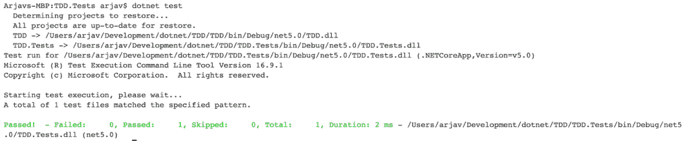
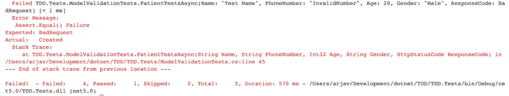
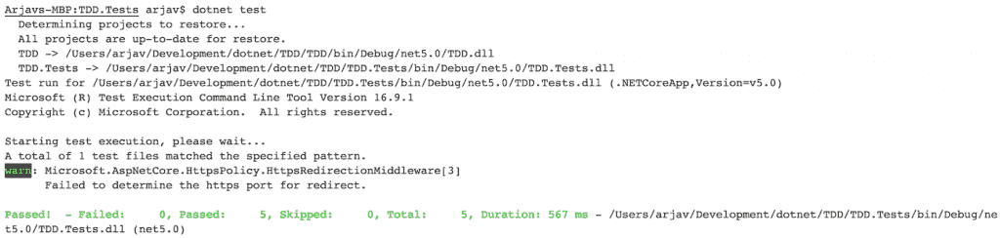

# 中的集成测试学习测试驱动开发。NET 5.0

> 原文：<https://www.freecodecamp.org/news/learn-tdd-with-integration-tests-in-net-5-0/>

测试驱动开发是科技行业中一个备受争议的概念。开发人员想知道他们是否应该实践 TDD，它有多大的优势，等等。

那么什么是测试驱动开发，或者 TDD 呢？简单地说，TDD 要求您在将代码投入生产之前对其进行测试。

现在，对于你应该在 TDD 中包含什么类型的测试，有很多观点。例如，你应该包括单元测试，集成测试，系统测试，甚至 UAT 吗？

在本文中，我们将通过一个真实的例子来展示如何用。NET 5.0 和 TDD 方法。

对于编写测试，我们将使用 XUnit 框架，因为它比 NUnit 或 MSTest 测试框架更广泛。如果你想进一步了解这些框架之间的区别，这里的是一篇很好的文章。

其次，VS 代码一直是我选择的 IDE，但是你也可以用 Visual Studio。

让我们首先列出我们的项目需求。

## 项目要求

TDD 要求对工作范围有非常清晰的理解。没有这种清晰性，所有的测试用例可能都不会被覆盖。

让我们定义一下我们所说的工作范围。我们将为医院开发一个病人入院系统。

### 业务需求

*   一家医院有 X 间 ICU 病房、Y 间高级病房和 Z 间普通病房。
*   ICU 和高级病房一次只能容纳一名患者，而普通病房可以容纳两名患者。每个房间都有房间号。
*   入院时，病人必须提供姓名、年龄、性别和电话号码。
*   可以通过姓名或电话号码搜索患者。
*   同一名患者不能在住院期间入住多张病床。
*   如果所有的房间都住满了，病人就不能住院。

### 模型验证规则

基于以上需求，有两个模型是我们需要担心的，分别是病人和房间。

*   病人的年龄在 0 到 150 岁之间。他们的名字长度应该在 2 到 40 个字符之间。性别可以是男性、女性和其他。电话号码的长度应该在 7 到 12 之间，并且应该都是数字。
*   房间类型可以是“ICU”、“高级”或“普通”。

### 要实现的测试用例

现在，我们已经定义了我们的规则和需求，让我们开始创建测试用例。由于这是一个基本的 CRUD 应用程序，我们将主要进行集成测试。

#### 患者测试案例

*   做所有的模型验证测试。
*   同一病人入院两次
*   两次检查同一个病人。
*   允许同一患者同时进入多个房间。
*   用电话号码和姓名搜索患者。

## TDD 设置

在上面的部分中，我们收集了我们的项目需求。接下来，我们定义了模型。最后，我们创建了将要实现的测试用例列表。

打开您的终端并运行下面的脚本来创建和设置一个新项目。

```
mkdir TDD
cd TDD
dotnet new sln
dotnet new webapi --name TDD
dotnet new xunit --name TDD.Tests
cd TDD
dotnet add package Microsoft.EntityFrameworkCore --version 5.0.5
cd ../TDD.Tests
dotnet add reference ../TDD/TDD.csproj
dotnet add package Microsoft.EntityFrameworkCore --version 5.0.5
dotnet add package Microsoft.AspNetCore.Hosting --version 2.2.7
dotnet add package Microsoft.AspNetCore.Mvc.Testing --version 5.0.5
dotnet add package Microsoft.EntityFrameworkCore.InMemory --version 5.0.5
cd ..
dotnet sln add TDD/TDD.csproj
dotnet sln add TDD.Tests/TDD.Tests.csproj
code . 
```

上面的脚本创建了一个名为 *TDD.sln* 的解决方案文件。其次，我们为 TDD 和 TDD.Tests 创建两个项目。最后，我们将项目添加到解决方案中，并在 VS 代码中打开项目。

在我们开始测试之前，我们还有一些设置要做。基本上，集成测试是在不模仿的情况下测试特定的模块。所以我们将通过 TestServer 来模拟我们的应用程序。

### 自定义 WebApplicationFactory

为了模仿测试服务器，有一个名为[web application factory](https://docs.microsoft.com/en-us/dotnet/api/microsoft.aspnetcore.mvc.testing.webapplicationfactory-1?view=aspnetcore-5.0)(WAF)的类，它在内存中引导应用程序。

在你的 TDD 里。Tests 项目用下面的代码创建一个名为 *PatientTestsDbWAF.cs* 的文件。

```
using System.Linq;
using Microsoft.EntityFrameworkCore;
using Microsoft.AspNetCore.Hosting;
using Microsoft.AspNetCore.Mvc.Testing;
using Microsoft.Extensions.DependencyInjection;
using Microsoft.AspNetCore;

namespace TDD.Tests
{
    public class PatientTestsDbWAF&lt;TStartup&gt; : WebApplicationFactory&lt;TStartup&gt; where TStartup : class
    {

        protected override IWebHostBuilder CreateWebHostBuilder()
        {
            return WebHost.CreateDefaultBuilder()
                .UseStartup&lt;TStartup&gt;();
        }
        protected override void ConfigureWebHost(IWebHostBuilder builder)
        {
            builder.ConfigureServices(async services =&gt;
           {
               // Remove the app's DbContext registration.
               var descriptor = services.SingleOrDefault(
                      d =&gt; d.ServiceType ==
                          typeof(DbContextOptions&lt;DataContext&gt;));

               if (descriptor != null)
               {
                   services.Remove(descriptor);
               }

               // Add DbContext using an in-memory database for testing.
               services.AddDbContext&lt;DataContext&gt;(options =&gt;
                  {
                      // Use in memory db to not interfere with the original db.
                      options.UseInMemoryDatabase("PatientTestsTDD.db");
                  });
           });
        }
    }
} 
```

我们正在删除应用程序的 DbContext，并在内存中添加一个**db context。这是一个必要的步骤，因为我们不想干扰原始数据库。**

其次，我们用一些虚拟数据初始化数据库。

由于 DataContext 是一个自定义类，它会给编译器带来错误。所以我们需要创造它。

### 数据上下文

在您的 **TDD 项目**中，用以下代码创建一个名为 *DataContext.cs* 的文件:

```
using Microsoft.EntityFrameworkCore;

namespace TDD
{
    public class DataContext : DbContext
    {
        public DataContext(DbContextOptions options) : base(options) { }

        // For storing the list of patients and their state
        public DbSet&lt;Patient&gt; Patient { get; set; }

        // For the storying the rooms along with their types and capacity
        public DbSet&lt;Room&gt; Room { get; set; }

        // For logging which patients are currently admitted to which room
        public DbSet&lt;RoomPatient&gt; RoomPatient { get; set; }

    }
} 
```

这里的 Patient、Room 和 RoomPatient 是具有所需属性的实体类，我们接下来将创建它们。

### 添加患者属性

同样，在您的 **TDD 项目**中，创建一个名为 *Patient.cs* 的文件，并粘贴以下代码:

```
using System;
using System.ComponentModel.DataAnnotations;
using System.ComponentModel.DataAnnotations.Schema;

namespace TDD
{
    public class Patient
    {
        [Key]
        [DatabaseGenerated(DatabaseGeneratedOption.Identity)]
        public int Id { get; set; }

        public String Name { get; set; }

        public String PhoneNumber { get; set; }

        public int Age { get; set; }

        public String Gender { get; set; }
    }
} 
```

### 添加房间属性

使用以下代码创建另一个名为 *Room.cs* 的文件:

```
using System;
using System.ComponentModel.DataAnnotations;
using System.ComponentModel.DataAnnotations.Schema;

namespace TDD
{
    public class Room
    {
      	[Key]
        [DatabaseGenerated(DatabaseGeneratedOption.Identity)]
        public int Id { get; set; }

        public String RoomType { get; set; }

        public int CurrentCapacity { get; set; }

        public int MaxCapacity { get; set; }
    }
} 
```

### 添加 RoomPatient 属性

使用以下代码创建最后一个模型文件 *RoomPatient.cs* :

```
using System.ComponentModel.DataAnnotations;
using System.ComponentModel.DataAnnotations.Schema;

namespace TDD
{
    public class RoomPatient
    {
        [Key]
        [DatabaseGenerated(DatabaseGeneratedOption.Identity)]
        public int Id { get; set; }

        [Required]
        public int RoomId { get; set; }

        [ForeignKey("RoomId")]
        public Room Room { get; set; }

        [Required]
        public int PatientId { get; set; }

        [ForeignKey("PatientId")]
        public Patient Patient { get; set; }
    }
} 
```

现在你不应该再得到任何编译错误。

最后，删除 *WeatherForecast.cs* 和*weather forecast controller . cs*文件。

在 VS 代码中进入您的终端，运行下面的命令:

```
cd TDD.Tests
dotnet test 
```

您将看到一个漂亮的绿色结果，表示一项测试已经通过。



Test Success

### 创建患者控制器

不幸的是。NET 本身没有提供直接测试模型的方法。所以我们必须创建一个控制器来测试它。

继续在 **TDD 项目**的控制器文件夹中创建一个 *PatientController.cs* 文件，代码如下:

```
using Microsoft.AspNetCore.Mvc;

namespace TDD.Controllers
{
    [Route("api/[controller]")]
    [ApiController]
    public class PatientController : Controller
    {
        [HttpPost]
        public IActionResult AddPatient([FromBody] Patient Patient)
        {
            // TODO: Insert the patient into db
            return Created("/patient/1", Patient);
        }
    }
} 
```

我们创建了一个 API 来添加一个病人。为了测试我们的模型，我们将调用这个 API。

这就是我们开始测试所需要的。

## 模型验证测试

既然我们已经设置了测试的基本代码，让我们编写一个失败的测试。我们将从模型验证测试开始我们的测试。

### 失败(红色)状态

让我们在您的 **TDD 中创建一个名为 *PatientTests.cs* 的新文件。测试项目**并删除名为 *UnitTest1.cs* 的文件。将以下代码复制到您的文件中:

```
using System.Net;
using System.Net.Http;
using System.Threading.Tasks;
using Xunit;
using System.Text;
using System.Text.Json;
using Microsoft.Extensions.DependencyInjection;
using Microsoft.AspNetCore.Mvc.Testing;
using System;
using System.Collections.Generic;
using Microsoft.EntityFrameworkCore;

namespace TDD.Tests
{
    public class PatientTests : IClassFixture&lt;PatientTestsDbWAF&lt;Startup&gt;&gt;
    {
        // HttpClient to call our api's
        private readonly HttpClient httpClient;
        public WebApplicationFactory&lt;Startup&gt; _factory;

        public PatientTests(PatientTestsDbWAF&lt;Startup&gt; factory)
        {
            _factory = factory;

            // Initiate the HttpClient
            httpClient = _factory.CreateClient();
        }

        [Theory]
        [InlineData("Test Name 2", "1234567891", 20, "Male", HttpStatusCode.Created)]
        [InlineData("T", "1234567891", 20, "Male", HttpStatusCode.BadRequest)]
        [InlineData("A very very very very very very loooooooooong name", "1234567891", 20, "Male", HttpStatusCode.BadRequest)]
        [InlineData(null, "1234567890", 20, "Invalid Gender", HttpStatusCode.BadRequest)]
        [InlineData("Test Name", "InvalidNumber", 20, "Male", HttpStatusCode.BadRequest)]
        [InlineData("Test Name", "1234567890", -10, "Male", HttpStatusCode.BadRequest)]
        [InlineData("Test Name", "1234567890", 20, "Invalid Gender", HttpStatusCode.BadRequest)]
        [InlineData("Test Name", "12345678901234444", 20, "Invalid Gender", HttpStatusCode.BadRequest)]
        public async Task PatientTestsAsync(String Name, String PhoneNumber, int Age, String Gender, HttpStatusCode ResponseCode)
        {
            var scopeFactory = _factory.Services;
            using (var scope = scopeFactory.CreateScope())
            {
                var context = scope.ServiceProvider.GetService&lt;DataContext&gt;();

                // Initialize the database, so that 
                // changes made by other tests are reset. 
                await DBUtilities.InitializeDbForTestsAsync(context);

                // Arrange
                var request = new HttpRequestMessage(HttpMethod.Post, "api/patient");

                request.Content = new StringContent(JsonSerializer.Serialize(new Patient
                {
                    Name = Name,
                    PhoneNumber = PhoneNumber,
                    Age = Age,
                    Gender = Gender
                }), Encoding.UTF8, "application/json");

                // Act
                var response = await httpClient.SendAsync(request);

                // Assert
                var StatusCode = response.StatusCode;
                Assert.Equal(ResponseCode, StatusCode);
            }
        }
    }
} 
```

属性允许我们为我们的测试提及不同的参数。正因为如此，我们不必为所有的组合编写不同的测试。

此外，DBUtilities 是一个实用程序类，用于将数据库重新初始化到其初始状态。当我们有 1 或 2 个测试时，这可能看起来微不足道，但是当我们添加更多的测试时，这就变得至关重要了。

### DBUtilities 类

DBUtilities 类将用 1 个病人和 3 个不同类型的房间初始化您的数据库。

在您的 **TDD 中创建一个名为 *DBUtilities.cs* 的文件。使用以下代码测试**项目:

```
using System.Threading.Tasks;

namespace TDD.Tests
{
    // Helps to initialise the database either from the WAF for the first time
    // Or before running each test.
    public class DBUtilities
    {

        // Clears the database and then,
        //Adds 1 Patient and 3 different types of rooms to the database
        public static async Task InitializeDbForTestsAsync(DataContext context)
        {
            context.RoomPatient.RemoveRange(context.RoomPatient);
            context.Patient.RemoveRange(context.Patient);
            context.Room.RemoveRange(context.Room);

            // Arrange
            var Patient = new Patient
            {
                Name = "Test Patient",
                PhoneNumber = "1234567890",
                Age = 20,
                Gender = "Male"
            };
            context.Patient.Add(Patient);

            var ICURoom = new Room
            {
                RoomType = "ICU",
                MaxCapacity = 1,
                CurrentCapacity = 1
            };
            context.Room.Add(ICURoom);

            var GeneralRoom = new Room
            {
                RoomType = "General",
                MaxCapacity = 2,
                CurrentCapacity = 2
            };
            context.Room.Add(GeneralRoom);

            var PremiumRoom = new Room
            {
                RoomType = "Premium",
                MaxCapacity = 1,
                CurrentCapacity = 1
            };
            context.Room.Add(PremiumRoom);

            await context.SaveChangesAsync();
        }
    }
} 
```

继续运行 **dotnet test** 命令，您将看到 1 个测试通过，4 个测试失败。这是因为 4 个测试预期的是 BadRequest，但得到的是 Created 结果。



Failing (Red) State

让我们修理它！

### 成功(绿色)状态

为了解决这些问题，我们需要向我们的 *Patient.cs* 类添加属性。

更新 *Patient.cs* 文件如下:

```
using System;
using System.Collections.Generic;
using System.ComponentModel.DataAnnotations;
using System.ComponentModel.DataAnnotations.Schema;

namespace TDD
{
    public class Patient : IValidatableObject
    {
        [Key]
        [DatabaseGenerated(DatabaseGeneratedOption.Identity)]
        public int Id { get; set; }

        [Required]
        [StringLength(40, MinimumLength = 2, ErrorMessage = "The name should be between 2 &amp; 40 characters.")]
        public String Name { get; set; }

        [Required]
        [DataType(DataType.PhoneNumber)]
        [RegularExpression(@"^(\d{7,12})$", ErrorMessage = "Not a valid phone number")]
        public String PhoneNumber { get; set; }

        [Required]
        [Range(1, 150)]
        public int Age { get; set; }

        [Required]
        public String Gender { get; set; }

        public Boolean IsAdmitted { get; set; }

        public IEnumerable&lt;ValidationResult&gt; Validate(ValidationContext validationContext)
        {
            // Only Male, Female or Other gender are allowed
            if (Gender.Equals("Male", System.StringComparison.CurrentCultureIgnoreCase) == false &amp;&amp;
                Gender.Equals("Female", System.StringComparison.CurrentCultureIgnoreCase) == false &amp;&amp;
                Gender.Equals("Other", System.StringComparison.CurrentCultureIgnoreCase) == false)
            {
                yield return new ValidationResult("The gender can either be Male, Female or Other");
            }

            yield return ValidationResult.Success;
        }
    }
} 
```

这里，我们已经添加了所需的属性。我们还实现了 *IValidatableObject* 接口，这样我们就可以验证*的性别*。

运行**点网测试**命令的时间。您将看到一条漂亮的绿线，表示通过了 5 项测试。



您可以在 *InlineData* 中添加更多边缘案例场景，以彻底测试患者模型验证测试。

## 重复患者测试

我们现在将创建一个测试，当我们试图添加一个重复的患者时，该测试会失败。

### 失败(红色)测试

在您的类中创建另一个测试 *PatientTests。*添加以下代码:

```
[Fact]
public async Task PatientDuplicationTestsAsync()
{
    var scopeFactory = _factory.Services;
    using (var scope = scopeFactory.CreateScope())
    {
        var context = scope.ServiceProvider.GetService&lt;DataContext&gt;();
        await DBUtilities.InitializeDbForTestsAsync(context);

        // Arrange
        var Patient = await context.Patient.FirstOrDefaultAsync();

        var Request = new HttpRequestMessage(HttpMethod.Post, "api/patient");
        Request.Content = new StringContent(JsonSerializer.Serialize(Patient), Encoding.UTF8, "application/json");

        // Act
        var Response = await httpClient.SendAsync(Request);

        // Assert
        var StatusCode = Response.StatusCode;
        Assert.Equal(HttpStatusCode.BadRequest, StatusCode);
    }
} 
```

我们在这里使用了一个`[Fact]`属性，而不是`[Theory]`属性，因为我们不想用不同的参数测试相同的方法。相反，我们希望两次提出相同的请求。

运行 **dotnet 测试** 来运行我们新创建的测试。测试将失败，并显示消息*断言。Equal()失败*。是时候解决了。

### 成功(绿色)测试

为了修复失败的测试，我们需要在 *PatientController.cs* 中添加 AddPatient 方法的实现。更新文件的代码，如下所示:

```
using System.Threading.Tasks;
using Microsoft.AspNetCore.Mvc;
using Microsoft.EntityFrameworkCore;

namespace TDD.Controllers
{
    [Route("api/[controller]")]
    [ApiController]
    public class PatientController : Controller
    {
        private readonly DataContext _context;

        public PatientController(DataContext context)
        {
            _context = context;
        }
        [HttpPost]
        public async Task&lt;IActionResult&gt; AddPatientAsync([FromBody] Patient Patient)
        {
            var FetchedPatient = await _context.Patient.FirstOrDefaultAsync(x =&gt; x.PhoneNumber == Patient.PhoneNumber);
            // If the patient doesn't exist create a new one
            if (FetchedPatient == null)
            {
                _context.Patient.Add(Patient);
                await _context.SaveChangesAsync();
                return Created($"/patient/{Patient.Id}", Patient);
            }
            // Else throw a bad request
            else
            {
                return BadRequest();
            }
        }
    }
} 
```

再次运行**点网测试**，您将看到测试已经通过。

## 重要注意事项

随着您添加更多的模型/领域，比如医生、职员、仪器等等，您将不得不创建更多的测试。确保为它们中每一个拥有不同的 WAF、实用程序包装器和不同的测试文件。

其次，同一个文件中的测试不会并行运行。但是来自不同文件的测试确实是并行运行的。因此，每个晶片应该具有不同数据库名称，以便数据不会被错误配置。

最后，到原始数据库的连接仍然需要在主项目中设置。

## 如何编写好的测试

为所有场景创建测试的思维过程是相似的。

也就是说，您应该首先确定需求。然后，建立一个没有实现的方法和类的框架。编写测试来验证实现。最后，根据需要重构并重新运行测试。

本教程不包括 API 的认证和授权。你可以[在这里](https://arjavdave.com/2021/03/31/net-5-setup-authentication-and-authorisation/)阅读如何设置。

由于我在这里没有涵盖所有的测试用例，所以我在 Github 上创建了一个[存储库。如果你想看的话，它涵盖了所有测试用例的实现。](https://github.com/shenanigan/tdd-demo)

你可以在这里找到[项目。](https://github.com/shenanigan/tdd-demo)

## 结论

为了让 TDD 有效，你真的需要对需求有一个清晰的概念。如果需求持续变化，维护测试和项目将变得非常困难。

TDD 主要涵盖单元、集成和功能测试。在上线之前，您仍然需要进行 UAT、配置和生产测试。

话虽如此，TDD 确实有助于让您的项目摆脱 bug。其次，它增强了你对实施的信心。只要测试通过，你就可以修改你的代码。最后，它为您的项目提供了一个更好的架构。

上查看更多教程。网在这里。