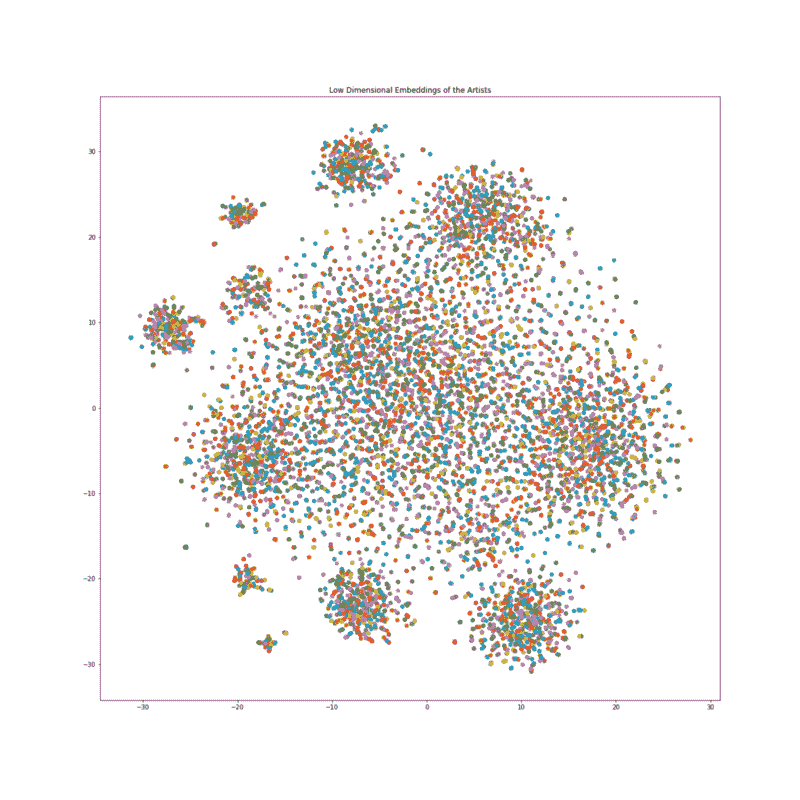
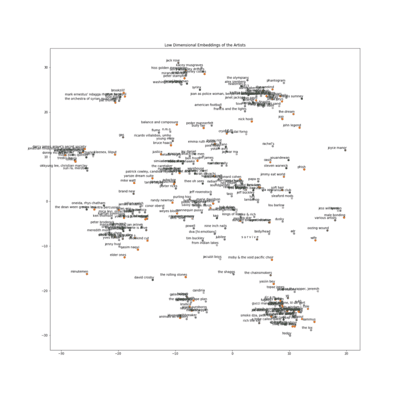

# 使用摇滚乐队学习张量流、Word2Vec 模型和 TSNE 算法

> 原文：<https://www.freecodecamp.org/news/learn-tensorflow-the-word2vec-model-and-the-tsne-algorithm-using-rock-bands-97c99b5dcb3a/>

帕特里克·费里斯

学习“张量流方式”来建立神经网络似乎是开始机器学习的一大障碍。在本教程中，我们将一步一步地解释我们使用来自 [Kaggle](https://www.kaggle.com/nolanbconaway/pitchfork-data) 的 [Pitchfork](https://www.kaggle.com/nolanbconaway/pitchfork-data) 数据构建 Bands2Vec 模型时涉及的所有关键组件。

完整代码请查看 GitHub [页面](https://github.com/patricoferris/machinelearning/blob/master/word2vec/Pitchfork.ipynb)。

## Word2Vec 模型

神经网络消耗数字，产生数字。他们很擅长这个。但是给他们发些短信，他们会大发脾气，一点也不感兴趣。

如果处理数字并产生有意义的输出是神经网络的工作，那么我们的工作就是确保我们给它的任何东西也是有意义的。这种对有意义的信息表示的追求催生了 Word2Vec 模型。

一种处理单词的方法是形成[独热编码向量](https://en.wikipedia.org/wiki/One-hot)。创建一个长的(我们的词汇表中不同单词的数量)零列表，让每个单词指向这个列表的唯一索引。如果我们看到这个单词，就把它列在列表的第一位。

虽然这种方法可行，但它需要很大的空间，而且完全没有意义。‘好’和‘优秀’就像‘鸭子’和‘黑洞’一样相似。如果有一种方法可以将单词矢量化，这样我们就可以保留这种上下文相似性…

谢天谢地，有办法！

使用神经网络，我们可以产生单词的嵌入形式。这些向量代表了从我们网络中的连接权重中提取的每个唯一的单词。

但问题依然存在:我们如何确保它们是有意义的？答案是:成对输入目标词和上下文词。这样做足够多次，再加上一些不好的例子，神经网络就开始学习哪些单词出现在一起，以及这些单词是如何形成一个图表的。就像一个由上下文联系起来的词语的社会网络。“好”表示“有帮助”，而“有帮助”表示“关心”，如此等等。我们的任务是将这些数据输入神经网络。

最常见的方法之一是 [Skipgram](https://papers.nips.cc/paper/5021-distributed-representations-of-words-and-phrases-and-their-compositionality.pdf) 模型，基于在文本数据集上移动窗口来生成这些目标-上下文配对。但是，如果我们的数据不是句子，但我们仍然有上下文意义呢？

在本教程中，我们的单词是艺术家的名字，我们的上下文是流派和平均评论分数。我们希望艺术家 A 接近艺术家 B，如果他们共享一个流派，并且具有相似的平均评论分数。所以让我们开始吧。

## 构建我们的数据集

Pitchfork 是一个在线美国音乐杂志，主要涵盖摇滚、独立和新音乐。发布给 Kaggle 的数据是从他们的网站上搜集来的，包含评论、流派和与每个艺术家相关的日期等信息。

让我们创建一个艺术家类和字典来存储我们想要的所有有用信息。

太好了！现在我们想根据体裁和平均评论分数来制作我们的目标-上下文配对。为此，我们将创建两个字典:一个用于不同的独特流派，另一个用于乐谱(离散化为整数)。

我们会将所有艺术家添加到相应的流派中，并在这些字典中平均得分，以便稍后生成艺术家对时使用。

深入 TensorFlow 代码之前的最后一步:生成批处理！一批就像我们的神经网络在每个时期使用的数据样本。一个时期是在训练阶段对神经网络的一次扫描。我们想要生成两个 numpy 数组。其中一个将包含以下代码:

## TensorFlow

有无数的 TensorFlow 教程和知识来源。这些[优秀文章](https://medium.freecodecamp.org/search?q=tensorflow)中的任何一篇都会对你以及[文档](https://www.tensorflow.org/tutorials/)有所帮助。以下代码大量基于 TensorFlow 人员自己的 [word2vec](https://github.com/tensorflow/tensorflow/blob/r1.9/tensorflow/examples/tutorials/word2vec/word2vec_basic.py) 教程。希望我能揭开其中一些的神秘面纱，将其归结为本质。

第一步是理解“图形”表示。这对于[张量板](https://www.tensorflow.org/guide/summaries_and_tensorboard)可视化和在神经网络中创建数据流的精神图像非常有用。

花些时间通读下面的代码和注释。在我们将数据输入神经网络之前，我们必须初始化我们将要使用的所有部件。占位符是我们给‘feed _ dict’的输入。变量是图形中可变的部分，我们最终会对其进行调整。我们模型中最重要的部分是损失函数。这是我们表现的分数，也是我们如何改进的藏宝图。

噪声对比估计(NCE)是一个损失函数。通常我们会使用交叉熵和 softmax，但在自然语言处理世界中，我们所有的类相当于每一个唯一的单词。

从计算上来说，这很糟糕。NCE 将问题的框架从类别的概率转变为目标-背景配对是否正确(二元分类)。它需要一个真正的配对，然后采样得到坏的配对，常数`num_sampled`控制这一点。我们的神经网络学会区分这些好的和坏的配对。最终，它学会了上下文！你可以在这里阅读更多关于 NCE 及其运作方式的信息。

## 运行神经网络

现在一切都设置好了，我们只需点击绿色的“go”按钮，转动一下我们的拇指。

### 使用 TSNE 可视化

好吧，我们还没完。我们现在有丰富的上下文，64 维的艺术家向量，但这可能是太多的维度，以至于无法真正可视化它的有用性。

幸运的是，我们可以将这些信息压缩到二维空间中，同时保留与 64 维空间一样多的属性！这就是 T 分布随机邻居嵌入，简称 TSNE。这个[视频](https://www.youtube.com/watch?v=NEaUSP4YerM)很好地解释了 TSNE 背后的主要思想，但我将尝试给出一个宽泛的概述。

TSNE 是一种保持高维相似性(如欧几里德距离)的降维方法。为此，它首先构建一个使用正态分布计算的点对点相似性矩阵。分布的中心是第一个点，第二个点的相似性是远离分布中心的点之间的距离处的分布值。

然后我们随机投射到下面的维度，用 t 分布做完全相同的过程。现在我们有了两个点对点相似性矩阵。然后，该算法缓慢地移动低维中的点，以尝试使其看起来像高维的矩阵，其中相似性被保留。并重复。谢天谢地，Sci-kit Learn 有一个功能可以帮我们处理数据。

## 结果呢



All of the Artists plotted using their low dimensional embedding

这些嵌入的惊人之处在于，就像向量一样，它们支持数学运算。经典的例子是:`King — Man + Woman = Queen`，或者至少非常接近。让我们试一个例子。

以 Coil 的低维嵌入为例，这是一个具有以下风格的乐队，`[‘electronic’, ‘experimental', ‘rock’]`和平均分数`7.9`。现在减去老乐队的低维嵌入，一个有流派的乐队，`['electronic']`，和平均分数`7.8`。有了这种嵌入差异，找到最接近它的乐队，并打印他们的名字和流派。

```
Artist: black lips, Mean Score: 7.48, Genres: ['rock', 'rock', 'rock', 'rock', 'rock']
```

```
Artist: crookers, Mean Score: 5.5, Genres: ['electronic']
```

```
Artist: guided by voices, Mean Score: 7.23043478261, Genres: ['rock', 'rock', 'rock', 'rock', 'rock', 'rock', 'rock', 'rock', 'rock', 'rock', 'rock', 'rock', 'rock', 'rock', 'rock', 'rock', 'rock', 'rock', 'rock', 'rock', 'rock', 'rock', 'rock']
```

成功了！我们得到的摇滚和电子乐队的评论分数有些相似。下面是标有标签的前三百个波段。希望你已经发现这个项目具有教育意义和启发性。勇往直前，去建造、探索和玩耍吧！



Three hundred artists plotted and labelled