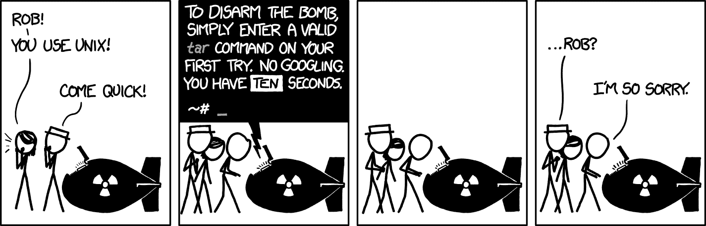

# 了解 50 个最常用的 Linux 和终端命令

> 原文：<https://www.freecodecamp.org/news/learn-the-50-most-used-linux-terminal-commands/>

摸摸猫尾巴。找到人头。谁啊。

前面七个字是常见的 Linux 命令。如果你是一名程序员，你可能会在某些时候需要使用 Linux 和终端命令。

我们刚刚在 freeCodeCamp.org YouTube 频道上发布了一门课程，将教你如何使用 50 个最常见的 Linux 和终端命令。

所有这些命令都适用于 Linux、macOS、WSL 以及任何有 UNIX 环境的地方。

柯尔特·斯蒂尔开发了这个课程。Colt 是最受欢迎的 web 开发教师之一，他是一名优秀的教师。

You may one day need this information to disarm a bomb. (source: [xkcd](https://xkcd.com/1168/))

在本课程中，您将了解以下主题和命令:

*   为什么使用命令行？
*   操作系统的世界
*   什么是 Linux？
*   贝壳和狂欢
*   Linux 用户的设置
*   Mac 用户的设置
*   Windows 安装程序(WSL)
*   使用终端
*   谁啊
*   男人
*   清楚的
*   选项介绍
*   显示当前工作目录
*   限位开关（Limit Switch）
*   激光唱片
*   mkdir
*   触控
*   是吗
*   空间
*   打开
*   平均变化
*   丙酸纤维素
*   头
*   尾巴
*   日期
*   重定向标准输出
*   猫
*   较少的
*   回声
*   厕所
*   平静的
*   分类
*   uniq
*   扩展
*   差速器
*   发现
*   可做文件内的字符串查找
*   杜（姓氏）
*   df
*   历史
*   著名图象处理软件
*   顶端
*   杀
*   基勒
*   工作、背景和成品
*   gzip
*   gunzip
*   tar *(拆弹命令)*
*   毫微；纤（10 的负九次方）
*   别名
*   xargs
*   ln
*   谁
*   快点，快点
*   须藤
*   密码
*   chown
*   了解权限
*   chmod

观看以下全部课程或在 freeCodeCamp.org YouTube 频道观看[(5 小时观看)。](https://youtu.be/ZtqBQ68cfJc)

[https://www.youtube.com/embed/ZtqBQ68cfJc?feature=oembed](https://www.youtube.com/embed/ZtqBQ68cfJc?feature=oembed)