# 在 10 分钟内学习 Bootstrap 4 网格系统

> 原文：<https://www.freecodecamp.org/news/learn-the-bootstrap-4-grid-system-in-10-minutes-e83bfae115da/>

埃琳娜-克里斯蒂娜·科纳塞尔

# 在 10 分钟内学习 Bootstrap 4 网格系统

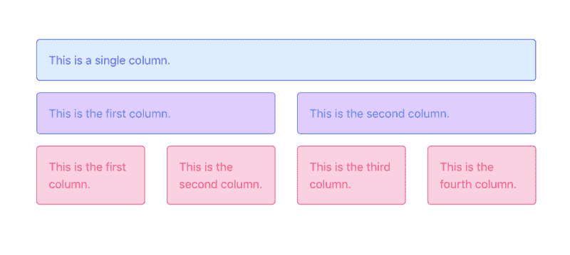

An example with the Bootstrap 4 Grid System.

Bootstrap 4 网格系统用于响应式布局。

响应式布局表示不同分辨率下元素在页面中的对齐方式。在学习任何其他 Bootstrap 4 组件之前，理解如何使用网格是很重要的，因为无论您使用什么元素，您都需要将它放在屏幕上的某个位置。

我们开始吧！


Photo credit to [Animade](https://dribbble.com/animade) for his [shot](https://dribbble.com/shots/4948320-Computer-Mouse).

### 目录

*   [引导 4 个容器](https://www.freecodecamp.org/news/learn-the-bootstrap-4-grid-system-in-10-minutes-e83bfae115da/#bootstrap-4-containers)
*   [引导 4 行](https://www.freecodecamp.org/news/learn-the-bootstrap-4-grid-system-in-10-minutes-e83bfae115da/#bootstrap-4-rows)
*   [Bootstrap 4 列](https://www.freecodecamp.org/news/learn-the-bootstrap-4-grid-system-in-10-minutes-e83bfae115da/#bootstrap-4-columns)
*   [延伸阅读](https://www.freecodecamp.org/news/learn-the-bootstrap-4-grid-system-in-10-minutes-e83bfae115da/#further-reading)

Bootstrap 4 网格由容器、行和列组成。我们将逐一进行解释。

### 引导 4 个容器

Bootstrap 4 容器是一个具有类`.container`的元素。容器是 Bootstrap 4 网格系统的根，它用于控制布局的宽度。

Bootstrap 4 容器包含一个页面中的所有元素。这意味着你的页面应该有如下的结构:首先是 HTML 页面的主体，在里面你应该添加容器和所有其他的元素。

```
<body>
   <div class="container">
    ...
   </div>
</body>
```

简单的`.container`类根据屏幕的宽度设置布局的宽度。它将内容放在页面的中间，水平对齐。Bootstrap 4 容器与页面的左右边缘之间有相等的空间。

随着屏幕宽度变窄，`.container`的宽度缩小，在手机上变成全幅。容器的宽度是在 Bootstrap 4 库中为每个屏幕尺寸定义的。你可以在这里看到确切的尺寸。

全宽容器占据 100%的屏幕大小，与屏幕宽度无关。要使用它，您需要添加类。`container-fluid`。

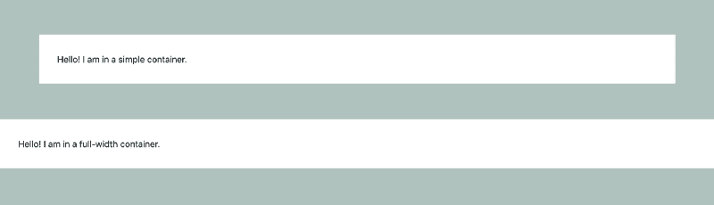

```
<div class="container">
  Hello! I am in a simple container.
</div>

<div class="container-fluid">
  Hello! I am in a full-width container.
</div>
```

你可以在这里查看密码本。

要查看这两种类型的容器之间的差异，您可以在控制台中打开笔并在屏幕大小之间切换。

### 引导 4 行

Bootstrap 4 行是屏幕的水平切片。它们仅用作列的包装。要使用它们，您需要`.row`类。

```
<div class="row">
  ...
</div>
```

以下是您需要记住的关于 Bootstrap 4 行的最重要的事情:

*   **它们仅用于容纳列。**如果将其他元素与列一起放在行内，将不会得到预期的结果。
*   它们必须放在容器里。如果你不这样做，你的页面会出现水平滚动。发生这种情况是因为行的左右边距为负 15。这个容器有 15 像素的衬垫，所以它抵消了利润。
*   **列必须是行的子级。**否则它们不会对齐。创建行和列是为了在这个严格的层次结构中协同工作。

### Bootstrap 4 列

我们现在可以进入本教程的精彩部分，Bootstrap 4 专栏。栏目很棒！它们帮助你水平分割屏幕。

如果你在你的行中放置一个单独的列，它将占据整个宽度。如果你增加两列，它们将各占宽度的 1/2。所以它适用于任意数量的列。

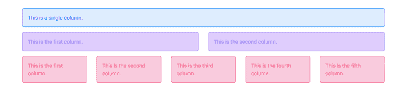

```
<div class="container">
  <div class="row">
    <div class="col">
      ...
    </div>
  </div>
  <div class="row">
    <div class="col">
      ...
    </div>
    <div class="col">
       ...
    </div>
  </div>
  <div class="row">
    <div class="col">
      ...
    </div>
    <div class="col">
       ...
    </div>
    <div class="col">
      ...
    </div>
    <div class="col">
       ...
    </div>
    <div class="col">
       ...
    </div>
  </div>
</div>
```

你可以在 [CodePen](https://codepen.io/cristinaconacel/pen/NOLEyy) 上看到代码直播。

**旁注:**列没有颜色。我只是添加了一些颜色，让描述在视觉上更加引人注目/所以它们看起来很漂亮。

### **设置列的大小**

使用`.col`类动态设置列宽。这意味着根据一行中的列数，列的宽度将是容器的宽度除以列数。

但是还有另一种定义列的方法。您可以为列使用类并定义它们的大小。

默认情况下，Bootstrap 4 网格由 12 列组成。您可以为列选择 1 到 12 之间的任何大小。如果想要 3 个相等的列，可以对每个列使用`.col-4`(因为 3*4 列每个= 12)。或者您可以为它们设置不同的大小。以下是一些例子:

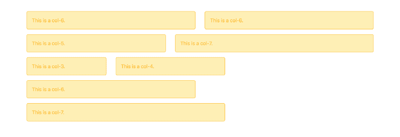

```
<div class="row">
  <div class="col-6">
    ...
  </div>
  <div class="col-6">
     ...     
  </div>
</div>
<div class="row">
  <div class="col-5">
    ...
  </div>
  <div class="col-7">
     ...     
  </div>
</div>
<div class="row">
  <div class="col-3">
    ...
  </div>
  <div class="col-4">
     ...     
  </div>
</div>
<div class="row">
  <div class="col-6">
    ...
  </div>
  <div class="col-7">
     ...     
  </div>
</div>
```

你可以在 [CodePen](https://codepen.io/cristinaconacel/pen/xyaQNw) 上看到代码直播。

如果你的行中的列的总和没有达到 12，那么它们不会填满整行。如果列的总和超过 12，那么它将移动到下一行。第一行将只显示加起来等于或小于 12 的前几个元素。

### 为列设置断点

如果你拿上面的例子，想在手机上展示，可能会遇到一些问题。在移动设备上显示五列将使内容不可读。

这就是最强大的 Bootstrap 4 组件之一发挥作用的地方。为了在不同的屏幕上有不同的布局，您不需要编写媒体查询，而是可以使用列断点。

断点是代表屏幕分辨率的 Bootstrap 4 变量。当您为一个类指定一个断点时，您是在告诉该类只有在至少与断点数量一样大的分辨率下才是活动的。

我们将要学习的最简单的类是`.col-[breakpoint]`类。使用该类时，只有当列显示在分辨率至少为定义的断点的设备上时，才定义列的行为。默认情况下，直到给定的断点，您的列将垂直对齐。在断点之后，它们会因为类而水平对齐。

Bootstrap 有 4 个断点可供使用:

*   `.col-sm`对于更大的手机(分辨率≥ 576px 的设备)；
*   `.col-md`对于片剂(≥768 px)；
*   `.col-lg`对于笔记本电脑(≥992 px)；
*   `.col-xl`对于台式机(≥1200 像素)

假设您想在小屏幕上一个接一个地垂直显示两列，在大屏幕上显示在同一行上。您需要在同一行上指定列的断点。

在我们的例子中，我们将使用`.col-lg`断点，看看这些列在不同的屏幕上是什么样子。对于低于给定断点(< 992px)的分辨率，列将垂直显示。这意味着在移动设备和平板电脑上，这些列将如下所示:

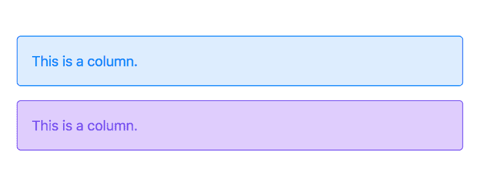

The display for resolutions < 992px (mobile devices).

对于分辨率高于或等于断点(≥992px)的器件，这些列将位于同一行。这意味着在笔记本电脑和台式机上，您将获得以下结果:

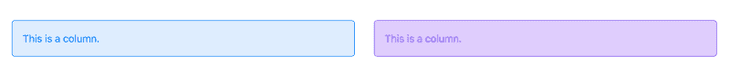

The display for resolutions >= 992px (laptops and bigger screens).

```
<div class="row">
 <div class="col-lg">
   ...
 </div>
 <div class="col-lg">
    ...   
 </div>
</div>
```

你可以在 [CodePen](https://codepen.io/cristinaconacel/pen/OBoqqz) 上看到代码直播。如果你在另一个窗口打开 Codepen，以不同的分辨率查看页面，你会看到分栏改变了它们的位置。

如果你想让这两列在同一条线上，从更大的手机开始，你可以使用`.col-sm`，平板电脑`.col-md`和超大屏幕`.col-xl`。

### **设置列的大小和断点**

您可以组合大小和断点，并使用格式为`.col-[breakpoint]-[size]`的单个类。

例如，如果您希望从笔记本电脑分辨率开始，在一行上对齐三个不同大小的列，您需要这样做:

```
<div class="row">
  <div class="col-lg-4">
    ...
  </div>
  <div class="col-lg-3">
    ...
  </div>
  <div class="col-lg-5">
    ...     
  </div>
</div>
```

分辨率小于 992 像素时，您将得到以下结果:

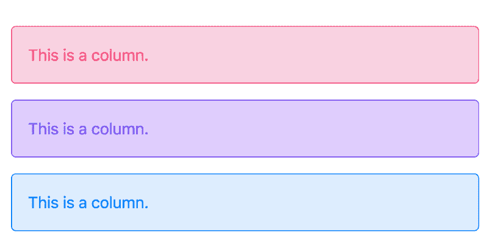

对于≥992 像素的屏幕:

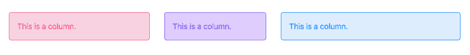

同样，你可以在 [CodePen](https://codepen.io/cristinaconacel/pen/ReYOwZ) 上看到代码。

但是，如果您希望在小型移动设备上每行显示一列，在平板电脑上每行显示两列，在笔记本电脑或分辨率更高的设备上每行显示四列，该怎么办呢？

然后，为一列添加多个类来描述每个分辨率的行为。使用多个类，您可以指定内容在平板电脑上占用 6 个插槽，在笔记本电脑上占用 3 个插槽。

```
<div class="row">
  <div class="col-sm-6 col-lg-3">
    ...
  </div>
  <div class="col-sm-6 col-lg-3">
    ...
  </div>
  <div class="col-sm-6 col-lg-3">
     ...     
  </div>
  <div class="col-sm-6 col-lg-3">
     ...     
  </div>
</div>
```

结果将在平板电脑上显示如下:

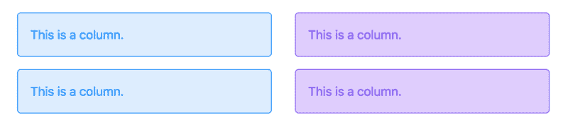

像这样的笔记本电脑和更高的分辨率:


这个例子也是在 [CodePen](https://codepen.io/cristinaconacel/pen/mjZBPO) 上直播的。

作为练习，您可以根据屏幕大小尝试创建不同列数的行，并验证浏览器控制台的行为。

### **偏移列**

如果你不希望你的列彼此相邻，你可以将类`.offset-[breakpoint]-[size]`和`.col-[breakpoint]-[size]`一起使用。

使用这个类相当于在您的列之前添加一个空列。这里有一个简单的例子:


```
<div class="row">
  <div class="col-md-4 offset-md-4">
     ...     
  </div>  
  <div class="col-md-4">
     ...     
  </div>  
</div>
```

你可以在 [CodePen](https://codepen.io/cristinaconacel/pen/KGxYaL) 上看到代码直播。

您可以在行中的任何列上使用该类。这里还有一些例子:

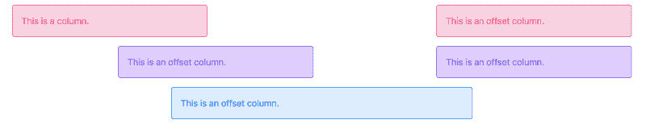

```
<div class="row">
  <div class="col-md-4">
     ...     
  </div>  
  <div class="col-md-4 offset-md-4">
     ...     
  </div>  
</div>
<div class="row">
  <div class="col-md-4 offset-md-2">
     ...    
  </div>  
  <div class="col-md-4 offset-md-2">
     ...     
  </div>  
</div>
<div class="row">
  <div class="col-md-6 offset-md-3">
     ...
  </div>   
</div>
```

### **嵌套列**

这可能令人惊讶，但是您可以在列中添加一行！

有问题的行(将具有其父列的宽度)将被分成 12 个(更小的)列，您可以通过`.col-*` 类引用这些列。

让我们来看看当我们在列中插入一个新行时会发生什么:

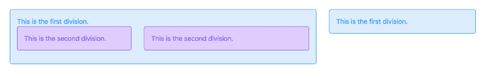

```
<div class="row">
    <div class="col-md-8">
        ...
        <div class="row">
            <div class="col-md-5">
               ...
            </div>
            <div class="col-md-7">
               ...   
            </div>
        </div>
      </div>     
    </div>
    <div class="col-md-4">
       ...
    </div>
</div>
```

你可以在 [CodePen](https://codepen.io/cristinaconacel/pen/OBoGZr) 上看到代码直播。

了解了这一点，你就可以更深入地组织你的信息。这些栏目将为你提供一个简单的方法来管理你的空间。

这就结束了关于 Bootstrap 4 响应式网格系统的基础知识。如果你有问题，请在评论中告诉我，我将很乐意回答。

### 进一步阅读

如果你有更多的时间，这里有一些有用的资源:

*   来自 GetBootstrap 的官方网格文档
*   来自 Scrimba 的视频教程

这篇文章最初发布在 [BootstrapBay 博客](https://bootstrapbay.com/blog/day-2-bootstrap-4-grid-system-tutorial-examples/)上。这是一个更大系列的引导 4 教程的一部分，叫做 [14 天引导 4](https://bootstrapbay.com/blog/14-days-bootstrap-4/) 。如果您想继续了解 Bootstrap 4 组件，这些文章是一个很好的起点。

如果你想用一个引导模板开始你的开发，你可以看看我们的[市场](http://bootstrapbay.com)。

但是在深入研究之前，花点时间庆祝一下你新获得的技能吧！？


Photo credit to [Jonas Mosesson](https://dribbble.com/jonasmosesson) for his [shot](https://dribbble.com/shots/4198035-Sweet-Berry-Wine).