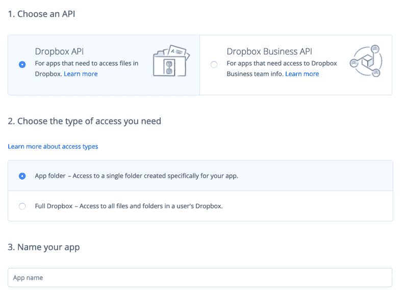
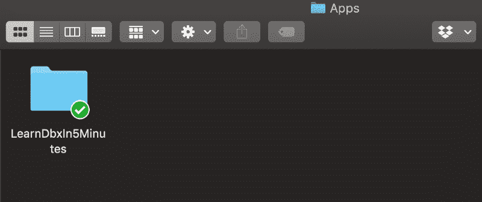
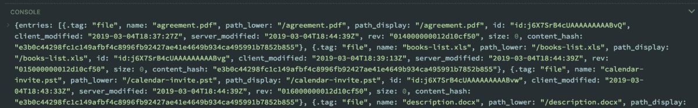
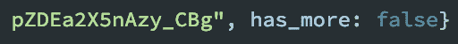
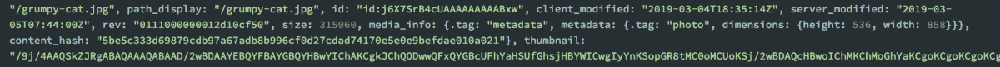

# 5 分钟学会 Dropbox API

> 原文：<https://www.freecodecamp.org/news/learn-the-dropbox-api-in-5-minutes-fd4626a0df18/>

这篇文章将教你开始在 Dropbox API 上创建应用程序所需要知道的最基本的知识。

一旦你阅读了它，如果你有兴趣了解更多，你也可以在 Dropbox API 上查看我们的[免费课程。在该课程中，您将学习如何使用现代 JavaScript 构建一个费用管理器应用程序。](https://scrimba.com/g/gdropbox?utm_source=freecodecamp.org&utm_medium=referral&utm_campaign=gdropbox_5_minute_article)


[Click here to get to the course](https://scrimba.com/g/gdropbox?utm_source=freecodecamp.org&utm_medium=referral&utm_campaign=gdropbox_5_minute_article)

本文使用 JavaScript 作为例子，然而，SDK 在不同语言之间非常相似，所以即使你是一个 Python 开发者，它仍然是相关的。

### 设置

为了构建 Dropbox，你首先需要一个 Dropbox 账户。注册后，前往[开发者专区。](https://www.dropbox.com/developers)选择仪表盘左侧的**我的应用**，点击**创建应用**。

选择以下设置，并为你的应用指定一个唯一的名称。



本教程的首选设置

在仪表板中，转到**生成的访问令牌**下的 **OAuth 2** 部分，点击`Generate`按钮获得一个 API `accessToken`，我们将保存该 API 供以后使用。


现在，让我们安装[Dropbox 桌面应用](https://www.dropbox.com/install)。使用您的新开发人员凭据登录应用程序，您应该能够看到一个与您新创建的应用程序同名的文件夹。我的情况是`LearnDbxIn5Minutes`。



将一些文件和图像放入该文件夹，这样我们就可以通过我们的 API 访问它们。

### 安装和初始 Dropbox 类

现在让我们将 Dropbox 库安装到我们的项目中。

`npm install dropbox`

# 或者

`yarn add dropbox`

导入 Dropbox 并使用传入我们的类实例化的令牌和获取库创建`dbx`。如果您更喜欢`axios`或任何其他获取库，请随意传递它。

```
import { Dropbox } from 'dropbox';

const accessToken = '<your-token-from-dashboard>';

const dbx = new Dropbox({  
  accessToken,  
  fetch  
}); 
```

注意，Dropbox 是一个命名导入。原因是`'dropbox'`内还有其他的子库，比如`DropboxTeam`，但本教程我们将只关注`Dropbox`。

### 获取文件

我们要看的第一个方法是获取文件。

```
dbx.filesListFolder({  
  path: ''  
}).then(response => console.log(response)) 
```

获取目标文件夹的路径，并列出其中的所有文件。这个方法返回一个承诺。

此外，值得记住的是，你将提供一个空字符串`''`而不是一个斜线`'/'`来获得我们的应用程序的根。现在根是 ***我们的应用文件夹*** 的根，而不是 Dropbox 账户的根。我们可以随时在应用程序的设置中更改该选项。

当我们运行代码时，控制台应该记录我们的 Dropbox 文件夹的条目:



### 获取更多文件

在这一部分中，我们将研究如何加载更多的文件，实现分页或无限滚动功能。

出于这个目的，Dropbox 有了一个`cursor`的概念，它指示我们已经收到的文件和需要发送的文件之间的当前位置。

例如，我们有一个包含 10 个文件的文件夹，我们请求了 5 个。光标将通过`response`上的`has-more: true`属性让我们知道还有更多文件要下载。我们可以继续使用传入`cursor`的`filesListFolderContinue()`请求文件，直到不再有文件剩下，我们得到`has_more: false`。

```
const getFiles = async () => {  
  const response = await dbx.filesListFolder({  
    path: '',   
    limit: 5  
  })

console.log(response)  
}

getFiles() 
```

当我们检查控制台中得到的响应时，我们可以看到`has_more: true`。


当我们有更多的文件要接收时，让我们更新我们的代码来处理情况。

```
const getFiles = async () => {  
  const response = await dbx.filesListFolder({  
    path: '',   
    limit: 5  
  })

// We can perform a custom action with received files  
  processFiles(response.entries)

if (response.has_more) {  
    // provide a callback for the newly received entries   
    // to be processed  
    getMoreFiles(response.cursor, more => processFiles(more.entries))  
  }  
}

getFiles() 
```

我们提供光标让 API 知道我们已经收到的条目，所以我们不会再收到相同的文件。

```
const getMoreFiles = async (cursor, callback) => {  
  // request further files from where the previous call finished  
  const response = await dbx.filesListFolderContinue({ cursor })

// if a callback is provided we call it  
  if (callback) callback(response)

if (response.has_more) {  
    // if there are more files, call getMoreFiles recursively,  
    // providing the same callback.  
    await getMoreFiles(response.cursor, callback)  
  }  
} 
```

注意我们提供给`getMoreFiles()`函数的回调。这是一个非常巧妙的技巧，可以确保我们新收到的文件得到和以前一样的处理。

最后，当没有更多的文件要获取时，我们收到了`has_more: false`



还值得一提的是，这里实现递归调用是为了简化教程，而不是为了函数的性能。如果您有大量数据要加载，请将其重构为一个性能更好的函数。

### 获取缩略图

我们要研究的第三种方法是获取文件的缩略图。

为了请求上传文件的缩略图，我们可以调用`filesGetThumbnailBatch()`。

```
dbx.filesGetThumbnailBatch({  
  entries: [{  
    path: '',  
    size: 'w32h32',  
    format: 'png',  
  }]  
}); 
```

该端点针对获取多个缩略图进行了优化，它接受一个对象数组，其中每个对象可以指定多个属性。

基本属性是`path`，它包含与`filesListFolder()`中相同的警告。

在我们的响应中，我们可以通过`thumbnail`属性访问我们的图像。



你可以看到缩略图不是作为链接返回的，而是作为非常非常长的字符串返回的——这是一个 base64 图像。您可以使用 HTML 中的字符串将``的`src`设置为`"data:image/jpeg;base64, ${file.thumbnail}"`。

如果我给出我的回答，我会得到这些神奇的猫！


图像学分:最大像素( [1](https://www.maxpixel.net/Tiger-Cat-Cat-Funny-Cat-Face-Domestic-Cat-Mieze-2306185) 、 [2](https://www.maxpixel.net/Playful-Cat-Head-Young-Cat-Cat-Face-Pet-Black-Cat-205757) 、 [3](https://www.maxpixel.net/Exhausted-Sleep-Cat-Cat-Face-Pet-White-Cat-1551783) )

### 移动文件

最后，我们将介绍如何将文件从一个文件夹移动到另一个文件夹。

我们可以使用`filesMoveBatchV2()`将文件从一个文件夹批量移动到另一个文件夹。当作为`async`函数的一部分实现时，这种方法效果最好。

该方法接受由`from_path`和`to_path`属性组成的`entries`对象数组。

如果调用立即成功，在只有几个文件要处理的情况下,`filesMoveBatchV2()`返回任一`success`。然而，对于更大的工作负载，它将返回一个具有属性`async_job_id`的对象，这意味着您的调用正在执行，我们将需要在稍后阶段检查它。

我们可以使用`filesMoveBatchCheckV2()`继续检查我们的工作的完成情况，直到它完成并且不再是`in_progress`为止。

```
const entries = {  
  from_path: 'origin_folder',  
  to_path: 'destination_folder  
}

const moveFiles = async () => {  
  let response = await dbx.filesMoveBatchV2({ entries })  
  const { async_job_id } = response  
  if (async_job_id) {  
    do {  
      response = await dbx.filesMoveBatchCheckV2({ async_job_id })  
      // This where we perform state update or any other action.  
      console.log(res)  
    } while (response['.tag'] === 'in_progress')  
  }  
} 
```

### 包裹

恭喜你！现在，您已经对 Dropbox API 及其 JavaScript SDK 有了非常基本的了解。

如果你想了解更多关于 Dropbox API 的知识，并在此基础上用普通的 JavaScript 构建一个应用程序，一定要看看我们关于 Scrimba 的免费课程。它和这篇文章都是由 Dropbox 赞助和支付的。这项赞助有助于 Scrimba 保持运转，并使我们能够在 2019 年继续为我们的社区创建免费内容。为此，非常感谢 Dropbox！

快乐编码:)