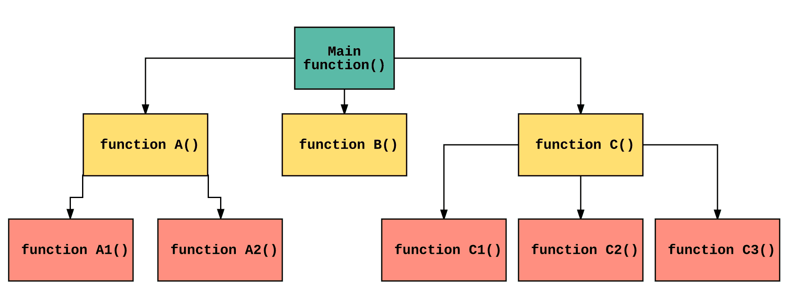
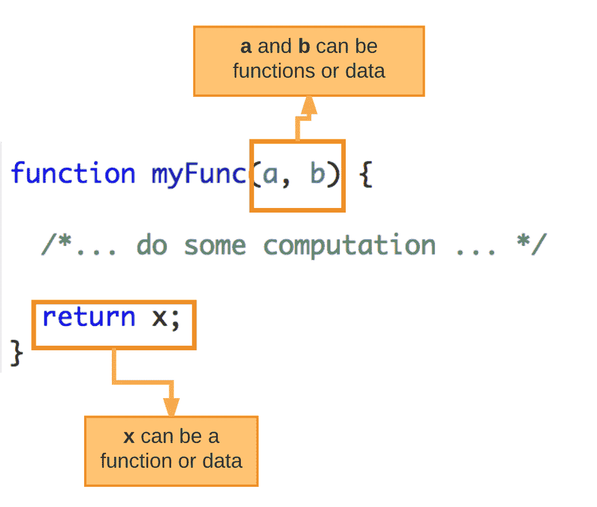
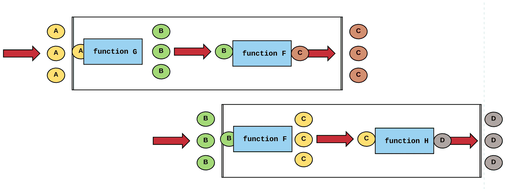
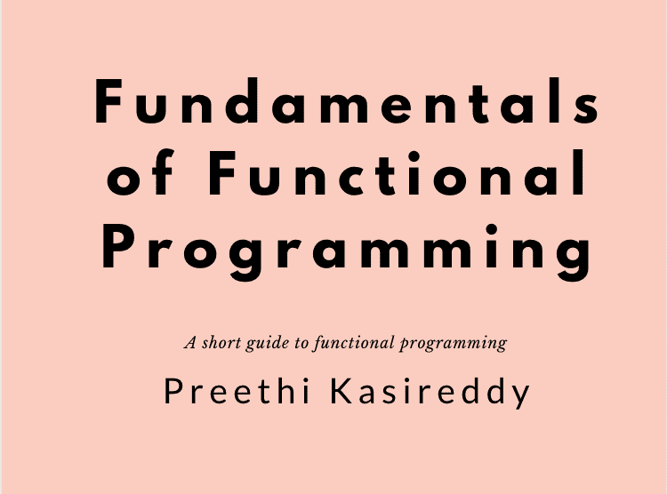

# 学习函数式编程让我成为了 10 倍优秀的开发人员

> 原文：<https://www.freecodecamp.org/news/learn-the-fundamentals-of-functional-programming/>

学习函数式编程让我成为了 10 倍优秀的开发人员。它帮助我学会了如何编写干净、易于维护和可伸缩的代码。

在这个软件应用变得越来越复杂的时代，这一点尤其重要。构建和维护一个简单的 web 应用程序的时代已经结束。

作为一名开发人员，对您的期望比以往任何时候都高。现在，构建、测试、维护和扩展每天影响数百万人的复杂应用程序的重任落在了我们的肩上。对于初学者来说，这可能特别令人生畏，因为我们刚刚掌握编写实际上*有效*的代码的窍门，更不用说编写容易*到*理解、编写、调试、重用和维护的代码了。

这就是函数式编程让我与众不同的地方——它帮助我学会了如何编写易于理解、编写、调试、重用和维护的代码。因此，我对自己的编码能力更有信心了。

即使您在工作中或在项目中没有使用函数式编程语言，了解函数式编程的基础知识也会为您提供一套强大的工具来编写更好的代码。

在我的新书[电子书](https://gum.co/CkFTl)中，我将教你函数式编程的基础知识，这样你就拥有了在工作中、在下一次工作面试中或在下一个兼职项目中应用这些原则所需的所有基础知识。

这篇文章的其余部分会给你一个简单的解释什么是函数式编程，这是你在钻研电子书之前需要知道的。？

让我们开始吧！？

# 什么是函数式编程？

所以。“函数式编程”到底是什么？

函数式编程不是一个框架或工具，而是一种编写代码的*方式。在函数式编程中，我们主要强调使用 ****函数作为“构建模块”来编写代码*****

*你的程序是由一个主要功能定义的。这个主函数是根据其他函数定义的，而其他函数又是根据更多的函数定义的——直到在底层，这些函数只是像“数字”或“字符串”这样的语言原语*

**

*如果你在读这个思维， **“嗯，但是等等？不是每种语言都用函数写代码吗？”** 那么好吗？。这意味着你在集中注意力。你说得对——每种编程语言都有功能。但是函数式编程把它带到了一个 ****整体的‘另一个层次**** ？*

**

*为了理解我的意思，让我们倒回去，从基础开始。

每个软件程序都有两样东西:*

1.  *****行为**** (程序做什么)*
2.  *****数据**** (数据，是井，数据)*

*当我们学习一种编程范式时——比如函数式编程——考虑这种范式如何分别处理行为和数据通常是有帮助的。

****行为**** ，在函数式编程中，纯粹是使用 ****函数**** 进行处理。函数是完成特定任务的“独立”代码段。它们定义了一组可能的输入和一组可能的输出之间的关系——它们通常接收数据、处理数据并返回结果。一旦一个函数被写出来，它就可以被反复使用。

****数据，**** 在函数式编程中，是不可变的——意思是不能改变。函数式编程中的函数不是改变它们接受的数据，而是接受数据作为输入，并产生新的 ****值作为输出。一直都是。

****函数**** 和 ****不可变**** ****数据**** 是你在函数式编程中唯一需要处理的两件事。更简单地说，函数和数据没有什么不同。*****

*换句话说，函数式编程中的 ****函数可以像数据一样容易地传递。**** 你可以从 **常量** 和 **变量** 中引用它们，将它们作为 **参数** 传递给其他函数，从其他函数返回它们作为 **结果** 。

这是在接近函数式编程时要理解的最重要的事情。*

**

*通过将函数视为比一段数据更特殊的东西，并且只使用不可变的数据，我们在如何使用函数方面获得了更多的自由。*

*也就是说，它允许我们创建小的、独立的功能，这些功能可以被重用和组合在一起以构建越来越复杂的逻辑。我们可以 ****将任何复杂的问题分解成更小的子问题，使用函数解决它们，最后将它们组合在一起解决更大的问题。****

考虑到软件应用程序日益增长的复杂性，这种“积木式”方法在保持程序的简单性、模块化和可理解性方面起了巨大的作用。这也是为什么开发人员尽量把自己的功能做成**通用，这样就可以 ****结合**** 解决大型复杂问题，而 ****重用**** 为后续程序加快开发时间。***

******

***归根结底，函数在函数式编程中如此强大的原因是因为函数遵循某些核心原则。这些原则将是我电子邮件课程的主题:***

*   ***功能是纯粹的***
*   ***函数使用不可变的数据***
*   ***函数保证引用的透明性***
*   ***函数是一级实体***

***之后，我将简要介绍函数式编程如何应用这些原则来鼓励我们仔细考虑我们的数据和与之交互的函数。***

***最后，您将能够理解这种方法是如何产生如下代码的:***

*   ***更容易理解(即“有表现力”)***
*   ***更容易重复使用***
*   ***更容易测试***
*   ***更易于维护***
*   ***更容易重构***
*   ***更易于优化***
*   ***更容易推理***

***听起来很刺激？如果是这样，你会爱上这本新的电子书。？***

******

***[电子书](https://gum.co/CkFTl)将于**12 月 13 日**发布。**你现在就可以预购电子书**，价格仅为 **$49！**作为对免费免费代码营社区的特别优惠，我提供**10 美元的折扣**，折扣代码为“**免费代码营**”。***

***里面见。？？✍️***