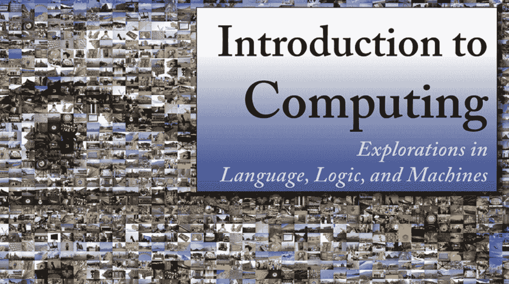
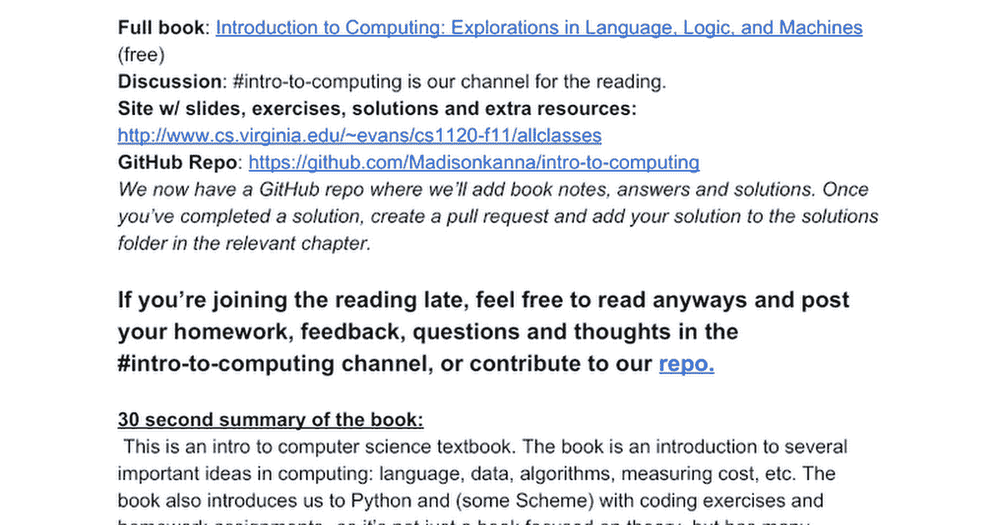
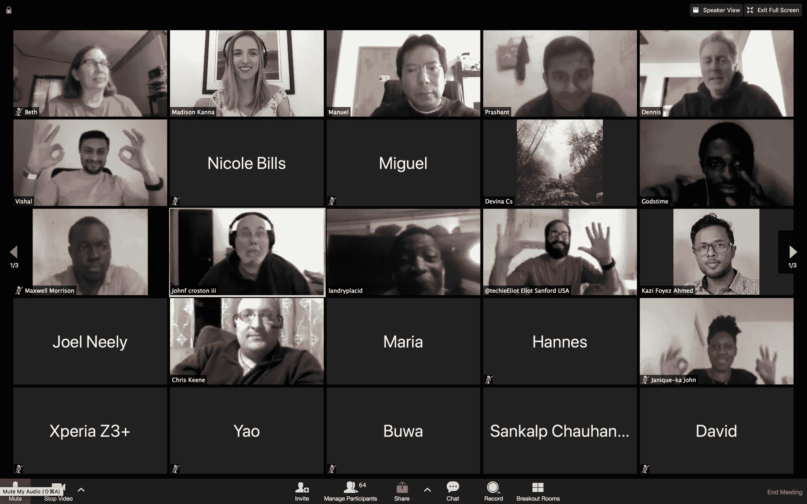

# 在这个自由的虚拟俱乐部学习计算机科学和 Python 的基础知识

> 原文：<https://www.freecodecamp.org/news/learn-the-fundamentals-of-python-and-computer-science-in-this/>

2020 年你在学习如何编码吗？

或者你已经是一名开发人员，但想学习计算机科学基础知识？

我想邀请你加入 CodeBookClub，这是一个面向初级和中级程序员的免费虚拟聚会。该俱乐部正准备一起阅读一本新书——一本介绍计算机科学的书，重点是教授计算机科学和编程语言 Python 的基础知识。

你可能会认为读书俱乐部是一群人一起阅读和讨论一本书。然而，我们的阅读将包括正在进行的活动、挑战和社区活动，这将使我们积极地学习和创造。

请继续阅读，了解更多详情！

## 这个聚会是给谁的？

*   以前没有编码经验但想开始编码的人。
*   希望学习计算机科学基础知识的自学开发人员。
*   对学习 Python(和 Scheme)感兴趣的 JavaScript 开发者。

## 为什么要加入这个群？

freeCodeCamp 创始人 Quincy Larson 说过，“学习编程的最糟糕的方法是独自学习。

当你一个人学习时，当你陷入编码问题时，更容易放弃。或者你失去了动力，因为没有人让你继续学习。这就是俱乐部的由来！

无论你是第一次学习编程，还是已经是一名开发人员，在这个俱乐部中，我们将一起学习计算机科学的基础知识，在遇到困难时解决问题，并相互督促继续学习。

我目前是一名软件开发人员，但是 3 年前我使用像 freeCodeCamp 这样的在线资源来自学如何编码。

[How I went from complete beginner to software developer — and how you can tooby Madison Kanna How I went from complete beginner to software developer — and how you can tooCamped out in a coffee shop.Two years ago, I was right where you are today. I wanted to become a professional programmer. But I had no idea how to make ithappen. I had no college degree, no previous co…freeCodeCamp.orgfreeCodeCamp.org](https://www.freecodecamp.org/news/how-i-went-from-complete-beginner-to-software-developer-and-how-you-can-too-dd36ed08e11b/)

对我帮助最大的一件事是找到和我一起学习的人的社区。我们的读书俱乐部是为任何经验水平的开发者准备的，只要他们愿意加入我们！

## 我们会学到什么？

我们小组将阅读由弗吉尼亚大学计算机科学教授大卫·埃文斯撰写的*计算导论、*计算机科学导论教材。

Cover of Intro To Computing.

这本书介绍了计算机科学的几个基础，你可能听说过，但想了解更多:算法，编码语言，数据，解释器，测量成本，等等。如果你想看这本书的目录，你可以在这里查看。

这本书还向我们介绍了 Python 和(一些 Scheme)编程练习和家庭作业——所以这不仅仅是一本侧重于理论的书，而是贯穿了许多练习。

## 会员如何参与？

积极地与其他开发者一起学习是这个俱乐部的宗旨。如果你加入我们的阅读，你可以选择每周完成各种**活动**，例如与俱乐部的其他成员一起完成书中的编码练习，回答讨论问题，或者在博客或推特上发布你所学的内容。有关如何参与的更多详细信息:

[Intro To Computing Book ClubIntro To Computing Book Club Full book: https://computingbook.org/ (free) Discord: https://discordapp.com/invite/a2ZahrB Site w/ slides, exercises, solutions and extra resources: http://www.cs.virginia.edu/~evans/cs1120-f11/allclasses…Google Docs](https://docs.google.com/document/d/1SbvZsedIS8-Vguue5HquIs6tobwnrF5uRaXTrOLwwCE/edit?usp=sharing)

我们还将设置一些实时缩放电话，在那里我们通过视频电话来讨论这本书和我们的编码练习。

Our other reading group (currently reading the 'You Don't Know JS' series) meets weekly on Zoom!

## 这本书和俱乐部的费用是多少？

这本书是 100%免费的，可以在这里找到。俱乐部也是免费的。

## 阅读什么时候开始？

你应该在 4 月 12 日之前看完这本书的第一章。

## 以下是俱乐部的更多详情:

[Intro To Computing Book ClubIntro To Computing Book Club Full book: https://computingbook.org/ (free) Discord: https://discordapp.com/invite/a2ZahrB Site w/ slides, exercises, solutions and extra resources: http://www.cs.virginia.edu/~evans/cs1120-f11/allclasses…Google Docs](https://docs.google.com/document/d/1SbvZsedIS8-Vguue5HquIs6tobwnrF5uRaXTrOLwwCE/edit?usp=sharing)

## 如果你 [u](https://madisonkanna.us14.list-manage.com/subscribe/post?u=323fd92759e9e0b8d4083d008&id=033dfeb98f) 想要加入俱乐部，注册我们的[电子邮件列表](https://madisonkanna.us14.list-manage.com/subscribe/post?u=323fd92759e9e0b8d4083d008&id=033dfeb98f)以便被邀请，获得关于如何加入俱乐部的指导并在 5 分钟内加入我们。你也会得到未来阅读和社区活动的更新。

## 该俱乐部永远 100%免费。

如果你对这篇文章有任何反馈或问题，欢迎发微博给我[@ madisonkana](https://twitter.com/madisonkanna)或关注 [@CodeBookClub。](https://twitter.com/codebookclub)