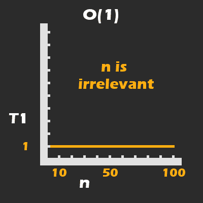
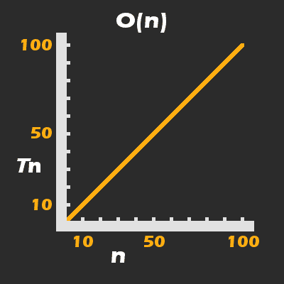
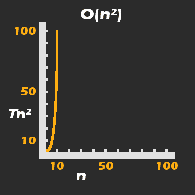
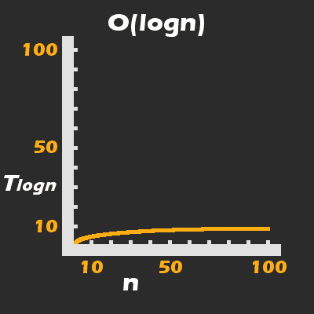

# 如何学习软件工程的基础——以一种更有趣和更少痛苦的方式

> 原文：<https://www.freecodecamp.org/news/learn-the-fundamentals-of-software-engineering/>

本文旨在成为软件工程基础的入门指南。

亲爱的读者，我写这篇文章是基于这样的假设:你可能不太了解这个领域的基础知识，为什么它们很重要，以及什么时候你应该费心去学习它们。

我们将深入探讨每一个问题，最后讨论一些我建议你学习和接近它们的方法。

对于那些碰巧熟悉这个主题的人来说，可能仍然有一些有趣的新观点，尤其是在最后一部分，有助于加快你的学习过程。

在本文中，我们将讨论:

*   是什么让软件工程对我来说变得怪异和可怕，这是如何改变的
*   我们查看一些代码并得出它不如另一种方法有效的结论的原因和度量(计算复杂性)
*   一个简单但希望有用的数据结构和算法介绍
*   我个人为了最大效率和理解而学习软件工程主题所做的事情
*   一种激励你努力的方法，通过加入一些基本的测试来衡量你的算法的正确性和效率

请注意，我试图按逻辑顺序组织这篇文章，其中每一部分(除了下一部分，下一部分更多的是关于克服对深入这个主题的恐惧)都是建立在下一部分的基础上或激发下一部分的。

我将一千多个小时的实践和学习浓缩到一篇文章中，并尽我所能简单明了地解释事情。


Photo by [ThisisEngineering RAEng](https://unsplash.com/@thisisengineering?utm_source=ghost&utm_medium=referral&utm_campaign=api-credit) / [Unsplash](https://unsplash.com/?utm_source=ghost&utm_medium=referral&utm_campaign=api-credit)

## 问题开始的地方

在我有限的正规教育中，我与数学领域的关系并不好。推而广之，这影响了我与大量计算机科学(CS)和软件工程(SEng)的关系。

具体来说，不是我数学不好，而是我算术差，记公式差。

我还发现，学校通常教授数学、计算机科学和 SEng 的方式对我也不适用。

直到今天，我自己的学习过程在很大程度上是由实用主义(强调实践而不是理论知识)、对自然的好奇心以及这些信息如何帮助我谋生所驱动的——这是我在西方教育中很少强调的三件事。

除了我对主要是数学性质的事物的枯燥乏味的表达感到不安之外，我是一个自学成才的程序员。

需要明确的是，我在一所社区大学(大约 2013 年)上过一门编程课，其余的知识来自于自我指导的学习。在我创业的最初几年，为了支付房租，我还不得不做各种各样的兼职，这让我几乎没有多余的时间和精力来学习手艺。

最终的结果是，我选择花大部分时间来构建个人项目，并专门为这些项目学习主题。

这让我非常擅长编写代码、学习新技术和解决问题。然而，如果我将 CS 和 SEng 中的任何概念应用到我正在编写的代码中，这很大程度上是偶然的。总结一下这篇介绍，我想说的是，我学习 SEng 的最大障碍是我对学习它不感兴趣。

我不知道对一个算法做一个小小的改动，把运行时间缩短几十倍或几百倍，你会有什么成就感。

我不知道根据我试图解决的问题的性质选择数据结构有多重要，更不知道如何做出决定。

我不知道这和我靠卖手机应用谋生有什么关系。

所以，为了以防万一，在我们讨论技术细节之前，我想试着回答一些问题。为了让事情不那么无聊，我将通过分享一个真实的故事来激发这个主题，这个故事是什么改变了我对这个主题的态度。

## 和大鱼一起游泳

在 2019 年底，我暂停了对 Android 开发的研究，以便深入研究 UNIX 操作系统和 C/C++编程。

我对 Android SDK 感觉很舒服，但是多年的 JVM 编程让我强烈地感觉到不知道计算机实际上是如何工作的。这让我很困扰。

我并不是真的在找工作，但当时一家大型科技公司的招聘人员找到我，表示我对 Android 软件工程师的职位感兴趣。

尽管已经有好几个月没有使用 Android 了，但我在第一次面试中表现得很好(都是我熟悉的核心 Android 概念)，并收到了一封电子邮件，详细介绍了未来面试中要涉及的主题。

这封邮件的第一部分详细介绍了 Android 的具体知识，内容广泛，但我至少对大多数主题有些熟悉，没有被吓倒。然而，当我向下滚动到数据结构和算法部分时，我突然感觉就像我刚开始写代码时一样:像一条离开水的鱼。并不是说我从来没有在我的代码中应用过这些概念，但是我肯定没有正式研究过它们。

虽然我会尽最大努力给你一个柔和而清晰的介绍，但 SEng 会立即用一墙的术语来攻击你，在阅读了那封电子邮件中我必须学习的 DS 和 Algos 的整个列表后，我的脸象征性地非常疼痛和淤青。

我向招聘人员坦白了这一点，他好心地给了我四周时间在下次面试前做准备。

我知道我不可能在四周内涵盖所有主题，但我确实希望在几周内学习一两年 SEng 的知识会显示出一些天赋和主动性。

我很想告诉你一个有趣的故事，关于我是如何史诗般地失败，或者在下一次面试中完全眼花缭乱，但事实是，事情在我得到机会之前就已经分崩离析了。

我是一名加拿大公民，这个职位要求我搬迁到美国的许多校园中的一个，要么在加利福尼亚，要么在华盛顿州。

在我第一次深入 SEng 两周后，我收到了招聘人员的电子邮件，称他们的移民部不想资助我。我怀疑这与资助一个没有学位的工人的一些困难有关，但酝酿中的全球疫情可能也是一个因素。

最后，尽管我希望有机会实时获得成功或失败，但我很高兴地知道，我非常清楚自己在大型科技公司担任软件工程师所缺乏的知识。

摆在我面前的是一条清晰而艰难的道路，我决心不再让 SEng 的战场吓倒我。我想知道作为一名软件开发人员和软件工程师到底意味着什么。

记住这一点，我们将进入 SEng 的核心思想，以及如何使他们的学习更容易。不容易——只是更容易。

## 软件工程中的“三大”主题——以及它们为什么重要

软件工程中的主要话题可以用一堆可怕的大词和短语来概括——这是任何与计算机科学和数学相关的事物的传统。为了避免混淆，我会用英语和例子来解释它们，这些例子把清晰放在首位。

我建议您按照我列出的顺序阅读这一部分，因为我特意按照逻辑顺序组织了这一部分。

### 首先，什么是运行时间和内存空间？

我想先解释一下我们开始研究这些课题的原因。

作为一个物理迷，我很高兴地得知，我们在自然界中看到的时间和空间的相互作用也可以在任何类型的计算机中直接观察到。

然而，在这个领域，我们将这些质量称为**运行时**和**内存空间**。

为了更好地理解什么是运行时，我建议你打开你的任务管理器，活动监视器，或者任何能告诉你系统活动“进程”的程序。

一个进程只是一个“正在运行的程序”，通过拥有多个“处理器”、CPU 虚拟化和时间片的魔力，我们可以同时运行数十或数百个进程。

如果你对操作系统是如何工作的感到好奇，我把那些行话术语扔了进去，这样你就可以查找它们，但是这样做并不是继续这篇文章的必要条件。

在任何情况下，流程的运行时通常可以被认为是在您系统的流程跟踪工具中可以查看的任何时间点。

我用这个定义来指出**一个活动进程不需要有用户界面，甚至不需要做任何有用的事情**，即使它可能仍然**占用 CPU 和内存空间的运行时间。**

说到内存空间，为了让某个东西有运行时间，它也必须在某个地方。某个地方是计算机的物理内存空间，它被虚拟化(再次，在你自己的时间查找 T2 虚拟化，但对本文来说不是必需的)，以便使它更安全和更容易使用。

每个进程都分配有自己独特的受保护的虚拟内存空间，该空间可以根据各种因素增长或收缩到特定的界限。

让我们暂且从理论到**谈谈我们为什么要关心它。**由于运行时间和内存空间**可以精确测量**但也受到**限制**，如果我们不注意这些限制，像你我这样的人真的会把事情搞砸！

明确地说，作为程序员和工程师，这里有两件非常重要的事情是我们想要关心的:

*   我们的程序甚至整个系统会因为我们对有限的内存空间资源管理不当而崩溃吗？
*   我们的程序会及时有效地为我们的用户解决问题吗？还是会停滞太久以至于我们的用户决定**强制退出，要求退款，并留下一个糟糕的评价？**

这些问题在很大程度上决定了我们项目的成功与否，不管你是否正式研究过它们。如果幸运的话，我已经激励你去学习我所说的软件工程中的三大主题，我们现在将深入讨论。

### 我们如何测量运行时间和内存空间

三大主题中的第一个用一个可怕的术语来描述:**渐近运行时间&空间复杂性**。

已经描述了运行时和内存空间，我认为这里可以用“效率”来代替“复杂性”渐近与我们可以在二维笛卡尔图上表示这种效率(或缺乏效率)的事实相关。你知道， *x* 和 *y* ，上升超过下降，等等。

如果你不熟悉这些东西，不要担心。您只需要对这些东西有一个非常基本的了解，就可以在您的代码中应用它。

还要注意，有一种叫做**图数据结构**的东西，但是这个概念与笛卡尔图相去甚远，不是我所指的。

由于我们可以在笛卡尔图上表示我们的代码以及它在运行时或内存空间中的行为，因此必然有描述如何绘制这种图的**函数。**

我们用这种方式描述代码效率的方式是使用“大 O”符号。

为了理解这个话题，我可以给你一个最简单的介绍。我将在我的代码示例中使用现代编程语言 Kotlin，这将有望为您的 web 和本地开发人员提供一个愉快的中间地带。

假设有三个函数(有时也称为方法、算法、命令或过程):

功能`printStatement`:

```
fun printStatement(){
	//print to the system or program’s textual output stream/console
    println(“Hello World!”)
}
```

功能`printArray`:

```
fun printArray(arr: Array<String>){
    //if 'arr' was {“Hello”, “World!”} then the output of this function would be:
    //Hello
    //World!
    arr.forEach { string ->
    	// "string" is a temporary reference given to each element of 'arr'
    	println(string)
    }
}
```

功能`printArraySums`:

```
fun printArraySums(arrOne: Array<Int>, arrTwo: Array<Int>){
    //Prints the sum of every value in both Arrays
    arrOne.forEach { aInt ->
        arrTwo.forEach { bInt ->
        	println(aInt + bInt)
        }
    }
}
```

为了便于理解，假设每次调用`println(...)`都需要 100 毫秒，或者平均 1/10 秒才能完成(实际上，一个打印命令 100 毫秒非常慢，但是比 1 微秒或皮秒更容易想象)。

考虑到这一点，让我们批判性地思考一下，基于**给这些函数什么样的输入**，这些函数如何**表现不同**。

除非系统本身发生灾难性故障，否则通常平均需要 100 毫秒才能完成。

事实上，虽然大 O 符号非常关心给一个函数的参数的大小(这将很快变得更有意义)，但是这个函数甚至没有任何参数来改变它的行为。

因此，我们可以说运行时间复杂度(直到完成所用的时间)是*常数*，它可以用下面的数学函数和图形来表示:



The runtime (*T*) for `printStatement` is always an average of 100 milliseconds and is therefore *constant*.

在上图中，T 代表`println(...)`的运行时间，我们将它确定为平均 100 毫秒。我将马上解释 *n* 指的是什么。

`printArray`提出了一个新问题。按理说，`printArray`完成的时间将与传递给它的数组大小`arr`成正比**。**

如果数组有四个元素，那么结果将是 println(...)被调用四次，`printArray`本身的总平均运行时间为 400 毫秒。更精确地说，我们可以说`printArray`的运行时复杂度是*线性的*:



The number of times `println(...)` is called, is directly proportionate (i.e. grows *linearly)* with respect to *n.*

`printArraySums`将事情推进到**即使作为初级或中级开发人员，你也应该关注**的事情。当使用大 O 符号时，任何给定函数的参数/输入的*号*用小 *n、*表示。

在我们的第二个函数中，这仅指数组的大小(即`arr.size`)，但在第三个函数中，它指多个参数的总大小(即`arrOne`和`arrTwo`)。

在大 O 符号中，实际上我们可以注意给定代码的三种不同的质量:

*   如果 *n* 很小，代码的效率如何(最佳性能)？
*   如果 *n* 是平均预期大小(平均性能)，代码的效率如何？
*   如果 *n* 接近或处于系统允许的最大值(最差性能)，代码的效率如何？

一般来说，就像土木工程师最关心一座桥能支持的最大车辆数量一样，软件工程师通常最关心最坏情况下的性能。

通过查看`printArraySums`，您应该能够推断出我们可以表示其最坏情况下的运行时复杂性(println(...)会被称为)为*n * n；*其中 *n* 等于或接近系统中数组的最大允许大小。

如果不清楚的话，我们不仅仅是在相同的索引处对`arrOne`和`arrTwo`的元素进行配对和求和，我们实际上是在一个**嵌套循环**中对它们的每个值进行求和。

从这里你可以开始真正理解渐近运行时间和空间复杂性的重要性。在最坏的情况下，运行时间以二次曲线的形式呈指数增长:



`printArraySums(...)` has its runtime grow in a *quadratic* curve. For *T* = 100ms, *n* does not even need to be that large to result in a **bad user experience**.

关于这个主题的最后两个注意事项:首先，如果我突然让你有点害怕嵌套循环(是的，**每个嵌套循环潜在地增加了另一个因素 *n*** )，那么我做得很好。

*即便如此*，要明白，如果你**确定 *n* 即使在一个指数增长的函数中也不会超过一个合理的大小**，那么**实际上不是问题**。

如果您想知道如何确定 *n* 是否会对性能产生负面影响，**请关注本文的最后一节。**

其次，你可能已经注意到，我所有的例子都是关于运行时的复杂性，而不是内存空间的复杂性。

原因很简单:我们用完全相同的方式和符号来表示空间复杂性。由于除了在*`forEach{...}`**循环的每一帧中的一个或两个临时引用之外，我们实际上不分配任何新的内存，渐近地说*，关于内存分配，第二个和第三个函数仍然是线性的，O( *n* )。

### 数据结构

不管任何一个老师会告诉你什么，数据结构这个术语都没有单一的定义。

有些老师会强调它们的抽象性质，以及我们如何用数学来表示它们，有些老师会强调它们在内存空间中是如何物理排列的，有些老师会强调它们是如何在特定的语言规范中实现的。

我不想告诉你这些，但这实际上是计算机科学和工程中一个非常普遍的问题:一个单词意味着许多事情，许多单词意味着一件事情，都在同一时间。

因此，与其试图通过使用过多的技术定义来取悦来自各种学术或专业背景的各种专家，不如让我用简单的英语尽可能清楚地解释事情，让每个人都同样感到不快。

就本文而言，数据结构(DS)指的是我们在程序中表示和组织应用程序数据的方式。比如用户资料、好友列表、社交网络、游戏状态、高分等等。

当从硬件和操作系统的*物理*角度考虑 DS 时，有两种主要的方法来构建 DS。这两种方法都利用了物理内存是离散的(可数的一种奇特说法)，因此是可寻址的。

想象这一点的一个简单方法是考虑街道地址，以及根据你实际移动的方向(以及根据你的国家如何组织街道地址)，地址的值如何增加或减少。

### 物理阵列

第一种方法利用了这样一个事实，即我们可以将数据片段(例如社交媒体应用程序中的朋友列表)分组到一块连续的(物理上彼此相邻的)内存空间中。

这被证明是计算机遍历内存空间的一种非常快速有效的方式。我们不是给计算机一个大小为 *n* 的每一段数据的地址列表，而是给计算机一个单一的地址来表示这个数据段在物理内存中的起始地址，并以一个单一的值来表示这个数据段的大小(即 *n* )。

实现这一点的指令集可以简单到告诉机器从左向右移动(或任何方向)，每移动一次就将 *n* 的值减 1，当该值达到 0 时停止/返回。

### 链接列表(地址)

第二种方法要求结构本身中的每一段数据都包含下一个或上一个地址(也许两者都有？)项本身。

连续内存空间的一个大问题是，当涉及到增长(添加更多元素)或收缩时，它们会带来问题(这会*分割*内存空间，我不会解释，但建议快速谷歌搜索)。

通过将每个数据片段*链接到其他数据片段(通常只是前一个或下一个)，每个数据片段在物理内存空间中的位置变得很不相关。

因此，我们可以相对轻松地扩大或缩小数据结构。您应该能够推断出，由于结构的每个部分不仅存储自己的数据，还存储下一个(或更多)元素的地址，因此每个部分都需要比连续数组方法更多的内存空间。*

但是，最终是否更有效率，取决于你试图解决什么样的问题。

我所讨论的两种方法通常被称为*数组*和*链表*。除了极少数例外，我们在 DS 研究中最关心的是如何对有某种理由被分组在一起的数据集合进行分组，以及如何最好地做到这一点。

正如我试图指出的那样，在某种情况下使一种结构变得更好的东西，在另一种情况下可能会使它变得更糟。

您应该能够从前面的几个段落中推断出，*链表*通常更适合动态(变化)集合，而*数组*通常更适合固定集合——**，至少在运行时和空间效率方面**。

但是，不要被误导！我们主要关心的并不总是在运行时和内存空间方面选择最有效的 DS(或算法)。请记住，如果 *n* 非常小，那么担心这里的一纳秒或几个比特的内存不一定像易用性和易读性那么重要。

关于 DS，我想说的最后一件事是，我发现在 DS 和数据类型(DT)之间的区别上，存在着严重的分歧。

同样，我认为这在很大程度上是由于不同的专家从不同的背景(数学、数字电路、低级编程、高级编程)来处理这个问题，并且事实上，很难对其中一个进行口头定义，而不至少部分地(或完全地)描述另一个。

冒着使情况变得更加混乱的风险，在纯粹实用的层次上，我认为数据结构是独立于高级编程语言的类型系统的东西(假设它有类型系统)。另一方面，数据类型是由这样的类型系统定义的。

但是我知道类型理论本身是独立于任何特定的类型系统的，所以希望你能明白要说这两个术语的具体内容是多么的棘手。

### 算法

我花了相当长的时间来解释前两个主题，因为它们让我可以相当容易地引入和激发这个主题。

在我们继续之前，我必须非常简短地试图解开另一个术语的混乱。用我自己的方式来解释“算法”这个术语，其实很简单:算法是一组指令(命令)，可以被信息处理系统(IPS)理解和执行(作用)。

例如，如果你要按照一个食谱来烹饪某样东西，那么你就是 IPS，算法就是食谱，配料和炊具就是数据输入(参数)。

根据这个定义，函数、方法、过程、操作、程序、脚本、子例程和算法都指向同一个基本概念。

这并不是偶然的——这些词从根本上说都是同一个意思。令人困惑的是，不同的计算机科学家和语言设计师将以稍微不同的方式实现(构建)相同的想法。或者更令人沮丧的是，他们会以同样的方式构建它们，但给出不同的名称。我希望不是这样，但我最多只能警告你。

这就是你需要知道的关于算法的一般知识，所以让我们更具体地了解它们如何帮助我们写出更好的代码。

回想一下，作为软件工程师，我们主要关心的是编写保证在有限的系统资源下高效(至少让我们的用户满意)和安全的代码。

还记得我以前说过，在运行时和内存空间方面，有些 DS 比其他 DS 性能更好，特别是当 *n* 变大时。

算法也是如此。根据你要做的事情，不同的算法会比其他算法表现得更好。

同样值得注意的是，DS 将倾向于决定哪些算法可以应用于问题，因此选择正确的 DS 和正确的算法是软件工程真正的**艺术。**

为了结束第三个主题，我们将看看两种常见但非常不同的方法来解决这个问题:*搜索有序数组*。所谓有序，我的意思是说它是按照从最少到最多，从最多到最少，甚至是按字母顺序排序的。

另外，假设算法被给定了某种目标值作为参数，这是我们用来定位特定元素的。这在示例中应该变得很清楚，以防有任何混淆。

示例问题如下:我们有一个用户集合(可能是从数据库或服务器加载的)，按照一个名为 userId 的字段从最小到最大排序，userId 是一个整数值。

假设这个 userId 来自创建新用户之前的系统时间(查看 Unix 时间以了解更多信息)。舍入到仍然保证没有重复值的最小值。

如果前面的句子没有意义，你需要知道的是这是一个没有重复的排序集合。

编写这个算法的一个简单方法是编写我们称之为简单搜索(NS)的东西。在这种情况下，Naive 的意思是*简单，但在坏的方面是*，这是指我们只是告诉计算机从集合的一端开始，然后移动到另一端，直到它找到与目标索引匹配的内容。

这通常通过使用某种循环来实现:

功能`naiveSearch`:

```
//this function accepts an Integer targetId to match against,
// and an Array of User objects as arguments. 
// Assume for simplicity's sake that it is guaranteed to find a User.
fun naiveSearch(targetId: Int, a: Array<User>): User {
    a.forEach { user ->
    	if (targetId == user.userId) return user
    }
}
```

如果我们碰巧在这个集合中只有几百个，甚至几千个用户，那么我们仍然可以期待这个函数很快返回。

但是，让我们假设我们正在一个成功的社交媒体技术创业公司工作，我们刚刚接触了 100 万用户。

您应该能够推理出 naiveSearch 的最坏情况运行时复杂度是 O( *n* )渐近复杂度。简而言之，原因是如果目标用户碰巧位于 *n* ，那么我们必须遍历整个集合才能到达那里。

如果你还不熟悉二分搜索法(BS)算法，那么你应该准备好大吃一惊了。

如果我告诉你，通过使用 BS 算法来搜索我们的一百万个元素的集合，你最多只能进行 20 次比较，会怎么样？这是正确的；20 次比较(与 ns 的 100 万次相比)*是最坏的情况*。

现在，我将解释 BS 在原理上是如何工作的，但是我给你的一项作业是用你喜欢的编程语言实现它。您选择的语言可能已经有了标准库中的 BS 实现，但这是一个重要的学习练习！

原则上，我们从查看索引 *n* /2 处的值开始，而不是单向地逐一搜索*有序的*集合。因此，在一个有 10 个元素的集合中，我们将检查第五个元素。排序是很重要的，因为我们可以比较在 *n* /2 的元素和我们的目标:

*   如果该元素的值大于目标值，我们就知道我们想要的元素必须位于集合的前面
*   如果该元素的值小于目标值，那么我们知道我们想要的元素必须位于集合中更靠前的位置
*   你应该能猜到如果我们比赛会发生什么

现在，我们的想法是每次迭代都将数据集减半。假设元素 *n* /2 的值小于我们的目标值。接下来我们将选择在 *n* /2 和 *n* 之间的中间指数。

从那里开始，我们的算法使用相同的逻辑在集合中越来越小的索引范围内来回切片。

这让我们看到了应用于排序集合的 BS 算法的美妙之处:它不是相对于 *n* 线性或指数增长，而是对数增长:



A Binary Search has *logarithmic* runtime complexity, which means that it handles large values of *n* like a boss (very well)

如果这篇文章真的是你对软件工程主要思想的第一次介绍，那么请不要期望每件事都立即有意义。

虽然我希望我的一些解释有所帮助，但我的主要目标是给你一个研究自己的基本思路列表，以及我认为研究这些思路的良好顺序。

你的下一步是制定一个学习这个领域的计划，并采取行动。接下来的部分是关于如何做到这一点。

## 如何学习软件工程——一些实用的建议

我现在将讨论一些我个人用来使学习各种 DS 和算法的过程更容易的想法和方法(但是不容易！)，无论是从实际出发，还是从动机角度出发。

我相信，这里至少会有一两点是有用的(假设你自己还没有想到)，但我也想强调，我们的大脑工作方式可能略有不同。把有用的拿走，把剩下的扔掉。

作为一种学习辅助，你可能也想在 youtube 上观看我关于这个话题的直播课。但是不要跳过本文的其余部分；我在这里会更详细地介绍！

[https://www.youtube.com/embed/UwMJtq6bvXg?feature=oembed](https://www.youtube.com/embed/UwMJtq6bvXg?feature=oembed)

I do a livestream Q&A on youtube just about every Sunday morning, usually with a lesson at the start of the show.

### 遵循基于项目的学习方法

这实际上是我告诉任何问我学习如何编码的“最好方法”的新程序员的第一件事。我已经多次给出了较长版本的解释，但我将总结大意。

在任何编程领域，您都会注意到有大量的主题需要学习，而且对于学者和行业专业人士来说，该领域本身也在不断发展。

正如我在介绍中提到的，我不仅没有课程来指导我的学习，而且我的学习时间也很有限，因为我每个月底都要交房租。这让我完全有必要发展和遵循我的基于项目的学习方法。

本质上，我建议你做的是避免学习 DS &算法，简单地一个话题接一个话题地学习，只做每个话题的笔记。

相反，你将从挑选一个基本的主题(就像我之前提到的那些)开始，并立即编写一个使用它的代码片段或小应用程序。

我创建了一个存储库，里面有我想学习的每个 DS &算法家族的包。对于一般的算法，主要是排序和搜索(冒泡排序、合并排序、快速排序、二分搜索法等等)。对于更具体的 DS，比如链表、树、堆、栈等等，我既写了 DS 本身，也写了一些特定于特定 DS 的算法。

现在，我发现有些种类的 ds 起初很难理解和实现。

在相当长的一段时间里，给我带来麻烦的 DS 族被称为“图”一般来说，这个领域充满了一些特别糟糕和超载的行话，但是这个特定的主题甚至有一个误导性的名称(提示:更好的名称应该是“网络”)。

在我的轮子转了几个星期之后(尽管公平地说，我是在边上学习这个)，我终于向自己承认，我需要一个明确的理由在一些应用程序代码中使用这个 DS。一些证明和激励我花很多时间学习这个话题的东西。

之前我用二维和一维数组的算法构建了一个数独游戏，我记得在某处读到过用*无向图*来表示和解决一个数独游戏是可能的。

这非常有用，因为我已经熟悉了数独的问题领域，所以我可以专注于 DS 和算法。

虽然我还有很多东西要学，但当我编写了一个在 450 毫秒内生成并解决了 102 个数独谜题的算法时，我无法描述那种满足感。

说到这里，我来谈谈另一种编写更好算法的方法，这也是激励和设定目标的一个很好的来源。

### 测试您的代码

听着，我知道很多人把测试当成了初学者的噩梦。发生这种情况是因为他们混淆了如何测试代码的非常简单的想法和一些非常复杂和令人困惑的工具，人们可以*可选地*使用这些工具来测试他们的代码。但是这个很重要，所以请和我在一起。

回到基础，甚至不用谈论大 O 符号，我们如何知道一个算法是否比另一个更有效？当然，这两个都要考。

现在，重要的是要提到基准测试可以给你一个好的(甚至伟大的)总体想法，但是它们也受到测试它们的系统的强烈影响。

您的测试需要越精确，您就越需要关注您的测试环境、设置和准确性。然而，对于我通常编写的那种代码，我只需要一个好的总体思路。

当我写算法时，我发现有两种测试最有用，无论是实践还是生产代码。第一种测试回答一个非常简单的问题:它有效吗？

举一个我的 Graph Sudoku 应用程序的例子，对我来说第一个障碍是为不同大小的 Sudoku 建立一个所谓的邻接表(我测试了 4、9、16 和 25，它们不是偶然的，是完美的正方形(从数学上来说)。

我无法详细解释邻接表是什么，但在概念上可以把它想象成一个由节点和线组成的网络(出于某种原因称为*边*)。在实践中，它形成了“图形”的虚拟结构

在数独的规则中，每一列、每一行或每一个数字的子网格都不能包含任何重复。从这些规则中，我们可以推断出，在一个 9x9 数独中，必须有 81 个节点(每个数字对应一个节点)，每个节点应该拥有 21 条边(在给定的列、行或子网格中，每隔一个节点对应一条边)。

第一步是简单地检查以确保我构建了正确数量的节点:

```
@Test
fun verifyGraphSize() {
    //note: In Kotlin, brackets following a class name denotes 
    //an assignment statement; it does not use a "new" keyword
    val fourGraph = SudokuPuzzle(4, Difficulty.MEDIUM)
    val nineGraph = SudokuPuzzle(9, Difficulty.MEDIUM)
    val sixteenGraph = SudokuPuzzle(16, Difficulty.MEDIUM)
    assert(fourGraph.graph.size == 16)
    assert(nineGraph.graph.size == 81)
    assert(sixteenGraph.graph.size == 256)
}
```

这个算法很容易写，但是下一个就有点难了。

现在，我需要，正如他们在图形术语中所说的，构建*边*。这有点棘手，因为我必须编写一些算法来选择动态大小的行、列和子网格。再次，为了确认我是在正确的轨道上，我写了另一个测试:

```
@Test
fun verifyEdgesBuilt() {
    val fourGraph = SudokuPuzzle(4, Difficulty.MEDIUM)
    val nineGraph = SudokuPuzzle(9, Difficulty.MEDIUM)
    val sixteenGraph = SudokuPuzzle(16, Difficulty.MEDIUM)
    fourGraph.graph.forEach {
    	assert(it.value.size == 8)
    }
    nineGraph.graph.forEach {
    	assert(it.value.size == 21)
    }
    sixteenGraph.graph.forEach {
    	assert(it.value.size == 40)
    }
}
```

有时我遵循测试驱动开发(TDD)方法，在算法之前编写测试，有时在算法之后编写测试。

在任何情况下，一旦我能够验证每个算法的正确性，并生成一个已解决的、大小可变的数独谜题，就该写一组不同的测试了:基准！

这种特殊的基准测试相当生硬，但这正是我所需要的。为了测试我的算法的效率，我写了一个测试，生成了 101 个数独谜题:

```
@Test
fun solverBenchmarks() {
    //Run the code once to hopefully warm up the JIT
    SudokuPuzzle(9, Difficulty.EASY).graph.values.forEach {
    	assert(it.first.color != 0)
    }
    //loop 100 times
    (1..100).forEach {
    	SudokuPuzzle(9, Difficulty.EASY)
    }
}
```

最初，我在生成 100 个谜题之前和之后对 System.nanoTime()进行了两次调用，并减去差值以获得一个难以理解的数字。

然而，我的 IDE 也记录了完成一个测试需要多长时间，以分钟、秒和毫秒为单位，所以我最终还是照做了。第一组基准测试(针对 9x9 谜题)如下:

```
/**
* First benchmarks (101 puzzles):
* 2.423313576E9 (4 m 3 s 979 ms to completion)
* 2.222165776E9 (3 m 42 s 682 ms to completion)
* 2.002508687E9 (3 m 20 s 624 ms ...)
* ...
*/
```

虽然我没有太多的参考点，但我知道生成一个 9x9 的数独游戏需要超过一秒的时间，这是一个非常不好的迹象。

我对我预先用一些有效数字预加载图表的方式不满意，所以我决定在那里重构我的方法。

自然，想出新方法后的结果更糟:

```
/**
* ...
* Second benchmarks after refactoring seed algorithm:  (101 puzzles)
* 3.526342681E9 (6 m 1 s 89 ms)
* 3.024547185E9 (5 m 4 s 971 ms)
* ...
*/
```

随着时间的推移，在相当多的基准测试似乎变得稍微糟糕之后，我非常沮丧，不知道该怎么办。

我有了一个我认为非常巧妙的方法，可以让我的算法变得或多或少的挑剔，基于它对将一个数字放入拼图的确定程度。然而，在实践中效果并不理想。

通常情况下，在我通过代码步进器(调试工具的一部分)大约第 400 次通过代码时，我注意到我有一个小错误，这与我如何调整值有关，该值决定了我的算法有多挑剔。

接下来发生的事让我震惊。

我运行了另一个基准测试，得到了一个奇怪的结果:

```
/**
* ...
* Fifth benchmarks niceValue only adjusted after a 
* fairly comprehensive search (boundary * boundary) 
* for a suitable allocation 101 puzzles:
* 3774511.0 (480 ms)
* ...
*/
```

我完全不相信，所以我做的第一件事就是撤销我刚刚做的更改，重新运行测试。5 分钟后，我停止了测试，因为这显然是改变游戏规则的差异，并继续运行另外五个基准测试:

```
/**
* 3482333.0 (456 ms)
* 3840088.0 (468 ms)
* 3813932.0 (469 ms)
* 3169410.0 (453 ms)
* 3908975.0 (484 ms)
* ...
*/
```

为了好玩，我决定尝试建造 101 个 16x16 的拼图。以前我甚至不能构建其中的一个(至少在测试运行 10 分钟后我停止了尝试):

```
/**
* 16x16 (all previous benchmarks were for 9 * 9):
* 9.02626914E8 (1 m 31 s 45 ms)
* 7.75323967E8 (1 m 20 s 155 ms)
* 7.06454975E8 (1 m 11 s 838 ms)
* ...
*/
```

我想传达的要点是:不仅仅是写测试让我能够**验证我的算法在工作**。他们让我有一个客观的方法来确定他们的效率。

推而广之，这给了我一个非常清晰的方法来知道我对算法所做的 50 个不同的调整中的哪一个实际上对结果有积极或消极的影响。

这对申请的成功很重要，但对我自己的动力和心理健康也有着难以置信的积极作用。

我还没有提到的是，从第一个基准测试到第五个基准测试(最快的一个)花费的时间大约是 40 个小时(四天，每天 10 个小时)。

到了第四天，我真的很沮丧，但当我最终以正确的方式调整事情时，这是我第一次觉得自己是一个真正的软件工程师，而不仅仅是一个为了好玩而学习它的人。

为了给你们留下一个很好的印象，在我进行了 16x16 的测试并看到它们很有希望后，我花了整整 15 分钟在我的农村财产周围跑了一圈，像一只兴奋的黑猩猩一样大叫，就像被注射了肾上腺素一样。

## 我最后的建议

我会让这个简短而甜蜜。作为一名学生，当你不能理解一些困难和复杂的事情时，最糟糕的事情就是责备你自己。

好的老师和解释很少，尤其是那些我们大多数人觉得相对枯燥乏味的话题。

我不得不观看大约四个视频，阅读大约五篇文章/教科书章节，并盲目地编写一些最初对我来说没有意义的代码，只是为了开始使用*图*。

这对你来说可能是好消息也可能是坏消息，但是我非常努力地工作，我很少在我的领域找到对我来说自然或容易的事情。

我写这篇文章的目的并不是暗示学习软件工程对我来说很容易，对你来说也不会很容易。

不同的是，我不时被告知，我解释得很好，不像那些只是背诵其他老师所说的话的人，我花时间找出对我有用或没用的东西，并试图与你分享。我真心希望这篇文章对你有用。祝你实现学习目标，祝你编码愉快！

### 在你走之前...

如果你喜欢我的文字，你可能会喜欢我的视频内容。我创造了一切，从特定主题的专用教程，到每周的现场问答会议，再到 10 个多小时的编程马拉松，在马拉松中我一口气建立了一个[](https://youtu.be/Fs0q_LsgLDk)**的完整应用程序。**