# 只需几分钟就能了解这些核心 JavaScript 概念

> 原文：<https://www.freecodecamp.org/news/learn-these-core-javascript-concepts-in-just-a-few-minutes-f7a16f42c1b0/>

有时候，你只是想快速地学习一些东西。通读描述特定 JavaScript 概念的综合性文章可能会导致认知超载。本文的目的是尽可能简单地描述一些常见的概念:

*   简短的描述
*   为什么相关
*   一个实用的代码示例(带箭头函数的 ES5/ES6)。

在使用 JS 生态系统时，了解一般知识总是一个好主意。你会意识到事物是如何工作和相互作用的，并且很容易更快地学习和改进事物。

这些 JS 概念是根据我在社区中看到的受欢迎程度和相关性挑选出来的。如果你想学习一个不属于本文的概念，请留下评论，我将在不久的将来添加它。

> 如果你想成为一名更好的 web 开发人员，开创自己的事业，教导他人，或者仅仅是提高你的开发技能，我将每周发布关于最新 web 开发语言的提示和技巧。

*用这些有用的 JS 方法* 提升你的 [JavaScript 技能。](https://medium.freecodecamp.org/7-javascript-methods-that-will-boost-your-skills-in-less-than-8-minutes-4cc4c3dca03f)

#### 我们将学习的 JS 概念:

1.  范围
2.  生活
3.  手动音量调节
4.  异步/等待
5.  关闭
6.  回收

### 1.范围

范围只是一个有边界的盒子。JS 中有两种类型的边界:局部和全局，也称为内部和外部。

局部意味着您可以访问边界内(框内)的所有内容，而全局则是边界外(框外)的所有内容。

当我们谈论类、函数和方法时，这些术语会被大量使用。它提供了确定什么是当前上下文可访问的(可见的)的能力。

#### **这有什么关系？**

*   分离逻辑
*   缩小范围
*   提高可读性

#### **例子**

让我们假设你创建了一个函数，想要访问一个定义在全局范围内的变量。

#### **ES5**

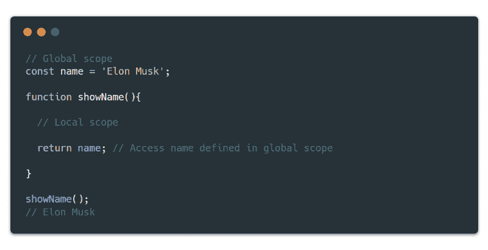

JavaScript local/global scope

#### 是六个

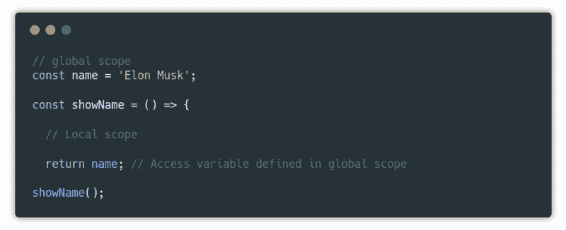

JavaScript local/global scope (arrow functions)

如上例所示，函数`showName()`可以访问其边界内(本地)和边界外(全局)定义的所有内容。请记住，全局作用域不能访问局部作用域中定义的变量，因为它是封闭的，除非您返回它。

### 2.生活

**life(立即调用的函数表达式)，顾名思义就是函数在创建时就被“立即调用”。**在 ES6++提出类/方法来支持面向对象编程范式(OOP)之前，常见的方式是将 IIFE 模拟为一个类名，并将函数调用为包装在`return`类型中的方法。

**这有什么关系？**

*   立即执行代码
*   避免全球范围受到污染
*   支持异步结构
*   提高可读性(有些人可能会提出相反的观点)

#### 例子

在过去的几年里，技术发生了很大的变化。例如，现在你有能力改变任何东西的颜色，比如你的汽车。让我们看一个代码示例。

#### **ES5**

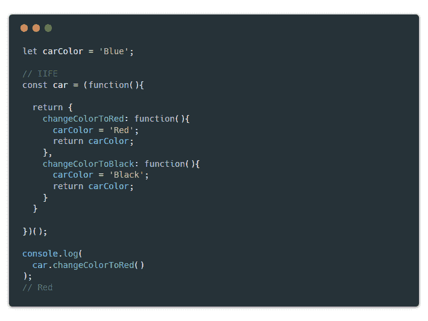

JavaScript IIFE (Immediately Invoked Function Expression)

#### **ES6**

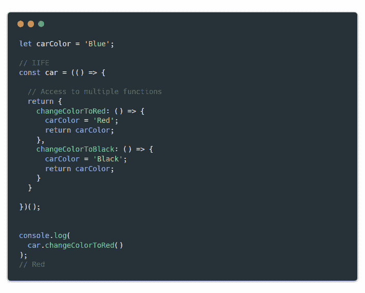

JavaScript IIFE (arrow functions)

在上面的例子中，我们在`return`类型(`changeColorToRed()` & `changeColorToBlack()`)中包装了两个函数。这允许我们访问多个函数，并调用我们想要的方法。

简而言之，我们首先调用`car`(函数表达式)来访问里面的内容。然后我们可以使用`.`符号来调用在`return`类型中定义的函数。这种方法类似于拥有类/方法的结构，其中我们首先调用类名，然后才能调用方法名。通过这种方式，您可以编写干净的、可维护的和可重用的代码。

### 3.手动音量调节

模型-视图-控制器是一个设计框架(*不是编程语言)，它允许我们将行为分离到一个实际的现实世界结构中。如今，几乎 85%的基于 web 的应用程序都以这样或那样的方式拥有这种底层模式。还有其他类型的设计框架，但这是迄今为止最基本、最容易理解的模式。

#### 这有什么关系？

*   长期可扩展性和可维护性
*   易于改进、更新和调试(基于个人经验)
*   易于设置
*   提供结构和概述

#### 例子

让我们看一个 MVC 设计框架的简短例子。

#### 是五个

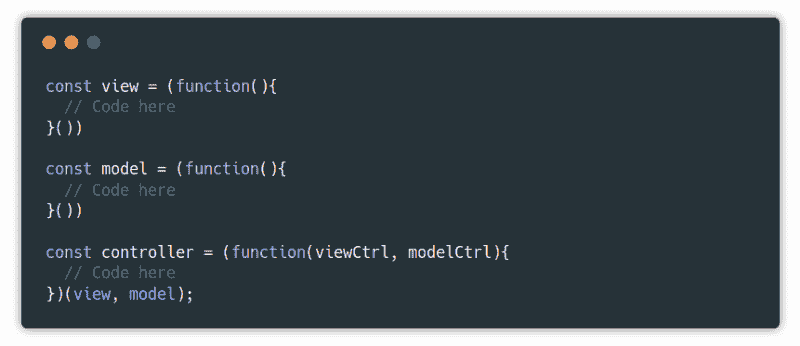

Model-view-controller design-pattern

#### 是六个

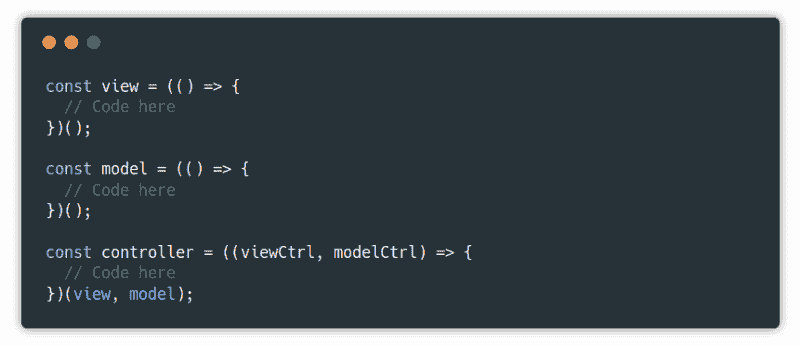

Model-view-controller design-pattern (arrow functions)

如上例所示，根据最佳实践，我们通常会将`view`、`model`和`controller`放在不同的文件夹/文件中，但是为了说明这个概念，我们将它们都放在一个文件中。设计框架的目标是简化开发过程并支持可持续的协作环境。

### 4.异步/等待

停下来，等待事情解决。它提供了一种以更同步的方式维护异步处理的方法。例如，在允许用户进入系统之前，您需要检查用户的密码是否正确(与服务器中存在的密码进行比较)。或者，您可能已经执行了一个 REST API 请求，并且希望在将数据推送到视图之前完全加载数据。

#### 这有什么关系？

*   同步能力
*   控制行为
*   减少“回调地狱”

#### 例子

假设您想从一个 [rest API](https://jsonplaceholder.typicode.com/) 中获取所有用户，并以 JSON 格式显示结果。

#### 是五个

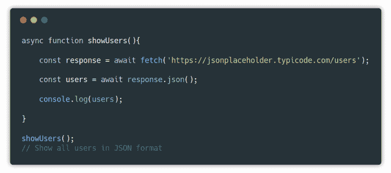

Async and Await promises

#### 是六个

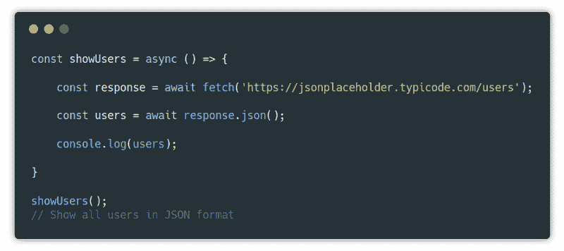

Async and Await promises (arrow functions)

为了使用`await`，我们必须将它包装在一个`async`函数中，以通知 JS 我们正在处理承诺。如示例所示，我们(a)等待两件事情:`response`和`users`。在我们将`response`转换为 JSON 格式之前，我们需要确保已经获取了`response`，否则我们可能会转换一个还不存在的`response`，这很可能会提示一个错误。

### 5.关闭

闭包就是另一个函数中的一个函数。当您想要将行为(如传递变量、方法或数组)从外部函数扩展到内部函数时，可以使用它。我们也可以从内部函数访问外部函数中定义的上下文，但不能反过来(记住我们上面谈到的范围原则)。

#### **这有什么关系？**

*   扩展行为
*   处理事件时很有用

#### **例子**

假设您是沃尔沃的开发工程师，他们需要一个只打印汽车名称的功能。

#### 是五个

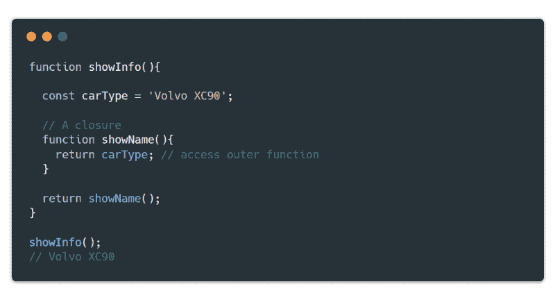

JavaScript closure

#### 是六个

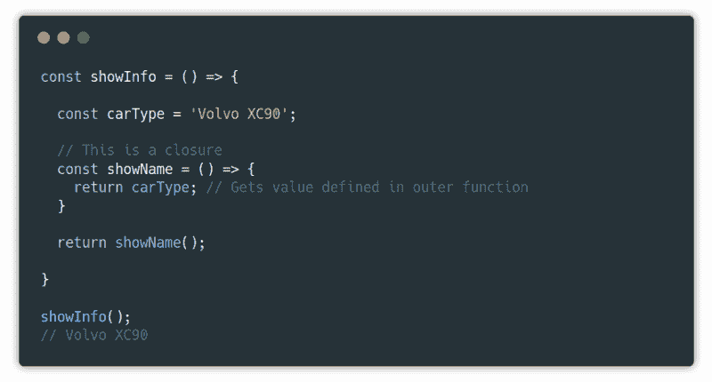

JavaScript closure (arrow functions)

函数`showName()`是一个闭包，因为它扩展了函数`showInfo()`的行为，并且还可以访问变量`carType`。

### 6.回收

回调是在另一个函数执行之后执行的函数。它也被称为呼叫后。在 JavaScript 世界中，等待另一个函数执行或返回值(数组或对象)的函数被称为回调。回调是使异步操作更加同步的一种方式(顺序)。

#### **这有什么关系？**

*   等待事件执行
*   提供同步功能
*   链接功能的实用方法(如果完成了 A，则执行 B，依此类推)
*   提供代码结构和控制
*   注意，你可能听说过*回调地狱。这基本上意味着你有一个递归的回调结构(回调中的回调，等等)。[这个不实用](http://blog.mclain.ca/assets/images/callbackhell.png)。*

#### **例子**

假设 SpaceX 的 Elon Musk 需要一个功能，当按下按钮时，它将启动猎鹰重型飞机的 27 个梅林引擎(世界上最强大的火箭的两倍)。

#### 是五个

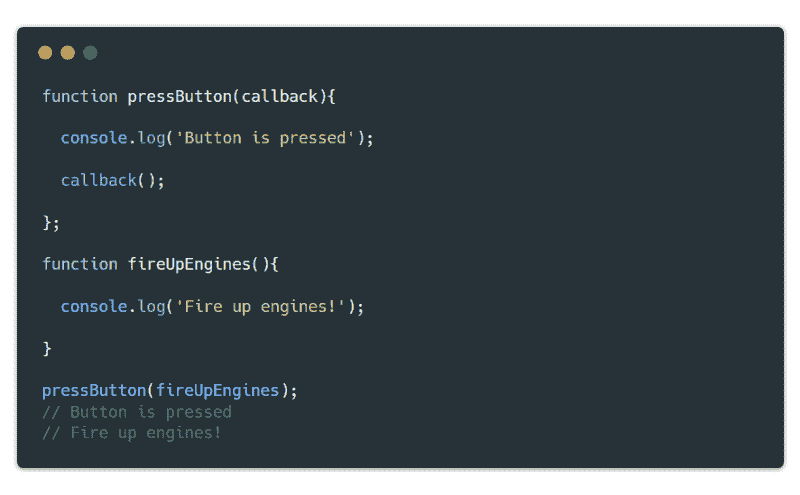

JavaScript Callback

#### 是六个

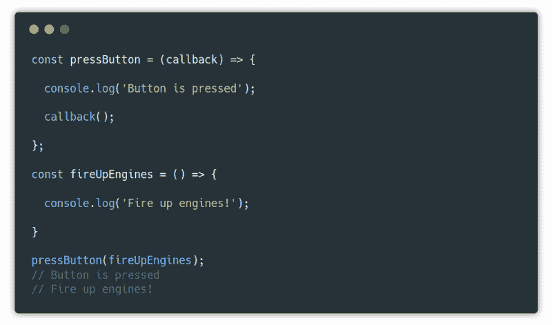

JavaScript Callback (arrow functions)

请注意，在执行操作(启动引擎)之前，它会等待事件发生(单击按钮)。简而言之，我们将`fireUpEngines()`函数作为参数(回调)传递给`pressButton()`函数。当用户按下按钮时，引擎就会启动。

所以你有它！一些最流行的 JS 概念用例子简单解释。我希望这些概念能够帮助您更好地理解 JS 以及它是如何工作的。

你可以在我每周发表文章的媒体上找到我。或者你可以在 Twitter 上关注我，在那里我会发布相关的 web 开发技巧和窍门以及个人故事。

*附:如果你喜欢这篇文章，还想看更多这样的文章，请为❤鼓掌，并与朋友分享，这是善缘*