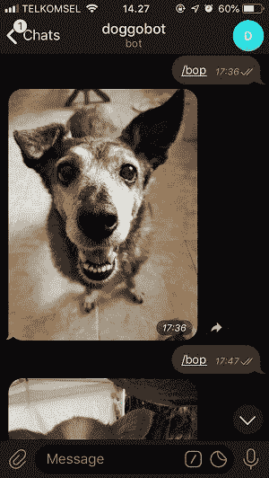

# 学习用 Python 在 Telegram 中构建你的第一个机器人

> 原文：<https://www.freecodecamp.org/news/learn-to-build-your-first-bot-in-telegram-with-python-4c99526765e4/>

想象一下，有一个消息机器人会在你需要的时候给你发送一个随机的可爱的狗狗图片，听起来很酷吧？我们做一个吧！

对于本教程，我们将使用 **Python 3、 [python-telegram-bot](https://github.com/python-telegram-bot/python-telegram-bot) 、**和公共 API [、T5【RandomDog](https://random.dog/)**。**

在本教程结束时，你将拥有一个缓解压力的机器人，它会在你需要的时候给你发送可爱的狗狗图片，耶！

### 入门指南

在我们开始编写程序之前，我们需要为我们的机器人生成一个令牌。需要令牌来访问电报 API，并安装必要的依赖项。

#### 1.在 BotFather 中创建新的机器人

如果你想在 Telegram 中制作一个机器人，你必须在使用它之前先“注册”你的机器人。当我们“注册”我们的 bot 时，我们将获得令牌来访问 Telegram API。

转到[机器人父亲](https://telegram.me/BotFather)(如果你在桌面打开它，确保你有电报应用)，然后通过发送`/newbot`命令创建新的机器人。遵循这些步骤，直到您获得您的 bot 的用户名和令牌。您可以通过访问这个 URL: `[https://telegram.me/YOUR_BOT_USERNAME](https://telegram.me/YOUR_BOT_USERNAMEa)` 来访问您的 bot，您的令牌应该如下所示。

```
704418931:AAEtcZ*************
```

#### 2.安装库

因为我们将在本教程中使用一个库，所以使用以下命令安装它。

```
pip3 install python-telegram-bot
```

如果库安装成功，那么我们就可以开始了。

### 写程序

让我们制作第一个机器人。当我们发送`/bop`命令时，这个机器人应该返回一个狗的图像。为了能够做到这一点，我们可以使用来自[**RandomDog**](https://random.dog/)**的公共 API 来帮助我们生成随机的狗图像。**

**我们机器人的工作流程就像这样简单:**

> **访问 API ->获取图像 URL ->发送图像**

#### **1.导入库**

**首先，导入我们需要的所有库。**

```
`from telegram.ext import Updater, CommandHandler
import requests
import re`
```

#### **2.访问 API 并获取图像 URL**

**让我们创建一个函数来获取 URL。使用请求库，我们可以访问 API 并获得 json 数据。**

```
`contents = requests.get('https://random.dog/woof.json').json()`
```

**您可以通过在浏览器中访问 URL: `https://random.dog/woof.json`来检查 json 数据。您将在屏幕上看到类似这样的内容:**

```
`{“url":"https://random.dog/*****.JPG"}`
```

**获取图像 URL，因为我们需要该参数来发送图像。**

```
`image_url = contents['url']`
```

**将这段代码包装成一个名为`get_url()`的函数。**

```
`def get_url():
    contents = requests.get('https://random.dog/woof.json').json()    
    url = contents['url']
    return url`
```

#### **3.发送图像**

**要发送消息/图像，我们需要两个参数，图像 URL 和收件人的 ID——可以是组 ID 或用户 ID。**

**我们可以通过调用我们的`get_url()`函数来获取图片 URL。**

```
`url = get_url()`
```

**使用以下代码获取收件人的 ID:**

```
`chat_id = update.message.chat_id`
```

**在我们获得图像 URL 和收件人 ID 之后，就该发送消息了，这是一个图像。**

```
`bot.send_photo(chat_id=chat_id, photo=url)`
```

**将代码包装在一个名为`bop`的函数中，并确保您的代码如下所示:**

```
`def bop(bot, update):
    url = get_url()
    chat_id = update.message.chat_id
    bot.send_photo(chat_id=chat_id, photo=url)`
```

#### **4.`Main program`**

**最后，创建另一个函数`main`来运行我们的程序。**不要忘记用我们在本教程前面生成的令牌来更改** `YOUR_TOKEN`。**

```
`def main():
    updater = Updater('YOUR_TOKEN')
    dp = updater.dispatcher
    dp.add_handler(CommandHandler('bop',bop))
    updater.start_polling()
    updater.idle()

if __name__ == '__main__':
    main()`
```

**最后，您的代码应该如下所示:**

```
`from telegram.ext import Updater, InlineQueryHandler, CommandHandler
import requests
import re

def get_url():
    contents = requests.get('https://random.dog/woof.json').json()    
    url = contents['url']
    return url

def bop(bot, update):
    url = get_url()
    chat_id = update.message.chat_id
    bot.send_photo(chat_id=chat_id, photo=url)

def main():
    updater = Updater('YOUR_TOKEN')
    dp = updater.dispatcher
    dp.add_handler(CommandHandler('bop',bop))
    updater.start_polling()
    updater.idle()

if __name__ == '__main__':
    main()`
```

#### **5.运行程序**

**厉害！你完成了你的第一个程序。现在让我们检查它是否工作。保存文件，将其命名为`main.py`，然后使用这个命令运行它。**

```
`python3 main.py`
```

**通过访问以下网址转到您的电报机器人:`https://telegram.me/YOUR_BOT_USERNAME`。发送`/bop`命令。如果一切运行正常，机器人会回复一张随机的狗图片。可爱吧？**

**

One random generatedly image** 

### **处理错误**

**太好了！现在你有了一个机器人，它会在你需要的时候给你发送可爱的狗狗图片。**

**还有呢！[**RandomDog**](https://random.dog/)**API 不仅可以生成图片，还可以生成视频和 gif。如果我们访问 API 并获得视频或 GIF，就会出现错误，机器人不会发送给你。****

****让我们解决这个问题，这样机器人将只发送带有图像附件的消息。如果我们得到一个视频或 GIF，那么我们将再次调用 API，直到我们得到一个图像。****

#### ****1.使用正则表达式匹配文件扩展名****

****我们将使用正则表达式来解决这个问题。****

****为了区分一张图片是视频还是 GIF，我们可以看一下文件扩展名。我们只需要我们的网址的最后一部分。****

```
**`https://random.dog/*****.JPG`**
```

****首先，我们需要定义程序中允许的文件扩展名。****

```
**`allowed_extension = ['jpg','jpeg','png']`**
```

****然后使用正则表达式从 URL 中提取文件扩展名。****

```
**`file_extension = re.search("([^.]*)$",url).group(1).lower()`**
```

****使用这段代码，创建一个名为`get_image_url()`的函数来迭代 URL，直到得到我们想要的文件扩展名(jpg、jpeg、png)。****

```
**`def get_image_url():
    allowed_extension = ['jpg','jpeg','png']
    file_extension = ''
    while file_extension not in allowed_extension:
        url = get_url()
        file_extension = re.search("([^.]*)$",url).group(1).lower()
    return url`**
```

#### ****2.修改您的代码****

****太好了！现在对于最后一部分，用`url = get_image_url()`替换`bop()`函数中的`url = get_url()`行，您的代码应该如下所示:****

```
**`from telegram.ext import Updater, InlineQueryHandler, CommandHandler
import requests
import re

def get_url():
    contents = requests.get('https://random.dog/woof.json').json()    
    url = contents['url']
    return url

def get_image_url():
    allowed_extension = ['jpg','jpeg','png']
    file_extension = ''
    while file_extension not in allowed_extension:
        url = get_url()
        file_extension = re.search("([^.]*)$",url).group(1).lower()
    return url

def bop(bot, update):
    url = get_image_url()
    chat_id = update.message.chat_id
    bot.send_photo(chat_id=chat_id, photo=url)

def main():
    updater = Updater('YOUR_TOKEN')
    dp = updater.dispatcher
    dp.add_handler(CommandHandler('bop',bop))
    updater.start_polling()
    updater.idle()

if __name__ == '__main__':
    main()`**
```

****不错！一切都应该完美运行。你也可以查看我的 [GitHub](https://github.com/dzakyputra/doggobot) 账号获取代码。****

****最后，恭喜你完成本教程，加上你现在有一个很酷的电报机器人。****

****如果你认为我的代码或文字有任何错误，请留下评论，因为我还在学习，我想变得更好。****

****谢谢你，祝你练习顺利！:)****