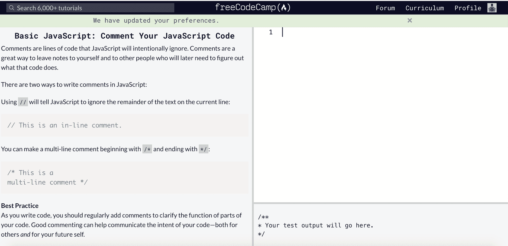
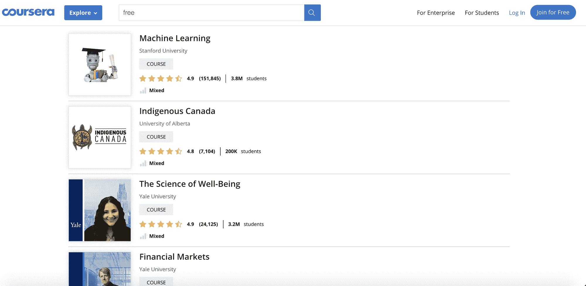
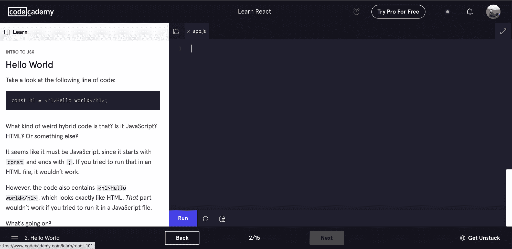
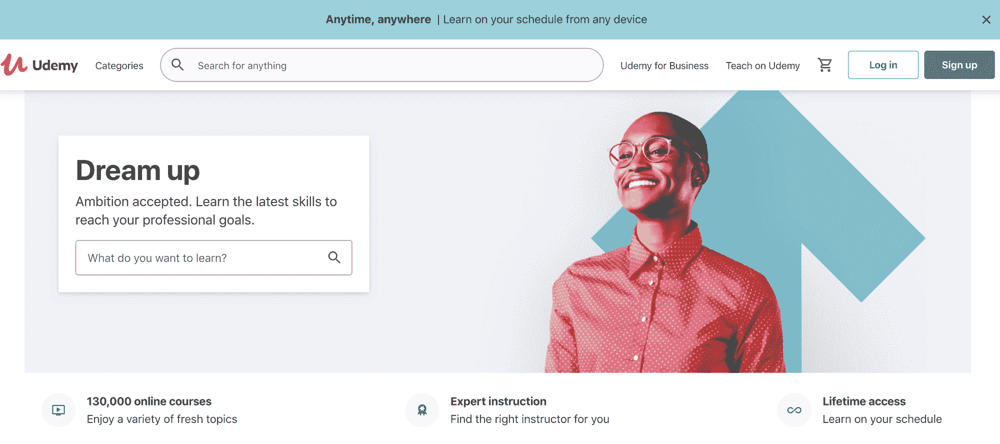
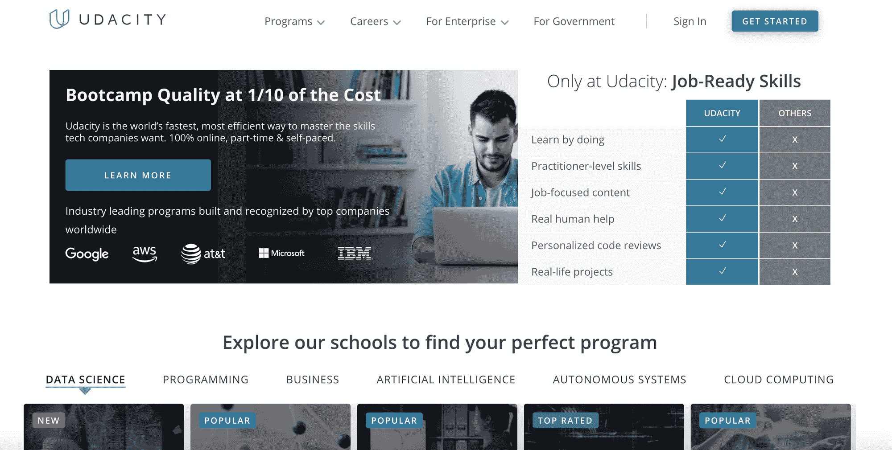
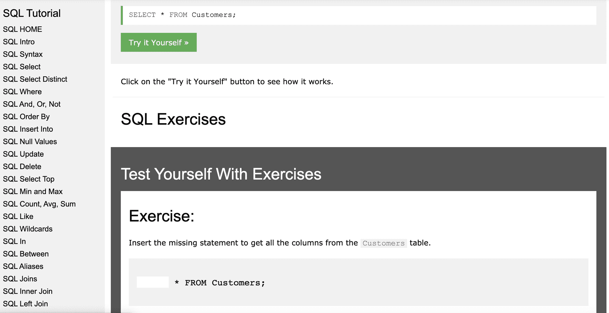
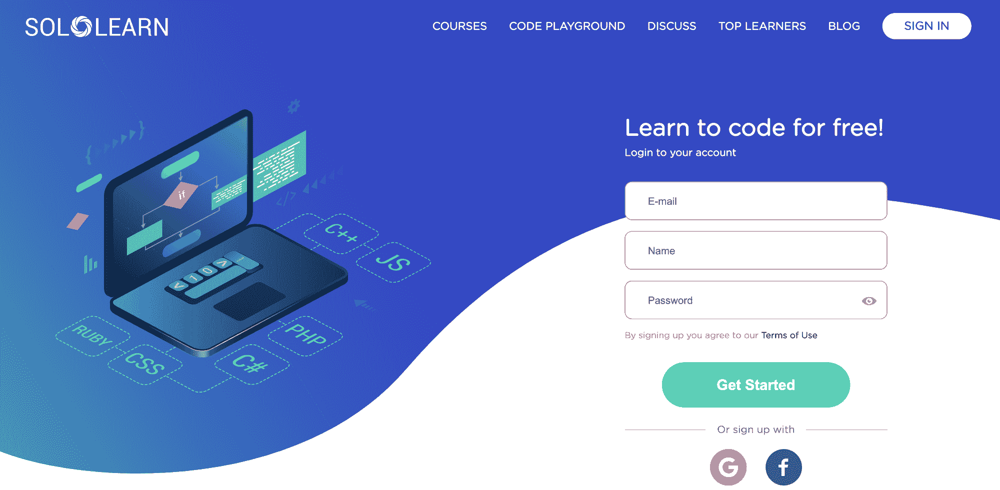
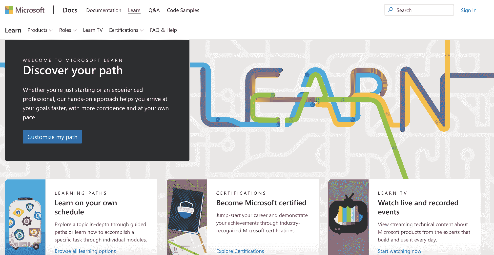
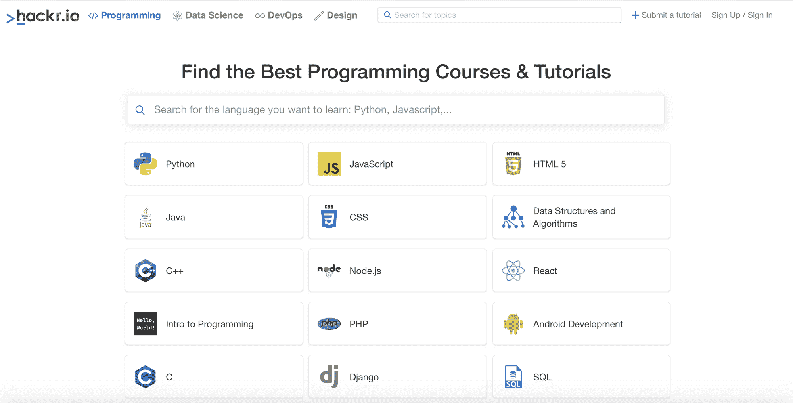

# 如何在 2021 年学习编码——学习编码的 10 个免费网站

> 原文：<https://www.freecodecamp.org/news/learn-to-code-in-2021-10-free-websites-for-learning-coding/>

随着 2020 年我们将长期呆在家里，越来越多的人在网上提高自己的技能。在线学习经济实惠、灵活且易于个性化。

好处是显而易见的，但结果是深远的——学生、远程工作者、学者和建筑工人都从在线学习中受益。我甚至从下面的资源中自学了新的技术技能。

这让我从零开始建立了一个网站，让人们和学生在家工作。很酷，对吧？

有了正确的资源和工具，你也可以获得学习成果，转化为立竿见影的效果，并帮助你构建产品。

但是在一个地方找到所有合适的工具来提高你的教育是困难的。这篇文章解决了这个问题:通过在一篇文章中轻松地找到学习如何编码所需的所有资源，我希望您可以更快地开始学习。

## 在线学习是如何工作的？

有些人对网上学习持怀疑态度。传统观点认为，你需要一对一的课程、实时反馈和同龄人之间的合作。

但是你猜怎么着？所有这些核心优势现在都在网上。我的一个好朋友不是搞技术的，而是搞法律的。他告诉我他在法学院练习和运用苏格拉底式教学法的时候。

这种基于提问和回答问题来激发批判性思维的个人之间的合作性辩论式对话形式，帮助他保留材料，深刻理解核心概念，并进行练习。

这些网站为用户部署了一套类似的体验:你被迫学习、实践、参与、实际编码、看到你的错误、了解你做得好的地方、跟踪你的进展。

很像苏格拉底式教学法，这些网站磨练你的批判性思维技能。他们坚持不懈地致力于提高你观察问题、识别模式并最终提高的能力。

事不宜迟，这里有最好的免费、最可靠的学习如何编码的教育网站。

## **freeCodeCamp**

freeCodeCamp 是美国的一个非营利组织，致力于帮助人们免费学习编码。

通过他们的内容，包括由视频和文章支持的交互式编码教程，他们已经帮助 40，000 名学习者在谷歌、Spotify、微软等公司找到了他们梦想的工作。

你可以通过完成各种类别的课程来获得认证。freeCodeCamp 提供关于网页设计、质量保证、数据可视化、机器学习和其他主题的内容。它们也涵盖了编码相邻的框架，如[敏捷/Scrum 方法论](https://www.freecodecamp.org/news/why-scrum-is-pandemic-proof/)。

除了 3000 小时(免费)的课程，他们还有一个受欢迎的 YouTube 频道和 T2 技术出版物。

## **Coursera**

这个网站是学生、员工或管理者增长技能和跟上各自领域最新发展的最佳参考之一。

它提供免费的课程、教程和大量你想学的任何东西的资源。这些选项是由来自世界各地顶尖大学的教授们编制和教授的。

你可以在 [Coursera](https://www.coursera.org/) 上探索这么多以编码为中心的内容。值得注意的是，如果你想通过 Coursera 获得认证，你会碰到他们的付费墙。

但是，你可以从初学者或更高的水平免费学习编程入门、HTML、CSS、loT 编程、C 语言、Python、Java 等等。

Coursera 也有非技术内容，可以帮助你理解更广泛的主题，包括产品设计，数字营销，甚至税务规划。所有有趣且相关的内容。

## **代码学院**

Codecademy 是一个专门致力于编码的平台。根据他们的网站，仅在 7 年内，就有 4500 万学习者通过他们的网站发展了他们的编码技能。

您可以通过评估您的编码技能来开始您的 Codecademy 学习之旅，以便找出哪个级别最适合您。或者，如果你是初学者，准备在几分钟内开始编码。

他们的学习软件允许你边做边学，也就是“熟能生巧”。通过对你的编码技能的即时测试，你可以确信你正在正确地应用你所学的东西。

随着学习模块难度的增加，他们提供了很好的工具提示和实时反馈来解除您的障碍。

你有各种各样的选择，包括网页开发、数据科学、计算机科学、机器学习、网页设计、游戏开发和移动开发。

您还可以通过 HTML & CSS、Python、Javascript、Java、SQL、C++、PHP 等课程立即开始学习语言。

## **edX**

edX 提供哈佛、麻省理工、乔治敦、不列颠哥伦比亚大学等知名大学的免费在线课程。他们有几个类别可供选择，但如果你是在学习编码后，你一定会找到适合你的。

我建议你查看他们的计算机科学和数据科学类别，了解关于全栈开发、Javascript、Python、AI、机器学习等的深入课程。

要获得认证证书，您需要付费。也有一些课程需要付费，但在大多数情况下，你可以通过参加免费课程学到很多东西。

## **我们打**

Udemy 是一个非常独特的学习平台，因为它拥有世界上最大的课程集合。这是因为他们所有的内容都是用户生成的，所以你的导师可以是专家、教授或程序员。

关于 web 开发世界，有很多免费和付费的课程。在为你选择课程时，一定要检查别人给出的评分——这通常是你应该如何优先选择课程的一个不错的晴雨表。

然后，开始学习设计、IT、软件开发，从初学者提升到专业。

## **Udacity**

该平台提供了广泛的免费和付费课程，帮助学习者通过在现实生活项目中实践来完善他们所需的技能。这有助于在提高你的专业和技术技能后马上找到工作。

你可以自由支配掌握下一项技术技能所需的时间，也可以自由选择不同的选项。他们的类别包括编程、数据科学、人工智能、云计算等等。

## **w3 学校**

W3Schools 是最古老和最大的在线学校之一。如果想温习一下现在的学校，真的很棒。我强烈推荐他们的 SQL 教程。它不仅可以帮助你学习编码，还可以帮助你不断地重新学习某些语法和命令。

当我开始工作时，我经常参考他们的 SQL 文档。

因此，即使你是一名编程专家，W3Schools 也充满了参考资料和示例，可以帮助你始终保持领先。他们也有一个相当不错的视频教程库。

你可以随时选择他们的付费认证。但是如果你只是一个初学者，从这个平台你可以很容易掌握很多。无论您选择 HTML & CSS、Javascript、PHP、Python、Java，还是任何一种可用的语言，您都将很快开始编码。

一位前同事在温习 devops 技能时，使用该网站学习如何构建 SMB 服务器。你可以学习和实践的内容，换句话说，是立即适用的。

## **SoloLearn**

这个令人惊叹的平台将学习编码变成了一件非常社会化和互动的事情。SoloLearn 致力于创建一个开发者社区，学习者可以在那里互动，收集积分，并出现在他们的“顶级学习者”部分。

它既可以在网络上使用，也可以在移动应用程序上使用，因此您可以随时随地学习。此外，你可以成为谈话的一部分。您可以在“代码操场”和“讨论”部分提问、回答其他人的问题，并与其他学习者一起分享乐趣。

课程包括 Python、C++、Java、Javascript、SQL、PHP、HTML & CSS、React、Angular，以及你能想到的几乎所有与代码相关的东西。

## **微软学习**

微软现在提供了一个新的平台，该平台提供了一种交互式体验，以学习补充微软产品和服务的技术技能，包括 Azure、Microsoft 365、Microsoft Dynamics 等。

无论是初学者还是高级水平，Microsoft Learn 都可以帮助学习者亲自动手编写代码。

学习者可以选择保持在线，按照自己的进度学习，或者参加教师指导的课程。当然，您总是可以选择获得平台的认证。

## **Hackr.io**

这个平台在功能和应用上都是独一无二的。如果你想在同一个地方找到来自不同来源的多个课程，只需看看 Hackr.io 就行了。

该网站的算法允许任何人发布他们的课程，但通过用户的投票，最好的课程会被排在最前面。你可以使用过滤器来过滤掉不相关的课程和教程，只挑选符合你需求的。

## 结论:通过免费网站学习编码

当你在网上学习时，你可以按照自己的速度前进，更深入地探索你关心的主题，并利用虚拟社区的力量来加速你对基础主题的理解。

建立顶级资源列表需要一些挖掘和猜测工作。你需要问问题，四处打探，并尝试这些网站。使用这个列表作为你的指南，但是也要自己去挖掘。

这些网站不仅仅是教育资源，它们本身也是产品。这意味着他们有优势和需要改进的地方。我喜欢制作产品，通过使用这些网站，我提高了自己的能力和资质。

我希望这些网站能对你正在构建的任何东西有所帮助，无论是视频流技术、为自己构建网络应用，还是利用技术围绕共同兴趣培养社区。

你现在有了学习编码的垫脚石，所以开始你的旅程，为 2021 年做一个转变。

继续努力！