# 学习编码 RPG——一个视觉新颖的视频游戏，在这里你可以学习计算机科学的概念

> 原文：<https://www.freecodecamp.org/news/learn-to-code-rpg/>

大家好，我是林恩。我非常荣幸地宣布**学习编写 RPG 代码**的启动，这个项目我们已经秘密开发了八个月。

**学习编码 RPG** 是一个互动的视觉小说游戏，在这里你将自学编码，结交科技行业的朋友，并追求你成为开发人员的梦想。🎯

游戏特点:

*   数小时的游戏🎮
*   原创艺术和音乐🎨
*   600 多个计算机科学测验问题📚
*   您可以发现 50 多个复活节彩蛋🚀
*   6 种不同的结局👀
*   友好的角色和可爱的猫🐱
*   迷你游戏！👾

这是第一次发布，我们希望在未来增加更多的内容。未来的版本将会有更多的**角色、场景、支线任务、美术、音乐、**以及**迷你游戏**。(CS 竞猜速跑和生存模式，有人吗？)我们还计划将其本地化为不同的语言。🌎天空是这里的极限。✈️

## 可以在 [itch.io](https://freecodecamp.itch.io/learn-to-code-rpg) 上下载免费播放。

如果你想了解更多关于游戏本身，我的开发过程，等等，请继续阅读。这是一个非常视觉化的开发日志(我们的游戏是一部视觉小说是有原因的)，我相信你会喜欢它。


Learn to Code RPG – A game where you role play learning to code

## 一切开始的地方

让我们从我的一些背景开始。

我从小就喜欢故事丰富的电子游戏。🧒🏻

我对游戏开发的兴趣激励我在大学主修计算机科学。2021 年 6 月，我从芝加哥大学毕业，获得了计算机科学的联合学士和硕士学位。

2021 年 7 月，当我计划搬到旧金山开始我的软件开发职业生涯时，昆西向我提出了这个游戏的想法。

> 在这个游戏中，你可以学习编码、交朋友、探索科技文化，并最终进入科技行业。🎯

虽然我涉足过像 Unity 和 Ren'Py 这样的游戏开发引擎，并且在自己的时间里创建过一些小的激情项目，但这将是我第一次在一个(大部分)单人团队中从头开始构建一个游戏。也就是说，我有点被这个让我游戏开发梦想成真的机会淹没了。🤯

嗯，你知道这句谚语:如果你在火箭飞船上得到一个座位🚀，不要问什么座位！

所以我答应了，然后一头扎了进去。

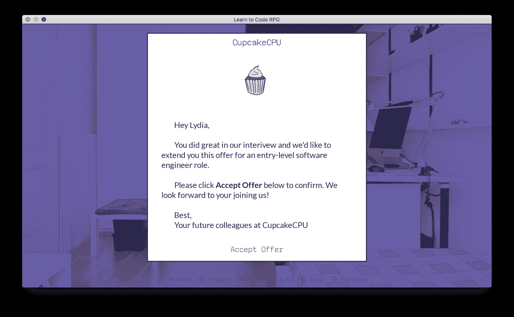

Who am I to turn down an offer from CupcakeCPU? 🧁

## 从零到英雄:如何在四个月内打造一款游戏

### 故事

故事的想法从一开始就非常清晰:男女主角决定学习编码，克服旅途中的障碍，遇到盟友和导师，并最终获得大奖——一份闪亮的开发人员工作。

我从[英雄之旅](https://en.wikipedia.org/wiki/Hero%27s_journey)的经典写作框架开始，或者说，17 段单体。

(自从我开始做这个游戏，我一次又一次地希望我在大学里至少上过一门创意写作课。😅)

下面是我对 17 个阶段中的第一和第三阶段的概述，直接来自我的谷歌文档:

| 1。冒险的召唤 | 英雄旅程的第一阶段往往会向观众呈现主角当前(有时相当世俗)的存在。 | 主角(缩写 MC) 毕业，搬回父母身边。她并不确定自己的职业生涯会是什么样子，所以她整天都在工作和浏览职位空缺。她申请了一些销售和咨询的工作，但都被拒绝了。 |

| 3。超自然援助 | 在这一阶段的旅程中，主角寻找一个圣人般的人物，并可能在这个过程中获得一件特殊物品或技能。 | 安妮卡， MC 大学时最好的朋友，有一天打电话给 MC。安妮卡很兴奋，因为她刚刚获得了一个入门级的网站开发角色，此前她花了 6 个月的时间来温习她生疏的 CS 技能(在大学里旁听了一些 CS 课程)。安妮卡询问 MC 近况如何；很高兴 MC 也在考虑学习编码；并鼓励 MC，如果有正确的学习方法和资源，她也能做到。  安妮卡向 MC 介绍她使用的资源。 |

### 人物

包括玩家控制的主要角色，我们在游戏中有四个主要角色:

*   主角**莉迪亚**，一名刚从大学毕业的大学生。(在游戏的未来版本中，我们可能会提供一些不同的主要角色供玩家选择。)
*   **安妮卡**，主角的大学好友
*   马尔科成为主角的导师
*   主角的第一份开发工作中的伙伴蕾拉

我是通过在 Pinterest 上收集图片开始设计角色的。然后，昆西和我委托一个艺术家在线创建角色精灵和飞溅的形象。

在下面的图片中，你可以看到 Pinterest 人物灵感(版权属于他们的原创艺术家)和最终设计并排在一起。

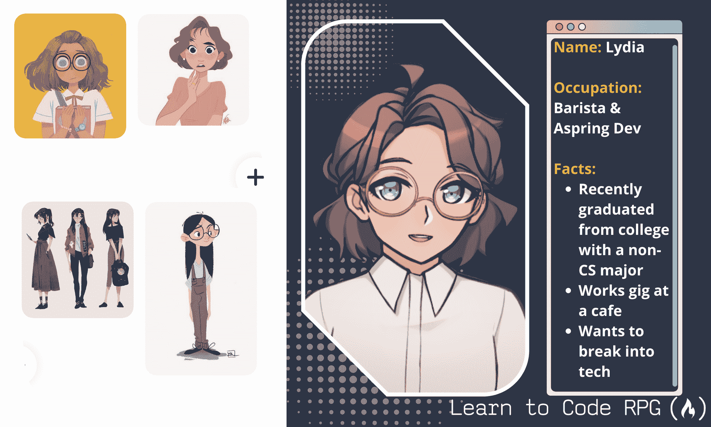

Lydia inspiration art + final character card


Annika inspiration art + final character card

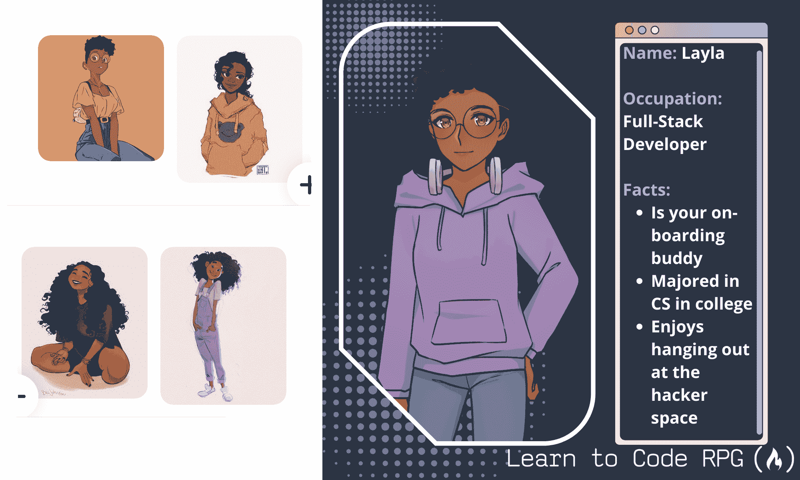

Layla inspiration art + final character card

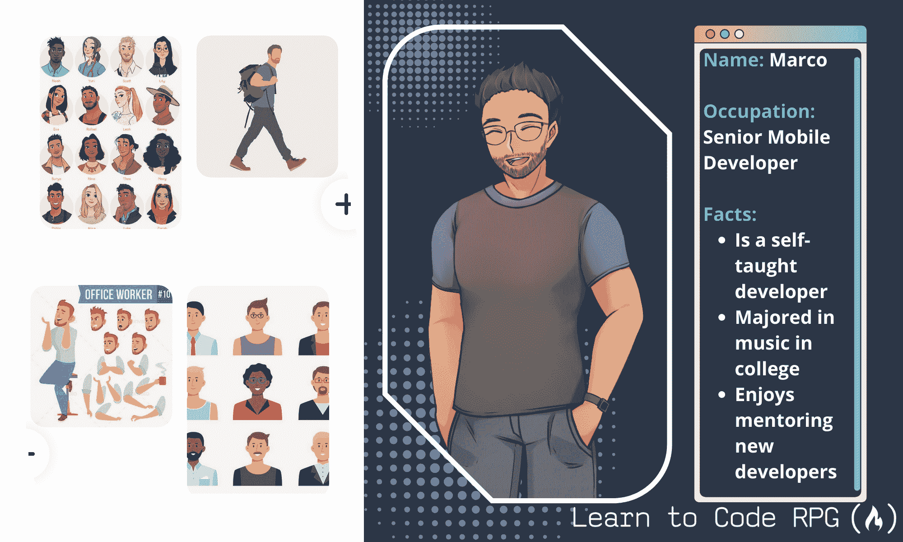

Marco inspiration art + final character card

现在我们有了主要演员阵容，我们还需要什么来给**莉迪亚**增加更多的角色深度，这样她就不会整天一个人坐在房间里磨代码了？也许她可以在房间里养只猫？🐱

并输入 **Mint** ，莉迪亚的猫。(我作为临时艺术家的艺术，这样我们的艺术家可以专注于人物。数字艺术🎨是我仅次于游戏开发的第二大爱好。)

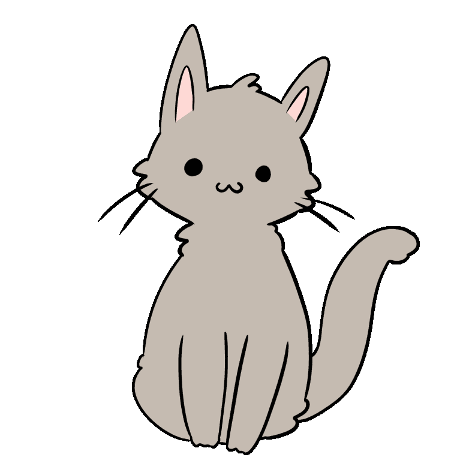

Mint says hi!

### 图形

随着字符图形的完成，你可能会认为这就结束了大部分的图形。但不要这么快！视觉小说，顾名思义，是视觉的，所以它需要更多的图形来讲述一个吸引人的故事。

例如，在下图中，除了字符精灵之外，还有背景图像和一些 GUI 组件，如文本框。

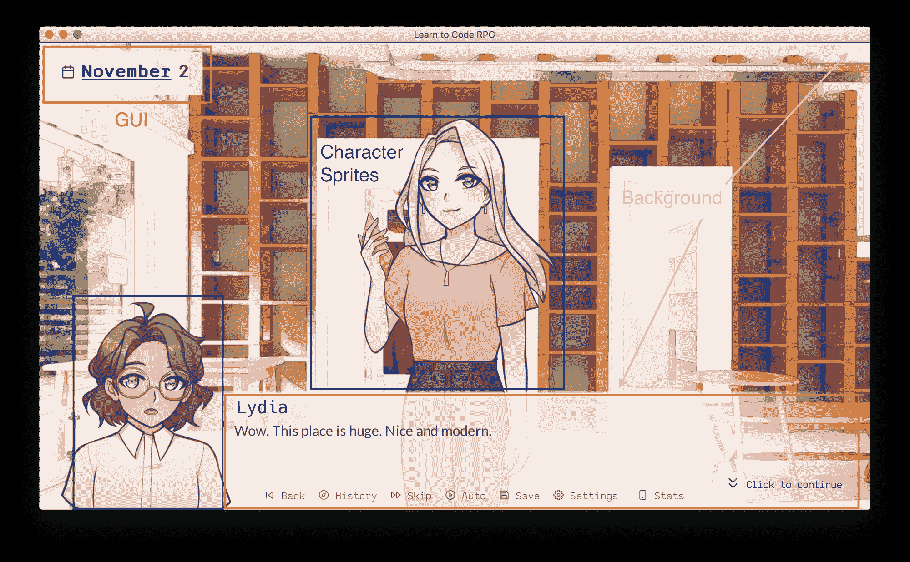

Basic graphic components: GUI, character sprites, background

为了创建背景图片，我对图片应用了特殊效果滤镜来添加水彩般的纹理。通过这种方式，我们的角色的配色方案与背景完美融合。

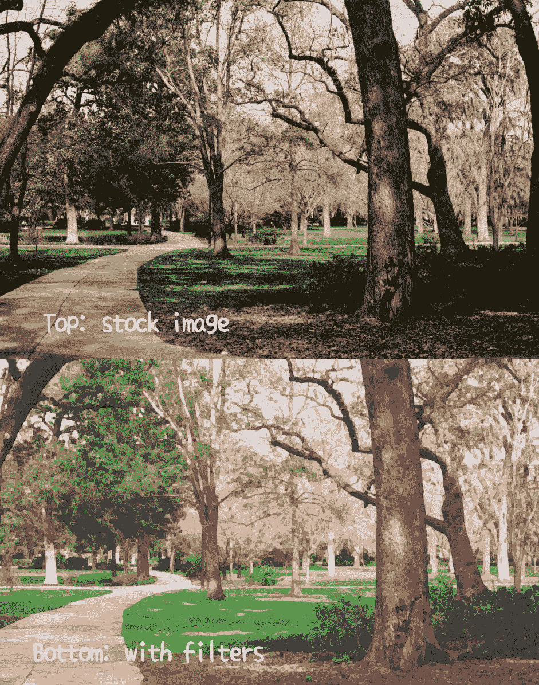

Top: stock image. Bottom: with filters

为了说明一天中时间的流逝，我通过编程应用颜色处理来改变背景图像的照明。(如果您对实现细节感兴趣，请查看我们的 GitHub repo ！)


Four modes of lightning

为了激励自己，每当我想拖延的时候，我就会切换我的创意齿轮，在游戏中出现的各种各样的项目上涂鸦。🤣

这就是我们如何得到游戏中的饼干，烤面包，比萨饼，炸鸡，等等！

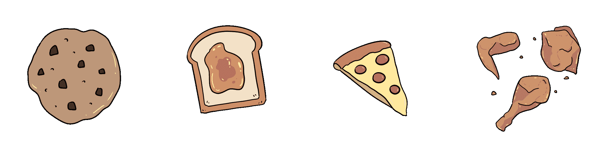

Yummy!

### 代码

我用了我最熟悉的游戏引擎，[Ren ' py 视觉小说引擎](https://www.renpy.org/)。我重用了我以前的激情项目中的很多代码——例如，[闪烁的角色精灵](https://gist.github.com/RuolinZheng08/b845f416ebda5b02ebc6b62379105564)和[一个节奏迷你游戏](https://github.com/RuolinZheng08/renpy-rhythm)。

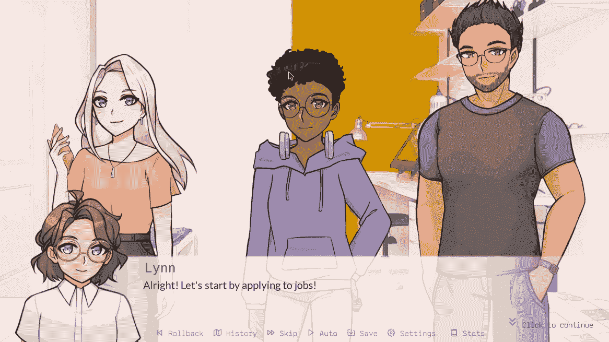

Blinking characters 😉

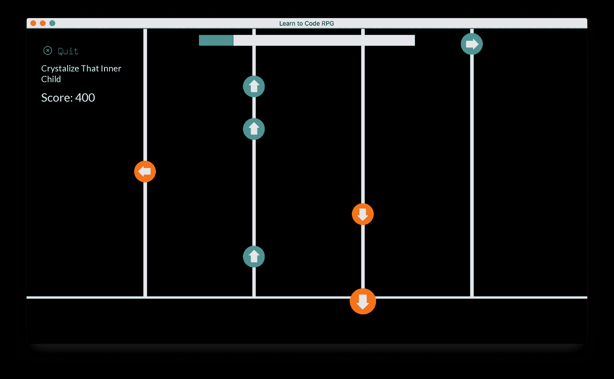

Rhythm Minigame. Can you get a perfect score?

我还加入了一些开源的 Ren'Py 代码，比如动态文本标签的代码[和羽毛图标文本的代码](https://wattson.itch.io/kinetic-text-tags)。

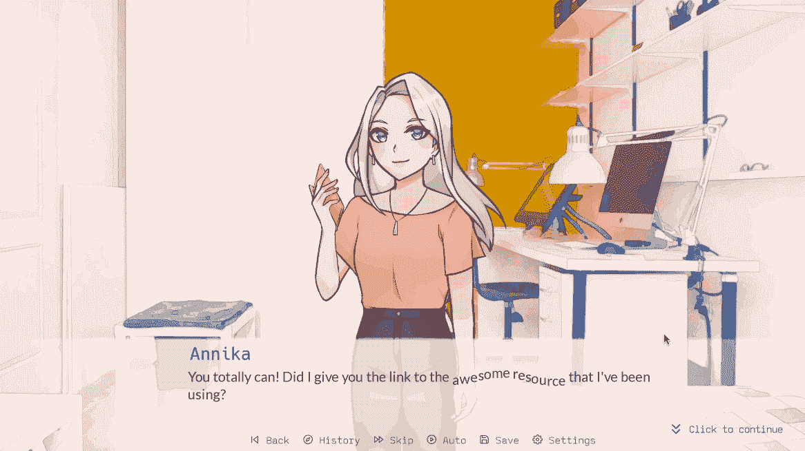

Kinetic text tag, which can be turned off for accessibility

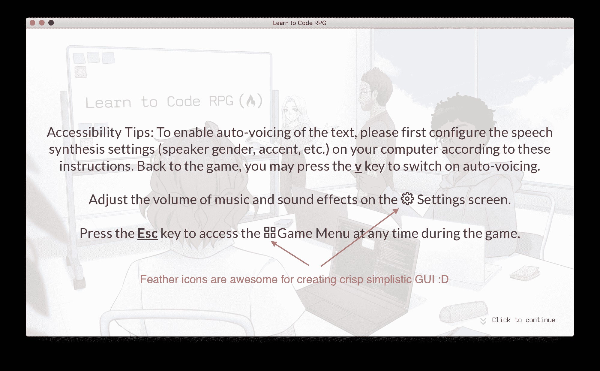

Feather icons are awesome for creating crisp, simplistic GUI

我将避免在这里深入代码库(因为我不知道什么时候停止😆).只需知道这是大量的代码，包括逻辑和 GUI。参见下面的伦比·林特报告。

咳...我们现在可以转向更直观的东西了吗？

```
Ren'Py 7.4.8.1895 lint report, generated at: Fri Dec 17 22:11:43 2021
Statistics:
The game contains 1,335 dialogue blocks, containing 15,390 words and 85,105 characters, for an average of 11.5 words and 64 characters per block.
The game contains 40 menus, 20 images, and 49 screens.
```

### 进度跟踪器

即使是一个人的项目，也需要一个项目经理，为什么不自己做项目经理呢？

我使用 Trello 来跟踪我的过程并与其他人合作。我甚至给不同类别的任务标上了颜色，比如*编码、UI/UX、写作、*等等，如下图所示，在**待办事项**栏的第一张卡片上。

哇，这难道不是一个完成任务的长卷吗？😤

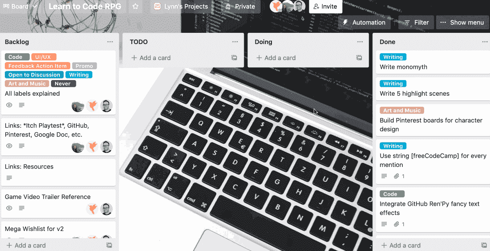

My Trello board

**待办事项**和**待办事项**栏中的所有事情都被移到**已完成**栏，这样我们就到了...

## 我的外卖

万岁！经过八个月的时间(四个月的想法酝酿，加上四个月紧张的编码、写作和艺术制作)，我们向您呈现**学习编码 RPG。🥳**

在四个月的游戏时间里，**莉迪亚**已经从*一个有抱负的工程师*成长为*一个从事开发工作的工程师*。🎯

在现实世界的四个月里，我已经从一个有抱负的游戏开发者 成长为一个真正开发游戏的游戏开发者**。** 👾

很自然，这个百万美元的问题来了:我从整个过程中得到什么？

嗯，像任何创造性的过程一样，游戏开发并不容易。我非常幸运有一个团队支持我:我们的艺术家 Noa 创造了角色艺术，Quincy 创造了令人敬畏的原始音乐曲目，以及来自 freeCodeCamp 工作人员的校对和测试人员。

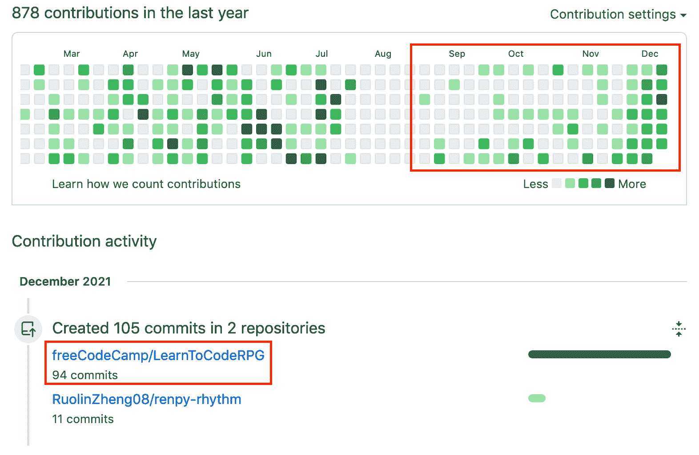

My GitHub contributions tell apart the days when I code vs. the days when I brainstorm or write or draw 🤪

我在技术技能(通过寻找创造性的方法在 Ren'Py 中构建东西)、非技术技能(通过担任我自己的项目经理)以及更多方面(通过管理期望、克服冒名顶替综合症和寻求工作与生活的平衡)都得到了提高。

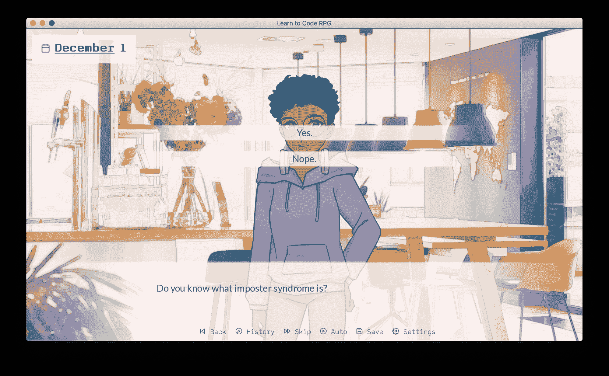

Do you know what imposter syndrome is? 👻 You bet I do!

这绝非易事，但结果值得每一秒钟的努力。更重要的是，我期待你玩游戏并提供反馈，这样我就可以在未来的版本中让游戏变得更好。

我希望你喜欢玩**学习编码 RPG** ，就像我喜欢创造它一样！🙌

## 学习编码 RPG 链接

你可以在 itch.io 上找到这个游戏:

[Learn to Code RPG by freeCodeCamp.orgLearn to code, make friends in tech, and get a dev job 🎯itch.io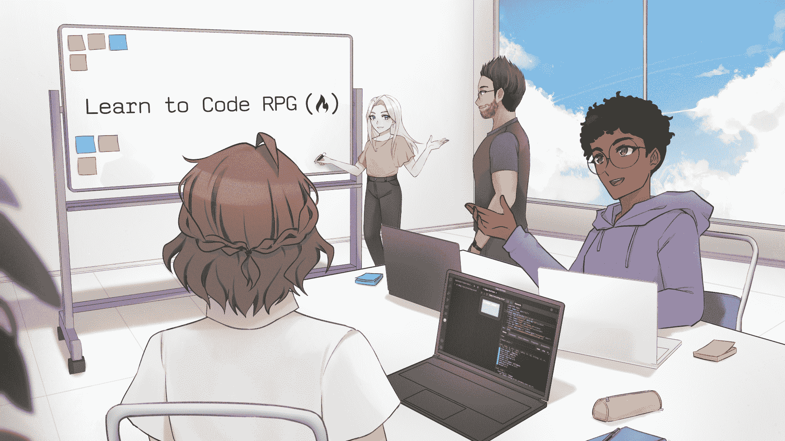](https://freecodecamp.itch.io/learn-to-code-rpg)

[这里是 GitHub repo 的所有代码](https://github.com/freeCodeCamp/LearnToCodeRPG)。

你也可以在 YouTube 上观看游戏预告片，并与你的朋友分享:

[https://www.youtube.com/embed/vLK4fOeiIEk?feature=oembed](https://www.youtube.com/embed/vLK4fOeiIEk?feature=oembed)

想看看游戏是什么样的？查看[让我们和 Ania 和 Lynn 一起玩](https://www.youtube.com/watch?v=b_IDdQzPRR4)。

[https://www.youtube.com/embed/b_IDdQzPRR4?feature=oembed](https://www.youtube.com/embed/b_IDdQzPRR4?feature=oembed)

这是游戏的官方新闻包。

如果你有兴趣自己构建一个视觉小说游戏，可以看看我的这篇文章:

[How to Make a Visual Novel Game in 10 Minutes – Python Ren’Py TutorialDo you have a story idea that you’d like to turn into a novel? How about addingvisual appeal and interactivity to that novel? A Visual Novel [https://en.wikipedia.org/wiki/Visual_novel] might be the gamegenre you are looking for. And this tutorial is here to help set you up in 10minutes, with m…Lynn ZhengfreeCodeCamp.org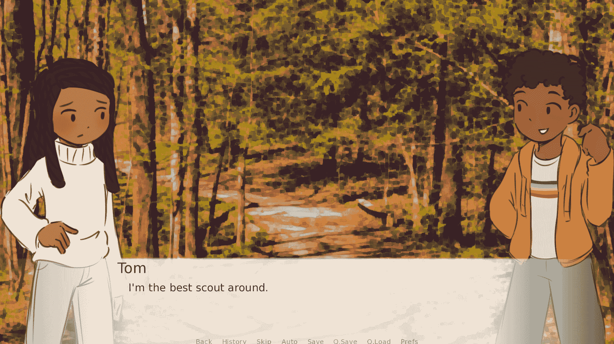](https://www.freecodecamp.org/news/use-python-to-create-a-visual-novel/)