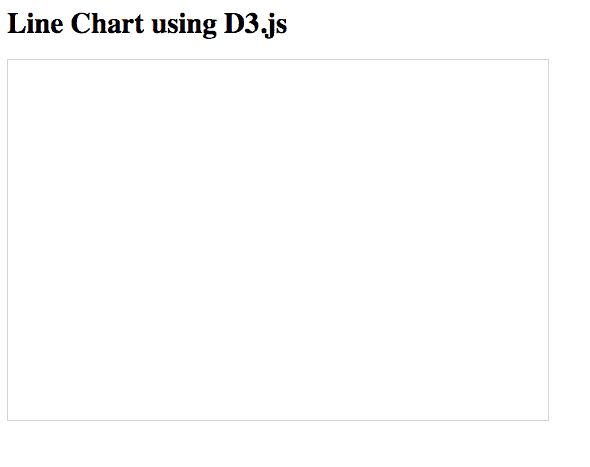
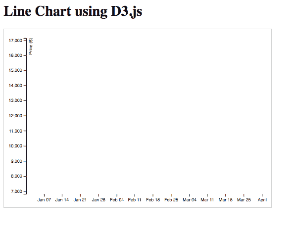
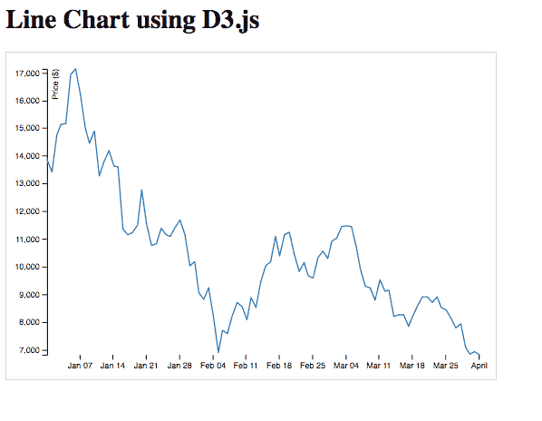

# 学习使用 D3.js 创建折线图

> 原文：<https://www.freecodecamp.org/news/learn-to-create-a-line-chart-using-d3-js-4f43f1ee716b/>

作者 Sohaib Nehal

# 学习使用 D3.js 创建折线图

#### 使用 D3.js 的能力来绘制数据的漂亮表示。


Learn D3.js for free on Scrimba

D3.js 是一个开源的 JavaScript 库，用于创建漂亮的数据表示，我们可以在任何现代浏览器中查看。使用 D3.js，我们可以从数据中创建各种图表和图形。

在本教程中，我们将创建一个折线图，显示过去六个月的比特币价格指数。我们将从外部 API 获取数据，并在 DOM 中呈现带有标签和轴的折线图。

我们还在 Scrimba 上创建了一个免费的 D3.js 课程。[点击这里查看。](https://scrimba.com/g/gd3js)

#### 入门指南

首先，我们将直接从我们 HTML 内部的 CDN 导入 D3.js 库。

```
<html>  <head>    <link rel="stylesheet" href="index.css">  </head>  <body>    <svg></svg>    <script src="https://d3js.org/d3.v4.min.js"></script>  </body></html>
```

我们还在 HTML 中添加了一个`<svg>` < /svg >标签，以使用 D3.js 在其中创建折线图

现在让我们开始编写 JavaScript 代码。首先，一旦加载了 DOM，我们希望从外部 API 加载比特币价格指数的数据。

#### **获取数据**

```
var api = 'https://api.coindesk.com/v1/bpi/historical/close.json?start=2017-12-31&end=2018-04-01';
```

```
document.addEventListener("DOMContentLoaded", function(event) {   fetch(api)     .then(function(response) { return response.json(); })     .then(function(data) {          //DO SOMETHING WITH DATA       })});
```

在上面的代码中，我们使用`fetch`方法从外部 API 获取数据。然后我们使用`.json()`方法解析它。

我们现在想将这些数据转换成键/值对，这样它们就是`date:price`的格式。为此，我们将把数据发送给另一个函数，该函数将解析数据并以我们期望的形式返回。

#### **解析数据**

```
.....then(function(data) {          var parsedData = parseData(data) })
```

```
function parseData(data) {   var arr = [];   for (var i in data.bpi) {      arr.push(         {            date: new Date(i), //date            value: +data.bpi[i] //convert string to number         });   }   return arr;}
```

我们将数据传递给函数`parseData`,该函数返回另一个对象数组。每个对象都包含一个日期和特定日期的比特币价格。

一旦我们获得了所需格式的数据，我们将把这些数据发送给`drawChart`函数，在该函数中，所有剩余的代码都将使用 D3.js 来编写，以呈现折线图。

```
.....then(function(data) {    var parsedData = parseData(data);   drawChart(parsedData);})
```

#### 选择 SVG 元素

在`drawChart`函数中，我们首先选择我们的 SVG 元素，并为它提供一些样式。

```
function drawChart(data) {
```

```
 var svgWidth = 600, svgHeight = 400;   var margin = { top: 20, right: 20, bottom: 30, left: 50 };   var width = svgWidth - margin.left - margin.right;   var height = svgHeight - margin.top - margin.bottom;
```

```
 var svg = d3.select('svg')     .attr("width", svgWidth)     .attr("height", svgHeight);...
```

在上面的代码中，我们设置了 SVG 容器的宽度和高度，首先使用`select()`方法选择它，然后使用`attr()`方法分配属性。

我们还定义了边距，并使用它们的值来计算 SVG 容器的宽度和高度属性。这些边距值将有助于我们稍后正确定位和显示图表。

使用 CSS，我们给我们的 SVG 容器添加了边框:

```
<style>    .line-chart    {        border: 1px solid lightgray;    }</style>
```

到目前为止，我们的领地内还没有任何东西:



接下来，我们将创建一个 group 元素来保存折线图、轴和标签。

#### **创建和转换组元素**

```
...var g = svg.append("g")   .attr("transform",       "translate(" + margin.left + "," + margin.top + ")"   );
```

将元素分组有助于将相似或相关的元素组织在一起。这里，在呈现一个组元素之后，我们为它提供一些转换。

D3 给了我们各种选项来转换我们的元素。在上面的代码中，我们使用了`translate`属性来重新定位 group 元素，使其左边和上边有边距。

#### **添加刻度**

现在，我们想在图表中添加比例。

```
var x = d3.scaleTime().rangeRound([0, width]);
```

```
var y = d3.scaleLinear().rangeRound([height, 0]);
```

正如我们所知，我们的数据由日期和比特币在这些日期的价值组成。因此，我们可以假设 x 轴包含日期，y 轴包含数值。这就是我们如何在折线图中看到时间的变化。

因此，在上面的代码片段中，我们在 x 轴上创建了一个时间类型刻度，在 y 轴上创建了一个线性类型刻度。我们还根据 SVG 容器的宽度和高度提供这些秤的量程。

#### 创建一条线

现在让我们通过使用`d3.line`方法来定义我们的线。我们将通过传入匿名函数并返回特定日期的日期对象和比特币值来定义该行的 x 和 y 属性。

```
var line = d3.line()   .x(function(d) { return x(d.date)})   .y(function(d) { return y(d.value)})   x.domain(d3.extent(data, function(d) { return d.date }));   y.domain(d3.extent(data, function(d) { return d.value }));
```

#### 附加轴

现在，我们将在折线图的 group 元素中添加左轴和底轴。左轴将代表比特币的价值，而底轴显示相应的日期。

```
g.append("g")   .attr("transform", "translate(0," + height + ")")   .call(d3.axisBottom(x))   .select(".domain")   .remove();
```

在上面的代码中，我们在主组中添加了一个组元素，并在容器的最底层翻译它。然后，我们在调用函数中传递`d3.axisBottom`方法，其中`d3.axisBottom`接受在**添加刻度**部分定义的`x`的参数。

```
g.append("g")   .call(d3.axisLeft(y))   .append("text")   .attr("fill", "#000")   .attr("transform", "rotate(-90)")   .attr("y", 6)   .attr("dy", "0.71em")   .attr("text-anchor", "end")   .text("Price ($)");
```

类似于底部的轴，我们添加了另一个组元素，然后调用它的`d3.axisLeft`方法，该方法带有参数`y`。然后，我们还通过给轴分配不同的属性和标签来设置轴的样式。

如果我们保存并刷新页面，我们可以看到我们的轴在 DOM 中呈现:



Left and bottom axes

#### 追加路径

最后一步，我们将在主组元素中添加一个路径。该路径实际上将根据数据的值绘制折线图。

我们使用`datum`方法传递数据集，然后设置填充颜色、笔画颜色和宽度的属性。最后，我们设置了属性`d`,它实际上给了 SVG 路径关于在哪里连接路径的点的指令。

```
g.append("path").datum(data).attr("fill", "none").attr("stroke", "steelblue").attr("stroke-linejoin", "round").attr("stroke-linecap", "round").attr("stroke-width", 1.5).attr("d", line);
```

以下是最终结果:



Line chart

#### 结论

恭喜你！我们已经使用 D3.js 成功创建了折线图。您可以查看官方文档 [D3.js](https://github.com/d3/d3/wiki) 以了解更多关于您可以创建的不同图表和图形的信息。

如果你有兴趣了解更多关于 D3.js 的知识，一定要查看我们在 Scrimba 上的免费课程。

我是索哈卜·内哈尔。我是一名全栈 Web 应用程序开发人员。你可以在 sohaib.nehal@ymail.com 或推特@Sohaib_Nehal 上找到我。谢谢:-)