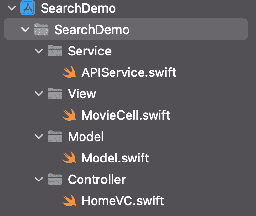
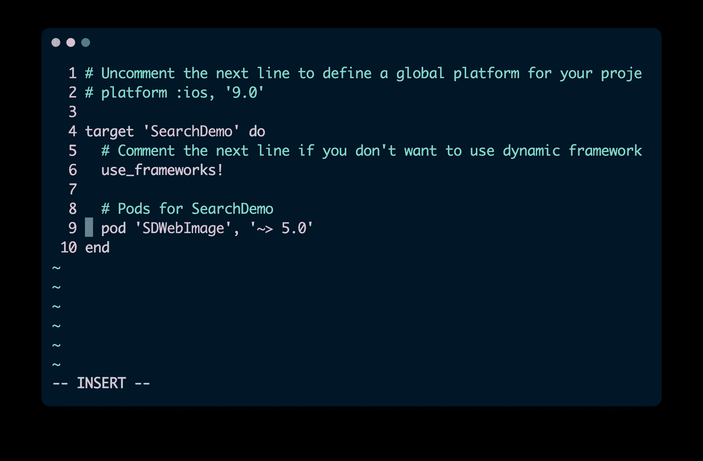
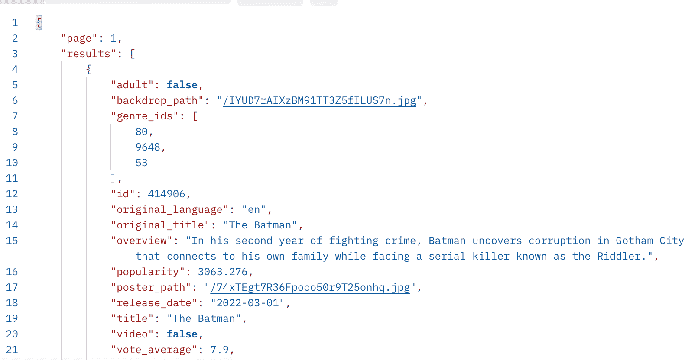
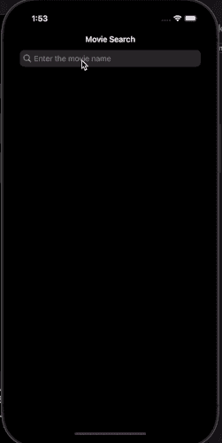

# 如何在 iOS 应用中使用 UISearchController

> 原文：<https://www.freecodecamp.org/news/learn-to-use-uisearchcontroller-in-ios-apps/>

大家好！在本文中，我们将学习如何在 iOS 应用程序中使用 UISearchController。

## 我们要建造什么？

我们将构建一个电影搜索应用程序，它使用 [TMDB](https://www.themoviedb.org/) API 来获取电影信息，并根据用户的搜索查询使用 UICollectionView 来显示它。

## 项目设置

打开 Xcode 并创建一个新的空白 iOS 应用程序项目——确保选择 UIKit 而不是 SwiftUI。

在此应用中，我们将使用 MVC 模式，通过创建以下组和 Swift 文件来组织项目:



现在关闭您的 Xcode 项目。打开终端并移动到您的项目目录。这里我们需要添加 [SD WebImage](https://cocoapods.org/pods/SDWebImage) Cocoa Pods 来异步下载和缓存电影海报图像。

在终端中键入以下命令:

```
pod init
```

现在，当您列出目录的内容时，您可以看到有一个新的 Podfile。使用任何文本编辑器打开文件(这里我使用了 Vim)。编辑您的 Podfile，使其看起来类似于下图。保存并关闭 Podfile。



现在我们已经指定了 SD WebImage，我们可以通过运行以下命令来安装依赖项:

```
pod install
```

如您所见，我们已经成功地在 iOS 项目中添加了 SD WebImage pod。现在运行下面的命令在 Xcode 中打开我们的项目。

```
open PROJECT_NAME.xcworkspace
```

打开 Xcode 后，确保通过按 Command+B 来构建项目。

## **如何使用 UIKit 和编程 UI 设计用户界面**

我们的应用程序需要三个 UIElements 导航栏来保存搜索栏，UISearchBarController 用于实际搜索，以及一个 UICollectionView 来显示搜索结果。

打开 Scenedelegate.swift 文件，并在其中添加以下代码，该代码将连接到会话方法:

```
func scene(_ scene: UIScene, willConnectTo session: UISceneSession, options connectionOptions: UIScene.ConnectionOptions) {
        guard let scene = (scene as? UIWindowScene) else { return }
        window = UIWindow(windowScene: scene)       window?.rootViewController=UINavigationController(rootViewController:HomeVC())
        window?.makeKeyAndVisible()
    }
```

因为我们使用的是编程 UI，首先我们需要提到我们的根视图控制器——也就是用户启动应用程序时显示的第一个屏幕。

在这个应用程序中，我们只使用了一个视图控制器，所以我们将它包装在一个 UINavigationController 中。这提供了一个导航栏，我们可以在其中放置我们的 UISearchController。

打开 HomeVC.swift 文件并添加以下属性:

```
 private var SearchBar: UISearchController = {
        let sb = UISearchController()
        sb.searchBar.placeholder = "Enter the movie name"
        sb.searchBar.searchBarStyle = .minimal
        return sb
    }()

    private var MovieCollectionView: UICollectionView = {
        let layout = UICollectionViewFlowLayout()
        layout.scrollDirection = .vertical
        layout.itemSize = CGSize(width: UIScreen.main.bounds.width/3 - 10, height: 200)
        let cv = UICollectionView(frame: .zero, collectionViewLayout: layout)
        cv.register(MovieCell.self, forCellWithReuseIdentifier: MovieCell.ID)
        return cv
    }()
```

首先，我们创建 UISearchController 并配置其属性，如占位符文本和样式。

然后，我们创建一个 UICollectionView，并指定集合视图应该使用的布局类型。在这种情况下，它是 UICollectionViewFlowLayout 和其他属性，如滚动方向、项目大小，并指定一个自定义的 CollectionView 单元格类，我们将在我们的项目中稍后创建。

在 HomeVC 类中创建一个新函数，并添加以下代码，以编程方式为我们的 UICollectionView 配置自动布局约束:

```
 //MARK: - HELPERS
    func configureUI(){
        MovieCollectionView.translatesAutoresizingMaskIntoConstraints = false
        MovieCollectionView.topAnchor.constraint(equalTo: view.topAnchor).isActive = true
        MovieCollectionView.bottomAnchor.constraint(equalTo: view.bottomAnchor).isActive = true
        MovieCollectionView.leftAnchor.constraint(equalTo: view.leftAnchor).isActive = true
        MovieCollectionView.rightAnchor.constraint(equalTo: view.rightAnchor).isActive = true
    } 
```

首先，我们说我们不需要将自动调整大小的遮罩转换成约束。然后，我们将集合视图固定到视图控制器的所有四边。

在`viewDidLoad()`方法中添加以下代码行:

```
 override func viewDidLoad() {
        super.viewDidLoad()

        navigationItem.title  = "Movie Search"
        view.backgroundColor = .systemBackground
        SearchBar.searchResultsUpdater = self
        navigationItem.searchController = SearchBar
        view.addSubview(MovieCollectionView)
        MovieCollectionView.delegate = self
        MovieCollectionView.dataSource = self
        configureUI()
    }
```

这里我们首先指定 ViewController 的标题，然后是背景色，即系统背景色。如果设备处于灯光模式，它会显示白色背景。如果它处于黑暗模式，那么它显示一个黑暗的背景。

然后，我们将当前视图控制器设置为搜索结果更新器，然后将 SearchController 添加到导航栏，将 UICollectionView 添加到 view controller，并设置委托和数据源。最后，我们使用自动布局来固定 UICollectionView。

为 HomeVC 创建一个扩展，并实现 UISearchResultsUpdating 协议及其存根方法 updateSearchResults。

```
extension HomeVC: UISearchResultsUpdating{

    func updateSearchResults(for searchController: UISearchController) {
        guard let query = searchController.searchBar.text else{return}

        }

    }

}
```

每当搜索栏中输入的文本发生变化，或者当用户点击键盘上的搜索按钮时，就会调用`updateSearchResults()`方法。

接下来，我们需要创建自定义 UICollectionView 单元格。在 MovieCell.swift 文件中，添加以下代码:

```
import Foundation
import UIKit
import SDWebImage

class MovieCell: UICollectionViewCell{

    static let ID = "MovieCell"
    private var MoviePosterImageView: UIImageView = {
        let imageView = UIImageView()
        imageView.contentMode = .scaleAspectFit
      //  imageView.image = UIImage(systemName: "house")
        return imageView
    }()

    override init(frame: CGRect) {
        super.init(frame: frame)
        addSubview(MoviePosterImageView)
        configureUI()
    }

    required init?(coder: NSCoder) {
        fatalError("init(coder:) has not been implemented")
    }

}

extension MovieCell{
    func configureUI(){
        MoviePosterImageView.translatesAutoresizingMaskIntoConstraints = false
        MoviePosterImageView.topAnchor.constraint(equalTo: topAnchor).isActive = true
        MoviePosterImageView.bottomAnchor.constraint(equalTo: bottomAnchor).isActive = true
        MoviePosterImageView.leftAnchor.constraint(equalTo: leftAnchor).isActive = true
        MoviePosterImageView.rightAnchor.constraint(equalTo: rightAnchor).isActive = true
    }
    func updateCell(posterURL: String?){
        if let posterURL = posterURL {
            guard let CompleteURL = URL(string: "https://image.tmdb.org/t/p/w500/\(posterURL)") else {return}
            self.MoviePosterImageView.sd_setImage(with: CompleteURL)
        }

    }
}
```

这里，我们通过对 UICollectionView 类进行子类化并实现`init()`函数来创建我们的自定义集合视图单元格。

我们创建一个 UIImageView 来显示电影海报图像，并为其设置自动布局约束。然后，我们创建一个用户定义的函数，它将电影海报 URL 字符串作为参数，并在不影响 UI 线程/主线程的情况下异步下载它。它通过使用我们之前添加的 SD WebImage CocoaPod 来实现这一点。

## 如何设置我们的 API

在继续之前，你需要通过创建一个账户来获得你的 [TMDB](https://www.themoviedb.org/) API 的 API 密钥(这是免费的)。我们将使用 API 的电影搜索端点，它将 API 键和电影名称作为参数。

```
https://api.themoviedb.org/3/search/movie?api_key=API_KEY_HERE&query=batman 
```

您可以通过在 Postman 中运行 API 来检查它的响应。



## 如何为 API 响应创建模型

现在我们从 API 得到一个 JSON 响应。我们需要将它们解码成 Swift，这可以通过创建一个实现可编码协议的模型结构来实现。

通过使用 JSON 到 Swift 网站，我们可以很容易地为我们的 JSON 响应生成模型结构。以下是 API 响应的模型代码，您可以将它复制并粘贴到 Model.swift 文件中:

```
import Foundation

struct TrendingTitleResponse: Codable {
    let results: [Title]
}

struct Title: Codable {
    let id: Int
    let media_type: String?
    let original_name: String?
    let original_title: String?
    let poster_path: String?
    let overview: String?
    let vote_count: Int
    let release_date: String?
    let vote_average: Double
}

struct YoutubeSearchResponse: Codable {
    let items: [VideoElement]
}

struct VideoElement: Codable {
    let id: IdVideoElement
}

struct IdVideoElement: Codable {
    let kind: String
    let videoId: String
} 
```

## 如何使用 Swift 执行 HTTP 请求

现在我们需要编写一些 Swift 代码来执行 HTTP GET 请求，这些请求返回 API 的 JSON 响应。

Swift 提供了一个 URLSession 类，使得编写网络代码变得更加容易，而不需要任何第三方库，如 AFNetworking、AlamoFire 等等。

打开 APIService.swift 并添加以下代码:

```
import Foundation

class APIService{
    static var shared = APIService()
    let session = URLSession(configuration: .default)

    func getMovies(for Query: String,completion:@escaping([Title]?,Error?)->Void){
        guard let FormatedQuery = Query.addingPercentEncoding(withAllowedCharacters: .urlHostAllowed)  else{return}

        guard let  SEARCH_URL = URL(string: "https://api.themoviedb.org/3/search/movie?api_key=API_KEY_HERE&query=\(FormatedQuery)") else {print("INVALID")
            return}

        let task = session.dataTask(with: SEARCH_URL) { data, response, error in
            if let error = error {
                print(error.localizedDescription)
                completion(nil,error)
            }
            if let data = data {
                do{
                    let decodedData = try JSONDecoder().decode(TrendingTitleResponse.self, from: data)
                 //   print(decodedData)
                    completion(decodedData.results,nil)
                }
                catch{
                    print(error)
                }
            }
        }
        task.resume()
    }
} 
```

在这里，我们用 singleton 模式创建了一个名为 API Service 的类，因此我们需要这个类的一个实例作为该类的静态成员。然后，我们使用默认配置为我们的网络任务创建了一个会话，后面跟着一个用户定义的方法 getMovies()。

然后我们创建了我们的网络任务——在这种情况下，我们需要执行 HTTP GET 请求，这可以使用 URLSession 类的`dataTask()`方法来执行。它将 URL 作为一个参数，并给出一个完成处理程序，该处理程序包含从 API 返回的数据、发生错误时的错误数据以及包含 HTTP 响应信息(如状态代码及其相应消息)的响应。

如果有任何错误，那么我们用错误数据退出这个函数。如果没有，那么我们基于 Swift 模型解码 JSON 数据，并使用解码后的数据退出这个函数。

## 如何在 UICollectionView 上显示搜索结果

在 HomeVC.swift 中，创建一个私有属性，它是一个 Title 对象数组。这些将保存 API 返回的每部电影的信息。

```
private var Movies = [Title]()
```

在 HomeVC.swift 中，为 HomeVC 类创建一个扩展，并实现 UIColletionViewDelegate 和 UICollectionViewDatasource 协议。然后实现 numberOfItemsInSection(它等于 API 返回的电影数量)和 cellForItemAt(它实际上用 API 响应填充单元格，比如下载和设置海报图像)。

```
 func collectionView(_ collectionView: UICollectionView, numberOfItemsInSection section: Int) -> Int {
        return Movies.count
    }
    func collectionView(_ collectionView: UICollectionView, cellForItemAt indexPath: IndexPath) -> UICollectionViewCell {
        if let cell = collectionView.dequeueReusableCell(withReuseIdentifier: MovieCell.ID, for: indexPath) as? MovieCell{
           // cell.backgroundColor = .systemBackground

            cell.updateCell(posterURL: Movies[indexPath.row].poster_path)
            return cell
        }
        return UICollectionViewCell()

    }
```

最后，我们需要在之前实现的`updateSearchResults()`委托方法中进行实际的 API 调用。在该方法中添加以下代码:

```
 func updateSearchResults(for searchController: UISearchController) {
        guard let query = searchController.searchBar.text else{return}
        APIService.shared.getMovies(for:query.trimmingCharacters(in: .whitespaces)) { titles, error in
            if let titles = titles {
                self.Movies = titles
                DispatchQueue.main.async {
                    self.MovieCollectionView.reloadData()
                }

            }
        }

    }
```

这里，每当用户在搜索栏中键入内容或按下搜索按钮时，我们都会发出一个 HTTP GET 请求来获取一部电影(基于搜索栏中输入的名称)。然后我们重新加载 CollectionView，它用电影海报更新集合视图单元格。

注意，我们需要在主线程/UI 线程中这样做，因为默认情况下 iOS 会自动在后台线程中进行 HTTP 请求。这意味着我们需要使用 UI/主线程来更新我们的 UI 元素。

现在，在模拟器中运行您的应用程序，查看结果:



恭喜你！你已经学会了在 iOS 应用中使用 UISearchController。