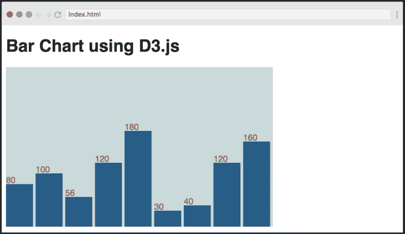
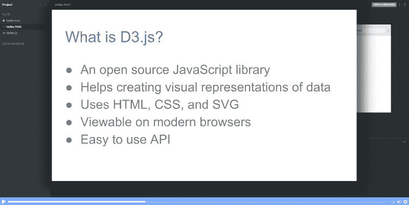
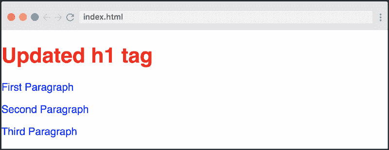
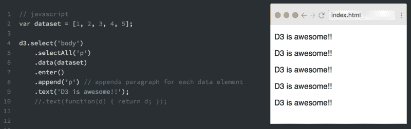
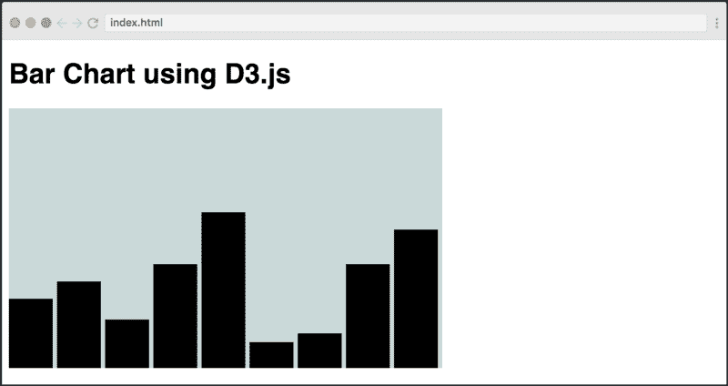
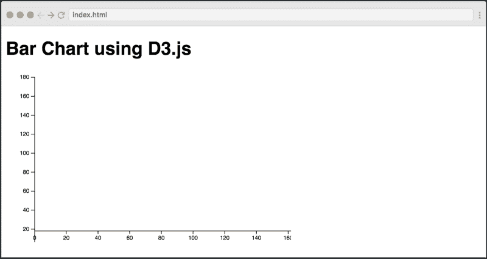
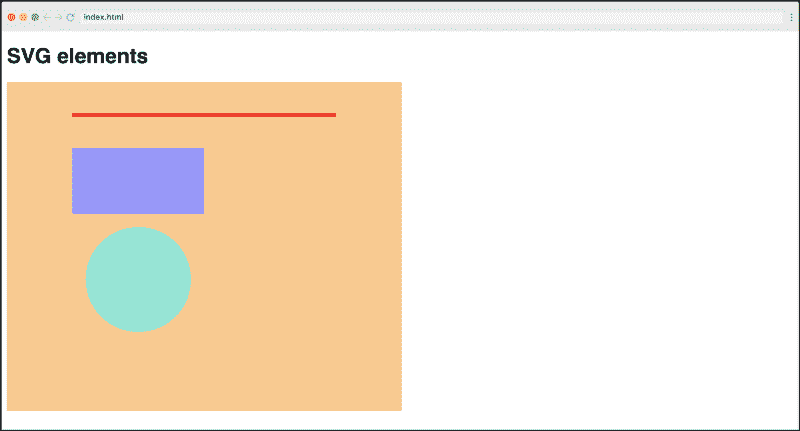
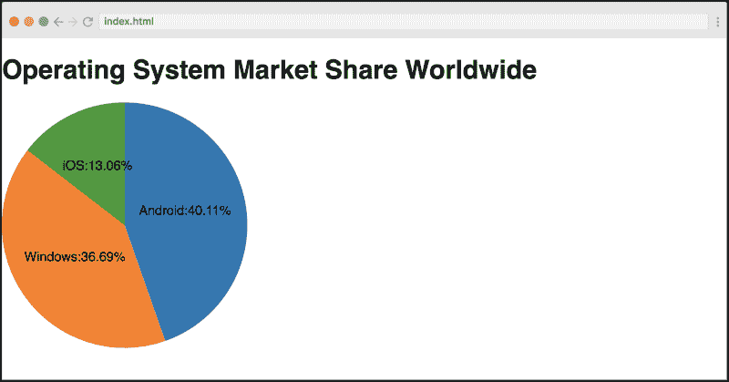
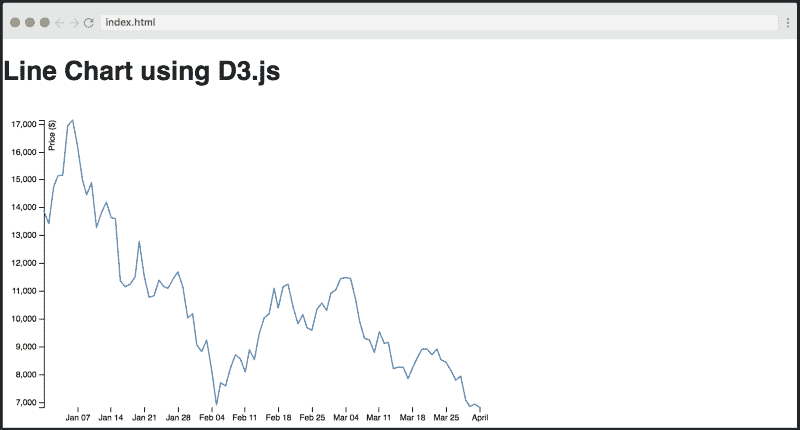

# 在这个免费的 10 部分数据可视化课程学习 D3

> 原文：<https://www.freecodecamp.org/news/learn-to-visualize-data-with-this-free-d3-js-course-2433b060f9dc/>



[Click here to get to the course.](https://scrimba.com/g/gd3js?utm_source=freecodecamp.org&utm_medium=referral&utm_campaign=gd3js_launch_article)

D3.js 是一个 JavaScript 库，它允许您使用 HTML、SVG 和 CSS 将数据变得生动。当从数据中提取价值时，学习它会给你超能力，因为你基本上能够创建任何你能想到的可视化。

然而，它不是最容易学习的库，所以入门可能有点棘手。这就是为什么我们与网络开发人员和讲师 Sohaib Nehal 合作，并在 T2 开设了一门免费的全日制课程。在整个课程中，Sohaib 将向您详细介绍这个强大的库。

来看看是怎么布局的吧！

### 内容

本课程由 10 个屏幕录像组成，总时长不到一小时。它从最基本的概念开始，比如选择、操作、数据加载等等。这为您在本课程的剩余部分中学习创建各种可视化效果奠定了基础。

#### #1:课程介绍



与 Scrimba 课程一样，它以快速浏览课程内容开始，同时介绍 D3.js 和讲师。

#### #2:选择和操作



你需要学习的第一件事是如何用 D3.js 选择和操作 DOM 元素。这个库在操作 DOM 方面实际上非常强大，所以理论上你可以用它来代替 jQuery。

#### #3:数据加载和绑定



当您要创建可视化时，学习如何加载数据以及如何将数据绑定到 DOM 是很重要的。所以在这节课上，你们会学到。

#### #4:创建简单的条形图



在第三次讲座中，你将学习如何建立你的第一个可视化:一个简单的条形图。我们这么早就向您介绍构建东西的原因是，创建可视化比简单地谈论理论有趣得多。所以我们认为你会喜欢这一课。

#### #5:创建标签


下一步是向条形图添加标签，因为在现实生活中您可能经常需要这样做。这是一个简短的讲座。在这里，我建议您尝试一下标签的位置，因为这是一种简单而有趣的代码交互方式。

#### #6:秤

规模是 D3 的一个关键概念。它们允许您将数据映射到其他相关范围，例如，您的可用空间量。所以在这节课中，你将学习`scaleLinear()`方法:

```
var yScale = d3.scaleLinear()  
    .domain(\[0, d3.max(dataset)\])  
    .range(\[0, svgHeight\]); 
```

#### #7:轴



轴是任何图表不可或缺的一部分，D3 提供了一些简单的方法来创建它们。本课建立在上一课的基础上，因为它在创建轴时利用了比例。它还能帮助你理解你将在课程的最终截屏中学到的超级棒的折线图。

#### #8:创建 SVG 元素



尽管您在本课程之前已经创建了 SVG 元素，但这是一个非常重要的概念，值得单独讲授。在书中，你将了解到`<rect>`、`<circle>`和`<line>`元素。

#### #9:创建饼图



饼图在很多情况下都很方便，所以在这节课中，你将学习如何创建一个饼图。D3 为此提供了一个简单的 API，所以这一点对你来说应该不难。

#### #10:创建折线图



最后，您将学习如何创建折线图来可视化比特币价格。为了获取数据，您将使用一个外部 API。这个项目还将把你在整个课程中学到的许多概念联系在一起，所以这是一个很好的可视化结尾。

就是这样！在经历了这十课之后，你应该为在你的工作或个人项目中开始使用 D3.js 做好了准备。

如果你到了这一步，如果你能在[推特](https://twitter.com/Sohaib_Nehal)上给 [Sohaib](https://medium.com/u/4f68c487d7cf) 一个呐喊，我们将不胜感激！

### 辛巴格式

在您离开之前，让我们也快速浏览一下课程背后的技术。它是使用交互式编码截屏工具 [Scrimba](http://scrimba.com) 构建的。“稀松布”看起来像普通的视频，但是，它是完全互动的。这意味着您可以编辑截屏中的代码。

这里有一张解释这个概念的 gif 图:


暂停截屏→编辑代码→运行！→查看您的变化

当您觉得需要试验代码以便正确理解它时，或者当您只想复制一段代码时，这是非常有用的。

你还在等什么？前往 Scrimba，立即参加免费课程！

* * *

感谢阅读！我的名字叫 Per Borgen，我是最简单的学习编码方法——Scrimba 的联合创始人。如果你想学习建立专业水平的现代网站，你应该看看我们的[响应式网页设计训练营](https://scrimba.com/g/gresponsive?utm_source=freecodecamp.org&utm_medium=referral&utm_campaign=gd3js_launch_article)。


[Click here to get to the advanced bootcamp.](https://scrimba.com/g/gresponsive?utm_source=freecodecamp.org&utm_medium=referral&utm_campaign=gd3js_launch_article)