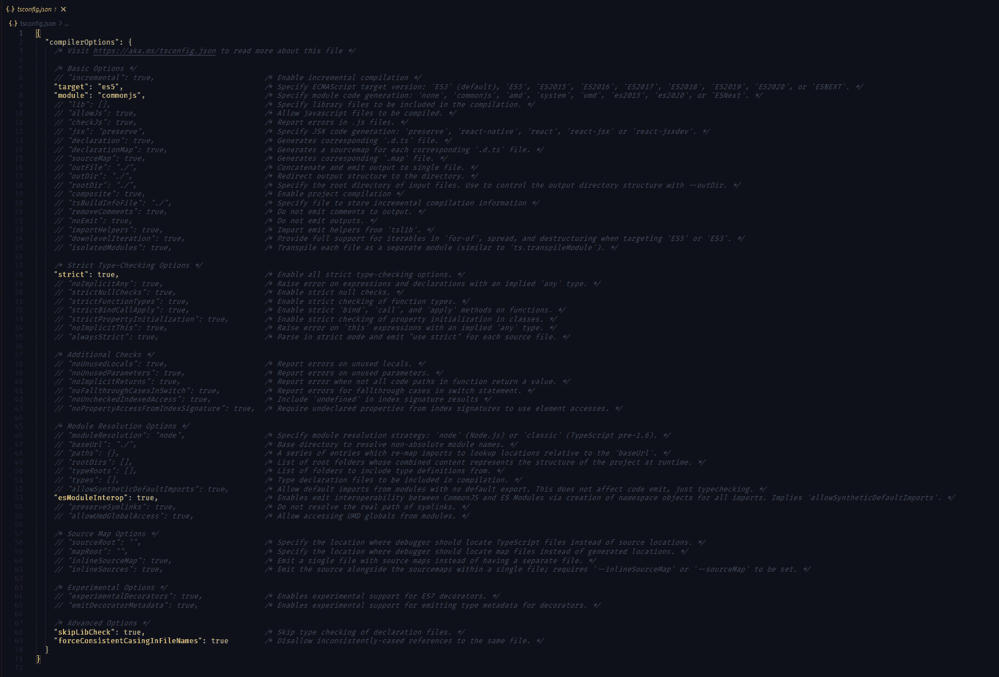

# 在这个初学者指南中学习 TypeScript 基础

> 原文：<https://www.freecodecamp.org/news/learn-typescript-basics/>

TypeScript 已经席卷了开发界。难怪它在 npm 上有超过 1500 万的周下载量。但是什么是 TypeScript，你需要了解它的什么？

在这篇文章中，我将回答这些问题。结束时，您将掌握以下内容:

*   什么是打字稿
*   打字稿的主要支柱
*   TypeScript 的主要功能
*   为什么应该使用 TypeScript
*   帮助您入门的 TypeScript 基础知识

首先，让我们解决房间里的大象。

## 什么是 TypeScript？

TypeScript 是一种由微软构建和维护的编程语言。
它是 JavaScript 的超集，增加了强类型检查，被编译成普通的 JavaScript 代码。

成为超集意味着 TypeScript 拥有 JavaScript 的所有特性以及一些附加特性。

TypeScript 具有更好的开发时工具、静态代码分析、编译时类型检查和代码级文档等功能。

如果你不知道这意味着什么，不要担心。我将在本文中解释这一切。

TypeScript 附带的所有这些特性使它成为构建大规模 JavaScript 应用程序的完美编程语言。

## 打字稿的主要支柱

Typescript 建立在三个主要支柱之上，即语言、编译器和语言服务。

### 打字稿语言

这包括 TypeScript 的语法、关键字和类型注释。TypeScript 语法类似于 JavaScript 语法，但并不相同。

### 类型脚本编译器

编译器负责将类型脚本代码编译成 JavaScript。实际上，发生的不是编译，而是传输。

> 编译意味着将源代码从人类可读的格式转换成机器可读的格式，而编译是将源代码从一种人类可读的格式转换成另一种人类可读的格式。

TypeScript 编译器还负责在编译时清除任何与类型相关的信息。

类型在 JavaScript 中不是有效的特性。由于 TypeScript 必须被编译成普通的 JavaScript，所以任何与类型相关的内容都必须被删除，然后才能成为可供浏览器执行的有效 JavaScript。

Typescript 编译器还执行代码分析。如果有理由的话，它会发出错误和警告。

### 语言服务

语言服务负责从源代码中收集类型信息。

然后，开发工具可以使用这些信息来提供智能感知、类型提示和重构选项。

## TypeScript 的主要功能

### 在 TypeScript 中键入批注

类型注释仅仅意味着给变量或函数分配一个类型。

```
const birthdayGreeter = (name: string, age: number): string => {
  return `Happy birthday ${name}, you are now ${age} years old!`;
};

const birthdayHero = "Jane User";
const age = 22;
console.log(birthdayGreeter(birthdayHero, 22)); 
```

在上面的例子中，我们定义了一个接受两个参数`name`和`age`的函数。我们将`name`分配给类型*字符串* `age`给类型*数字*

我们也可以为函数的返回值分配类型。在这种情况下，我们的函数返回一个类型为*字符串*的值

```
const birthdayGreeter = (name: string, age: number): string => { };
Typescript would yield an error if we passed in arguments of different types than ones we expect 
```

### TypeScript 中的结构类型

TypeScript 是一种结构化的类型化语言，这意味着如果两个元素具有对应且相同的特征，则它们被认为是同一类型。

### 类型脚本中的类型推理

如果没有分配特定的类型，TypeScript 编译器可以尝试推断类型信息。这意味着 TypeScript 可以根据变量或函数的初始值或用法将类型分配给变量或函数。

类型推断通常发生在初始化变量、设置默认值和确定函数返回类型时

```
const platform = 'freeCodeCamp';
const add = (a: number, b: number) => a + b 
```

上例中的变量 platform 被赋予了类型*字符串*，尽管我们没有明确这样做，函数`add`的返回值被推断为类型*号*。

### 打字稿中的类型擦除

TypeScript 在编译期间移除类型系统构造:

投入

```
let x: someType; 
```

输出

```
let x; 
```

## 为什么使用 TypeScript？

### 类型检查和静态代码分析

这减少了代码中的总体错误，因为当您错误地使用某个类型时，TS 会警告您。

它还减少了运行时错误，并且由于静态代码分析，TypeScript 会抛出关于打字错误之类的警告。所以这意味着更少的错误，这可能意味着更少的测试。

### 类型注释可以像代码文档一样工作

例如，类型注释帮助我们理解函数期望什么类型的参数，以及它返回什么。

这使得代码可读性更好，也让其他人和我们更容易理解代码应该做什么。

TypeScript 的另一个优点是，当 ide 确切知道您正在处理什么类型的数据时，它们可以提供更具体、更智能的智能感知。

## 如何开始使用 TypeScript

让我们从安装 TypeScript 包开始。这里我们有两个选择:我们可以全局安装它，这样我们就可以在系统中的任何项目上使用它，或者我们可以安装它，以便在我们正在处理的特定项目上使用它。

您可以通过运行以下命令来全局安装 TypeScript:

```
npm install -g typescript 
```

如果您不希望全局安装，您可以运行以下命令:

```
npm install --save-dev typescript 
```

在本地安装中，TypeScript 作为 dev 依赖项安装，因为我们使用它进行开发。它必须先编译成 JavaScript，然后才能用于生产。浏览器无法执行 TypeScript。

安装 TypeScript 后，我们需要启动一个新项目。您可以通过运行以下命令来实现这一点:

```
tsc --init 
```

这个命令在项目的根目录下启动一个新的 *tsconfig.json* 文件。这个配置文件带有我们在项目中使用 TypeScript 的所有配置选项。



特定项目的所有编译选项都可以在 tsconfig.json 文件中的 *compileOptions* 键下指定。

默认情况下，该文件带有一些配置选项，但是您可以根据需要向项目添加更多选项。您可以注释掉或删除未使用的编译器选项。

### TypeScript 中的内置类型

Typescript 内置了 JavaScript 中的所有基本类型，如字符串、数字和布尔值。

然后可以将这些类型分配给变量，以指定应该将什么数据类型分配给变量。这被称为类型注释。

```
const myName: string = 'Joel';
const myAge: number = 99; 
```

TypeScript 批注并不总是必需的，因为 TypeScript 会根据变量的初始值或用法自动推断变量的类型。因此，以下代码也是有效的类型脚本代码:

```
// myName is inferred type 'string'
 const myName = 'Jonathan'; 
```

### TypeScript 中的数组

要指定数组的类型，可以使用语法`string[]`或`number[]`。这实际上意味着“字符串数组或数字数组”。

你还会看到人们使用语法`Array<number>`或`Array<string>`来表达同样的意思。

### TypeScript 中的联合类型

联合类型允许我们定义几个可以赋给变量的类型。为此，我们使用管道|来指定各种类型。

```
const someValue: number | string = value; 
```

默认情况下，`null | undefined`可以赋给任何变量，但是 TypeScript 附带了 *strictNullChecks* 编译器选项，不允许将两者赋给一个变量。

### 类型脚本中的函数

函数也可以接收类型注释。但是，对于 TypeScript 函数，它们只能接收指定的参数。不多不少。

```
function introduction(name: string, age: number): string {
    return `Hello, my name is ${name} and I'm {age} years old`
} 
```

函数参数接受普通类型注释。

TypeScript 函数还必须指定返回数据类型。在函数不返回任何东西的情况下，我们可以使用 *void* 类型作为返回数据类型。

我们也可以使用`?`操作符来指定可选的**参数。在这种情况下，如果参数没有在函数调用中传递，Typescript 不会报错。**

我们还可以像在普通 JavaScript 中一样为参数分配默认值。

```
const introduction = (name: string, age: number, job?: string = 'developer'): string => `Hello, my name is ${name} and I'm ${age} years old. I work as a ${job}` 
```

请注意，在这个示例中，我使用了 JavaScript [arrow function](https://developer.mozilla.org/en-US/docs/Web/JavaScript/Reference/Functions/Arrow_functions) 语法，指定 job 参数是可选的，并为其分配了默认值“developer”。

### TypeScript 中的`any`类型

在 TypeScript 中，每个无法推断类型的变量都隐式地成为类型 *any* 。

`Any`是典型的通配符类型，字面意思是“任何类型”。我们也可以显式地将类型 *any* 赋给一个变量。

然而，类型化通常被认为是有问题的。

Typescript 附带了 *noImplicitAny* 编译器选项，当我们将类型 *any* 赋给变量或表达式时，该选项会引发错误。

### 如何在 TypeScript 中创建自己的类型

TypeScript 为我们提供了一种定义和使用自己的输入类型的方法。在这里，我们可以描述特定输入可以接受的确切类型。

我们可以使用`type`关键字来定义我们自己的类型。

```
type Operator = 'multiply' | 'add' | 'divide'; 
```

现在`Operator`类型可以接受这两个值中的任何一个。注意我们如何使用 OR 操作符`|`来创建一个联合类型。在这种情况下，任何被赋予类型运算符的变量都可以接受这三个值中的任何一个。

## TypeScript 示例项目

现在让我们用这些知识来创建一个简单的计算器程序。用户只能输入三种运算中的一种——加、乘或除。如果你愿意，花一点时间尝试这样做，然后你再回来继续。

希望你自己尝试过。程序可能看起来像这样:

```
type Operation = 'multiply' | 'add' | 'divide';

const calculator = (a: number, b:number, op: Operation): number => {
    switch(op) {
        case 'multiply':
            return a * b;
        case 'add':
            return a + b;
        case 'divide': 
            if (b === 0) return 'Can't divide by 0;
            return a / b;
        default:
        return 'Operation unknow';          
    }
} 
```

试着读一下上面的代码，看看你是否能弄清楚是怎么回事。

我们还可以使用`interface`关键字创建定制类型。接口允许我们定义对象的属性和类型。一个接口能够扩展另一个接口。

```
interface Employee {
    name: string,
    title: string
}

interface Manager extends Employee {
    meeting: (topic: string) => void
} 
```

这里我们定义了一个接口 Employee，它有两个属性- `name`和`title`，这两个属性的类型都是*字符串*。

然后，我们使用这个接口创建另一个接口`Manager`,它与 Employee 接口具有相同的属性，但是使用了 meeting 方法。

在一开始，我提到过 Typescript 是一种结构化类型语言。这意味着如果一个元素与另一个元素具有相同的属性，那么它们都是相同的类型。

接口也是如此。如果一个对象具有接口的属性，那么它就具有接口的类型。这样的对象可以有附加属性，只要某些属性与接口的属性相匹配。

我们现在可以使用我们定义的接口，例如:

```
const newEmployee: Employee = {
    name: 'Joel',
    title: 'FrontEnd Developer'
} 
```

到目前为止，我们已经看到，我们可以使用关键字 *type* 和 *interface* 来创建自己的类型。但是，这两者有什么区别呢？

最显著的区别是用相同的名称定义多个接口会导致合并的接口。另一方面，用相同的名称定义多个类型将导致一个错误，指示该名称已经声明。

## 包扎

Typescript 有很多特性，不能简单地在本文中一一列举。我只是强调了一些可能有助于理解的特性，以便开始使用它。

你可以通过阅读[文档](https://www.typescriptlang.org/docs/)来了解更多关于 Typescript 的知识。

如果你喜欢这篇文章，可以考虑在 Twitter 上关注我，或者在 T2 的 LinkedIn 上联系我。我分享关于编程和学习的内容。随时联系。