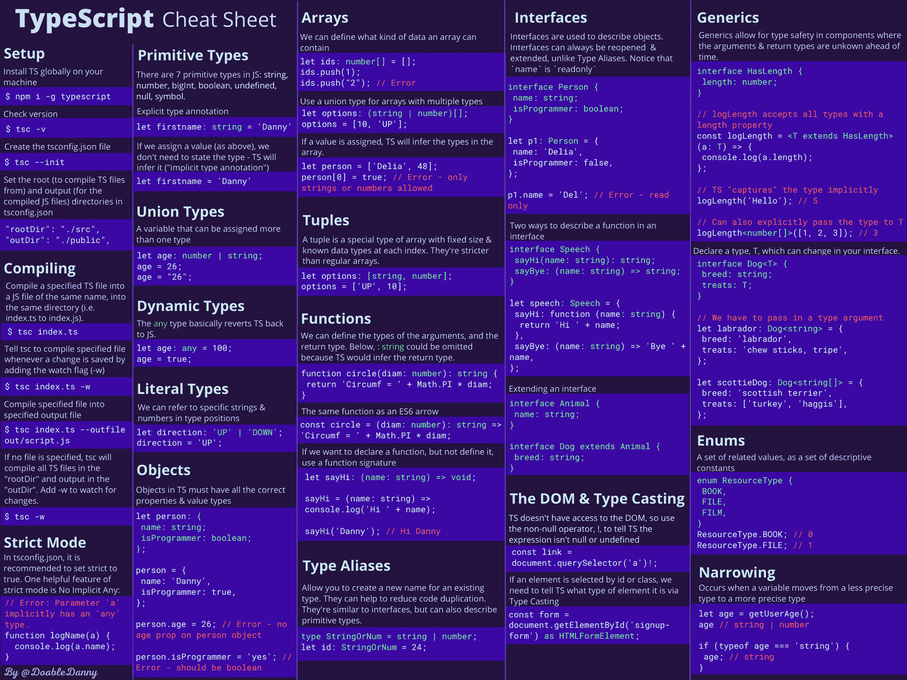
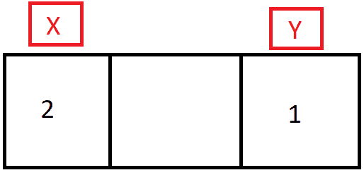
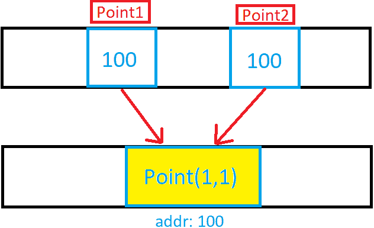

# 学习 TypeScript——初学者终极指南

> 原文：<https://www.freecodecamp.org/news/learn-typescript-beginners-guide/>

在过去的几年里，TypeScript 变得越来越流行，现在许多工作都要求开发人员了解 TypeScript。

但是不要惊慌——如果你已经知道 JavaScript，你将能够很快学会 TypeScript。

即使您不打算使用 TypeScript，学习它也会让您更好地理解 JavaScript——并使您成为更好的开发人员。

在本文中，您将了解到:

*   什么是 TypeScript，为什么要学？
*   如何用 TypeScript 设置项目
*   所有主要的类型脚本概念(类型、接口、泛型、类型转换等等...)
*   如何将 TypeScript 与 React 一起使用

我还做了一个[打字稿备忘单 PDF](https://doabledanny.gumroad.com/l/typescript-cheat-sheet-pdf) 和[海报](https://doabledanny.gumroad.com/l/typescript-cheat-sheet-poster)，把这篇文章总结成一页。这使得快速查找和修改概念/语法变得容易。



TypeScript cheat sheet PDF

## 什么是 TypeScript？

TypeScript 是 JavaScript 的超集，这意味着它做 JavaScript 做的所有事情，但是增加了一些特性。

使用 TypeScript 的主要原因是为了给 JavaScript 添加静态类型。静态类型意味着变量的类型不能在程序中的任何地方改变。可以防止很多 bug！

另一方面，JavaScript 是一种动态类型语言，这意味着变量可以改变类型。这里有一个例子:

```
// JavaScript
let foo = "hello";
foo = 55; // foo has changed type from a string to a number - no problem

// TypeScript
let foo = "hello";
foo = 55; // ERROR - foo cannot change from string to number 
```

浏览器无法理解 TypeScript，因此必须通过 TypeScript 编译器(TSC)将它编译成 JavaScript 我们将很快讨论这一点。

## TypeScript 值得吗？

### 为什么应该使用 TypeScript

*   研究表明，TypeScript 可以发现 15%的常见错误。
*   可读性——更容易看出代码应该做什么。当在团队中工作时，更容易看到其他开发人员的意图。
*   这很受欢迎——了解 TypeScript 将使你能够申请更多的好工作。
*   学习 TypeScript 将让您对 JavaScript 有更好的理解，并有一个新的视角。

这里有一篇我写的短文，演示了 TypeScript 如何防止恼人的 bug。

### 打字稿的缺点

*   与 JavaScript 相比，TypeScript 需要花费更长的时间来编写，因为您必须指定类型，所以对于较小的单独项目，可能不值得使用它。
*   必须编译 TypeScript 这需要时间，尤其是在较大的项目中。

但是你不得不花在编写更精确的代码和编译上的额外时间将会比你代码中更少的错误所节省的时间要多。

对于许多项目——尤其是大中型项目——TypeScript 将为您节省大量时间和麻烦。

而且如果你已经懂 JavaScript，TypeScript 也不会太难学。这是你武器库中的一个很好的工具。

## 如何设置 TypeScript 项目

### 安装节点和 TypeScript 编译器

首先，确保在您的机器上全局安装了[节点](https://nodejs.org/en/download/)。

然后，通过运行以下命令，在您的计算机上全局安装 TypeScript 编译器:

```
npm i -g typescript 
```

检查安装是否成功(如果成功，将返回版本号):

```
tsc -v 
```

### 如何编译 TypeScript

打开文本编辑器并创建一个 TypeScript 文件(例如 index.ts)。

写一些 JavaScript 或 TypeScript:

```
let sport = 'football';

let id = 5; 
```

我们现在可以用下面的命令将它编译成 JavaScript:

```
tsc index 
```

TSC 会把代码编译成 JavaScript，输出到一个名为 index.js 的文件中:

```
var sport = 'football';
var id = 5; 
```

如果要指定输出文件的名称:

`tsc index.ts --outfile file-name.js`

如果您希望 TSC 自动编译您的代码，那么每当您做出更改时，请添加“watch”标志:

`tsc index.ts -w`

关于 TypeScript 的一个有趣的事情是，当你编码时，它在你的文本编辑器中报告错误，但是它总是编译你的代码——不管有没有错误。

例如，以下内容会导致 TypeScript 立即报告错误:

```
var sport = 'football';
var id = 5;

id = '5'; // Error: Type 'string' is not assignable to 
type 'number'.
```

但是如果我们尝试用`tsc index`编译这段代码，尽管有错误，代码仍然会编译。

这是 TypeScript 的一个重要属性:它假设开发人员知道更多。即使有一个类型脚本错误，它也不会妨碍你编译代码。它告诉你有一个错误，但是你是否做任何事情都取决于你。

### 如何设置 ts 配置文件

ts 配置文件应该位于项目的根目录下。在这个文件中，我们可以指定根文件、编译器选项，以及我们希望 TypeScript 在检查我们的项目时有多严格。

首先，创建 ts 配置文件:

`tsc --init`

您现在应该在项目根目录下有一个`tsconfig.json`文件。

这里有一些值得注意的选项(如果使用带有 TypeScript 的前端框架，大多数情况下，这些东西已经为您处理好了):

```
{
    "compilerOptions": {
        ...
        /* Modules */
        "target": "es2016", // Change to "ES2015" to compile to ES6
        "rootDir": "./src", // Where to compile from
        "outDir": "./public", // Where to compile to (usually the folder to be deployed to the web server)

        /* JavaScript Support */
        "allowJs": true, // Allow JavaScript files to be compiled
        "checkJs": true, // Type check JavaScript files and report errors

        /* Emit */
        "sourceMap": true, // Create source map files for emitted JavaScript files (good for debugging)
         "removeComments": true, // Don't emit comments
    },
    "include": ["src"] // Ensure only files in src are compiled
} 
```

要编译所有内容并观察变化:

`tsc -w`

注意:当在命令行上指定输入文件时(例如，`tsc index`)，会忽略`tsconfig.json`文件。

## TypeScript 中的类型

### 原始类型

在 JavaScript 中，原始值是指不是对象且没有方法的数据。有 7 种原始数据类型:

*   线
*   数字
*   比吉斯本
*   布尔型
*   不明确的
*   空
*   标志

原语是不可变的:它们不能被改变。重要的是不要把原语本身与被赋予原语值的变量混淆。可以给变量重新分配一个新值，但是现有值不能像对象、数组和函数那样改变。

这里有一个例子:

```
let name = 'Danny';
name.toLowerCase();
console.log(name); // Danny - the string method didn't mutate the string

let arr = [1, 3, 5, 7];
arr.pop();
console.log(arr); // [1, 3, 5] - the array method mutated the array

name = 'Anna' // Assignment gives the primitive a new (not a mutated) value 
```

在 JavaScript 中，所有原始值(除了 null 和 undefined)都有包装原始值的对象等价物。这些包装对象是字符串、数字、BigInt、布尔和符号。这些包装对象提供了允许操作原始值的方法。

回到 TypeScript，我们可以设置我们希望变量在声明变量后添加的类型`: type`(称为“类型注释”或“类型签名”)。示例:

```
let id: number = 5;
let firstname: string = 'danny';
let hasDog: boolean = true;

let unit: number; // Declare variable without assigning a value
unit = 5; 
```

但是通常最好不要显式声明类型，因为 TypeScript 会自动推断变量的类型(类型推断):

```
let id = 5; // TS knows it's a number
let firstname = 'danny'; // TS knows it's a string
let hasDog = true; // TS knows it's a boolean

hasDog = 'yes'; // ERROR 
```

我们还可以设置一个能够成为联合类型的变量。**联合类型是一个变量，它可以被赋予多种类型**:

```
let age: string | number;
age = 26;
age = '26'; 
```

### 参考类型

在 JavaScript 中，几乎“一切”都是对象。事实上(令人困惑的是)，如果用关键字`new`定义，字符串、数字和布尔值都可以是对象:

```
let firstname = new String('Danny');
console.log(firstname); // String {'Danny'} 
```

但是当我们在 JavaScript 中谈论引用类型时，我们指的是数组、对象和函数。

#### 警告:基本类型与引用类型

对于那些从未研究过基元类型和引用类型的人，让我们来讨论一下基本的区别。

如果一个基元类型被赋给一个变量，我们可以把那个变量想象成 **包含** 的基元值。每个原始值都存储在内存中唯一的位置。

如果我们有两个变量，x 和 y，并且它们都包含原始数据，那么它们彼此完全独立:



X and Y both contain unique independent primitive data

```
let x = 2;
let y = 1;

x = y;
y = 100;
console.log(x); // 1 (even though y changed to 100, x is still 1) 
```

引用类型就不是这样了。引用类型是指存储对象的内存位置。



point1 and point2 contain a reference to the address where the object is stored

```
let point1 = { x: 1, y: 1 };
let point2 = point1;

point1.y = 100;
console.log(point2.y); // 100 (point1 and point2 refer to the same memory address where the point object is stored) 
```

这是对主类型和引用类型的快速概述。如果你需要更详细的解释，可以看看这篇文章:[原语与引用类型](https://codeburst.io/explaining-value-vs-reference-in-javascript-647a975e12a0)。

#### TypeScript 中的数组

在 TypeScript 中，您可以定义数组可以包含的数据类型:

```
let ids: number[] = [1, 2, 3, 4, 5]; // can only contain numbers
let names: string[] = ['Danny', 'Anna', 'Bazza']; // can only contain strings
let options: boolean[] = [true, false, false]; can only contain true or false
let books: object[] = [
  { name: 'Fooled by randomness', author: 'Nassim Taleb' },
  { name: 'Sapiens', author: 'Yuval Noah Harari' },
]; // can only contain objects
let arr: any[] = ['hello', 1, true]; // any basically reverts TypeScript back into JavaScript

ids.push(6);
ids.push('7'); // ERROR: Argument of type 'string' is not assignable to parameter of type 'number'.
```

您可以使用联合类型来定义包含多种类型的数组:

```
let person: (string | number | boolean)[] = ['Danny', 1, true];
person[0] = 100;
person[1] = {name: 'Danny'} // Error - person array can't contain objects
```

如果用一个值初始化一个变量，没有必要显式地声明类型，因为 TypeScript 会推断出它:

```
let person = ['Danny', 1, true]; // This is identical to above example
person[0] = 100;
person[1] = { name: 'Danny' }; // Error - person array can't contain objects
```

有一种特殊类型的数组可以在 TypeScript 中定义:元组。元组是具有固定大小和已知数据类型的数组。它们比常规数组更严格。

```
let person: [string, number, boolean] = ['Danny', 1, true];
person[0] = 100; // Error - Value at index 0 can only be a string 
```

#### 类型脚本中的对象

TypeScript 中的对象必须具有所有正确的属性和值类型:

```
// Declare a variable called person with a specific object type annotation
let person: {
  name: string;
  location: string;
  isProgrammer: boolean;
};

// Assign person to an object with all the necessary properties and value types
person = {
  name: 'Danny',
  location: 'UK',
  isProgrammer: true,
};

person.isProgrammer = 'Yes'; // ERROR: should be a boolean

person = {
  name: 'John',
  location: 'US',
}; 
// ERROR: missing the isProgrammer property
```

当定义一个对象的签名时，你通常会使用一个**接口**。如果我们需要检查多个对象是否具有相同的特定属性和值类型 **:** ，这将非常有用

```
interface Person {
  name: string;
  location: string;
  isProgrammer: boolean;
}

let person1: Person = {
  name: 'Danny',
  location: 'UK',
  isProgrammer: true,
};

let person2: Person = {
  name: 'Sarah',
  location: 'Germany',
  isProgrammer: false,
}; 
```

我们也可以用函数签名来声明函数属性。我们可以使用传统的普通 JavaScript 函数(`sayHi`)或 ES6 箭头函数(`sayBye`)来实现:

```
interface Speech {
  sayHi(name: string): string;
  sayBye: (name: string) => string;
}

let sayStuff: Speech = {
  sayHi: function (name: string) {
    return `Hi ${name}`;
  },
  sayBye: (name: string) => `Bye ${name}`,
};

console.log(sayStuff.sayHi('Heisenberg')); // Hi Heisenberg
console.log(sayStuff.sayBye('Heisenberg')); // Bye Heisenberg 
```

注意，在`sayStuff`对象中，`sayHi`或者`sayBye`可以被赋予一个箭头函数或者一个普通的 JavaScript 函数——TypeScript 并不关心。

#### 类型脚本中的函数

我们可以定义函数参数的类型，以及函数的返回类型:

```
// Define a function called circle that takes a diam variable of type number, and returns a string
function circle(diam: number): string {
  return 'The circumference is ' + Math.PI * diam;
}

console.log(circle(10)); // The circumference is 31.41592653589793
```

相同的功能，但具有 ES6 箭头功能:

```
const circle = (diam: number): string => {
  return 'The circumference is ' + Math.PI * diam;
};

console.log(circle(10)); // The circumference is 31.41592653589793
```

注意没有必要明确声明`circle`是一个函数；TypeScript 推断出来的。TypeScript 也推断函数的返回类型，所以也不需要声明。虽然，如果函数很大，一些开发人员为了清晰起见喜欢显式地声明返回类型。

```
// Using explicit typing 
const circle: Function = (diam: number): string => {
  return 'The circumference is ' + Math.PI * diam;
};

// Inferred typing - TypeScript sees that circle is a function that always returns a string, so no need to explicitly state it
const circle = (diam: number) => {
  return 'The circumference is ' + Math.PI * diam;
};
```

我们可以在参数后面加一个问号，使它成为可选的。另请注意下面的`c`是一个联合类型，可以是数字或字符串:

```
const add = (a: number, b: number, c?: number | string) => {
  console.log(c);

  return a + b;
};

console.log(add(5, 4, 'I could pass a number, string, or nothing here!'));
// I could pass a number, string, or nothing here!
// 9 
```

不返回任何值的函数被称为返回 void——完全没有任何值。下面，已经明确说明了 void 的返回类型。但是同样，这不是必要的，因为 TypeScript 会推断出这一点。

```
const logMessage = (msg: string): void => {
  console.log('This is the message: ' + msg);
};

logMessage('TypeScript is superb'); // This is the message: TypeScript is superb
```

如果我们想声明一个函数变量，但不定义它(确切地说它是做什么的)，**那么使用函数签名。**下面，函数`sayHello`必须跟在冒号后的签名后面:

```
// Declare the varible sayHello, and give it a function signature that takes a string and returns nothing.
let sayHello: (name: string) => void;

// Define the function, satisfying its signature
sayHello = (name) => {
  console.log('Hello ' + name);
};

sayHello('Danny'); // Hello Danny 
```

### 动态(任意)类型

使用`any`类型，我们基本上可以将 TypeScript 恢复成 JavaScript:

```
let age: any = '100';
age = 100;
age = {
  years: 100,
  months: 2,
}; 
```

建议尽可能避免使用`any`类型，因为它会妨碍 TypeScript 完成它的工作——并可能导致错误。

### 键入别名

类型别名可以减少代码重复，保持代码干爽。下面，我们可以看到,`PersonObject`类型别名已经防止了重复，并且作为一个人对象应该包含什么数据的唯一来源。

```
type StringOrNumber = string | number;

type PersonObject = {
  name: string;
  id: StringOrNumber;
};

const person1: PersonObject = {
  name: 'John',
  id: 1,
};

const person2: PersonObject = {
  name: 'Delia',
  id: 2,
};

const sayHello = (person: PersonObject) => {
  return 'Hi ' + person.name;
};

const sayGoodbye = (person: PersonObject) => {
  return 'Seeya ' + person.name;
}; 
```

### DOM 和类型转换

TypeScript 不能像 JavaScript 那样访问 DOM。这意味着每当我们试图访问 DOM 元素时，TypeScript 永远不能确定它们是否确实存在。

以下示例显示了问题:

```
const link = document.querySelector('a');

console.log(link.href); // ERROR: Object is possibly 'null'. TypeScript can't be sure the anchor tag exists, as it can't access the DOM
```

使用非空断言运算符(！)我们可以明确地告诉编译器，一个表达式有除了`null`或`undefined`以外的值。当编译器不能确定地推断出类型时，这是有用的，但是我们比编译器拥有更多的信息。

```
// Here we are telling TypeScript that we are certain that this anchor tag exists
const link = document.querySelector('a')!;

console.log(link.href); // www.freeCodeCamp.org
```

请注意，我们不必声明`link`变量的类型。这是因为 TypeScript 可以清楚地看到(通过类型推断)它属于类型`HTMLAnchorElement`。

但是如果我们需要通过 DOM 元素的类或 id 来选择一个 DOM 元素呢？TypeScript 无法推断类型，因为它可能是任何类型。

```
const form = document.getElementById('signup-form');

console.log(form.method);
// ERROR: Object is possibly 'null'.
// ERROR: Property 'method' does not exist on type 'HTMLElement'. 
```

上面，我们得到两个错误。我们需要告诉 TypeScript 我们确定`form`存在，并且我们知道它的类型是`HTMLFormElement`。我们通过类型转换来实现这一点:

```
const form = document.getElementById('signup-form') as HTMLFormElement;

console.log(form.method); // post
```

而 TypeScript 是快乐的！

TypeScript 还内置了一个事件对象。因此，如果我们在表单中添加一个提交事件侦听器，如果我们调用任何不属于事件对象的方法，TypeScript 将会给我们一个错误。看看 TypeScript 有多酷——它可以告诉我们什么时候犯了拼写错误:

```
const form = document.getElementById('signup-form') as HTMLFormElement;

form.addEventListener('submit', (e: Event) => {
  e.preventDefault(); // prevents the page from refreshing

  console.log(e.tarrget); // ERROR: Property 'tarrget' does not exist on type 'Event'. Did you mean 'target'?
}); 
```

## TypeScript 中的类

我们可以定义每个数据在一个类中的类型:

```
class Person {
  name: string;
  isCool: boolean;
  pets: number;

  constructor(n: string, c: boolean, p: number) {
    this.name = n;
    this.isCool = c;
    this.pets = p;
  }

  sayHello() {
    return `Hi, my name is ${this.name} and I have ${this.pets} pets`;
  }
}

const person1 = new Person('Danny', false, 1);
const person2 = new Person('Sarah', 'yes', 6); // ERROR: Argument of type 'string' is not assignable to parameter of type 'boolean'.

console.log(person1.sayHello()); // Hi, my name is Danny and I have 1 pets
```

然后我们可以创建一个`people`数组，它只包含从`Person`类构造的对象:

```
let People: Person[] = [person1, person2];
```

我们可以在类的属性中添加访问修饰符。TypeScript 还提供了一个名为`readonly`的新访问修饰符。

```
class Person {
  readonly name: string; // This property is immutable - it can only be read
  private isCool: boolean; // Can only access or modify from methods within this class
  protected email: string; // Can access or modify from this class and subclasses
  public pets: number; // Can access or modify from anywhere - including outside the class

  constructor(n: string, c: boolean, e: string, p: number) {
    this.name = n;
    this.isCool = c;
    this.email = e;
    this.pets = p;
  }

  sayMyName() {
    console.log(`Your not Heisenberg, you're ${this.name}`);
  }
}

const person1 = new Person('Danny', false, 'dan@e.com', 1);
console.log(person1.name); // Fine
person1.name = 'James'; // Error: read only
console.log(person1.isCool); // Error: private property - only accessible within Person class
console.log(person1.email); // Error: protected property - only accessible within Person class and its subclasses
console.log(person1.pets); // Public property - so no problem
```

通过以这种方式构造类属性，我们可以使代码更加简洁:

```
class Person {
  constructor(
    readonly name: string,
    private isCool: boolean,
    protected email: string,
    public pets: number
  ) {}

  sayMyName() {
    console.log(`Your not Heisenberg, you're ${this.name}`);
  }
}

const person1 = new Person('Danny', false, 'dan@e.com', 1);
console.log(person1.name); // Danny 
```

按照上面的方式写，属性会在构造函数中自动赋值——这样我们就不用把它们都写出来了。

请注意，如果我们省略了访问修饰符，默认情况下，该属性将是 public。

类也可以扩展，就像在普通 JavaScript 中一样:

```
class Programmer extends Person {
  programmingLanguages: string[];

  constructor(
    name: string,
    isCool: boolean,
    email: string,
    pets: number,
    pL: string[]
  ) {
    // The super call must supply all parameters for base (Person) class, as the constructor is not inherited.
    super(name, isCool, email, pets);
    this.programmingLanguages = pL;
  }
}
```

关于类的更多信息，请参考官方的类型脚本文档。

## TypeScript 中的模块

在 JavaScript 中，模块只是一个包含相关代码的文件。功能可以在模块之间导入和导出，保持代码组织良好。

TypeScript 也支持模块。TypeScript 文件将被编译成多个 JavaScript 文件。

在`tsconfig.json`文件中，更改以下选项以支持现代导入和导出:

```
 "target": "es2016",
 "module": "es2015"
```

(尽管，对于 Node 项目，您很可能想要`"module": "CommonJS"`——Node 还不支持现代的导入/导出。)

现在，在 HTML 文件中，将脚本导入更改为 module 类型:

```
<script type="module" src="/public/script.js"></script> 
```

我们现在可以使用 ES6 导入和导出文件:

```
// src/hello.ts
export function sayHi() {
  console.log('Hello there!');
}

// src/script.ts
import { sayHi } from './hello.js';

sayHi(); // Hello there! 
```

注意:总是作为 JavaScript 文件导入，即使是在 TypeScript 文件中。

## TypeScript 中的接口

接口定义了对象的外观:

```
interface Person {
  name: string;
  age: number;
}

function sayHi(person: Person) {
  console.log(`Hi ${person.name}`);
}

sayHi({
  name: 'John',
  age: 48,
}); // Hi John 
```

还可以使用类型别名来定义对象类型:

```
type Person = {
  name: string;
  age: number;
};

function sayHi(person: Person) {
  console.log(`Hi ${person.name}`);
}

sayHi({
  name: 'John',
  age: 48,
}); // Hi John
```

或者可以匿名定义对象类型:

```
function sayHi(person: { name: string; age: number }) {
  console.log(`Hi ${person.name}`);
}

sayHi({
  name: 'John',
  age: 48,
}); // Hi John 
```

接口与类型别名非常相似，在许多情况下您都可以使用。关键的区别在于，与总是可扩展的接口相比，类型别名不能被重新打开以添加新属性。

以下示例摘自[类型脚本文档](https://www.typescriptlang.org/docs/handbook/2/everyday-types.html#differences-between-type-aliases-and-interfaces)。

扩展接口:

```
interface Animal {
  name: string
}

interface Bear extends Animal {
  honey: boolean
}

const bear: Bear = {
  name: "Winnie",
  honey: true,
}
```

通过交集扩展类型:

```
type Animal = {
  name: string
}

type Bear = Animal & {
  honey: boolean
}

const bear: Bear = {
  name: "Winnie",
  honey: true,
}
```

向现有界面添加新字段:

```
interface Animal {
  name: string
}

// Re-opening the Animal interface to add a new field
interface Animal {
  tail: boolean
}

const dog: Animal = {
  name: "Bruce",
  tail: true,
}
```

关键区别在于:类型创建后不能更改:

```
type Animal = {
  name: string
}

type Animal = {
  tail: boolean
}
// ERROR: Duplicate identifier 'Animal'.
```

根据经验，TypeScript 文档建议使用接口来定义对象，直到您需要使用类型的功能。

接口也可以定义函数签名:

```
interface Person {
  name: string
  age: number
  speak(sentence: string): void
}

const person1: Person = {
  name: "John",
  age: 48,
  speak: sentence => console.log(sentence),
}
```

你可能想知道为什么我们在上面的例子中使用接口而不是类。

使用接口的一个好处是它只被 TypeScript 使用，而不是 JavaScript。这意味着它不会被编译，也不会给你的 JavaScript 增加负担。类是 JavaScript 的特性，所以它会被编译。

同样，一个类本质上是一个 **对象工厂** (也就是说，一个对象应该看起来像什么然后被实现的蓝图)，而一个接口是一个只用于 **类型检查** 的结构。

虽然类可能有初始化的属性和方法来帮助创建对象，但接口本质上定义了对象可以拥有的属性和类型。

### 与类的接口

我们可以通过实现一个接口来告诉一个类它必须包含某些属性和方法:

```
interface HasFormatter {
  format(): string;
}

class Person implements HasFormatter {
  constructor(public username: string, protected password: string) {}

  format() {
    return this.username.toLocaleLowerCase();
  }
}

// Must be objects that implement the HasFormatter interface
let person1: HasFormatter;
let person2: HasFormatter;

person1 = new Person('Danny', 'password123');
person2 = new Person('Jane', 'TypeScripter1990');

console.log(person1.format()); // danny
```

确保`people`是实现`HasFormatter`的对象数组(确保每个人都有 format 方法):

```
let people: HasFormatter[] = [];
people.push(person1);
people.push(person2);
```

## TypeScript 中的文字类型

除了一般的类型`string`和`number`之外，我们还可以在类型位置引用特定的字符串和数字:

```
// Union type with a literal type in each position
let favouriteColor: 'red' | 'blue' | 'green' | 'yellow';

favouriteColor = 'blue';
favouriteColor = 'crimson'; // ERROR: Type '"crimson"' is not assignable to type '"red" | "blue" | "green" | "yellow"'.
```

## 无商标消费品

泛型允许你创建一个可以在多种类型上工作的组件，而不是一个单一的类型，这有助于提高组件的可重用性。

让我们通过一个例子来说明这是什么意思...

`addID`函数接受任何对象，并返回一个新对象，该对象包含传入对象的所有属性和值，以及一个随机值在 0 到 1000 之间的`id`属性。简而言之，它给任何对象一个 ID。

```
 const addID = (obj: object) => {
  let id = Math.floor(Math.random() * 1000);

  return { ...obj, id };
};

let person1 = addID({ name: 'John', age: 40 });

console.log(person1.id); // 271
console.log(person1.name); // ERROR: Property 'name' does not exist on type '{ id: number; }'. 
```

如您所见，当我们试图访问`name`属性时，TypeScript 给出了一个错误。这是因为当我们将一个对象传递给`addID`时，我们没有指定这个对象应该具有什么属性——所以 TypeScript 不知道这个对象具有什么属性(它没有“捕获”它们)。因此，TypeScript 知道的返回对象上的唯一属性是`id`。

那么，我们如何向`addID`传递任何对象，但仍然告诉 TypeScript 该对象有什么属性和值呢？我们可以使用一个*通用的*、`<T>`——其中`T`被称为*类型参数*:

```
// <T> is just the convention - e.g. we could use <X> or <A>
const addID = <T>(obj: T) => {
  let id = Math.floor(Math.random() * 1000);

  return { ...obj, id };
};
```

这是做什么的？好了，现在当我们将一个对象传入`addID`时，我们已经告诉 TypeScript 捕获类型——所以`T`变成我们传入的任何类型。`addID`现在将知道我们传入的对象的属性。

但是，我们现在有一个问题:任何东西都可以传入`addID`，TypeScript 将捕获类型并报告没有问题:

```
let person1 = addID({ name: 'John', age: 40 });
let person2 = addID('Sally'); // Pass in a string - no problem

console.log(person1.id); // 271
console.log(person1.name); // John

console.log(person2.id);
console.log(person2.name); // ERROR: Property 'name' does not exist on type '"Sally" & { id: number; }'.
```

当我们传入一个字符串时，TypeScript 没有发现任何问题。它只在我们试图访问`name`属性时报告了一个错误。因此，我们需要一个约束:我们需要告诉 TypeScript，只有对象应该被接受，通过使我们的泛型类型`T`，成为`object`的扩展:

```
const addID = <T extends object>(obj: T) => {
  let id = Math.floor(Math.random() * 1000);

  return { ...obj, id };
};

let person1 = addID({ name: 'John', age: 40 });
let person2 = addID('Sally'); // ERROR: Argument of type 'string' is not assignable to parameter of type 'object'.
```

错误马上就被发现了——完美...不完全是。在 JavaScript 中，数组是对象，所以我们仍然可以不用传入数组:

```
let person2 = addID(['Sally', 26]); // Pass in an array - no problem

console.log(person2.id); // 824
console.log(person2.name); // Error: Property 'name' does not exist on type '(string | number)[] & { id: number; }'.
```

我们可以这样解决这个问题:对象参数应该有一个带字符串值的 name 属性:

```
const addID = <T extends { name: string }>(obj: T) => {
  let id = Math.floor(Math.random() * 1000);

  return { ...obj, id };
};

let person2 = addID(['Sally', 26]); // ERROR: argument should have a name property with string value
```

类型也可以传递给`<T>`，如下所示——但这在大多数情况下是不必要的，因为 TypeScript 会推断出这一点。

```
// Below, we have explicitly stated what type the argument should be between the angle brackets.
let person1 = addID<{ name: string; age: number }>({ name: 'John', age: 40 });
```

泛型允许你在参数和返回类型事先未知的组件中拥有类型安全。

在 TypeScript 中，当我们想要描述两个值之间的对应关系时，使用泛型。在上面的例子中，返回类型与输入类型相关。我们用一个*通用*来描述对应关系。

另一个例子:如果我们需要一个接受多种类型的函数，使用泛型比使用`any`类型更好。下面显示了使用`any`的问题:

```
function logLength(a: any) {
  console.log(a.length); // No error
  return a;
}

let hello = 'Hello world';
logLength(hello); // 11

let howMany = 8;
logLength(howMany); // undefined (but no TypeScript error - surely we want TypeScript to tell us we've tried to access a length property on a number!)
```

我们可以尝试使用通用的:

```
function logLength<T>(a: T) {
  console.log(a.length); // ERROR: TypeScript isn't certain that `a` is a value with a length property
  return a;
}
```

至少我们现在得到了一些反馈，我们可以用它们来收紧我们的代码。

解决方案:使用扩展接口的泛型，确保传入的每个参数都有长度属性:

```
interface hasLength {
  length: number;
}

function logLength<T extends hasLength>(a: T) {
  console.log(a.length);
  return a;
}

let hello = 'Hello world';
logLength(hello); // 11

let howMany = 8;
logLength(howMany); // Error: numbers don't have length properties
```

我们还可以编写一个函数，其中的参数是一个元素数组，所有元素都有一个长度属性:

```
interface hasLength {
  length: number;
}

function logLengths<T extends hasLength>(a: T[]) {
  a.forEach((element) => {
    console.log(element.length);
  });
}

let arr = [
  'This string has a length prop',
  ['This', 'arr', 'has', 'length'],
  { material: 'plastic', length: 30 },
];

logLengths(arr);
// 29
// 4
// 30
```

泛型是 TypeScript 的一个很棒的特性！

### 带接口的泛型

当我们事先不知道某个对象中的某个值将是什么类型时，我们可以使用泛型来传入该类型:

```
// The type, T, will be passed in
interface Person<T> {
  name: string;
  age: number;
  documents: T;
}

// We have to pass in the type of `documents` - an array of strings in this case
const person1: Person<string[]> = {
  name: 'John',
  age: 48,
  documents: ['passport', 'bank statement', 'visa'],
};

// Again, we implement the `Person` interface, and pass in the type for documents - in this case a string
const person2: Person<string> = {
  name: 'Delia',
  age: 46,
  documents: 'passport, P45',
};
```

## TypeScript 中的枚举

枚举是 TypeScript 带给 JavaScript 的一个特殊特性。枚举允许我们定义或声明相关值的集合，可以是数字或字符串，作为一组命名的常量。

```
enum ResourceType {
  BOOK,
  AUTHOR,
  FILM,
  DIRECTOR,
  PERSON,
}

console.log(ResourceType.BOOK); // 0
console.log(ResourceType.AUTHOR); // 1

// To start from 1
enum ResourceType {
  BOOK = 1,
  AUTHOR,
  FILM,
  DIRECTOR,
  PERSON,
}

console.log(ResourceType.BOOK); // 1
console.log(ResourceType.AUTHOR); // 2
```

默认情况下，枚举是基于数字的，它们将字符串值存储为数字。但是它们也可以是字符串:

```
enum Direction {
  Up = 'Up',
  Right = 'Right',
  Down = 'Down',
  Left = 'Left',
}

console.log(Direction.Right); // Right
console.log(Direction.Down); // Down
```

当我们有一组相关的常数时，枚举是有用的。例如，枚举不是在整个代码中使用非描述性的数字，而是通过描述性的常量使代码更具可读性。

枚举还可以防止错误，因为当您键入枚举的名称时，intellisense 会弹出并给出可供选择的选项列表。

## TypeScript 严格模式

建议在`tsconfig.json`文件中启用所有严格的类型检查操作。这将导致 TypeScript 报告更多的错误，但有助于防止许多错误潜入您的应用程序。

```
 // tsconfig.json
 "strict": true
```

让我们讨论一下严格模式做的几件事:无隐式 any 和严格的空检查。

### 没有隐含的任何

在下面的函数中，TypeScript 推断出参数`a`属于`any`类型。如您所见，当我们向该函数传递一个数字，并尝试记录一个`name`属性时，没有报告错误。不太好。

```
function logName(a) {
  // No error??
  console.log(a.name);
}

logName(97);
```

打开`noImplicitAny`选项后，如果我们没有明确声明`a`的类型，TypeScript 将立即标记一个错误:

```
// ERROR: Parameter 'a' implicitly has an 'any' type.
function logName(a) {
  console.log(a.name);
}
```

### 严格的空检查

当`strictNullChecks`选项为假时，TypeScript 有效地忽略了`null`和`undefined`。这可能会导致运行时出现意外错误。

当`strictNullChecks`设置为 true 时，`null`和`undefined`有它们自己的类型，如果你将它们赋给一个期望具体值的变量(例如，`string`)，你会得到一个类型错误。

```
let whoSangThis: string = getSong();

const singles = [
  { song: 'touch of grey', artist: 'grateful dead' },
  { song: 'paint it black', artist: 'rolling stones' },
];

const single = singles.find((s) => s.song === whoSangThis);

console.log(single.artist); 
```

上图中，`singles.find`并不保证它能找到这首歌——但是我们已经编写了代码，就好像它总能找到一样。

通过将`strictNullChecks`设置为 true，TypeScript 将引发一个错误，因为我们在尝试使用它之前没有保证`single`存在:

```
const getSong = () => {
  return 'song';
};

let whoSangThis: string = getSong();

const singles = [
  { song: 'touch of grey', artist: 'grateful dead' },
  { song: 'paint it black', artist: 'rolling stones' },
];

const single = singles.find((s) => s.song === whoSangThis);

console.log(single.artist); // ERROR: Object is possibly 'undefined'.
```

TypeScript 基本上是告诉我们在使用之前要确保`single`存在。我们需要先检查它是不是`null`还是`undefined`:

```
if (single) {
  console.log(single.artist); // rolling stones
} 
```

## 打字稿中的缩小

在一个类型脚本程序中，一个变量可以从一个不太精确的类型转移到一个更精确的类型。这个过程叫做类型缩小。

这里有一个简单的例子，展示了当我们将 if 语句与`typeof`一起使用时，TypeScript 如何将不太具体的类型`string | number`缩小到更具体的类型:

```
function addAnother(val: string | number) {
  if (typeof val === 'string') {
    // TypeScript treats `val` as a string in this block, so we can use string methods on `val` and TypeScript won't shout at us
    return val.concat(' ' + val);
  }

  // TypeScript knows `val` is a number here
  return val + val;
}

console.log(addAnother('Woooo')); // Woooo Woooo
console.log(addAnother(20)); // 40 
```

另一个例子:下面，我们定义了一个名为`allVehicles`的联合类型，它可以是类型`Plane`或`Train`。

```
interface Vehicle {
  topSpeed: number;
}

interface Train extends Vehicle {
  carriages: number;
}

interface Plane extends Vehicle {
  wingSpan: number;
}

type PlaneOrTrain = Plane | Train;

function getSpeedRatio(v: PlaneOrTrain) {
  // In here, we want to return topSpeed/carriages, or topSpeed/wingSpan
  console.log(v.carriages); // ERROR: 'carriages' doesn't exist on type 'Plane'
} 
```

由于函数`getSpeedRatio`使用多种类型，我们需要一种方法来区分`v`是`Plane`还是`Train`。我们可以通过给这两种类型一个共同的有区别的属性来做到这一点，该属性带有一个文字字符串值:

```
// All trains must now have a type property equal to 'Train'
interface Train extends Vehicle {
  type: 'Train';
  carriages: number;
}

// All trains must now have a type property equal to 'Plane'
interface Plane extends Vehicle {
  type: 'Plane';
  wingSpan: number;
}

type PlaneOrTrain = Plane | Train;
```

现在我们和 TypeScript 可以缩小`v`的类型:

```
function getSpeedRatio(v: PlaneOrTrain) {
  if (v.type === 'Train') {
    // TypeScript now knows that `v` is definitely a `Train`. It has narrowed down the type from the less specific `Plane | Train` type, into the more specific `Train` type
    return v.topSpeed / v.carriages;
  }

  // If it's not a Train, TypeScript narrows down that `v` must be a Plane - smart!
  return v.topSpeed / v.wingSpan;
}

let bigTrain: Train = {
  type: 'Train',
  topSpeed: 100,
  carriages: 20,
};

console.log(getSpeedRatio(bigTrain)); // 5
```

## 额外收获:带 React 的打字稿

TypeScript 完全支持 React 和 JSX。这意味着我们可以将 TypeScript 与三种最常见的 React 框架一起使用:

*   创建-反应-应用( [TS 设置](https://create-react-app.dev/docs/adding-typescript/)
*   盖茨比( [TS 设置](https://www.gatsbyjs.com/docs/how-to/custom-configuration/typescript/))
*   Next.js ( [TS 设置](https://nextjs.org/learn/excel/typescript)

如果你需要一个更加定制的 React-TypeScript 配置，你可以设置 [Webpack](https://webpack.js.org/) (一个模块捆绑器)并自己配置`tsconfig.json`。但是大多数时候，框架可以完成这项工作。

例如，要用 TypeScript 设置 create-react-app，只需运行:

```
npx create-react-app my-app --template typescript

# or

yarn create react-app my-app --template typescript
```

在 src 文件夹中，我们现在可以创建扩展名为`.ts`(对于常规的 TypeScript 文件)或`.tsx`(对于带有 React 的 TypeScript 文件)的文件，并用 TypeScript 编写我们的组件。这将编译成公共文件夹中的 JavaScript。

### 用打字稿反应道具

下面，我们说`Person`应该是一个 React 功能组件，它接受一个 props 对象，props 对象的属性`name`应该是一个字符串，`age`应该是一个数字。

```
// src/components/Person.tsx
import React from 'react';

const Person: React.FC<{
  name: string;
  age: number;
}> = ({ name, age }) => {
  return (
    <div>
      <div>{name}</div>
      <div>{age}</div>
    </div>
  );
};

export default Person; 
```

但是大多数开发人员更喜欢使用接口来指定适当的类型:

```
interface Props {
  name: string;
  age: number;
}

const Person: React.FC<Props> = ({ name, age }) => {
  return (
    <div>
      <div>{name}</div>
      <div>{age}</div>
    </div>
  );
};
```

然后我们可以将这个组件导入到`App.tsx`中。如果我们不提供必要的道具，TypeScript 会给出一个错误。

```
import React from 'react';
import Person from './components/Person';

const App: React.FC = () => {
  return (
    <div>
      <Person name='John' age={48} />
    </div>
  );
};

export default App; 
```

下面是一些我们可以拥有的道具类型的例子:

```
interface PersonInfo {
  name: string;
  age: number;
}

interface Props {
  text: string;
  id: number;
  isVeryNice?: boolean;
  func: (name: string) => string;
  personInfo: PersonInfo;
}
```

### 用 TypeScript 反应钩子

#### useState()

我们可以通过使用尖括号来声明状态变量应该是什么类型。下面，如果我们省略了尖括号，TypeScript 会推断出`cash`是一个数字。所以，如果要使它也为 null，我们必须指定:

```
const Person: React.FC<Props> = ({ name, age }) => {
  const [cash, setCash] = useState<number | null>(1);

  setCash(null);

  return (
    <div>
      <div>{name}</div>
      <div>{age}</div>
    </div>
  );
};
```

#### useRef()

`useRef`返回一个在组件生命周期内持续的可变对象。我们可以告诉 TypeScript ref 对象应该引用什么——下面我们说 prop 应该是一个`HTMLInputElement`:

```
const Person: React.FC = () => {
  // Initialise .current property to null
  const inputRef = useRef<HTMLInputElement>(null);

  return (
    <div>
      <input type='text' ref={inputRef} />
    </div>
  );
};
```

有关 React with TypeScript 的更多信息，请查看这些[棒极了的 React-TypeScript 备忘单](https://react-typescript-cheatsheet.netlify.app/)。

## 有用的资源和进一步阅读

*   [正式打字稿](https://www.typescriptlang.org/docs/handbook/2/everyday-types.html)
*   [网络忍者的打字稿视频系列](https://www.youtube.com/watch?v=2pZmKW9-I_k&list=PL4cUxeGkcC9gUgr39Q_yD6v-bSyMwKPUI&ab_channel=TheNetNinja)(牛逼！)
*   [本·阿瓦德的打字稿与 React 视频](https://www.youtube.com/watch?v=Z5iWr6Srsj8&ab_channel=BenAwad)
*   [在 TypeScript 中缩小范围](https://www.typescriptlang.org/docs/handbook/2/narrowing.html)(TS 的一个非常有趣的特性，你应该学习一下)
*   [函数过载](https://www.typescriptlang.org/docs/handbook/2/functions.html#function-overloads)
*   [JavaScript 中的原始值](https://developer.mozilla.org/en-US/docs/Glossary/Primitive)
*   [JavaScript 对象](https://www.w3schools.com/js/js_object_definition.asp)

## 感谢阅读！

希望这有用。如果您已经学习到这里，那么您现在已经了解了 TypeScript 的主要基础知识，并且可以开始在您的项目中使用它了。

同样，你也可以下载我的[单页打字稿小抄 PDF](https://doabledanny.gumroad.com/l/typescript-cheat-sheet-pdf) 或者[订购实体海报](https://doabledanny.gumroad.com/l/typescript-cheat-sheet-poster)。

关于我的更多信息，你可以在 Twitter 和 YouTube 上找到我。

干杯！