# 学习 TypeScript 数据类型——从零到英雄

> 原文：<https://www.freecodecamp.org/news/learn-typescript-data-types-from-zero-to-hero/>

如今，在 web 开发的世界里，这种方式非常流行。我敢打赌，到现在你已经听说过了，甚至是顺便听说过。但是，如果你没有，或者你只是好奇，那么你来对地方了，我的朋友！

我目前正在结合 Angular 学习 TypeScript(关于这方面的一篇文章正在撰写中，敬请关注！)因为这是我们的 web 应用程序在工作时内置的。我决定写一些简单易懂的东西，这样您就可以开始使用 TypeScript 数据类型了。

为了简单起见，我将把这篇文章分成两篇文章——第一篇将简要概述什么是 TypeScript、数据类型以及一些支持性的例子。第二篇文章将关注如何在您的机器上安装和运行 TypeScript。

## 这是什么？

在我们开始之前，这里有一个用我自己的话对 TypeScript 的超级浓缩的描述。它是 JavaScript 的 ***超集***——这实质上意味着它是一种 JavaScript 形式，除了“普通”JavaScript 的所有优点之外，它还能给你带来某些好处。这是一种由微软编写和维护的开源语言。

TypeScript 将文件转换为 JavaScript，并将在本地 JavaScript 运行的任何环境中运行。您可以对前端和后端应用程序都使用 TypeScript。

它就像 JavaScript 一样编写，除了一些例外，我们很快就会看到。下面是一些打字稿的例子:

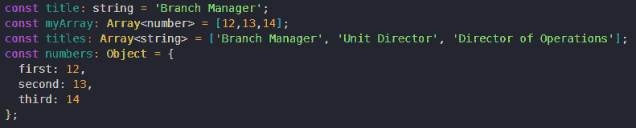

TypeScript in all it's glory

尽量不要关注上面看到的所有冒号和额外的东西，我们将在下面深入探讨。相反，关注突出的东西——我们只是用值声明变量，这些是字符串、数组和对象，就像在 JavaScript 中一样。

我学到的关于 TypeScript 的另一件大事是，您可以将 JavaScript 与代码混合使用，这样做没有任何问题。查看下面的截图(这是在 Angular 应用程序内):

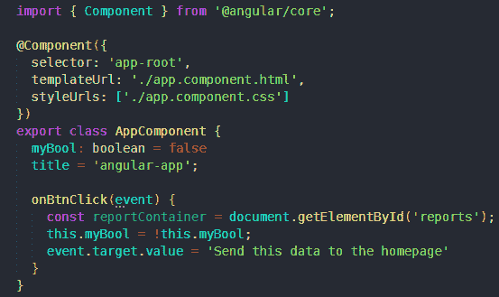

TypeScript and JavaScript used together in the same file

## 数据类型

让我们从有趣的东西开始——数据类型！(有几个数据类型我们不会涉及——never、null、undefined。这仅仅是因为对他们来说没有什么。我想让你知道它们的存在，如果你想深入了解这些类型，这里有一个官方 [TypeScript 文档](https://www.typescriptlang.org/docs/handbook/basic-types.html)的链接供你参考。)

TypeScript 将推断分配给变量的数据类型，而无需显式设置类型，但为了简单起见，我喜欢在声明变量时声明数据类型。

我们通过简单地在变量名之后等号之前放置一个冒号来分配数据类型:

***const {变量名}:{变量类型} = {变量值*** }

这是大多数 TypeScript 数据类型声明的约定，但函数和对象除外。

有些数据类型比这要复杂一些，但是您已经大致了解了。下面是对数据类型的一些简要说明以及如何声明它们的例子。

#### 布尔代数学体系的

TypeScript 中的布尔值与 JavaScript 中的布尔值工作方式相同。数据类型为 boolean 的变量声明如下:

`const myBool: boolean = false`；

#### 线

TypeScript 中的字符串与 JavaScript 中的字符串工作方式相同。数据类型为 string 的变量声明如下:

*T2`let myString: string = 'bacon'`*

#### 数字

TypeScript 中的数字与 JavaScript 中的数字工作方式相同。数据类型为 number 的变量声明如下:

`const myNum: number = 1207;`

#### **数组**

TypeScript 中的数组和其他数据类型一样，就像 JavaScript 中的数组一样。数据类型数组的变量有两种不同的声明方式:

`const myArr: number[] = [12, 90, 71];`

如果数组中的所有元素都是数字，那么上面的方法就是你声明数组的方法。

`const myArr: Array<number> = [12, 90, 71];`

这种声明数组的方式使用设置为 number 的通用数组类型。从功能上讲，这些方法产生声明数组类型变量的最终结果的方式没有区别。

如果数组中的数据类型未知或者是多种数据类型的混合，可以使用 *<任意>* 类型来声明数组(这是一种独立的类型，将在下面讨论):

`const myArr: Array<any> = [12, 'thirteen', false];`

这种方式将允许您在数组中混合数据类型。

#### **元组**

元组是 TypeScript 特有的数据类型。可以把它们想象成元素数量固定的数组。当您确切知道应该有多少个变量时，最好使用这种数据类型。可以重新分配索引的值，但不能重新分配元组中的元素数量。

数据类型 tuple 的变量就像数组一样声明:

`let mine: [number, string];`

如果我们想要改变元素的*值*，我们可以这样做，只要它们匹配我们在声明变量时提供的类型:

`mine[0] = 14`

`mine[0] = 'Steve'` ❌

因为我们将`mine`定义为一个元组，所以值的顺序也很重要，并且不能改变，在最初定义的数字之外分配一个索引将会产生一个错误:

`mine[0] = ['Dave', 71]` ❌

`mine = [121, 'Dave', 'Steve'];` ❌

`mine = [121, 'bacon'];`

#### **功能**

函数可以像你希望的那样显式。我的意思是，我们可以对参数和返回值应用类型。下面是两个例子:

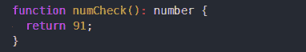

We explicitly define the type of value we expect this function to return

如果返回的值不是数字，这个函数将抛出一个错误*。只有当 变量指向一个数字时，它才可能返回一个变量 ***。****

*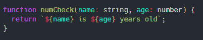

We can define the types of parameters we expect as well* 

*上面，我们对传递给函数的参数进行了类型检查。这是避免错误的一个很好的方法，因为如果参数的数量是关闭的，或者如果它们的数据类型与我们期望的不匹配，TypeScript 会让我们知道错误。*

*如果我想要一个不返回值的函数，我可以将类型设置为 *void* (一种数据类型，意味着没有任何数据。虽然它可以在声明变量时使用，但通常不是这样，因为那样我们必须将变量设置为 *null* 或 *undefined* ，我只在函数不应该有返回值时使用过，如果函数返回任何东西，TypeScript 将抛出一个错误:*

*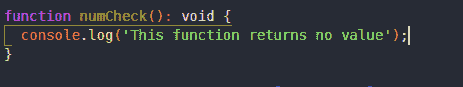

A function with the type set to void* 

*通过将类型设置为 *void* ,我明确了我的返回，并确定虽然这个函数可能仍在运行，但它不应该*返回值*。如果它确实返回值，我会得到一个错误。*

#### ***枚举***

*枚举是数据类型的一个受欢迎的补充(依我拙见)。可以把它们看作是一种更加用户友好的给数值命名的方法。下面是一个枚举示例:*

*`enum Foods {'bacon', 'tomato', 'lettuce'};`*

*console.log(Foods[0]) //产生' bacon ' console . log(Foods . bacon)//产生 0 console.log(Foods['莴苣']) //产生 2*

*也可以用枚举来分配编号索引格式。包括 C#在内的许多语言都有枚举，我很高兴看到 JavaScript 也有枚举。*

*你可以想怎么起名字就怎么起。你甚至可以改变指数的数字表示。如果希望第一个索引从 18 开始，而不是从 0 开始，那么很简单:*

*`enum Foods {'bacon'= 18, 'tomato', 'lettuce'};`*

*`console.log(Foods['bacon']); // 18`*

*假设我们有值 18，但不确定它在我们的`Foods`枚举中映射到什么，我们也可以检查它:*

*`console.log(Foods[18]); // 'bacon'`*

*一条值得注意的信息是，我们已经将第一个索引设置为从 18 开始，下一个索引将是 19，依此类推，遵循您建立的编号约定。*

***物体***

*TypeScript 中对象的定义方式与 JavaScript 中对象的定义方式相似。我们可以根据自己的喜好或形势的要求，对我们的定义进行含蓄或明确的表述:*

*`let data: = {name: 'Jonathan', age: 30, hobbies: ['running','swimming','coding']};`*

*`let data: {name: string, age: number, hobbies: string[]} = {name: 'Jonathan', age: 30, hobbies: ['running','swimming','coding']};`*

*当创建对象时，属性名是不可变的，但是它们出现的顺序并不重要，即使我们以特定的顺序定义它们。*

*此外，我们可以有类似上面的简单对象，或者我们可以定义利用多种数据类型的复杂对象，如下所示(该对象仅用于演示):*

*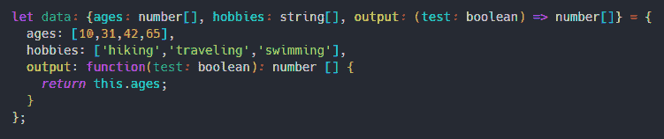

Here we explicitly set data types where possible in this complex object* 

#### *类型别名/接口*

*以上面的复杂对象为例，你可能会想这太棒了，但是下一次我需要创建一个复杂对象时会发生什么呢？我需要再次手动输入所有这些吗？*

*不要担心，类型别名和接口类型会有所帮助！类型别名是一种数据类型，它允许我们在其中保存其他数据类型，然后引用一个变量，而不是一遍又一遍地重写代码。*

*顺便提一下，类型别名和接口的工作方式非常相似。两者都允许我们为我们的数据构建一个对象/蓝图。但是，还有*的细微差别，这里就不一一赘述了。相反，如果你想深入了解，这里有一个[的帖子以一种极其有效的方式解释了这些差异](https://medium.com/@martin_hotell/interface-vs-type-alias-in-typescript-2-7-2a8f1777af4c)。**

**我们应该注意这两者之间的一些细节——当使用类型别名时，我们使用等号(=)来声明值，接口不需要等号。**

**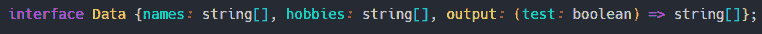

The interface type works very similarly to the type alias but requires no equals sign (=).** **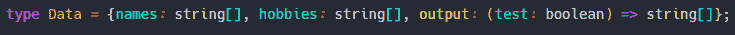

Alias data types do require an equals sign (=).** 

**现在我们已经声明了我们的别名，是时候使用这个别名了。当我们想要从这个别名“构建”我们的新变量时，我们简单地将它设置为数据类型:**

**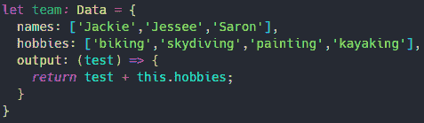

Scaffolding objects using the interface / type data types is extremely useful :)** 

**需要注意的是，*接口*是特定于 TypeScript 的。它只在编译时被用来做类型检查和捕捉任何可能被我们忽略的错误。**来自我们接口的数据将最终出现在我们的最终代码中，但是接口本身是编译出来的**。**

****类****

**在某种程度上，类是 TypeScript 真正的“面包和黄油”(至少在我看来是这样)。按照搭建新对象的想法，类允许我们以一种比每次需要时手工输入更简单的方式构建数据。**

**类可以被认为是我们的数据应该如何定义的蓝图，以及它应该能够通过方法做什么动作(如果有的话)。**

**下面是 TypeScript 中的一个类的例子(这是通过在 ES6 中引入类实现的):**

**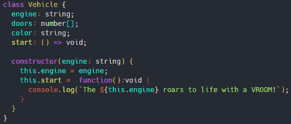

A TypeScript class, ready for instantiation :)** 

**现在，你可能会问自己一个*类*、*类型别名*和*接口*之间有什么区别？很棒的问题！两者的主要区别在于类可以被实例化(我们可以创建它们的新实例),而接口不能。**

**当然，还有其他不同之处，但不在本文的讨论范围之内。如果你想深入了解，这里有一篇我读过的[很棒的文章](https://ultimatecourses.com/blog/classes-vs-interfaces-in-typescript#Using_TypeScript_class_vs_using_Typescript_interface)，可以帮助我理解这些差异。当使用 TypeScript 时，你会发现它们的用例，就像我一样。**

****工会****

**这无疑是我最喜欢的类型脚本数据类型！联合类型允许我们声明一个变量，然后将其设置为“非此即彼”的值。我的意思是，假设我们期望数据被传递到一个函数中，但是我们不确定它是一个字符串还是一个数字——这是 union 类型的完美(也是预期的)目的。**

**我们在定义类型时使用单管道字符(在 Windows 上是 Shift+Enter 正上方的键)。下面是使用 union 数据类型定义变量时的样子:**

**`const numOfDoors: string | string[ ];`**

**这告诉 TypeScript*numOfDoors*是一个可以保存字符串或字符串数组的变量。**

**下面是我前面提到使用联合类型的函数的一个示例:**

**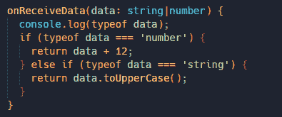**

****任何****

**Any 是我们在不确定将要获得的数据类型时设置的类型。也许我们从第三方获得了一些东西或一些动态数据，但我们不能 100%确定我们是否获得了一个字符串、一个数字或一组信息。这是任何类型的完美用例。**

**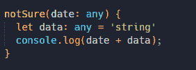

Data type any is a way to opt out of type checking** 

**我将警告不要使用 type *any* ，除非你绝对必须这样做，因为当使用时，我们选择退出类型脚本类型检查的核心特性之一。**

**然而，这种数据类型有它的用例，就像所有提到的数据类型一样。**

## **这是一个总结！**

**我告诉过你这不会花太长时间的，:D**

**我希望您喜欢这篇关于 TypeScript 的文章，并对它如何证明对您的代码库有用感到兴奋。在下一篇文章中，我们将深入探讨 TypeScript 的实用方面。我们将检查它的安装、编译，并在您的项目中使用它(不仅仅是 Angular 项目)！**

**这是最初发布在我的博客上的。**

**当你在那里的时候，别忘了注册我的**时事通讯**——你可以在页面的右上角注册。我保证我永远不会给你的收件箱发垃圾邮件，你的信息也不会与任何人/网站共享。我喜欢偶尔发送我发现的有趣资源、关于 web 开发的文章以及我的最新帖子列表。**

**如果你还没有，你也可以在社交媒体上和我联系！我所有的链接也在这个页面的右上方。我喜欢与他人交流，认识新朋友，所以不要害怕打招呼:)**

**有个牛逼的日友，开心编码！**