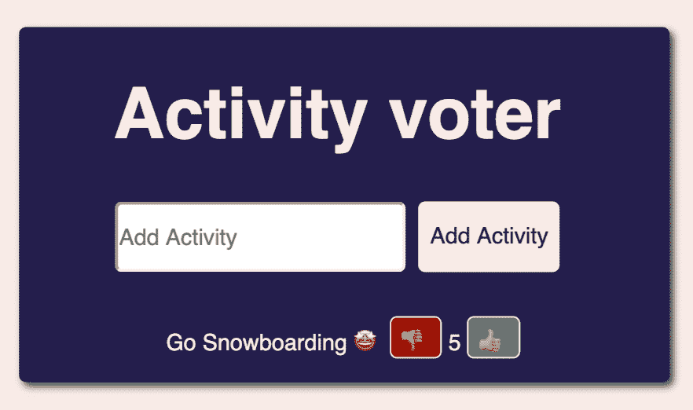
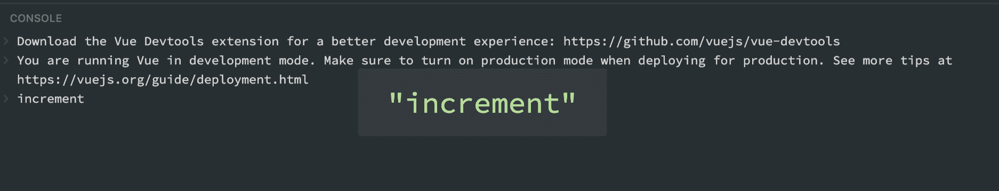
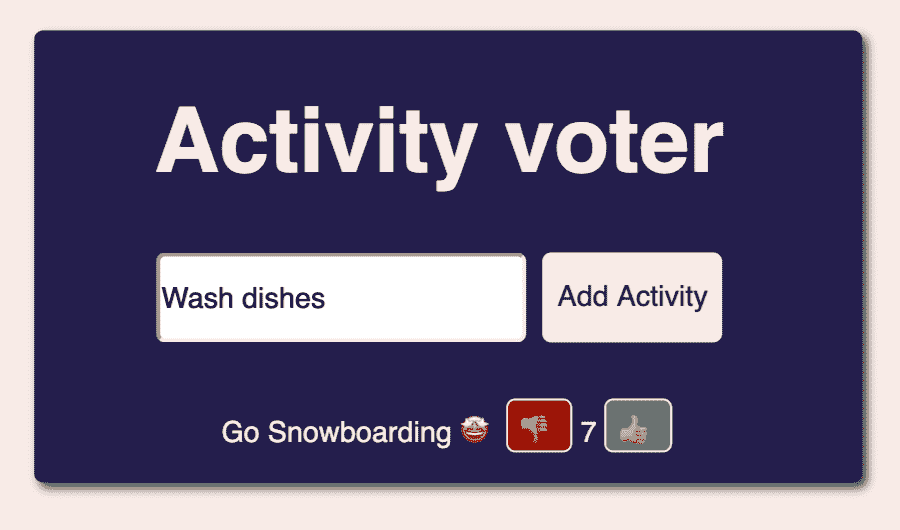
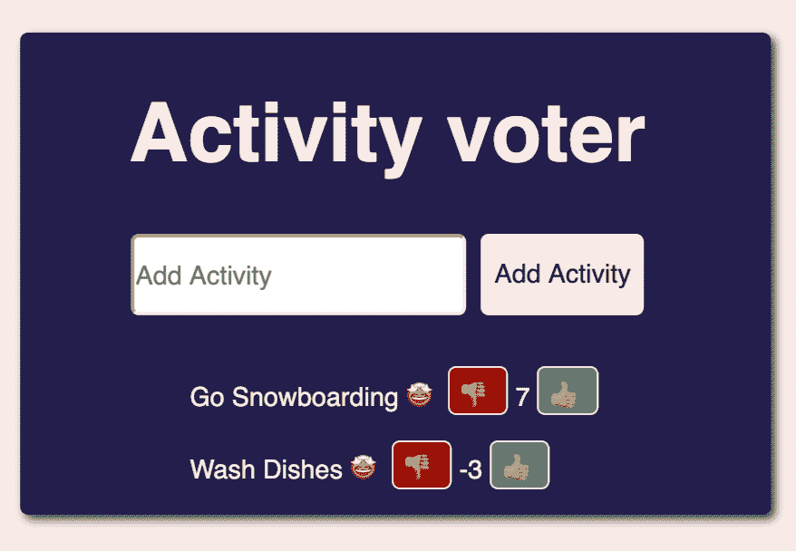
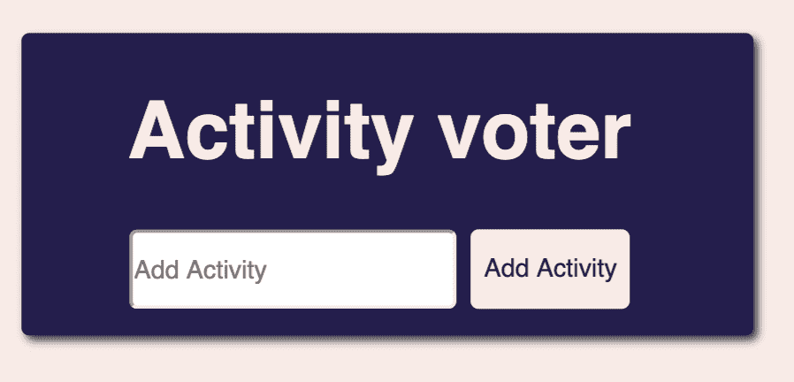
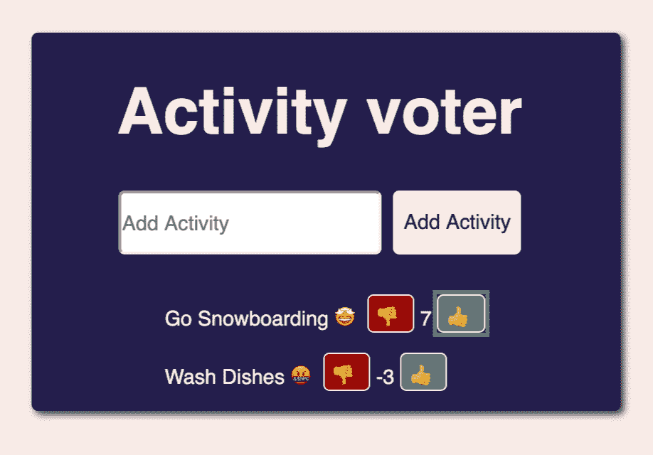

# 五分钟内学会武克

> 原文：<https://www.freecodecamp.org/news/learn-vuex-in-5-minutes/>

本教程将通过构建一个计划制定应用程序，让您对 Vuex 有一个基本的了解。用户可以输入活动，然后投票决定他们喜欢/不喜欢这些活动。

一旦你阅读了这个教程，如果你有兴趣了解更多，你可以查看我们在 Scrimba 上的[免费 Vuex 课程。](https://scrimba.com/g/gvuex)

Vuex 是什么？来自 [Vue 的官方文档](https://vuex.vuejs.org)

```
Vuex is a state management pattern + library for Vue.js applications.
It serves as a centralized store for all the components in an application, with rules ensuring that the state can only be mutated in a predictable fashion. 
```

本课程假设您对 Vue 有所了解，我们将简单介绍一下像`props`、组件和绑定这样的特性，但不会详细回顾它们。如果你想对 Vue 有一个快速入门，请随意在 Scrimba 上查看这个课程。

# 设置

在 Scrimba，我们不做复杂的设置。对于本教程，我们已经创建了一个简单的 HTML 文件，可以在其中写入任何内容。随意写你自己的 CSS 或者直接从[这个游乐场](https://scrimba.com/c/c66qG4uG)复制

使用`<script>`标签通过 CDN 导入 Vue 和 Vuex 库:

```
<!DOCTYPE html>
<html lang="en">
  <head>

    <title>Activity Voter</title>

    <script src="https://cdn.jsdelivr.net/npm/vue/dist/vue.js"></script>
    <script src="https://cdn.jsdelivr.net/npm/vuex/dist/vuex.js"></script>
    <style>
      /*
        ADD CSS HERE
      */
    </style>
  </head>
  <body>
    <div id="app"></div>
  </body>

  <script>
    /*
      ADD VUE CODE HERE
    */
  </script>
</html> 
```

或者，你也可以在[这个 Vue Scrimba 游戏场](https://scrimba.com/c/cqRNMEcG)中试验代码，只要记得**将游戏场重新链接到你自己的账户。**

# 应用程序计划

我们将开发一款投票应用，当你和一群朋友在一起，不知道该做什么，你必须考虑所有选项时，这款应用特别好用。

该功能将包括一个用户能够在一个活动中键入，然后每个活动将有一个向上和向下投票按钮，以计算总数。

# 入门指南

首先，让我们用 HTML 快速模拟我们的应用程序。我们将使用这个布局，然后提取到一个单独的组件，我们将添加功能的布局来生活。

```
<div id="app">
  <h1>Activity voter</h1>
  <form>
    <input type="text" placeholder="Add Activity" />
    <button id="button">Add Activity</button>
  </form>
  <ul>
    <li>
      <span>
Go Snowboarding</span>
<span>?</span>
        <button>?</button>
        5
        <button>?</button>
      </span>
    </li>
  </ul>
</div> 
```



# 用一些基本数据添加 Vuex 商店

Vuex 从店铺开始。商店是我们保存状态的地方。

```
<script>
  Vue.use(Vuex);

  const store = new Vuex.Store({

  });

  new Vue({
    el: "#app",
    store
  });
</script> 
```

让我们也向商店添加一些硬编码的数据，这将包括一个活动和一个带有表情符号的数组，以显示我们对该活动的感受。

```
<script>
  Vue.use(Vuex);

  const store = new Vuex.Store({
    state: {
      activities: [{ name: "go snowboarding", rating: 5 }],
      emojis: ["?"]
    }
  });

  new Vue({
    el: "#app",
    store
  });
</script> 
```

为了允许我们的状态反应性地改变，我们可以使用 Vuex `mapState`来为我们处理计算的状态属性。

```
new Vue({
    el: "#app",
    store,
    computed: Vuex.mapState(["activities", "emojis"])
  }); 
```

# 添加组件

现在我们在州内开展活动。让我们为每个活动呈现一个单独的组件。每个人都需要`activity`和`emojis`道具。

```
Vue.component("activity-item", {
  props: ["activity", "emojis"],
  template: `
    <li>
      <span>{{ activity.name }}
        <span>{{ emojis[0] }}</span>
        <button>?</button>
        {{activity.rating}}
        <button>?</button>
      </span>
    </li>
    `
}); 
```

在`app`中，我们现在可以使用我们新创建的组件以及所有合适的`activity`和表情符号绑定。快速提醒一下，如果我们想遍历一个数组，并为数组中的每一项显示一个组件，在 Vue 中，我们可以使用`v-for`绑定。

```
<div id="app">
  <h1>Activity voter</h1>
  <form>
    <input type="text" placeholder="Add Activity" />
    <button id="button">Add Activity</button>
  </form>
  <ul>
    <activity-item
      v-for="item in activities"
      v-bind:activity="item"
      v-bind:emojis="emojis"
      v-bind:key="item.name">
</activity-item>

</ul>
</div> 
```


# 添加要存储的突变

如果我们想更新 Vuex 中的商店，我们可以使用突变。目前，我们将只是`console.log`一个突变发生了，我们将实施它之后。

```
const store = new Vuex.Store({
  state: {
    activities: [
      { name: "go snowboarding", rating: 5 },
    ],
    emojis: ["?"]
  },
  mutations: {
    increment(state, activityName) {
      console.log('increment');
    },
    decrement(state, activityName) {
      console.log('decrement');
    },
  }
}); 
```

我们如何引发变异？我们在`$store`上调用一个`commit`函数，函数的名字是我们想要执行的突变。变异名称后的任何参数都被视为已提交变异的参数。

```
new Vue({
  el: "#app",
  store,
  data() {
    return {
      activityName: ""
    };
  },
  computed: Vuex.mapState(["activities", "emojis"]),
  methods: {
    increment(activityName) {
      this.$store.commit("increment", activityName);
    },
    decrement(activityName) {
      this.$store.commit("decrement", activityName);
    }
  }
}); 
```

# 向组件添加功能

每个`activity-item`都有投票按钮，需要点击按钮`increment`和`decrement`。我们可以将这些函数作为道具传递。现在让我们将方法绑定到道具上。

```
<activity-item
  v-for="item in activities"
  v-bind:increment="increment"
  v-bind:decrement="decrement"
  v-bind:activity="item"
  v-bind:emojis="emojis"
  v-bind:key="item.name">
</activity-item> 
```

让我们也不要忘记提供`activity.name`作为两者的参数。

```
Vue.component("activity-item", {
  props: ["activity", "emojis", "increment", "decrement"],
  template: `
    <li>
      <span>{{ activity.name }}
          <span>{{ emojis[0] }}</span>
          <button @click="decrement(activity.name)">?</button>
          {{activity.rating}}
          <button @click="increment(activity.name)">?</button>
      </span>
    </li>
    `
}); 
```

我们走吧！流量正在工作。我们可以在控制台中看到`console.log`语句。



# 工具计数器

让我们实现计数器。首先，我们需要根据名称找到一个活动，然后更新它的评级。

```
mutations: {
    increment(state, activityName) {
      state.activities
        .filter(activity => activity.name === `${activityName}`)
        .map(activity => activity.rating++);
    },
    decrement(state, activityName) {
      state.activities
        .filter(activity => activity.name === `${activityName}`)
        .map(activity => activity.rating--);
    }
  } 
```

太好了，我们现在可以投票决定活动了。



# 使用表单输入来添加活动

但是当然，我们也需要能够添加活动。

让我们为 store 创建一个变体，将一个活动添加到现有活动的列表中，其名称稍后将从输入中获得，默认评级为 0。

```
mutations: {
    ...
    addActivity(state, name) {
      state.activities.push({ name, rating: 0 });
    }
  } 
```

在方法内部，我们可以向存储提交一个新的活动。

```
methods: {
    ...
    addActivity(activityName) {
      this.$store.commit("addActivity", activityName);
    }
  } 
```

# 实现表单提交

让我们将提交功能连接到我们的 HTML 表单。

```
<form @submit="onSubmit">
  <input type="text" placeholder="Add Activity" v-model="activityName" />
  <button id="button">Add Activity</button>
</form> 
```

我们现在可以将提交函数添加到方法中。在内部，我们将使用现有的`addActivity`方法，最后，将输入字段中的`activityName`重置为空字符串。

```
methods: {
    ...
    onSubmit(e) {
      e.preventDefault();
      this.addActivity(this.activityName);
      this.activityName = "";
    }
  } 
```

我们调用`e.preventDefault()`来避免表单在每次添加新活动时被重新加载。



现在所有的计数器都工作了，字段得到了更新。这看起来确实有点奇怪，我们对所有的活动都只有一种情绪，不管它们的评分是多少。

让我们将表情符号重新编写成一个对象，描述它们反映的情绪，并清理现有状态，因此我们从无活动开始。

```
state: {
    activities: [],
    emojis: { yay: "?", nice: "?", meh: "?", argh: "?", hateIt: "?"}
},
... 
```

最后，我们可以根据活动的评分显示不同的表情符号。

```
Vue.component("activity-item", {
  props: ["activity", "emojis", "increment", "decrement"],
  template: `
    <li>
      <span>{{ activity.name }}
        <span v-if="activity.rating <= -5">{{ emojis.hateIt }}</span>
        <span v-else-if="activity.rating <= -3">{{ emojis.argh }}</span>
        <span v-else-if="activity.rating < 3">{{ emojis.meh }}</span>
        <span v-else-if="activity.rating < 5">{{ emojis.nice }}</span>
        <span v-else>{{ emojis.yay }}</span>
        <button @click="decrement(activity.name)">?</button>
          {{activity.rating}}
        <button @click="increment(activity.name)">?</button>
      </span>
    </li>
    `
}); 
```

我们从一个空白的应用程序开始，这正是我们想要的。



现在，如果我们将应用程序中以前的两个活动添加回来，请对我们的表情符号进行投票，这些表情符号反映了我们对这些活动的感受！



你可以在这里查看完整的代码。