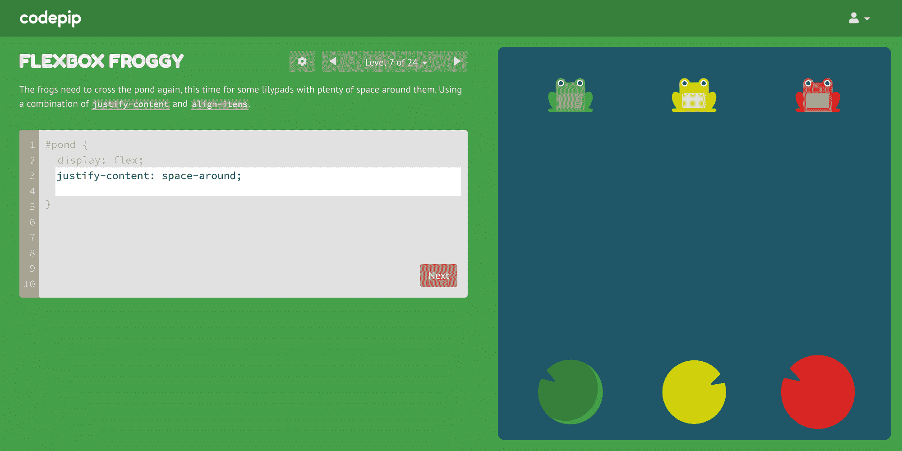

# 如何通过玩编码游戏学习 Web 开发

> 原文：<https://www.freecodecamp.org/news/learn-web-development-by-playing-coding-games/>

今天，我们很幸运地拥有几乎无穷无尽的学习 web 开发的资源。这些资源中有编码游戏。

我创作了像 [Flexbox Froggy](https://codepip.com/games/flexbox-froggy/) 和 [Grid Garden](https://codepip.com/games/flexbox-froggy/) 这样的游戏，以及其他像 [CSS Diner](https://flukeout.github.io/) 和 [CodeCombat](https://codecombat.com/) 这样的游戏，它们有助于将教育体验打包成一种有趣、引人入胜的形式。

然而，与任何学习资源一样，这些问题经常出现:

*   哪些编码游戏我该费心投入时间？
*   怎样才能用编码游戏最有效的学习？

在本文中，我根据自己作为游戏开发者和教育者的经验，提供了一些技巧来帮助你回答这些问题。

## 有一个游戏计划

当你开始学习网页开发时，不管是否涉及到游戏，你都应该有一个计划。

虽然你的计划不需要一成不变，但是有一个关于你想完成什么以及如何完成的策略已经让你领先了几步。

当你报名参加课程或训练营时，很多计划已经由经验丰富的辅导员为你做好了。freeCodeCamp 也提供了非常有组织的课程。

但是如果你在自学，网络上所有可用的资源(立刻感觉像是一个孤独的虚空和一个混乱的景象)会让人不知所措。所以我们来分解一下。

当形成一个计划时，大致有三种学习模式是你应该瞄准的。

首先是指导。这是向你介绍新概念或新技能的地方，无论是以视频、书籍、教程还是文档的形式。在教室里，这可能是白板上的老师。

其次是实践，在实践中你可以锻炼你的认知肌肉，加强你对新概念的理解。这可以采取练习题、练习或编码挑战的形式。

第三是整合，将你新获得的知识和技能整合到你现有的实践中。没有什么比基于项目的学习更好的了，你可以在一个更真实、更全面的场景中应用你所学的东西。

这方面的一个例子是你作为一个周末项目开始的一个 web 应用程序。即使是一个相对简单的例子，也会从 web 开发的所有不同方面(有很多方面)吸取经验，帮助你将你所学到的东西联系起来。

这三种模式没有硬性的划分，你遇到的很多资源都会跨越其中的一种以上。不过，这是一种思考和计划学习的有用方式。

现在，当涉及到编码游戏时，它们也可以适合这些模式中的任何一种。许多现有的代码游戏确实在第二种模式中有其最大的优势——实践，加上少量的指导。

例如，在 Flexbox Froggy 中，在如何使用 CSS flexbox 定位青蛙方面，你会遇到各种挑战，每一级都增加了难度。

最后，你将会在许多组合中多次应用 Flexbox 属性，以至于它们开始成为你的第二天性。

Move the frogs to their lily pads using CSS flexbox.

通过这个镜头，你可以看到编码游戏最好作为你可能使用的其他资源的补充，包括 freeCodeCamp 的课程。

## 做一个批评家

你可能有的下一个问题是你应该玩哪些编码游戏。我不是给你一个静态的列表，而是鼓励你像对待你遇到的任何参考资料一样自己去评估它们。

首先，从娱乐角度考虑游戏。这毕竟是一个游戏，对你来说应该很有趣。接下来，考虑教育学的角度。也就是说，我从游戏中学到了什么，我学得有效吗？

教育游戏的设计者不得不在平衡娱乐和学习之间走钢丝。对于更依赖于学习的东西，游戏内外有许多资源。

但是要小心另一个方向，一个仅仅具有教育内容的游戏。当教育内容太浅或者有太多其他游戏机制分散了你对需要学习的东西的注意力时，编码游戏可能会失败。

独自评估一个学习资源可能很困难，尤其是作为一个初学者。所以你的评价也要权衡别人的视角。

向值得信赖的导师或博主咨询。或者在你的社区中寻找有积极建议的资源:在 freeCodeCamp 论坛，web dev subreddits，或者你最喜欢的 Discord 或 Slack 组。

## 立即按开始键

即使你像其他人一样问自己同样的问题，如何将编码游戏最好地融入你的学习计划，每个人都会有不同的答案。没有放之四海而皆准的解决方案。

你的学习风格和激发你激情的东西取决于你的经历、偏好和目标。所以我鼓励你做的是从今天开始，享受它，并发现什么适合你。

尽管编写游戏来帮助你学习 web dev 的想法已经存在很多年了，但这种类型仍处于起步阶段。这个想法有太多未开发的潜力，你可以在一个有趣的，互动的，沉浸式的环境中学习，游戏是一个很好的载体。

对我们来说幸运的是，越来越多的编码游戏正在变得可用。欢迎你今天来 [Codepip](https://codepip.com) 站一站，为自己玩一把编码游戏。