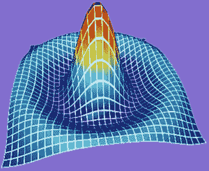

# 了解 web GPU——面向 web 的下一代图形 API

> 原文：<https://www.freecodecamp.org/news/learn-webgpu-a-next-generation-graphics-api-for-the-web/>

WebGPU 是下一代图形 API，也是图形和计算的未来 web 标准，旨在通过 GPU 加速提供现代 3D 图形和计算能力。

我们刚刚在 freeCodeCmap.org YouTube 频道上发布了一个 WebGPU 课程。

许乃夫博士开发了这个课程。徐博士拥有超过 25 年的编程经验，出版了多本关于 WebGPU 的书籍。

在本课程中，您将通过构建 10 个 WebGPU 项目来学习 WebGPU 的基础知识。您将学习如何从头开始创建每个项目，以及如何将 3D 图形添加到您的 web 应用程序中。

3D Sinc Surface created with WebGPU

本课程结束时，您将了解如何通过 WebGPU API 在网络上使用 GPU 计算创建高级 3D 图形。以下是本课程涵盖的部分:

*   发展环境
*   创建一个彩色三角形
*   用 GPU 缓冲创建一个正方形
*   具有不同表面颜色的立方体
*   动画和摄像机控制
*   光模型
*   带灯光效果的立方体
*   彩色地图
*   3D 简单曲面
*   3D 正弦曲面

观看以下或 freeCodeCamp.org YouTube 频道的完整课程(2 小时观看)。

[https://www.youtube.com/embed/KTFFdZSDiTU?feature=oembed](https://www.youtube.com/embed/KTFFdZSDiTU?feature=oembed)

### 副本

(自动生成)

许乃夫博士是许多 WebGPU 书籍的作者。在这门课中，他会教你 WebGPU 的基础知识。

嗨，我是杰克。在本视频中，您将通过构建十个独立的 WebGPU 项目来学习 WebGPU 图形编程的基础知识。

从简单的图元到复杂的 3d 图形，每个项目都将在前一个项目的基础上创建。我们的最终产品将是一个美丽的三维正弦表面，如这里所示。

我们将从头开始创建这些 WebGPU 项目，并向您展示如何通过 GPU 加速将 3D 图形添加到您的 web 应用程序中。

在此，我要感谢 Beau 和 FreeCodeCamp 发布这个视频。FreeCodeCamp 是编程社区的一个很好的资源。感谢你所做的一切。

在看这个视频之前，我想先简单介绍一下我的背景。我获得了理论物理博士学位，并且有超过 25 年的 C、C++、C#编程经验。NET 和 web 开发。

我已经出版了 20 多本关于各种主题的实用编程的书籍，包括图形编程、机器学习、定量金融、数值计算方法和 web 应用。

最近，我创建了一个 YouTube 频道:基于我的书的实用编程。

在这个频道中，我将展示几个循序渐进的视频系列，其中我将强调示例代码对实际应用的有用性。

第一个视频系列是关于 WebGPU 图形编程的，它基于我最近出版的书“实用 WebGPU 图形”。

这里介绍的项目也选自这本书。

我的频道:博士实用编程。

徐是新的，我计划每周更新。

如果你能查看我的频道并订阅它，我将不胜感激。

现在我们来看 WebGPU 图形编程。

现在让我们开始项目一，它将建立一个开发环境。

这个项目使用的源代码可以从这里的 GitHub 链接下载，这个项目使用这个特定的版本。

那么现在什么是 WebGPU 呢？WebGPU 是下一代图形 API。

这是图形和计算的未来网络标准，网络 GPU 将通过 GPU 加速提供现代 3d 图形和计算能力。

在本视频中，我们将使用以下开发工具来构建我们的 WebGPU 应用。

首先是 Visual Studio 代码 node.js。

我们使用 TypeScript 作为我们的编程语言，我们将使用 webpack 作为我们的模块化捆绑器。

为了运行 WebGPU 应用程序，目前，我们有三种选择。

第一个是使用 Chrome 金丝雀来测试我们的 WebGPU 应用程序。

另一种选择是通过 origin 试用版在常规 Crome 上运行 WebGPU 应用程序。

从 Chrome 94 开始，Web GPU 可以作为普通 Chrome 的原始试用版。

您需要注册 origin trials 并为您的 origin 申请令牌。

第三种选择是 Chome 将在今年 5 月正式支持 WebGPU。

所以今年 5 月以后，你就可以在普通 Chrome 上运行你的 WebGPU 应用了。

在这个视频系列中，我将使用 Chrome Canary 来测试我们的 WebGPU 项目。

这里，我假设您已经安装了 Visual Studio code node.js，并且还在您的计算机上全局安装了 TypeScript。

开始编程吧。

现在让我们打开一个命令提示窗口，让我们创建一个文件夹，将目录 gpuapp 和 cd 放入其中。

然后，我们将运行这个命令:npm init -y 来创建 package.json 文件。

好的，这个文件将存储我们在这个项目中使用的依赖项。

现在，我们将使用以下命令安装 webpack 及其命令行界面:npm install cli。

WebPack 是一个模块化的捆绑器，它将相关文件捆绑在一起，生成可供 web 应用程序使用的静态资产。

这里我们使用 webpack，主要用于传输 TypeScript 文件，但这里我们不使用它来捆绑其他类型的文件，如 HTML 和图像文件。

现在安装很复杂。

此时，我们将使用一个命令启动 Visual Studio 代码:code period。

这是 Visual Studio 代码接口，你可以看到我们只有一个 package.json 文件，但这里没有发生什么。

现在通过按 Ctrl+J 键打开一个终端窗口。

现在，让我们安装一些依赖包。

首先，我们将安装 jQuery 和相应的类型包。

npm 安装 jQuery。

我们将使用 jQuery 来操作应用程序中的 DOM 元素。

接下来，我们要安装样式 CSS 和 ts 加载器。

如果我们的项目包含样式表文件，我们需要使用样式加载器和 CSS 加载器来捆绑它。

为了在我们的项目中创建 TypeScript 模块，我们还需要在本地安装 TypeScript。

npm 本地安装 TypeScript。

我们之前已经在全球范围内安装了它。

现在，打开 package.json 文件。

您可以看到这里的脚本部分只包含 test 属性，这不是很有用。

这里我们将用代码替换这一部分。

这里的代码允许你在不同的模式下运行 WebPack，比如开发、生产和观察模式。

现在我们可以看到这个文件并关闭它。

现在，所有已安装的软件包都将存储在 node_modules 文件夹中。

这里为任何 npm 操作自动生成 package_lock.json 文件。

所以我们不需要做任何事情。

下一步是用命令 tsc - init 初始化 TypeScript 文件。

此操作为 TypeScript 创建了一个配置文件，此处称为 ts_config。

现在，我们打开此配置文件，我们需要替换其内容。您可以在这里看到，我们将目标设置为 es6。另请注意，我们将根目录定义为 src，并将目录输出为 dist，distribution folder。

现在保存这个文件并关闭它。

然后，我们为项目创建一些文件夹结构。

首先，让我们创建 src 文件夹。

因此，我们在这里创建一个名为 src 的文件夹。

我们将把所有的源文件存储在这个文件夹中。

接下来，我们创建一个 dist 文件夹，其中包含所有将被上传到 web 服务器以运行我们的应用程序的文件。

在这个文件夹中，至少有一个 HTML 文件。

让我们向该文件夹添加一个索引 html 文件。

添加另一个文件 index.html，并添加一些代码。

你可以在这里看到我们添加了标题 WebGPU 项目。

这里 h1 title 检查你的浏览器是否支持 WebGPU。

这里我们也有 h2 DOM 元素，并将其 id 设置为 id_gpu_check。

这个 h2 元素将用于显示文本字符串，该字符串将由稍后创建的 typescript 函数返回。

现在我们即将完成开发环境设置，但我们错过了一个关键步骤，即我们需要安装 WebGPU 包。

WebGPU 工作组已经为 WebGPU 标准创建了一个类型定义。

这个包匹配正在进行中的 WebGPU API，它目前还不是很稳定。

所以几乎每周都会变。

所以要小心使用。

无论如何，让我们用这个命令安装它。

所以我们在这里指定的版本是 0.1.12，这是最新的版本，我们安装它叫 webgpu types。

因为 WebGPU 不是向后兼容的，所以你最好使用相同的版本来运行我们的项目。

否则，您需要对代码进行一些修改来运行应用程序。

所以我建议你这里用同一个版本 0.1.12。

安装后，我们需要配置它。

打开 TypeScript 配置文件。

您可以看到，我们已经对其进行了配置。

我们在类型部分添加了 WebGPU 类型和节点，您可以看到这里有节点类型。

所以我们需要安装它使用这个命令来安装这个节点类型。

好了，WebGPU 现在可以用于我们的项目了。

现在让我们添加一些类型脚本文件到我们的项目。

首先，在 src 文件夹中添加一个名为 helper.ts 的新文件。

所以我们添加了一个名为 helper.ts 文件的新文件，并在其中添加了一些代码。

您可以看到，我们使用这个 navigator.gpu 变量来检查 gpu 的可用性。

这个变量在 web GPU API 中定义。

所以你可以看到我们用粗箭头来定义 typescript 函数。

接下来，我们需要创建一个名为 main.ts 文件的入口点文件。

好的，先保存这个文件。

并关闭它。

让我们向 src 文件夹添加另一个新文件，名为 main.ts 文件。

现在向该文件添加一些代码，我们只需导入 jQuery，并从 helper.ts 文件导入 checkWebGPU 函数，刚刚实现。

所以这里我们定义 id_gpu_check 来显示 checkWebGPU 函数返回的字符串。

这里的 id 表示 index.html 文件中定义的 h2 DOM 元素，确保这个 ID 与那个文件中定义的 ID 相同。

接下来，我们还需要创建一个 webpack 配置文件。

现在向根目录 webpack_config.js 文件添加一个新文件。

您可以看到，我们将包输出目录定义为 dist，入口点命名为 main。

主 src main.ts 文件。

请注意，输出文件总是带有 bundle.js 扩展名。

现在我们可以保存这个文件并关闭它。

现在，我们可以从终端窗口运行以下命令来捆绑我们的 TypeScript 文件:npm 在生产模式下运行 prod。

您可以在 dist 文件夹中检查包文件。

您可以在这里看到我们有几个主要的 bundle.js 文件。

这是我们的捆绑文件，这是许可证文件，这是源映射文件。

这个 main.bundle.js 文件在 index.html 文件中被引用。

这里可以看到，这是 main.bundle.js 这个 bundle 文件是由 webpack 生成的。

为了测试我们的应用程序，我们还需要一台服务器。

这里我们将使用实时服务器扩展。

点击扩展链接搜索实时服务器。

第一个是实时服务器。

这里我已经安装好了。

否则，我们在这里安装链接。

如果你还没有安装，只需点击安装按钮来安装服务器。

所以我想你已经安装好了。

现在，我们可以打开 index.html 文件，右键单击任何地方打开直播服务器，点击这个链接。

这将打开我们的默认浏览器来显示网页。

不幸的是，如果你的默认浏览器是普通的 Chrome，它会显示这样的信息:你当前的浏览器不支持 WebGPU。

因此，为了在这里运行 WebGPU 应用程序，我们将安装 Chrome Canary。

所以在这里搜索铬金丝雀。

点击它。

所以这是为开发者准备的每夜构建。

只需下载 Chrome Canary 并安装即可。

我已经在我的机器上安装了这个 chrome 金丝雀。

请记住你的 Chrome 金丝雀的安装位置。

好吧，我想你已经安装好了。

让我们回到 Visual Studio 代码。

我们希望将默认浏览器更改为 Chrome Canary，这将易于测试我们的 WebGPU 应用程序。

因此，请按 Ctrl+Shift+P 并在此处键入首选项开口设置。

所以打开这个文件。

这里，你需要在这里加上这三条线。

生活服务器设置不要这样的信息消息。

我把它设置为真，这不重要。

我还将根目录设置为 dist，因为我们的 index.html 文件就在这个目录中。

这里的自定义浏览器命令行定义了默认浏览器。

所以你需要替换这段代码。

所以你需要复制你的 Chrome Canary exe 文件位置并粘贴到这里，你必须改变它来匹配你的情况。

现在我们可以保存这个文件并关闭它。

现在启动 Chrome 金丝雀，输入 Chrome flags，搜索 WebGPU。

这里，启用它我已经启用了。

如果你不是，你只需要启用它，使 WebGPU 可用于我们的 Chrome 金丝雀。

好吧，我们可以关闭它。

好了，最后我们可以测试我们的 WebGPU 应用开发环境了。

在这里，我们在状态栏区域有一个链接，您可以看到“上线”链接。

这次它将启动 Chrome 金丝雀浏览器。

单击此链接。

您可以看到您当前的浏览器支持 WebGPU，祝贺您，我们已经成功地为 WebGPU 应用程序设置了开发环境。

现在我们完成了第一个 WebGPU 项目，展示了如何设置开发环境。

这是这个视频系列的项目 2。

这里我将解释如何在 WebGPU 中创建一个彩色三角形，如下所示。

这是一个彩色的三角形。

这个项目是基于我们的第一个项目。

您可以直接从 Visual Studio 代码中打开 project one，或者从 GitHub 存储库中克隆源代码。

git clone.

这是项目一源代码的 GitHub 链接。

我还把这个 project 2 的源代码放到了 GitHub 的仓库里。

以下是链接。

所以您可以从这个链接下载这个项目中使用的源代码。

现在我们将直接从 Visual Studio 代码中打开项目一。

这里我们首先添加一个名为 site.css 的 CSS 文件到 src 文件夹，src 文件夹下，添加一个名为 site.css 的新文件

在这个文件中输入一些代码，然后保存并关闭它。

就像 WebGL 一样，我们使用 WebGPU 进行图形渲染需要做的第一件事就是创建一个 canvas 元素。

从 dist 文件夹中，打开 index.html 文件。

这里我们需要从这里改变 h2 元素。

这里我们用 ID canvas-webgpu 定义 canvas 元素。

稍后我们将在这个画布上创建 WebGPU 图形。

WebGPU 编程由两部分组成，一部分是用 typescript 或 javascript 编写的控制代码，另一部分是在 GPU 上运行的着色器代码。

这里我们将使用 WebGPU 的官方着色器语言，称为 WGSL，是 WebGPU 着色语言的缩写。

为了利用 VS 代码中突出显示的代码，我们将把带有 wgsl 扩展的着色器代码转换成类似 typescript 的模块。

为此，我们需要为 webpack 安装一个着色器加载器。

现在打开一个新的终端窗口。

运行以下命令安装名为 npm install ts-shader-loader 的着色器加载程序。该加载程序最初是为加载 GLSL 着色器代码而创建的。

但是我们会让它在这里为 WGSL 工作。

接下来，打开 WebPack configuration.js 文件，并向其中添加以下代码。

这里带有 wgsl，glsl，vs，vs 的文件表示顶点着色器，fs，fs 表示片段着色器。

因此，具有这些扩展名的文件将被该着色器加载器视为着色器代码。

然后我们需要从 VS 代码中安装 WGSL 扩展。

点击此扩展链接，搜索 WGSL。

这里是第一个:wgsL 提供语法高亮我已经安装了这个模块。

所以你可以在这里看到代码高亮。

在这种情况下，使用该扩展很容易编写着色器代码。

所以如果你还没有安装它，那么点击这个安装按钮来安装它。

接下来，我们需要为我们的着色器添加一些类型声明。

向 src 文件夹添加新的子文件夹。

名为 types 的新文件夹。

然后添加一个名为 shader.d.ts 文件的新文件。

在这个文件中，我们向这个文件添加了一些内容。

这里我们声明模块。

带有 wgsl，glsl，vs 或者 fs 的文件我们声明这个文件为模块。

所以现在我们可以保存这个文件并关闭它。

现在我们可以写我们的着色器代码。

在 src 文件夹中添加一个名为 shader.wgsl 文件的新文件。

然后从这段代码中添加一些代码，可以看到这里有两个着色器。

一个是顶点着色器，另一个是片段着色器。

我们有一个顶点着色器函数，叫做 vs_main 函数。

vs 表示顶点着色器函数。

这里我们有 fs main:片段着色器主函数。

顶点着色器将包括单词位置、颜色和纹理的顶点数据作为输入，输出是剪辑坐标中的位置。

而其他输出(如颜色和纹理)将被传递给片段着色器。

然后，这些值将在片段上进行插值，以产生平滑的颜色渐变。

现在回到我们的例子。

在顶点着色器中，我们首先在这里定义输出结构，它包含内置位置和名为 vColor 的输出颜色。

在 vs_main 函数中，我们首先使用浮点向量 vec2 定义三角形的三个顶点。

所以我们有三个顶点。

我们还使用浮点 vec3 向量为每个顶点指定了颜色。

你可以看到第一个是 1 0 0。

这意味着红色。

第二种颜色是 0，1，0 绿色，最后一种是 0，0，1 蓝色。

所以我们为每个漩涡定义不同的颜色。

接下来，我们使用输出结构来定义输出，这里我们将位置的 2D 向量转换成一个向量 c4，这个四维向量我们将 z 分量置零，w 分量置一。

类似地，我们将颜色的 3d 矢量转换为 vec4。

一个表示片段着色器中颜色的透明度，我们将顶点着色器的输出颜色作为输入，并将其作为片段颜色返回。

好的，这是我们在 WebGPU 中创建彩色三角形时将使用的着色器。

现在我们可以保存这个文件并关闭它。

接下来，我们将使用 TypeScript 编写 WebGPU 控制代码。

打开主. ts 文件。

并用下面的新代码替换内容。

这里我们首先介绍 helper.js 文件中的 checkWebGPU 函数。

然后，从 shader.wgsl 文件中，我们从该文件引入我们的着色器，我们还导入 site.css 文件。

在这里，我们将使用它来配置我们的网页布局。

接下来，我们创建一个名为创建三角形的新函数。

这个函数必须是异步的，你可以看到异步函数，因为 WebGPU API 本身就是异步的。

在这个函数中，我们首先检查你的浏览器是否支持 WebGPU。

在 WebGPU 中，我们可以通过调用这里的请求适配器来访问 GPU。

一旦我们有了这个适配器，我们就可以调用请求设备方法来获取 GPU 设备。

这个设备提供了一个与硬件一起工作的上下文。

以及一个创建 GPU 对象的接口，比如 buffer 和 texture。

我们还可以在这个 GPU 设备上运行命令，就像 WebGL 一样，我们需要一个用于显示图形的 canvas 元素的上下文。

这里我们使用 canvas 元素来请求 web GPU 上下文。

你可以在这里看到通过名称 webgpu 获取内容。

这是 WebGPU 用来创建上下文的关键字。

然后，我们用设备和格式配置这个上下文。

接下来，我们通过调用 Create render pipeline 方法来定义渲染管道。

在这个管道中，我们有几个属性。

第一个是顶点，在这里我们将着色器分配给模块。

这里的入口点是 vs_main 函数，这个函数是在我们的着色器文件中创建的。

类似地，对于片段属性，我们将着色器分配给模块一个入口点作为 fs_main 函数。

另一个必需的属性是这里的一个原语，这个属性包含一个名为拓扑的字段。

我们将它设置为三角形列表，因为我们想在这个项目中创建一个三角形。

接下来，我们通过调用开始渲染过程来创建命令编码器和渲染过程。

该渲染过程接受 GPU 渲染过程描述符类型的参数作为渲染过程选项。

这里我们只使用用于存储图像信息的彩色附件。

在我们的示例中，它将背景色存储在 clearValue 区域中，我们还有另一个名为 loadValue 的字段。

在下一个版本中，这个字段将从 WebGPU 中删除，所以我们在这里不使用它。

接下来，我们将把管道分配给渲染过程，并通过调用此处的 draw 方法来绘制三角形。

我们调用 end 函数来完成当前的渲染过程，这意味着不再有指令被发送到 GPU。

最后，我们将所有指令提交到 GPU 设备的队列中执行。

运行该命令后，我们的三角形将被写入 GPU 上下文并显示在我们的 canvas 元素上。

现在我们完成了创建三角形方法的实现。

该方法提供了创建 WebGPU 应用程序的基本流程，即首先初始化 WebGPU API，创建着色器程序，设置渲染管道并构建渲染通道，调用 draw 函数，将指令提交给 GPU 执行。

最后，我们调用创建三角形函数来生成我们的三角形。

到目前为止，我们已经完成了这个项目的程序设计。

我们现在可以在终端窗口上运行以下命令:npm run prod 将我们的 typescript 代码捆绑到生产模型中。

好了，完成了。

我们的包文件已成功创建。

现在，我们可以从这里点击上线链接，打开 Chrome Canary 来查看我们的三角形。

单击此链接。

这是我们的彩色三角形。

你可以看到这里是红色，绿色和蓝色。

从一个顶点到另一个顶点，你可以看到颜色平滑地变化，因为 WebGPU 在内部插值颜色，从而产生平滑的颜色渐变。

现在我们已经完成了项目 2。

这是一个项目三:我们将使用 GPU 缓冲区创建一个彩色的正方形。

在最后一个项目中，我们通过直接在着色器代码中写入顶点和颜色数据，在 WebGPU 中创建了一个彩色三角形。

这种方法只可能用于创建非常简单的形状。

使用这种直接的方法来创建具有不同颜色和纹理的复杂 3d 图形几乎是不可能的。

在这个项目中，我将介绍 GPU 缓冲区，并向您展示如何使用它来存储顶点和颜色信息。

在本例中，我们将创建一个彩色方块来解释 GPU 缓冲区的概念。

这里我们将介绍几个新概念，它们将成为创建复杂 3d 图形对象的基础。

Web GPU 中的 GPU buffer 代表一块内存，可以用来存储 GPU 操作的数据。

在这个项目中，我将向您展示如何使用 GPU 缓冲区来存储顶点位置和颜色数据。

您可以从这个 GitHub 资源库链接下载这个项目中使用的源代码。

你可以看到我们有具体的承诺版本，这个版本是针对我们当前的项目。

现在，让我们启动 Visual Studio 代码，并打开我们在上一个视频中构建的项目 2。

好的，这是我们在上一个视频中使用的项目 2。

现在让我们首先对索引 html 文件做一些修改。

从 dist 文件夹中，打开 index.html 文件。

现在我们需要在这里更改 h1 标题，以使用 GPU 缓冲区创建正方形。

所以我们不需要改变代码的其他部分。

所以我们可以保存这个文件。

接下来，从 src 文件夹中，打开 helper.ts 文件。

现在我们需要在这个帮助文件中添加一个名为 InitGPU 的新函数。

所以我们需要在这里添加一些代码。

您可以看到，我们将所有 WebGPU 初始化代码都放在了这个函数 initGPU 中。

这样可以避免代码重复，因为所有 WebGPU 项目的初始化都是一样的。

这个函数是一个异步函数，它返回设备、画布、格式和上下文，这些将在我们创建渲染管道和渲染过程时使用。

我们还想在这个帮助文件中添加另一个名为 Create GPU buffer 的函数。

所以我们需要在这里添加另一个函数，叫做 Create GPU buffer。

您可以看到这个函数有三个输入:设备、数据和使用标志。

这里，我们将默认使用标志设置为顶点或复制目标。

在这里，您可以看到我们调用设备创建缓冲区方法来创建 GPU 缓冲区，并将大小设置为数据的字节长度，以便为缓冲区数据分配空间。

这里的另一个属性是在创建时映射的，我们将这个属性设置为 true。

这意味着 GPU 缓冲区归 CPU 所有，可以从 typescript 代码中读写访问。

一旦映射了 GPU 缓冲区，应用程序就可以使用 get 请求访问内容范围，例如，这里的 get mapped range 方法，并将其设置为要存储在缓冲区中的数据。

请注意，GPU 不能直接使用映射的 GPU 缓冲区，必须通过调用 upmap 方法取消映射。

这里，我们的 create GPU buffer 方法返回未映射的缓冲区，可供 GPU 使用。

因此，在这里要注意 GPU 缓冲区的映射和未映射状态。

现在我们可以保存这个文件并关闭它。

接下来，我们需要对 src 文件夹中的 main.ts 文件进行更改。打开 main.ts 文件。

我们需要用新代码替换它的内容。

您可以看到，我们首先引入了 initGPU，并从 helper.ts 文件创建了 GPU 缓冲区，然后我们引入了着色器。

着色器代码将在稍后讨论。

在 Create square 方法内部，我们首先调用 initGPU 方法创建一个 GPU 对象，然后从中获取设备。

接下来，我们在这里定义顶点数据和颜色数据。

你可以看到这是我们的顶点数据，颜色数据。

这是我们正方形 a，b，c，d 的顶点坐标。

所以，坐标像这里 a 减点 5 减 1，这是 a，b，d，我们把这个正方形分成两个三角形 a，b，d，d，b，c，每个三角形的顶点必须按逆时针方向排列。

你可以看到 a-b-d，d-b-c。

我们也给每个顶点分配一种颜色。

你可以看到红色，绿色，蓝色和黄色。

你可以看到 a 是红色，B 是绿色，如此等等。

这些数据与坐标一致，如图所示。

当然，你也可以用其他方式来划分这两个三角形。

比如 a-b-c，c-d-a。

所以你这样画对角线。

所以再来两个三角形。

这不重要。

接下来，我们通过调用 Creator GPU buffer 来创建两个缓冲区:一个是顶点缓冲区，另一个是颜色缓冲区。

接下来，我们通过调用 Create render pipeline 方法来创建管道。

我们在这里添加的新代码是针对 buffer 属性的。

在我们没有这个缓冲属性之前。

现在，它是一个两个元素的数组，第一个元素是顶点位置。

第二是为了颜色。

你可以看到，我们把 arrayStride 的顶点位置设置为 8，因为每个顶点用两个浮动的 32 元素表示。

每个浮点 32 数字需要四个字节，而对于颜色，它使用三个浮点 32 元素为每个顶点表示。

因此，它的数组跨距设置为 12。

这里的另一个重要参数是着色器位置。

对于顶点位置，我们将着色器位置设置为零，对于颜色，我们将着色器位置设置为一。代码的其他部分与上一个项目中使用的非常相似。

这里我们将基本拓扑设置为三角形列表。

这里的一个新东西是，在这里将管道设置为渲染过程之后，我们还需要使用顶点缓冲区和颜色缓冲区将顶点缓冲区设置为渲染过程。

你可以在这里看到我们设置顶点缓冲，因为零斜率是顶点缓冲。

在第一个槽，我们设置了颜色缓冲区。

在这里的 draw 函数中，我们将顶点的数量设置为 6，因为我们现在有两个三角形。

现在我们完成了对这个文件的修改。

现在我们可以保存这个文件了。

接下来，我们需要修改我们的着色器代码。

从 src 文件夹中，打开 shader.wgsl 文件。

这里我们需要用新代码替换他的上下文。

这里你可以看到我们没有在这个着色器代码中定义任何顶点和颜色，因为我们将这些数据存储在 GPU 缓冲区中。

相反，我们引入两个输入，一个是位置 0 的位置，另一个是位置 1 的颜色，这必须与 main.ts 文件中管道中的着色器位置定义一致，因为我们将着色器位置定义为 0，您可以记住该位置，着色器位置是颜色的位置。

所以这里的位置是零。

这里色位置是一个。

这就是我们如何设置顶点着色器和 GPU 缓冲区之间的关系。

注意，我们在这里将它们定义为 vec4 f32。

对于颜色相同的东西 vec4 f32。

它们看起来与存储在顶点和颜色缓冲区中的数据不太一致，对于位置，它是 2d 数组，而对于颜色，它是 3d 数组。

这是因为 WGSL 着色器足够智能，可以通过向 z 分量添加 0 并向 w 分量添加 1 来自动将它们转换为 vec4 类型。

您可以看到，我们还使用结构定义了两个输出，一个是位置，一个是 vColor。

在这个 vs_main 函数中，我们通过将 pos 分配给 position 并将颜色分配给 V color 来处理位置和颜色数据。

在片段着色器中，我们从顶点着色器引入 vColor，并作为片段颜色返回。

好的，这是我们创建正方形时将使用的着色器。

我们现在可以保存并关闭该文件。

现在，我们可以在终端窗口中运行以下命令来捆绑我们的 typescript 代码:npm run prod 以生产模式捆绑我们的代码。

好了，包文件创建成功。

现在，我们可以单击 Go Live 链接打开 Chrome Canary 来查看我们的 square。

所以点击这个上线链接。

这是我们不同顶点颜色的彩色正方形。

这里有红色、绿色、蓝色和黄色。

从一个顶点到另一个顶点，你可以看到颜色平滑地变化，因为 WebGPU 在内部插值颜色，从而产生平滑的颜色渐变。

好了，现在我们完成了项目三。

在项目二和项目三中，我演示了如何在 WebGPU 应用程序中创建三角形和正方形图形。

事实上，这两个物体是平面二维的。

我们还没有创建任何真正的 3d 图形。

在这个项目 4 中，我将解释如何创建一个具有不同面颜色的 3d 立方体。

这是我们将在 WebGPU 应用程序中创建的第一个真正的 3d 对象。

您可以从这个 GitHub 资源库链接下载这个项目中使用的源代码。

这里我们有这个项目的具体版本。

这个例子涉及很多代码和数学。

所以请做好消化的准备。

为了在 WebGPU 中创建一个真正的 3d 对象，你需要有 3d 矩阵和变换的数学背景。

由于我们的计算机屏幕是二维的，它不能直接显示三维物体。

为了在 2d 屏幕上观看 3d 物体，你必须将物体从 2d 投影到 3d，这将涉及一系列坐标变换。

从这里你可以看到我们在这里定义了物体坐标系中的 3d 物体。

然后，我们对对象执行各种变换，包括缩放、平移和旋转。

我们称这种转换为模型转换。

在这个变换之后，我们将物体坐标中的物体转换成世界空间中的物体。

接下来，视图转换在世界空间中定位观察者，并将我们的 3d 对象转换到相机空间，也称为眼睛坐标。

这里投影变换的目的是定义一个被称为视见平截头体的视见体，就在这里。

这是一个视锥。

这有两种用途:它决定一个对象在屏幕上如何成为一个项目。

它还定义了从最终图像中剪切掉对象的哪些部分。

也就是说，只有平截头体内的部分会被保留，平截头体外的部分会被删除。

最后，我们使用视口变换将剪辑坐标转换为标准化的设备坐标。

在 WebGPU 中。

这里的视口变换是在着色器代码中自动执行的。

请注意，像 WebGL 一样，WebGPU API 不提供任何处理转换的函数。

在这个项目中，我们将使用一个名为 GL matrix 的 JavaScript 包来创建 3d 矩阵操作和转换。

由于 3d 矩阵和变换对于任何计算机图形编程都是常见的，在这里，我想你已经有了这方面的数学背景，我不会在这上面花更多的时间。

相反，我将集中讨论如何在 WebGPU 应用程序中创建 3d objecta。

从这个项目中，你会学到 web GPU 中的一些重要概念，即统一缓冲区和绑定组。

我们将使用统一的缓冲区来表示变换和投影矩阵，然后使用绑定组将统一的缓冲区传递给顶点着色器。

现在，我们从 Visual Studio 代码开始，打开我们在上一节中构建的项目三。

这是我们在项目三中使用的代码。

首先，我们需要安装一个名为 GL matrix 的新 NPM 软件包:npm install gl matrix。

我们将使用这个包来执行矩阵操作和 3d 转换，现在让我们对 index . HTML 文件做一些更改。

从 dist 文件夹中，打开 index dot HTML 文件。

这里，我们需要将 h1 标题更改为具有不同面颜色的立方体。

所以我们不需要改变代码的其他部分。

保存此文件。

在这里，我们将创建我们的三维立方体。

这些是我们立方体的坐标。

从这张图上你可以看到有八个顶点和六个面。

如果我们每个面有不同的颜色，那么每个顶点将有三种不同的颜色。

例如，对于这些顶点，c，我们有顶面、正面和右面。

因为不同的脸有不同的颜色。

所以顶点 C 可以有三种不同的颜色，这取决于我们这里说的哪个面是正面 A，B，C，d。

你可以在这里看到一个 B C D。

正如我们之前所做的，我们现在可以将这个正面分成两个三角形。

一个是 A-B-C，C-D-A，两个三角形你可以在这里看到 ABC 和 CBA。

这样，您可以对其他面执行三角化。

接下来，向 src 文件夹添加一个新的 TypeScript 文件，并添加一个新文件 vertex _data.ts 文件。

将新代码添加到这个文件中这是我们立方体的位置数据:这是正面、正面和六个面这是不同面的颜色数据。

你可以看到前面我们用蓝色，右边是红色，后面是黄色等等。

所以不同的脸有不同的颜色。

所有的位置坐标和颜色都和这张图一致。

现在我们可以保存并关闭这个文件。

接下来，我们将对 shaderr 代码进行一些更改。

从 src 文件夹中打开 shader.wgsl 文件。

现在，我们需要用新代码替换这些内容。您可以看到，这个着色器不同于我们在项目三中使用的着色器，因为我们需要合并存储变换和投影矩阵的统一缓冲区。在这里，我们定义了一个统一结构，然后使用绑定组将模型-视图-投影矩阵传递给着色器。

这里的 mvp 矩阵意味着模型视图投影矩阵，你可以看到这里的变量类型是统一的。

接下来，我们像在上一个项目中一样定义输出结构。

我们定义位置和颜色。

这和以前一样。

对于 vs_main 函数，我们还定义了两个输入:一个是位置，一个是颜色，与上一个项目相同。

在这个函数中，唯一的区别是位置不仅有 pos，而且我们还乘以这个模型视图投影矩阵。

所以在这个位置上进行变换。

对于片段着色器，我们仍然使用 vColor 作为输入，并将其作为片段颜色返回。

这与项目三中的相同。

现在，我们可以保存并关闭该文件。现在，我们从 src 文件夹中打开 helper.ts 文件。

这里我们首先需要从 gl-matrix 导入。

我们需要引入 vector three，mat4，然后在这个文件中添加一个名为 Create View projection 的新方法。

这个创建视图投影的方法有四个输入参数:第一个是纵横比、相机位置、相机观察方向和相机向上方向。

这里我们首先创建一个视图投影和视图投影矩阵。

然后，我们使用 mat4.perspective 和 mat 4 . look 来创建投影和视图矩阵。

接下来我们使用 mat4.multiply 方法将投影矩阵和视图矩阵结合起来，形成我们的视图投影矩阵。

该函数返回视图矩阵、投影矩阵、视图投影和相机选项。

当我们讨论摄像机控制时，摄像机选项将在下一个项目中使用。

现在，我们需要添加另一个名为 create transformation 的函数，它用于构建模型矩阵。在这里，我们首先创建三个绕 X、Y 和 Z 轴旋转的旋转矩阵，然后创建一个平移和缩放矩阵。

接下来，我们对这里的输入参数执行单独的转换。

最后，我们将所有的变换组合在一起，形成最终的变换矩阵，这就是我们的模型矩阵。

现在保存并关闭这个文件。接下来，我们需要对 main.ts 文件进行一些更改。

从 src 文件夹中打开 main.ts 文件。

这里我们需要用新的代码替换它的内容。

这里我们首先介绍一些来自 helper.ts 文件的方法，包括新创建的 createTransforms，create view projection，我们还介绍了来自 vertex_data.js 文件的立方体数据，以及来自 gl-matrix 库的 mat4。

在这个 create3d object 方法中，代码与我们在项目三中使用的非常相似。

在这里，我们创建了顶点缓冲区，你可以看到和颜色缓冲区使用了立方体数据的位置和立方体数据的颜色。

下面是管道代码。

也类似于项目三。

这里的区别是位置的数组步幅是 12，而不是 8。

现在对于我们的立方体，我们有 x，y，z 坐标。

所以我们这里有 12 个颜色，仍然是 12 个，因为我们有 RGB 元素。

这里，我们还将位置的着色器位置设置为零，颜色的着色器位置为一。

这里管道中唯一的不同是我们添加了这个 depth_stencil 属性。

这里，我们将 depthWriteEnabled 设置为 true，以启用深度模板测试。

深度模板测试确定是否应该绘制给定的像素。

对于 3d 图形。

启用深度模板测试非常重要。

否则，你可能会得到意想不到的结果。

下面的代码是新的，并且特定于我们的 3d 立方体。

这里，我们通过调用 CREATE VIEW projection 方法来创建一个模型视图和一个模型视图投影矩阵。

然后，我们为 mvp 矩阵创建一个统一的缓冲区。

你可以在这里看到它的用法，我们把它设置为我们变换的一个制服。

大小是 64，因为我们的矩阵是 4 乘 4，所以我们有 16 个元素。

每个元素都是一个 32 的浮点数，所以它的大小是 64。

然后，我们通过为这个统一缓冲区调用 Create Binding group 来定义绑定组。

这里我们将布局设置为默认的管道 get 绑定组布局零。

这意味着我们使用绑定组零布局。

在 entries 属性中，我们将绑定设置为零，并将 buffer 设置为我们刚刚在这里定义的统一缓冲区。

如果我们有一个更均匀的缓冲区，我们可以在这里添加元素。

把它们放入这个条目数组。

除了来自上下文的纹理视图，我们还引入了深度纹理。

在这里，我们将大小设置为画布的宽度和高度。

我们这里使用的格式是深度 24 Plus，您也可以使用其他格式。

这里的用法我们将其设置为 render_attachment。

现在我们的渲染过程描述，包括两个部分:一部分是颜色附件，另一部分是深度模板附件。

附件的颜色与我们在项目三中使用的颜色相同。

深度模板附件专用于我们的 3d 立方体。

接下来，我们通过调用 helper.ts 文件中定义的 create transforms 方法来构造模型矩阵。

然后，我们通过将模型矩阵与视图投影矩阵相乘来获得模型视图 MVP 矩阵。

所以我们得到了一个最终的模型视图投影矩阵，然后我们通过调用写缓冲区方法将这个模型视图投影矩阵添加到我们的统一缓冲区中。

您应该已经熟悉了下面的代码。

我们只是定义渲染过程和设置顶点颜色缓冲区。

但是我们还需要使用统一绑定组来设置绑定组，这是将统一缓冲区传递给顶点着色器所需要的。

现在，我们完成了对 main.ts 文件的修改。

然后我们可以保存这个文件。

到目前为止，我们已经完成了这个项目的所有程序设计。

然后，我们可以在终端窗口中运行以下命令，以生产模式捆绑我们的代码:npm run prod。

好了，包文件创建成功。

现在，我们可以单击 Go Live 链接打开 Chrome Canary 来查看我们的 3d 立方体。

单击此链接。

这是我们的立方体，在这个页面上显示了不同的表面颜色。

好的，我们已经完成了这个项目。

这是项目 5，我们将在其中讨论动画和摄像机控制。

在上一个项目中，我解释了如何使用统一的缓冲区来创建一个三维立方体。

在这个项目中，我已经演示了如何制作立方体动画以及如何使用鼠标与立方体交互，您可以从这个 GitHub 资源库链接下载该项目中使用的源代码，这里是该项目使用的特定提交版本。

对于动画，我们将使用 JavaScript requestAnimationFrame 函数。

该功能可以以高效和优化的方式更改您的屏幕。

下面是一个使用请求动画帧的例子。

你可以看到我们用递归一遍又一遍地循环。

在这里，我们首先在 UI 中定义 DOM 元素，并在这里定义一个起始数字零。

接下来，我们创建一个计数函数，将数字加 1。

然后将其设置为 counter 元素的文本内容。

在这个计数器函数中，我们调用请求动画帧，并将计数器函数本身作为回调函数传递。

这会导致它在下一帧之前再次运行。

最后，我们使用请求动画帧功能来启动动画。

这是请求动画帧的基本用法。

为了使用鼠标与立方体进行交互，我们将使用名为 3d 视图控件的 npm 包。

这个包可以用来用你的鼠标控制相机，然后你可以通过控制相机与 3d 对象进行交互。

现在让我们开始 Visual Studio 代码，并打开我们在上一节中构建的项目四。

这是项目四中使用的代码。

首先，我们需要安装名为 3d 视图控件的 JavaScript 包。

打开终端窗口并运行 npm 安装 3d 视图控件我们将使用这个包来控制摄像机。

该软件包已经安装。

现在让我们对 index . HTML 文件做一些修改。

从 dist 文件夹中，打开该文件。

首先，我们需要将 h1 标题改为动画和摄像机控制。

我们还需要添加两个单选按钮，让您选择是否需要动画或摄像机控制，在这里您可以看到单选按钮。

好了，现在我们可以保存这个文件了。

本例中的着色器代码与项目 4 中使用的相同。

所以我们不需要对着色器代码做任何更改。

现在从 src 文件夹中，打开 helper.ts 文件。

这里我们需要添加一个名为创建动画的新方法。

我们需要在这里添加 create_animation。

这是创建动画的代码。

方法。

这里的 draw augments 是一个回调函数。

在这里，我们想使用阶跃函数来制作绕 X、Y 和 Z 轴旋转的动画。

创建动画有一个布尔参数，这里是 _animation，它控制你是否想要动画对象。

现在我们可以保存这个文件并关闭它。

接下来，我们需要对 main.ts 文件进行一些更改。

打开 main.ts 文件。

我们需要用您的代码替换内容。

这段代码实际上与上一个项目中使用的代码非常相似。

这里，除了从 helper.ts 文件引入的其他函数，我们还引入了我们刚刚创建的 Create Animation 函数。

注意，我们这里使用的是要求引入 3d 视图控件模块，而不是导入。

这是因为 3d 视图控件包是使用旧模块方法创建的。

所以我们必须用 require 来代替 import。

这里我们定义从这个包创建相机。

在创建 3d 对象方法中，我们引入了一个输入参数 is_animation，并在这里将其默认值设置为 true。

这里的初始化代码和管道代码与上一个项目中使用的相同，我们不需要对这些代码做任何更改。

在“创建统一数据”部分，我们定义了 v 矩阵，这是一个新的视图矩阵。

接下来，我们需要添加旋转和相机。

我们使用 vec3 定义旋转，在这里定义相机。

我们有参数画布和相机选项，我们不需要对代码做任何修改来创建一个统一的缓冲区和一个统一的绑定组。

这是渲染过程描述，也与上一个项目中使用的相同，这里，我们将渲染过程相关代码放在名为 draw function 的新函数中。

这个 draw 函数被定义为我们动画的回调函数。

你可以在这里看到，如果 is_animation 不为真，我们使用相机来生成我们的视图矩阵。

然后将投影矩阵与这个视图矩阵相乘，形成我们的视图投影矩阵。

draw 方法的其余代码与我们在最后一个项目中使用的代码相同。

这里我们通过调用创建动画函数来启动动画。

你可以看到我们有回调函数，使用这里定义的 draw 函数。

最后，我们需要在这里添加一个单选按钮选择，你可以看到，如果单选选中值等于动画，我们运行动画。

否则，我们使用相机控制。

现在我们完成了对 main.ts 文件的修改。

所以我们现在可以保存这个文件。

到目前为止，我们已经完成了所有的程序设计。

现在，我们可以在终端窗口中运行以下命令:npm run prod 来捆绑我们的 TypeScript 代码。

好了，包文件创建成功。

现在，我们可以单击 Go Live 链接打开 Chrome Canary 来查看我们的 3d 立方体。

单击此上线链接。

你可以在这一页看到动画立方体。

它不断旋转，因为我们称之为动画模式。

现在你可以点击这个相机控制单选按钮，然后你可以用鼠标左键旋转立方体，用右键移动它。

你也可以用鼠标滚轮放大、缩小立方体。

所以你可以用鼠标和立方体互动。

所以现在这个项目是如何完成的。

在之前的几个项目中，我解释了如何创建一些 2d 和 3d 对象。

但是，当使用纯色渲染这些图形对象时，您可能会发现图像看起来很平，无法显示对象的 3d 特性。

这是因为我们忽略了光和物体表面之间的相互作用。

照明有助于为场景提供视觉效果，使其看起来更真实。

光照是创建真实世界着色 3d 图形对象的最重要因素之一。

但是，WebGPU 在光照方面并没有提供太多的内置功能。

它只运行两个功能:顶点和片段着色器。

如果您想要 3d 场景中的照明效果，您必须自己创建照明模型。

在这个项目中，我将在 WebGPU 中建立一个简单的照明模型，并用它来模拟光源。

在这里，您可以从这个 GitHub 资源库链接下载这个项目中使用的源代码。

这里，这个项目使用了特定的提交版本。

这里我将讨论三种类型的光源，环境光，漫射光和镜面光。

环境光是均匀照亮所有对象的光，不管它们的位置或方向如何。

它是环境中的全局照明。

漫射光和镜面光的反射取决于光与表面的角度。

当光线照射到表面时。漫反射发生在所有方向，如此处所示，而镜面光反射发生在单一方向。

如此处所示。

这里显示了圆环面上的光反射。

在左边这里，光只是来自环境光，你可以看到这个圆环看起来很平。

中间显示的是环境光和漫射光。

您可以看到 3d 特征已经显示在这里。

在右边，我们有三个光源:环境光+漫射光和高光。

你可以看到这个圆环看起来更真实。

所以，这就是我们想要在这个项目中建立的光模型。

光反射取决于光照射表面的角度。

角度对于漫射光和镜面光至关重要。

该角度总是与垂直于曲面的曲面法线相关联。

为了建立光照模型，我们需要根据表面朝向的方向来计算表面法线。

由于三维物体的表面可以弯曲，因此在不同的顶点可以面向不同的方向。

所以，对于不同的顶点，法向量通常是不同的，也就是说，法向量总是与曲面上的某个点相关联。

这里显示了三维立方体的法向量。

这里，正面指向屏幕。

所以它的法向量是 001。

右脸朝向右边。

所以它的正常值是 1 00。

并且顶面向上。

所以，它的法向量是 010。

因此，类似地，您可以指定左背面和底面的法向量。

注意法向量的长度应该总是 1，也就是说，我们需要归一化法向量。

对于一个一般的四边形 A B C D，它的 4 个顶点可能不在同一个平面上，我们可以把它分成两个三角形，A，B，C 和 C D A。

我们可以分两步计算它的表面法线。

首先，我们计算每个三角形的加权法线，这是由该三角形的面积加权的。

面积越大的三角形重量越大。

众所周知，三角形的面积与两边的叉积成正比。

例如，在这里，对于三角形 A，B，C，我们有一个叉积 B，C，和 C-A，b c 和 a c。

类似地，对于三角形 C D A，我们有一个叉积 D A 和 A C。

下一步是从加权三角形法线计算表面法线，即表面法线等于两个加权法线之和，然后我们可以将其归一化。

所以我们得到这个四边形法线等于归一化这两个叉积。

这个三角形加上另一个三角形的和。

所以，我们可以把这两项结合起来，形成一项等于 C，A 和 D，b 的叉积。

这意味着这个四边形的曲面法线，等于 C，A，和 d b 的叉积。

正好等于这两个对角向量的叉积。

我们将使用这个公式来计算我们的三维表面的光模型。

一旦我们计算了法向量，我们就可以用它来计算光强。

对于漫射光，其强度与这里的光矢量和法向矢量 n 之间的余弦成正比。

你可以看到余弦α等于归一化的 L 点 N。

如果我们定义 Id，漫射强度，Kd 漫射材质属性，那么我们可以得到这个公式:漫射强度等于 Kd 乘以最大余弦α和 0。

这里最大值是用来避免余弦α的负值这里，我们只取正值。

我们也可以像这样将环境光添加到漫射光强度中。

这里 Ia 是环境光强度。

所以总光强是最大值 Kd，这是 Ia。

所以我们像这样给这个漫射光加上环境强度。

对于镜面光，我们有两个模型，一个是 Phong 模型，这个模型非常简单。

因此，镜面反射光的强度等于 Ks，Ks 是特定的材料属性，s 是表面的光泽度或粗糙度，V 是观察方向，R 是反射方向。

Phong 模型的一个问题是，观察方向和反射方向之间的角度必须小于 90 度，以便镜面 Phong 项起作用。

我们可以使用 Blinn-Phong 模型来解决这个问题。

Blinn-Phong 模型基于半角矢量使用不同的矢量集进行计算。

这里有一个半角向量，你可以看到 L 是光线方向，N 是法线向量，V 是视角方向，H 是半角向量定义的 L 是光线方向加上视角方向。

观察方向加上光线方向给出了 H。

Blinn-Phong 模型中的公式在这里变成了 N 点 H 而不是 V 点 R。

所以这个 N 和 H 之间的角度总是小于 90 度。

所以这个 N 点 H 总是给正值。

所以我们将使用这种 Blinn-Phong 模式来计算镜面反射光。

现在让我们进入编程部分。

我们从 Visual Studio 代码开始，并打开我们在上一节中构建的项目五。

这是我们项目文件的代码。

现在让我们在着色器代码中实现灯光模型。

从 src 文件夹中打开 shader.wgsl。

我们需要用新代码替换它的内容。

这里我们首先定义了包含视图投影矩阵、模型矩阵和法矩阵的统一结构。

这里，法线矩阵是法线矢量数据的变换矩阵。

当应用一个变换到一个表面时，我们需要从原始的法向量中得到结果表面的法向量。

为了正确地转换法向量，我们不只是简单地将它们乘以用于转换对象的相同矩阵，而是需要将它们乘以该矩阵的逆矩阵的转置。

由于目前的 WG SL 版本还没有实现矩阵求逆的功能，所以我们必须在 TypeScript 代码中对变换矩阵的逆进行这种转置，然后将其作为统一矩阵传递，如这里所示，正规矩阵。

然后，我们定义包含三个变量的输出结构:内置位置，v 位置经过一些转换后的位置，我们称之为 v 位置和 v_normal，这是转换后的法向量。

在我们的 vs main 函数中，它包含两个输入参数，一个是顶点位置，称为 pos，另一个是法线向量数据。

在这个函数中，我们只对位置执行模型转换。

这给了我们这里的垂直位置，因为它用于灯光计算。

垂直法线是法线向量数据乘以此处的法线变换矩阵的结果。

这里的默认位置是通过对顶点数据执行模型视图和投影变换而获得的。

对于片段着色器，我们首先介绍了一个名为 FragUniform 的统一结构，它包含两个变量:一个是光线矢量的光线位置，另一个是眼睛位置。

或视图向量。

它还有另一种结构，叫做 LightUniform。

这里包含了我们灯光模型的参数。

这里有一个浅色和一个高光色。

高光可以有自己的颜色，其他参数包括环境强度、漫射强度、高光强度和高光亮度。

这里，fs_main 函数将 v_position 和 v_normal 作为输入。

在这个函数中，我们计算光照模型。

这里是漫射。

只用 N 点 L，余弦α。

对于镜面光，我们使用 Blinn Phong 模型。

这是 N 点 h。

你可以看到，碎片着色器的输出颜色将被环境光、漫射光和镜面反射光加权。

它的组合给了我们最终的颜色。

所以，这是我们将要用来计算灯光模型的着色器。

现在我们可以保存这个文件并关闭它。

接下来，在 src 文件夹中，我们将添加一个名为 light.ts 的新类型脚本文件。

添加一个新文件 light.ts 文件。

下面是这个文件的代码。

这里，我们首先创建一个名为 light inputs 的接口，它包含用于计算光照模型的参数。

这段代码还包含一个新的函数 create-shape-with light，它有四个输入参数:一个是顶点数据、法线数据和灯光输入，另一个是动画参数。

如果没有参数被传递，我们在这里设置默认的灯光参数，所以我们有一些灯光参数的默认值。

接下来，我们在这里创建一个顶点缓冲区和一个普通缓冲区。

您可以看到管道在这里包含一个 buffers 属性。

这是一个包含两个元素的数组。

第一个元素是着色器位置为零的顶点数据。

第二个元素是法向量数据，着色器位置在这里是 1。

管道的另一部分与我们在项目五中使用的相同。

接下来我们创建一个统一的数据。

这里我们定义了法线矩阵和模型矩阵，以及视图和视图投影矩阵。

为了简单起见，这里我们将从相机得到的眼睛位置设置为等于眼睛位置。

这意味着光矢量等于视图矢量。

在这里，我们然后创建三个均匀缓冲区:一个是顶点均匀缓冲区，另一个是片段均匀缓冲区，最后是光线均匀缓冲区。

顶点均匀缓冲器用于存储模型矩阵、vew 投影矩阵和法线矩阵。

碎片均匀缓冲区用于存储眼睛位置和灯光位置。

光线均匀缓冲区用于存储光线参数，这些参数将用于计算片段着色器中的光线模型。请注意，它是一个回调绘制函数，我们在该绘制函数中编写了一个模型矩阵和一个法线矩阵，因为我们希望使用实时模型矩阵来执行各种转换。

注意，我们在这里通过首先对这个模型矩阵求逆，然后转置这个正规矩阵来构造正规矩阵。

并得到最终的法向量矩阵。

这意味着我们对原始模型矩阵进行求逆和转置。

最后，得到正规矩阵。

当我们将数据设置到缓冲区时，请注意这里是 64，128 是偏移量，因此，我们还需要使用正确的偏移量将该数据写入统一缓冲区。

最后，我们为渲染过程设置顶点缓冲区、法线缓冲区和统一绑定组。

现在，我们完成了文件的编码。

我们可以保存这个文件并关闭它。好了，我们完成了计算光照模型的编程。

在下一个项目中，我们将使用这里实现的灯光模型来创建一个带灯光效果的 3d 立方体。

在项目 6 中，我解释了如何在 WebGPU 中构建一个简单的光照模型。

在这个项目中，我将向您展示如何使用这个灯光模型来为 3d 立方体添加灯光效果，如图所示，您可以从这个 GitHub 资源库链接下载该项目中使用的源代码。

此特定承诺版本用于此项目。

现在启动 Visual Studio 代码，打开我们在上一节中构建的项目 6。

这是我们在上一节讨论的项目 6 中使用的代码。

为了计算光照模型，我们必须知道 3d 物体表面上每个顶点的法向量。

现在，我们需要将法向量数据添加到立方体的 vertex_data 中。

从 src 文件夹中打开 vertex_data.ts 文件。

对于立方体数据方法，我们需要添加法向量数据。你可以看到，同一面上的顶点有相同的法向量。

比如前脸都有 001。

同样，右边是 100，所有的 100 等等。

一旦我们将法线向量数据添加到这个 CubeData 函数中，我们需要返回法线数据。

我们还需要返回法线。

好了，现在我们可以保存这个文件并关闭它。

接下来，我们需要对 index.html 文件进行一些修改。

从 dist 文件夹中，打开 index.html 文件。

现在我们需要用新代码替换它的内容。

在这里，我们添加一些输入参数，让你测试我们的光模型。

此参数还允许您指定对象颜色、ambent、漫射、镜面光系数。

您也可以为镜面反射光计算指定表面光泽度和镜面反射颜色。

现在我们可以保存这个文件了。

接下来，我们需要对 main.js 文件进行一些修改。

从 src 文件夹中，打开 main.js 文件。

现在用新代码替换它的内容。

由于渲染管道和渲染过程的大部分代码已经包含在了 light dot ts 文件中，因此 main.ts 文件变得非常简单。

首先，我们从 light.ts 文件中引入“使用灯光创建形状”和“灯光输入”接口，然后从 vertex data.ts 文件中引入立方体数据。

接下来，我们调用立方体数据方法来获得顶点数据，并在这里定义默认的参数，光输入，我们只是使用默认的参数。

也是 _animation，我们将其设置为 true。

然后我们调用 create shape with light 函数来创建一个带灯光效果的 3d 立方体。

这部分代码允许用户通过改变输入参数来重新创建具有不同照明效果的立方体。

现在我们完成了对 main.js 文件的修改。

我们现在可以保存该文件。

现在，我们可以在终端窗口中运行以下命令，以生产模式捆绑我们的 TypeScript 代码:npm run prod 好了，捆绑文件已成功创建。

现在，我们可以单击 Go Live 链接打开 Chrome Canary 来查看我们的带灯光效果的 3d 立方体。

单击此链接。

这是一个红色的立方体，灯光效果显示在这个页面上。

我们可以对输入参数进行一些更改，然后单击 redraw 按钮来重新创建立方体。

现在，举例来说，我们可以设置漫反射和镜面反射系数为零，为零，环境光为一。

现在点击重画，我们得到一个只有环境光的立方体。

你可以看到立方体看起来很平，没有三维特征。

现在让我们添加漫射光和镜面光回来。

第二点。

然后我们可以改变物体的颜色。

比如这个红色我们把它改成绿色，010。

并将镜面反射颜色从白色改为黄色，然后单击“重画”按钮。

你可以在这里看到黄色，你可以增加光泽，例如，100。

你可以看到这个点有点发黄。

这是镜面光。

现在，回到动画。

所以通过改变这个参数，你可以在这个立方体上得到新的光照效果。

您可以使用此灯光模型，按照此处介绍的步骤轻松创建自己的 3d 对象。

好了，现在我们已经完成了项目 7。

到目前为止，我们讨论的项目通过在片段着色器中为片段颜色变量分配一个期望的颜色值而被应用了一个固定的颜色。

在这个项目中，我将解释如何使用色彩映射表来渲染三维表面。

曲面在各种应用中扮演着重要的角色，包括计算机图形游戏和 3d 数据可视化。

在一些图形和图表应用程序中，我们需要一个自定义的色彩映射表来实现特殊的视觉效果。

事实上，色彩映射表只是一个以某种期望的方式组织起来的颜色表或列表。

我们可以用 mx3 颜色矩阵创建一个定制的颜色图，每行代表 RGB 值。

行索引可以表示 2d 图表的 y 数据或 3d 表面图的高度。

对于给定的色彩映射表矩阵，色彩数据值可以线性缩放到色彩映射表。

这里显示了我们将在这个项目中创建的色彩映射表的色带。

你可以看到每个颜色图都有一个熟悉的颜色图名称，例如 hsv、hot、cool 和 jet 等等。

您可以从这个 GitHub 资源库链接下载这个项目中使用的源代码。

这个特定的提交版本用于这个项目。

现在从 Visual Studio 代码开始，打开我们在上一节刚刚构建的项目 7，这里包含上一个项目中使用的源代码。

我们可以使用简单的数学公式轻松地创建自定义的色彩映射表。

在这里，我将提供几个常用的色彩映射表使用 mx3 色彩映射表数组。

现在向 src 文件夹添加一个名为 colormap_data.ts 文件的新类型脚本文件，添加一个名为 colormap_data.ts 文件的新文件。

然后向该文件添加一个新方法。

这里的色彩映射表数据方法包含 11 种不同的色彩映射表数据。

您可以将 hsv、hot 和 jet 视为默认值。

在这个函数中，你可以看到每个色图包含 11 个 RGB 颜色数组，每个，我的意思是，这里的数组是 RGB 值。

这里显示了使用这个色彩映射表数据生成的色带。

这是 hsv，对应这个彩条。

这是这条色带对应的喷流。

因此，这些色带是使用色彩映射表数据生成的。

在 colormap_data 函数中，我们假设这 11 个颜色数组在 0 到 1 的范围内均匀分布。

例如，颜色 0，第一个元素表示在 0 位置的颜色，而颜色 5 表示在 0.5 的颜色，等等。

然而，我们必须使用插值方法来获得颜色，例如，在 0.55 或任何其他任意位置。

所以在这里，我们将使用一个名为插值数组的 npm 包来进行颜色插值。

现在，在终端窗口中，我们运行命令:npm install，interpolate arrays 来安装这个包。

现在在这个色彩映射表文件的顶部，我们需要在这里介绍这个包。

在这里，您可以再次看到，我们使用 require 来介绍这个包。

因为它最初是使用旧的模块方法创建的。

所以我们必须使用 require 而不是 import 来获得这个包。

接下来，我们在这里添加一个新的函数，叫做 addColors，这是这个文件的 addColors 方法。

此函数接受值在最小值和最大值范围内的 x 参数。

此函数允许您为任意 x 值插值颜色。

在这个函数中，我们首先通过调用 colormap 数据方法来获取颜色数组，并将 colormap 名称作为输入。

然后确保输入的 x 参数在最小和最大范围内。

接下来，我们将 x 归一化到 0 到 1 的范围内。

最后，我们通过在这里调用 interp 来插值 X 变量的颜色，并在这里归一化 X。

这个 interp 来自 interpolate_arrays 包。

现在，这个函数返回 RGB 数组，每个分量都在 0 和 1 的范围内。

所以现在我们可以保存这个文件并关闭它。

接下来，在 src 文件夹中，将 light.ts 文件重命名为 surface.ts 文件。

所以我们将这个文件重命名为 surface。

此 surface.ts 文件将用于创建不同的曲面图。

首先，我们需要对光输入接口做一些小的改动。

在这里，我们可以删除这里的颜色字段，因为我们不需要为我们的对象指定纯色，但我们将使用对象颜色的颜色图。

然后我们添加另一个新的领域称为是 _ 二侧 _ 照明。

由于 3d 表面通常是开放的表面，为了清楚地看到表面，我们需要实现正面和背面的光照模型，但是这个参数控制你想要单面还是双面光照。

接下来，我们在这里更改函数名，用色彩映射表创建表面。

所以我们修改 create colormap，然后添加一个颜色数据作为它的输入参数。

这里我们有正常的数据，我们需要添加颜色数据。

这个颜色数据是指色彩映射表数据。

这里我们需要删除这个颜色，并在这里的 is_two_side_ lighting 值之前添加一个新的。

这里我们设置默认值为 1，这意味着两侧照明。

如果为零，则为一面。

这里我们创建一个顶点缓冲区，普通缓冲区，我们还需要创建颜色缓冲区。

着色并使用颜色数据。

接下来，这里是一个缓冲区数组:第一个是顶点缓冲区，这是普通缓冲区。

我们还需要为色彩映射表数据添加另一个缓冲区。

因此，这里我们需要设置着色器的位置为 2。

我们不需要改变管道的另一部分代码。

因此，其他部分与上一个项目中使用的相同。

统一数据、摄影机和统一缓冲区布局的代码与上一个项目中使用的代码相同。

所以我们不需要在这里做任何改变。

但是这里的灯光参数我们需要做一些改变，因为灯光的颜色我们已经去掉了。

所以我们去掉了这个光色，但是我们需要添加另一个参数叫做两侧照明参数。

所以这里需要加一个参数，把 is_two_side_lighting 参数推 0 0，0。

但是我们将使参数与 vec4 数组一致。

我们需要做的另一件事是，我们应该在渲染过程中添加颜色缓冲。

我们有顶点缓冲区和普通缓冲区。

我们还需要在这里添加颜色缓冲区，称为颜色缓冲区。

好了，我们完成了对这个文件的修改。

现在，所以我们可以保存这个文件。

接下来，我们需要对着色器代码进行一些修改，因为我们希望将照明和色彩映射表合并到着色器中。

现在从 src 文件夹打开 shader.wgsl 文件，打开这个文件，我们需要用新代码替换它的内容。

这个着色器与上一个项目中使用的非常相似。

在顶点着色器中，除了顶点位置，你还可以看到一个法向量，我们还将位置 2 处的颜色添加到这个输入中。

在 vs_main 函数中，我们处理颜色图并将该颜色图分配给 v_color。

在这里的片段着色器中，我们使用处理后的颜色图数据作为我们的对象原色。

你可以看到 v_color，这是从顶点着色器处理的。

我们用它作为原色来得到最终的颜色。

在片段着色器中，你可以看到这里的主函数是两个侧面照明参数，这里称为参数零，控制照明是应用于我们表面的一侧还是两侧。

我们将它设置为 1，这也是默认设置。

对于双面照明，你可以看到这一面，正面漫射我们用 N 点 L，镜面光我们用 N 点 h。

如果是双面照明，我们在这里添加另一个漫射项，我们使用负 N 点 l。

对于镜面反射，我们使用负 N 点 h。

这意味着对于背面光，我们只需反转法向量来获得背面光。

现在我们可以保存这个文件了。

好了，现在我们已经完成了这个项目中色彩映射表的编程。

在上一个项目中，我们讨论了色彩映射表模型。

在这个项目中，我将解释如何使用这个模型来建立简单的三维表面。

这是一个使用 peaks 函数创建的 3d 简单表面的示例。

数学上，表面在感兴趣区域的每个 x 和 z 坐标上绘制一个 Y 函数。

对于每个 x 和 z 值对，简单 3d 表面最多只能有一个 Y 值。

我们可以用矩形网格上的点的 y 坐标来定义一个简单的曲面。

在 x-z 平面中，通过使用直线连接相邻的点来形成表面。

通常，该表面是使用矩形网格栅格形成的。

然而，WebGPU 仅提供三角形作为基本单位来表示 3d 中的任何表面。

为了用传统的四边形来表示一个曲面，我们需要编写自己的函数。

您可以从这个 GitHub 资源库链接下载这个项目中使用的源代码。

这个特定的提交版本用于这个项目。

现在启动 Visual Studio 代码并打开我们在上一节中构建的项目 8。

这里显示了项目 8 中使用的代码。

首先，我们需要将一个名为 surface-data.ts 的新 typescript 文件添加到 src 文件夹 SRC 文件夹中。

添加一个名为 surface-data.ts 的新文件我们需要引入 vec3，从 gl-matrix 库导入 vec3，还需要从 colormap-data.ts 文件导入，引入 addColors 函数。

首先，让我们添加一个名为 normalize-point 的实用函数，它将用于将点规范化到-1 和 1 的范围内。

因此，我们需要添加一个函数 normalize 函数。

你可以看到这个函数在这里取了一个 3d 向量。

X 数据范围:X 最小值、X 最大值、y 最小值、y 最大值、z 最小值、z 最大值，还引入了全局比例参数，允许您更改 X、y 和 z 坐标的值范围。

这将便于设置我们的表面的默认大小。

此函数返回标准化的 3d 点。

对于我们这里所示的简单 3d 表面，这个表面可以由四边形网格形成，这里是四边形中的一个。

如图所示，这是一个单位网格单元。

该单位网格是具有 4 个顶点 P0、p1、p2 和 p3 的四边形。

我们可以把这个四边形分成两个三角形 P0-p1- p2，这一个三角形，另一个三角形是 p2-p3 和 P0 如图所示。

我们将为这个四边形创建一个顶点数据、法向量数据和色图数据。

现在，我们可以添加一个名为 Create_Quad 的新函数。

你可以看到，这个函数需要 4 个点，如这里所示，点 012 和 3。

它将这 4 个点作为输入参数。

它还将顶点数据范围 y 最小值和 y 最大值以及色彩映射表名称作为其输入参数，因为我们希望将色彩映射表添加到曲面的 y 值中。

当然，您可以在其他方向(如 x 和 z 方向)对数据值进行色彩映射。

但是我们通常会在 y 值上加上色图。

这里，我们首先为六个顶点创建顶点位置数据，这是零点、一点、二点。

这是第一个三角形，这是第二个三角形:点 2，点 3 和点 0。

这是这两个三角形的晶胞的顶点。

接下来，我们定义这个四边形的法向量。

在之前的项目中，我们已经讨论了如何获得这个四边形的法向量。

它简单地等于这个四边形的这两条对角线的叉积。

这里我们介绍这两条线:第一条是 p2-p0，P ^ 2 P ^ 0，我们称之为 CA，另一条是 p3 和 p1，P ^ 3 P ^ 1，我们称之为 DB。

然后，我们得到叉积，我们称之为 CP，这两条线，然后我们归一化这个 CP 叉积，我们得到这个四边形的法向量。

所以，这个四边形上的所有顶点都有相同的法向量。

接下来，我们将色图数据添加到这个四边形的顶点。

你可以看到 P 0，P 1，P 2 和 P 3，这是这 4 个顶点的色图数据。

对于 p0，您可以看到我们通过使用 Y 分量 p0[1]调用 addColors 函数，并使用 Y 数据范围:Y 最小值和 Y 最大值，将色彩映射表数据添加到其中。

AddColors 函数是在上一个项目中实现的。

如果你想添加色彩映射表数据到另一个方向，例如，x 方向，你应该使用 x 数据范围，这里的 P 0 也应该是 0，这是 x 分量。

类似地，我们将色彩映射表数据添加到其他三个顶点。

最后，我们把这个色图数据加到这两个三角形上。

这些有六个顶点，它们在不同的顶点上有不同的色图。

最后，create-quad 函数返回这个单元网格的顶点、法线和颜色。

这里的 create-quad 函数只为单个单元网格创建数据。

现在，我们需要为整个表面创建一个数据。

我们需要添加一个名为简单表面数据的新函数。

这是一个为整个表面创建数据的函数。

此函数在此处取消此输入参数。

f 是描述 3d 简单表面的数学函数。

然后，我们使用 x 和 z 的最小值和最大值来定义 x-z 平面中的数据范围。

接下来的两个输入参数 nx 和 nz 表示沿 x 和 z 方向的网格划分。

这里的比例是归一化点函数中使用的全局比例参数。

scale-y 参数用于控制 y 值相对于 X 和 Z 值的高度，也就是说，scale-y 参数控制我们的表面图的纵横比。

在这个方法里面，我们首先定义一个单位网格的大小，你可以看到 dx 和 dz。

然后我们通过调用函数 f 来计算顶点在曲面上的位置。

你可以看到我们在调用 F(X，Z)函数时使用了这个 for 循环。

这描述了我们的表面。

这里我们也计算 y 值范围:y 最小值 1，y 最大值 1。

接下来，我们使用 scale-y 参数重置 y 值范围。接下来，我们通过使用 X、y 和 Z 的值范围以及比例调用归一化点来归一化顶点位置。

在这个 double for 循环中，我们首先定义单元格 P 0 P 1 P 2 和 P 3。

这是一个单位细胞。

然后调用 Create-Quad 函数来获取这个单位网格的矢量位置、法向量和色图数据。

所以这个顶点是表面的法线和颜色。

最后，这个简单的表面数据函数返回顶点数据、法线数据和色彩映射表数据。

现在我们已经完成了这个项目中的 3d 简单曲面的编程。

在下一个项目中，我们将使用这个框架来创建一个包含灯光效果和色图的 3d Sinc 表面。

在前两个项目中，我们讨论了色彩映射表模型和简单的 3d 表面构造。

在这个项目中，我将解释如何使用色彩映射表模型和简单的表面数据函数来创建一个三维正弦表面，如下所示。

这是一个漂亮的 sinc 表面，我们想在这个项目中创建。

您可以从这个 GitHub 资源库链接下载这个项目中使用的源代码。

这个特定的提交版本用于这个项目。

现在从 Visual Studio 代码开始，打开我们在上一节中构建的项目 9。

这是上一个项目中使用的代码。

首先，我们需要对 dist 文件夹中的 index.html 文件做一些修改，打开 index . HTML 文件。

这里我们需要改变这个 h1 标题为 Sinc 表面，然后我们需要改变这里的参数。

你可以在这里看到我们有一个双面光照参数，它控制我们是想把光照效果应用到表面的一面还是两面。

这是一个颜色图的下拉菜单，包含我们在 colormap-data.ts 文件中定义的 11 个颜色图名称，因此您可以从这个下拉菜单中为我们的表面选择不同的颜色图。

这是缩放参数，可让您设定 sinc 曲面的默认大小和长宽比。

现在我们可以保存这个文件了，让我们来定义 sinc 函数。

将名为 math-func.ts 文件的新 TypeScript 文件添加到 src 文件夹中。

Src 文件夹中，添加一个名为 math-func.ts 文件的新文件。

这是 sinc 函数的定义。

这里 r 定义为平方根 x 平方加上 z 平方。

如果 R 不等于零，这个函数等于符号 R 或 R。

否则，如果它等于零，这个函数等于 1。

其实这个函数就是一个矩形函数的傅里叶变换。

现在我们在这里添加一些代码来定义这个函数。

您可以看到这个函数非常简单:它将 x、z 和 center 参数作为输入参数。

这里的中心参数让您设置我们的 sinc 表面的位置。

在这个函数中，我们用下面的公式定义 r。

所以这里让 y，r 等于零，这个函数等于 1，否则等于 sin r 除以 r。

这个函数返回 sinc 曲面上的三点向量。

现在我们可以保存这个文件并关闭它。

接下来，我们需要对 main.ts 文件进行一些更改。

从 src 文件夹打开 main.ts 文件，现在我们需要用新代码替换代码。

因为渲染管道和渲染过程的大多数代码已经包含在 surface.ts 文件中。

所以这里的 main.ts 文件变得非常简单这里我们先从 surface-data.ts 文件引入简单的表面数据，然后从 math-func.ts 文件引入 sinc 函数。

接下来，我们从 surface.ts 文件中引入用 Colormap 创建表面，并从 surface.ts 文件中引入光输入接口。

接下来，我们创建一个名为 Create surface 的新函数。

该函数将灯光输入、is_animation、颜色图名称、scale 和 scale-y 作为其输入参数。

在这个函数中，我们调用简单的表面数据，你看这里，sinc 函数作为输入参数。

从这个简单的表面数据方法中，我们可以得到顶点位置、法向量和色图数据，然后我们调用 create surface with colormap 函数来创建带有光照和色图效果的 sinc 表面。

这里我们定义默认的输入参数，然后我们调用创建表面函数来创建一个 3d sinc 表面，使用默认的光照和色彩映射效果。

这部分代码允许用户用不同的输入参数重新创建 sinc 曲面。

这里，这段代码允许用户从下拉菜单中选择不同的颜色。

现在我们已经完成了对 main.ts 文件的修改。

好吧，保存这个文件。

现在，我们可以在终端窗口中运行以下命令来捆绑我们的 typescript 代码。

打开一个终端窗口，运行命令:npm run prod 在生产模式下捆绑我们的 TypeScript 代码，好了，捆绑文件创建成功。

现在我们可以点击这个链接打开 Chrome Canary 来查看我们的 sinc surface。

单击此链接。

好了，这是我们的 sinc 表面，默认双面照明和喷射颜色贴图显示在这一页上。

现在让我们看看如果我们使用一侧照明会发生什么。

所以我们使用摄像机控制。

这是一边，我们把它设为零。

你看，你看背面，背面没有漫射和镜面反射光。

但是这里只有很弱的环境光，如果我们把它设置为 1，你可以看到背面一面和两面的区别。

你背后有光。

这里的比例设置了表面的默认大小。

例如，我们把它改成 1，你会得到一个更小的表面。

所以他们可以默认表面的大小。

我们回到 2。

这里的 y 刻度可以让你控制长宽比。

例如，我们把它设为零，你会得到一个更高的表面。

把它改成 0.5，你会得到一个更短更胖的表面。

我们将其更改为 0.3，因此您可以使用此参数来控制纵横比。

接下来，我们可以从这个下拉菜单中更改色彩映射表。

比如安图姆，骨，凉，古柏灰，热，hsv，春夏冬。

所以你可以为我们的表面得到不同的颜色图。

你可以看到，在 WebGPU 中，我们可以轻松地创建一个漂亮的三维表面，具有光照和彩色地图效果。

你可以通过简单地提供你自己的数学函数来创建你自己的表面。

所以现在我们已经完成了项目 10。

您可以使用 WebGPU 在 web 应用程序中创建高级图形。

以下是我最近出版的书《实用 WebGPU 图形》中的一些例子。

它们看起来都很漂亮，因为它们既有色彩映射又有灯光效果，就像我们在项目中为简单的 3d sinc 表面所做的那样。

以下是 3d 物体上的纹理贴图示例。

纹理在三维图形中起着重要的作用。

现代的 GPU 在硬件层面上内置了对图像纹理的支持。

3d 对象上的纹理映射提供了更有趣和更真实的外观。

这些例子演示了你可以在球体、圆柱体和 3d 表面上进行纹理映射。

您也可以在 3d 对象上使用多个纹理。

你可以在这里看到:我们的三维立方体的每个面都有不同的图像纹理。

以下是复变函数的定义域着色的例子。

这些美丽的图片是基于位图渲染逐像素绘制的，这是一个计算密集型的过程。

在这里，我们直接在 GPU 中执行所有的计算和渲染，这使得我们的实时动画成为可能。

这在 CPU 中是不可能的。

这些是 3d 分形的例子。

它们提供了比 2d 分形更多的结构。

同样，这些漂亮的图片只能在 GPU 中创建。

在 CPU 中，它太慢了，不可能有这种实时动画。

这里有一些大粒子系统例子。

这是一个计算机机器人，我们试图模拟鸟类的群集行为。

这张图片显示了粒子与墙壁碰撞的运动学。

这显示了吸引粒子的三个质心。

在这里，我们使用计算着色器来执行物理相关的计算，并更新每一帧的位置和速度。

这只有在实时模拟这个大粒子系统的 GPU 中才有可能。

如果你想学习如何创建这些图片和粒子系统，请访问我在 Dr.Xudotnet.com 的网站和我在实践的 YouTube 频道

用 drxu 编程谢谢观看。