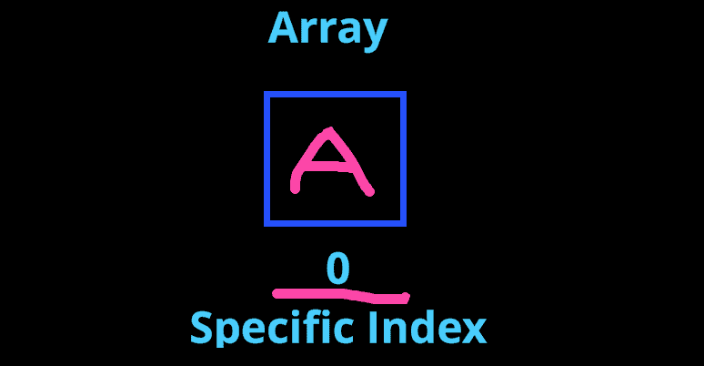
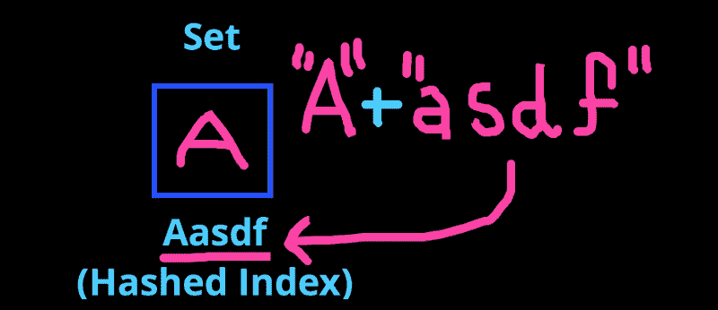
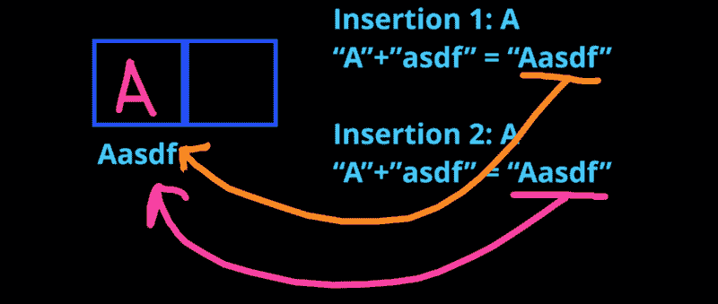
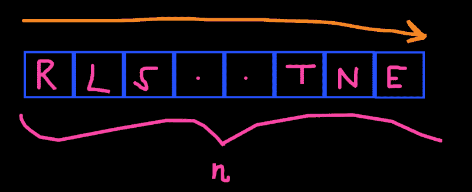

# 学习你的编码基础:集合和数组之间的主要区别

> 原文：<https://www.freecodecamp.org/news/learn-your-coding-fundamentals-the-main-differences-between-sets-and-arrays-4a9ed29bfb2f/>

安东尼·西斯蒂利

# 学习你的编码基础:集合和数组之间的主要区别

我从在锻造厂的 CS 学生那里得到很多的一个问题是为什么我经常在面试问题中使用集合而不是简单的旧数组。

要回答这个问题，我们必须了解集合和数组之间的根本区别。

**如果你是视觉学习者，喜欢视频解释，[这里有一个 3 分钟的视频](https://www.youtube.com/watch?v=2eeH-Outrz8&t=38s)解释了答案(尽管没那么深入)。**

数组是我最先学会使用的数据结构之一。

它们不仅是几乎每个编码应用程序中使用的基本数据结构，而且也相当容易理解。

直到后来在我的软件职业生涯中，我才接触到这个阵列的奇怪但神奇的表亲:

**集合。**

集合就像数组…除了它们不是。

#### 让我们快速提醒自己数组是如何工作的

数组:

*   已订购
*   具有从 0 开始的索引
*   可以包含重复的元素
*   搜索元素时，查找时间为 O(n)

#### 但是，集合的行为稍有不同

集合:

*   **是无序的**(在几乎所有语言中)
*   拥有**个散列索引**
*   **不能包含重复元素**
*   在搜索元素时有一个 **O(1)查找时间**

让我们更深入地了解一下。

### 1.通过哈希设置插入

集合中的元素存储方式与数组中的完全不同。

集合存储其元素的方式是通过**散列。**

#### 假设你想将字符“A”存储在一个集合和一个数组中。

除非另外指定，否则数组将简单地查找下一个可用的索引**、**，并将元素放入该索引中。

Our “A” gets an index of 0 since it’s the first element.

然而，有了散列，事情看起来有点不同。

#### 哈希是如何工作的

**哈希**就是取入输入(x)，用特定的哈希函数(h)扭曲它，得到最终输出(y)的行为。

基本上 h(x) = (y)

看起来有点混乱，对吗？

放心吧！这应该能把事情弄清楚。

散列函数(h)的一个简单例子是在输入(x)的末尾附加“asdf”。

如果(x)是“A ”,附加的“asdf”是(h ),则输出(y)将简单如下:

" A" + "asdf" →"Aasdf "

所以“Aasdf”就是我们的(y)。

#### 那么，集合是如何使用散列的呢？

集合使用散列来决定在哪里存储你的输入(x)。

简而言之，set 接受您的输入，对其进行哈希处理，并将其存储在与哈希处理后的输入匹配的索引处，也就是输出(y)。

Aasdf is the index of our element “A”.

这就是大多数语言中集合是无序的原因。

数组索引很容易，从 0 到 n，所以你很容易记住接下来是什么。

但是对于大多数编译器使用的复杂散列函数，无法找到元素插入的顺序，除非您保留一个二级索引机制。

### 2.集合不能包含重复项

没错！

集合**只能包含唯一的元素。**

与听起来相反，这实际上在很多情况下非常有用，包括谷歌面试问题。

你会问，为什么会这样？

嗯，因为哈希！

因为我的散列函数(h)在我的程序运行时会保持一致，所以输入相同的(x)将总是得到相同的(y)。

这意味着如果我试图插入第二个“A”，我的散列函数将输出与第一个“A”相同的地址，并且**将简单地覆盖它！**

对于数组，它只是将第二个“A”附加到下一个可用的索引。

### 3.集合的查找时间为 O(1)

假设你有一个由 *n* 个元素组成的数组，其中 *n* 是一个很大的数字，你想看看“A”是否存在于这个数组中。

最坏的情况是 A 不存在。

为了找出答案，您必须遍历所有这些元素的所有 *n* ！

ARRAY. OF. FORTUNE!

在查找元素时，这使得数组的时间复杂度为 O(n)。

#### 有了电视机，我们可以节省很多时间

如果我们想知道一个元素是否存在于我们的集合中，我们所要做的就是散列这个元素并检查索引！

记住:存储元素的索引是和元素本身联系在一起的。

因此，如果我们想知道“A”是否存在于我们的集合中，我们只需要散列它(+“asdf”)并检查那个索引！

因为这个过程总是需要恒定的运算量，无论集合有多大，它都有恒定的时间复杂度。

这意味着在查找元素时，集合的时间复杂度为 O(1 ),这是一个巨大的进步！

### 你能想到这在什么情况下有用吗？

如果你不能，看看这个[谷歌面试问题](https://medium.freecodecamp.org/solving-a-google-interview-question-python-2-code-included-eddefcaeffb2)，一套问题就能改变一切！

感谢阅读！

。a

更多数据结构&算法教程和面试准备。TheForge.ca！

我们帮助学生和新毕业生找到他们梦想中的软件工作！